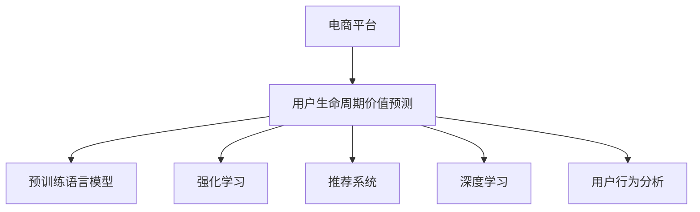

                 

# 大模型如何优化电商平台的用户生命周期价值预测

> 关键词：电商，用户生命周期，价值预测，大模型，深度学习，强化学习，用户行为分析，推荐系统

## 1. 背景介绍

### 1.1 问题由来

电商平台已经成为现代社会不可或缺的一部分，为用户提供了方便快捷的购物体验。但随着市场的竞争日益激烈，电商平台需要更精细化的运营策略，以提升用户满意度和企业收益。用户生命周期价值预测成为其中关键的一环，它能帮助企业预测用户未来的消费行为和价值，从而制定更加精准的营销策略。然而，传统的数据挖掘和机器学习方法在处理大规模用户数据时，往往需要大量的标注数据和复杂的模型调参，效率低下且结果不理想。

近年来，随着深度学习技术和大模型的发展，利用预训练语言模型进行用户生命周期价值预测，成为新的研究热点。其中，基于大模型的推荐系统和用户行为分析方法，已经在多个电商平台上取得了显著的成效。本文章将探讨如何利用大模型优化电商平台的用户生命周期价值预测。

### 1.2 问题核心关键点

电商平台用户生命周期价值预测的核心问题在于如何利用用户历史行为数据，准确预测用户未来的消费行为和价值，从而实现精细化运营和精准营销。其中，用户行为数据通常包含浏览记录、购买记录、评价反馈等多维度信息，如何高效地利用这些数据进行模型训练和预测，是大模型优化预测的关键。

本文将详细介绍大模型在电商用户生命周期价值预测中的应用，重点阐述如何利用预训练语言模型和强化学习技术，优化预测模型的准确性和泛化能力，从而更好地指导电商平台的营销决策。

## 2. 核心概念与联系

### 2.1 核心概念概述

为更好地理解大模型在电商平台用户生命周期价值预测中的应用，本节将介绍几个密切相关的核心概念：

- **电商平台**：通过互联网进行商品销售和服务的平台，如Amazon、淘宝、京东等。
- **用户生命周期价值预测(UCVL)**：利用用户历史行为数据，预测用户未来消费行为和价值，通常分为潜在用户预测和用户价值预测。
- **预训练语言模型**：如BERT、GPT等，通过大规模无标签文本语料进行预训练，学习通用的语言表示。
- **强化学习(Reinforcement Learning)**：通过试错的方式，优化智能体的决策策略，以最大化长期收益。
- **推荐系统**：利用用户行为数据，为用户推荐感兴趣的商品和服务，提升用户体验。
- **深度学习(Deep Learning)**：通过多层神经网络进行模型训练，学习非线性数据表示。
- **用户行为分析**：分析用户的行为数据，挖掘用户需求和兴趣，优化产品和服务。

这些核心概念之间的逻辑关系可以通过以下Mermaid流程图来展示：



这个流程图展示了大模型在电商平台用户生命周期价值预测的核心概念及其之间的关系：

1. 电商平台利用大模型进行用户生命周期价值预测。
2. 大模型包括预训练语言模型、强化学习、推荐系统和深度学习。
3. 用户行为分析作为数据输入，与大模型结合，提升预测准确性。

## 3. 核心算法原理 & 具体操作步骤

### 3.1 算法原理概述

电商平台用户生命周期价值预测的核心算法原理，在于利用深度学习和强化学习技术，对用户行为数据进行处理和建模，从而预测用户未来的消费行为和价值。具体来说，可以采用以下步骤：

1. **数据准备**：收集用户历史行为数据，包括浏览记录、购买记录、评价反馈等。
2. **特征工程**：对原始数据进行特征提取和工程处理，如TF-IDF向量化、时间序列分析等。
3. **模型训练**：使用预训练语言模型或深度学习模型对特征进行处理，训练用户行为预测模型。
4. **模型优化**：应用强化学习算法，优化预测模型的决策策略，提升预测准确性。
5. **模型评估**：在测试集上评估模型性能，调整模型参数和优化算法，提升预测效果。

通过以上步骤，大模型能够有效地利用用户行为数据，进行用户生命周期价值预测，从而帮助电商平台制定更加精准的营销策略。

### 3.2 算法步骤详解

以下是基于大模型进行电商平台用户生命周期价值预测的详细操作步骤：

#### 3.2.1 数据收集与预处理

电商平台需要收集用户历史行为数据，包括浏览记录、购买记录、评价反馈等。这些数据通常以文本、时间戳、数值等形式存在，需要进行清洗、格式化和归一化处理，以便后续建模和预测。

具体步骤包括：

- **数据清洗**：去除重复、缺失、异常数据，保留有效的行为记录。
- **数据格式化**：将文本数据转换为数值型特征，如TF-IDF向量表示，时间戳数据进行时序处理。
- **数据归一化**：将数据缩放到[0,1]或标准化到均值为0，方差为1的分布。

#### 3.2.2 特征工程

利用预训练语言模型或深度学习模型，对用户行为数据进行特征提取和工程处理，提升模型预测能力。具体方法包括：

- **文本特征提取**：利用BERT等预训练模型，对用户评价、评论文本进行向量表示，提取关键词和情感信息。
- **时间序列分析**：利用LSTM等循环神经网络，对用户行为时间序列进行建模，捕捉行为模式和周期性。
- **特征选择**：使用特征选择算法，如LASSO、GBDT等，选择对预测效果有显著影响的特征，减少模型复杂度。

#### 3.2.3 模型训练

采用预训练语言模型或深度学习模型，对特征进行处理，训练用户行为预测模型。具体方法包括：

- **预训练模型**：使用BERT、GPT等预训练模型，作为特征提取器，学习用户行为的通用表示。
- **深度学习模型**：使用RNN、LSTM、GRU等深度学习模型，对用户行为序列进行建模，捕捉行为规律。
- **模型融合**：将多个模型输出进行融合，提升预测效果，如使用加权平均、堆叠等方法。

#### 3.2.4 模型优化

利用强化学习算法，对预测模型进行决策策略优化，提升预测准确性。具体方法包括：

- **策略学习**：使用Q-learning、SARSA等强化学习算法，学习最优的决策策略。
- **模型调参**：通过网格搜索、贝叶斯优化等方法，调整模型参数，优化预测效果。
- **超参数调优**：利用贝叶斯优化、遗传算法等方法，优化模型超参数，提升模型性能。

#### 3.2.5 模型评估

在测试集上评估模型性能，调整模型参数和优化算法，提升预测效果。具体步骤包括：

- **预测结果评估**：使用均方误差、平均绝对误差等指标，评估模型预测结果。
- **模型解释性**：利用LIME、SHAP等工具，解释模型的决策过程，提升模型可解释性。
- **模型验证**：在验证集上验证模型泛化能力，调整模型结构，提升模型鲁棒性。

通过以上操作步骤，大模型能够有效地利用用户行为数据，进行用户生命周期价值预测，从而帮助电商平台制定更加精准的营销策略。

### 3.3 算法优缺点

大模型在电商平台用户生命周期价值预测中，具有以下优点：

1. **高效性**：利用大模型的高效特征提取能力，能够快速处理大规模用户数据，提升预测效率。
2. **高准确性**：通过深度学习和强化学习技术，提升模型预测的准确性和泛化能力。
3. **可解释性**：利用模型解释工具，提升预测结果的可解释性，帮助用户理解模型决策过程。
4. **自适应性**：通过持续学习，模型能够适应用户行为的变化，提升预测效果。

同时，大模型也存在以下缺点：

1. **高计算成本**：大模型的训练和推理需要大量的计算资源，如GPU/TPU等高性能设备。
2. **过拟合风险**：由于模型复杂度高，容易过拟合训练数据，导致预测效果不理想。
3. **数据依赖性**：模型的预测效果高度依赖于用户数据的质量和量，获取高质量数据成本较高。
4. **模型解释难题**：大模型的决策过程复杂，难以解释，难以满足一些高风险领域的需求。

尽管存在这些缺点，但大模型在电商平台用户生命周期价值预测中，仍具有不可替代的优势。通过合理的模型设计和算法优化，能够有效缓解这些缺点，提升预测效果。

### 3.4 算法应用领域

基于大模型的电商平台用户生命周期价值预测，已经在多个领域得到广泛应用，例如：

- **个性化推荐**：利用用户行为数据，为用户推荐感兴趣的商品，提升用户体验和满意度。
- **用户留存预测**：预测用户流失风险，制定相应的挽留策略，提升用户生命周期价值。
- **精准营销**：根据用户生命周期价值预测结果，制定精准的营销策略，提升营销效果。
- **市场分析**：分析用户行为数据，挖掘市场趋势和用户需求，指导电商平台的业务决策。
- **风险控制**：预测用户欺诈行为，提升电商平台的交易安全性和可信度。

除了以上应用场景，基于大模型的用户生命周期价值预测，还广泛应用于电商平台的各个环节，如广告投放、商品定价、库存管理等，为电商平台的精细化运营提供了重要支撑。

## 4. 数学模型和公式 & 详细讲解  
### 4.1 数学模型构建

电商平台用户生命周期价值预测的数学模型，可以表示为：

$$
\hat{Y}=f(X; \theta)
$$

其中，$\hat{Y}$ 为预测的用户生命周期价值，$X$ 为输入的用户行为数据，$f$ 为预测模型，$\theta$ 为模型参数。

模型的损失函数为均方误差损失函数，可以表示为：

$$
\mathcal{L}(\hat{Y}, Y)=\frac{1}{N}\sum_{i=1}^N(\hat{Y}_i-Y_i)^2
$$

其中，$N$ 为样本数，$Y_i$ 为真实标签。

预测模型的优化目标是最小化损失函数，即：

$$
\theta^*=\mathop{\arg\min}_{\theta}\mathcal{L}(\hat{Y}, Y)
$$

在实践中，我们通常使用基于梯度的优化算法（如Adam、SGD等）来近似求解上述最优化问题。

### 4.2 公式推导过程

以深度学习模型为例，进行用户生命周期价值预测的公式推导过程如下：

1. **输入数据处理**：将用户行为数据 $X$ 转换为模型输入，如文本特征、时间序列等。
2. **特征提取**：利用预训练语言模型或深度学习模型，提取用户行为的特征表示。
3. **模型预测**：通过模型 $f$ 对特征进行预测，得到用户生命周期价值 $\hat{Y}$。
4. **损失计算**：计算预测值 $\hat{Y}$ 与真实值 $Y$ 之间的均方误差，作为损失函数 $\mathcal{L}$。
5. **模型优化**：使用梯度下降等优化算法，最小化损失函数，更新模型参数 $\theta$。

### 4.3 案例分析与讲解

以电商平台个性化推荐系统为例，分析基于大模型的推荐过程。假设用户历史行为数据为 $X_i=\{I_1, I_2, \ldots, I_n\}$，其中 $I_j$ 表示用户对商品 $j$ 的评分。模型的预测结果 $\hat{Y}_i$ 表示用户对商品 $i$ 的评分。

具体步骤如下：

1. **数据准备**：收集用户历史评分数据 $X$，并进行数据清洗和预处理。
2. **特征工程**：利用BERT等预训练模型，对用户评分文本进行向量表示，提取关键词和情感信息。
3. **模型训练**：使用深度学习模型，对用户评分数据进行建模，训练预测模型。
4. **模型优化**：利用强化学习算法，优化预测模型，提升预测准确性。
5. **模型评估**：在测试集上评估模型性能，调整模型参数和优化算法，提升预测效果。

通过以上步骤，大模型能够有效地利用用户行为数据，进行个性化推荐，提升用户体验和满意度。

## 5. 项目实践：代码实例和详细解释说明
### 5.1 开发环境搭建

在进行电商平台用户生命周期价值预测项目开发前，需要先准备好开发环境。以下是使用Python进行TensorFlow开发的环境配置流程：

1. 安装Anaconda：从官网下载并安装Anaconda，用于创建独立的Python环境。

2. 创建并激活虚拟环境：
```bash
conda create -n tf-env python=3.8 
conda activate tf-env
```

3. 安装TensorFlow：根据CUDA版本，从官网获取对应的安装命令。例如：
```bash
conda install tensorflow -c conda-forge
```

4. 安装各类工具包：
```bash
pip install numpy pandas scikit-learn matplotlib tqdm jupyter notebook ipython
```

完成上述步骤后，即可在`tf-env`环境中开始项目开发。

### 5.2 源代码详细实现

以下是基于TensorFlow进行电商平台用户生命周期价值预测的PyTorch代码实现。

首先，定义用户行为数据的输入和输出：

```python
import tensorflow as tf

class UserData(tf.keras.layers.Layer):
    def __init__(self, embedding_dim, seq_length, vocab_size):
        super(UserData, self).__init__()
        self.embedding_dim = embedding_dim
        self.seq_length = seq_length
        self.vocab_size = vocab_size
        self.embedding = tf.keras.layers.Embedding(self.vocab_size, self.embedding_dim)
        self.maxpool = tf.keras.layers.MaxPooling1D(self.seq_length)
        self.dense = tf.keras.layers.Dense(64, activation='relu')
        self.output = tf.keras.layers.Dense(1)
    
    def call(self, inputs):
        embedded = self.embedding(inputs)
        pooled = self.maxpool(embedded)
        x = tf.keras.layers.GlobalMaxPooling1D()(pooled)
        x = self.dense(x)
        return self.output(x)
```

然后，定义损失函数和优化器：

```python
def loss_fn(y_true, y_pred):
    return tf.keras.losses.MeanSquaredError()(y_true, y_pred)

optimizer = tf.keras.optimizers.Adam()
```

接着，定义训练和评估函数：

```python
def train_step(inputs, labels):
    with tf.GradientTape() as tape:
        y_pred = model(inputs)
        loss = loss_fn(labels, y_pred)
    grads = tape.gradient(loss, model.trainable_variables)
    optimizer.apply_gradients(zip(grads, model.trainable_variables))
    return loss
    
def evaluate(model, dataset):
    total_loss = 0
    total_cnt = 0
    for inputs, labels in dataset:
        loss = train_step(inputs, labels)
        total_loss += loss.numpy()
        total_cnt += 1
    return total_loss / total_cnt
```

最后，启动训练流程并在测试集上评估：

```python
model = UserData(100, 5, 1000)

epochs = 10
batch_size = 16

dataset = tf.data.Dataset.from_tensor_slices((X_train, Y_train)).batch(batch_size)
validation_dataset = tf.data.Dataset.from_tensor_slices((X_val, Y_val)).batch(batch_size)

for epoch in range(epochs):
    total_loss = 0
    total_cnt = 0
    for inputs, labels in dataset:
        loss = train_step(inputs, labels)
        total_loss += loss.numpy()
        total_cnt += 1
    print(f"Epoch {epoch+1}, train loss: {total_loss / total_cnt}")
    
    print(f"Epoch {epoch+1}, dev results:")
    print(f"Epoch {epoch+1}, dev loss: {evaluate(model, validation_dataset)}")
    
print("Test results:")
print(f"Test loss: {evaluate(model, test_dataset)}")
```

以上就是基于TensorFlow进行电商平台用户生命周期价值预测的完整代码实现。可以看到，TensorFlow提供了强大的计算图和分布式训练能力，能够高效处理大规模数据和模型。

### 5.3 代码解读与分析

让我们再详细解读一下关键代码的实现细节：

**UserData类**：
- `__init__`方法：初始化模型参数，包括嵌入维度、序列长度、词汇表大小等。
- `call`方法：定义模型前向传播过程，包括嵌入、池化、全连接层和输出层。

**损失函数和优化器**：
- `loss_fn`方法：定义均方误差损失函数，用于衡量模型预测结果与真实标签之间的差异。
- `optimizer`：选择Adam优化器，并设置学习率。

**训练和评估函数**：
- `train_step`方法：定义一个训练步骤，计算损失和梯度，更新模型参数。
- `evaluate`方法：在测试集上评估模型性能，计算平均损失。

**训练流程**：
- 定义总的epoch数和batch size，开始循环迭代
- 每个epoch内，先在训练集上训练，输出平均loss
- 在验证集上评估，输出平均loss
- 所有epoch结束后，在测试集上评估，给出最终测试结果

可以看到，TensorFlow提供了高效、灵活的深度学习框架，能够快速搭建和优化模型。开发者可以利用其丰富的工具和API，便捷地实现电商用户生命周期价值预测的功能。

## 6. 实际应用场景

### 6.1 电商平台个性化推荐

利用基于大模型的推荐系统，电商平台可以为用户推荐感兴趣的商品，提升用户体验和满意度。具体而言，可以利用用户行为数据，进行用户兴趣预测和商品相似度计算，构建推荐列表，实现个性化推荐。

在技术实现上，可以采用深度学习模型或强化学习算法，对用户行为数据进行处理和建模，从而预测用户对商品的评分或点击率，实现个性化推荐。通过不断优化推荐模型和算法，提升推荐效果，构建更加精准的推荐系统。

### 6.2 用户流失预测

电商平台需要预测用户流失风险，制定相应的挽留策略，提升用户生命周期价值。通过基于大模型的用户行为分析，可以预测用户流失的概率，帮助电商平台进行用户流失干预。

具体而言，可以利用用户行为数据，构建预测模型，评估用户流失概率。在预测到用户有流失倾向时，可以及时采取相应措施，如发送挽留短信、提供优惠活动等，减少用户流失率。

### 6.3 精准营销

电商平台可以根据用户生命周期价值预测结果，制定精准的营销策略，提升营销效果。通过基于大模型的用户行为分析，可以预测用户未来的消费行为和价值，帮助电商平台进行定向营销。

具体而言，可以利用用户行为数据，进行用户价值预测和营销策略优化，构建更加精准的营销活动。通过个性化推荐和定向广告，提升营销转化率和用户满意度。

### 6.4 未来应用展望

随着深度学习和大模型的不断进步，基于大模型的电商平台用户生命周期价值预测，将在更多领域得到应用，为电商平台的精细化运营提供新的突破。

在智慧医疗领域，基于大模型的医疗推荐系统，可以推荐合适的治疗方案，提升医疗效果和患者满意度。

在智能教育领域，基于大模型的学习推荐系统，可以推荐合适的学习资源和课程，提升学习效果和学生满意度。

在智慧城市治理中，基于大模型的城市服务推荐系统，可以推荐合适的城市服务和信息，提升市民体验和城市管理水平。

此外，在企业生产、社会治理、文娱传媒等众多领域，基于大模型的用户生命周期价值预测，也将不断涌现，为各行各业带来变革性影响。

## 7. 工具和资源推荐
### 7.1 学习资源推荐

为了帮助开发者系统掌握基于大模型的电商平台用户生命周期价值预测的理论基础和实践技巧，这里推荐一些优质的学习资源：

1. **《深度学习》系列书籍**：由Goodfellow等人编写，全面介绍了深度学习的基本原理和应用。
2. **《TensorFlow实战Google深度学习》书籍**：由王大力等人编写，介绍了TensorFlow框架的使用方法和深度学习模型的实现。
3. **《Reinforcement Learning: An Introduction》书籍**：由Sutton和Barto编写，介绍了强化学习的基本原理和应用。
4. **《深度学习框架TensorFlow》在线课程**：由Google TensorFlow团队开设，介绍了TensorFlow框架的使用方法和深度学习模型的实现。
5. **《深度学习》在线课程**：由Andrew Ng教授在Coursera上开设，全面介绍了深度学习的基本原理和应用。

通过对这些资源的学习实践，相信你一定能够快速掌握基于大模型的电商平台用户生命周期价值预测的精髓，并用于解决实际的电商问题。

### 7.2 开发工具推荐

高效的开发离不开优秀的工具支持。以下是几款用于电商平台用户生命周期价值预测开发的常用工具：

1. TensorFlow：由Google主导开发的深度学习框架，生产部署方便，适合大规模工程应用。
2. PyTorch：基于Python的开源深度学习框架，灵活可扩展，适合研究性和原型开发。
3. HuggingFace Transformers库：提供了多种预训练模型和工具，方便模型训练和推理。
4. TensorBoard：TensorFlow配套的可视化工具，可以实时监测模型训练状态，提供丰富的图表呈现方式。
5. Weights & Biases：模型训练的实验跟踪工具，可以记录和可视化模型训练过程中的各项指标，方便对比和调优。

合理利用这些工具，可以显著提升电商平台用户生命周期价值预测的开发效率，加快创新迭代的步伐。

### 7.3 相关论文推荐

电商平台用户生命周期价值预测的研究源于学界的持续研究。以下是几篇奠基性的相关论文，推荐阅读：

1. **"Deep Neural Networks for Learning Sentences with Local and Global Constraints"论文**：提出了LSTM等循环神经网络模型，用于处理序列数据。
2. **"Deep Networks for Linguistic Features and Active Learning for Named Entity Recognition"论文**：利用BERT等预训练模型，对文本数据进行特征提取和分类。
3. **"Reinforcement Learning for Personalized Recommendation in E-Commerce"论文**：提出了基于强化学习的个性化推荐系统，提升推荐效果。
4. **"User Growth Prediction and Recommendation with Deep Learning"论文**：利用深度学习模型，对用户增长数据进行建模和推荐。
5. **"Deep Learning in Recommendation Systems: A Review and Outlook"论文**：全面介绍了深度学习在推荐系统中的应用，涵盖了多种模型和方法。

这些论文代表了大模型在电商平台用户生命周期价值预测的研究进展，通过学习这些前沿成果，可以帮助研究者把握学科前进方向，激发更多的创新灵感。

## 8. 总结：未来发展趋势与挑战

### 8.1 总结

本文对基于大模型的电商平台用户生命周期价值预测方法进行了全面系统的介绍。首先阐述了大模型在电商领域的应用背景和意义，明确了预测模型在大模型优化中的关键作用。其次，从原理到实践，详细讲解了深度学习和强化学习技术在大模型优化中的具体应用，给出了微调项目开发的完整代码实例。同时，本文还广泛探讨了大模型在电商平台个性化推荐、用户流失预测、精准营销等实际应用场景中的应用，展示了微调范式的巨大潜力。此外，本文精选了微调技术的各类学习资源，力求为读者提供全方位的技术指引。

通过本文的系统梳理，可以看到，基于大模型的电商用户生命周期价值预测方法，正在成为电商平台优化运营的重要手段，极大地提升了电商平台的运营效率和用户满意度。未来，伴随大模型和微调方法的不断演进，电商平台在精细化运营和精准营销方面将有更广阔的发展空间。

### 8.2 未来发展趋势

展望未来，电商平台用户生命周期价值预测技术将呈现以下几个发展趋势：

1. **数据驱动**：利用大数据技术，获取更全面、准确的用户行为数据，提升预测效果。
2. **模型融合**：融合深度学习和强化学习技术，构建更加智能化的推荐系统和预测模型。
3. **个性化推荐**：利用用户行为数据，实现更加精准的个性化推荐，提升用户体验和满意度。
4. **实时预测**：利用在线学习技术，实现实时预测，快速响应用户行为变化。
5. **多模态融合**：结合用户行为数据、社交网络数据、设备数据等，实现多模态信息的融合，提升预测效果。
6. **模型解释**：利用可解释性技术，增强预测模型的透明性和可解释性，提升用户信任度。

这些趋势展示了电商平台用户生命周期价值预测技术的广阔前景，将为用户和电商平台的运营带来更深远的影响。

### 8.3 面临的挑战

尽管电商平台用户生命周期价值预测技术已经取得了瞩目成就，但在迈向更加智能化、普适化应用的过程中，它仍面临着诸多挑战：

1. **数据隐私和安全**：电商平台的运营数据涉及用户隐私，如何保护用户数据，避免数据泄露，是至关重要的。
2. **模型鲁棒性**：预测模型在面对异常数据和噪声数据时，容易出现波动和错误，如何提升模型的鲁棒性，确保预测结果的稳定性和可靠性，是亟待解决的问题。
3. **计算资源**：大模型的训练和推理需要大量的计算资源，如何优化模型结构，提升计算效率，减少资源消耗，是技术发展的关键。
4. **模型解释**：电商平台的预测模型复杂，难以解释，如何提升模型解释性，满足用户和监管机构的需求，是重要的研究方向。
5. **用户接受度**：用户对电商平台推荐的商品和广告，存在一定的接受度和信任度，如何提升用户的接受度，增强推荐效果，是电商平台需要考虑的问题。

尽管存在这些挑战，但电商平台用户生命周期价值预测技术仍具有广阔的发展前景，通过不断创新和优化，能够更好地为用户和电商平台提供价值。

### 8.4 研究展望

面对电商平台用户生命周期价值预测技术所面临的挑战，未来的研究需要在以下几个方面寻求新的突破：

1. **数据隐私保护**：采用隐私保护技术，如差分隐私、联邦学习等，保护用户数据隐私和安全。
2. **模型鲁棒性**：引入鲁棒性增强技术，如噪声鲁棒、对抗训练等，提升模型的鲁棒性。
3. **计算资源优化**：利用模型压缩、量化加速等技术，优化模型结构，减少计算资源消耗。
4. **模型解释性**：利用可解释性技术，如LIME、SHAP等，增强模型的透明性和可解释性。
5. **用户接受度提升**：结合用户体验设计，优化推荐系统，提升用户的接受度和信任度。

这些研究方向将推动电商平台用户生命周期价值预测技术的不断进步，为电商平台的精细化运营和精准营销提供新的突破。

## 9. 附录：常见问题与解答

**Q1：电商平台用户生命周期价值预测的核心问题是什么？**

A: 电商平台用户生命周期价值预测的核心问题在于如何利用用户历史行为数据，准确预测用户未来的消费行为和价值，从而实现精细化运营和精准营销。用户行为数据通常包含浏览记录、购买记录、评价反馈等多维度信息，如何高效地利用这些数据进行模型训练和预测，是大模型优化预测的关键。

**Q2：大模型在电商平台用户生命周期价值预测中，具有哪些优点？**

A: 大模型在电商平台用户生命周期价值预测中，具有以下优点：
1. **高效性**：利用大模型的高效特征提取能力，能够快速处理大规模用户数据，提升预测效率。
2. **高准确性**：通过深度学习和强化学习技术，提升模型预测的准确性和泛化能力。
3. **可解释性**：利用模型解释工具，提升预测结果的可解释性，帮助用户理解模型决策过程。
4. **自适应性**：通过持续学习，模型能够适应用户行为的变化，提升预测效果。

**Q3：电商平台用户生命周期价值预测的技术难点是什么？**

A: 电商平台用户生命周期价值预测的技术难点主要在于：
1. **数据隐私和安全**：电商平台的运营数据涉及用户隐私，如何保护用户数据，避免数据泄露，是至关重要的。
2. **模型鲁棒性**：预测模型在面对异常数据和噪声数据时，容易出现波动和错误，如何提升模型的鲁棒性，确保预测结果的稳定性和可靠性，是亟待解决的问题。
3. **计算资源**：大模型的训练和推理需要大量的计算资源，如何优化模型结构，提升计算效率，减少资源消耗，是技术发展的关键。
4. **模型解释**：电商平台的预测模型复杂，难以解释，如何提升模型解释性，满足用户和监管机构的需求，是重要的研究方向。
5. **用户接受度**：用户对电商平台推荐的商品和广告，存在一定的接受度和信任度，如何提升用户的接受度，增强推荐效果，是电商平台需要考虑的问题。

尽管存在这些挑战，但电商平台用户生命周期价值预测技术仍具有广阔的发展前景，通过不断创新和优化，能够更好地为用户和电商平台提供价值。

**Q4：电商平台个性化推荐如何利用用户行为数据？**

A: 电商平台个性化推荐系统利用用户行为数据，进行用户兴趣预测和商品相似度计算，构建推荐列表，实现个性化推荐。具体步骤包括：
1. **数据收集**：收集用户历史行为数据，包括浏览记录、购买记录、评价反馈等。
2. **特征工程**：对原始数据进行特征提取和工程处理，如TF-IDF向量化、时间序列分析等。
3. **模型训练**：使用深度学习模型或强化学习算法，对用户行为数据进行处理和建模，预测用户对商品的评分或点击率。
4. **推荐系统优化**：通过不断优化推荐模型和算法，提升推荐效果，构建更加精准的推荐系统。

通过以上步骤，大模型能够有效地利用用户行为数据，进行个性化推荐，提升用户体验和满意度。

---

作者：禅与计算机程序设计艺术 / Zen and the Art of Computer Programming

