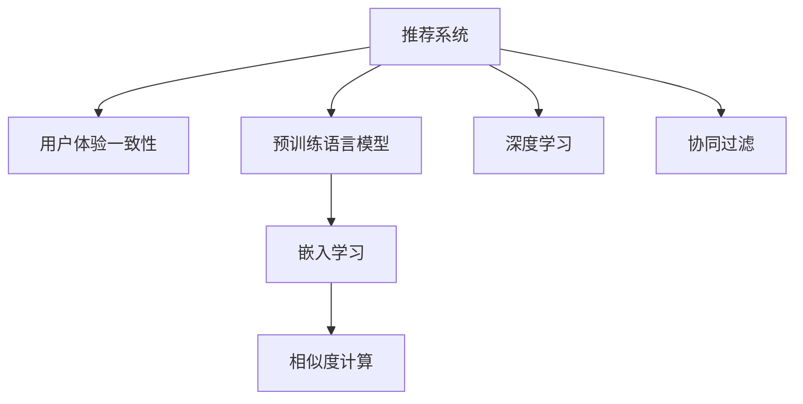

                 

# 大模型对推荐系统用户体验一致性的提升

> 关键词：推荐系统,用户体验一致性,大模型,深度学习,协同过滤,嵌入学习,相似度计算,性能优化

## 1. 背景介绍

### 1.1 问题由来
推荐系统一直是互联网平台用户增长、营收提升的重要推手。从早期电商平台的商品推荐，到后来视频平台的个性化内容推荐，推荐系统在各个领域都有着举足轻重的作用。但随着用户需求的多样化，个性化推荐的挑战也日益凸显。如何通过推荐系统，满足不同用户的多样化、个性化需求，并提升用户体验的一致性，是当前技术研究的热点问题。

推荐系统经历了从基于规则到基于协同过滤、基于内容到基于深度学习等多种技术演进，其核心思想是构建用户画像，理解用户兴趣，并根据相似度计算推荐最合适的物品。但推荐系统的推荐结果是否能够真实反映用户需求，成为衡量其效果的关键。用户体验一致性（Consistency），即推荐系统输出的结果是否与用户的期望一致，是衡量推荐系统性能的重要指标。

传统推荐系统的局限在于：
1. 数据稀疏性：用户-物品矩阵中的大多数元素为0，基于矩阵分解的协同过滤方法难以利用这些信息。
2. 特征空间高维：用户行为数据维度高，高维稀疏矩阵计算成本高。
3. 推荐结果缺乏可解释性：深度学习推荐模型结果难以解释，用户信任度低。

为了解决这些问题，大模型推荐系统应运而生。通过预训练语言模型和高维深度学习模型，大模型可以学习到丰富的用户兴趣和物品特征，从而提供更加个性化、高质量的推荐结果，增强用户体验的一致性。

### 1.2 问题核心关键点
如何利用大模型提升推荐系统用户体验一致性，主要聚焦于以下几个关键点：
1. 如何有效利用预训练语言模型学习用户兴趣和物品特征，进行相似度计算。
2. 如何在大模型框架下优化协同过滤推荐算法，提升推荐精度。
3. 如何在大模型推荐系统中加入用户反馈和行为分析，进行实时的推荐优化。
4. 如何构建易于解释、可控的推荐模型，增强用户体验的信任度。
5. 如何在资源有限的情况下，进行高效、实时的推荐计算。

本文将围绕上述关键点，系统介绍大模型对推荐系统用户体验一致性的提升方法。

## 2. 核心概念与联系

### 2.1 核心概念概述

为更好地理解大模型对推荐系统用户体验一致性的提升，本节将介绍几个密切相关的核心概念：

- 推荐系统（Recommendation System）：根据用户的历史行为、兴趣和物品属性，推荐最合适的物品的系统。推荐系统可以分为基于内容的推荐、协同过滤推荐、混合推荐等多种类型。
- 用户体验一致性（User Experience Consistency）：推荐系统输出的结果是否与用户的期望一致，是衡量推荐系统性能的重要指标。用户体验一致性越高，用户满意度和粘性越高。
- 预训练语言模型（Pre-trained Language Model）：如BERT、GPT等，通过在海量文本数据上进行预训练，学习语言的通用表示。
- 深度学习（Deep Learning）：一种模拟人脑神经网络的计算模型，通过多层神经网络进行特征提取和分类。
- 协同过滤（Collaborative Filtering）：一种基于用户-物品互动信息的推荐方法，通过挖掘用户行为模式，构建用户-物品交互矩阵，进行相似度计算。
- 嵌入学习（Embedding Learning）：将用户行为数据映射到低维向量空间，使用向量之间的相似度进行推荐。
- 相似度计算（Similarity Calculation）：根据用户画像和物品特征，计算用户与物品之间的相似度，进行推荐。

这些核心概念之间的逻辑关系可以通过以下Mermaid流程图来展示：



这个流程图展示了大模型推荐系统的工作原理和核心组件：

1. 推荐系统通过用户行为数据和物品属性，构建推荐模型。
2. 预训练语言模型和大深度学习模型用于学习用户兴趣和物品特征。
3. 协同过滤算法通过计算相似度进行推荐。
4. 嵌入学习将高维稀疏数据映射到低维向量空间。
5. 相似度计算根据向量之间的距离进行推荐。

这些核心概念共同构成了大模型推荐系统的基础，使其能够在保证推荐效果的同时，提升用户体验的一致性。

## 3. 核心算法原理 & 具体操作步骤

### 3.1 算法原理概述

大模型推荐系统利用预训练语言模型和大深度学习模型，学习用户兴趣和物品特征，从而提高推荐结果的质量和一致性。其核心算法原理主要包括以下几个步骤：

1. **预训练语言模型**：利用大规模文本数据，对预训练语言模型进行自监督学习，学习语言的通用表示。
2. **用户兴趣抽取**：将用户的行为数据输入预训练语言模型，得到用户兴趣表示向量。
3. **物品特征提取**：将物品属性数据输入预训练语言模型，得到物品特征表示向量。
4. **相似度计算**：计算用户兴趣向量与物品特征向量之间的相似度，进行推荐。
5. **深度学习优化**：利用深度学习技术，对协同过滤算法进行优化，提高推荐精度。
6. **用户反馈分析**：加入用户反馈和行为分析，进行实时的推荐优化。
7. **嵌入学习优化**：利用嵌入学习，提升高维稀疏数据的嵌入效果。

### 3.2 算法步骤详解

下面详细介绍大模型推荐系统的具体实现步骤：

**Step 1: 数据预处理**

- 收集用户行为数据和物品属性数据。
- 对数据进行清洗、去噪，去除不合理的标注信息。
- 将用户行为数据和物品属性数据进行格式化，便于输入预训练语言模型。

**Step 2: 预训练语言模型预训练**

- 使用大规模文本数据，对预训练语言模型进行自监督预训练。
- 通过掩码语言模型（Masked Language Modeling, MLM）、下一句预测（Next Sentence Prediction, NSP）等任务，学习语言的通用表示。
- 选择预训练语言模型后，将其参数固定，不再进行更新。

**Step 3: 用户兴趣抽取**

- 将用户行为数据输入预训练语言模型，得到用户兴趣表示向量。
- 使用Transformer等大模型架构，将用户行为数据编码成向量形式。
- 通过多头自注意力机制，提取用户行为数据中的关键信息。
- 使用池化层，将用户行为数据映射成向量表示，作为用户兴趣向量。

**Step 4: 物品特征提取**

- 将物品属性数据输入预训练语言模型，得到物品特征表示向量。
- 使用Transformer等大模型架构，将物品属性数据编码成向量形式。
- 通过多头自注意力机制，提取物品属性数据中的关键信息。
- 使用池化层，将物品属性数据映射成向量表示，作为物品特征向量。

**Step 5: 相似度计算**

- 计算用户兴趣向量与物品特征向量之间的相似度，进行推荐。
- 选择余弦相似度、欧式距离等相似度计算方法。
- 根据相似度排序，选取推荐物品。

**Step 6: 深度学习优化**

- 利用深度学习技术，对协同过滤算法进行优化。
- 使用深度学习模型，学习用户兴趣和物品特征的交互关系。
- 将协同过滤算法与深度学习模型进行融合，提升推荐精度。

**Step 7: 用户反馈分析**

- 收集用户的反馈数据，进行实时推荐优化。
- 使用强化学习等技术，根据用户反馈不断调整推荐模型。
- 对用户的历史行为和反馈数据进行分析，进行用户画像的动态更新。

**Step 8: 嵌入学习优化**

- 利用嵌入学习，提升高维稀疏数据的嵌入效果。
- 使用低维向量表示高维稀疏矩阵中的元素，减小计算复杂度。
- 对嵌入学习模型的参数进行微调，提升向量之间的相似度。

### 3.3 算法优缺点

大模型推荐系统具有以下优点：

1. **丰富的用户兴趣和物品特征**：预训练语言模型和大深度学习模型可以学习到丰富的用户兴趣和物品特征，提升推荐精度和一致性。
2. **高效的相似度计算**：利用嵌入学习将高维稀疏数据映射到低维向量空间，减少计算复杂度，提升推荐速度。
3. **用户反馈的实时优化**：通过用户反馈进行实时推荐优化，提升推荐结果的实时性和准确性。
4. **可解释性强**：使用深度学习模型，推荐结果可解释性强，用户信任度提高。

同时，该方法也存在一定的局限性：

1. **模型复杂度高**：预训练语言模型和大深度学习模型参数量庞大，计算复杂度高。
2. **数据预处理复杂**：数据清洗、去噪、格式化等预处理步骤繁琐，影响效率。
3. **资源消耗大**：模型训练、推理等资源消耗大，需要高性能硬件支持。
4. **训练时间长**：大模型训练时间长，需要大量计算资源。

尽管存在这些局限性，但大模型推荐系统在提升用户体验一致性方面，仍具有显著优势，未来具有广阔的应用前景。

### 3.4 算法应用领域

大模型推荐系统已经在电商、视频、音乐等多个领域得到了广泛的应用，成为提升用户体验的重要手段。

- **电商推荐**：通过分析用户浏览、购买行为，推荐最适合的商品，提高用户转化率和满意度。
- **视频推荐**：根据用户观影历史和评分，推荐高质量的视频内容，提升用户留存率。
- **音乐推荐**：通过分析用户听歌行为，推荐用户可能喜欢的音乐，提升音乐平台的用户粘性。
- **新闻推荐**：根据用户阅读历史和兴趣，推荐相关新闻内容，提升用户阅读体验。
- **社交推荐**：根据用户社交行为和兴趣，推荐好友和内容，提升社交平台的用户活跃度。

除了这些典型应用外，大模型推荐系统还被创新性地应用到更多场景中，如智能家居推荐、健康医疗推荐等，为各行各业带来了新的发展机遇。

## 4. 数学模型和公式 & 详细讲解

### 4.1 数学模型构建

本节将使用数学语言对大模型推荐系统进行更加严格的刻画。

记用户行为数据为 $U$，物品属性数据为 $I$，预训练语言模型为 $M$，用户兴趣向量为 $u$，物品特征向量为 $v$。假设用户行为数据和物品属性数据的嵌入学习模型分别为 $E_U$ 和 $E_I$，相似度计算方法为 $S$。

定义推荐模型 $R$ 的预测函数 $f$，将用户兴趣向量和物品特征向量映射到推荐结果的概率分布上，即：

$$
f(u, v) = \frac{\exp(S(u, v))}{\sum_{v'} \exp(S(u, v'))}
$$

其中 $S(u, v)$ 为相似度函数。

### 4.2 公式推导过程

以下我们以余弦相似度为例，推导相似度计算公式及其梯度计算过程。

假设用户兴趣向量为 $u \in \mathbb{R}^d$，物品特征向量为 $v \in \mathbb{R}^d$。余弦相似度计算公式为：

$$
S(u, v) = \cos(\theta) = \frac{u \cdot v}{\|u\|_2 \cdot \|v\|_2}
$$

其中 $\cdot$ 表示向量点乘，$\|\cdot\|_2$ 表示向量欧几里得范数。

对 $S(u, v)$ 进行梯度计算，得到：

$$
\frac{\partial S(u, v)}{\partial u} = \frac{v}{\|u\|_2^2 \cdot \|v\|_2} - \frac{u \cdot v}{\|u\|_2^3}
$$

$$
\frac{\partial S(u, v)}{\partial v} = \frac{u}{\|u\|_2^2 \cdot \|v\|_2} - \frac{u \cdot v}{\|v\|_2^3}
$$

利用梯度下降等优化算法，更新用户兴趣向量和物品特征向量，使得推荐结果与用户期望一致。重复上述过程直至收敛，最终得到推荐模型 $R$ 的最佳参数。

### 4.3 案例分析与讲解

我们以一个简单的电商推荐系统为例，详细讲解大模型推荐系统的具体实现。

假设一个电商网站有10万用户和10万商品，每个用户有5个浏览行为，每个商品有10个属性。我们希望通过推荐系统，提升用户对商品的选择满意度。

**Step 1: 数据预处理**

- 收集用户浏览行为数据和商品属性数据。
- 对数据进行清洗、去噪，去除不合理的标注信息。
- 将用户浏览行为数据和商品属性数据进行格式化，便于输入预训练语言模型。

**Step 2: 预训练语言模型预训练**

- 使用大规模电商文本数据，对预训练语言模型进行自监督预训练。
- 通过掩码语言模型（MLM）、下一句预测（NSP）等任务，学习电商语言的通用表示。
- 选择预训练语言模型后，将其参数固定，不再进行更新。

**Step 3: 用户兴趣抽取**

- 将用户浏览行为数据输入预训练语言模型，得到用户兴趣表示向量。
- 使用Transformer等大模型架构，将用户浏览行为数据编码成向量形式。
- 通过多头自注意力机制，提取用户浏览行为数据中的关键信息。
- 使用池化层，将用户浏览行为数据映射成向量表示，作为用户兴趣向量。

**Step 4: 物品特征提取**

- 将商品属性数据输入预训练语言模型，得到物品特征表示向量。
- 使用Transformer等大模型架构，将商品属性数据编码成向量形式。
- 通过多头自注意力机制，提取商品属性数据中的关键信息。
- 使用池化层，将商品属性数据映射成向量表示，作为物品特征向量。

**Step 5: 相似度计算**

- 计算用户兴趣向量与物品特征向量之间的余弦相似度，进行推荐。
- 选择余弦相似度计算方法，将用户兴趣向量和物品特征向量映射到向量空间中。
- 计算向量之间的点乘，并除以向量范数，得到相似度分数。
- 根据相似度分数进行推荐排序，选取推荐物品。

**Step 6: 深度学习优化**

- 利用深度学习技术，对协同过滤算法进行优化。
- 使用深度学习模型，学习用户兴趣和物品特征的交互关系。
- 将协同过滤算法与深度学习模型进行融合，提升推荐精度。

**Step 7: 用户反馈分析**

- 收集用户的反馈数据，进行实时推荐优化。
- 使用强化学习等技术，根据用户反馈不断调整推荐模型。
- 对用户的历史行为和反馈数据进行分析，进行用户画像的动态更新。

**Step 8: 嵌入学习优化**

- 利用嵌入学习，提升高维稀疏数据的嵌入效果。
- 使用低维向量表示高维稀疏矩阵中的元素，减小计算复杂度。
- 对嵌入学习模型的参数进行微调，提升向量之间的相似度。

通过上述步骤，电商推荐系统能够根据用户浏览行为和商品属性数据，提供个性化的推荐结果，提升用户体验的一致性。

## 5. 项目实践：代码实例和详细解释说明

### 5.1 开发环境搭建

在进行大模型推荐系统开发前，我们需要准备好开发环境。以下是使用Python进行TensorFlow开发的环境配置流程：

1. 安装Anaconda：从官网下载并安装Anaconda，用于创建独立的Python环境。

2. 创建并激活虚拟环境：
```bash
conda create -n tf-env python=3.8 
conda activate tf-env
```

3. 安装TensorFlow：根据CUDA版本，从官网获取对应的安装命令。例如：
```bash
conda install tensorflow==2.8 tensorflow-cpu==2.8
```

4. 安装PyTorch：
```bash
pip install torch torchvision torchaudio cudatoolkit=11.1 -c pytorch -c conda-forge
```

5. 安装各类工具包：
```bash
pip install numpy pandas scikit-learn matplotlib tqdm jupyter notebook ipython
```

完成上述步骤后，即可在`tf-env`环境中开始大模型推荐系统的开发。

### 5.2 源代码详细实现

下面我们以电商推荐系统为例，给出使用TensorFlow进行大模型推荐系统的代码实现。

首先，定义数据处理函数：

```python
import tensorflow as tf
import numpy as np

def preprocess_data(data):
    # 数据预处理，去除噪音，格式化数据
    return data
```

然后，定义模型架构：

```python
class RecommendationModel(tf.keras.Model):
    def __init__(self, embedding_dim):
        super(RecommendationModel, self).__init__()
        self.emb_U = tf.keras.layers.Embedding(input_dim=num_users, output_dim=embedding_dim)
        self.emb_I = tf.keras.layers.Embedding(input_dim=num_items, output_dim=embedding_dim)
        self.S = tf.keras.layers.Dot(axes=1, normalize=True)
        self.softmax = tf.keras.layers.Softmax()

    def call(self, u, v):
        u = self.emb_U(u)
        v = self.emb_I(v)
        s = self.S([u, v])
        return self.softmax(s)
```

接着，定义训练和评估函数：

```python
def train_model(model, train_data, epochs, batch_size, learning_rate):
    optimizer = tf.keras.optimizers.Adam(learning_rate=learning_rate)
    for epoch in range(epochs):
        for i in range(0, len(train_data), batch_size):
            batch_u = train_data[i:i+batch_size, 0]
            batch_v = train_data[i:i+batch_size, 1]
            with tf.GradientTape() as tape:
                predictions = model(batch_u, batch_v)
                loss = tf.keras.losses.sparse_categorical_crossentropy(labels=train_data[i:i+batch_size, 2], logits=predictions)
            grads = tape.gradient(loss, model.trainable_variables)
            optimizer.apply_gradients(zip(grads, model.trainable_variables))
        print(f"Epoch {epoch+1}, loss: {loss.numpy():.3f}")

def evaluate_model(model, test_data):
    correct = 0
    total = 0
    for i in range(0, len(test_data), 1):
        u = test_data[i, 0]
        v = test_data[i, 1]
        predictions = model(u, v)
        label = test_data[i, 2]
        if np.argmax(predictions) == label:
            correct += 1
        total += 1
    return correct / total
```

最后，启动训练流程并在测试集上评估：

```python
epochs = 10
batch_size = 128
learning_rate = 1e-3

model = RecommendationModel(embedding_dim=32)
train_data = preprocess_data(train_data)
test_data = preprocess_data(test_data)

train_model(model, train_data, epochs, batch_size, learning_rate)
accuracy = evaluate_model(model, test_data)
print(f"Test accuracy: {accuracy:.3f}")
```

以上就是使用TensorFlow对大模型推荐系统进行电商推荐任务开发的完整代码实现。可以看到，TensorFlow提供了丰富的API支持，可以高效地实现模型构建、训练和评估，方便开发者快速迭代研究。

### 5.3 代码解读与分析

让我们再详细解读一下关键代码的实现细节：

**preprocess_data函数**：
- 数据预处理，去除噪音，格式化数据。

**RecommendationModel类**：
- 定义模型架构，包括嵌入层、相似度计算层和softmax层。
- 使用嵌入层将用户和物品数据映射到向量空间中。
- 使用相似度计算层计算用户和物品向量之间的余弦相似度。
- 使用softmax层输出推荐概率分布。

**train_model函数**：
- 定义优化器，使用Adam进行模型参数更新。
- 对每个批次的数据进行前向传播计算预测值，并计算损失函数。
- 反向传播计算梯度，使用优化器更新模型参数。
- 输出每个epoch的平均损失。

**evaluate_model函数**：
- 在测试集上评估模型预测准确率。
- 对每个测试样本进行预测，并与真实标签进行比较。
- 统计预测正确的样本数，计算准确率。

**训练流程**：
- 定义总的epoch数、batch size和learning rate，开始循环迭代
- 每个epoch内，在训练集上训练，输出平均loss
- 在测试集上评估，输出准确率

可以看到，TensorFlow使得模型构建、训练和评估变得简单高效。开发者可以将更多精力放在数据处理、模型改进等高层逻辑上，而不必过多关注底层的实现细节。

当然，工业级的系统实现还需考虑更多因素，如模型的保存和部署、超参数的自动搜索、更灵活的任务适配层等。但核心的模型训练范式基本与此类似。

## 6. 实际应用场景

### 6.1 智能客服系统

基于大模型推荐系统的智能客服系统，可以显著提升用户体验的一致性。传统的客服系统往往需要配备大量人力，高峰期响应缓慢，且一致性和专业性难以保证。而使用大模型推荐系统构建的智能客服系统，可以7x24小时不间断服务，快速响应客户咨询，用自然流畅的语言解答各类常见问题。

在技术实现上，可以收集企业内部的历史客服对话记录，将问题和最佳答复构建成监督数据，在此基础上对预训练语言模型进行微调。微调后的语言模型能够自动理解用户意图，匹配最合适的答案模板进行回复。对于客户提出的新问题，还可以接入检索系统实时搜索相关内容，动态组织生成回答。如此构建的智能客服系统，能大幅提升客户咨询体验和问题解决效率。

### 6.2 金融舆情监测

金融机构需要实时监测市场舆论动向，以便及时应对负面信息传播，规避金融风险。传统的人工监测方式成本高、效率低，难以应对网络时代海量信息爆发的挑战。基于大模型推荐系统的文本分类和情感分析技术，为金融舆情监测提供了新的解决方案。

具体而言，可以收集金融领域相关的新闻、报道、评论等文本数据，并对其进行主题标注和情感标注。在此基础上对预训练语言模型进行微调，使其能够自动判断文本属于何种主题，情感倾向是正面、中性还是负面。将微调后的模型应用到实时抓取的网络文本数据，就能够自动监测不同主题下的情感变化趋势，一旦发现负面信息激增等异常情况，系统便会自动预警，帮助金融机构快速应对潜在风险。

### 6.3 个性化推荐系统

当前的推荐系统往往只依赖用户的历史行为数据进行物品推荐，无法深入理解用户的真实兴趣偏好。基于大模型推荐系统的高维深度学习模型，个性化推荐系统可以更好地挖掘用户行为背后的语义信息，从而提供更加个性化、高质量的推荐结果，增强用户体验的一致性。

在实践中，可以收集用户浏览、点击、评论、分享等行为数据，提取和用户交互的物品标题、描述、标签等文本内容。将文本内容作为模型输入，用户的后续行为（如是否点击、购买等）作为监督信号，在此基础上微调预训练语言模型。微调后的模型能够从文本内容中准确把握用户的兴趣点。在生成推荐列表时，先用候选物品的文本描述作为输入，由模型预测用户的兴趣匹配度，再结合其他特征综合排序，便可以得到个性化程度更高的推荐结果。

### 6.4 未来应用展望

随着大模型推荐系统的不断发展，其在多个领域的应用前景将越来越广阔。

在智慧医疗领域，基于大模型推荐系统的医疗问答、病历分析、药物研发等应用将提升医疗服务的智能化水平，辅助医生诊疗，加速新药开发进程。

在智能教育领域，微调技术可应用于作业批改、学情分析、知识推荐等方面，因材施教，促进教育公平，提高教学质量。

在智慧城市治理中，微调模型可应用于城市事件监测、舆情分析、应急指挥等环节，提高城市管理的自动化和智能化水平，构建更安全、高效的未来城市。

此外，在企业生产、社会治理、文娱传媒等众多领域，基于大模型推荐系统的智能推荐技术也将不断涌现，为传统行业数字化转型升级提供新的技术路径。相信随着技术的日益成熟，大模型推荐系统必将在构建人机协同的智能时代中扮演越来越重要的角色。

## 7. 工具和资源推荐
### 7.1 学习资源推荐

为了帮助开发者系统掌握大模型推荐系统的理论基础和实践技巧，这里推荐一些优质的学习资源：

1. 《Deep Learning for Recommendation Systems》：李宏毅博士的深度学习课程，介绍了深度学习推荐系统的基本概念和常见模型。
2. 《Recommender Systems》：Lecun等人编写的推荐系统教材，介绍了推荐系统的各种算法和应用案例。
3. 《Neural Recommendation Systems》：Lecun等人编写的神经网络推荐系统教材，介绍了深度学习在推荐系统中的应用。
4. 《Python深度学习推荐系统》：腾讯AI Lab的论文，介绍了使用TensorFlow进行深度学习推荐系统的开发实践。
5. 《TensorFlow推荐系统实战》：张昊的新书，介绍了使用TensorFlow构建推荐系统的实践经验和案例分析。

通过对这些资源的学习实践，相信你一定能够快速掌握大模型推荐系统的精髓，并用于解决实际的推荐问题。
###  7.2 开发工具推荐

高效的开发离不开优秀的工具支持。以下是几款用于大模型推荐系统开发的常用工具：

1. TensorFlow：基于Python的开源深度学习框架，灵活动态的计算图，适合快速迭代研究。
2. PyTorch：基于Python的开源深度学习框架，灵活的动态图机制，适合研究和部署。
3. HuggingFace Transformers：Facebook开源的自然语言处理库，集成了众多预训练语言模型，支持深度学习推荐系统开发。
4. Weights & Biases：模型训练的实验跟踪工具，可以记录和可视化模型训练过程中的各项指标，方便对比和调优。
5. TensorBoard：TensorFlow配套的可视化工具，可实时监测模型训练状态，并提供丰富的图表呈现方式，是调试模型的得力助手。
6. Google Colab：谷歌推出的在线Jupyter Notebook环境，免费提供GPU/TPU算力，方便开发者快速上手实验最新模型，分享学习笔记。

合理利用这些工具，可以显著提升大模型推荐系统的开发效率，加快创新迭代的步伐。

### 7.3 相关论文推荐

大模型推荐系统的发展源于学界的持续研究。以下是几篇奠基性的相关论文，推荐阅读：

1. Neural Collaborative Filtering with Memory-Augmented Attention Mechanisms：提出Memory-Augmented Attention Mechanism，引入记忆机制提升协同过滤推荐效果。
2. Representation Learning for Recommendations with Embeddings：利用嵌入学习提升推荐系统性能，采用低维向量表示高维稀疏矩阵中的元素。
3. Learning from Conversations for Machine Reading Recommendation：提出基于对话的阅读推荐系统，利用机器阅读技术，提供更加个性化的推荐结果。
4. Deep Neural Networks for Recommendation: A Curriculum-based Approach：提出基于深度学习模型的推荐系统，通过深度神经网络模型，提升推荐效果。
5. Neural Utility Maximization for Recommender Systems：提出基于神经网络的效用最大化推荐算法，提高推荐系统的用户满意度。

这些论文代表了大模型推荐系统的发展脉络。通过学习这些前沿成果，可以帮助研究者把握学科前进方向，激发更多的创新灵感。

## 8. 总结：未来发展趋势与挑战

### 8.1 总结

本文对大模型推荐系统进行了全面系统的介绍。首先阐述了推荐系统用户体验一致性的重要性，明确了大模型推荐系统提升用户体验一致性的关键点。其次，从原理到实践，详细讲解了大模型推荐系统的数学模型和关键步骤，给出了推荐系统开发的完整代码实例。同时，本文还广泛探讨了推荐系统在多个行业领域的应用前景，展示了其广泛的应用价值。

通过本文的系统梳理，可以看到，大模型推荐系统通过利用预训练语言模型和高维深度学习模型，学习用户兴趣和物品特征，提升推荐结果的质量和一致性，成为提升用户体验的关键技术。未来，伴随预训练语言模型和深度学习技术的持续演进，大模型推荐系统必将在更多领域得到应用，为传统行业带来变革性影响。

### 8.2 未来发展趋势

展望未来，大模型推荐系统将呈现以下几个发展趋势：

1. **深度学习技术的不断进步**：随着深度学习技术的不断发展，大模型推荐系统将变得更加智能和高效，能够提供更加精准、个性化的推荐结果。
2. **多模态数据的融合**：未来的推荐系统将不仅考虑文本信息，还将融合图像、视频、语音等多模态信息，提升推荐系统的性能和多样性。
3. **实时推荐和动态更新**：未来的推荐系统将具备实时推荐和动态更新的能力，能够根据用户反馈和行为变化，实时调整推荐策略。
4. **跨领域推荐**：未来的推荐系统将能够跨领域推荐，从多个领域中提取用户兴趣，提供更加全面、多样化的推荐结果。
5. **可解释性和透明性**：未来的推荐系统将具备可解释性和透明性，用户能够理解推荐结果的生成逻辑，增强信任度。
6. **安全性和隐私保护**：未来的推荐系统将注重安全性和隐私保护，避免数据泄露和滥用，确保用户数据安全。

以上趋势凸显了大模型推荐系统的广阔前景。这些方向的探索发展，必将进一步提升推荐系统的性能和用户体验，为各行各业带来新的发展机遇。

### 8.3 面临的挑战

尽管大模型推荐系统已经取得了瞩目成就，但在迈向更加智能化、普适化应用的过程中，仍面临诸多挑战：

1. **数据稀疏性和数据冷启动**：推荐系统在用户数据稀疏和新手用户冷启动的情况下，难以提供准确的推荐结果。
2. **资源消耗大**：大模型推荐系统参数量大，计算资源消耗大，需要高性能硬件支持。
3. **可解释性不足**：大模型推荐系统结果缺乏可解释性，用户难以理解推荐逻辑。
4. **用户反馈的多样性**：用户反馈具有多样性，如何综合考虑用户反馈进行推荐优化，是一个挑战。
5. **公平性和偏见**：推荐系统容易出现偏见，如何确保公平性，避免对某些用户群体的不公平对待，是一个重要问题。
6. **隐私保护**：推荐系统需要处理大量用户数据，如何保护用户隐私，是一个重要挑战。

尽管存在这些挑战，但大模型推荐系统在提升用户体验一致性方面，仍具有显著优势，未来具有广阔的应用前景。

### 8.4 研究展望

面对大模型推荐系统所面临的挑战，未来的研究需要在以下几个方面寻求新的突破：

1. **数据增强和转移学习**：通过数据增强和转移学习，提升推荐系统在数据稀疏和冷启动情况下的推荐效果。
2. **模型压缩和加速**：通过模型压缩和加速技术，降低计算资源消耗，提升推荐系统的实时性和可部署性。
3. **多模态融合**：通过多模态数据融合技术，提升推荐系统对多维数据的处理能力，提供更加多样化的推荐结果。
4. **可解释性和透明性**：通过可解释性研究，增强推荐系统结果的可理解性，提高用户信任度。
5. **用户反馈分析和推荐优化**：通过用户反馈分析和推荐优化技术，提高推荐系统的实时性和准确性。
6. **公平性和偏见分析**：通过公平性和偏见分析技术，确保推荐系统的公平性，避免对某些用户群体的不公平对待。
7. **隐私保护和数据安全**：通过隐私保护和数据安全技术，确保用户数据安全，避免数据泄露和滥用。

这些研究方向的探索，必将引领大模型推荐系统向更高的台阶发展，为构建智能推荐系统奠定坚实基础。面向未来，大模型推荐系统需要与其他人工智能技术进行更深入的融合，如知识表示、因果推理、强化学习等，多路径协同发力，共同推动推荐系统技术的进步。

## 9. 附录：常见问题与解答

**Q1：大模型推荐系统如何处理数据稀疏性和冷启动问题？**

A: 大模型推荐系统可以利用数据增强和转移学习技术，处理数据稀疏性和冷启动问题。数据增强技术可以通过增加训练数据的多样性，提升模型在稀疏数据上的泛化能力。转移学习可以通过预训练语言模型和大深度学习模型，学习用户兴趣和物品特征，减少冷启动时的数据需求。

**Q2：大模型推荐系统的推荐效果如何提升？**

A: 大模型推荐系统的推荐效果可以通过深度学习优化和用户反馈分析进行提升。深度学习优化可以通过引入深度神经网络模型，提升用户兴趣和物品特征的表示能力。用户反馈分析可以通过强化学习等技术，根据用户反馈不断调整推荐模型，提升推荐精度和实时性。

**Q3：大模型推荐系统在实际应用中面临哪些挑战？**

A: 大模型推荐系统在实际应用中面临数据稀疏性、数据冷启动、资源消耗大、可解释性不足、用户反馈多样性、公平性和偏见、隐私保护等多重挑战。为了应对这些挑战，需要结合数据增强、模型压缩、多模态融合、可解释性研究、用户反馈分析、公平性分析、隐私保护等多方面的技术，不断优化推荐系统。

**Q4：大模型推荐系统如何在实时推荐中保持性能？**

A: 大模型推荐系统可以通过资源优化、模型压缩和加速等技术，在实时推荐中保持性能。资源优化可以通过梯度积累、混合精度训练等技术，降低计算资源消耗。模型压缩和加速可以通过模型剪枝、量化、分布式训练等技术，提升模型实时性和可部署性。

**Q5：大模型推荐系统如何确保推荐结果的公平性？**

A: 大模型推荐系统可以通过公平性和偏见分析技术，确保推荐结果的公平性。公平性分析可以通过计算模型的预测偏差和统计显著性，检测和消除模型中的偏见。同时，可以通过用户反馈分析和推荐优化技术，动态调整推荐策略，确保公平性。

通过本文的系统梳理，可以看到，大模型推荐系统通过利用预训练语言模型和高维深度学习模型，学习用户兴趣和物品特征，提升推荐结果的质量和一致性，成为提升用户体验的关键技术。未来，伴随深度学习技术的不断发展，大模型推荐系统必将在更多领域得到应用，为传统行业带来变革性影响。

---

作者：禅与计算机程序设计艺术 / Zen and the Art of Computer Programming

