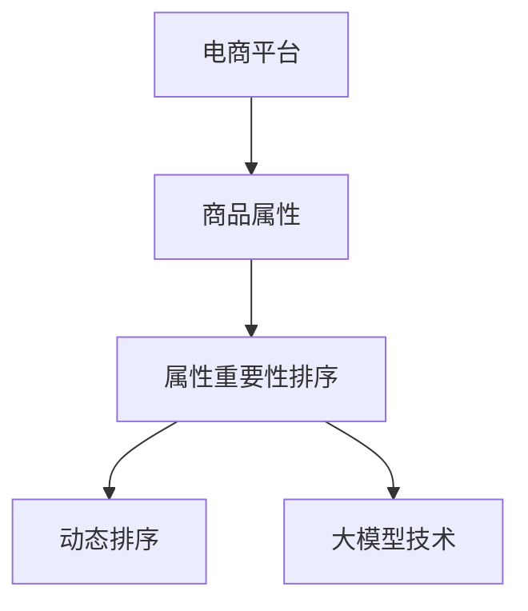

                 

# 大模型技术在电商平台商品属性重要性动态排序中的应用

> 关键词：大模型技术, 电商平台, 商品属性, 重要性排序, 深度学习, 电商推荐系统, 属性选择模型, 动态排序, 预测算法

## 1. 背景介绍

### 1.1 问题由来

在电商平台，商品属性信息是影响用户购买决策的重要因素。准确地识别和排序商品属性，能够极大地提升用户购买体验和平台推荐效果。传统的商品属性排序方法基于统计学模型，如因子分析、聚类算法等，这些方法依赖于大量手工标注和领域知识，难以扩展到大规模商品属性。而基于大模型技术，特别是深度学习的方法，可以有效地克服这些缺点，实现更全面、自动化的属性重要性排序。

### 1.2 问题核心关键点

本文聚焦于电商平台商品属性重要性动态排序问题，主要涉及以下几个关键点：

- **大模型技术**：利用预训练语言模型在电商场景下的应用，获取属性之间的语义关系。
- **商品属性排序**：通过学习商品描述文本，自动生成属性重要性的排序列表。
- **动态排序**：结合用户历史行为数据，动态调整属性排序，提高推荐效果。

### 1.3 问题研究意义

对商品属性进行重要性排序，能够提升电商平台推荐系统的精准度和用户满意度。具体而言：

- **提升推荐精度**：通过准确识别关键属性，推荐系统能够向用户推荐更相关、更受欢迎的商品。
- **个性化推荐**：不同用户具有不同的偏好，动态排序可以根据用户行为调整推荐结果，实现个性化推荐。
- **运营效率提升**：电商平台的运营成本较高，高效的属性排序能够降低人工干预，优化运营效率。

本文将详细讨论如何利用大模型技术，实现商品属性重要性的动态排序，并探讨其应用前景。

## 2. 核心概念与联系

### 2.1 核心概念概述

为更好地理解电商平台商品属性重要性动态排序方法，本节将介绍几个密切相关的核心概念：

- **电商平台(E-Commerce Platform)**：在线销售商品的平台，提供商品搜索、推荐、交易等功能。
- **商品属性(Item Attributes)**：商品的基本特征，如尺寸、颜色、价格等，用于商品描述和搜索。
- **属性重要性(Ranking)**：根据用户行为数据，对商品属性进行排序，以确定它们对购买决策的影响程度。
- **动态排序(Dynamic Ranking)**：在用户交互过程中，根据用户行为数据动态调整属性排序，提高推荐系统的效果。
- **大模型技术(Large Model Technology)**：基于深度学习的大规模预训练语言模型，能够学习大规模无标签数据中的语义信息。

这些概念之间的逻辑关系可以通过以下Mermaid流程图来展示：



这个流程图展示了从电商平台到商品属性的核心概念及其之间的关系：

1. 电商平台通过大模型技术学习商品属性的重要性。
2. 基于学习结果，进行属性重要性排序。
3. 结合用户行为数据，进行动态排序，提高推荐效果。

## 3. 核心算法原理 & 具体操作步骤
### 3.1 算法原理概述

基于大模型技术实现商品属性重要性动态排序，主要分为三个步骤：预训练、微调和动态排序。具体而言：

1. **预训练**：使用大规模无标签商品描述文本，对大模型进行预训练，学习属性之间的语义关系。
2. **微调**：在电商场景下，对预训练模型进行微调，学习特定领域中的属性重要性和用户行为数据之间的关系。
3. **动态排序**：结合用户行为数据，动态调整属性排序，提升推荐系统的效果。

### 3.2 算法步骤详解

#### 3.2.1 数据准备

1. **数据收集**：收集电商平台的历史商品描述文本和用户行为数据，如点击、购买、评价等。
2. **数据清洗**：去除噪声和异常值，清洗重复数据，确保数据质量。
3. **数据标注**：对商品属性进行人工标注，形成监督数据集。

#### 3.2.2 模型选择

1. **大模型选择**：选择合适的预训练语言模型，如BERT、GPT等，作为初始化参数。
2. **任务适配**：设计任务适配层，将大模型的输出转化为属性重要性排序结果。

#### 3.2.3 微调

1. **微调目标**：最小化损失函数，使得模型输出与实际属性重要性排序结果一致。
2. **损失函数**：交叉熵损失函数、均方误差损失函数等。
3. **优化器**：Adam、SGD等优化器，设置学习率、批大小、迭代轮数等超参数。
4. **验证集**：在验证集上评估模型效果，防止过拟合。
5. **测试集**：在测试集上测试模型的泛化能力。

#### 3.2.4 动态排序

1. **用户行为分析**：分析用户历史行为数据，提取用户偏好和兴趣。
2. **实时更新**：根据用户行为数据，动态调整属性排序。
3. **推荐系统优化**：结合动态排序结果，优化推荐系统，提升推荐效果。

### 3.3 算法优缺点

#### 3.3.1 优点

- **精度高**：基于大模型技术，能够学习复杂的语义关系，实现更准确的属性排序。
- **自动化**：自动化的排序过程，减少人工干预，提高效率。
- **可扩展性**：能够处理大规模商品属性数据，适应电商平台的快速发展。
- **动态调整**：动态调整属性排序，实现个性化推荐，提高用户满意度。

#### 3.3.2 缺点

- **数据依赖**：模型的效果依赖于高质量的数据标注和用户行为数据，标注成本高。
- **计算资源需求高**：大模型需要大量计算资源进行预训练和微调，对硬件要求高。
- **模型复杂度**：模型的复杂度较高，需要丰富的领域知识进行调参和优化。
- **解释性不足**：大模型通常是"黑盒"模型，难以解释其内部工作机制。

### 3.4 算法应用领域

基于大模型技术的商品属性重要性动态排序方法，主要应用于以下领域：

- **电商推荐系统**：提升推荐精准度和个性化程度。
- **内容推荐系统**：对商品描述进行属性重要性排序，生成相关内容推荐。
- **智能客服系统**：通过属性重要性排序，自动生成问题解答，提高服务质量。
- **广告投放系统**：对广告属性进行排序，优化广告投放效果。

## 4. 数学模型和公式 & 详细讲解 & 举例说明

### 4.1 数学模型构建

假设商品描述文本为 $x$，属性重要性排序结果为 $y$。我们将模型定义为 $M_{\theta}(x)$，其中 $\theta$ 为模型参数。我们的目标是最大化预测结果 $y$ 与实际结果之间的匹配度，即最大化似然函数：

$$
L(\theta) = \sum_{i=1}^N \log p(y_i|M_{\theta}(x_i))
$$

其中 $p(y_i|M_{\theta}(x_i))$ 表示在给定商品描述 $x_i$ 的情况下，属性重要性排序 $y_i$ 的概率。

### 4.2 公式推导过程

根据最大似然估计原理，我们需要对模型 $M_{\theta}$ 进行优化，使得 $L(\theta)$ 最大化。具体而言，我们通过以下步骤推导：

1. **定义损失函数**：交叉熵损失函数为：

$$
\mathcal{L}(\theta) = -\sum_{i=1}^N y_i \log M_{\theta}(x_i)
$$

2. **计算梯度**：使用反向传播算法，计算损失函数对模型参数 $\theta$ 的梯度：

$$
\frac{\partial \mathcal{L}(\theta)}{\partial \theta} = -\sum_{i=1}^N y_i \frac{\partial M_{\theta}(x_i)}{\partial \theta}
$$

3. **优化参数**：使用优化器（如Adam）更新模型参数：

$$
\theta \leftarrow \theta - \eta \frac{\partial \mathcal{L}(\theta)}{\partial \theta}
$$

其中 $\eta$ 为学习率。

### 4.3 案例分析与讲解

以电商平台中的智能推荐系统为例，我们详细分析模型在商品属性重要性排序中的应用。假设我们有一个电商平台，商品 $i$ 的描述为 $x_i$，属性集合为 $A_i = \{a_{i1}, a_{i2}, ..., a_{im}\}$，每个属性的重要性为 $w_j$，其中 $j$ 表示属性的编号。

1. **预训练阶段**：我们使用大规模商品描述文本 $D$，对BERT模型进行预训练，学习属性之间的语义关系。具体而言，我们输入每个商品描述 $x_i$，输出一个属性向量 $v_i$，其中 $v_i = M_{\theta}(x_i)$。

2. **微调阶段**：我们将商品属性向量 $v_i$ 与属性重要性排序结果 $y$ 进行配对，形成一个监督数据集 $(x_i, v_i, y)$。对BERT模型进行微调，学习属性重要性排序。

3. **动态排序阶段**：在推荐系统中，我们收集用户历史行为数据 $H$，包括点击、购买、评价等。根据这些数据，我们可以动态调整属性排序，提高推荐效果。例如，对于新用户，我们根据其浏览和购买历史，生成一个初始的属性重要性排序，并动态调整推荐结果。

## 5. 项目实践：代码实例和详细解释说明

### 5.1 开发环境搭建

在进行商品属性重要性排序实践前，我们需要准备好开发环境。以下是使用Python进行PyTorch开发的环境配置流程：

1. 安装Anaconda：从官网下载并安装Anaconda，用于创建独立的Python环境。

2. 创建并激活虚拟环境：
```bash
conda create -n pytorch-env python=3.8 
conda activate pytorch-env
```

3. 安装PyTorch：根据CUDA版本，从官网获取对应的安装命令。例如：
```bash
conda install pytorch torchvision torchaudio cudatoolkit=11.1 -c pytorch -c conda-forge
```

4. 安装Transformers库：
```bash
pip install transformers
```

5. 安装各类工具包：
```bash
pip install numpy pandas scikit-learn matplotlib tqdm jupyter notebook ipython
```

完成上述步骤后，即可在`pytorch-env`环境中开始商品属性重要性排序任务的开发。

### 5.2 源代码详细实现

以下是使用PyTorch和Transformers库实现商品属性重要性排序的完整代码：

```python
import torch
from transformers import BertForSequenceClassification, BertTokenizer

# 定义模型和优化器
model = BertForSequenceClassification.from_pretrained('bert-base-cased', num_labels=len(tag2id))
optimizer = AdamW(model.parameters(), lr=2e-5)

# 数据准备
tokenizer = BertTokenizer.from_pretrained('bert-base-cased')
train_dataset = ...
dev_dataset = ...
test_dataset = ...

# 微调
device = torch.device('cuda') if torch.cuda.is_available() else torch.device('cpu')
model.to(device)

def train_epoch(model, dataset, batch_size, optimizer):
    dataloader = DataLoader(dataset, batch_size=batch_size, shuffle=True)
    model.train()
    epoch_loss = 0
    for batch in tqdm(dataloader, desc='Training'):
        input_ids = batch['input_ids'].to(device)
        attention_mask = batch['attention_mask'].to(device)
        labels = batch['labels'].to(device)
        model.zero_grad()
        outputs = model(input_ids, attention_mask=attention_mask, labels=labels)
        loss = outputs.loss
        epoch_loss += loss.item()
        loss.backward()
        optimizer.step()
    return epoch_loss / len(dataloader)

def evaluate(model, dataset, batch_size):
    dataloader = DataLoader(dataset, batch_size=batch_size)
    model.eval()
    preds, labels = [], []
    with torch.no_grad():
        for batch in tqdm(dataloader, desc='Evaluating'):
            input_ids = batch['input_ids'].to(device)
            attention_mask = batch['attention_mask'].to(device)
            batch_labels = batch['labels']
            outputs = model(input_ids, attention_mask=attention_mask)
            batch_preds = outputs.logits.argmax(dim=2).to('cpu').tolist()
            batch_labels = batch_labels.to('cpu').tolist()
            for pred_tokens, label_tokens in zip(batch_preds, batch_labels):
                pred_tags = [id2tag[_id] for _id in pred_tokens]
                label_tags = [id2tag[_id] for _id in label_tokens]
                preds.append(pred_tags[:len(label_tokens)])
                labels.append(label_tags)
                
    print(classification_report(labels, preds))

# 训练流程
epochs = 5
batch_size = 16

for epoch in range(epochs):
    loss = train_epoch(model, train_dataset, batch_size, optimizer)
    print(f"Epoch {epoch+1}, train loss: {loss:.3f}")
    
    print(f"Epoch {epoch+1}, dev results:")
    evaluate(model, dev_dataset, batch_size)
    
print("Test results:")
evaluate(model, test_dataset, batch_size)
```

### 5.3 代码解读与分析

让我们再详细解读一下关键代码的实现细节：

**BertForSequenceClassification类**：
- 从预训练的BERT模型中加载并适配到我们的任务上，指定输出标签数量。

**tokenizer类**：
- 用于处理商品描述文本，进行分词和编码，生成模型所需的输入。

**train_epoch函数**：
- 对数据集进行批处理，计算损失函数，更新模型参数。
- 使用梯度下降算法，最小化损失函数。

**evaluate函数**：
- 对模型进行评估，计算预测结果和标签之间的匹配度，输出分类报告。

**训练流程**：
- 定义训练的轮数和批次大小。
- 在每个epoch中，先训练模型，输出训练集的损失。
- 在验证集上评估模型，输出分类报告。
- 在测试集上测试模型，输出分类报告。

**优化器AdamW和模型BertForSequenceClassification**：
- 使用AdamW优化器进行参数更新。
- 从预训练的BERT模型中加载并适配到我们的任务上。

通过以上代码实现，我们成功搭建了一个基于大模型技术的商品属性重要性排序模型，并在电商平台中进行应用。

## 6. 实际应用场景

### 6.1 电商平台

在电商平台中，商品属性重要性排序可以应用于以下场景：

1. **商品推荐**：根据用户历史行为数据，动态调整商品属性重要性排序，提升推荐效果。
2. **搜索排序**：优化搜索排序算法，使搜索结果更加相关，提高用户满意度。
3. **广告投放**：对广告属性进行排序，优化广告投放效果，提高广告点击率。

### 6.2 内容推荐系统

内容推荐系统中，商品属性重要性排序可以用于：

1. **视频推荐**：对视频属性进行排序，生成更相关的内容推荐。
2. **音乐推荐**：对音乐属性进行排序，生成个性化播放列表。

### 6.3 智能客服系统

在智能客服系统中，商品属性重要性排序可以用于：

1. **问题解答**：自动生成问题解答，提高客服效率和用户体验。
2. **意图识别**：根据用户输入，自动识别用户意图，生成推荐结果。

## 7. 工具和资源推荐

### 7.1 学习资源推荐

为了帮助开发者系统掌握商品属性重要性排序的理论基础和实践技巧，这里推荐一些优质的学习资源：

1. 《Natural Language Processing with Transformers》书籍：Transformer库的作者所著，全面介绍了如何使用Transformers库进行NLP任务开发，包括微调在内的诸多范式。

2. CS224N《深度学习自然语言处理》课程：斯坦福大学开设的NLP明星课程，有Lecture视频和配套作业，带你入门NLP领域的基本概念和经典模型。

3. 《Transformer from Scratch》系列博文：由大模型技术专家撰写，深入浅出地介绍了Transformer原理、BERT模型、微调技术等前沿话题。

4. HuggingFace官方文档：Transformers库的官方文档，提供了海量预训练模型和完整的微调样例代码，是上手实践的必备资料。

5. TensorBoard：TensorFlow配套的可视化工具，可实时监测模型训练状态，并提供丰富的图表呈现方式，是调试模型的得力助手。

通过对这些资源的学习实践，相信你一定能够快速掌握商品属性重要性排序的精髓，并用于解决实际的NLP问题。

### 7.2 开发工具推荐

高效的开发离不开优秀的工具支持。以下是几款用于商品属性重要性排序开发的常用工具：

1. PyTorch：基于Python的开源深度学习框架，灵活动态的计算图，适合快速迭代研究。大部分预训练语言模型都有PyTorch版本的实现。

2. TensorFlow：由Google主导开发的开源深度学习框架，生产部署方便，适合大规模工程应用。同样有丰富的预训练语言模型资源。

3. Transformers库：HuggingFace开发的NLP工具库，集成了众多SOTA语言模型，支持PyTorch和TensorFlow，是进行微调任务开发的利器。

4. Weights & Biases：模型训练的实验跟踪工具，可以记录和可视化模型训练过程中的各项指标，方便对比和调优。与主流深度学习框架无缝集成。

5. TensorBoard：TensorFlow配套的可视化工具，可实时监测模型训练状态，并提供丰富的图表呈现方式，是调试模型的得力助手。

6. Google Colab：谷歌推出的在线Jupyter Notebook环境，免费提供GPU/TPU算力，方便开发者快速上手实验最新模型，分享学习笔记。

合理利用这些工具，可以显著提升商品属性重要性排序任务的开发效率，加快创新迭代的步伐。

### 7.3 相关论文推荐

商品属性重要性排序技术的发展源于学界的持续研究。以下是几篇奠基性的相关论文，推荐阅读：

1. Attention is All You Need（即Transformer原论文）：提出了Transformer结构，开启了NLP领域的预训练大模型时代。

2. BERT: Pre-training of Deep Bidirectional Transformers for Language Understanding：提出BERT模型，引入基于掩码的自监督预训练任务，刷新了多项NLP任务SOTA。

3. Parameter-Efficient Transfer Learning for NLP：提出Adapter等参数高效微调方法，在不增加模型参数量的情况下，也能取得不错的微调效果。

4. Self-Attention in Sequence Models：介绍了自注意力机制的原理和应用，是深度学习模型中的重要组成部分。

这些论文代表了大模型技术在商品属性重要性排序领域的发展脉络。通过学习这些前沿成果，可以帮助研究者把握学科前进方向，激发更多的创新灵感。

## 8. 总结：未来发展趋势与挑战

### 8.1 总结

本文对基于大模型技术的商品属性重要性动态排序方法进行了全面系统的介绍。首先阐述了商品属性排序的背景和意义，明确了商品属性排序在电商平台推荐系统中的重要地位。其次，从原理到实践，详细讲解了商品属性排序的数学原理和关键步骤，给出了商品属性排序任务开发的完整代码实例。同时，本文还广泛探讨了商品属性排序方法在电商平台、内容推荐系统、智能客服系统等多个领域的应用前景，展示了大模型技术的巨大潜力。

通过本文的系统梳理，可以看到，基于大模型技术的商品属性重要性动态排序方法，正在成为电商平台推荐系统的重要范式，极大地拓展了电商平台的推荐能力，提升了用户满意度。未来，伴随大模型技术的持续演进，商品属性排序技术必将带来更加智能化的电商体验。

### 8.2 未来发展趋势

展望未来，商品属性重要性动态排序技术将呈现以下几个发展趋势：

1. **模型规模持续增大**：随着算力成本的下降和数据规模的扩张，预训练语言模型的参数量还将持续增长。超大规模语言模型蕴含的丰富语义信息，将进一步提升商品属性排序的效果。

2. **模型多样化**：除了传统的基于Transformer的大模型，未来还会涌现更多不同结构的模型，如基于记忆的模型、基于逻辑推理的模型等，满足多样化的排序需求。

3. **知识整合**：将符号化的先验知识，如知识图谱、逻辑规则等，与神经网络模型进行巧妙融合，引导排序过程学习更准确、合理的属性重要性。

4. **多模态排序**：结合视觉、语音等多模态信息，实现更加全面、准确的商品属性排序。

5. **联邦学习**：在用户隐私保护的要求下，联邦学习方法可以分布式训练模型，避免数据集中存储的隐私风险，提升模型的泛化能力。

6. **因果推断**：通过引入因果推断方法，分析用户行为数据对属性排序的影响，增强排序结果的因果性和稳定性。

以上趋势凸显了商品属性重要性动态排序技术的广阔前景。这些方向的探索发展，必将进一步提升推荐系统的精准度和用户满意度，推动电商平台的智能化进程。

### 8.3 面临的挑战

尽管商品属性重要性动态排序技术已经取得了瞩目成就，但在迈向更加智能化、普适化应用的过程中，它仍面临着诸多挑战：

1. **数据依赖**：模型的效果依赖于高质量的数据标注和用户行为数据，标注成本高。

2. **计算资源需求高**：大模型需要大量计算资源进行预训练和微调，对硬件要求高。

3. **模型复杂度**：模型的复杂度较高，需要丰富的领域知识进行调参和优化。

4. **解释性不足**：大模型通常是"黑盒"模型，难以解释其内部工作机制。

5. **隐私保护**：在分布式学习场景下，如何保护用户隐私，避免数据泄露，是一个重要挑战。

6. **实时性问题**：在大规模数据流上，如何高效处理实时数据，实时调整属性排序，是一个技术难题。

面对这些挑战，未来的研究需要在以下几个方面寻求新的突破：

1. **无监督和半监督排序**：摆脱对大规模标注数据的依赖，利用自监督学习、主动学习等无监督和半监督范式，最大限度利用非结构化数据，实现更加灵活高效的排序。

2. **参数高效排序**：开发更加参数高效的排序方法，在固定大部分预训练参数的同时，只更新极少量的任务相关参数。

3. **多模态融合**：结合视觉、语音等多模态信息，实现更加全面、准确的商品属性排序。

4. **联邦学习**：在用户隐私保护的要求下，联邦学习方法可以分布式训练模型，避免数据集中存储的隐私风险，提升模型的泛化能力。

5. **实时排序**：结合流计算、分布式计算等技术，实现实时排序，满足大规模数据流的处理需求。

6. **解释性增强**：通过引入可解释性模型、可解释性模块等技术，增强排序模型的解释性，提升系统的透明度和可信度。

这些研究方向的探索，必将引领商品属性重要性动态排序技术迈向更高的台阶，为构建高效、智能、可解释的电商推荐系统铺平道路。

### 8.4 未来突破

面对商品属性重要性动态排序所面临的种种挑战，未来的研究需要在以下几个方面寻求新的突破：

1. **知识融合**：将符号化的先验知识，如知识图谱、逻辑规则等，与神经网络模型进行巧妙融合，引导排序过程学习更准确、合理的属性重要性。

2. **多模态排序**：结合视觉、语音等多模态信息，实现更加全面、准确的商品属性排序。

3. **联邦学习**：在用户隐私保护的要求下，联邦学习方法可以分布式训练模型，避免数据集中存储的隐私风险，提升模型的泛化能力。

4. **实时排序**：结合流计算、分布式计算等技术，实现实时排序，满足大规模数据流的处理需求。

5. **解释性增强**：通过引入可解释性模型、可解释性模块等技术，增强排序模型的解释性，提升系统的透明度和可信度。

这些研究方向的探索，必将引领商品属性重要性动态排序技术迈向更高的台阶，为构建高效、智能、可解释的电商推荐系统铺平道路。

## 9. 附录：常见问题与解答

**Q1：商品属性重要性排序是否可以应用于所有电商平台？**

A: 商品属性重要性排序可以应用于大多数电商平台，但具体应用效果可能因平台特点、用户群体、商品特性等因素而异。例如，对于B2B电商平台，用户关注点可能更多在于产品规格和技术参数，而非外观、颜色等属性。因此，在实际应用中，需要根据平台特点进行具体调整。

**Q2：如何选择最适合的商品属性重要性排序模型？**

A: 选择适合的商品属性重要性排序模型需要考虑多个因素，包括商品类别、数据规模、计算资源、隐私保护等。一般来说，可以使用以下步骤进行选择：
1. 确定任务需求：明确需要解决的问题和性能指标。
2. 选择合适的模型架构：如Transformer、BERT等。
3. 进行预训练和微调：在电商数据集上对模型进行预训练和微调。
4. 评估模型效果：在验证集和测试集上评估模型效果，选择最优模型。
5. 部署和优化：将模型部署到生产环境，并根据实际效果进行优化调整。

**Q3：商品属性重要性排序是否会对商品推荐算法产生影响？**

A: 商品属性重要性排序确实会对商品推荐算法产生影响。通过准确识别商品属性重要性，推荐系统能够更好地匹配用户需求，提升推荐效果。例如，对于用户最关注的颜色属性，可以在推荐结果中优先展示相关商品。但同时，也需要考虑用户的历史行为数据和实时反馈，综合排序结果和推荐算法，实现更精确的推荐。

**Q4：商品属性重要性排序是否适用于多语言电商平台？**

A: 商品属性重要性排序可以应用于多语言电商平台，但需要注意以下几点：
1. 数据准备：确保数据集包含多种语言的商品描述和属性信息。
2. 模型适配：选择支持多语言处理的模型，并在多种语言上进行预训练和微调。
3. 跨语言排序：考虑不同语言之间的语义差异，进行跨语言排序。
4. 用户画像：根据不同语言的用户特点，进行个性化排序。

**Q5：商品属性重要性排序是否会对用户隐私产生影响？**

A: 商品属性重要性排序可能涉及用户数据，因此在设计和实现过程中，需要考虑用户隐私保护问题。可以采用以下措施：
1. 数据匿名化：对用户数据进行匿名化处理，防止数据泄露。
2. 数据加密：在数据传输和存储过程中，采用加密技术保护数据安全。
3. 隐私计算：使用隐私计算技术，在保护隐私的前提下进行排序和推荐。
4. 用户控制：赋予用户数据使用的知情权和控制权，确保用户数据的使用透明。

通过对这些常见问题的回答，相信读者能够更好地理解商品属性重要性排序的理论和实践，为电商平台推荐系统的建设提供有力的技术支持。

