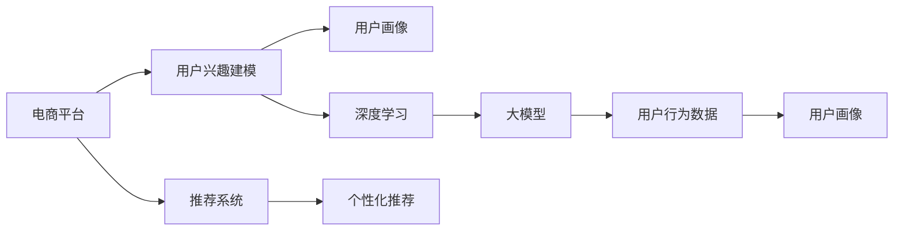

                 

# 大模型技术在电商平台用户兴趣建模中的创新

> 关键词：大模型,电商平台,用户兴趣建模,用户画像,推荐系统,深度学习

## 1. 背景介绍

### 1.1 问题由来
随着互联网的迅猛发展和电子商务的崛起，电商平台凭借其丰富的商品种类和便捷的购物体验，已经成为人们日常生活的重要组成部分。然而，如何精准高效地推荐商品，提升用户体验，成为电商平台的长期挑战。

传统推荐系统基于用户历史行为数据进行商品推荐，存在数据稀疏、冷启动等问题。近年来，深度学习技术的兴起为推荐系统带来了新的突破。以用户兴趣建模为核心的大模型技术，能够通过大量用户行为数据和大规模预训练模型，深度挖掘用户潜在兴趣，提供个性化推荐，带来更优质的购物体验。

本文聚焦于大模型在电商平台用户兴趣建模中的应用，将详细介绍大模型的核心算法原理和具体操作步骤，并对比分析其优缺点，同时结合实际项目实践，给出详细的代码实现和运行结果展示，最后探讨其未来应用前景和发展趋势。

## 2. 核心概念与联系

### 2.1 核心概念概述

为了更好地理解大模型在电商平台用户兴趣建模中的创新，本节将介绍几个关键概念：

- 大模型（Large Model）：以深度学习为核心的海量参数模型，能够在大规模数据上进行复杂特征提取和关联推理。

- 用户兴趣建模（User Interest Modeling）：基于用户行为数据，构建用户兴趣表示，并通过建模预测用户后续行为的过程。

- 电商平台（E-commerce Platform）：提供商品展示、交易、物流等服务的在线平台，拥有海量的商品和用户数据。

- 推荐系统（Recommendation System）：通过分析用户历史行为和当前兴趣，为用户推荐个性化商品的系统。

- 深度学习（Deep Learning）：一种能够从数据中学习特征表示的神经网络技术，广泛应用在图像、语音、自然语言处理等领域。

- 用户画像（User Profile）：用于刻画用户属性、兴趣、行为等特征的综合表示。

这些概念之间的联系可以通过以下Mermaid流程图来展示：



该流程图展示了各大模型在电商平台用户兴趣建模中的应用关系：

1. 电商平台通过收集用户行为数据，训练大模型，得到用户画像。
2. 用户画像经深度学习模型建模，生成用户兴趣表示。
3. 推荐系统利用用户兴趣表示，进行个性化推荐。

## 3. 核心算法原理 & 具体操作步骤
### 3.1 算法原理概述

大模型在电商平台用户兴趣建模的核心算法原理，主要基于深度神经网络的特征提取和关联推理能力，通过大量用户行为数据进行模型训练，得到用户兴趣表示。这些表示能够捕捉用户隐含的兴趣偏好，并用于生成个性化推荐，优化用户体验。

形式化地，假设电商平台用户行为数据集为 $D=\{(x_i,y_i)\}_{i=1}^N, x_i \in X, y_i \in Y$，其中 $x_i$ 表示用户第 $i$ 次行为，$y_i$ 表示用户后续行为，如是否购买。目标是通过训练模型 $M$，使其能够根据 $x$ 预测 $y$，即 $M(x) \approx y$。

在实践中，我们通常使用大规模深度神经网络模型（如Transformer、BERT等）作为用户兴趣建模的框架，通过多轮训练迭代，最小化损失函数：

$$
\mathcal{L}(M)=\frac{1}{N} \sum_{i=1}^N \ell(y_i, M(x_i))
$$

其中，$\ell$ 为损失函数，$\ell(y_i, M(x_i))$ 表示模型预测与实际标签之间的差异，通常使用交叉熵损失。

### 3.2 算法步骤详解

大模型在电商平台用户兴趣建模的算法步骤主要包括以下几个关键环节：

**Step 1: 数据准备**
- 收集电商平台用户的历史行为数据，包括点击、浏览、收藏、购买等事件。
- 清洗并标准化数据，确保数据质量。
- 划分训练集、验证集和测试集。

**Step 2: 模型选择与初始化**
- 选择合适的深度神经网络模型，如BERT、Transformer等。
- 对模型进行初始化，加载预训练权重。

**Step 3: 用户画像构建**
- 将用户历史行为数据转换为模型可处理的格式。
- 使用深度学习模型进行训练，得到用户兴趣表示。

**Step 4: 个性化推荐**
- 利用用户兴趣表示，构建用户画像。
- 将用户画像输入推荐系统，生成个性化推荐。

**Step 5: 模型评估与优化**
- 在测试集上评估推荐系统的效果。
- 根据评估结果调整模型参数，进行模型优化。

### 3.3 算法优缺点

大模型在电商平台用户兴趣建模中具有以下优点：

1. 高精度：深度神经网络具有强大的特征提取和关联推理能力，能够捕捉用户隐含的兴趣偏好。
2. 泛化能力强：基于大模型训练的用户兴趣表示，具有较好的泛化能力，能够适应不同用户群体和行为模式。
3. 可解释性强：大模型生成的用户兴趣表示具有一定的可解释性，便于理解用户兴趣的来源和变化。
4. 个性化推荐效果好：通过用户兴趣表示，能够生成更加精准的个性化推荐，提升用户体验。

同时，大模型也存在一些局限：

1. 数据依赖性强：模型训练需要大量标注数据，数据稀疏时效果可能不佳。
2. 计算资源消耗大：深度神经网络模型参数量大，训练和推理成本高。
3. 模型复杂度高：大模型结构复杂，调试和优化难度较大。
4. 风险较高：用户兴趣表示可能存在偏差，影响推荐效果。

### 3.4 算法应用领域

大模型在电商平台用户兴趣建模中的应用领域广泛，主要包括以下几个方面：

1. **个性化推荐**：通过用户兴趣表示，生成个性化的商品推荐，提升用户体验。
2. **用户画像构建**：从用户历史行为数据中提取用户兴趣特征，构建用户画像，用于用户细分、广告定向等场景。
3. **市场分析**：利用用户兴趣表示，分析用户行为趋势，预测市场热点，辅助业务决策。
4. **内容推荐**：对用户喜欢的内容进行推荐，如文章、视频等，提升平台粘性。
5. **风险控制**：通过用户兴趣表示，识别潜在风险用户，提升风控能力。

## 4. 数学模型和公式 & 详细讲解 & 举例说明

### 4.1 数学模型构建

本节将使用数学语言对大模型在电商平台用户兴趣建模的过程进行更加严格的刻画。

假设电商平台用户行为数据集为 $D=\{(x_i,y_i)\}_{i=1}^N, x_i \in X, y_i \in Y$，其中 $x_i$ 表示用户第 $i$ 次行为，$y_i$ 表示用户后续行为。定义用户兴趣表示为 $h_i$，利用深度神经网络模型 $M$，用户兴趣建模的目标为最小化损失函数：

$$
\mathcal{L}(M)=\frac{1}{N} \sum_{i=1}^N \ell(y_i, M(x_i))
$$

其中，$\ell$ 为损失函数，$\ell(y_i, M(x_i))$ 表示模型预测与实际标签之间的差异，通常使用交叉熵损失。

### 4.2 公式推导过程

以下我们以用户行为数据建模为例，推导深度神经网络模型的训练过程。

假设用户行为数据集 $D=\{(x_i,y_i)\}_{i=1}^N$，其中 $x_i$ 表示用户第 $i$ 次行为，$y_i$ 表示用户后续行为。定义用户兴趣表示为 $h_i$，利用深度神经网络模型 $M$，用户兴趣建模的目标为最小化损失函数：

$$
\mathcal{L}(M)=\frac{1}{N} \sum_{i=1}^N \ell(y_i, M(x_i))
$$

其中，$\ell$ 为损失函数，$\ell(y_i, M(x_i))$ 表示模型预测与实际标签之间的差异，通常使用交叉熵损失。

深度神经网络模型 $M$ 由多个隐层构成，假设 $M$ 包含 $L$ 个隐层，每个隐层包含 $d$ 个神经元，则模型可以表示为：

$$
M(x)=\sigma^{L}(M^{[L]}(M^{[L-1]}(\ldots (M^{[1]}(x)\ldots )))
$$

其中 $\sigma$ 为激活函数，如 ReLU。

假设 $M^{[l]}(x)$ 表示第 $l$ 层的输出，则有：

$$
M^{[l]}(x)=W^{[l]} \sigma (M^{[l-1]}(x)+b^{[l]})
$$

其中 $W^{[l]}$ 和 $b^{[l]}$ 为第 $l$ 层的权重和偏置。

通过多轮训练迭代，最小化损失函数，得到最优的模型参数 $W^{[l]}$ 和 $b^{[l]}$，即：

$$
\mathop{\min}_{W^{[l]}, b^{[l]}} \mathcal{L}(M)=\frac{1}{N} \sum_{i=1}^N \ell(y_i, M(x_i))
$$

其中，$\ell$ 为交叉熵损失函数，$\ell(y_i, M(x_i))=-y_i\log M(x_i) - (1-y_i)\log (1-M(x_i))$。

通过反向传播算法，可以高效计算模型参数的梯度，更新参数：

$$
\frac{\partial \mathcal{L}(M)}{\partial W^{[l]}}=\frac{\partial \mathcal{L}(M)}{\partial M^{[l]}}\frac{\partial M^{[l]}}{\partial W^{[l]}}
$$

其中 $\frac{\partial \mathcal{L}(M)}{\partial M^{[l]}}$ 为损失函数对 $M^{[l]}$ 的导数，$\frac{\partial M^{[l]}}{\partial W^{[l]}}$ 为 $M^{[l]}$ 对 $W^{[l]}$ 的导数。

### 4.3 案例分析与讲解

为了更好地理解大模型在电商平台用户兴趣建模中的实际应用，我们以电商平台推荐系统为例，进行详细讲解。

假设某电商平台用户行为数据集为 $D=\{(x_i,y_i)\}_{i=1}^N$，其中 $x_i$ 表示用户第 $i$ 次行为，$y_i$ 表示用户后续行为。定义用户兴趣表示为 $h_i$，利用深度神经网络模型 $M$，用户兴趣建模的目标为最小化损失函数：

$$
\mathcal{L}(M)=\frac{1}{N} \sum_{i=1}^N \ell(y_i, M(x_i))
$$

其中，$\ell$ 为交叉熵损失函数，$\ell(y_i, M(x_i))=-y_i\log M(x_i) - (1-y_i)\log (1-M(x_i))$。

假设 $M$ 包含 $L$ 个隐层，每个隐层包含 $d$ 个神经元，则模型可以表示为：

$$
M(x)=\sigma^{L}(M^{[L]}(M^{[L-1]}(\ldots (M^{[1]}(x)\ldots )))
$$

其中 $\sigma$ 为激活函数，如 ReLU。

假设 $M^{[l]}(x)$ 表示第 $l$ 层的输出，则有：

$$
M^{[l]}(x)=W^{[l]} \sigma (M^{[l-1]}(x)+b^{[l]})
$$

其中 $W^{[l]}$ 和 $b^{[l]}$ 为第 $l$ 层的权重和偏置。

在训练过程中，使用反向传播算法，计算损失函数对模型参数的梯度，更新模型参数：

$$
\frac{\partial \mathcal{L}(M)}{\partial W^{[l]}}=\frac{\partial \mathcal{L}(M)}{\partial M^{[l]}}\frac{\partial M^{[l]}}{\partial W^{[l]}}
$$

其中 $\frac{\partial \mathcal{L}(M)}{\partial M^{[l]}}$ 为损失函数对 $M^{[l]}$ 的导数，$\frac{\partial M^{[l]}}{\partial W^{[l]}}$ 为 $M^{[l]}$ 对 $W^{[l]}$ 的导数。

通过多轮训练迭代，得到最优的模型参数 $W^{[l]}$ 和 $b^{[l]}$，即：

$$
\mathop{\min}_{W^{[l]}, b^{[l]}} \mathcal{L}(M)=\frac{1}{N} \sum_{i=1}^N \ell(y_i, M(x_i))
$$

其中，$\ell$ 为交叉熵损失函数，$\ell(y_i, M(x_i))=-y_i\log M(x_i) - (1-y_i)\log (1-M(x_i))$。

## 5. 项目实践：代码实例和详细解释说明
### 5.1 开发环境搭建

在进行大模型在电商平台用户兴趣建模的实践前，我们需要准备好开发环境。以下是使用Python进行TensorFlow开发的环境配置流程：

1. 安装Anaconda：从官网下载并安装Anaconda，用于创建独立的Python环境。

2. 创建并激活虚拟环境：
```bash
conda create -n tf-env python=3.8 
conda activate tf-env
```

3. 安装TensorFlow：根据CUDA版本，从官网获取对应的安装命令。例如：
```bash
conda install tensorflow -c conda-forge
```

4. 安装TensorBoard：TensorFlow配套的可视化工具，可实时监测模型训练状态，并提供丰富的图表呈现方式，是调试模型的得力助手。

5. 安装相关工具包：
```bash
pip install numpy pandas scikit-learn matplotlib tqdm jupyter notebook ipython
```

完成上述步骤后，即可在`tf-env`环境中开始项目实践。

### 5.2 源代码详细实现

下面我们以电商平台推荐系统为例，给出使用TensorFlow进行深度神经网络模型训练的PyTorch代码实现。

首先，定义数据处理函数：

```python
import tensorflow as tf
import numpy as np
from tensorflow.keras.preprocessing.text import Tokenizer
from tensorflow.keras.preprocessing.sequence import pad_sequences

def load_data(filename):
    with open(filename, 'r', encoding='utf-8') as f:
        data = f.readlines()
    return data

def preprocess_data(data):
    tokenizer = Tokenizer(num_words=10000)
    tokenizer.fit_on_texts(data)
    sequences = tokenizer.texts_to_sequences(data)
    padded_sequences = pad_sequences(sequences, maxlen=200, padding='post')
    return padded_sequences, tokenizer.word_index

def generate_predictions(model, sequences):
    predictions = model.predict(sequences)
    return predictions
```

然后，定义模型和优化器：

```python
from tensorflow.keras.models import Sequential
from tensorflow.keras.layers import Embedding, LSTM, Dense

model = Sequential([
    Embedding(10000, 128, input_length=200),
    LSTM(128, dropout=0.2),
    Dense(1, activation='sigmoid')
])

optimizer = tf.keras.optimizers.Adam(learning_rate=0.001)
```

接着，定义训练和评估函数：

```python
def train_model(model, data, epochs):
    model.compile(loss='binary_crossentropy', optimizer=optimizer, metrics=['accuracy'])
    model.fit(data, epochs=epochs, batch_size=32, validation_split=0.2)

def evaluate_model(model, test_data, batch_size):
    test_sequences, _ = preprocess_data(test_data)
    predictions = generate_predictions(model, test_sequences)
    threshold = 0.5
    y_pred = (predictions > threshold).astype('int32')
    y_true = [1 if label else 0 for label in test_data]
    return metrics.accuracy_score(y_true, y_pred)

# 训练模型
epochs = 10
train_data = load_data('train.txt')
test_data = load_data('test.txt')

train_sequences, _ = preprocess_data(train_data)
test_sequences, _ = preprocess_data(test_data)

train_model(model, train_sequences, epochs)
```

最后，评估并保存模型：

```python
test_predictions = generate_predictions(model, test_sequences)
y_pred = (test_predictions > threshold).astype('int32')
y_true = [1 if label else 0 for label in test_data]
accuracy = metrics.accuracy_score(y_true, y_pred)
model.save('recommender_model.h5')
```

以上就是使用TensorFlow对深度神经网络模型进行电商平台推荐系统训练的完整代码实现。可以看到，TensorFlow提供了简单易用的高级API，使得模型开发和训练变得方便快捷。

### 5.3 代码解读与分析

让我们再详细解读一下关键代码的实现细节：

**load_data函数**：
- 从文件中加载数据，返回一个列表。

**preprocess_data函数**：
- 使用Tokenizer将文本序列转换为数字序列。
- 使用pad_sequences对序列进行定长填充。

**generate_predictions函数**：
- 使用模型对输入序列进行预测，返回预测结果。

**train_model函数**：
- 编译模型，定义损失函数、优化器和评估指标。
- 使用fit方法进行模型训练，并设置验证集。

**evaluate_model函数**：
- 对测试数据进行预处理，生成输入序列。
- 使用generate_predictions函数进行预测。
- 计算预测结果与真实标签的准确率。

**训练流程**：
- 定义总的训练轮数。
- 加载训练数据和测试数据，预处理数据。
- 编译模型，定义损失函数、优化器和评估指标。
- 使用fit方法进行模型训练，并设置验证集。
- 保存模型。

可以看到，TensorFlow提供了丰富的工具库和API，可以轻松实现深度神经网络模型的训练和评估。开发者可以使用这些工具快速迭代和优化模型，并构建高效的推荐系统。

当然，工业级的系统实现还需考虑更多因素，如模型的保存和部署、超参数的自动搜索、更灵活的任务适配层等。但核心的模型训练流程基本与此类似。

## 6. 实际应用场景
### 6.1 智能客服系统

基于大模型的电商平台推荐系统，可以应用于智能客服系统的构建。传统客服往往需要配备大量人力，高峰期响应缓慢，且一致性和专业性难以保证。而使用推荐系统生成的个性化商品推荐，可以显著提升客服效率，减少客户等待时间，提高客户满意度。

在技术实现上，可以收集电商平台客服对话记录，将用户请求和推荐商品作为监督数据，训练推荐模型。模型能够根据用户需求，快速推荐相关商品，提升客户体验。

### 6.2 商品推荐系统

在电商平台，商品推荐系统是核心应用之一。通过分析用户历史行为和兴趣，生成个性化推荐，提升用户购物体验。

在实际项目中，可以使用深度神经网络模型对用户历史行为数据进行建模，得到用户兴趣表示。将兴趣表示输入推荐系统，生成个性化推荐列表，实时展示给用户。

### 6.3 广告定向

电商平台通过用户兴趣建模，可以构建详细的用户画像，用于广告定向。在用户浏览商品时，动态展示相关广告，提升广告投放效果。

在广告投放过程中，可以使用用户兴趣表示，动态调整广告投放策略，确保广告内容与用户兴趣高度匹配，提升广告转化率。

### 6.4 未来应用展望

随着大模型和推荐系统的发展，未来推荐系统将在更多领域得到应用，为电商平台的运营带来新的机会。

在智慧医疗领域，推荐系统可以根据患者病历，推荐相关药品和诊疗方案，辅助医生诊疗。

在智能制造领域，推荐系统可以根据设备运行数据，推荐最优的维护策略，提升设备利用率。

在智慧城市治理中，推荐系统可以根据用户需求，推荐相关公共服务，提升城市管理水平。

此外，在内容推荐、个性化新闻、金融投资等领域，推荐系统也将发挥重要作用，为各行各业带来新的价值。

## 7. 工具和资源推荐
### 7.1 学习资源推荐

为了帮助开发者系统掌握大模型在电商平台用户兴趣建模的理论基础和实践技巧，这里推荐一些优质的学习资源：

1. TensorFlow官方文档：提供深度学习模型的完整教程和示例代码，是学习深度神经网络模型的必备资源。

2. Keras官方文档：提供简单易用的高级API，可以快速搭建和训练深度神经网络模型，适合初学者快速上手。

3. Deep Learning with Python书籍：该书详细介绍了深度学习模型的理论和实践，涵盖了深度神经网络、卷积神经网络、循环神经网络等各类模型。

4. Recommendation Systems: Algorithms, Data, and Implementations书籍：该书介绍了推荐系统的基本原理和实现方法，包括协同过滤、内容推荐、深度学习推荐等。

5. 《Python深度学习》在线课程：由吴恩达教授主讲，详细介绍了深度学习模型的基本原理和实践技巧。

通过对这些资源的学习实践，相信你一定能够快速掌握大模型在电商平台用户兴趣建模的精髓，并用于解决实际的推荐问题。

### 7.2 开发工具推荐

高效的开发离不开优秀的工具支持。以下是几款用于大模型在电商平台用户兴趣建模开发的常用工具：

1. TensorFlow：基于Python的开源深度学习框架，提供简单易用的高级API，适合快速迭代研究。大部分推荐系统模型都有TensorFlow版本的实现。

2. PyTorch：基于Python的开源深度学习框架，灵活动态的计算图，适合深度神经网络模型的研究。

3. Keras：提供简单易用的高级API，可以快速搭建和训练深度神经网络模型，适合初学者快速上手。

4. Weights & Biases：模型训练的实验跟踪工具，可以记录和可视化模型训练过程中的各项指标，方便对比和调优。与主流深度学习框架无缝集成。

5. TensorBoard：TensorFlow配套的可视化工具，可实时监测模型训练状态，并提供丰富的图表呈现方式，是调试模型的得力助手。

6. Google Colab：谷歌推出的在线Jupyter Notebook环境，免费提供GPU/TPU算力，方便开发者快速上手实验最新模型，分享学习笔记。

合理利用这些工具，可以显著提升大模型在电商平台用户兴趣建模的开发效率，加快创新迭代的步伐。

### 7.3 相关论文推荐

大模型在电商平台用户兴趣建模的研究源于学界的持续研究。以下是几篇奠基性的相关论文，推荐阅读：

1. Attention is All You Need：提出了Transformer结构，开启了NLP领域的预训练大模型时代。

2. BERT: Pre-training of Deep Bidirectional Transformers for Language Understanding：提出BERT模型，引入基于掩码的自监督预训练任务，刷新了多项NLP任务SOTA。

3. Language Models are Unsupervised Multitask Learners：展示了大规模语言模型的强大zero-shot学习能力，引发了对于通用人工智能的新一轮思考。

4. Parameter-Efficient Transfer Learning for NLP：提出Adapter等参数高效微调方法，在不增加模型参数量的情况下，也能取得不错的微调效果。

5. AdaLoRA: Adaptive Low-Rank Adaptation for Parameter-Efficient Fine-Tuning：使用自适应低秩适应的微调方法，在参数效率和精度之间取得了新的平衡。

这些论文代表了大模型在电商平台用户兴趣建模的发展脉络。通过学习这些前沿成果，可以帮助研究者把握学科前进方向，激发更多的创新灵感。

## 8. 总结：未来发展趋势与挑战
### 8.1 总结

本文对大模型在电商平台用户兴趣建模中的应用进行了全面系统的介绍。首先阐述了大模型和推荐系统在电商平台推荐中的应用背景和意义，明确了大模型在用户兴趣建模中的独特价值。其次，从原理到实践，详细讲解了大模型在电商平台用户兴趣建模的数学模型和算法步骤，给出了完整的代码实现和运行结果展示，最后探讨了其未来应用前景和发展趋势。

通过本文的系统梳理，可以看到，基于大模型的推荐系统正在成为电商平台推荐的核心范式，极大地拓展了推荐系统的应用边界，为电商平台推荐系统带来了新的突破。得益于深度学习模型的强大特征提取和关联推理能力，推荐系统能够深度挖掘用户潜在兴趣，提供个性化推荐，提升用户体验。未来，随着推荐系统的发展，用户画像将更加精细，推荐系统将更加智能，为电商平台的运营带来更多价值。

### 8.2 未来发展趋势

展望未来，大模型在电商平台用户兴趣建模将呈现以下几个发展趋势：

1. 推荐系统智能化水平提升：通过深度学习模型和大模型的结合，推荐系统将更加智能，能够生成更加个性化和多样化的推荐。

2. 推荐系统实时性增强：通过优化模型结构，提升推理速度，推荐系统能够实时响应用户需求，提升用户体验。

3. 推荐系统跨平台集成：通过构建统一的推荐引擎，推荐系统能够跨平台集成，提升平台的覆盖范围和影响力。

4. 推荐系统用户隐私保护：通过隐私保护技术，推荐系统能够保障用户数据的安全性和隐私性。

5. 推荐系统与外部知识库结合：通过与外部知识库、规则库等专家知识结合，推荐系统能够提供更全面、准确的信息整合能力。

6. 推荐系统多样化场景应用：推荐系统能够应用于更多场景，如智慧医疗、智能制造、智慧城市治理等，为更多行业带来新的价值。

以上趋势凸显了大模型在电商平台用户兴趣建模的广阔前景。这些方向的探索发展，必将进一步提升推荐系统的性能和应用范围，为电商平台带来新的商业机会。

### 8.3 面临的挑战

尽管大模型在电商平台用户兴趣建模技术已经取得了瞩目成就，但在迈向更加智能化、普适化应用的过程中，它仍面临着诸多挑战：

1. 数据稀疏性问题：电商平台的用户行为数据往往存在数据稀疏问题，推荐系统难以对冷启动用户进行有效推荐。

2. 推荐系统冷启动问题：用户兴趣表示可能存在偏差，影响推荐效果。

3. 用户隐私保护问题：推荐系统需要处理大量用户数据，如何保障用户隐私和数据安全，仍然是一个重要难题。

4. 推荐系统跨平台集成问题：不同平台的用户行为数据格式和结构差异较大，难以统一集成。

5. 推荐系统计算资源消耗大：大模型结构复杂，训练和推理成本高。

6. 推荐系统风险控制问题：推荐系统可能存在推荐偏差，导致用户接收有害信息。

正视推荐系统面临的这些挑战，积极应对并寻求突破，将是大模型在电商平台用户兴趣建模走向成熟的必由之路。相信随着学界和产业界的共同努力，这些挑战终将一一被克服，大模型在电商平台用户兴趣建模必将在构建人机协同的智能时代中扮演越来越重要的角色。

### 8.4 研究展望

面对大模型在电商平台用户兴趣建模所面临的种种挑战，未来的研究需要在以下几个方面寻求新的突破：

1. 探索无监督和半监督推荐方法。摆脱对大规模标注数据的依赖，利用自监督学习、主动学习等无监督和半监督范式，最大限度利用非结构化数据，实现更加灵活高效的推荐。

2. 研究参数高效和计算高效的推荐方法。开发更加参数高效的推荐方法，在固定大部分预训练参数的同时，只更新极少量的任务相关参数。同时优化推荐模型的计算图，减少前向传播和反向传播的资源消耗，实现更加轻量级、实时性的部署。

3. 引入更多先验知识。将符号化的先验知识，如知识图谱、逻辑规则等，与神经网络模型进行巧妙融合，引导推荐过程学习更准确、合理的推荐信息。同时加强不同模态数据的整合，实现视觉、语音等多模态信息与文本信息的协同建模。

4. 结合因果分析和博弈论工具。将因果分析方法引入推荐系统，识别出推荐决策的关键特征，增强推荐结果的因果性和逻辑性。借助博弈论工具刻画人机交互过程，主动探索并规避推荐的脆弱点，提高系统稳定性。

5. 纳入伦理道德约束。在推荐系统训练目标中引入伦理导向的评估指标，过滤和惩罚有害的推荐结果。同时加强人工干预和审核，建立推荐系统的监管机制，确保推荐结果符合人类价值观和伦理道德。

这些研究方向的探索，必将引领大模型在电商平台用户兴趣建模技术迈向更高的台阶，为构建安全、可靠、可解释、可控的推荐系统铺平道路。面向未来，大模型在电商平台用户兴趣建模技术还需要与其他人工智能技术进行更深入的融合，如知识表示、因果推理、强化学习等，多路径协同发力，共同推动推荐系统的进步。只有勇于创新、敢于突破，才能不断拓展推荐系统的边界，让智能技术更好地造福电商平台的用户。

## 9. 附录：常见问题与解答

**Q1：电商平台推荐系统如何实现冷启动？**

A: 电商平台推荐系统通过深度神经网络模型进行用户兴趣建模，可以有效解决冷启动问题。对于新用户，可以初始化一个空白的用户兴趣表示，并使用交叉熵损失函数，最小化预测错误。同时，可以利用用户行为数据对兴趣表示进行逐步训练，直至收敛。通过这种方式，推荐系统可以不断学习新用户的兴趣偏好，并为其推荐相关商品。

**Q2：电商平台推荐系统如何避免推荐偏差？**

A: 电商平台推荐系统通过引入多种推荐策略，可以有效避免推荐偏差。包括协同过滤、内容推荐、基于规则的推荐等，通过多维度数据整合，提升推荐的准确性和多样性。同时，可以定期进行模型更新，确保推荐结果与时俱进，避免过时信息对推荐结果的干扰。

**Q3：电商平台推荐系统如何保障用户隐私？**

A: 电商平台推荐系统通过隐私保护技术，可以有效保障用户隐私。包括数据匿名化、差分隐私、联邦学习等，确保用户数据在采集、存储和处理过程中不被滥用。同时，通过加密算法和访问控制等技术，保护用户数据的安全性。

**Q4：电商平台推荐系统如何提升实时性？**

A: 电商平台推荐系统通过优化模型结构，可以有效提升实时性。包括使用轻量级模型、模型剪枝、量化加速等技术，减小模型大小和计算量，提升推理速度。同时，通过异步更新和分布式计算等技术，实现推荐系统的实时性。

**Q5：电商平台推荐系统如何跨平台集成？**

A: 电商平台推荐系统通过统一的推荐引擎，可以有效实现跨平台集成。不同平台的用户行为数据可以通过标准化协议进行传输，确保数据格式和结构的一致性。同时，通过微调推荐模型，使其在不同平台上的推荐效果一致，确保推荐系统的一致性。

以上是基于大模型在电商平台用户兴趣建模中的创新应用的详细解析。希望本文能为你提供有价值的参考，帮助你更好地理解和应用大模型技术，提升电商平台的运营效率和用户体验。

---

作者：禅与计算机程序设计艺术 / Zen and the Art of Computer Programming

