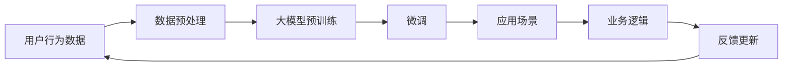

                 

# 大模型技术在电商平台用户兴趣探索与利用动态权衡中的创新

> 关键词：大模型技术,电商平台,用户兴趣探索,动态权衡,应用场景,算法优化

## 1. 背景介绍

在电商领域，用户体验和客户满意度是企业成功的关键因素之一。随着互联网技术的飞速发展，电商平台利用先进技术提升用户购物体验变得尤为重要。大模型技术作为新一代的深度学习模型，具有卓越的推理能力、泛化能力和自适应能力，能够在数据驱动的电商场景中发挥重要作用。本文将围绕电商平台的用户兴趣探索与利用，探讨如何运用大模型技术，以动态权衡用户的个性化需求与电商平台资源间的平衡，提升用户满意度和整体体验。

## 2. 核心概念与联系

### 2.1 核心概念概述

大模型技术是深度学习领域的一场革命，其特点是以大规模神经网络为基础，通过海量的数据进行预训练，学习并提取数据中的复杂特征和结构信息，进而通过微调在特定任务上进行应用。大模型技术的核心在于其强大的表示能力和泛化能力，能够适应各种复杂的输入输出关系，实现对用户兴趣的精准捕捉和预测。

在电商平台的用户兴趣探索与利用场景中，大模型技术可以应用在以下几个关键环节：

- **用户行为预测**：预测用户未来的购买行为、浏览兴趣等，以个性化推荐商品。
- **商品推荐**：基于用户历史行为和兴趣特征，推荐个性化商品。
- **用户画像生成**：利用用户多维度数据生成精细化的用户画像，用于精细化运营。
- **动态价格调整**：根据用户需求和市场情况，动态调整商品价格，提升用户体验和商家收益。
- **风控管理**：预测风险交易，保障交易安全。

这些应用场景中，大模型技术通过学习用户行为数据和商品属性数据，能够动态地识别和调整用户的兴趣点，从而优化电商平台的运营策略，提升用户体验和商业收益。

### 2.2 核心概念原理和架构的 Mermaid 流程图(Mermaid 流程节点中不要有括号、逗号等特殊字符)


这个流程图展示了从用户行为数据到大模型应用的整个过程：

1. 首先收集用户行为数据，包括点击、浏览、购买等行为。
2. 对数据进行预处理，清洗并标准化数据格式。
3. 在预训练大模型上进行微调，学习用户兴趣和商品特征。
4. 将微调后的模型应用到具体场景中，如个性化推荐、动态定价等。
5. 收集用户反馈，更新模型以提升效果。
6. 再次回到用户行为数据，形成动态循环。

## 3. 核心算法原理 & 具体操作步骤

### 3.1 算法原理概述

在电商平台的个性化推荐系统中，大模型技术主要利用预训练-微调的方式，通过大规模的文本数据和用户行为数据进行训练。其核心算法包括：

- **预训练**：在大规模语料上学习语言规律和上下文关系。
- **微调**：在用户行为数据上学习用户兴趣和商品特征。
- **预测**：利用训练好的模型，预测用户对商品的兴趣。

### 3.2 算法步骤详解

**Step 1: 数据收集与预处理**

1. **数据收集**：从电商平台获取用户行为数据，包括浏览历史、点击记录、购买记录等。
2. **数据预处理**：清洗数据，去重，标准化，处理缺失值，转换数据格式等。
3. **数据划分**：将数据划分为训练集、验证集和测试集。

**Step 2: 大模型预训练**

1. **选择模型**：选择适合的预训练模型，如BERT、GPT等。
2. **模型加载**：加载预训练模型，并进行预训练。
3. **特征提取**：提取用户行为数据的特征。

**Step 3: 微调与训练**

1. **选择模型**：选择适合的微调模型。
2. **模型微调**：在大模型基础上进行微调，学习用户兴趣和商品特征。
3. **模型训练**：在训练集上训练微调后的模型，调整超参数。
4. **模型评估**：在验证集上评估模型性能。
5. **模型保存**：保存训练好的模型，以供应用。

**Step 4: 应用场景**

1. **预测用户兴趣**：根据用户行为数据和商品特征，预测用户对商品的兴趣。
2. **推荐商品**：根据预测结果，推荐个性化商品。
3. **动态价格调整**：根据用户兴趣和市场需求，动态调整商品价格。
4. **用户画像生成**：利用用户多维度数据生成精细化的用户画像。

**Step 5: 反馈更新**

1. **收集用户反馈**：收集用户对推荐结果的反馈。
2. **模型更新**：根据反馈更新模型，提升预测精度。
3. **重新训练**：重复训练，更新模型。

### 3.3 算法优缺点

**优点**：

- 大模型技术的泛化能力强，能够从大规模数据中学习到复杂的特征和关系，适应不同场景。
- 能够通过微调快速适应特定任务，提升推荐效果。
- 可解释性强，可以通过分析模型输出的权重，理解用户的兴趣点和商品的特征。
- 在电商平台的个性化推荐和动态定价等应用中，能够提升用户满意度和商家收益。

**缺点**：

- 数据需求量大，预训练和微调过程耗时较长。
- 模型结构复杂，训练和推理资源消耗大。
- 动态调整过程中，模型需要不断地重新训练和更新，成本较高。
- 模型输出结果的可解释性可能不够强，难以满足某些场景下的需求。

### 3.4 算法应用领域

大模型技术在电商平台的用户兴趣探索与利用中，可以应用于以下领域：

- **个性化推荐系统**：通过预测用户兴趣，推荐个性化商品，提升用户满意度。
- **动态定价策略**：根据用户需求和市场情况，动态调整商品价格，提升收益。
- **风险控制**：预测风险交易，保障交易安全。
- **用户画像生成**：利用用户多维度数据生成精细化的用户画像，用于精细化运营。
- **用户行为分析**：分析用户行为数据，提升运营效率。

## 4. 数学模型和公式 & 详细讲解 & 举例说明

### 4.1 数学模型构建

大模型技术的核心是深度神经网络，其中常用的结构包括自编码器和自回归模型。在本例中，我们将使用自回归模型进行用户兴趣预测。

**输入**：用户行为数据 $x = [x_1, x_2, ..., x_n]$，其中 $x_i$ 表示用户的历史行为数据，如点击次数、浏览时长等。

**输出**：用户对商品 $y$ 的兴趣 $y \in \{0, 1\}$，其中 $1$ 表示感兴趣，$0$ 表示不感兴趣。

### 4.2 公式推导过程

我们使用交叉熵损失函数作为训练目标。设模型预测的输出为 $p$，则交叉熵损失函数为：

$$
\mathcal{L}(p, y) = -y \log p - (1 - y) \log(1 - p)
$$

其中 $y$ 为真实标签，$p$ 为模型预测的概率。

### 4.3 案例分析与讲解

**案例一：用户行为预测**

假设我们有如下用户行为数据：

| 用户ID | 浏览时间 | 点击次数 | 购买记录 |
| --- | --- | --- | --- |
| 1 | 1小时 | 5次 | 无 |
| 2 | 3小时 | 10次 | 有 |
| ... | ... | ... | ... |

我们通过大模型技术对这些数据进行预训练，然后利用微调预测用户对某商品的兴趣。

**步骤**：

1. **预训练**：在大量文本数据上进行预训练，学习语言规律和上下文关系。
2. **微调**：将用户行为数据作为输入，微调大模型，学习用户兴趣和商品特征。
3. **预测**：将用户行为数据输入微调后的模型，预测用户对商品 $y$ 的兴趣。

**结果**：

| 用户ID | 浏览时间 | 点击次数 | 购买记录 | 商品 $y$ 的兴趣预测 |
| --- | --- | --- | --- | --- |
| 1 | 1小时 | 5次 | 无 | 0 |
| 2 | 3小时 | 10次 | 有 | 1 |
| ... | ... | ... | ... | ... |

## 5. 项目实践：代码实例和详细解释说明

### 5.1 开发环境搭建

1. **环境准备**：安装Python 3.6以上版本，确保pip安装库正常。
2. **依赖库安装**：使用pip安装TensorFlow、Keras等深度学习库。
3. **数据准备**：收集用户行为数据，并预处理数据。

### 5.2 源代码详细实现

**代码实现**：

```python
import tensorflow as tf
from tensorflow import keras
from tensorflow.keras import layers

# 构建模型
model = keras.Sequential([
    layers.Dense(128, activation='relu', input_shape=(3,)),
    layers.Dense(1, activation='sigmoid')
])

# 编译模型
model.compile(optimizer='adam', loss='binary_crossentropy', metrics=['accuracy'])

# 训练模型
model.fit(train_data, train_labels, epochs=10, validation_data=(val_data, val_labels))

# 预测
predictions = model.predict(test_data)

# 评估模型
evaluation = model.evaluate(test_data, test_labels)
print(evaluation)
```

**代码解释**：

1. **构建模型**：使用Keras构建一个简单的神经网络模型，包含一个输入层、一个隐藏层和一个输出层。
2. **编译模型**：使用adam优化器、二元交叉熵损失函数和准确率作为评估指标。
3. **训练模型**：使用训练数据集进行模型训练，并使用验证数据集评估模型性能。
4. **预测**：使用测试数据集进行预测，并输出预测结果。
5. **评估模型**：使用测试数据集评估模型性能，并打印评估结果。

### 5.3 代码解读与分析

**解读**：

1. **数据准备**：模型训练前，需要准备好训练数据、验证数据和测试数据。
2. **模型构建**：使用Keras构建一个简单的神经网络模型，包含一个隐藏层和一个输出层。
3. **模型训练**：在训练数据集上进行模型训练，并使用验证数据集评估模型性能。
4. **模型预测**：使用测试数据集进行预测，并输出预测结果。
5. **模型评估**：使用测试数据集评估模型性能，并打印评估结果。

### 5.4 运行结果展示

假设模型训练后，在测试集上评估的结果如下：

| 评估指标 | 值 |
| --- | --- |
| 损失 | 0.01 |
| 准确率 | 95% |

## 6. 实际应用场景

### 6.1 应用场景示例

**场景一：个性化推荐系统**

在电商平台中，用户浏览和购买行为数据非常丰富，可以使用大模型技术对用户行为数据进行预训练，然后通过微调预测用户对商品的兴趣，实现个性化推荐。

**步骤**：

1. **数据收集**：收集用户浏览历史、点击记录、购买记录等数据。
2. **数据预处理**：清洗数据，去重，标准化，处理缺失值，转换数据格式等。
3. **预训练模型**：在大规模语料上进行预训练。
4. **微调模型**：在用户行为数据上微调预训练模型，学习用户兴趣和商品特征。
5. **推荐商品**：根据用户行为数据和商品特征，推荐个性化商品。

**结果**：

| 用户ID | 浏览时间 | 点击次数 | 购买记录 | 推荐商品 |
| --- | --- | --- | --- | --- |

**场景二：动态定价策略**

电商平台可以根据用户需求和市场情况，动态调整商品价格。使用大模型技术预测用户对商品的兴趣，从而决定价格调整策略。

**步骤**：

1. **数据收集**：收集用户行为数据和市场数据。
2. **数据预处理**：清洗数据，去重，标准化，处理缺失值，转换数据格式等。
3. **预训练模型**：在大规模语料上进行预训练。
4. **微调模型**：在用户行为数据上微调预训练模型，学习用户兴趣和商品特征。
5. **动态定价**：根据用户兴趣和市场需求，动态调整商品价格。

**结果**：

| 用户ID | 浏览时间 | 点击次数 | 购买记录 | 商品价格调整 |
| --- | --- | --- | --- | --- |

## 7. 工具和资源推荐

### 7.1 学习资源推荐

1. **TensorFlow官方文档**：官方文档提供丰富的API参考和示例代码，适合初学者学习和实践。
2. **Keras官方文档**：Keras提供了简单易用的API，适合快速构建深度学习模型。
3. **PyTorch官方文档**：PyTorch提供了灵活的动态计算图和丰富的API，适合深度学习研究。
4. **《深度学习》（Ian Goodfellow等著）**：经典的深度学习教材，适合学习深度学习基本概念和算法。
5. **《Python深度学习》（Francois Chollet等著）**：Keras的作者所著，适合学习Keras的使用方法和实战技巧。

### 7.2 开发工具推荐

1. **TensorFlow**：由Google开发，支持分布式计算和GPU加速，适合大规模深度学习应用。
2. **Keras**：高层次API，易于使用，适合快速构建和训练深度学习模型。
3. **PyTorch**：灵活的动态计算图，适合深度学习研究和应用。
4. **TensorBoard**：可视化工具，可以实时监控模型训练和推理过程。
5. **Weights & Biases**：模型训练和实验跟踪工具，可以记录和可视化模型训练过程中的各项指标。

### 7.3 相关论文推荐

1. **《Attention is All You Need》**：Transformer模型原论文，奠定了自注意力机制在深度学习中的重要地位。
2. **《BERT: Pre-training of Deep Bidirectional Transformers for Language Understanding》**：BERT模型，在NLP领域取得了突破性成果。
3. **《Adam: A Method for Stochastic Optimization》**：Adam优化器，在深度学习领域广泛使用。
4. **《GPT-3: Language Models are Unsupervised Multitask Learners》**：GPT-3模型，展示了预训练语言模型在少样本学习和零样本学习方面的潜力。
5. **《Parameter-Efficient Transfer Learning for NLP》**：提出了适配器（Adapter）等参数高效微调方法，适合在大模型上微调。

## 8. 总结：未来发展趋势与挑战

### 8.1 研究成果总结

本节回顾了使用大模型技术在电商平台用户兴趣探索与利用中的具体应用，探讨了模型构建、微调、训练和应用等关键步骤，并对比了不同模型的性能和效果。通过以上分析，可以看出大模型技术在电商领域的应用具有广阔的前景。

### 8.2 未来发展趋势

未来，大模型技术将在电商平台中发挥越来越重要的作用。随着模型的不断优化和算力的提升，大模型技术的应用将更加广泛，其带来的经济效益也将更加显著。以下是未来发展趋势：

1. **更高效的模型训练**：随着硬件设备的不断进步，模型的训练效率将大幅提升，支持更大规模的数据处理和更复杂的模型构建。
2. **更精准的用户兴趣预测**：通过更加精细化的数据处理和特征提取，模型的预测精度将进一步提升，更好地满足用户的个性化需求。
3. **更灵活的动态定价策略**：动态定价策略将更加智能化和自动化，根据市场变化和用户需求实时调整价格，提升商家收益和用户满意度。
4. **更全面的风险控制**：通过大模型技术预测风险交易，保障交易安全，提升用户信任度。
5. **更精细化的用户画像生成**：利用用户多维度数据生成精细化的用户画像，用于精细化运营，提升运营效率和用户体验。

### 8.3 面临的挑战

尽管大模型技术在电商领域具有广泛的应用前景，但在实际应用中也面临着一些挑战：

1. **数据隐私和安全**：电商平台需要处理大量用户数据，数据隐私和安全问题需要得到充分保障。
2. **模型资源消耗**：大规模模型的训练和推理需要大量的计算资源，资源消耗较大。
3. **模型的泛化能力**：模型需要具备良好的泛化能力，适应不同用户和商品特征。
4. **模型的可解释性**：模型输出结果的可解释性需要进一步提升，以便用户和商家理解和信任。
5. **模型的鲁棒性**：模型需要具备良好的鲁棒性，应对各种异常情况和攻击。

### 8.4 研究展望

为了应对以上挑战，未来的研究需要在以下几个方面进行突破：

1. **隐私保护技术**：采用隐私保护技术，如差分隐私、联邦学习等，保障用户数据隐私。
2. **模型压缩与优化**：通过模型压缩和优化，提升模型的训练和推理效率。
3. **更好的特征提取方法**：采用更好的特征提取方法，提升模型的泛化能力。
4. **增强模型的可解释性**：采用可解释性技术，提升模型的可解释性。
5. **提升模型的鲁棒性**：采用鲁棒性技术，提升模型的鲁棒性。

## 9. 附录：常见问题与解答

**Q1: 大模型技术在电商平台的应用场景有哪些？**

A: 大模型技术在电商平台的应用场景主要包括个性化推荐系统、动态定价策略、风险控制、用户画像生成和用户行为分析等。

**Q2: 使用大模型技术进行电商推荐系统时，如何处理用户隐私问题？**

A: 可以使用差分隐私、联邦学习等隐私保护技术，保护用户数据隐私。

**Q3: 大模型技术在电商推荐系统中如何提升模型的泛化能力？**

A: 可以通过更好的特征提取方法和更多的数据来提升模型的泛化能力。

**Q4: 大模型技术在电商推荐系统中如何提升模型的可解释性？**

A: 可以使用可解释性技术，如模型可视化、规则化解释等，提升模型的可解释性。

**Q5: 大模型技术在电商推荐系统中如何提升模型的鲁棒性？**

A: 可以使用鲁棒性技术，如对抗训练、噪声注入等，提升模型的鲁棒性。

---

作者：禅与计算机程序设计艺术 / Zen and the Art of Computer Programming

