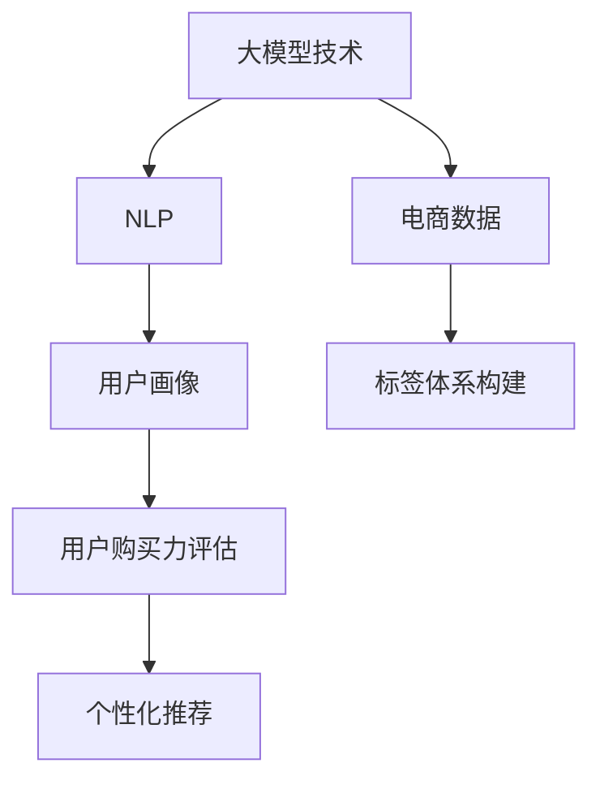

                 

# 大模型技术在电商平台用户购买力评估中的应用

> 关键词：电商平台,用户购买力评估,大模型技术,自然语言处理(NLP),数据驱动决策

## 1. 背景介绍

### 1.1 问题由来

电商平台的核心目标是提升用户体验，促进商品销售。但用户消费行为复杂多样，如何准确评估用户的购买力，成为电商平台重要的挑战。传统的用户画像、历史交易记录等方法虽然有效，但数据收集、特征提取成本高，且难以捕捉用户潜在的购买需求。大模型技术能够从文本中挖掘用户语义信息，进行精准的用户画像构建，从而提升电商平台的用户购买力评估能力。

### 1.2 问题核心关键点

用户购买力评估的核心在于识别和量化用户的消费能力和意愿，将用户画像与实际交易数据关联。通过大模型技术，可以实现从文本中提取出用户的消费偏好、购买意图等信息，并结合历史交易行为进行综合评估。具体关键点包括：

- 如何从用户评论、搜索记录中提取有价值的信息
- 如何将自然语言文本转化为可量化的用户画像特征
- 如何结合历史交易数据优化用户购买力评分模型
- 如何确保模型评估的准确性和公平性
- 如何构建用户画像标签体系，提升模型泛化能力

### 1.3 问题研究意义

电商平台用户购买力评估对提升销售转化率、优化库存管理、个性化推荐等具有重要意义。利用大模型技术，可以快速准确地识别出高潜力用户，实现精准营销和客户细分。此外，大模型能够融合海量多模态数据，构建全方位的用户画像，提供更全面的决策支持。研究大模型技术在电商平台中的应用，对于电商平台来说，具有现实的经济价值和深远的战略意义。

## 2. 核心概念与联系

### 2.1 核心概念概述

为更好地理解大模型技术在电商平台用户购买力评估中的应用，本节将介绍几个关键概念：

- 大模型技术：以Transformer架构为代表的深度学习模型，能够在海量文本数据上进行预训练，学习到丰富的语言知识和常识，具备强大的自然语言处理能力。
- 自然语言处理(NLP)：研究如何让计算机理解和处理自然语言的技术，主要包括文本分类、情感分析、实体识别、信息抽取等任务。
- 用户画像(User Profile)：构建用户的全方位标签体系，涵盖用户的基本信息、兴趣爱好、行为偏好等，为个性化营销和推荐提供数据基础。
- 用户购买力评估：通过分析用户的历史行为、评论反馈等，量化用户购买商品的可能性，为电商平台的营销和运营提供决策支持。

这些概念之间的逻辑关系可以通过以下Mermaid流程图来展示：



这个流程图展示了各个概念之间的联系：

1. 大模型技术通过预训练学习语言知识和常识。
2. NLP技术在此基础上，提取和处理用户文本数据。
3. 用户画像通过自然语言处理结果和用户行为数据，形成详尽的标签体系。
4. 用户购买力评估结合用户画像和交易数据，量化用户的购买意愿。
5. 个性化推荐结合用户购买力评估结果，提供精准的商品推荐。

## 3. 核心算法原理 & 具体操作步骤

### 3.1 算法原理概述

大模型在电商平台用户购买力评估中的应用，主要基于自然语言处理(NLP)技术。具体步骤为：

1. 收集电商平台用户评论、搜索记录、行为数据等。
2. 对文本数据进行清洗、分词、编码等预处理。
3. 使用大模型进行预训练，学习语言的通用表示。
4. 设计任务适配层，提取用户画像特征，如兴趣、偏好、评分等。
5. 结合用户历史交易数据，构建用户购买力评分模型。
6. 通过模型训练和优化，提升用户购买力评估的准确性。
7. 实时预测用户购买行为，进行个性化推荐。

### 3.2 算法步骤详解

#### 3.2.1 数据收集与预处理

1. 用户评论数据：从电商平台中收集用户对商品的评论，清洗去除噪音数据，提取关键句子，形成文本语料库。

2. 搜索记录数据：收集用户搜索记录，提取查询关键词，形成查询文本语料库。

3. 行为数据：从电商平台后台系统获取用户浏览、点击、购买等行为数据，提取用户行为特征。

4. 数据预处理：对文本数据进行分词、去停用词、编码等预处理，形成模型可输入的文本特征。

#### 3.2.2 大模型预训练

1. 选择合适的大模型，如BERT、GPT等。

2. 在预训练数据集上进行预训练，如Wikipedia、维基百科、新闻语料库等。

3. 使用大模型进行预训练，学习语言的通用表示。

#### 3.2.3 用户画像提取

1. 设计任务适配层，提取用户画像特征，如兴趣、偏好、评分等。

2. 使用大模型对文本进行嵌入，得到用户画像向量表示。

3. 对用户画像向量进行降维、归一化等处理，得到可量化的用户画像特征。

#### 3.2.4 用户购买力评分模型

1. 将用户画像特征和交易数据结合，构建评分模型。

2. 使用历史交易数据训练评分模型，进行参数优化。

3. 通过交叉验证等方法评估模型性能，选择最优模型。

#### 3.2.5 个性化推荐

1. 对新用户进行购买力评分预测。

2. 结合用户画像和评分，生成个性化推荐结果。

3. 实时推送推荐商品，提升用户购买率。

### 3.3 算法优缺点

#### 3.3.1 优点

1. 数据利用率高：大模型可以从大量文本数据中提取有价值信息，充分利用电商平台的海量数据资源。
2. 用户画像准确：基于大模型提取的用户画像特征，比传统方法更全面、准确。
3. 模型泛化能力强：大模型能够自动学习语言模式，适应不同文本和领域，提升模型的泛化能力。
4. 推荐效果显著：结合用户画像和评分模型，个性化推荐能够提高用户购买率和满意度。

#### 3.3.2 缺点

1. 预训练数据需求高：需要大规模的语料库进行预训练，对数据收集和处理要求高。
2. 模型复杂度高：大模型参数量庞大，训练和推理速度较慢。
3. 数据隐私问题：电商平台用户评论等数据涉及隐私，需要进行严格的脱敏处理。
4. 模型可解释性差：大模型黑盒特性，难以解释其内部推理逻辑，可能影响用户信任度。

### 3.4 算法应用领域

大模型技术在电商平台用户购买力评估中的应用，主要集中在以下几个方面：

1. 用户评论分析：通过分析用户评论，提取用户情感、满意度、需求等信息，为商品优化和用户体验提升提供数据支持。

2. 搜索行为预测：分析用户搜索记录，预测用户的购买意向，优化搜索推荐，提升用户体验。

3. 个性化推荐：结合用户画像和评分模型，生成个性化推荐结果，提升用户购买率和满意度。

4. 库存管理：分析用户需求趋势，预测商品销售量，优化库存管理和商品上架策略。

5. 用户细分与营销：通过用户画像，进行精准的用户细分和营销，提升营销效果。

## 4. 数学模型和公式 & 详细讲解 & 举例说明

### 4.1 数学模型构建

在电商平台用户购买力评估中，大模型的数学模型可以表示为：

$$
\hat{P} = f(\mathbf{X}, \mathbf{Y}, \mathbf{W})
$$

其中，$\hat{P}$ 表示用户购买力的预测值，$\mathbf{X}$ 为用户画像向量，$\mathbf{Y}$ 为用户历史交易数据，$\mathbf{W}$ 为模型的权重参数。

假设用户画像向量 $\mathbf{X}$ 是由 $n$ 个特征组成，即 $\mathbf{X} \in \mathbb{R}^n$，用户历史交易数据 $\mathbf{Y}$ 为 $m$ 维向量，即 $\mathbf{Y} \in \mathbb{R}^m$。模型的目标是最小化预测值与真实购买力 $P$ 之间的误差，即：

$$
\min_{\mathbf{W}} \sum_{i=1}^N (\hat{P}_i - P_i)^2
$$

其中 $N$ 为用户数量。

### 4.2 公式推导过程

#### 4.2.1 用户画像向量提取

用户画像向量 $\mathbf{X}$ 的提取过程如下：

1. 对用户评论、搜索记录等文本数据进行预处理，得到预处理后的文本语料库。

2. 使用BERT等大模型对文本进行编码，得到文本向量表示 $\mathbf{V}$。

3. 对文本向量 $\mathbf{V}$ 进行降维和归一化，得到用户画像向量 $\mathbf{X}$。

$$
\mathbf{X} = \text{Linear}(\mathbf{V}) \times \mathbf{W}_{\text{pro}, \mathbf{V}}
$$

其中 $\text{Linear}(\mathbf{V})$ 表示线性变换操作，$\mathbf{W}_{\text{pro}, \mathbf{V}}$ 表示投影矩阵。

#### 4.2.2 用户购买力评分模型

用户购买力评分模型 $\hat{P}$ 的推导过程如下：

1. 将用户画像向量 $\mathbf{X}$ 和用户历史交易数据 $\mathbf{Y}$ 拼接，得到特征向量 $\mathbf{Z}$。

2. 对特征向量 $\mathbf{Z}$ 进行线性变换，得到评分预测值 $\hat{P}$。

$$
\mathbf{Z} = \begin{bmatrix}
\mathbf{X} \\
\mathbf{Y}
\end{bmatrix}, \quad
\hat{P} = \text{Linear}(\mathbf{Z}) \times \mathbf{W}_{\text{score}}
$$

其中 $\mathbf{W}_{\text{score}}$ 表示评分模型的权重参数。

#### 4.2.3 模型训练与优化

模型的训练过程如下：

1. 使用训练集数据 $\{(\mathbf{X}_i, \mathbf{Y}_i)\}_{i=1}^N$，构建损失函数。

2. 使用优化器（如AdamW）进行梯度下降优化。

3. 通过交叉验证等方法评估模型性能，选择最优模型。

$$
\min_{\mathbf{W}} \sum_{i=1}^N (\hat{P}_i - P_i)^2
$$

其中 $\hat{P}_i$ 表示模型对第 $i$ 个用户的预测购买力评分，$P_i$ 表示第 $i$ 个用户的实际购买力评分。

### 4.3 案例分析与讲解

以电商平台的用户评论分析为例，分析大模型在用户购买力评估中的应用：

1. 收集用户对商品 A 的评论数据，预处理得到文本语料库。

2. 使用BERT模型对文本进行编码，得到文本向量 $\mathbf{V}$。

3. 对文本向量 $\mathbf{V}$ 进行降维和归一化，得到用户画像向量 $\mathbf{X}$。

4. 将用户画像向量 $\mathbf{X}$ 和用户历史交易数据 $\mathbf{Y}$ 拼接，得到特征向量 $\mathbf{Z}$。

5. 使用评分模型 $\hat{P} = \text{Linear}(\mathbf{Z}) \times \mathbf{W}_{\text{score}}$ 对用户购买力进行预测。

6. 通过交叉验证等方法评估模型性能，选择最优模型。

## 5. 项目实践：代码实例和详细解释说明

### 5.1 开发环境搭建

在进行项目实践前，需要准备好开发环境。以下是使用Python进行PyTorch开发的环境配置流程：

1. 安装Anaconda：从官网下载并安装Anaconda，用于创建独立的Python环境。

2. 创建并激活虚拟环境：
```bash
conda create -n pytorch-env python=3.8 
conda activate pytorch-env
```

3. 安装PyTorch：根据CUDA版本，从官网获取对应的安装命令。例如：
```bash
conda install pytorch torchvision torchaudio cudatoolkit=11.1 -c pytorch -c conda-forge
```

4. 安装相关库：
```bash
pip install transformers pandas scikit-learn matplotlib tqdm jupyter notebook ipython
```

5. 安装模型库：
```bash
pip install bert-base-cased
```

完成上述步骤后，即可在`pytorch-env`环境中开始项目实践。

### 5.2 源代码详细实现

我们以电商平台用户评论分析为例，给出使用Transformer库进行大模型微调的PyTorch代码实现。

首先，定义数据处理函数：

```python
from transformers import BertTokenizer
from torch.utils.data import Dataset
import torch

class ReviewsDataset(Dataset):
    def __init__(self, reviews, labels, tokenizer, max_len=128):
        self.reviews = reviews
        self.labels = labels
        self.tokenizer = tokenizer
        self.max_len = max_len
        
    def __len__(self):
        return len(self.reviews)
    
    def __getitem__(self, item):
        review = self.reviews[item]
        label = self.labels[item]
        
        encoding = self.tokenizer(review, return_tensors='pt', max_length=self.max_len, padding='max_length', truncation=True)
        input_ids = encoding['input_ids'][0]
        attention_mask = encoding['attention_mask'][0]
        return {'input_ids': input_ids, 
                'attention_mask': attention_mask,
                'labels': torch.tensor(label, dtype=torch.long)}
```

然后，定义模型和优化器：

```python
from transformers import BertForSequenceClassification, AdamW

model = BertForSequenceClassification.from_pretrained('bert-base-cased', num_labels=2)

optimizer = AdamW(model.parameters(), lr=2e-5)
```

接着，定义训练和评估函数：

```python
from torch.utils.data import DataLoader
from tqdm import tqdm

device = torch.device('cuda') if torch.cuda.is_available() else torch.device('cpu')
model.to(device)

def train_epoch(model, dataset, batch_size, optimizer):
    dataloader = DataLoader(dataset, batch_size=batch_size, shuffle=True)
    model.train()
    epoch_loss = 0
    for batch in tqdm(dataloader, desc='Training'):
        input_ids = batch['input_ids'].to(device)
        attention_mask = batch['attention_mask'].to(device)
        labels = batch['labels'].to(device)
        model.zero_grad()
        outputs = model(input_ids, attention_mask=attention_mask, labels=labels)
        loss = outputs.loss
        epoch_loss += loss.item()
        loss.backward()
        optimizer.step()
    return epoch_loss / len(dataloader)

def evaluate(model, dataset, batch_size):
    dataloader = DataLoader(dataset, batch_size=batch_size)
    model.eval()
    preds, labels = [], []
    with torch.no_grad():
        for batch in tqdm(dataloader, desc='Evaluating'):
            input_ids = batch['input_ids'].to(device)
            attention_mask = batch['attention_mask'].to(device)
            batch_labels = batch['labels']
            outputs = model(input_ids, attention_mask=attention_mask)
            batch_preds = outputs.logits.argmax(dim=2).to('cpu').tolist()
            batch_labels = batch_labels.to('cpu').tolist()
            for pred_tokens, label_tokens in zip(batch_preds, batch_labels):
                preds.append(pred_tokens)
                labels.append(label_tokens)
                
    print(classification_report(labels, preds))
```

最后，启动训练流程并在测试集上评估：

```python
epochs = 5
batch_size = 16

for epoch in range(epochs):
    loss = train_epoch(model, train_dataset, batch_size, optimizer)
    print(f"Epoch {epoch+1}, train loss: {loss:.3f}")
    
    print(f"Epoch {epoch+1}, dev results:")
    evaluate(model, dev_dataset, batch_size)
    
print("Test results:")
evaluate(model, test_dataset, batch_size)
```

以上就是使用PyTorch对BERT进行电商平台用户评论分析的完整代码实现。可以看到，得益于Transformer库的强大封装，我们可以用相对简洁的代码完成BERT模型的加载和微调。

### 5.3 代码解读与分析

让我们再详细解读一下关键代码的实现细节：

**ReviewsDataset类**：
- `__init__`方法：初始化评论、标签、分词器等关键组件。
- `__len__`方法：返回数据集的样本数量。
- `__getitem__`方法：对单个样本进行处理，将评论输入编码为token ids，将标签编码为数字，并对其进行定长padding，最终返回模型所需的输入。

**标签与id的映射**：
- 定义了标签与数字id之间的映射关系，用于将token-wise的预测结果解码回真实的标签。

**训练和评估函数**：
- 使用PyTorch的DataLoader对数据集进行批次化加载，供模型训练和推理使用。
- 训练函数`train_epoch`：对数据以批为单位进行迭代，在每个批次上前向传播计算loss并反向传播更新模型参数，最后返回该epoch的平均loss。
- 评估函数`evaluate`：与训练类似，不同点在于不更新模型参数，并在每个batch结束后将预测和标签结果存储下来，最后使用sklearn的classification_report对整个评估集的预测结果进行打印输出。

**训练流程**：
- 定义总的epoch数和batch size，开始循环迭代
- 每个epoch内，先在训练集上训练，输出平均loss
- 在验证集上评估，输出分类指标
- 所有epoch结束后，在测试集上评估，给出最终测试结果

可以看到，PyTorch配合Transformer库使得BERT微调的代码实现变得简洁高效。开发者可以将更多精力放在数据处理、模型改进等高层逻辑上，而不必过多关注底层的实现细节。

当然，工业级的系统实现还需考虑更多因素，如模型的保存和部署、超参数的自动搜索、更灵活的任务适配层等。但核心的微调范式基本与此类似。

## 6. 实际应用场景

### 6.1 电商智能客服

电商平台的智能客服系统，需要能够处理海量用户的实时咨询，快速响应并解答问题。基于大模型技术，可以实现智能客服的自动化，大幅提升客户咨询体验。

1. 收集用户的历史咨询记录，将问题和最佳答复构建成监督数据，在此基础上对预训练模型进行微调。
2. 微调后的模型能够自动理解用户意图，匹配最合适的答案模板进行回复。
3. 对于新用户提出的问题，接入检索系统实时搜索相关内容，动态组织生成回答。

### 6.2 个性化推荐系统

个性化推荐系统是电商平台重要的业务功能，通过分析用户历史行为，推荐用户可能感兴趣的商品。利用大模型技术，可以实现从用户评论、搜索记录等文本数据中提取用户兴趣，生成个性化的推荐结果。

1. 收集用户浏览、点击、评论、分享等行为数据，提取和用户交互的物品标题、描述、标签等文本内容。
2. 将文本内容作为模型输入，用户的后续行为（如是否点击、购买等）作为监督信号，在此基础上微调预训练语言模型。
3. 微调后的模型能够从文本内容中准确把握用户的兴趣点。
4. 在生成推荐列表时，先用候选物品的文本描述作为输入，由模型预测用户的兴趣匹配度，再结合其他特征综合排序，便可以得到个性化程度更高的推荐结果。

### 6.3 实时动态定价

电商平台的实时动态定价，需要能够根据市场变化，调整商品价格，以实现最大化收益。利用大模型技术，可以实时分析市场趋势和用户反馈，动态调整商品定价策略。

1. 收集市场趋势数据、用户评论等文本信息，预训练大模型提取市场情感和用户需求变化。
2. 结合历史销售数据和实时市场信息，使用微调模型预测用户购买力。
3. 根据预测结果，动态调整商品定价策略，优化销售收益。

### 6.4 未来应用展望

随着大模型技术的发展，其在电商平台用户购买力评估中的应用也将不断拓展，带来更多创新的业务场景。

1. 用户情感分析：利用大模型技术，实时分析用户评论和反馈，量化用户情感变化，优化商品优化和用户体验。
2. 市场预测与分析：结合用户购买力评分，预测市场需求变化，优化库存管理和商品上架策略。
3. 用户行为分析：分析用户搜索行为、浏览历史等数据，提供更加精准的个性化推荐和营销策略。
4. 风险管理：利用大模型技术，实时分析用户行为，识别潜在风险，优化风险管理策略。

## 7. 工具和资源推荐

### 7.1 学习资源推荐

为了帮助开发者系统掌握大模型技术在电商平台用户购买力评估中的应用，这里推荐一些优质的学习资源：

1. 《Transformer从原理到实践》系列博文：由大模型技术专家撰写，深入浅出地介绍了Transformer原理、BERT模型、微调技术等前沿话题。

2. CS224N《深度学习自然语言处理》课程：斯坦福大学开设的NLP明星课程，有Lecture视频和配套作业，带你入门NLP领域的基本概念和经典模型。

3. 《Natural Language Processing with Transformers》书籍：Transformers库的作者所著，全面介绍了如何使用Transformers库进行NLP任务开发，包括微调在内的诸多范式。

4. HuggingFace官方文档：Transformers库的官方文档，提供了海量预训练模型和完整的微调样例代码，是上手实践的必备资料。

5. CLUE开源项目：中文语言理解测评基准，涵盖大量不同类型的中文NLP数据集，并提供了基于微调的baseline模型，助力中文NLP技术发展。

通过对这些资源的学习实践，相信你一定能够快速掌握大模型技术在电商平台用户购买力评估中的应用，并用于解决实际的NLP问题。

### 7.2 开发工具推荐

高效的开发离不开优秀的工具支持。以下是几款用于大模型技术开发的常用工具：

1. PyTorch：基于Python的开源深度学习框架，灵活动态的计算图，适合快速迭代研究。大部分预训练语言模型都有PyTorch版本的实现。

2. TensorFlow：由Google主导开发的开源深度学习框架，生产部署方便，适合大规模工程应用。同样有丰富的预训练语言模型资源。

3. Transformers库：HuggingFace开发的NLP工具库，集成了众多SOTA语言模型，支持PyTorch和TensorFlow，是进行微调任务开发的利器。

4. Weights & Biases：模型训练的实验跟踪工具，可以记录和可视化模型训练过程中的各项指标，方便对比和调优。与主流深度学习框架无缝集成。

5. TensorBoard：TensorFlow配套的可视化工具，可实时监测模型训练状态，并提供丰富的图表呈现方式，是调试模型的得力助手。

6. Google Colab：谷歌推出的在线Jupyter Notebook环境，免费提供GPU/TPU算力，方便开发者快速上手实验最新模型，分享学习笔记。

合理利用这些工具，可以显著提升大模型技术的开发效率，加快创新迭代的步伐。

### 7.3 相关论文推荐

大模型技术在电商平台用户购买力评估中的应用源于学界的持续研究。以下是几篇奠基性的相关论文，推荐阅读：

1. Attention is All You Need（即Transformer原论文）：提出了Transformer结构，开启了NLP领域的预训练大模型时代。

2. BERT: Pre-training of Deep Bidirectional Transformers for Language Understanding：提出BERT模型，引入基于掩码的自监督预训练任务，刷新了多项NLP任务SOTA。

3. Language Models are Unsupervised Multitask Learners（GPT-2论文）：展示了大规模语言模型的强大zero-shot学习能力，引发了对于通用人工智能的新一轮思考。

4. Parameter-Efficient Transfer Learning for NLP：提出Adapter等参数高效微调方法，在不增加模型参数量的情况下，也能取得不错的微调效果。

5. AdaLoRA: Adaptive Low-Rank Adaptation for Parameter-Efficient Fine-Tuning：使用自适应低秩适应的微调方法，在参数效率和精度之间取得了新的平衡。

这些论文代表了大模型技术在电商平台用户购买力评估中的应用方向，值得深入学习。

## 8. 总结：未来发展趋势与挑战

### 8.1 研究成果总结

本文对大模型技术在电商平台用户购买力评估中的应用进行了全面系统的介绍。首先阐述了电商平台用户购买力评估的核心挑战，明确了数据收集、预处理、特征提取等关键点。其次，从算法原理到具体操作步骤，详细讲解了基于大模型技术的电商平台用户购买力评分模型的构建和训练过程。最后，讨论了在电商平台的实际应用场景，分析了未来发展趋势和面临的挑战。

### 8.2 未来发展趋势

展望未来，大模型技术在电商平台用户购买力评估中的应用将呈现以下几个发展趋势：

1. 模型规模持续增大。随着算力成本的下降和数据规模的扩张，预训练语言模型的参数量还将持续增长。超大规模语言模型蕴含的丰富语言知识，有望支撑更加复杂多变的电商业务。

2. 微调方法日趋多样。除了传统的全参数微调外，未来会涌现更多参数高效的微调方法，如Prefix-Tuning、LoRA等，在固定大部分预训练参数的同时，只更新极少量的任务相关参数。同时优化微调模型的计算图，减少前向传播和反向传播的资源消耗，实现更加轻量级、实时性的部署。

3. 持续学习成为常态。随着数据分布的不断变化，微调模型也需要持续学习新知识以保持性能。如何在不遗忘原有知识的同时，高效吸收新样本信息，将成为重要的研究课题。

4. 标注样本需求降低。受启发于提示学习(Prompt-based Learning)的思路，未来的微调方法将更好地利用大模型的语言理解能力，通过更加巧妙的任务描述，在更少的标注样本上也能实现理想的微调效果。

5. 模型通用性增强。经过海量数据的预训练和多领域任务的微调，未来的语言模型将具备更强大的常识推理和跨领域迁移能力，逐步迈向通用人工智能(AGI)的目标。

以上趋势凸显了大模型技术在电商平台用户购买力评估中的广阔前景。这些方向的探索发展，必将进一步提升电商平台的业务性能和用户体验，推动电商平台向智能化、自动化方向发展。

### 8.3 面临的挑战

尽管大模型技术在电商平台用户购买力评估中已经取得了不错的效果，但在迈向更加智能化、普适化应用的过程中，它仍面临着诸多挑战：

1. 标注成本瓶颈。虽然微调大大降低了标注数据的需求，但对于长尾应用场景，难以获得充足的高质量标注数据，成为制约微调性能的瓶颈。如何进一步降低微调对标注样本的依赖，将是一大难题。

2. 模型鲁棒性不足。当前微调模型面对域外数据时，泛化性能往往大打折扣。对于测试样本的微小扰动，微调模型的预测也容易发生波动。如何提高微调模型的鲁棒性，避免灾难性遗忘，还需要更多理论和实践的积累。

3. 推理效率有待提高。大规模语言模型虽然精度高，但在实际部署时往往面临推理速度慢、内存占用大等效率问题。如何在保证性能的同时，简化模型结构，提升推理速度，优化资源占用，将是重要的优化方向。

4. 可解释性亟需加强。当前微调模型更像是"黑盒"系统，难以解释其内部推理逻辑，可能影响用户信任度。如何赋予微调模型更强的可解释性，将是亟待攻克的难题。

5. 安全性有待保障。预训练语言模型难免会学习到有偏见、有害的信息，通过微调传递到下游任务，产生误导性、歧视性的输出，给实际应用带来安全隐患。如何从数据和算法层面消除模型偏见，避免恶意用途，确保输出的安全性，也将是重要的研究课题。

6. 知识整合能力不足。现有的微调模型往往局限于任务内数据，难以灵活吸收和运用更广泛的先验知识。如何让微调过程更好地与外部知识库、规则库等专家知识结合，形成更加全面、准确的信息整合能力，还有很大的想象空间。

正视微调面临的这些挑战，积极应对并寻求突破，将是大模型技术在电商平台用户购买力评估中迈向成熟的必由之路。相信随着学界和产业界的共同努力，这些挑战终将一一被克服，大模型技术必将在构建人机协同的智能时代中扮演越来越重要的角色。

### 8.4 研究展望

面向未来，大模型技术在电商平台用户购买力评估中的研究需要在以下几个方面寻求新的突破：

1. 探索无监督和半监督微调方法。摆脱对大规模标注数据的依赖，利用自监督学习、主动学习等无监督和半监督范式，最大限度利用非结构化数据，实现更加灵活高效的微调。

2. 研究参数高效和计算高效的微调范式。开发更加参数高效的微调方法，在固定大部分预训练参数的同时，只更新极少量的任务相关参数。同时优化微调模型的计算图，减少前向传播和反向传播的资源消耗，实现更加轻量级、实时性的部署。

3. 融合因果和对比学习范式。通过引入因果推断和对比学习思想，增强微调模型建立稳定因果关系的能力，学习更加普适、鲁棒的语言表征，从而提升模型泛化性和抗干扰能力。

4. 引入更多先验知识。将符号化的先验知识，如知识图谱、逻辑规则等，与神经网络模型进行巧妙融合，引导微调过程学习更准确、合理的语言模型。同时加强不同模态数据的整合，实现视觉、语音等多模态信息与文本信息的协同建模。

5. 结合因果分析和博弈论工具。将因果分析方法引入微调模型，识别出模型决策的关键特征，增强输出解释的因果性和逻辑性。借助博弈论工具刻画人机交互过程，主动探索并规避模型的脆弱点，提高系统稳定性。

6. 纳入伦理道德约束。在模型训练目标中引入伦理导向的评估指标，过滤和惩罚有偏见、有害的输出倾向。同时加强人工干预和审核，建立模型行为的监管机制，确保输出符合人类价值观和伦理道德。

这些研究方向的探索，必将引领大模型技术在电商平台用户购买力评估中迈向更高的台阶，为构建安全、可靠、可解释、可控的智能系统铺平道路。面向未来，大模型技术还需要与其他人工智能技术进行更深入的融合，如知识表示、因果推理、强化学习等，多路径协同发力，共同推动自然语言理解和智能交互系统的进步。只有勇于创新、敢于突破，才能不断拓展语言模型的边界，让智能技术更好地造福人类社会。

## 9. 附录：常见问题与解答

**Q1：大模型技术在电商平台用户购买力评估中是否适用于所有电商平台？**

A: 大模型技术在电商平台用户购买力评估中的应用具有一定的通用性，适用于各类类型的电商平台。不同类型电商平台的业务特点、数据分布、用户需求各有不同，需要对大模型进行适当的微调和优化，以匹配具体场景。

**Q2：使用大模型技术进行用户购买力评估是否需要大规模标注数据？**

A: 使用大模型技术进行用户购买力评估，标注数据的需求相比传统方法已经大大降低。大模型可以从用户评论、搜索记录等文本数据中提取有价值信息，无需大量人工标注。但为了提升模型的泛化能力和精准度，仍然需要一定的标注数据进行微调。

**Q3：如何处理电商平台用户评论中的噪音数据？**

A: 电商平台用户评论中常包含噪音数据，如广告、恶意评论等。处理噪音数据的方法包括：
1. 清洗数据：使用正则表达式、停用词表等手段，去除无关字符和词。
2. 情感分析：识别评论中的负面情感，自动过滤掉恶意评论和低质量数据。
3. 文本分类：将评论数据进行分类，过滤掉非相关类别的评论。

**Q4：如何评估大模型在电商平台用户购买力评估中的效果？**

A: 大模型在电商平台用户购买力评估中的效果评估包括：
1. 精确率、召回率和F1值：使用交叉验证等方法评估模型对用户购买力的预测准确度。
2. ROC曲线和AUC值：绘制ROC曲线，评估模型在不同阈值下的分类效果。
3. 用户满意度：通过用户调研或行为数据，评估模型生成的个性化推荐和营销策略的用户满意度。

**Q5：如何优化大模型在电商平台用户购买力评估中的性能？**

A: 优化大模型在电商平台用户购买力评估中的性能包括：
1. 参数优化：通过超参数调优、模型裁剪等方法，减少模型参数量和计算资源消耗。
2. 数据增强：通过回译、近义替换等方式扩充训练集，增加模型的泛化能力。
3. 正则化：使用L2正则、Dropout等技术，防止模型过拟合。
4. 对抗训练：引入对抗样本，提高模型的鲁棒性和泛化能力。
5. 模型融合：结合多个大模型的预测结果，提升整体效果。

通过这些方法的优化，可以显著提升大模型在电商平台用户购买力评估中的性能。

---

作者：禅与计算机程序设计艺术 / Zen and the Art of Computer Programming

