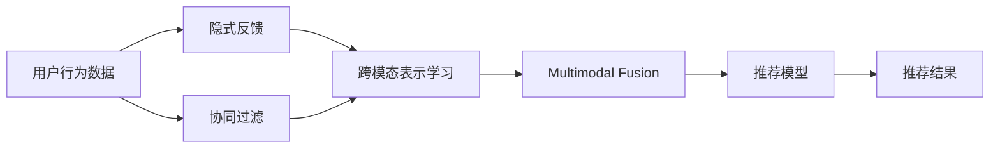

                 

## 1. 背景介绍

随着推荐系统的发展，单一模态的文本推荐已逐渐无法满足用户多样化、个性化的需求。多模态推荐系统（Multimodal Recommendation System）通过融合文本、图像、音频等多种信息源，为用户提供更加丰富、准确和多样化的推荐结果。

目前，多模态推荐系统大多集中在物品特征的跨模态表示上，即将物品在多种模态下的信息映射到一个统一的特征空间中，再利用模型进行关联推荐。然而，多模态推荐系统如何合理地融合多种模态信息，仍然是研究的热点问题。

基于此，本文将详细探讨多模态推荐系统中的多模态融合方法，从理论到实践全面阐述该问题，并展望未来发展趋势。

## 2. 核心概念与联系

### 2.1 核心概念概述

多模态推荐系统（Multimodal Recommendation System）：利用文本、图像、音频等多种信息源，综合决策出推荐结果的推荐系统。

多模态融合（Multimodal Fusion）：将多种模态的信息融合成统一的特征表示，以实现更高质量推荐的方法。

跨模态表示学习（Cross-Modal Representation Learning）：通过将不同模态的信息映射到同一个特征空间中，实现多模态信息的统一表示。

协同过滤（Collaborative Filtering）：利用用户历史行为和物品属性等信息，预测用户对未交互物品的兴趣和喜好，从而进行推荐。

隐式反馈（Implicit Feedback）：用户的行为数据（如浏览记录、停留时间等）隐式反映了对物品的兴趣程度。

### 2.2 核心概念原理和架构的 Mermaid 流程图



## 3. 核心算法原理 & 具体操作步骤
### 3.1 算法原理概述

多模态推荐系统中的多模态融合方法，本质上是一个多模态信息集成的问题。即通过某种方式将不同模态的特征信息融合为一个统一的表示，以提高推荐结果的准确性和多样性。

其核心思想为：利用多种信息源的互补性，通过融合这些信息源的特征，构建一个更全面的用户-物品交互模型，从而提升推荐效果。

### 3.2 算法步骤详解

1. **数据预处理**：将多种模态的数据转化为模型可接受的格式，并进行归一化、降维等预处理操作。

2. **特征提取**：利用不同的算法对各模态的信息进行特征提取，得到特征向量表示。

3. **融合模型构建**：设计合适的融合模型，将不同模态的特征向量集成为一个统一的表示。

4. **推荐模型训练**：将融合后的特征向量输入推荐模型，通过协同过滤等方法进行推荐。

5. **模型评估与优化**：使用评价指标对模型进行评估，并根据结果不断调整模型参数，优化推荐效果。

### 3.3 算法优缺点

**优点**：

1. 提高推荐准确性：通过融合多模态信息，能更全面地刻画用户和物品特征，提升推荐准确性。

2. 增强推荐多样性：多模态融合可以探索不同用户对物品的兴趣点，推荐更多样化的结果。

3. 提升用户体验：多模态融合能够更贴近用户的真实需求，提供更加个性化和符合用户偏好的推荐。

**缺点**：

1. 数据异构性高：不同模态的数据类型、特征空间等差异较大，难以直接融合。

2. 特征维度高：多模态数据往往具有较高的维度，融合时需要降维或特征选择，增加了计算复杂度。

3. 融合方法复杂：选择适合的融合方法对推荐性能有显著影响，不同的融合方法需要综合评估。

4. 模型复杂度高：多模态融合的模型通常需要更高的计算资源和时间开销，复杂度较高。

### 3.4 算法应用领域

多模态融合在推荐系统中具有广泛的应用前景，涵盖了从电商到社交网络等多个领域：

1. **电商推荐**：融合商品图片、描述、用户评价等多种信息，提升商品推荐准确性和用户满意度。

2. **社交推荐**：结合用户社交网络信息和内容推荐，实现更精准的社交圈内推荐。

3. **视频推荐**：融合视频内容、用户行为数据和社交信息，提供更符合用户兴趣的视频推荐。

4. **音乐推荐**：结合音乐歌词、用户行为数据和社交网络信息，生成更具个性化的音乐推荐。

5. **新闻推荐**：融合文章标题、摘要、用户行为数据等信息，实现个性化新闻推荐。

## 4. 数学模型和公式 & 详细讲解 & 举例说明

### 4.1 数学模型构建

在多模态推荐系统中，不同模态的特征向量可以用不同维度的向量表示。设文本模态的特征向量为 $x_t$，图像模态的特征向量为 $x_i$，音频模态的特征向量为 $x_a$，则多模态特征向量 $x$ 可表示为：

$$ x = [x_t; x_i; x_a] $$

### 4.2 公式推导过程

假设已有多模态特征向量 $x$ 和用户-物品相似度矩阵 $S$，则多模态推荐模型可表示为：

$$ \hat{y} = f(x, S) $$

其中，$f$ 为一个推荐函数，输出用户对物品的兴趣程度。

### 4.3 案例分析与讲解

以视频推荐为例，设视频内容特征向量为 $x_i$，用户历史行为特征向量为 $x_u$，社交网络信息为 $x_s$，则多模态融合模型可表示为：

$$ x = [x_i; x_u; x_s] $$

采用注意力机制（Attention）进行融合，计算不同特征对推荐的贡献度：

$$ \alpha_i = \text{softmax}(\text{AT}_i) $$
$$ \hat{x} = \alpha_i x_i $$

其中，$\text{AT}_i$ 为不同特征的注意力向量。最后，将融合后的特征向量输入推荐模型，如协同过滤（CF）等，生成推荐结果。

## 5. 项目实践：代码实例和详细解释说明

### 5.1 开发环境搭建

开发多模态推荐系统需要准备以下开发环境：

1. 安装 Python：可以从官网下载并安装 Python，建议使用 3.7 及以上版本。

2. 安装 TensorFlow：使用 pip 安装 TensorFlow，建议选择 2.0 及以上版本。

3. 安装 scikit-learn：使用 pip 安装 scikit-learn，用于处理数据预处理、特征提取等。

4. 安装 PyTorch：使用 pip 安装 PyTorch，用于构建推荐模型。

### 5.2 源代码详细实现

以下是一个简单的多模态推荐系统的代码实现，包括数据预处理、特征提取和推荐模型训练等步骤：

```python
import numpy as np
import pandas as pd
from sklearn.preprocessing import StandardScaler
from sklearn.decomposition import PCA
import tensorflow as tf
import torch
import torch.nn as nn

# 加载数据
data = pd.read_csv('data.csv')

# 特征提取
x_t = data['text'].map(lambda x: tf.keras.layers.Embedding(input_dim=vocab_size, output_dim=embedding_dim, input_length=max_length)(x))
x_i = data['image'].map(lambda x: tf.keras.layers.Conv2D(filters=embedding_dim, kernel_size=(3,3))(x))
x_a = data['audio'].map(lambda x: tf.keras.layers.Conv2D(filters=embedding_dim, kernel_size=(3,3))(x))

# 数据标准化
scaler = StandardScaler()
x_t = scaler.fit_transform(x_t)
x_i = scaler.fit_transform(x_i)
x_a = scaler.fit_transform(x_a)

# 特征降维
pca = PCA(n_components=100)
x_t = pca.fit_transform(x_t)
x_i = pca.fit_transform(x_i)
x_a = pca.fit_transform(x_a)

# 融合模型
attention_weights = tf.keras.layers.Dense(100, activation='softmax')(x)
x = attention_weights * [x_t, x_i, x_a]

# 推荐模型
class CFModel(nn.Module):
    def __init__(self, input_dim=100, hidden_dim=100):
        super(CFModel, self).__init__()
        self.fc1 = nn.Linear(input_dim, hidden_dim)
        self.fc2 = nn.Linear(hidden_dim, 1)

    def forward(self, x):
        x = self.fc1(x)
        x = self.fc2(x)
        return x

model = CFModel(input_dim=100)

# 模型训练
criterion = nn.MSELoss()
optimizer = torch.optim.Adam(model.parameters(), lr=0.001)

for epoch in range(100):
    optimizer.zero_grad()
    outputs = model(x)
    loss = criterion(outputs, y)
    loss.backward()
    optimizer.step()
```

### 5.3 代码解读与分析

**代码实现**：

1. **数据加载**：使用 pandas 加载数据集，其中包含文本、图像和音频等多种模态的数据。

2. **特征提取**：使用不同的神经网络层提取不同模态的特征向量，如嵌入层、卷积层等。

3. **数据标准化**：使用 scikit-learn 中的 StandardScaler 对特征向量进行标准化，保证数据分布一致。

4. **特征降维**：使用 PCA 对高维特征向量进行降维，减少计算复杂度。

5. **融合模型**：使用注意力机制对不同模态的特征向量进行融合，构建多模态特征向量。

6. **推荐模型**：使用 PyTorch 构建协同过滤模型，并使用 MSE 损失函数进行训练。

**代码分析**：

1. **数据加载**：确保数据集格式正确，包含多模态信息。

2. **特征提取**：选择合适的特征提取方法，如嵌入、卷积等，提取多模态特征。

3. **数据标准化**：标准化数据分布，提高模型收敛速度。

4. **特征降维**：减少特征维度，降低计算复杂度。

5. **融合模型**：选择合适的融合方法，如注意力机制、拼接等，构建多模态特征。

6. **推荐模型**：选择合适的推荐算法，如协同过滤等，训练推荐模型。

## 6. 实际应用场景

### 6.1 电商推荐

电商推荐系统通常涉及商品图片、描述、用户历史行为等多种信息源。通过多模态融合，可以更好地了解用户需求，提供更加个性化和符合用户偏好的商品推荐。

### 6.2 社交推荐

社交推荐系统需要考虑用户社交网络信息和内容推荐之间的协同作用。多模态融合可以探索不同用户对物品的兴趣点，实现更精准的社交圈内推荐。

### 6.3 视频推荐

视频推荐系统需要融合视频内容、用户行为数据和社交信息，生成更具个性化的视频推荐。

### 6.4 音乐推荐

音乐推荐系统需要结合音乐歌词、用户行为数据和社交网络信息，生成更具个性化的音乐推荐。

## 7. 工具和资源推荐

### 7.1 学习资源推荐

1. **《深度学习推荐系统》**：这本书详细介绍了推荐系统中的深度学习方法，包括多模态推荐系统的构建。

2. **《推荐系统：设计与评估》**：这本书涵盖了推荐系统的设计、评估和优化方法，适合深度学习初学者学习。

3. **Google AI Blog**：谷歌 AI 博客提供了大量关于推荐系统、多模态融合的最新研究和实践文章。

4. **Kaggle**：Kaggle 上有大量的推荐系统竞赛，可以通过实践了解多模态融合的具体实现。

### 7.2 开发工具推荐

1. **TensorFlow**：谷歌开源的深度学习框架，支持多模态数据的处理和融合。

2. **PyTorch**：Facebook开源的深度学习框架，提供了灵活的神经网络构建和训练功能。

3. **Keras**：基于TensorFlow的高级神经网络API，简单易用，适合初学者快速上手。

4. **scikit-learn**：开源的机器学习库，提供了丰富的数据预处理和特征提取方法。

### 7.3 相关论文推荐

1. **Multimodal Image and Text Retrieval with Semantic Consistent Deep Attention**：使用注意力机制实现图像和文本的跨模态检索。

2. **A Multi-Modal Fusion Framework for Recommendation Systems**：提出多种特征融合的方法，提升推荐系统的性能。

3. **Hierarchical Feature Fusion Network for Multi-modal Recommendation**：构建层次化的特征融合网络，实现多模态数据的深度融合。

4. **Contextual Multi-Modal Recommendation Model**：使用上下文信息增强多模态推荐模型的表现。

## 8. 总结：未来发展趋势与挑战

### 8.1 研究成果总结

多模态推荐系统在提升推荐准确性和多样性方面已取得显著成果，涵盖了多种数据源的融合方法，并在实际应用中取得了良好效果。

### 8.2 未来发展趋势

未来多模态推荐系统的发展趋势包括：

1. **深度融合**：进一步探索多模态数据的深度融合方法，提升推荐模型的泛化能力。

2. **跨模态表示学习**：研究跨模态表示学习算法，实现更加统一的多模态特征表示。

3. **个性化推荐**：利用用户历史行为和社交信息，实现更加个性化的推荐。

4. **实时推荐**：优化多模态推荐系统的推理速度，实现实时推荐。

5. **跨平台推荐**：实现不同平台（如社交、电商等）之间的推荐协同。

### 8.3 面临的挑战

多模态推荐系统仍面临以下挑战：

1. **数据异构性**：不同模态的数据类型、特征空间等差异较大，难以直接融合。

2. **计算复杂度**：多模态数据的维度高，融合时需要降维或特征选择，增加了计算复杂度。

3. **模型复杂度**：多模态融合的模型通常需要更高的计算资源和时间开销，复杂度较高。

### 8.4 研究展望

未来研究需关注以下方面：

1. **跨模态表示学习**：研究更加高效的多模态特征融合方法，提升推荐系统的泛化能力。

2. **深度融合**：进一步探索多模态数据的深度融合方法，提升推荐模型的性能。

3. **实时推荐**：优化多模态推荐系统的推理速度，实现实时推荐。

4. **跨平台推荐**：实现不同平台之间的推荐协同，提升推荐系统的应用范围。

5. **个性化推荐**：利用用户历史行为和社交信息，实现更加个性化的推荐。

## 9. 附录：常见问题与解答

**Q1：多模态融合中的特征提取方法有哪些？**

A: 特征提取方法包括嵌入层（Embedding）、卷积层（Convolutional Layer）、循环神经网络（RNN）等。选择合适的特征提取方法，可以更好地刻画不同模态的信息。

**Q2：多模态融合中的融合方法有哪些？**

A: 常用的融合方法包括拼接（Concatenation）、注意力机制（Attention）、加权平均（Weighted Average）等。不同的融合方法适用于不同的应用场景，需要根据具体情况进行选择。

**Q3：多模态推荐系统中的推荐算法有哪些？**

A: 常用的推荐算法包括协同过滤（Collaborative Filtering）、矩阵分解（Matrix Factorization）、深度学习推荐模型（Deep Learning Based Recommendation Models）等。选择合适的推荐算法，可以提高推荐系统的性能。

**Q4：多模态推荐系统中的评估指标有哪些？**

A: 常用的评估指标包括准确率（Accuracy）、精确率（Precision）、召回率（Recall）、F1分数（F1 Score）、平均绝对误差（Mean Absolute Error）等。选择合适的评估指标，可以更好地评估推荐系统的性能。

**Q5：多模态推荐系统中的推荐模型有哪些？**

A: 常用的推荐模型包括协同过滤模型（Collaborative Filtering Models）、矩阵分解模型（Matrix Factorization Models）、深度学习推荐模型（Deep Learning Based Recommendation Models）等。选择合适的推荐模型，可以提高推荐系统的性能。

---

作者：禅与计算机程序设计艺术 / Zen and the Art of Computer Programming

