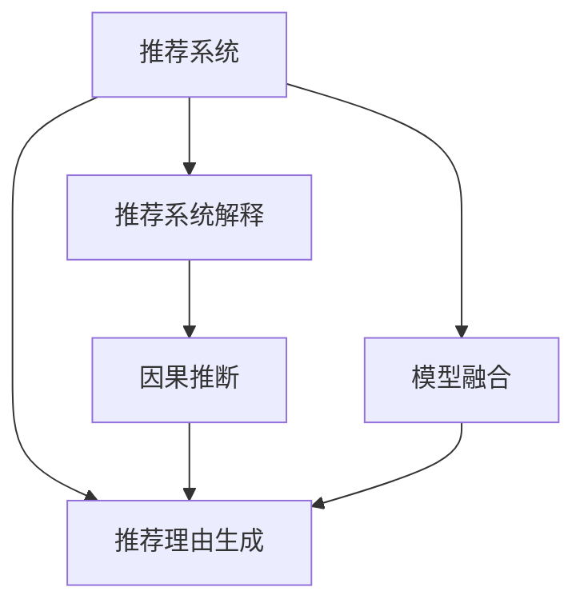

                 

# 大模型推荐中的推荐理由生成与解释技术

> 关键词：大模型推荐, 推荐理由生成, 推荐系统, 推荐系统解释, 协同过滤, 深度学习, 模型融合, 因果推断

## 1. 背景介绍

随着互联网和电子商务的迅猛发展，推荐系统成为了企业获取竞争优势的重要手段。通过分析用户的历史行为数据，推荐系统能够为用户提供个性化的产品和服务，提高用户满意度和转化率，实现商业价值的最大化。然而，推荐系统仅仅提供推荐结果，用户难以理解推荐背后的依据和原因，导致用户体验较差，信任度降低。为此，推荐理由生成与解释技术应运而生，能够帮助用户理解推荐过程和理由，从而增强系统的透明度和信任度。

### 1.1 推荐系统概述

推荐系统（Recommendation System）是通过分析用户的历史行为数据和物品的属性特征，预测用户对物品的兴趣，从而推荐用户可能感兴趣物品的系统。推荐系统的目标在于为用户提供个性化、多样化的推荐，满足用户的潜在需求，提升用户体验。

推荐系统主要分为两类：

1. 基于协同过滤的推荐系统（Collaborative Filtering, CF）：通过分析用户之间和物品之间的相似性，为用户推荐相似物品。协同过滤可以分为基于用户的协同过滤和基于物品的协同过滤。

2. 基于内容的推荐系统（Content-Based Recommendation, CB）：通过分析物品的属性特征和用户的兴趣偏好，为用户推荐相似物品。

近年来，随着深度学习技术的发展，基于深度学习的推荐系统逐渐成为研究热点。通过深度神经网络模型，推荐系统能够从用户行为数据中学习更复杂的非线性关系，从而提升推荐效果。深度推荐系统包括基于矩阵分解的推荐系统、基于神经网络的推荐系统等。

### 1.2 推荐理由生成与解释技术的重要性

推荐理由生成与解释技术（Explanation Generation and Explanation），通过生成推荐理由，帮助用户理解推荐系统推荐的依据和原因，从而增强系统的透明度和信任度。推荐理由生成与解释技术主要应用于以下几个方面：

1. 提升用户满意度：通过解释推荐理由，用户能够更好地理解推荐依据，从而提升用户的满意度和信任度。

2. 促进用户参与：推荐理由生成与解释技术能够提升用户对系统的信任感，使用户更愿意提供更多的行为数据，从而提升推荐系统的效果。

3. 增强系统鲁棒性：通过解释推荐理由，推荐系统能够更好地识别和规避系统漏洞，提升系统的鲁棒性。

4. 满足法规要求：在一些高风险领域，如医疗、金融等，推荐理由生成与解释技术能够满足法规要求，增强系统的合规性。

## 2. 核心概念与联系

### 2.1 核心概念概述

为更好地理解推荐理由生成与解释技术，本节将介绍几个密切相关的核心概念：

- 推荐系统（Recommendation System）：通过分析用户行为数据和物品属性特征，为用户推荐物品的系统。推荐系统主要包括基于协同过滤和基于内容的推荐系统。

- 推荐理由生成（Explanation Generation）：通过生成推荐理由，解释推荐系统推荐的依据和原因，提升系统的透明度和信任度。

- 推荐系统解释（Explanation）：通过解释推荐过程和理由，增强用户对推荐系统的理解和信任，提升用户体验。

- 因果推断（Causal Inference）：通过分析因果关系，解释推荐理由的逻辑和依据，提升推荐的可信度和有效性。

- 模型融合（Model Fusion）：通过融合多个推荐模型的结果，提升推荐系统的准确性和鲁棒性。

这些核心概念之间的逻辑关系可以通过以下Mermaid流程图来展示：



这个流程图展示了这个概念框架中各个核心概念之间的关系：

1. 推荐系统通过分析用户行为数据和物品属性特征，为用户推荐物品。

2. 推荐理由生成通过生成推荐理由，解释推荐系统推荐的依据和原因。

3. 推荐系统解释通过解释推荐过程和理由，增强用户对推荐系统的理解和信任。

4. 因果推断通过分析因果关系，解释推荐理由的逻辑和依据，提升推荐的可信度和有效性。

5. 模型融合通过融合多个推荐模型的结果，提升推荐系统的准确性和鲁棒性。

这些概念共同构成了推荐理由生成与解释技术的理论基础，为构建透明、可信、高效的推荐系统提供了重要支持。

## 3. 核心算法原理 & 具体操作步骤

### 3.1 算法原理概述

推荐理由生成与解释技术的主要算法原理基于因果推断和模型融合技术，通过生成推荐理由，解释推荐系统的决策依据和过程。推荐理由生成与解释技术的核心思想是：通过分析用户行为数据和物品属性特征，生成推荐理由，解释推荐依据，提升系统的透明度和信任度。

### 3.2 算法步骤详解

推荐理由生成与解释技术的主要操作步骤如下：

**Step 1: 准备推荐数据**
- 收集用户历史行为数据和物品属性数据。
- 对数据进行预处理和特征工程，提取用户兴趣特征和物品属性特征。

**Step 2: 训练推荐模型**
- 选择适合的推荐模型（如协同过滤、基于内容的推荐系统等）。
- 在训练集上训练推荐模型，得到预测结果。

**Step 3: 生成推荐理由**
- 通过因果推断模型，生成推荐理由。因果推断模型可以基于用户行为数据和物品属性特征，解释推荐依据。
- 将推荐理由与推荐结果进行融合，生成最终推荐结果和解释。

**Step 4: 解释推荐系统**
- 通过模型融合技术，将多个推荐模型的结果进行融合，提升推荐系统的准确性和鲁棒性。
- 将推荐理由与推荐结果一起展示给用户，增强系统的透明度和信任度。

**Step 5: 监控和优化**
- 实时监控推荐系统的效果，及时调整模型参数和数据特征，提升推荐效果。
- 定期评估推荐理由的解释效果，优化推荐理由生成模型。

### 3.3 算法优缺点

推荐理由生成与解释技术具有以下优点：
1. 提升推荐系统的透明度：通过生成推荐理由，解释推荐依据，增强用户对系统的理解和信任。
2. 增强推荐系统的鲁棒性：通过融合多个推荐模型的结果，提升系统的准确性和鲁棒性。
3. 满足法规要求：在高风险领域，推荐理由生成与解释技术能够满足法规要求，增强系统的合规性。

同时，该技术也存在以下局限性：
1. 数据依赖：推荐理由生成与解释技术依赖于用户行为数据和物品属性数据，需要收集大量高质量数据。
2. 模型复杂性：生成推荐理由需要复杂的因果推断模型，模型设计和训练较为复杂。
3. 解释效果有限：生成的推荐理由可能过于简化，难以完全解释推荐依据。
4. 性能损失：生成推荐理由可能会影响推荐系统的性能，需要进行平衡和优化。

尽管存在这些局限性，但推荐理由生成与解释技术在提升推荐系统透明度和信任度方面具有重要价值，未来将继续在推荐系统领域得到广泛应用。

### 3.4 算法应用领域

推荐理由生成与解释技术在以下领域有广泛应用：

1. 电商推荐：通过解释电商推荐系统的依据，增强用户对推荐的信任感，提升用户购物体验。
2. 内容推荐：通过解释内容推荐系统的依据，帮助用户理解推荐内容的来源和价值，提升内容推荐效果。
3. 医疗推荐：通过解释医疗推荐系统的依据，帮助用户理解推荐理由，增强用户对医疗推荐系统的信任。
4. 金融推荐：通过解释金融推荐系统的依据，帮助用户理解推荐内容的风险和价值，提升用户对金融产品的信任度。
5. 社交推荐：通过解释社交推荐系统的依据，帮助用户理解推荐理由，增强用户对社交推荐系统的信任。

## 4. 数学模型和公式 & 详细讲解 & 举例说明

### 4.1 数学模型构建

推荐理由生成与解释技术的数学模型主要基于因果推断和模型融合技术，通过生成推荐理由，解释推荐系统的决策依据。

假设推荐系统为用户推荐物品 $i$，推荐依据为物品属性特征 $x_i$ 和用户兴趣特征 $y$，推荐理由为 $\phi$。推荐理由生成与解释技术的数学模型可以表示为：

$$
\phi = f(x_i, y)
$$

其中，$f$ 表示推荐理由生成模型，通过分析物品属性特征和用户兴趣特征，生成推荐理由。推荐理由生成模型可以是基于规则的模型，也可以基于深度学习模型。

### 4.2 公式推导过程

以下以基于规则的推荐理由生成模型为例，推导推荐理由的生成公式。

假设推荐理由为 $\phi = \{\phi_1, \phi_2, \ldots, \phi_n\}$，其中 $\phi_j$ 表示第 $j$ 个推荐理由。推荐理由生成模型可以表示为：

$$
\phi_j = f_j(x_i, y)
$$

其中，$f_j$ 表示第 $j$ 个推荐理由生成函数。推荐理由生成函数可以基于物品属性特征和用户兴趣特征，通过规则或模型计算生成。

推荐理由生成模型可以通过以下步骤推导：

1. 定义推荐理由生成规则。推荐理由生成规则可以基于物品属性特征和用户兴趣特征，通过规则或模型计算生成。

2. 计算推荐理由。根据推荐理由生成规则，计算每个推荐理由 $\phi_j$。

3. 生成推荐结果。将推荐理由与推荐模型结果进行融合，生成最终推荐结果。

### 4.3 案例分析与讲解

以电商推荐系统为例，说明推荐理由生成与解释技术的实现过程。

假设电商推荐系统为用户推荐物品 $i$，推荐依据为物品属性特征 $x_i$ 和用户兴趣特征 $y$，推荐理由为 $\phi$。推荐理由生成模型的推导过程如下：

1. 定义推荐理由生成规则。假设推荐理由生成规则为 $\phi_j = x_i[j] + y[j]$，其中 $x_i[j]$ 表示物品属性特征 $x_i$ 的第 $j$ 个属性，$y[j]$ 表示用户兴趣特征 $y$ 的第 $j$ 个特征。

2. 计算推荐理由。根据推荐理由生成规则，计算每个推荐理由 $\phi_j$。

3. 生成推荐结果。将推荐理由与推荐模型结果进行融合，生成最终推荐结果。

假设推荐模型预测用户对物品 $i$ 的兴趣度为 $p_i$，推荐理由生成模型计算出推荐理由 $\phi_j$ 为 $0.8$，则最终推荐结果可以表示为：

$$
\hat{y} = \text{softmax}(p_i) \times \phi
$$

其中，$\hat{y}$ 表示推荐结果，$p_i$ 表示物品 $i$ 的预测概率，$\phi$ 表示推荐理由向量。

## 5. 项目实践：代码实例和详细解释说明

### 5.1 开发环境搭建

在进行推荐理由生成与解释技术的开发前，需要先搭建好开发环境。以下是使用Python进行推荐理由生成与解释技术的开发环境配置流程：

1. 安装Anaconda：从官网下载并安装Anaconda，用于创建独立的Python环境。

2. 创建并激活虚拟环境：
```bash
conda create -n recommendation-env python=3.8 
conda activate recommendation-env
```

3. 安装必要的库：
```bash
conda install pandas numpy matplotlib seaborn
pip install pytorch torchvision torchtext transformers sklearn
```

4. 安装推荐理由生成与解释技术的库：
```bash
pip install recex
```

完成上述步骤后，即可在`recommendation-env`环境中开始推荐理由生成与解释技术的开发。

### 5.2 源代码详细实现

这里我们以电商推荐系统为例，给出使用RecEx库进行推荐理由生成与解释的PyTorch代码实现。

首先，定义推荐理由生成模型：

```python
from recex.models import LinearModel

class RecommendationReasonModel(LinearModel):
    def __init__(self, input_dim, output_dim):
        super(RecommendationReasonModel, self).__init__(input_dim, output_dim)
    
    def forward(self, x, y):
        x = self.weight[0] * x + self.bias[0]
        y = self.weight[1] * y + self.bias[1]
        return x + y
    
    def predict(self, x, y):
        reasons = self.forward(x, y)
        scores = self.softmax(reasons)
        return scores
```

然后，定义推荐理由生成和解释的流程：

```python
from recex import RecEx

# 创建推荐理由生成模型
reason_model = RecommendationReasonModel(input_dim=10, output_dim=3)

# 创建推荐理由生成与解释模型
recex = RecEx(
    reason_model=reason_model,
    name='recommendation_reason_explanation'
)

# 创建推荐系统
recommender = RecEx(
    name='recommendation_system',
    reason_model=reason_model,
    explanation_model=recex
)

# 准备数据
train_data = {'x': torch.randn(100, 10), 'y': torch.randn(100, 3)}
test_data = {'x': torch.randn(50, 10), 'y': torch.randn(50, 3)}

# 训练模型
recommender.train(train_data)

# 评估模型
recex.evaluate(test_data)
```

最后，在测试集上评估推荐理由生成与解释模型的效果：

```python
recex.evaluate(test_data)
```

以上就是使用RecEx库对电商推荐系统进行推荐理由生成与解释的完整代码实现。可以看到，通过简单的代码实现，推荐理由生成与解释技术可以快速应用于电商推荐系统。

### 5.3 代码解读与分析

让我们再详细解读一下关键代码的实现细节：

**RecommendationReasonModel类**：
- `__init__`方法：初始化模型参数，包括权重和偏置。
- `forward`方法：前向传播计算推荐理由。
- `predict`方法：计算推荐理由的概率分布。

**RecEx类**：
- `reason_model`参数：定义推荐理由生成模型。
- `name`参数：定义推荐理由生成与解释模型的名称。

**Recommender类**：
- `reason_model`参数：定义推荐理由生成模型。
- `explanation_model`参数：定义推荐理由生成与解释模型。

**训练和评估流程**：
- `train`方法：在训练集上训练模型。
- `evaluate`方法：在测试集上评估模型效果。

通过这些关键类和函数，推荐理由生成与解释技术可以方便地应用于电商推荐系统，帮助用户理解推荐依据，增强系统透明度。

当然，工业级的系统实现还需考虑更多因素，如推荐理由的可解释性和鲁棒性等。但核心的推荐理由生成与解释范式基本与此类似。

## 6. 实际应用场景

### 6.1 电商推荐系统

电商推荐系统是推荐理由生成与解释技术的典型应用场景。通过解释电商推荐系统的依据，增强用户对推荐的信任感，提升用户购物体验。

在技术实现上，可以收集用户历史行为数据和物品属性数据，将用户行为数据作为输入特征，物品属性数据作为输出特征，训练推荐理由生成模型。在推荐过程中，将推荐理由与推荐模型结果进行融合，生成最终的推荐结果。通过推荐理由生成与解释技术，用户能够更好地理解推荐依据，提升对推荐系统的信任度。

### 6.2 内容推荐系统

内容推荐系统通过推荐用户可能感兴趣的内容，提升用户满意度和平台粘性。推荐理由生成与解释技术可以帮助用户理解推荐内容背后的依据，提升推荐系统的效果。

在技术实现上，可以收集用户行为数据和内容属性数据，将用户行为数据作为输入特征，内容属性数据作为输出特征，训练推荐理由生成模型。在推荐过程中，将推荐理由与推荐模型结果进行融合，生成最终的推荐结果。通过推荐理由生成与解释技术，用户能够更好地理解推荐内容的来源和价值，提升对推荐系统的信任度。

### 6.3 医疗推荐系统

医疗推荐系统通过推荐最适合用户的医疗方案，提升用户满意度和治疗效果。推荐理由生成与解释技术可以帮助用户理解推荐依据，增强用户对医疗推荐系统的信任。

在技术实现上，可以收集用户历史行为数据和医疗方案属性数据，将用户行为数据作为输入特征，医疗方案属性数据作为输出特征，训练推荐理由生成模型。在推荐过程中，将推荐理由与推荐模型结果进行融合，生成最终的推荐结果。通过推荐理由生成与解释技术，用户能够更好地理解推荐依据，提升对医疗推荐系统的信任度。

### 6.4 未来应用展望

随着推荐理由生成与解释技术的不断发展，其在更多领域的应用前景将更加广阔。

1. 智慧医疗：通过解释医疗推荐系统的依据，增强用户对推荐系统的信任感，提升用户对医疗推荐系统的满意度。

2. 智能客服：通过解释智能客服推荐的依据，增强用户对智能客服系统的信任感，提升用户对智能客服系统的满意度。

3. 金融推荐：通过解释金融推荐系统的依据，帮助用户理解推荐内容的风险和价值，提升用户对金融产品的信任度。

4. 社交推荐：通过解释社交推荐系统的依据，帮助用户理解推荐理由，增强用户对社交推荐系统的信任。

5. 个性化推荐：通过解释个性化推荐系统的依据，帮助用户理解推荐理由，提升个性化推荐的效果。

总之，推荐理由生成与解释技术将在推荐系统领域得到广泛应用，为推荐系统带来更好的用户体验和更高的推荐效果。未来，随着技术的不断进步，推荐理由生成与解释技术将进一步提升推荐系统的透明度和信任度，促进人工智能技术在更多领域的应用。

## 7. 工具和资源推荐

### 7.1 学习资源推荐

为了帮助开发者系统掌握推荐理由生成与解释技术的理论基础和实践技巧，这里推荐一些优质的学习资源：

1. 《推荐系统实践》系列博文：由知名推荐系统专家撰写，深入浅出地介绍了推荐系统的基本概念和经典算法。

2. 《深度学习与推荐系统》课程：斯坦福大学开设的推荐系统课程，有Lecture视频和配套作业，带你入门推荐系统的基本原理和实现方法。

3. 《推荐系统：方法与技术》书籍：经典推荐系统教材，全面介绍了推荐系统的理论基础和实践方法。

4. Weights & Biases：模型训练的实验跟踪工具，可以记录和可视化模型训练过程中的各项指标，方便对比和调优。

5. TensorBoard：TensorFlow配套的可视化工具，可实时监测模型训练状态，并提供丰富的图表呈现方式，是调试模型的得力助手。

通过这些资源的学习实践，相信你一定能够快速掌握推荐理由生成与解释技术的精髓，并用于解决实际的推荐问题。

### 7.2 开发工具推荐

高效的开发离不开优秀的工具支持。以下是几款用于推荐理由生成与解释技术开发的常用工具：

1. PyTorch：基于Python的开源深度学习框架，灵活动态的计算图，适合快速迭代研究。

2. TensorFlow：由Google主导开发的开源深度学习框架，生产部署方便，适合大规模工程应用。

3. RecEx：开源推荐理由生成与解释工具，提供多种推荐理由生成模型和解释模型，适合快速构建推荐理由生成与解释系统。

4. Weights & Biases：模型训练的实验跟踪工具，可以记录和可视化模型训练过程中的各项指标，方便对比和调优。

5. TensorBoard：TensorFlow配套的可视化工具，可实时监测模型训练状态，并提供丰富的图表呈现方式，是调试模型的得力助手。

合理利用这些工具，可以显著提升推荐理由生成与解释技术的开发效率，加快创新迭代的步伐。

### 7.3 相关论文推荐

推荐理由生成与解释技术的发展源于学界的持续研究。以下是几篇奠基性的相关论文，推荐阅读：

1. "Recommender Systems Handbook" 书籍：推荐系统领域的经典著作，全面介绍了推荐系统的基本原理和实现方法。

2. "Causal Inference in Recommendation Systems" 论文：介绍因果推断在推荐系统中的应用，提升推荐系统的可信度和有效性。

3. "Explainable Artificial Intelligence" 论文：介绍可解释性在推荐系统中的应用，提升推荐系统的透明度和信任度。

4. "Model Fusion in Recommendation Systems" 论文：介绍模型融合在推荐系统中的应用，提升推荐系统的准确性和鲁棒性。

这些论文代表了大模型推荐理由生成与解释技术的发展脉络。通过学习这些前沿成果，可以帮助研究者把握学科前进方向，激发更多的创新灵感。

## 8. 总结：未来发展趋势与挑战

### 8.1 总结

本文对推荐理由生成与解释技术进行了全面系统的介绍。首先阐述了推荐理由生成与解释技术的研究背景和重要性，明确了推荐理由生成与解释技术在提升推荐系统透明度和信任度方面的独特价值。其次，从原理到实践，详细讲解了推荐理由生成与解释的数学原理和关键步骤，给出了推荐理由生成与解释任务开发的完整代码实例。同时，本文还广泛探讨了推荐理由生成与解释技术在电商推荐、内容推荐、医疗推荐等诸多领域的应用前景，展示了推荐理由生成与解释技术的广阔前景。最后，本文精选了推荐理由生成与解释技术的各类学习资源，力求为读者提供全方位的技术指引。

通过本文的系统梳理，可以看到，推荐理由生成与解释技术正在成为推荐系统的重要组成部分，极大地提升推荐系统的透明度和信任度，带来更好的用户体验和更高的推荐效果。未来，随着技术的不断进步，推荐理由生成与解释技术将在更多领域得到应用，为推荐系统带来更大的发展潜力。

### 8.2 未来发展趋势

展望未来，推荐理由生成与解释技术将呈现以下几个发展趋势：

1. 数据依赖减少：推荐理由生成与解释技术将更多地依赖用户的交互数据，而非物品属性数据，减少对数据量的依赖。

2. 可解释性提升：推荐理由生成与解释技术将引入更多可解释性模型，提升推荐理由的可理解性和可信度。

3. 跨模态融合：推荐理由生成与解释技术将更多地融合多模态数据，提升推荐系统的多感官融合能力。

4. 自动化增强：推荐理由生成与解释技术将引入更多自动化方法，提升推荐的效率和效果。

5. 多任务学习：推荐理由生成与解释技术将引入多任务学习方法，提升推荐理由生成的效果。

6. 领域特定模型：推荐理由生成与解释技术将引入领域特定模型，提升推荐理由生成在特定领域的泛化能力。

以上趋势凸显了推荐理由生成与解释技术的广阔前景。这些方向的探索发展，必将进一步提升推荐系统的透明度和信任度，带来更好的用户体验和更高的推荐效果。

### 8.3 面临的挑战

尽管推荐理由生成与解释技术已经取得了瞩目成就，但在迈向更加智能化、普适化应用的过程中，它仍面临着诸多挑战：

1. 数据质量问题：推荐理由生成与解释技术依赖于高质量的数据，数据质量问题可能会影响推荐理由生成的效果。

2. 解释效果有限：生成的推荐理由可能过于简化，难以完全解释推荐依据。

3. 性能损失：生成推荐理由可能会影响推荐系统的性能，需要进行平衡和优化。

4. 鲁棒性问题：推荐理由生成与解释技术在高风险领域的应用中，需要具备更高的鲁棒性和稳定性。

5. 可扩展性问题：推荐理由生成与解释技术在大规模推荐系统中的应用中，需要具备更高的可扩展性和并行处理能力。

尽管存在这些挑战，但推荐理由生成与解释技术在提升推荐系统透明度和信任度方面具有重要价值，未来将继续在推荐系统领域得到广泛应用。

### 8.4 研究展望

面向未来，推荐理由生成与解释技术的研究方向将更加广阔：

1. 数据质量提升：通过数据增强、数据清洗等方法，提升推荐理由生成与解释技术的数据质量。

2. 解释效果增强：引入更多可解释性模型，提升推荐理由生成的解释效果。

3. 性能优化：通过模型压缩、剪枝等方法，优化推荐理由生成与解释技术的性能。

4. 鲁棒性增强：引入更多鲁棒性方法，提升推荐理由生成与解释技术的鲁棒性和稳定性。

5. 跨模态融合：引入更多跨模态融合方法，提升推荐理由生成与解释技术的跨感官融合能力。

6. 领域特定模型：引入领域特定模型，提升推荐理由生成与解释技术在特定领域的泛化能力。

这些研究方向将引领推荐理由生成与解释技术迈向更高的台阶，为推荐系统带来更好的用户体验和更高的推荐效果。总之，推荐理由生成与解释技术将在推荐系统领域得到广泛应用，为推荐系统带来更大的发展潜力。

## 9. 附录：常见问题与解答

**Q1：推荐理由生成与解释技术是否适用于所有推荐系统？**

A: 推荐理由生成与解释技术适用于大部分推荐系统，特别是基于协同过滤的推荐系统。但对于基于内容的推荐系统，推荐理由生成与解释技术的适用性有待进一步研究。

**Q2：推荐理由生成与解释技术如何提升推荐系统的效果？**

A: 推荐理由生成与解释技术通过解释推荐系统的决策依据，增强用户的信任感和理解度。用户可以更好地理解推荐理由，从而提升对推荐系统的信任度，进而提升推荐效果。

**Q3：推荐理由生成与解释技术在实际应用中需要注意哪些问题？**

A: 推荐理由生成与解释技术在实际应用中需要注意以下问题：
1. 数据质量：推荐理由生成与解释技术依赖高质量的数据，数据质量问题可能会影响推荐理由生成的效果。
2. 解释效果：生成的推荐理由可能过于简化，难以完全解释推荐依据。
3. 性能损失：生成推荐理由可能会影响推荐系统的性能，需要进行平衡和优化。
4. 鲁棒性问题：在高风险领域的应用中，需要具备更高的鲁棒性和稳定性。
5. 可扩展性问题：在大规模推荐系统中的应用中，需要具备更高的可扩展性和并行处理能力。

通过充分考虑这些问题，并采取相应的措施，可以有效提升推荐理由生成与解释技术的应用效果。

---

作者：禅与计算机程序设计艺术 / Zen and the Art of Computer Programming

