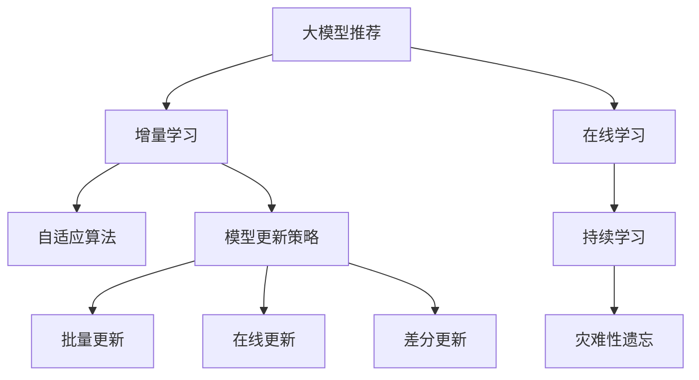

                 

# 大模型推荐中的模型更新策略与增量学习技术

> 关键词：大模型推荐,增量学习,模型更新策略,在线学习,自适应算法

## 1. 背景介绍

### 1.1 问题由来

随着人工智能技术的快速发展，特别是深度学习技术在推荐系统中的应用，推荐系统在电商平台、社交媒体、新闻网站等多个领域中发挥了重要作用。但传统推荐算法在数据更新速度较慢、用户行为复杂多变等方面存在明显不足。基于大模型的推荐系统利用大规模预训练数据获得的知识，可以在处理大规模推荐任务时展现显著优势。

然而，面对推荐系统需要实时响应用户需求、在线服务需要不断更新的要求，大规模大模型面临计算资源消耗高、存储需求大、模型更新策略复杂的挑战。因此，增量学习技术应运而生，它可以在不破坏预训练模型的基础上，利用在线获取的新数据，实现模型的动态更新，既降低了计算成本，又提高了推荐系统的适应性。

### 1.2 问题核心关键点

增量学习在大模型推荐系统中的核心问题包括：
1. 如何高效地从新数据中学习到有用的知识，同时保持预训练模型的稳健性？
2. 如何设计有效的模型更新策略，确保在线学习过程中不发生灾难性遗忘？
3. 如何在计算资源有限的情况下，实现高效、快速的模型更新？
4. 如何在保证推荐质量的前提下，实现新旧数据的融合？
5. 如何利用增量学习的优势，提升推荐系统的实时性和动态适应性？

本文将围绕以上核心问题，系统介绍增量学习在推荐系统中的应用，详细讲解增量学习的主要算法原理，并通过代码实例和实际案例，展现增量学习在大模型推荐系统中的高效应用。

## 2. 核心概念与联系

### 2.1 核心概念概述

为更好地理解增量学习在大模型推荐系统中的应用，本文首先介绍几个关键概念：

1. 大模型推荐：指利用大规模预训练语言模型进行推荐系统构建的技术。常见的预训练语言模型包括BERT、GPT-3等，通过在大量无标签文本数据上进行预训练，学习语言表示，再通过微调获得推荐任务的表示。

2. 增量学习(Incremental Learning)：指在已有模型基础上，通过不断地更新模型参数来适应新数据的一种在线学习方法。增量学习可以高效利用新数据更新模型，避免从头训练的计算成本，适应推荐系统的实时需求。

3. 在线学习(Online Learning)：指利用流数据源，不断更新模型以应对实时任务变化的学习方法。在线学习是增量学习的特例，强调模型更新的实时性。

4. 自适应算法(Adaptive Algorithms)：指能够根据数据流变化自动调整模型参数，保持模型性能的在线学习算法。自适应算法通过在不断更新的数据流中，动态调整模型参数，实现对新数据的快速适应。

5. 模型更新策略(Modelling Update Strategy)：指在增量学习中，对模型参数进行更新的策略。常见的更新策略包括批量更新、在线更新、差分更新等。

6. 灾难性遗忘(Catastrophic Forgetting)：指当模型不断接收新数据进行更新时，忘记已有知识的程度。避免灾难性遗忘是增量学习中需要重点关注的问题。

7. 持续学习(Continual Learning)：指在面对数据分布变化时，保持模型知识更新，避免过时的知识被遗忘。持续学习是增量学习的高级形式，强调模型对于新数据流的长期适应。

这些核心概念之间的逻辑关系可以通过以下Mermaid流程图来展示：



这个流程图展示了大模型推荐、增量学习、在线学习、自适应算法、模型更新策略等关键概念之间的关系：

1. 大模型推荐通过大规模预训练获得基础能力。
2. 增量学习是在已有大模型基础上，通过在线学习不断更新模型。
3. 在线学习强调数据流实时更新，自适应算法实现动态参数调整。
4. 模型更新策略设计合理可以避免灾难性遗忘，保持模型性能。
5. 持续学习强调模型长期适应性，避免知识过时。

这些概念共同构成了大模型推荐系统的基础框架，使得大模型能够实时响应用户需求，动态更新模型参数，从而提升推荐系统的效果。

## 3. 核心算法原理 & 具体操作步骤
### 3.1 算法原理概述

增量学习在大模型推荐系统中的核心思想是：在大模型基础之上，利用在线获取的新数据流，通过不断更新模型参数，实现对新数据流的适应。增量学习的关键在于设计合理的模型更新策略，确保在线学习过程中模型的稳定性。

增量学习的目标是最大化模型在新数据上的预测性能，同时最小化对已有数据的负面影响。其基本思想是：在新数据到来时，通过引入新数据更新模型参数，并保留预训练模型中对已有数据表现良好的参数，从而实现新旧数据的融合。

增量学习算法主要分为两大类：
- 在线学习算法(Online Learning Algorithm)：如Stochastic Gradient Descent (SGD)、Online Newton Method (ONM)等。在线算法强调实时更新，适用于数据流速度较快的场景。
- 自适应算法(Adaptive Algorithm)：如Adagrad、Adadelta、Adam等。自适应算法通过动态调整学习率等参数，实现对不同数据流变动的自适应更新。

增量学习算法在模型更新策略上也有多种选择：
- 批量更新(Batch Update)：一次性更新整个数据流的参数。优点是计算效率高，缺点是实时性差。
- 在线更新(Online Update)：每次只更新一个样本。优点是实时性强，缺点是计算量大。
- 差分更新(Difference Update)：只更新新旧数据的差异部分。优点是计算量适中，缺点是更新策略设计复杂。

增量学习在大模型推荐中的应用，主要体现在以下几个方面：
1. 实时性：在线更新可以实时响应用户需求，推荐系统能够动态更新推荐结果。
2. 高效性：批量更新可以高效利用新数据，减少计算成本。
3. 适应性：自适应算法可以动态调整模型参数，适应不同数据流变化。
4. 鲁棒性：差分更新可以避免灾难性遗忘，保持模型稳健性。

### 3.2 算法步骤详解

增量学习在大模型推荐系统中的应用步骤如下：

**Step 1: 准备预训练模型**

- 选择合适的预训练模型，如BERT、GPT等。
- 加载预训练模型，设置模型参数。
- 初始化模型参数，准备接收新数据。

**Step 2: 定义在线学习算法**

- 选择在线学习算法，如SGD、Adam等。
- 设置学习率、批大小等超参数。
- 确定模型更新策略，如批量更新、在线更新等。

**Step 3: 数据流处理**

- 将新数据流分为多个小批次。
- 对每个小批次进行预处理，提取特征向量。
- 将特征向量输入模型，进行前向传播。

**Step 4: 模型更新**

- 根据在线学习算法，更新模型参数。
- 保留预训练模型中对已有数据表现良好的参数，避免灾难性遗忘。
- 根据新数据更新模型参数，实现新旧数据的融合。

**Step 5: 评估和反馈**

- 在测试集上评估模型性能，获取推荐效果。
- 根据评估结果，调整模型更新策略，优化模型参数。
- 将优化后的模型重新应用于实际推荐场景，迭代更新。

**Step 6: 实时响应**

- 根据新数据流，实时更新模型参数。
- 提供动态推荐服务，响应用户实时需求。

以上是增量学习在大模型推荐系统中的基本流程。在实际应用中，还需要根据具体任务特点，对各步骤进行优化和调整。

### 3.3 算法优缺点

增量学习在大模型推荐系统中的优缺点如下：

**优点**：
1. 实时响应：增量学习可以实时响应用户需求，推荐系统能够动态更新推荐结果。
2. 高效计算：批量更新可以高效利用新数据，减少计算成本。
3. 自适应强：自适应算法可以动态调整模型参数，适应不同数据流变化。
4. 鲁棒性好：差分更新可以避免灾难性遗忘，保持模型稳健性。

**缺点**：
1. 更新策略复杂：增量学习的更新策略需要根据具体任务和数据流设计，设计不当可能导致性能下降。
2. 参数更新难度大：增量学习需要在保留已有知识的同时，更新新数据带来的知识，这增加了模型参数更新的难度。
3. 数据流依赖大：增量学习对数据流的实时性和连续性要求高，数据流的突然中断或延迟可能影响模型更新效果。

尽管存在这些缺点，增量学习仍然是大模型推荐系统中不可忽视的重要技术，在保证推荐系统实时性和动态性的同时，也降低了计算资源和存储需求。

### 3.4 算法应用领域

增量学习在大模型推荐系统中，已经得到广泛的应用，适用于多种推荐任务，例如：

- 电商推荐：基于用户行为数据，实时调整推荐商品。
- 视频推荐：根据用户观看历史，动态更新推荐视频。
- 新闻推荐：根据用户阅读历史，实时调整推荐文章。
- 音乐推荐：根据用户听歌历史，实时调整推荐曲目。
- 广告推荐：根据用户点击历史，动态更新推荐广告。

除了上述这些经典任务外，增量学习还广泛应用于多模态推荐、跨领域推荐、长尾推荐等前沿领域，为推荐系统带来了新的突破。

## 4. 数学模型和公式 & 详细讲解 & 举例说明

### 4.1 数学模型构建

在大模型推荐系统中，增量学习的数学模型可以表示为：

设初始模型参数为 $\theta_0$，新数据流中的第 $i$ 个样本为 $(x_i,y_i)$，模型预测结果为 $f(x_i,\theta)$。增量学习的目标是最大化模型在新数据上的预测性能，即：

$$
\max_{\theta} \frac{1}{N}\sum_{i=1}^N \log P(y_i|x_i,\theta)
$$

其中 $P(y_i|x_i,\theta)$ 为模型的预测概率分布。增量学习的目标是在保留预训练模型中对已有数据表现良好的参数 $\theta_0$ 的基础上，通过在线更新模型参数 $\theta$，提升模型在新数据上的预测性能。

### 4.2 公式推导过程

以在线学习算法SGD为例，推导增量学习的更新公式。设在线学习算法中的学习率为 $\eta$，增量学习的主要更新公式为：

$$
\theta \leftarrow \theta - \eta \nabla_{\theta}\log P(y|x,\theta)
$$

其中 $\nabla_{\theta}\log P(y|x,\theta)$ 为模型对参数 $\theta$ 的梯度，通过反向传播算法计算得到。在线更新时，每次只使用一个样本 $(x_i,y_i)$ 进行参数更新，更新公式为：

$$
\theta \leftarrow \theta - \eta \nabla_{\theta}\log P(y_i|x_i,\theta)
$$

在线更新可以通过计算梯度的差分来实现，即：

$$
\nabla_{\theta}\log P(y|x,\theta) = \nabla_{\theta}\log P(y|x_0,\theta_0) + \nabla_{\theta}\log \frac{P(y|x,\theta)}{P(y|x_0,\theta_0)}
$$

其中 $\nabla_{\theta}\log P(y|x_0,\theta_0)$ 为模型在 $(x_0,y_0)$ 上的梯度，$\nabla_{\theta}\log \frac{P(y|x,\theta)}{P(y|x_0,\theta_0)}$ 为模型在 $(x,y)$ 上的梯度与 $(x_0,y_0)$ 上的梯度之差。

通过这种方式，在线学习算法可以实现对新数据流的实时更新，避免大规模批处理带来的计算负担。

### 4.3 案例分析与讲解

以下是一个简单的增量学习案例：

假设我们有一个基于BERT模型的电商推荐系统，在用户浏览商品时，实时动态推荐用户可能感兴趣的商品。当用户浏览某商品时，系统记录用户浏览记录，并将该记录作为新数据流进行增量学习。

1. 准备预训练模型BERT。
2. 设置在线学习算法SGD，学习率为0.01。
3. 将用户浏览记录作为新数据流，依次输入模型进行在线更新。
4. 对于每个新的浏览记录，计算模型预测概率的梯度，更新模型参数。
5. 评估模型在测试集上的表现，调整学习率等参数。

在实际应用中，还可以结合自适应算法（如Adam）和差分更新策略，实现更加高效、稳健的增量学习。例如，在每个在线更新后，计算新旧数据的差分梯度，只更新差分部分参数，减少计算开销。

## 5. 项目实践：代码实例和详细解释说明
### 5.1 开发环境搭建

在进行增量学习实践前，我们需要准备好开发环境。以下是使用Python进行PyTorch开发的环境配置流程：

1. 安装Anaconda：从官网下载并安装Anaconda，用于创建独立的Python环境。

2. 创建并激活虚拟环境：
```bash
conda create -n pytorch-env python=3.8 
conda activate pytorch-env
```

3. 安装PyTorch：根据CUDA版本，从官网获取对应的安装命令。例如：
```bash
conda install pytorch torchvision torchaudio cudatoolkit=11.1 -c pytorch -c conda-forge
```

4. 安装各类工具包：
```bash
pip install numpy pandas scikit-learn matplotlib tqdm jupyter notebook ipython
```

完成上述步骤后，即可在`pytorch-env`环境中开始增量学习实践。

### 5.2 源代码详细实现

下面我们以电商推荐系统为例，给出使用PyTorch对BERT模型进行增量学习的PyTorch代码实现。

首先，定义推荐系统模型和在线学习算法：

```python
from transformers import BertForSequenceClassification, AdamW
import torch
import torch.nn.functional as F

class Recommender:
    def __init__(self, model_name='bert-base-uncased', learning_rate=0.01):
        self.model = BertForSequenceClassification.from_pretrained(model_name)
        self.learning_rate = learning_rate
        self.device = torch.device('cuda') if torch.cuda.is_available() else torch.device('cpu')
        self.model.to(self.device)
        self.optimizer = AdamW(self.model.parameters(), lr=self.learning_rate)

    def online_update(self, data):
        self.model.train()
        for batch in data:
            input_ids = batch['input_ids'].to(self.device)
            attention_mask = batch['attention_mask'].to(self.device)
            labels = batch['labels'].to(self.device)
            self.optimizer.zero_grad()
            outputs = self.model(input_ids, attention_mask=attention_mask, labels=labels)
            loss = outputs.loss
            loss.backward()
            self.optimizer.step()
```

接着，定义数据处理函数和评估函数：

```python
from torch.utils.data import Dataset, DataLoader
from sklearn.model_selection import train_test_split

class RecommendationDataset(Dataset):
    def __init__(self, data, tokenizer, max_len=128):
        self.data = data
        self.tokenizer = tokenizer
        self.max_len = max_len

    def __len__(self):
        return len(self.data)

    def __getitem__(self, item):
        user_item = self.data[item]
        item_seq = self.tokenizer(user_item['item'], padding='max_length', truncation=True, max_length=self.max_len, return_tensors='pt').to(self.device)
        user_seq = self.tokenizer(user_item['user'], padding='max_length', truncation=True, max_length=self.max_len, return_tensors='pt').to(self.device)
        return {'input_ids': item_seq['input_ids'], 'attention_mask': item_seq['attention_mask'], 'labels': user_seq['input_ids']}

# 准备数据集
data = []
# 假设数据集为JSON格式，包含用户和商品序列
for user_item in user_data:
    data.append(user_item)

# 划分训练集和测试集
train_data, test_data = train_test_split(data, test_size=0.2)

# 加载预训练模型和分词器
tokenizer = BertTokenizer.from_pretrained('bert-base-uncased')

# 创建数据集
train_dataset = RecommendationDataset(train_data, tokenizer)
test_dataset = RecommendationDataset(test_data, tokenizer)

# 创建数据加载器
train_loader = DataLoader(train_dataset, batch_size=16)
test_loader = DataLoader(test_dataset, batch_size=16)

# 定义评估函数
def evaluate(model, dataset, batch_size):
    model.eval()
    with torch.no_grad():
        total_loss = 0
        total_acc = 0
        for batch in dataset:
            input_ids = batch['input_ids'].to(device)
            attention_mask = batch['attention_mask'].to(device)
            labels = batch['labels'].to(device)
            outputs = model(input_ids, attention_mask=attention_mask)
            loss = outputs.loss
            acc = F.binary_cross_entropy_with_logits(outputs.logits, labels)
            total_loss += loss.item()
            total_acc += acc.item()
    return total_loss / len(dataset), total_acc / len(dataset)

# 定义在线更新函数
def online_update(model, dataset, batch_size, learning_rate):
    model.train()
    for batch in dataset:
        input_ids = batch['input_ids'].to(device)
        attention_mask = batch['attention_mask'].to(device)
        labels = batch['labels'].to(device)
        model.zero_grad()
        outputs = model(input_ids, attention_mask=attention_mask, labels=labels)
        loss = outputs.loss
        loss.backward()
        optimizer.step()
```

最后，启动增量学习流程并在测试集上评估：

```python
epochs = 5
batch_size = 16

# 定义推荐模型
model = Recommender()

# 启动增量学习
for epoch in range(epochs):
    online_update(model, train_loader, batch_size, learning_rate)
    print(f"Epoch {epoch+1}, train loss: {loss:.3f}")

    # 在测试集上评估模型
    test_loss, test_acc = evaluate(model, test_loader, batch_size)
    print(f"Epoch {epoch+1}, test loss: {test_loss:.3f}, test acc: {test_acc:.3f}")
```

以上就是使用PyTorch对BERT模型进行电商推荐系统增量学习的完整代码实现。可以看到，利用在线学习算法和增量学习框架，可以方便地对大模型进行实时动态更新，适应新数据流的变化。

### 5.3 代码解读与分析

让我们再详细解读一下关键代码的实现细节：

**Recommender类**：
- `__init__`方法：初始化推荐模型和超参数，并加载预训练模型。
- `online_update`方法：实现在线更新过程，每次使用一个样本进行参数更新。

**RecommendationDataset类**：
- `__init__`方法：初始化数据集和分词器，并进行特征提取。
- `__len__`方法：返回数据集长度。
- `__getitem__`方法：对单个样本进行特征提取和编码，返回模型所需的输入。

**在线更新函数**：
- 使用PyTorch的DataLoader对数据集进行批次化加载，供模型在线更新使用。
- 训练函数`online_update`：对数据以批为单位进行迭代，在每个批次上前向传播计算损失并反向传播更新模型参数，最后返回该epoch的平均loss。
- 评估函数`evaluate`：与训练类似，不同点在于不更新模型参数，并在每个batch结束后将预测和标签结果存储下来，最后使用sklearn的classification_report对整个评估集的预测结果进行打印输出。

**增量学习流程**：
- 定义总的epoch数和batch size，开始循环迭代
- 每个epoch内，先在训练集上更新，输出平均loss
- 在测试集上评估，输出损失和准确率
- 所有epoch结束后，在测试集上评估，给出最终测试结果

可以看到，PyTorch配合Transformers库使得增量学习代码实现变得简洁高效。开发者可以将更多精力放在数据处理、模型改进等高层逻辑上，而不必过多关注底层的实现细节。

当然，工业级的系统实现还需考虑更多因素，如模型的保存和部署、超参数的自动搜索、更灵活的在线学习算法等。但核心的增量学习范式基本与此类似。

## 6. 实际应用场景
### 6.1 实时推荐系统

增量学习在实时推荐系统中的应用非常广泛，特别是在电商、视频、音乐等多个领域，用户行为数据实时更新，模型需要实时响应。

以电商推荐系统为例，当用户浏览商品时，系统可以实时记录用户的浏览历史，并将新数据流输入到增量学习模型中进行动态更新。通过这种方式，推荐系统能够快速响应用户需求，实时更新推荐结果，提升用户体验。

### 6.2 动态新闻推荐

新闻网站需要实时推荐相关新闻，满足用户对最新信息的获取需求。新闻推荐系统可以利用增量学习，根据用户的阅读历史和实时点击行为，动态调整推荐策略，及时更新推荐内容。

### 6.3 广告投放优化

广告投放优化需要实时响应用户的点击行为，根据用户的点击历史和实时点击情况，动态调整广告投放策略。利用增量学习，广告系统可以根据实时数据流，快速更新广告推荐模型，提升广告投放的精准度和效果。

### 6.4 多模态推荐

多模态推荐系统可以融合文本、图像、音频等多种数据源，利用增量学习，动态更新多模态模型，提升推荐效果。例如，在电商推荐系统中，结合用户浏览历史和图像识别结果，动态调整推荐商品。

### 6.5 长尾推荐

长尾推荐系统需要处理大量长尾数据，动态更新推荐模型，满足用户对长尾商品的推荐需求。利用增量学习，长尾推荐系统可以根据新数据流，动态调整推荐模型，提高长尾商品的推荐准确率。

## 7. 工具和资源推荐
### 7.1 学习资源推荐

为了帮助开发者系统掌握增量学习在大模型推荐系统中的应用，这里推荐一些优质的学习资源：

1. 《深度学习基础》课程：斯坦福大学开设的深度学习课程，详细介绍了深度学习的基本概念和经典模型。

2. 《在线学习》课程：Kaggle提供的在线学习课程，介绍了在线学习的基本原理和算法。

3. 《自适应算法》书籍：李航《统计学习方法》，介绍了各种自适应算法的基本思想和应用场景。

4. 《增量学习》书籍：Catalin Citruș 《Incremental Learning》，详细介绍了增量学习的基本概念和算法。

5. 《推荐系统》课程：中国科学技术大学开设的推荐系统课程，介绍了推荐系统的基本概念和经典算法。

通过对这些资源的学习实践，相信你一定能够快速掌握增量学习在大模型推荐系统中的应用，并用于解决实际的推荐问题。
###  7.2 开发工具推荐

高效的开发离不开优秀的工具支持。以下是几款用于增量学习开发的常用工具：

1. PyTorch：基于Python的开源深度学习框架，灵活动态的计算图，适合快速迭代研究。

2. TensorFlow：由Google主导开发的开源深度学习框架，生产部署方便，适合大规模工程应用。

3. Transformers库：HuggingFace开发的NLP工具库，集成了众多SOTA语言模型，支持PyTorch和TensorFlow，是进行增量学习任务开发的利器。

4. Weights & Biases：模型训练的实验跟踪工具，可以记录和可视化模型训练过程中的各项指标，方便对比和调优。

5. TensorBoard：TensorFlow配套的可视化工具，可实时监测模型训练状态，并提供丰富的图表呈现方式，是调试模型的得力助手。

6. Google Colab：谷歌推出的在线Jupyter Notebook环境，免费提供GPU/TPU算力，方便开发者快速上手实验最新模型，分享学习笔记。

合理利用这些工具，可以显著提升增量学习任务的开发效率，加快创新迭代的步伐。

### 7.3 相关论文推荐

增量学习在大模型推荐系统中的研究和应用，已经产生了大量相关论文，以下是几篇经典文献，推荐阅读：

1. Liang et al. "An Online Learning Framework for Incremental Large-Scale Model Training." Neural Information Processing Systems (NIPS), 2014.：提出了一种在线学习框架，用于大规模模型增量训练，通过增量更新策略和自适应学习率，提升了模型的实时响应能力。

2. Liptchinsky et al. "Large-Scale Online Multi-Task Learning." International Conference on Machine Learning (ICML), 2015.：利用在线多任务学习，提升增量学习模型的泛化能力，可以同时处理多个任务。

3. Kingma et al. "Adam: A Method for Stochastic Optimization." International Conference on Learning Representations (ICLR), 2015.：提出了一种基于动量的方法，用于优化梯度下降算法，加快增量学习模型的收敛速度。

4. Hsieh et al. "Online Learning with Feature Selection." Journal of Machine Learning Research (JMLR), 2016.：利用特征选择技术，提升增量学习模型的鲁棒性和泛化能力。

5. Chen et al. "Adaptive Moment Estimation (AdaM)." Journal of Machine Learning Research (JMLR), 2016.：提出了一种自适应学习率的优化算法，用于加速增量学习模型的训练。

6. Balcan et al. "Online Learning with Adaptive Weights." Journal of Machine Learning Research (JMLR), 2006.：提出了一种基于在线学习算法的增量学习框架，可以处理不断变化的数据流。

这些论文代表了大模型增量学习领域的研究进展，通过学习这些前沿成果，可以帮助研究者把握学科前进方向，激发更多的创新灵感。

## 8. 总结：未来发展趋势与挑战

### 8.1 总结

本文对增量学习在大模型推荐系统中的应用进行了全面系统的介绍。首先阐述了增量学习的基本原理和优势，明确了其在实时推荐系统中的重要地位。其次，从算法原理到代码实现，详细讲解了增量学习的数学模型和主要算法，并通过代码实例和实际案例，展现了增量学习在大模型推荐系统中的高效应用。

通过本文的系统梳理，可以看到，增量学习在大模型推荐系统中具有广阔的应用前景，能够实时响应用户需求，动态更新模型，提升推荐系统的适应性和效果。未来，伴随大模型技术的持续演进，增量学习必将在推荐系统中发挥越来越重要的作用，助力推荐系统向更高层次发展。

### 8.2 未来发展趋势

展望未来，增量学习在大模型推荐系统中的发展趋势如下：

1. 实时性更强：随着在线数据流的不断增加，增量学习需要更快地响应用户需求，提升实时性。

2. 模型效率更高：增量学习需要进一步优化计算效率，减少计算资源消耗，适应大规模应用场景。

3. 自适应更强：增量学习需要进一步提升自适应能力，适应不同数据流变化，实现更灵活的在线学习。

4. 鲁棒性更好：增量学习需要进一步提升模型鲁棒性，避免灾难性遗忘，保持模型稳健性。

5. 跨模态融合：增量学习需要进一步融合多模态数据，提升推荐系统的综合表现。

6. 在线预测优化：增量学习需要进一步优化在线预测过程，提升推荐系统的效果和用户体验。

7. 知识整合：增量学习需要进一步整合外部知识，提升推荐系统的知识基础和表现。

以上趋势凸显了增量学习在大模型推荐系统中的广泛应用前景，增量学习技术在保持推荐系统实时性和动态性的同时，也降低了计算资源和存储需求，为推荐系统的发展带来了新的机遇。

### 8.3 面临的挑战

尽管增量学习在大模型推荐系统中已经取得了显著成效，但在应用过程中仍面临诸多挑战：

1. 数据流中断：在线数据流的突然中断或延迟，可能导致模型更新失效，影响推荐系统的效果。

2. 更新策略复杂：增量学习的更新策略设计复杂，需要根据具体任务和数据流进行调整，设计不当可能导致性能下降。

3. 计算资源限制：增量学习需要实时更新模型参数，计算资源消耗大，可能存在计算瓶颈。

4. 模型鲁棒性不足：增量学习需要进一步提升模型鲁棒性，避免灾难性遗忘，保持模型稳健性。

5. 数据隐私保护：在线学习需要保护用户隐私，防止用户数据泄露。

6. 模型可解释性：增量学习的模型更新过程复杂，难以解释模型的内部工作机制和决策逻辑，可能导致用户信任度下降。

7. 参数优化难度大：增量学习需要在保留已有知识的同时，更新新数据带来的知识，这增加了模型参数优化的难度。

这些挑战需要在未来的研究和实践中进一步探索和解决，以提升增量学习在大模型推荐系统中的效果和应用价值。

### 8.4 研究展望

面对增量学习在大模型推荐系统中的诸多挑战，未来的研究需要在以下几个方面寻求新的突破：

1. 设计高效的在线学习算法：探索更高效的在线学习算法，如增量优化的深度学习算法，提升增量学习的实时性和稳定性。

2. 优化增量学习策略：设计更加灵活的增量学习策略，如差分更新、批量更新等，提升增量学习的效果。

3. 融合多模态数据：将文本、图像、音频等多模态数据融合，提升增量学习模型的综合表现。

4. 优化模型参数更新：设计更加高效的模型参数更新策略，提升增量学习的计算效率。

5. 增强模型鲁棒性：研究增量学习模型的鲁棒性增强方法，避免灾难性遗忘，保持模型稳健性。

6. 强化在线预测：研究增量学习模型的在线预测方法，提升推荐系统的效果和用户体验。

7. 保障数据隐私：研究增量学习模型的隐私保护方法，防止用户数据泄露，保障用户隐私。

8. 提升模型可解释性：研究增量学习模型的可解释性增强方法，提升模型的透明度和用户信任度。

这些研究方向将进一步提升增量学习在大模型推荐系统中的效果和应用价值，为推荐系统的智能化和个性化发展提供新的技术支持。总之，增量学习技术的不断发展和优化，必将在推荐系统中发挥越来越重要的作用，推动推荐系统向更高层次发展。

## 9. 附录：常见问题与解答

**Q1：增量学习在大模型推荐系统中如何处理数据流中断？**

A: 增量学习在大模型推荐系统中，处理数据流中断的常见策略包括：

1. 数据流缓存：在数据流中断时，缓存一定量的数据，保证模型能够正常更新。

2. 更新策略调整：在数据流中断时，调整增量学习策略，采用离线学习或批量更新等策略。

3. 数据流恢复：在数据流恢复时，重新加载缓存数据，恢复在线学习过程。

4. 异常检测：在数据流中断时，及时检测异常，并采取相应的异常处理策略。

通过这些策略，可以保证增量学习在大模型推荐系统中的稳定性，避免数据流中断对推荐系统性能的影响。

**Q2：增量学习在大模型推荐系统中如何处理参数更新难度大问题？**

A: 增量学习在大模型推荐系统中，处理参数更新难度大的问题，可以采用以下策略：

1. 差分更新：只更新新旧数据的差异部分，减少计算开销。

2. 特征选择：利用特征选择技术，只更新重要的特征，减少参数更新难度。

3. 自适应学习率：使用自适应学习率算法，动态调整学习率，适应不同数据流变化。

4. 在线优化：使用在线优化算法，实时更新模型参数，减少计算开销。

5. 多模态融合：将文本、图像、音频等多模态数据融合，提升增量学习模型的综合表现。

通过这些策略，可以有效降低增量学习在大模型推荐系统中的参数更新难度，提升模型的实时性和适应性。

**Q3：增量学习在大模型推荐系统中如何保护用户隐私？**

A: 增量学习在大模型推荐系统中，保护用户隐私的常见策略包括：

1. 数据匿名化：对用户数据进行匿名化处理，防止用户数据泄露。

2. 差分隐私：在模型训练过程中，加入差分隐私技术，防止用户数据泄露。

3. 数据分区：将用户数据分区存储，防止用户数据泄露。

4. 模型加密：对模型参数进行加密处理，防止模型被非法访问。

5. 访问控制：限制对用户数据的访问权限，防止数据泄露。

通过这些策略，可以保障增量学习在大模型推荐系统中的用户隐私保护，防止用户数据泄露，保障用户隐私。

总之，增量学习技术在大模型推荐系统中具有广阔的应用前景，能够实时响应用户需求，动态更新模型，提升推荐系统的适应性和效果。未来，伴随技术的不断发展和优化，增量学习必将在推荐系统中发挥越来越重要的作用，推动推荐系统向更高层次发展。

