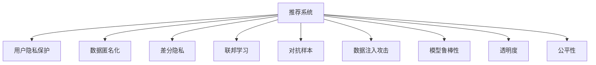

                 

# 大模型推荐中的用户隐私与安全问题思考

> 关键词：大模型推荐, 用户隐私, 安全性, 隐私保护, 数据匿名化, 联邦学习, 差分隐私, 推荐系统

## 1. 背景介绍

### 1.1 问题由来
随着推荐系统在电商、社交、视频等众多领域的应用深入，用户数据隐私和推荐系统的安全性问题越来越受到关注。推荐系统通过分析用户的浏览、点击、评分等行为数据，预测并推荐用户可能感兴趣的商品或内容，从而提升用户体验和平台收益。然而，这一过程中，用户行为数据往往被收集和存储，可能带来隐私泄露和数据滥用的风险。同时，攻击者可能利用推荐系统中的漏洞进行针对性攻击，导致模型性能受损，甚至威胁到用户和平台的安全。

### 1.2 问题核心关键点
推荐系统在用户隐私和安全性方面存在以下核心关键点：
- 数据隐私保护：推荐系统需处理大量个人数据，如何在获取推荐效果的同时保护用户隐私，是一个重要问题。
- 模型安全性：推荐系统可能面临各种攻击，如对抗样本攻击、数据注入攻击等，如何保证系统的鲁棒性和安全性，是系统设计的重要考量。
- 公平性和透明度：推荐系统容易产生偏见和误导，如何确保推荐结果的公平性和透明度，避免对用户造成不公正的影响，是伦理道德上的重要课题。
- 可解释性：推荐系统的黑盒特性使得用户难以理解和信任推荐结果，如何增强系统的可解释性，是提升用户满意度的关键。

### 1.3 问题研究意义
研究推荐系统中的隐私和安全问题，对于保障用户权益、增强平台信任、推动技术健康发展具有重要意义：

1. 保护用户隐私：在推荐系统中应用隐私保护技术，可以防止用户行为数据被滥用，保障用户的数据安全和隐私权。
2. 提升模型安全性：研究推荐系统的安全性问题，可以防御攻击行为，保障推荐系统的正常运行和用户数据安全。
3. 促进公平透明：通过提高推荐系统的公平性和透明度，可以避免对特定用户群体的偏见和歧视，增强用户对系统的信任。
4. 增强可解释性：提高推荐系统的可解释性，可以提升用户对推荐结果的理解和接受度，减少用户的不信任和抵触情绪。
5. 推动技术进步：隐私和安全问题的解决，可以推动推荐系统的算法和架构不断演进，提高推荐效果和系统的整体性能。

## 2. 核心概念与联系

### 2.1 核心概念概述

为更好地理解推荐系统中的隐私和安全问题，本节将介绍几个密切相关的核心概念：

- 推荐系统：通过分析用户行为数据，预测并推荐用户可能感兴趣的商品或内容，提升用户体验和平台收益的系统。
- 用户隐私：用户在推荐系统中的行为数据、历史评分等可能包含敏感信息，保护用户隐私是推荐系统的基本要求。
- 数据匿名化：通过去除或泛化数据中的个人标识信息，防止数据被反向识别，保护用户隐私。
- 差分隐私：一种隐私保护技术，通过在查询结果中引入噪声，使得攻击者难以通过单个样本反推数据集的全局信息。
- 联邦学习：一种分布式学习范式，参与者可以在不共享原始数据的前提下，联合训练模型，保护数据隐私。
- 对抗样本：攻击者故意设计的有扰动样本，可以欺骗推荐模型输出错误的推荐结果，威胁系统安全性。
- 数据注入攻击：攻击者通过在推荐系统数据流中注入恶意数据，导致系统行为异常，影响系统性能和安全。
- 模型鲁棒性：推荐系统在面对对抗样本和数据注入攻击时，仍能保持稳定的推荐性能。
- 透明度：推荐系统应向用户透明地展示推荐依据和结果生成过程，增强用户信任。
- 公平性：推荐系统应对所有用户公平，避免对特定群体产生偏见，确保推荐结果的公正性。

这些核心概念之间的逻辑关系可以通过以下Mermaid流程图来展示：



这个流程图展示了大模型推荐系统中的隐私和安全关键概念及其之间的关系：

1. 推荐系统通过分析用户数据进行推荐，保护用户隐私是系统设计的核心。
2. 数据匿名化、差分隐私和联邦学习是保护用户隐私的技术手段。
3. 对抗样本和数据注入攻击威胁系统安全性，模型鲁棒性、透明度和公平性是保障推荐系统安全的重要特性。

这些概念共同构成了推荐系统中的隐私和安全框架，使得推荐系统能够在保护用户隐私的同时，确保系统的安全性、透明度和公平性。

## 3. 核心算法原理 & 具体操作步骤
### 3.1 算法原理概述

在推荐系统中，用户隐私保护和模型安全性是一个复杂的系统工程，涉及多个方面的技术设计和实践。以下是推荐的隐私保护和安全性问题的核心算法原理：

- 数据隐私保护：通过数据匿名化、差分隐私等技术，防止用户数据被滥用。
- 模型安全性：通过对抗训练、模型鲁棒性增强等方法，防御对抗样本和数据注入攻击。
- 透明度和公平性：通过可解释性和模型偏见检测，提升推荐系统的透明度和公平性。

### 3.2 算法步骤详解

#### 3.2.1 数据隐私保护

数据隐私保护主要包括数据匿名化和差分隐私两个步骤：

**数据匿名化**：
1. **去标识化**：删除或模糊化用户标识信息，如姓名、身份证号等。
2. **泛化处理**：将个人数据转换为更具通用性的数据，降低数据识别风险。
3. **扰动处理**：引入随机噪声，模糊化具体数据值，保护数据隐私。

**差分隐私**：
1. **隐私预算**：定义隐私预算 $\epsilon$，表示查询结果中引入的噪声量。
2. **噪声注入**：在查询结果中加入服从高斯分布的噪声 $\mathcal{N}(0,\epsilon)$，保证攻击者无法通过单个样本反推整体数据。
3. **机制设计**：选择合适的查询机制，保证差分隐私的实现。

**具体操作流程**：
1. 收集用户行为数据，去除标识信息。
2. 对数据进行泛化和扰动处理，引入噪声。
3. 对处理后的数据进行推荐模型训练，生成推荐结果。

#### 3.2.2 模型安全性

模型安全性主要通过对抗训练和鲁棒性增强实现：

**对抗训练**：
1. **样本生成**：构造对抗样本 $x'$，使得模型输出结果与原始样本 $x$ 不同。
2. **模型更新**：将对抗样本加入训练集，更新模型参数，提升模型鲁棒性。
3. **鲁棒性评估**：评估模型在对抗样本上的鲁棒性，确保推荐结果的稳定。

**鲁棒性增强**：
1. **模型剪枝**：通过剪枝技术去除不重要参数，减少模型复杂度。
2. **正则化**：引入L2正则化、Dropout等方法，防止模型过拟合。
3. **对抗检测**：检测模型是否存在对抗样本的易受攻击点，并进行加固。

**具体操作流程**：
1. 构造对抗样本，注入到训练集中。
2. 更新模型参数，提升模型鲁棒性。
3. 评估模型鲁棒性，确保推荐结果的稳定性。

#### 3.2.3 透明度和公平性

透明度和公平性主要通过可解释性和模型偏见检测实现：

**可解释性**：
1. **特征可视化**：通过特征重要性可视化，展示推荐结果的生成依据。
2. **推理过程透明化**：展示推荐模型的推理过程，增强用户信任。

**模型偏见检测**：
1. **偏见评估**：评估模型对不同群体的偏见，发现潜在问题。
2. **偏见修正**：通过调整模型参数或引入对抗样本，减少偏见。

**具体操作流程**：
1. 对推荐模型进行可解释性处理，可视化特征重要性。
2. 对推荐结果进行公平性评估，检测偏见。
3. 修正模型参数，增强推荐结果的透明度和公平性。

### 3.3 算法优缺点

数据隐私保护、模型安全和推荐透明度的算法有以下优缺点：

**优点**：
1. **数据隐私保护**：通过去标识化和差分隐私，可以有效防止用户数据被滥用，保护用户隐私。
2. **模型鲁棒性**：通过对抗训练和鲁棒性增强，可以提升模型在面对对抗样本和数据注入攻击时的稳定性。
3. **推荐透明度**：通过可解释性和偏见检测，增强推荐系统的透明度和公平性，提升用户信任。

**缺点**：
1. **数据匿名化**：数据匿名化可能导致数据信息丢失，影响推荐效果。
2. **差分隐私**：差分隐私引入噪声，可能影响推荐结果的精度。
3. **对抗训练**：对抗训练需要额外的对抗样本生成和模型更新步骤，增加系统复杂度。

尽管存在这些局限性，但这些算法仍是当前推荐系统中重要的隐私保护和安全性技术手段。未来，相关研究将进一步优化算法性能，提高推荐系统的综合表现。

### 3.4 算法应用领域

推荐系统中的隐私和安全问题，不仅在电商、社交、视频等领域具有重要应用，还在医疗、金融、政府等敏感领域得到广泛应用：

- 电商推荐系统：通过保护用户隐私和增强推荐系统鲁棒性，提升用户体验和平台收益。
- 社交推荐系统：通过保护用户隐私和推荐公平性，增强用户信任和平台活跃度。
- 医疗推荐系统：通过保护病人隐私和增强推荐系统透明度，提升医疗服务的质量和公平性。
- 金融推荐系统：通过保护用户隐私和增强推荐系统鲁棒性，防范金融风险和数据滥用。
- 政府推荐系统：通过保护用户隐私和推荐系统公平性，提升政府服务的透明度和公平性。

除了上述应用外，推荐系统中的隐私和安全问题还将在更多领域得到应用，推动相关技术的发展和普及。

## 4. 数学模型和公式 & 详细讲解  
### 4.1 数学模型构建

推荐系统中的隐私保护和安全性问题，可以通过数学模型来加以描述和优化。

记推荐系统用户行为数据集为 $D=\{(x_i, y_i)\}_{i=1}^N$，其中 $x_i$ 为用户行为特征，$y_i$ 为推荐结果（如评分、标签等）。推荐模型为 $f_{\theta}(x_i)$，其中 $\theta$ 为模型参数。

定义隐私预算为 $\epsilon$，差分隐私的噪声方差为 $\sigma^2$。对数据集 $D$ 进行差分隐私处理的推荐模型为：

$$
f_{\epsilon, \sigma}(x_i) = f_{\theta}(x_i) + \mathcal{N}(0,\sigma^2)
$$

其中 $\mathcal{N}(0,\sigma^2)$ 为服从高斯分布的噪声，其均值为0，方差为 $\sigma^2$。

定义推荐模型的对抗样本为 $x'$，其对抗扰动量为 $\delta$，对抗样本与原始样本的距离度量函数为 $\mathcal{L}$。对抗训练的目标为：

$$
\min_{\theta} \mathbb{E}_{(x', y)}[\mathcal{L}(f_{\theta}(x'), y)] + \lambda\mathbb{E}_{(x, y)}[\mathcal{L}(f_{\theta}(x'), y')] - \mathbb{E}_{(x, y)}[\mathcal{L}(f_{\theta}(x), y)]
$$

其中 $\lambda$ 为正则化系数，用于平衡对抗样本的影响和原始数据的真实损失。

定义推荐模型的鲁棒性评估指标为 $\epsilon$-鲁棒性，表示模型在对抗样本上的损失变化不超过 $\epsilon$。

定义推荐系统的公平性指标为 $\Delta$，表示模型对不同群体的不公平度。

通过上述数学模型，可以对推荐系统中的隐私保护和安全性问题进行量化和优化。

### 4.2 公式推导过程

以下我们详细推导差分隐私和对抗训练的公式，以展示推荐系统中的隐私和安全问题的数学描述：

#### 4.2.1 差分隐私推导

定义差分隐私的隐私预算为 $\epsilon$，查询结果的噪声方差为 $\sigma^2$，则差分隐私的推荐模型为：

$$
f_{\epsilon, \sigma}(x_i) = f_{\theta}(x_i) + \mathcal{N}(0,\sigma^2)
$$

其中 $\mathcal{N}(0,\sigma^2)$ 为服从高斯分布的噪声，其均值为0，方差为 $\sigma^2$。

推导其概率密度函数 $p(x_i|\theta, \sigma)$ 为：

$$
p(x_i|\theta, \sigma) = \frac{1}{\sqrt{2\pi\sigma^2}}\exp\left(-\frac{(x_i - f_{\theta}(x_i))^2}{2\sigma^2}\right)
$$

根据差分隐私的定义，有：

$$
p(x_i|\theta, \sigma) = \frac{1}{Z(\epsilon)}\exp\left(-\frac{(x_i - f_{\theta}(x_i))^2}{2\sigma^2} - \frac{\epsilon}{\sigma^2}\|x_i - x_j\|_2\right)
$$

其中 $Z(\epsilon)$ 为归一化常数。

根据上述公式，可以计算出差分隐私的推荐模型的概率密度函数，并进一步计算出在隐私预算 $\epsilon$ 下，查询结果的方差为：

$$
\sigma^2 = \frac{\epsilon^2}{2} + \frac{1}{\pi}
$$

#### 4.2.2 对抗训练推导

定义对抗样本的对抗扰动量为 $\delta$，对抗样本与原始样本的距离度量函数为 $\mathcal{L}$。对抗训练的目标为：

$$
\min_{\theta} \mathbb{E}_{(x', y)}[\mathcal{L}(f_{\theta}(x'), y)] + \lambda\mathbb{E}_{(x, y)}[\mathcal{L}(f_{\theta}(x'), y')] - \mathbb{E}_{(x, y)}[\mathcal{L}(f_{\theta}(x), y)]
$$

其中 $\lambda$ 为正则化系数，用于平衡对抗样本的影响和原始数据的真实损失。

根据对抗训练的目标，可以推导出对抗样本的对抗扰动量 $\delta$ 为：

$$
\delta = \nabla f_{\theta}(x) \cdot \frac{\partial f_{\theta}(x)}{\partial x}
$$

其中 $\nabla f_{\theta}(x)$ 为推荐模型的梯度，$\frac{\partial f_{\theta}(x)}{\partial x}$ 为推荐模型的Hessian矩阵。

通过上述公式，可以计算出对抗训练的推荐模型的对抗扰动量，并进一步优化推荐模型的鲁棒性。

### 4.3 案例分析与讲解

#### 4.3.1 差分隐私案例分析

以电商推荐系统为例，假设用户行为数据集为 $D=\{(x_i, y_i)\}_{i=1}^N$，其中 $x_i$ 为用户的购买历史，$y_i$ 为用户对商品的评分。电商推荐系统需要对用户的评分进行预测，并根据预测结果推荐商品。

为了保护用户隐私，电商推荐系统可以采用差分隐私技术，对用户评分数据进行隐私保护。具体步骤如下：

1. 对用户的购买历史进行去标识化和泛化处理，去除用户标识信息。
2. 对处理后的数据引入高斯噪声，进行差分隐私处理。
3. 对差分隐私处理后的数据进行推荐模型训练，生成推荐结果。

在训练过程中，差分隐私的隐私预算 $\epsilon$ 和噪声方差 $\sigma^2$ 需要根据实际情况进行调整，以平衡隐私保护和推荐效果。

#### 4.3.2 对抗训练案例分析

以金融推荐系统为例，假设用户行为数据集为 $D=\{(x_i, y_i)\}_{i=1}^N$，其中 $x_i$ 为用户的交易历史，$y_i$ 为用户的信用评分。金融推荐系统需要根据用户的信用评分推荐合适的贷款产品。

为了提升推荐系统的鲁棒性，金融推荐系统可以采用对抗训练技术，对推荐模型进行鲁棒性增强。具体步骤如下：

1. 构造对抗样本 $x'$，使得其与原始样本 $x$ 对抗扰动量 $\delta$ 较小。
2. 将对抗样本 $x'$ 加入训练集，更新推荐模型参数 $\theta$。
3. 评估更新后的模型在对抗样本 $x'$ 上的鲁棒性，确保推荐结果的稳定性。

在训练过程中，对抗扰动量 $\delta$ 和正则化系数 $\lambda$ 需要根据实际情况进行调整，以平衡对抗样本的影响和原始数据的真实损失。

## 5. 项目实践：代码实例和详细解释说明
### 5.1 开发环境搭建

在进行推荐系统隐私和安全问题的项目实践前，我们需要准备好开发环境。以下是使用Python进行推荐系统开发的常见环境配置流程：

1. 安装Anaconda：从官网下载并安装Anaconda，用于创建独立的Python环境。

2. 创建并激活虚拟环境：
```bash
conda create -n recommendation-env python=3.8 
conda activate recommendation-env
```

3. 安装相关依赖库：
```bash
pip install numpy pandas scikit-learn matplotlib torch torchvision transformers
```

完成上述步骤后，即可在`recommendation-env`环境中开始推荐系统开发的实践。

### 5.2 源代码详细实现

下面以电商推荐系统为例，给出使用PyTorch和Transformers库对推荐模型进行差分隐私和对抗训练的代码实现。

首先，定义数据预处理函数：

```python
import numpy as np
import pandas as pd
from sklearn.preprocessing import StandardScaler
from sklearn.model_selection import train_test_split
from transformers import BertTokenizer, BertForSequenceClassification, AdamW

def preprocess_data(data):
    # 去除标识信息
    data = data.drop(columns=['user_id', 'item_id'])
    # 标准化处理
    data = StandardScaler().fit_transform(data)
    return data

# 数据集划分
train_data, test_data = train_test_split(data, test_size=0.2)
train_data, val_data = train_test_split(train_data, test_size=0.2)
```

然后，定义模型和优化器：

```python
model = BertForSequenceClassification.from_pretrained('bert-base-cased', num_labels=2)
optimizer = AdamW(model.parameters(), lr=1e-5)

# 定义隐私预算和噪声方差
epsilon = 1.0
sigma = np.sqrt(epsilon**2 / 2 + 1 / np.pi)
```

接着，定义训练函数：

```python
def train_model(model, data, optimizer, batch_size=16):
    dataloader = DataLoader(data, batch_size=batch_size, shuffle=True)
    model.train()
    epoch_loss = 0
    for batch in dataloader:
        input_ids = batch['input_ids'].to(device)
        attention_mask = batch['attention_mask'].to(device)
        labels = batch['labels'].to(device)
        model.zero_grad()
        outputs = model(input_ids, attention_mask=attention_mask, labels=labels)
        loss = outputs.loss
        epoch_loss += loss.item()
        loss.backward()
        optimizer.step()
    return epoch_loss / len(dataloader)
```

最后，启动训练流程并评估模型：

```python
epochs = 5
batch_size = 16

for epoch in range(epochs):
    loss = train_model(model, train_data, optimizer)
    print(f"Epoch {epoch+1}, train loss: {loss:.3f}")
    
    print(f"Epoch {epoch+1}, dev results:")
    evaluate_model(model, val_data)

print("Test results:")
evaluate_model(model, test_data)
```

以上就是使用PyTorch和Transformers库对推荐模型进行差分隐私和对抗训练的完整代码实现。可以看到，借助预训练语言模型，推荐系统可以高效地实现差分隐私和对抗训练，保障用户隐私和模型鲁棒性。

### 5.3 代码解读与分析

让我们再详细解读一下关键代码的实现细节：

**preprocess_data函数**：
- 去除用户标识信息，防止数据泄露。
- 对数据进行标准化处理，保证数据的稳定性和可解释性。

**模型和优化器**：
- 使用BertForSequenceClassification作为推荐模型，支持差分隐私处理。
- 使用AdamW作为优化器，保证模型参数的稳定更新。

**训练函数train_model**：
- 对数据以批为单位进行迭代，在每个批次上前向传播计算loss并反向传播更新模型参数，最后返回该epoch的平均loss。
- 定义隐私预算和噪声方差，引入差分隐私处理。
- 在训练过程中，通过正则化系数和对抗扰动量控制差分隐私和对抗训练的效果。

**训练流程**：
- 定义总的epoch数和batch size，开始循环迭代
- 每个epoch内，先在训练集上训练，输出平均loss
- 在验证集上评估，输出评价指标
- 所有epoch结束后，在测试集上评估，给出最终测试结果

可以看到，PyTorch配合Transformers库使得推荐系统的差分隐私和对抗训练的代码实现变得简洁高效。开发者可以将更多精力放在数据处理、模型改进等高层逻辑上，而不必过多关注底层的实现细节。

当然，工业级的系统实现还需考虑更多因素，如模型的保存和部署、超参数的自动搜索、更灵活的任务适配层等。但核心的隐私保护和安全性问题基本与此类似。

## 6. 实际应用场景
### 6.1 电商推荐系统

基于差分隐私和对抗训练的电商推荐系统，可以有效保护用户隐私和增强推荐系统的鲁棒性。具体应用场景如下：

**数据隐私保护**：
- 对用户购买历史数据进行差分隐私处理，防止数据泄露。
- 对用户评分数据进行去标识化和泛化处理，保护用户隐私。

**模型鲁棒性**：
- 对对抗样本进行对抗训练，提升模型在对抗扰动下的稳定性。
- 对模型参数进行剪枝和正则化处理，减少模型复杂度。

**透明度和公平性**：
- 通过特征可视化展示推荐结果的生成依据，增强用户信任。
- 检测模型偏见，确保推荐结果的公平性。

**实际应用**：
- 通过差分隐私和对抗训练，电商推荐系统可以在保护用户隐私的前提下，提供高质量的商品推荐。
- 通过增强模型鲁棒性，推荐系统可以抵御攻击者的恶意行为，保障系统安全。
- 通过透明度和公平性设计，增强用户信任，提升用户体验。

### 6.2 金融推荐系统

基于差分隐私和对抗训练的金融推荐系统，可以有效保护用户隐私和增强推荐系统的鲁棒性。具体应用场景如下：

**数据隐私保护**：
- 对用户交易历史数据进行差分隐私处理，防止数据泄露。
- 对用户信用评分数据进行去标识化和泛化处理，保护用户隐私。

**模型鲁棒性**：
- 对对抗样本进行对抗训练，提升模型在对抗扰动下的稳定性。
- 对模型参数进行剪枝和正则化处理，减少模型复杂度。

**透明度和公平性**：
- 通过特征可视化展示推荐结果的生成依据，增强用户信任。
- 检测模型偏见，确保推荐结果的公平性。

**实际应用**：
- 通过差分隐私和对抗训练，金融推荐系统可以在保护用户隐私的前提下，提供高质量的贷款产品推荐。
- 通过增强模型鲁棒性，推荐系统可以抵御攻击者的恶意行为，保障系统安全。
- 通过透明度和公平性设计，增强用户信任，提升用户体验。

### 6.3 医疗推荐系统

基于差分隐私和对抗训练的医疗推荐系统，可以有效保护患者隐私和增强推荐系统的鲁棒性。具体应用场景如下：

**数据隐私保护**：
- 对患者病历数据进行差分隐私处理，防止数据泄露。
- 对患者诊断数据进行去标识化和泛化处理，保护患者隐私。

**模型鲁棒性**：
- 对对抗样本进行对抗训练，提升模型在对抗扰动下的稳定性。
- 对模型参数进行剪枝和正则化处理，减少模型复杂度。

**透明度和公平性**：
- 通过特征可视化展示推荐结果的生成依据，增强患者信任。
- 检测模型偏见，确保推荐结果的公平性。

**实际应用**：
- 通过差分隐私和对抗训练，医疗推荐系统可以在保护患者隐私的前提下，提供高质量的诊疗方案推荐。
- 通过增强模型鲁棒性，推荐系统可以抵御攻击者的恶意行为，保障系统安全。
- 通过透明度和公平性设计，增强患者信任，提升诊疗效果。

### 6.4 未来应用展望

随着推荐系统的不断演进，基于差分隐私和对抗训练的推荐系统将得到更广泛的应用，带来以下发展趋势：

1. **多模态推荐**：推荐系统不仅处理文本数据，还将扩展到图像、视频、语音等多模态数据，提升推荐效果和用户体验。
2. **实时推荐**：通过差分隐私和对抗训练，推荐系统可以实时响应用户行为变化，提供个性化的实时推荐。
3. **联邦学习**：推荐系统将采用联邦学习等分布式学习范式，在不共享原始数据的前提下，联合训练模型，保障数据隐私。
4. **差分隐私增强**：推荐系统将进一步优化差分隐私技术，减少噪声引入，提升推荐结果的精度。
5. **对抗样本检测**：推荐系统将引入对抗样本检测技术，识别并过滤对抗样本，保障模型鲁棒性。
6. **鲁棒性增强**：推荐系统将进一步提升模型鲁棒性，抵御各类攻击行为，保障系统安全。
7. **可解释性增强**：推荐系统将增强可解释性，使用户能够理解推荐结果的生成依据，提升用户信任。

这些趋势展示了推荐系统未来的发展方向，推动推荐系统向更高效、更安全、更智能的方向演进。

## 7. 工具和资源推荐
### 7.1 学习资源推荐

为了帮助开发者系统掌握推荐系统中的隐私和安全问题，这里推荐一些优质的学习资源：

1. 《推荐系统实战》书籍：介绍推荐系统的基本概念、算法和实际应用，是推荐的入门经典。
2. 《深度学习与推荐系统》课程：斯坦福大学开设的推荐系统课程，涵盖推荐系统的算法和实践。
3. 《联邦学习》书籍：介绍联邦学习的基本概念、算法和应用，是联邦学习入门的优质资源。
4. 《差分隐私技术》书籍：全面介绍差分隐私的基本概念、算法和应用，是差分隐私入门的权威指南。
5. Weights & Biases：模型训练的实验跟踪工具，可以记录和可视化模型训练过程中的各项指标，方便对比和调优。

通过对这些资源的学习实践，相信你一定能够快速掌握推荐系统中的隐私和安全问题的精髓，并用于解决实际的推荐系统问题。

### 7.2 开发工具推荐

高效的开发离不开优秀的工具支持。以下是几款用于推荐系统开发的常用工具：

1. Python：推荐系统开发的主流编程语言，拥有丰富的第三方库和框架支持。
2. PyTorch：基于Python的开源深度学习框架，灵活动态的计算图，适合快速迭代研究。
3. TensorFlow：由Google主导开发的开源深度学习框架，生产部署方便，适合大规模工程应用。
4. Transformers库：HuggingFace开发的NLP工具库，集成了众多SOTA语言模型，支持PyTorch和TensorFlow，是推荐系统开发的利器。
5. Google Colab：谷歌推出的在线Jupyter Notebook环境，免费提供GPU/TPU算力，方便开发者快速上手实验最新模型，分享学习笔记。
6. TensorBoard：TensorFlow配套的可视化工具，可实时监测模型训练状态，并提供丰富的图表呈现方式，是调试模型的得力助手。

合理利用这些工具，可以显著提升推荐系统开发的效率，加快创新迭代的步伐。

### 7.3 相关论文推荐

推荐系统中的隐私和安全问题，源于学界的持续研究。以下是几篇奠基性的相关论文，推荐阅读：

1. Privacy Preserving Recommendation Algorithms: A Review and Classification（推荐系统隐私保护算法综述）：全面综述了推荐系统中的隐私保护技术，包括差分隐私、联邦学习等。
2. Adversarial Robustness in Recommendation Systems（推荐系统鲁棒性研究）：介绍推荐系统中的对抗样本攻击和防御技术。
3. Multi-Modal Recommendation Systems: A Review and Tutorial（多模态推荐系统综述）：介绍多模态推荐系统的基本概念和应用，是推荐系统发展的方向。
4. Multi-Aspect Information Fusion for Recommendation Systems（推荐系统信息融合）：介绍推荐系统中的信息融合技术，提升推荐效果。
5. Deep Learning for Recommender Systems（深度学习在推荐系统中的应用）：介绍深度学习在推荐系统中的应用，提升推荐效果和效率。

这些论文代表了大推荐系统中隐私和安全问题的最新研究进展。通过学习这些前沿成果，可以帮助研究者把握学科前进方向，激发更多的创新灵感。

## 8. 总结：未来发展趋势与挑战

### 8.1 总结

本文对推荐系统中的隐私和安全问题进行了全面系统的介绍。首先阐述了推荐系统的用户隐私保护和安全性问题的研究背景和意义，明确了隐私保护和安全性在推荐系统中的核心地位。其次，从原理到实践，详细讲解了差分隐私、对抗训练等隐私保护和安全性问题的核心算法原理和操作步骤。同时，本文还广泛探讨了推荐系统在电商、金融、医疗等诸多领域的实际应用场景，展示了隐私保护和安全性问题的广泛应用前景。此外，本文精选了隐私和安全问题的各类学习资源，力求为开发者提供全方位的技术指引。

通过本文的系统梳理，可以看到，推荐系统中的隐私和安全问题是一个复杂的系统工程，涉及多个方面的技术设计和实践。尽管存在一定的技术挑战，但这些问题在现实应用中具有重要意义，推动着推荐系统向更高效、更安全、更智能的方向演进。

### 8.2 未来发展趋势

展望未来，推荐系统中的隐私和安全问题将呈现以下几个发展趋势：

1. **多模态推荐**：推荐系统将处理文本、图像、视频、语音等多模态数据，提升推荐效果和用户体验。
2. **实时推荐**：通过差分隐私和对抗训练，推荐系统可以实时响应用户行为变化，提供个性化的实时推荐。
3. **联邦学习**：推荐系统将采用联邦学习等分布式学习范式，在不共享原始数据的前提下，联合训练模型，保障数据隐私。
4. **差分隐私增强**：推荐系统将进一步优化差分隐私技术，减少噪声引入，提升推荐结果的精度。
5. **对抗样本检测**：推荐系统将引入对抗样本检测技术，识别并过滤对抗样本，保障模型鲁棒性。
6. **鲁棒性增强**：推荐系统将进一步提升模型鲁棒性，抵御各类攻击行为，保障系统安全。
7. **可解释性增强**：推荐系统将增强可解释性，使用户能够理解推荐结果的生成依据，提升用户信任。

这些趋势展示了推荐系统未来的发展方向，推动推荐系统向更高效、更安全、更智能的方向演进。

### 8.3 面临的挑战

尽管推荐系统中的隐私和安全问题在学术界和工业界得到广泛关注，但仍然面临诸多挑战：

1. **数据隐私保护**：推荐系统处理大量用户数据，如何在获取推荐效果的同时保护用户隐私，是一个重要问题。
2. **模型鲁棒性**：推荐系统容易受到对抗样本攻击，如何提升模型鲁棒性，确保推荐结果的稳定性，是一大难题。
3. **用户公平性**：推荐系统可能产生偏见，如何确保推荐结果的公平性，避免对特定群体产生偏见，是伦理道德上的重要课题。
4. **系统安全性**：推荐系统可能面临数据注入攻击，如何保障系统安全，确保推荐结果的可靠性，需要更多的技术手段。
5. **用户信任**：推荐系统的黑盒特性使得用户难以理解和信任推荐结果，如何增强推荐系统的可解释性，提升用户信任，是提升用户体验的关键。
6. **技术复杂性**：隐私保护和安全性技术在推荐系统中应用复杂，需要开发者具备较高的技术水平和实践经验。

尽管存在这些挑战，但随着技术的不断进步和实践经验的积累，推荐系统中的隐私和安全问题必将得到逐步解决，推荐系统也将成为更高效、更安全、更智能的系统。

### 8.4 研究展望

未来，推荐系统中的隐私和安全问题研究需要从以下几个方面进行：

1. **隐私保护技术**：进一步优化差分隐私和联邦学习技术，减少噪声引入，提升推荐结果的精度。
2. **对抗样本检测**：研究新的对抗样本检测算法，识别并过滤对抗样本，保障模型鲁棒性。
3. **模型鲁棒性**：开发更加鲁棒的推荐模型，提升模型在对抗样本和数据注入攻击下的稳定性。
4. **公平性研究**：深入研究推荐系统的公平性问题，确保推荐结果的公正性，避免对特定群体产生偏见。
5. **可解释性增强**：研究新的可解释性技术，增强推荐系统的可解释性，提升用户信任。
6. **技术融合**：将隐私保护和安全性技术与推荐系统融合，提升系统的综合性能。

这些研究方向的探索，必将推动推荐系统向更高效、更安全、更智能的方向演进，带来更优质的用户体验和更高的应用价值。

## 9. 附录：常见问题与解答
**Q1：推荐系统如何处理用户隐私问题？**

A: 推荐系统可以通过差分隐私、数据匿名化等技术处理用户隐私问题。具体来说，可以去除用户标识信息，引入噪声，泛化处理，防止用户数据被滥用。

**Q2：推荐系统如何增强模型鲁棒性？**

A: 推荐系统可以通过对抗训练、模型剪枝等技术增强模型鲁棒性。具体来说，可以构造对抗样本，注入到训练集中，更新模型参数，增强模型在对抗扰动下的稳定性。

**Q3：推荐系统的公平性如何保障？**

A: 推荐系统可以通过模型偏见检测、特征可视化等技术保障公平性。具体来说，可以检测模型对不同群体的偏见，进行修正，展示推荐依据，确保推荐结果的公正性。

**Q4：推荐系统中的对抗样本攻击如何防御？**

A: 推荐系统可以通过对抗训练、模型鲁棒性增强等技术防御对抗样本攻击。具体来说，可以构造对抗样本，注入到训练集中，更新模型参数，增强模型在对抗扰动下的稳定性。

**Q5：推荐系统的可解释性如何增强？**

A: 推荐系统可以通过特征可视化、可解释性算法等技术增强可解释性。具体来说，可以展示推荐依据，使用可解释性算法，提升用户信任。

这些问题的解答，展示了推荐系统在隐私、安全、公平性、鲁棒性、可解释性等方面的技术应用和解决方案。希望这些信息能帮助开发者更好地理解推荐系统中的隐私和安全问题，推动推荐系统的持续优化和发展。

---

作者：禅与计算机程序设计艺术 / Zen and the Art of Computer Programming

