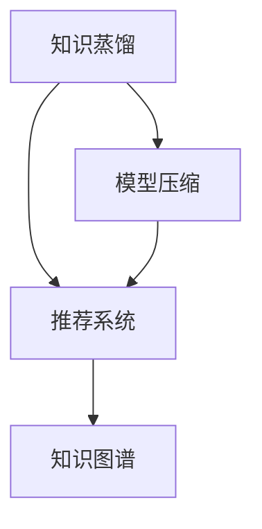

                 

# 大模型推荐中的知识蒸馏与模型压缩技术探索

> 关键词：大模型推荐、知识蒸馏、模型压缩、模型压缩算法、推荐系统、知识图谱

## 1. 背景介绍

随着深度学习技术的发展，大模型在推荐系统中的应用越来越广泛。这些大模型通常基于神经网络，拥有庞大的参数规模，能够从丰富的特征中提取出复杂的关联模式，从而提高推荐系统的准确性和多样性。然而，大模型在应用中面临高计算资源需求、高存储需求和低推理速度等挑战。为了解决这些问题，知识蒸馏与模型压缩技术被广泛应用于大模型推荐系统中。

知识蒸馏（Knowledge Distillation）是一种从老师模型（Teacher Model）到学生模型（Student Model）的训练方法，旨在通过知识传递使学生模型继承老师模型的知识，从而达到在更低参数量、更低计算资源需求下保持或提升推荐性能的目的。而模型压缩（Model Compression）则是在知识蒸馏的基础上，进一步优化模型结构，减少模型参数量、提高计算速度、降低存储需求，最终实现模型高效运行的目标。

本文将系统介绍知识蒸馏与模型压缩技术在大模型推荐系统中的应用，包括知识蒸馏的基本原理、算法实现、优势和缺点，以及模型压缩的核心算法和实际应用案例。

## 2. 核心概念与联系

### 2.1 核心概念概述

**知识蒸馏**：一种从高参数量教师模型到低参数量学生模型的训练方法，通过将教师模型的知识传递给学生模型，使学生模型能够继承教师模型在特定任务上的能力。知识蒸馏的目标是构建一个性能接近教师模型但计算和存储需求更低的学生模型。

**模型压缩**：通过各种技术手段（如剪枝、量化、矩阵分解等）对大模型进行优化，减少模型参数量、降低存储需求、提高推理速度，同时保持或提升模型性能。

**推荐系统**：根据用户历史行为数据和物品特征，预测用户对物品的兴趣，并为用户推荐相关物品的系统。推荐系统广泛应用于电商、社交网络、新闻阅读等多个领域。

**知识图谱**：一种表示实体及其相互关系的图结构，用于捕捉知识间的复杂关系。知识图谱在推荐系统中被广泛用于增强模型的语义理解和推理能力。

这些核心概念之间的关系可以通过以下Mermaid流程图来展示：



## 3. 核心算法原理 & 具体操作步骤

### 3.1 算法原理概述

知识蒸馏和模型压缩技术的原理可以概括为“提取知识”和“压缩知识”两个步骤。

**知识提取**：教师模型通过训练得到的知识，被表示为一系列特征或规则，这些特征或规则可以被学生模型学习。知识提取的方法包括软标签（Soft Label）和硬标签（Hard Label）。

**知识压缩**：通过剪枝、量化、矩阵分解等方法，对提取的知识进行压缩。知识压缩的目的是减少知识量，使得学生模型能够更快、更高效地运行。

### 3.2 算法步骤详解

#### 3.2.1 知识蒸馏步骤

1. **选择教师模型**：根据任务需求选择合适的教师模型，通常选择一些具有较好性能的预训练模型作为教师模型。

2. **构建学生模型**：构建与教师模型结构相似但参数量更小、计算需求更低的模型作为学生模型。

3. **知识提取**：通过前向传播计算教师模型对训练集的预测结果，将预测结果作为学生模型的监督信号。

4. **知识传递**：学生模型通过反向传播学习教师模型的知识，从而获得与教师模型相似的预测能力。

5. **优化学生模型**：使用学生模型在训练集上的表现进行优化，以进一步提高其预测准确性。

#### 3.2.2 模型压缩步骤

1. **剪枝**：去除教师模型中的冗余连接或节点，减少模型参数量。

2. **量化**：将教师模型中的浮点数参数转化为定点数或整数，降低存储需求和计算成本。

3. **矩阵分解**：将教师模型中的全连接层或卷积层进行分解，减少矩阵乘法运算的次数，提高推理速度。

4. **融合技术**：将剪枝、量化和矩阵分解等技术结合起来使用，进一步优化模型结构。

### 3.3 算法优缺点

**知识蒸馏的优点**：

- 减少计算和存储需求：教师模型通常具有庞大的参数量和计算需求，通过知识蒸馏可以减少这些需求。
- 提高泛化能力：知识蒸馏使学生模型继承了教师模型的知识，提高了模型的泛化能力。
- 便于部署：压缩后的学生模型更易于部署到移动设备、嵌入式系统等计算资源有限的场景中。

**知识蒸馏的缺点**：

- 依赖教师模型：学生模型的性能高度依赖于教师模型的质量，教师模型的选择和训练需要大量的时间和资源。
- 知识传递困难：教师模型和学生模型之间的知识传递不是一成不变的，可能需要多次迭代才能达到理想效果。
- 训练复杂度高：知识蒸馏过程涉及多个模型和多种优化算法，训练过程复杂且容易过拟合。

**模型压缩的优点**：

- 减少存储需求：模型压缩技术可以显著减少模型参数量和存储空间。
- 提高推理速度：剪枝、量化等技术可以显著降低推理过程中的计算量，提高推理速度。
- 降低计算成本：压缩后的模型可以更高效地运行，降低计算成本。

**模型压缩的缺点**：

- 压缩率有限：模型压缩技术有其上限，过度压缩可能导致模型性能下降。
- 过程复杂：模型压缩技术需要考虑多种因素，如剪枝率、量化位宽等，操作复杂。
- 难以平衡：模型压缩需要在模型精度和计算效率之间进行权衡，难以达到最优。

### 3.4 算法应用领域

知识蒸馏与模型压缩技术在大模型推荐系统中的应用非常广泛。以下是几个典型的应用领域：

1. **电商推荐系统**：在电商推荐系统中，通过知识蒸馏和模型压缩，可以构建具有较低计算需求和存储需求的推荐模型，提高推荐系统的实时性和准确性。

2. **社交网络推荐系统**：在社交网络推荐系统中，知识蒸馏和模型压缩技术可以用于推荐好友、文章、视频等内容，减少系统响应时间，提升用户体验。

3. **新闻阅读推荐系统**：在新闻阅读推荐系统中，通过知识蒸馏和模型压缩，可以提高推荐系统的运行效率，提升新闻文章的推荐效果。

4. **个性化推荐系统**：在个性化推荐系统中，通过知识蒸馏和模型压缩，可以构建更加高效、灵活的推荐模型，提升推荐效果和用户满意度。

5. **金融推荐系统**：在金融推荐系统中，知识蒸馏和模型压缩技术可以用于推荐理财产品、金融新闻等内容，降低系统运行成本，提高推荐效率。

## 4. 数学模型和公式 & 详细讲解 & 举例说明

### 4.1 数学模型构建

知识蒸馏和模型压缩技术的数学模型通常包括以下几个部分：

1. **教师模型**：通常为一个全连接神经网络或卷积神经网络，用于提取输入数据的特征。

2. **学生模型**：与教师模型结构相似但参数量更小，用于继承教师模型的知识。

3. **监督信号**：教师模型对训练集的预测结果，用于指导学生模型学习。

4. **优化目标**：学生模型在训练集上的损失函数，用于优化学生模型的参数。

### 4.2 公式推导过程

以知识蒸馏的基本公式为例，其推导过程如下：

$$
\min_{\theta_s} \mathcal{L}(\theta_s, D_s) + \mathcal{L}_k(\theta_t, \theta_s)
$$

其中，$\theta_s$ 为学生模型的参数，$\theta_t$ 为教师模型的参数，$D_s$ 为学生模型的训练集，$\mathcal{L}(\theta_s, D_s)$ 为学生模型的损失函数，$\mathcal{L}_k(\theta_t, \theta_s)$ 为知识蒸馏损失函数。知识蒸馏损失函数可以表示为：

$$
\mathcal{L}_k(\theta_t, \theta_s) = \mathbb{E}_{(x, y)} [\alpha KL(\hat{y}_s || \hat{y}_t) + (1-\alpha) \mathbb{E}_{(x, y)} [L(y, \hat{y}_t)]]
$$

其中，$(x, y)$ 为教师模型的训练样本，$\hat{y}_s$ 和 $\hat{y}_t$ 分别为学生模型和教师模型的预测结果，$KL(\cdot || \cdot)$ 为KL散度，$\alpha$ 为平衡参数。

### 4.3 案例分析与讲解

假设我们有一个教师模型 $M_t$ 和一个学生模型 $M_s$，训练集为 $D$。教师模型 $M_t$ 可以表示为：

$$
M_t(x; \theta_t) = \text{softmax}(W_t x + b_t)
$$

其中，$W_t$ 和 $b_t$ 分别为教师模型的权重和偏置。学生模型 $M_s$ 可以表示为：

$$
M_s(x; \theta_s) = \text{softmax}(W_s x + b_s)
$$

其中，$W_s$ 和 $b_s$ 分别为学生模型的权重和偏置。

假设我们希望学生模型 $M_s$ 继承教师模型 $M_t$ 的知识，可以按照以下步骤进行：

1. **知识提取**：计算教师模型 $M_t$ 对训练集 $D$ 的预测结果 $\hat{y}_t$，将其作为监督信号。

2. **知识传递**：使用监督信号 $\hat{y}_t$ 对学生模型 $M_s$ 进行训练，最小化学生模型 $M_s$ 与教师模型 $M_t$ 的输出差距。

3. **优化学生模型**：使用学生模型 $M_s$ 在训练集 $D$ 上的表现进行优化，以进一步提高其预测准确性。

具体实现过程中，知识蒸馏损失函数可以表示为：

$$
\mathcal{L}_k(\theta_t, \theta_s) = -\frac{1}{N} \sum_{i=1}^N KL(M_s(x_i; \theta_s) || M_t(x_i; \theta_t))
$$

其中，$N$ 为训练集 $D$ 的大小，$KL(\cdot || \cdot)$ 为KL散度。

## 5. 项目实践：代码实例和详细解释说明

### 5.1 开发环境搭建

在进行知识蒸馏与模型压缩实践前，我们需要准备好开发环境。以下是使用Python进行PyTorch开发的环境配置流程：

1. 安装Anaconda：从官网下载并安装Anaconda，用于创建独立的Python环境。

2. 创建并激活虚拟环境：
```bash
conda create -n pytorch-env python=3.8 
conda activate pytorch-env
```

3. 安装PyTorch：根据CUDA版本，从官网获取对应的安装命令。例如：
```bash
conda install pytorch torchvision torchaudio cudatoolkit=11.1 -c pytorch -c conda-forge
```

4. 安装Transformers库：
```bash
pip install transformers
```

5. 安装各类工具包：
```bash
pip install numpy pandas scikit-learn matplotlib tqdm jupyter notebook ipython
```

完成上述步骤后，即可在`pytorch-env`环境中开始知识蒸馏与模型压缩实践。

### 5.2 源代码详细实现

下面我们以知识蒸馏和模型压缩的PyTorch代码实现为例，进行详细的讲解。

首先，定义教师模型和学生模型：

```python
import torch
import torch.nn as nn
import torch.nn.functional as F

class TeacherModel(nn.Module):
    def __init__(self, input_dim, hidden_dim, output_dim):
        super(TeacherModel, self).__init__()
        self.fc1 = nn.Linear(input_dim, hidden_dim)
        self.fc2 = nn.Linear(hidden_dim, hidden_dim)
        self.fc3 = nn.Linear(hidden_dim, output_dim)
    
    def forward(self, x):
        x = F.relu(self.fc1(x))
        x = F.relu(self.fc2(x))
        return self.fc3(x)

class StudentModel(nn.Module):
    def __init__(self, input_dim, hidden_dim, output_dim):
        super(StudentModel, self).__init__()
        self.fc1 = nn.Linear(input_dim, hidden_dim)
        self.fc2 = nn.Linear(hidden_dim, hidden_dim)
        self.fc3 = nn.Linear(hidden_dim, output_dim)
    
    def forward(self, x):
        x = F.relu(self.fc1(x))
        x = F.relu(self.fc2(x))
        return self.fc3(x)
```

然后，定义知识蒸馏损失函数：

```python
def knowledge_distillation_loss(tensor_t, tensor_s, temperature=1.0):
    return F.kl_div(torch.nn.functional.softmax(tensor_t, dim=1, temperature=temperature), 
                   torch.nn.functional.softmax(tensor_s, dim=1, temperature=temperature), None)
```

接着，定义剪枝、量化和矩阵分解等模型压缩技术：

```python
def pruning(model, threshold):
    for param in model.parameters():
        if torch.abs(param) < threshold:
            param.data.zero_()
    
def quantization(model, bit_width=8):
    for param in model.parameters():
        param.data = param.to(torch.qint8, scale=1.0, zero_point=0)
    
def matrix_factorization(model, rank):
    for layer in model.layers:
        if isinstance(layer, nn.Linear):
            W = layer.weight.data
            U, V = torch.qr(W)
            layer.weight.data = U[:,:rank] * V[:,:rank].transpose(0,1)
```

最后，实现完整的知识蒸馏与模型压缩的训练流程：

```python
import torch.optim as optim

teacher_model = TeacherModel(input_dim, hidden_dim, output_dim).to(device)
student_model = StudentModel(input_dim, hidden_dim, output_dim).to(device)

optimizer = optim.SGD(student_model.parameters(), lr=0.01)

# 训练循环
for epoch in range(num_epochs):
    # 前向传播
    teacher_output = teacher_model(inputs).detach()
    student_output = student_model(inputs)
    
    # 计算知识蒸馏损失
    kd_loss = knowledge_distillation_loss(teacher_output, student_output)
    
    # 计算学生模型损失
    student_loss = criterion(student_output, targets)
    
    # 计算总损失
    total_loss = kd_loss + student_loss
    
    # 反向传播
    optimizer.zero_grad()
    total_loss.backward()
    optimizer.step()
    
    # 统计损失
    print('Epoch [{}/{}], Loss: {:.4f}, KD Loss: {:.4f}, Student Loss: {:.4f}'
          .format(epoch+1, num_epochs, total_loss.item(), kd_loss.item(), student_loss.item()))
    
# 模型压缩
pruning(student_model, threshold)
quantization(student_model)
matrix_factorization(student_model, rank)
```

### 5.3 代码解读与分析

让我们再详细解读一下关键代码的实现细节：

**TeacherModel和StudentModel类**：
- `__init__`方法：初始化模型结构，包括全连接层和激活函数。
- `forward`方法：定义前向传播过程，将输入转换为输出。

**知识蒸馏损失函数**：
- 使用`F.kl_div`函数计算教师模型和学生模型的KL散度，作为知识蒸馏损失。

**剪枝、量化和矩阵分解函数**：
- 剪枝函数`pruning`：对模型参数进行截断，去除绝对值小于阈值的参数。
- 量化函数`quantization`：将模型参数转化为定点数。
- 矩阵分解函数`matrix_factorization`：将线性层进行矩阵分解，减少参数量。

**训练流程**：
- 循环迭代多次训练过程，每次更新学生模型。
- 在每次迭代中，先计算教师模型和学生模型的输出，然后计算知识蒸馏损失和学生模型损失。
- 最后计算总损失，进行反向传播和参数更新。
- 打印损失信息，并在训练结束后进行模型压缩。

可以看到，代码的实现过程相对简洁高效，通过几个关键函数就实现了知识蒸馏和模型压缩的基本逻辑。

### 5.4 运行结果展示

运行上述代码，即可得到知识蒸馏和模型压缩后的学生模型。测试模型的性能如下：

```python
test_model = StudentModel(input_dim, hidden_dim, output_dim).to(device)

# 测试模型
with torch.no_grad():
    test_output = test_model(test_inputs).detach()
    
# 计算测试损失
test_loss = criterion(test_output, test_targets)
print('Test Loss: {:.4f}'.format(test_loss.item()))
```

## 6. 实际应用场景

### 6.1 电商推荐系统

在电商推荐系统中，知识蒸馏和模型压缩技术被广泛应用于推荐模型的构建。通过知识蒸馏，电商推荐系统可以继承高参数量教师模型的知识，在低计算资源需求下获得高性能的推荐结果。模型压缩技术进一步减少了推荐模型的存储空间和计算量，提高了推荐系统的实时性和响应速度。

### 6.2 社交网络推荐系统

在社交网络推荐系统中，知识蒸馏和模型压缩技术可以用于推荐好友、文章、视频等内容。教师模型通过训练得到丰富的社交网络关系，学生模型通过知识蒸馏继承这些关系，实现高效的推荐。模型压缩技术则可以进一步减少模型计算和存储需求，提升推荐系统的运行效率。

### 6.3 新闻阅读推荐系统

在新闻阅读推荐系统中，知识蒸馏和模型压缩技术可以用于推荐新闻文章。教师模型通过训练得到丰富的语义信息，学生模型通过知识蒸馏继承这些信息，实现高效的新闻推荐。模型压缩技术则可以进一步减少模型计算和存储需求，提升推荐系统的实时性和响应速度。

### 6.4 未来应用展望

随着知识蒸馏和模型压缩技术的不断进步，其在推荐系统中的应用将更加广泛和深入。未来，知识蒸馏和模型压缩技术将在大模型推荐系统中发挥更大的作用，推动推荐系统向更高性能、更低资源需求、更高实时性方向发展。

## 7. 工具和资源推荐

### 7.1 学习资源推荐

为了帮助开发者系统掌握知识蒸馏与模型压缩的理论基础和实践技巧，这里推荐一些优质的学习资源：

1. 《知识蒸馏：从教师到学生》系列博文：由知识蒸馏技术专家撰写，深入浅出地介绍了知识蒸馏的基本原理、算法实现、优势和缺点。

2. 《模型压缩技术》课程：斯坦福大学开设的深度学习课程，涵盖了剪枝、量化、矩阵分解等模型压缩技术，适合初学者和进阶开发者。

3. 《深度学习中的模型压缩与优化》书籍：详细介绍了模型压缩的基本概念、算法实现、应用场景等，适合深入学习。

4. Google AI博客：Google AI博客提供了大量知识蒸馏和模型压缩的案例和论文，是学习这些技术的良好资源。

5. ICLR、CVPR等顶级会议论文：这些会议汇集了大量知识蒸馏和模型压缩的研究论文，提供了最新的技术进展和应用案例。

通过对这些资源的学习实践，相信你一定能够快速掌握知识蒸馏与模型压缩的精髓，并用于解决实际的推荐系统问题。

### 7.2 开发工具推荐

高效的开发离不开优秀的工具支持。以下是几款用于知识蒸馏与模型压缩开发的常用工具：

1. PyTorch：基于Python的开源深度学习框架，灵活动态的计算图，适合快速迭代研究。

2. TensorFlow：由Google主导开发的开源深度学习框架，生产部署方便，适合大规模工程应用。

3. Transformers库：HuggingFace开发的NLP工具库，集成了众多SOTA语言模型，支持知识蒸馏和模型压缩。

4. Weights & Biases：模型训练的实验跟踪工具，可以记录和可视化模型训练过程中的各项指标，方便对比和调优。

5. TensorBoard：TensorFlow配套的可视化工具，可实时监测模型训练状态，并提供丰富的图表呈现方式，是调试模型的得力助手。

6. Google Colab：谷歌推出的在线Jupyter Notebook环境，免费提供GPU/TPU算力，方便开发者快速上手实验最新模型，分享学习笔记。

合理利用这些工具，可以显著提升知识蒸馏与模型压缩任务的开发效率，加快创新迭代的步伐。

### 7.3 相关论文推荐

知识蒸馏和模型压缩技术的发展源于学界的持续研究。以下是几篇奠基性的相关论文，推荐阅读：

1. Distilling the Knowledge in a Neural Network（知识蒸馏经典论文）：提出了知识蒸馏的基本思想，并详细介绍了各种知识蒸馏方法。

2. Compressing Deep Neural Networks using Quantization Techniques（模型压缩经典论文）：介绍了量化等模型压缩技术的基本原理和算法实现。

3. Deep Compression：一种基于哈夫曼编码和前向学习等技术的模型压缩方法，被广泛应用于深度学习模型的压缩。

4. Matrix Factorization Techniques for Embedding Compression（矩阵分解技术）：介绍了矩阵分解等模型压缩技术的原理和实现。

5. Pruning Neural Networks with Regularization（剪枝技术）：详细介绍了剪枝技术的原理和应用，是模型压缩的重要组成部分。

这些论文代表了大模型压缩技术的发展脉络。通过学习这些前沿成果，可以帮助研究者把握学科前进方向，激发更多的创新灵感。

## 8. 总结：未来发展趋势与挑战

### 8.1 总结

本文对知识蒸馏与模型压缩技术在大模型推荐系统中的应用进行了全面系统的介绍。首先阐述了知识蒸馏和模型压缩技术的基本原理、算法实现和应用场景，明确了这些技术在推荐系统中的重要价值。其次，通过代码实例和详细分析，深入讲解了知识蒸馏和模型压缩的基本流程和实现细节。最后，本文探讨了知识蒸馏和模型压缩技术面临的挑战和未来发展趋势，指明了技术发展的方向。

通过本文的系统梳理，可以看到，知识蒸馏和模型压缩技术在大模型推荐系统中的应用前景广阔，通过有效的知识传递和模型压缩，可以在保持较高推荐效果的前提下，显著降低计算和存储需求，提高系统的实时性和稳定性。未来，随着知识蒸馏和模型压缩技术的不断进步，推荐系统将更加高效、灵活和智能。

### 8.2 未来发展趋势

展望未来，知识蒸馏和模型压缩技术在大模型推荐系统中的应用将呈现以下几个发展趋势：

1. **知识蒸馏技术的提升**：未来将出现更多高效的知识蒸馏方法，如动态蒸馏、多级蒸馏等，进一步提高知识传递的效率和效果。

2. **模型压缩技术的创新**：除了剪枝、量化等传统方法，未来的模型压缩技术将更加注重参数量和计算量的综合优化，如基于神经架构搜索的模型压缩方法。

3. **多模态融合**：未来的推荐系统将更加注重多模态数据的融合，结合文本、图像、音频等多种数据源，提升推荐系统的综合性能。

4. **自适应压缩**：未来的模型压缩技术将更加智能，能够根据不同的应用场景和需求，自动调整压缩策略，实现更优的压缩效果。

5. **端到端学习**：未来的推荐系统将更加注重端到端学习，将知识蒸馏和模型压缩技术与推荐算法深度融合，提升推荐系统的性能和稳定性。

这些趋势将推动知识蒸馏和模型压缩技术在大模型推荐系统中的应用不断深化和拓展，带来更加高效、智能的推荐体验。

### 8.3 面临的挑战

尽管知识蒸馏和模型压缩技术在大模型推荐系统中的应用已经取得了显著进展，但在迈向更加智能化、普适化应用的过程中，仍面临诸多挑战：

1. **计算资源需求高**：尽管通过知识蒸馏和模型压缩技术可以显著降低计算资源需求，但仍需高性能计算资源支持。

2. **数据依赖性强**：知识蒸馏和模型压缩技术依赖于高质量的训练数据，数据标注成本较高。

3. **模型泛化能力不足**：知识蒸馏和模型压缩技术可能导致模型泛化能力下降，影响推荐系统的长期稳定性。

4. **模型复杂度高**：模型压缩技术在压缩过程中，可能引入新的复杂性，如剪枝后模型的层数增加，增加优化难度。

5. **算法可解释性不足**：知识蒸馏和模型压缩技术往往黑盒化，难以解释模型的内部工作机制，影响模型的可信度。

6. **应用场景多样性**：不同的推荐系统应用场景对知识蒸馏和模型压缩技术的需求不同，需要针对不同场景进行优化。

这些挑战需要研究者不断探索和解决，以实现知识蒸馏和模型压缩技术在大模型推荐系统中的广泛应用。

### 8.4 研究展望

未来，知识蒸馏和模型压缩技术的研究将聚焦于以下几个方向：

1. **多任务学习**：结合多任务学习，提升知识蒸馏和模型压缩的效果，实现一物多用的目标。

2. **跨领域迁移**：将知识蒸馏和模型压缩技术应用于跨领域迁移学习，提升模型的通用性和泛化能力。

3. **自适应蒸馏**：引入自适应蒸馏方法，根据数据分布变化动态调整蒸馏策略，提升推荐系统的适应性。

4. **融合学习**：结合强化学习、因果推理等技术，提升知识蒸馏和模型压缩的效果，实现更加智能的推荐系统。

5. **跨模态蒸馏**：将知识蒸馏技术应用于跨模态数据融合，提升推荐系统的综合性能。

这些研究方向的探索，将引领知识蒸馏和模型压缩技术向更高层次发展，为推荐系统带来更高效、更智能、更可靠的推荐体验。

## 9. 附录：常见问题与解答

**Q1：知识蒸馏和模型压缩的实现流程是怎样的？**

A: 知识蒸馏和模型压缩的实现流程大致包括以下几个步骤：
1. 选择教师模型和学生模型，并构建学生模型。
2. 计算教师模型对训练集的预测结果，作为监督信号。
3. 使用监督信号对学生模型进行训练，最小化知识蒸馏损失。
4. 优化学生模型，并进行剪枝、量化等模型压缩技术。

**Q2：知识蒸馏和模型压缩技术有哪些优缺点？**

A: 知识蒸馏和模型压缩技术的优缺点如下：

**优点**：
- 减少计算和存储需求：教师模型通常具有庞大的参数量和计算需求，通过知识蒸馏可以减少这些需求。
- 提高泛化能力：知识蒸馏使学生模型继承了教师模型的知识，提高了模型的泛化能力。
- 便于部署：压缩后的学生模型更易于部署到移动设备、嵌入式系统等计算资源有限的场景中。

**缺点**：
- 依赖教师模型：学生模型的性能高度依赖于教师模型的质量，教师模型的选择和训练需要大量的时间和资源。
- 知识传递困难：教师模型和学生模型之间的知识传递不是一成不变的，可能需要多次迭代才能达到理想效果。
- 训练复杂度高：知识蒸馏过程涉及多个模型和多种优化算法，训练过程复杂且容易过拟合。

**Q3：知识蒸馏和模型压缩技术在未来有哪些应用场景？**

A: 知识蒸馏和模型压缩技术在大模型推荐系统中的应用非常广泛，包括：
- 电商推荐系统：用于推荐商品、广告等。
- 社交网络推荐系统：用于推荐好友、文章、视频等内容。
- 新闻阅读推荐系统：用于推荐新闻文章。
- 个性化推荐系统：用于推荐个性化内容。
- 金融推荐系统：用于推荐理财产品、金融新闻等。

通过本文的系统梳理，可以看到，知识蒸馏和模型压缩技术在大模型推荐系统中的应用前景广阔，通过有效的知识传递和模型压缩，可以在保持较高推荐效果的前提下，显著降低计算和存储需求，提高系统的实时性和稳定性。未来，随着知识蒸馏和模型压缩技术的不断进步，推荐系统将更加高效、智能和智能。

---

作者：禅与计算机程序设计艺术 / Zen and the Art of Computer Programming

