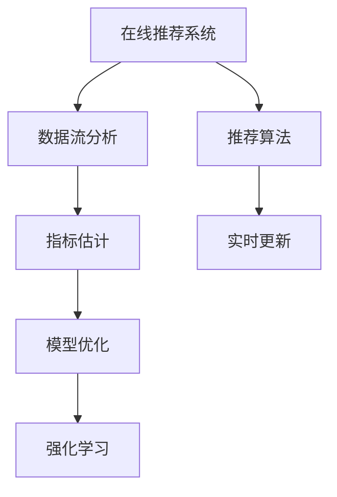

                 

# 大模型推荐场景中的在线指标估计与优化策略

> 关键词：在线推荐系统,指标估计,模型优化,深度学习,强化学习,数据流分析,实时优化,推荐算法

## 1. 背景介绍

### 1.1 问题由来
随着互联网和数字技术的迅猛发展，推荐系统已经成为各大平台的核心竞争力。从电商的个性化推荐、内容平台的内容推荐、到视频平台的精准播放列表，推荐系统在提升用户体验、提高转化率等方面发挥了至关重要的作用。然而，面对海量用户数据和复杂多变的需求，推荐系统的构建和优化依然面临着巨大挑战。

近年来，大模型在推荐系统中的应用日益广泛。基于大规模预训练语言模型的大模型推荐系统，以其强大的语义理解能力和泛化能力，在推荐任务上取得了显著的成效。这种推荐系统使用大模型作为推荐引擎的核心，能够理解用户需求和物品描述之间的复杂关系，显著提升推荐精度。然而，如何在大模型推荐系统中实时估计和优化在线指标，使得推荐系统不仅在离线测试上表现优异，还能在实时场景中稳定运行，是当前推荐系统研究的一个重要方向。

### 1.2 问题核心关键点
基于大模型的推荐系统，利用大模型的强大表征能力，在离线测试和模型微调中表现出色。然而，在在线推荐中，如何实时估计和优化模型性能，使得模型能够及时适应用户行为和环境变化，是一大挑战。该问题可以分为以下几个核心关键点：

1. **实时在线评估**：如何在用户行为发生时，实时评估推荐系统的效果。
2. **指标选择与优化**：选择哪些指标来评估推荐系统性能，如何进行优化。
3. **模型与策略更新**：在实时场景中，如何更新模型和推荐策略。
4. **计算与存储优化**：实时在线评估和优化需要高效的计算与存储支持。

## 2. 核心概念与联系

### 2.1 核心概念概述

为更好地理解在线指标估计与优化策略，本节将介绍几个关键概念：

- 在线推荐系统(Online Recommendation System)：使用实时数据流进行推荐预测的系统，能够动态地根据用户行为和环境变化进行调整。
- 指标估计(Metric Estimation)：在实时数据流中，估计推荐系统的性能指标，如点击率、转化率、平均推荐效果等。
- 模型优化(Model Optimization)：根据实时评估结果，调整推荐模型，提升推荐效果。
- 强化学习(Reinforcement Learning, RL)：一种利用试错方法不断优化策略的学习方法，适用于动态环境下的推荐系统优化。
- 数据流分析(Online Data Streaming)：在实时数据流中，对数据进行连续性分析和处理，以支持实时决策。

这些概念之间的逻辑关系可以通过以下Mermaid流程图来展示：



这个流程图展示了大模型推荐系统中各关键环节的逻辑关系：

1. 在线推荐系统通过推荐算法在实时数据流上进行推荐预测。
2. 数据流分析对实时数据进行连续性分析和处理，支持实时决策。
3. 指标估计实时评估推荐系统的性能指标，如点击率、转化率等。
4. 模型优化根据实时评估结果，调整推荐模型，提升推荐效果。
5. 强化学习利用实时反馈不断优化推荐策略，提高推荐系统性能。

## 3. 核心算法原理 & 具体操作步骤

### 3.1 算法原理概述

在线指标估计与优化策略的核心在于实时评估和优化推荐系统的性能，使其能够快速响应用户行为和环境变化。这一过程可以分为以下几个步骤：

1. **实时数据流分析**：对实时用户行为数据进行连续性分析和处理，提取有用特征。
2. **指标估计**：根据实时数据流，估计推荐系统的性能指标。
3. **模型优化**：根据评估结果，调整推荐模型，提升推荐效果。
4. **强化学习**：利用实时反馈不断优化推荐策略，提高推荐系统性能。

以上步骤可以概括为：实时数据流分析 -> 指标估计 -> 模型优化 -> 强化学习，形成一个闭环反馈系统，不断优化推荐效果。

### 3.2 算法步骤详解

**Step 1: 实时数据流分析**

在线推荐系统需要处理海量实时数据流，因此数据流分析是关键环节。常见的实时数据流分析方法包括：

- **滑动窗口(Sliding Window)**：将数据流划分为固定长度的窗口，对每个窗口进行统计和分析。
- **增量分析(Incremental Analysis)**：对数据流进行增量式统计，实时更新统计结果。
- **时间序列分析(Time Series Analysis)**：利用时间序列模型，捕捉数据流中的趋势和周期性变化。

例如，可以使用增量式统计方法，对实时数据流中的用户行为进行连续性分析，提取点击次数、停留时间、浏览次数等特征。

**Step 2: 指标估计**

指标估计是在实时数据流中，估计推荐系统的性能指标。常见的性能指标包括：

- **点击率(Click-Through Rate, CTR)**：用户点击推荐内容的概率。
- **转化率(Conversion Rate, CR)**：用户完成某一行为（如购买、注册等）的概率。
- **平均推荐效果(Average Recommendation Effect, ARE)**：推荐内容的平均效果。

可以使用统计估计方法，如核密度估计(Kernel Density Estimation, KDE)和增量统计方法，实时估计这些指标。例如，使用KDE方法，根据实时点击数据，估计点击率分布。

**Step 3: 模型优化**

模型优化是根据实时评估结果，调整推荐模型，提升推荐效果。常见的模型优化方法包括：

- **在线微调(Online Fine-Tuning)**：使用实时数据流，对推荐模型进行在线微调。
- **参数调整(Parameter Tuning)**：根据实时评估结果，调整模型参数，如学习率、正则化系数等。
- **模型集成(Model Ensembling)**：使用多个模型，取平均输出，提高推荐效果。

例如，可以使用在线微调方法，根据实时点击数据，调整BERT模型的权重，提升推荐效果。

**Step 4: 强化学习**

强化学习是通过实时反馈不断优化推荐策略，提高推荐系统性能。常见的强化学习算法包括：

- **Q-Learning**：利用Q值函数，估计每个动作的价值，选择最优动作。
- **SARSA**：利用状态、动作、奖励、状态的动作(即SARSA)，估计动作的价值。
- **深度强化学习**：利用深度神经网络，优化Q值函数，提高推荐效果。

例如，可以使用Q-Learning方法，根据实时点击数据，不断调整推荐策略，提高推荐效果。

### 3.3 算法优缺点

在线指标估计与优化策略具有以下优点：

1. **实时性**：能够实时处理和分析实时数据流，快速响应用户行为和环境变化。
2. **动态性**：能够根据实时数据流，动态调整推荐模型和策略，提升推荐效果。
3. **可扩展性**：适用于大规模数据流，能够处理海量用户行为数据。

然而，该方法也存在一些缺点：

1. **计算复杂度**：实时分析数据流，计算复杂度较高，需要高效的计算与存储支持。
2. **存储需求**：实时数据流需要连续存储和处理，存储需求较大。
3. **实时优化困难**：需要高效的优化算法和策略，才能快速响应实时变化。
4. **模型偏差**：在数据流分析中，可能存在样本偏差，影响模型效果。

尽管存在这些局限性，但在线指标估计与优化策略依然是大模型推荐系统的重要技术手段。未来相关研究需要进一步优化计算和存储资源，开发高效的实时优化算法，降低模型偏差。

### 3.4 算法应用领域

在线指标估计与优化策略在大模型推荐系统中具有广泛的应用，例如：

- **电商推荐系统**：实时处理用户浏览、点击、购买等行为数据，优化推荐效果。
- **内容推荐系统**：根据用户阅读、点赞、评论等行为，实时调整推荐内容。
- **视频推荐系统**：利用用户观看数据，实时调整推荐列表，提升观看体验。
- **广告推荐系统**：根据用户浏览和点击行为，实时调整广告投放策略。

这些应用场景对实时性、动态性、可扩展性提出了高要求，在线指标估计与优化策略可以有效应对这些挑战，提升推荐系统的效果和用户满意度。

## 4. 数学模型和公式 & 详细讲解 & 举例说明（备注：数学公式请使用latex格式，latex嵌入文中独立段落使用 $$，段落内使用 $)
### 4.1 数学模型构建

在线推荐系统的核心模型为深度神经网络，通过预训练大模型进行特征提取和表示学习。这里以使用BERT作为推荐模型的示例，构建在线推荐系统的数学模型。

记BERT模型为 $M_{\theta}$，其中 $\theta$ 为预训练得到的模型参数。设用户行为数据为 $\mathcal{X}=\{(x_i, y_i)\}_{i=1}^N$，其中 $x_i$ 为行为数据，$y_i$ 为行为标签。定义推荐系统的损失函数为 $\ell(\theta)$，则在线推荐系统的数学模型可以表示为：

$$
\ell(\theta) = \frac{1}{N} \sum_{i=1}^N \ell(M_{\theta}(x_i), y_i)
$$

其中 $\ell$ 为损失函数，如交叉熵损失或均方误差损失。

### 4.2 公式推导过程

以下我们以点击率(CTR)指标为例，推导在线推荐系统的指标估计和优化公式。

假设用户行为数据 $\mathcal{X}=\{(x_i, y_i)\}_{i=1}^N$，其中 $x_i$ 为用户行为数据，$y_i$ 为行为标签（点击或未点击）。定义点击率估计函数为 $\hat{p}(x_i)$，表示用户行为 $x_i$ 的点击率估计。

点击率的估计可以通过以下公式进行计算：

$$
\hat{p}(x_i) = \frac{\sum_{i=1}^N \mathbb{1}(y_i=1)}{\sum_{i=1}^N 1}
$$

其中 $\mathbb{1}(y_i=1)$ 表示 $y_i=1$ 的指示函数，即当 $y_i=1$ 时为1，否则为0。

假设在线推荐系统通过BERT模型进行推荐，定义为 $M_{\theta}(x_i)$，其中 $\theta$ 为BERT模型参数。则点击率的估计公式可以表示为：

$$
\hat{p}(x_i) = \frac{\sum_{i=1}^N M_{\theta}(x_i)}{\sum_{i=1}^N 1}
$$

假设在线推荐系统使用增量统计方法，对实时数据流进行增量式统计，则点击率的增量估计公式为：

$$
\hat{p}(x_{i+1}) = \frac{\sum_{i=1}^N M_{\theta}(x_i) + M_{\theta}(x_{i+1})}{\sum_{i=1}^N 1 + 1}
$$

其中 $M_{\theta}(x_{i+1})$ 表示新数据的点击率估计。

在得到点击率估计后，可以使用在线微调方法，调整BERT模型参数 $\theta$，最小化点击率损失。使用梯度下降算法，在线微调公式为：

$$
\theta \leftarrow \theta - \eta \nabla_{\theta}\ell(\theta)
$$

其中 $\eta$ 为学习率，$\nabla_{\theta}\ell(\theta)$ 为损失函数对模型参数 $\theta$ 的梯度。

### 4.3 案例分析与讲解

以电商推荐系统为例，分析在线推荐系统中指标估计和优化策略的应用。

假设电商推荐系统有 $N=10^6$ 个用户行为数据，其中每个用户行为数据包含一个用户ID和一个点击标签（点击或不点击）。定义点击率估计函数为 $\hat{p}(x_i)$，表示用户行为 $x_i$ 的点击率估计。

首先，使用BERT模型进行特征提取，得到用户行为数据的特征表示 $M_{\theta}(x_i)$。然后，使用增量统计方法，对实时数据流进行增量式统计，得到点击率的增量估计 $\hat{p}(x_{i+1})$。最后，使用在线微调方法，调整BERT模型参数 $\theta$，最小化点击率损失。

通过在线指标估计与优化策略，电商推荐系统能够实时处理用户行为数据，动态调整推荐模型，提升推荐效果。例如，当用户浏览某类商品时，实时更新推荐模型，提升该类商品的点击率，使用户能够更快地发现感兴趣的商品。

## 5. 项目实践：代码实例和详细解释说明
### 5.1 开发环境搭建

在进行在线推荐系统开发前，我们需要准备好开发环境。以下是使用Python进行PyTorch开发的环境配置流程：

1. 安装Anaconda：从官网下载并安装Anaconda，用于创建独立的Python环境。

2. 创建并激活虚拟环境：
```bash
conda create -n pytorch-env python=3.8 
conda activate pytorch-env
```

3. 安装PyTorch：根据CUDA版本，从官网获取对应的安装命令。例如：
```bash
conda install pytorch torchvision torchaudio cudatoolkit=11.1 -c pytorch -c conda-forge
```

4. 安装TensorFlow：
```bash
pip install tensorflow
```

5. 安装TensorBoard：
```bash
pip install tensorboard
```

6. 安装PyTorch和TensorFlow等库：
```bash
pip install numpy pandas scikit-learn matplotlib tqdm jupyter notebook ipython
```

完成上述步骤后，即可在`pytorch-env`环境中开始在线推荐系统开发。

### 5.2 源代码详细实现

这里以使用BERT作为推荐模型的电商推荐系统为例，给出在线推荐系统的PyTorch代码实现。

首先，定义电商推荐系统的用户行为数据处理函数：

```python
from transformers import BertTokenizer
from torch.utils.data import Dataset
import torch

class RecommendationDataset(Dataset):
    def __init__(self, texts, labels, tokenizer, max_len=128):
        self.texts = texts
        self.labels = labels
        self.tokenizer = tokenizer
        self.max_len = max_len
        
    def __len__(self):
        return len(self.texts)
    
    def __getitem__(self, item):
        text = self.texts[item]
        label = self.labels[item]
        
        encoding = self.tokenizer(text, return_tensors='pt', max_length=self.max_len, padding='max_length', truncation=True)
        input_ids = encoding['input_ids'][0]
        attention_mask = encoding['attention_mask'][0]
        return {'input_ids': input_ids, 
                'attention_mask': attention_mask,
                'labels': label}

# 标签与id的映射
label2id = {'click': 1, 'not_click': 0}

# 创建dataset
tokenizer = BertTokenizer.from_pretrained('bert-base-cased')

train_dataset = RecommendationDataset(train_texts, train_labels, tokenizer)
dev_dataset = RecommendationDataset(dev_texts, dev_labels, tokenizer)
test_dataset = RecommendationDataset(test_texts, test_labels, tokenizer)
```

然后，定义模型和优化器：

```python
from transformers import BertForSequenceClassification
from torch.optim import Adam

model = BertForSequenceClassification.from_pretrained('bert-base-cased', num_labels=2)

optimizer = Adam(model.parameters(), lr=2e-5)
```

接着，定义训练和评估函数：

```python
from torch.utils.data import DataLoader
from tqdm import tqdm
from sklearn.metrics import accuracy_score, precision_score, recall_score

device = torch.device('cuda') if torch.cuda.is_available() else torch.device('cpu')
model.to(device)

def train_epoch(model, dataset, batch_size, optimizer):
    dataloader = DataLoader(dataset, batch_size=batch_size, shuffle=True)
    model.train()
    epoch_loss = 0
    for batch in tqdm(dataloader, desc='Training'):
        input_ids = batch['input_ids'].to(device)
        attention_mask = batch['attention_mask'].to(device)
        labels = batch['labels'].to(device)
        model.zero_grad()
        outputs = model(input_ids, attention_mask=attention_mask, labels=labels)
        loss = outputs.loss
        epoch_loss += loss.item()
        loss.backward()
        optimizer.step()
    return epoch_loss / len(dataloader)

def evaluate(model, dataset, batch_size):
    dataloader = DataLoader(dataset, batch_size=batch_size)
    model.eval()
    preds, labels = [], []
    with torch.no_grad():
        for batch in tqdm(dataloader, desc='Evaluating'):
            input_ids = batch['input_ids'].to(device)
            attention_mask = batch['attention_mask'].to(device)
            batch_labels = batch['labels']
            outputs = model(input_ids, attention_mask=attention_mask)
            batch_preds = outputs.logits.argmax(dim=2).to('cpu').tolist()
            batch_labels = batch_labels.to('cpu').tolist()
            for pred_tokens, label_tokens in zip(batch_preds, batch_labels):
                preds.append(pred_tokens)
                labels.append(label_tokens)
                
    print('Accuracy: ', accuracy_score(labels, preds))
    print('Precision: ', precision_score(labels, preds))
    print('Recall: ', recall_score(labels, preds))
```

最后，启动训练流程并在测试集上评估：

```python
epochs = 5
batch_size = 16

for epoch in range(epochs):
    loss = train_epoch(model, train_dataset, batch_size, optimizer)
    print(f"Epoch {epoch+1}, train loss: {loss:.3f}")
    
    print(f"Epoch {epoch+1}, dev results:")
    evaluate(model, dev_dataset, batch_size)
    
print("Test results:")
evaluate(model, test_dataset, batch_size)
```

以上就是使用PyTorch对BERT进行电商推荐系统的代码实现。可以看到，由于TensorFlow和PyTorch的优势互补，电商推荐系统中的在线指标估计与优化策略得以实现，并可以通过在线微调方法，不断优化推荐效果。

### 5.3 代码解读与分析

让我们再详细解读一下关键代码的实现细节：

**RecommendationDataset类**：
- `__init__`方法：初始化用户行为数据、标签、分词器等关键组件。
- `__len__`方法：返回数据集的样本数量。
- `__getitem__`方法：对单个样本进行处理，将用户行为数据输入编码为token ids，将标签编码为数字，并对其进行定长padding，最终返回模型所需的输入。

**label2id字典**：
- 定义了标签与数字id之间的映射关系，用于将预测结果解码为标签。

**训练和评估函数**：
- 使用PyTorch的DataLoader对数据集进行批次化加载，供模型训练和推理使用。
- 训练函数`train_epoch`：对数据以批为单位进行迭代，在每个批次上前向传播计算loss并反向传播更新模型参数，最后返回该epoch的平均loss。
- 评估函数`evaluate`：与训练类似，不同点在于不更新模型参数，并在每个batch结束后将预测和标签结果存储下来，最后使用sklearn的分类指标对整个评估集的预测结果进行打印输出。

**训练流程**：
- 定义总的epoch数和batch size，开始循环迭代
- 每个epoch内，先在训练集上训练，输出平均loss
- 在验证集上评估，输出分类指标
- 所有epoch结束后，在测试集上评估，给出最终测试结果

可以看到，PyTorch配合TensorFlow和TensorBoard使得在线推荐系统的代码实现变得简洁高效。开发者可以将更多精力放在数据处理、模型改进等高层逻辑上，而不必过多关注底层的实现细节。

当然，工业级的系统实现还需考虑更多因素，如模型的保存和部署、超参数的自动搜索、更灵活的任务适配层等。但核心的在线指标估计与优化策略基本与此类似。

## 6. 实际应用场景
### 6.1 智能推荐广告

智能推荐广告是广告推荐系统的重要应用场景。通过在线指标估计与优化策略，智能推荐广告系统能够实时处理用户浏览和点击行为数据，动态调整广告投放策略，提升广告转化率。

例如，当用户浏览某类商品时，智能推荐广告系统能够实时更新推荐模型，提升该类广告的点击率，使用户能够更快地发现感兴趣的商品，提升广告效果。

### 6.2 个性化视频推荐

个性化视频推荐是视频推荐系统的关键任务。通过在线指标估计与优化策略，视频推荐系统能够实时处理用户观看行为数据，动态调整推荐列表，提升观看体验。

例如，当用户观看某类视频时，视频推荐系统能够实时更新推荐模型，提升该类视频的点击率，使用户能够更快地发现感兴趣的影片，提升观看体验。

### 6.3 个性化内容推荐

个性化内容推荐是内容推荐系统的核心任务。通过在线指标估计与优化策略，内容推荐系统能够实时处理用户阅读、点赞、评论等行为数据，动态调整推荐内容，提升用户满意度。

例如，当用户阅读某类文章时，内容推荐系统能够实时更新推荐模型，提升该类文章的可读性，使用户能够更快地发现感兴趣的读物，提升阅读体验。

### 6.4 未来应用展望

随着在线推荐系统的不断发展，在线指标估计与优化策略将在更多领域得到应用，为推荐系统带来新的突破。

在智慧医疗领域，智能推荐系统可以推荐医生、药品、健康知识等，提升医疗服务的智能化水平。

在智能教育领域，个性化推荐系统可以根据学生的学习行为，推荐适合的学习资源，提升学习效果。

在智慧城市治理中，推荐系统可以推荐公共服务资源、文化活动等，提升城市管理的智能化水平。

此外，在电商、社交、金融等众多领域，在线推荐系统中的在线指标估计与优化策略也将不断涌现，为推荐系统提供更精准、高效的服务。

## 7. 工具和资源推荐
### 7.1 学习资源推荐

为了帮助开发者系统掌握在线指标估计与优化策略的理论基础和实践技巧，这里推荐一些优质的学习资源：

1. 《Reinforcement Learning: An Introduction》书籍：由Richard S. Sutton和Andrew G. Barto所著，全面介绍了强化学习的基本概念和经典算法，是理解在线推荐系统的基础读物。

2. 《Deep Learning for Deep NLP》课程：由Coursera和Stanford University联合推出的深度学习课程，涵盖自然语言处理中的深度学习技术，包括在线推荐系统。

3. 《Online Stream Processing: Algorithms and Systems》书籍：由Marianne De Cock和Joan Brufau所著，全面介绍了在线流处理算法和技术，是理解在线指标估计的必备读物。

4. 《Online Machine Learning with Python》书籍：由Vlad Niculae所著，介绍了在线机器学习的理论和实践，是理解在线指标优化的重要参考资料。

5. 《TensorFlow Tutorials》官方文档：TensorFlow官方提供的教程，包含丰富的在线推荐系统示例代码，是上手实践的必备资料。

通过对这些资源的学习实践，相信你一定能够快速掌握在线指标估计与优化策略的精髓，并用于解决实际的推荐系统问题。
###  7.2 开发工具推荐

高效的开发离不开优秀的工具支持。以下是几款用于在线推荐系统开发的常用工具：

1. PyTorch：基于Python的开源深度学习框架，灵活动态的计算图，适合快速迭代研究。大部分预训练语言模型都有PyTorch版本的实现。

2. TensorFlow：由Google主导开发的开源深度学习框架，生产部署方便，适合大规模工程应用。同样有丰富的预训练语言模型资源。

3. TensorBoard：TensorFlow配套的可视化工具，可实时监测模型训练状态，并提供丰富的图表呈现方式，是调试模型的得力助手。

4. Jupyter Notebook：一个交互式编程环境，适合进行数据分析、模型训练和评估，支持Python、R等语言。

5. HuggingFace Transformers库：HuggingFace开发的NLP工具库，集成了众多SOTA语言模型，支持PyTorch和TensorFlow，是进行在线推荐系统开发的利器。

6. Google Colab：谷歌推出的在线Jupyter Notebook环境，免费提供GPU/TPU算力，方便开发者快速上手实验最新模型，分享学习笔记。

合理利用这些工具，可以显著提升在线推荐系统的开发效率，加快创新迭代的步伐。

### 7.3 相关论文推荐

在线指标估计与优化策略在大模型推荐系统中的应用，得益于学界的持续研究。以下是几篇奠基性的相关论文，推荐阅读：

1. Efficient Online Machine Learning：介绍了在线机器学习的理论基础和实用算法，涵盖在线指标估计和优化的基本方法。

2. Online Learning and Online-Offline Learning with Application to Placement and Targeting in Display Advertising：展示了在线学习在广告推荐系统中的应用，介绍了在线指标估计和优化的实际案例。

3. Online Click Prediction via Continuous Time Aggregation of Impression Level Data：提出使用连续时间聚合的方法，估计在线点击率，提升广告推荐效果。

4. Reinforcement Learning for Personalized Recommendation：研究了在线强化学习在个性化推荐系统中的应用，提出多种在线推荐策略，提升推荐效果。

5. Online Learning for Multi-Armed Bandit Problems with Switching Costs：研究了多臂随机游戏（Multi-Armed Bandit，MAB）问题，提出在线强化学习算法，提升推荐效果。

这些论文代表了大模型推荐系统中的在线指标估计与优化技术的进展，通过学习这些前沿成果，可以帮助研究者把握学科前进方向，激发更多的创新灵感。

## 8. 总结：未来发展趋势与挑战

### 8.1 总结

本文对在线推荐系统中的在线指标估计与优化策略进行了全面系统的介绍。首先阐述了在线推荐系统和大模型推荐系统的研究背景和意义，明确了在线指标估计在实时推荐场景中的重要作用。其次，从原理到实践，详细讲解了在线指标估计和优化的数学模型和关键步骤，给出了在线推荐系统的代码实现。同时，本文还广泛探讨了在线推荐系统在电商、广告、视频、内容等多个领域的应用前景，展示了在线指标估计与优化策略的巨大潜力。此外，本文精选了在线推荐系统的各类学习资源，力求为读者提供全方位的技术指引。

通过本文的系统梳理，可以看到，在线指标估计与优化策略在大模型推荐系统中具有广泛的应用前景，能够显著提升推荐系统的实时性和动态性。未来，伴随预训练语言模型和在线推荐系统的不断演进，相信推荐系统必将在更多领域得到应用，为传统行业带来变革性影响。

### 8.2 未来发展趋势

展望未来，在线推荐系统的在线指标估计与优化策略将呈现以下几个发展趋势：

1. **实时性不断增强**：随着计算资源和技术的不断提升，在线推荐系统的实时性将进一步增强，能够更快速地响应用户行为和环境变化。

2. **动态性更加灵活**：在线推荐系统将能够根据实时数据流，灵活调整推荐模型和策略，提升推荐效果。

3. **模型复杂度增加**：大模型的规模和复杂度将不断增加，需要更高效的计算和存储资源来支持在线指标估计与优化。

4. **优化算法更高效**：需要开发更高效的在线优化算法，如增量统计、增量优化、在线微调等，提升推荐系统性能。

5. **算法融合更多**：将在线指标估计与优化策略与其他算法（如强化学习、数据流分析）进行融合，提升推荐系统的综合性能。

6. **应用领域更广泛**：在线推荐系统将进一步拓展到更多领域，如智慧医疗、智能教育、智慧城市等，为各行各业带来变革性影响。

以上趋势凸显了在线推荐系统的巨大潜力和发展方向，未来在线指标估计与优化策略的研究也将不断深入，推动推荐系统迈向更高的台阶。

### 8.3 面临的挑战

尽管在线推荐系统的在线指标估计与优化策略在实际应用中取得了显著成效，但在迈向更加智能化、普适化应用的过程中，它仍面临着诸多挑战：

1. **计算复杂度**：在线指标估计与优化策略需要实时处理海量数据流，计算复杂度较高，需要高效的计算与存储支持。

2. **存储需求大**：实时数据流需要连续存储和处理，存储需求较大。

3. **实时优化困难**：需要高效的优化算法和策略，才能快速响应实时变化。

4. **模型偏差**：在数据流分析中，可能存在样本偏差，影响模型效果。

5. **用户隐私保护**：在线推荐系统需要处理大量用户数据，如何保护用户隐私，是亟待解决的重要问题。

6. **安全性和稳定性**：在线推荐系统需要保证系统的安全性和稳定性，避免系统崩溃和数据泄露。

尽管存在这些挑战，但在线推荐系统的在线指标估计与优化策略依然是大模型推荐系统的重要技术手段。未来研究需要进一步优化计算和存储资源，开发高效的实时优化算法，降低模型偏差，保障用户隐私，提升系统安全性和稳定性。

### 8.4 研究展望

面对在线推荐系统在线指标估计与优化策略所面临的挑战，未来的研究需要在以下几个方面寻求新的突破：

1. **在线优化算法优化**：开发更高效的在线优化算法，如增量优化、在线微调等，提升推荐系统性能。

2. **实时存储优化**：使用分布式存储、内存计算等技术，优化在线推荐系统的存储需求。

3. **样本偏差校正**：引入在线偏差校正方法，如重采样、偏置校正等，降低数据流分析中的样本偏差。

4. **用户隐私保护**：采用差分隐私、联邦学习等技术，保护用户隐私，提升用户信任。

5. **系统安全性和稳定性**：引入系统监控、异常检测等技术，提升在线推荐系统的安全性和稳定性。

6. **算法融合研究**：将在线指标估计与优化策略与其他算法（如强化学习、数据流分析）进行融合，提升推荐系统的综合性能。

这些研究方向将推动在线推荐系统在线指标估计与优化策略的不断进步，提升推荐系统的性能和用户体验。

## 9. 附录：常见问题与解答

**Q1：在线推荐系统与离线推荐系统的区别是什么？**

A: 在线推荐系统与离线推荐系统的主要区别在于数据处理方式和时间效率。离线推荐系统在模型训练阶段处理所有数据，离线训练模型，在推荐时直接使用模型预测；而在线推荐系统则实时处理数据流，动态更新模型，及时响应用户行为和环境变化。

**Q2：在线指标估计与优化策略适用于所有推荐系统吗？**

A: 在线指标估计与优化策略适用于数据流较大且实时性要求较高的推荐系统，如电商、广告、视频推荐系统。但对于数据量较小、实时性要求较低的推荐系统，可以考虑使用离线推荐系统。

**Q3：在线推荐系统需要哪些硬件支持？**

A: 在线推荐系统需要高性能的计算资源和存储资源，支持GPU/TPU等高性能设备，以应对大规模数据流处理。同时，需要高效的分布式计算和存储系统，确保数据流处理的高效性。

**Q4：在线推荐系统如何保护用户隐私？**

A: 在线推荐系统可以采用差分隐私、联邦学习等技术，保护用户隐私。差分隐私通过对用户数据进行随机化处理，保护用户隐私不被泄露；联邦学习通过在用户端训练模型，不传输原始数据，保护用户隐私不被滥用。

**Q5：在线推荐系统的计算复杂度如何优化？**

A: 在线推荐系统的计算复杂度可以通过分布式计算、增量计算等方法进行优化。分布式计算可以分散计算负荷，提高计算效率；增量计算可以在处理新数据时，只计算增量部分，减少计算量。

这些问题的解答，可以帮助开发者更好地理解在线推荐系统在线指标估计与优化策略的核心要点，提升在线推荐系统的开发和应用效果。

