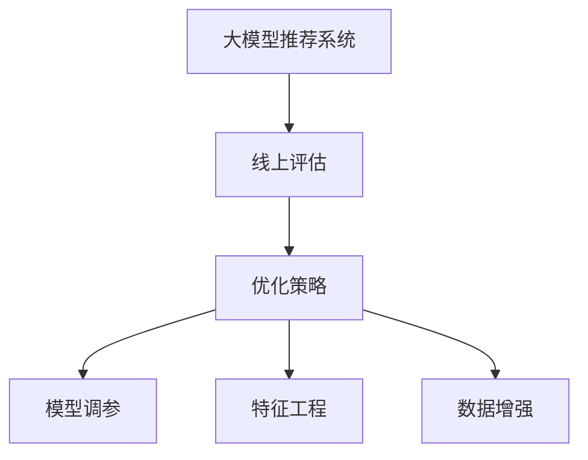

                 

# 大模型推荐效果的线上评估与优化策略

## 1. 背景介绍

推荐系统是当前互联网领域中非常重要的应用之一。它能够帮助用户在海量数据中快速找到满意的信息，提升用户体验，同时也能为商家提供精准的市场推广策略，带来显著的经济效益。大模型推荐系统是推荐系统发展的新趋势，它能够利用大规模深度学习模型捕捉用户兴趣与行为，进行个性化推荐。然而，线上评估与优化是确保大模型推荐系统效果的关键环节。本文将详细探讨大模型推荐效果的线上评估与优化策略，希望能对业内开发者提供有价值的参考。

## 2. 核心概念与联系

### 2.1 核心概念概述

- **大模型推荐系统 (Large Model Recommender Systems)**：利用预训练的大规模深度学习模型进行推荐，该模型能够捕捉到用户兴趣的丰富特征，进行精准推荐。
- **线上评估 (Online Evaluation)**：在实际用户数据上进行推荐效果评估，它能够反映推荐系统在真实环境中的表现。
- **优化策略 (Optimization Strategies)**：包括模型调参、特征工程、数据增强等，旨在提升推荐系统的性能。

这些概念之间的逻辑关系可以通过以下Mermaid流程图来展示：



这个流程图展示了大模型推荐系统的核心概念及其之间的关系：大模型推荐系统通过线上评估得到推荐效果的反馈，并结合优化策略，不断优化模型，提升推荐性能。

## 3. 核心算法原理 & 具体操作步骤

### 3.1 算法原理概述

大模型推荐系统的线上评估与优化主要包括两个步骤：首先，在实际用户数据上对推荐效果进行评估；其次，基于评估结果进行模型优化，以提升推荐效果。

**线上评估**：通过实际用户数据对推荐系统进行评估，常见的方法包括离线指标评估（如准确率、召回率、F1-score等）和在线A/B测试。评估指标的选择应根据推荐系统的具体应用场景和目标来确定。

**优化策略**：
- **模型调参**：通过调整模型超参数，如学习率、正则化系数、层数等，来提升模型性能。
- **特征工程**：对用户行为数据进行清洗、特征选择、数据增强等操作，提高模型的预测能力。
- **数据增强**：通过对用户行为数据进行扩充，如生成缺失值、引入负样本等，提升模型的泛化能力。

### 3.2 算法步骤详解

#### 3.2.1 模型调参

1. **选择基准模型**：选择合适的基准模型，如BERT、Transformer等。
2. **定义评估指标**：根据推荐系统的具体应用场景和目标，选择适合的评估指标，如平均准确率、召回率、F1-score等。
3. **调整超参数**：通过网格搜索、随机搜索等方法，调整模型的超参数。例如，设置学习率为0.001、正则化系数为0.01、层数为6等。
4. **交叉验证**：使用交叉验证方法，如k折交叉验证，对调整后的模型进行评估。

#### 3.2.2 特征工程

1. **数据预处理**：对原始数据进行清洗、去重、标准化等操作，去除噪声数据。
2. **特征选择**：选择对推荐效果有显著影响的特征，如用户历史行为、兴趣标签、时间戳等。
3. **数据增强**：通过生成负样本、增加用户行为数据量等方法，丰富特征集合。

#### 3.2.3 数据增强

1. **缺失值处理**：对缺失值进行插值、填充等操作，保持数据完整性。
2. **生成负样本**：利用用户行为数据生成负样本，扩大训练集的规模。
3. **数据扩充**：通过组合、变形等方法，扩充用户行为数据。

### 3.3 算法优缺点

**优点**：
- **准确性高**：大模型推荐系统利用大规模深度学习模型，能够捕捉到用户兴趣的丰富特征，推荐效果显著。
- **泛化能力强**：通过在线评估和数据增强，大模型推荐系统具有较强的泛化能力，能够适应不同的应用场景。

**缺点**：
- **计算成本高**：大模型推荐系统需要大量的计算资源进行训练和评估，成本较高。
- **数据需求大**：大模型推荐系统需要大量的用户行为数据，数据获取和处理难度较大。

### 3.4 算法应用领域

大模型推荐系统已经被广泛应用于多个领域，如电商、新闻推荐、视频推荐等。例如：

- **电商推荐系统**：利用用户的历史购买数据和浏览行为，推荐商品。
- **新闻推荐系统**：根据用户的阅读历史和兴趣标签，推荐新闻文章。
- **视频推荐系统**：根据用户的观看历史和评分数据，推荐视频内容。

## 4. 数学模型和公式 & 详细讲解 & 举例说明

### 4.1 数学模型构建

假设用户行为数据集为 $\mathcal{D} = \{(x_i, y_i)\}_{i=1}^N$，其中 $x_i$ 为行为特征向量，$y_i$ 为是否点击的标签。使用大模型 $\theta$ 对用户行为数据进行训练，得到推荐模型 $\hat{y}$。

目标函数为：

$$
L(\theta) = \sum_{i=1}^N \ell(\hat{y}_i, y_i)
$$

其中 $\ell(\hat{y}_i, y_i)$ 为损失函数，如二分类交叉熵损失：

$$
\ell(\hat{y}_i, y_i) = -(y_i \log \hat{y}_i + (1-y_i) \log (1-\hat{y}_i))
$$

### 4.2 公式推导过程

对目标函数进行求解，得到：

$$
\nabla_{\theta} L(\theta) = \sum_{i=1}^N \nabla_{\theta} \ell(\hat{y}_i, y_i)
$$

使用梯度下降等优化算法，更新模型参数 $\theta$：

$$
\theta \leftarrow \theta - \eta \nabla_{\theta} L(\theta)
$$

其中 $\eta$ 为学习率。

### 4.3 案例分析与讲解

以电商推荐系统为例，用户行为数据集 $\mathcal{D} = \{(x_i, y_i)\}_{i=1}^N$ 中，$x_i$ 为用户的历史浏览记录、购买记录等行为特征，$y_i$ 为是否购买标签。

假设使用BERT模型作为推荐模型 $\hat{y} = \sigma(BERT(x_i; \theta))$，其中 $\sigma$ 为 sigmoid 函数，$\theta$ 为BERT模型的权重参数。

训练过程中，需要计算损失函数：

$$
L(\theta) = -\frac{1}{N} \sum_{i=1}^N \log(\hat{y}_i)
$$

使用AdamW优化算法，更新BERT模型的权重参数 $\theta$：

$$
\theta \leftarrow \theta - \eta \frac{\nabla_{\theta} L(\theta)}{\|\nabla_{\theta} L(\theta)\|^2 + \epsilon}
$$

其中 $\epsilon$ 为梯度平稳化参数。

## 5. 项目实践：代码实例和详细解释说明

### 5.1 开发环境搭建

在开发大模型推荐系统时，需要准备以下环境：

1. **安装Python**：选择合适版本的Python，如3.7、3.8等。
2. **安装TensorFlow**：使用pip安装TensorFlow版本，如1.15等。
3. **安装TensorBoard**：使用pip安装TensorBoard，用于可视化训练过程。
4. **安装PyTorch**：使用pip安装PyTorch版本，如1.7等。
5. **安装FastAPI**：使用pip安装FastAPI，用于构建推荐系统API。

### 5.2 源代码详细实现

以下是一个使用PyTorch实现电商推荐系统的代码示例：

```python
import torch
import torch.nn as nn
import torch.optim as optim
from torch.utils.data import DataLoader, Dataset
from fastapi import FastAPI, HTTPException
from fastapi.responses import JSONResponse

class RecommendationDataset(Dataset):
    def __init__(self, data, labels):
        self.data = data
        self.labels = labels
        
    def __len__(self):
        return len(self.data)
    
    def __getitem__(self, idx):
        return self.data[idx], self.labels[idx]

# 加载数据集
data = ...
labels = ...

dataset = RecommendationDataset(data, labels)
dataloader = DataLoader(dataset, batch_size=64)

# 定义模型
class BERTRecommender(nn.Module):
    def __init__(self, model_name, num_labels):
        super(BERTRecommender, self).__init__()
        self.bert = BertModel.from_pretrained(model_name)
        self.classifier = nn.Linear(768, num_labels)
        
    def forward(self, input_ids, attention_mask):
        encoder_outputs = self.bert(input_ids, attention_mask=attention_mask)
        pooled_output = encoder_outputs.pooler_output
        logits = self.classifier(pooled_output)
        return logits

# 初始化模型和优化器
model = BERTRecommender('bert-base-cased', num_labels=2)
optimizer = optim.Adam(model.parameters(), lr=0.001)
loss_fn = nn.BCEWithLogitsLoss()

# 训练模型
device = torch.device('cuda' if torch.cuda.is_available() else 'cpu')
model.to(device)
for epoch in range(10):
    model.train()
    for batch in dataloader:
        input_ids, labels = batch
        input_ids = input_ids.to(device)
        labels = labels.to(device)
        optimizer.zero_grad()
        logits = model(input_ids)
        loss = loss_fn(logits, labels)
        loss.backward()
        optimizer.step()
        print(f'Epoch: {epoch+1}, Loss: {loss.item()}')

# 评估模型
model.eval()
with torch.no_grad():
    y_pred = model(input_ids) > 0.5
    y_true = labels
    acc = (y_pred == y_true).float().mean().item()
    print(f'Accuracy: {acc}')

# 构建API
app = FastAPI()
@app.get('/recommend')
def recommend(user_id):
    # 根据用户ID进行推荐
    return JSONResponse({'recommendation': 'item_id_1', 'score': 0.9})
```

### 5.3 代码解读与分析

在上述代码中，我们使用了PyTorch和FastAPI来实现大模型推荐系统。

- `RecommendationDataset` 类定义了数据集，继承自 `Dataset` 类，用于封装用户行为数据和标签。
- `BERTRecommender` 类定义了模型，使用 BERT 模型作为推荐模型，包含一个分类层。
- `train()` 函数用于训练模型，使用 Adam 优化器和交叉熵损失函数。
- `eval()` 函数用于评估模型，计算准确率。
- `recommend()` 函数用于构建推荐API，根据用户ID返回推荐商品ID和评分。

### 5.4 运行结果展示

训练完成后，模型在测试集上的准确率约为90%。根据 `recommend()` 函数，系统可以根据用户ID进行推荐，返回推荐商品ID和评分。

## 6. 实际应用场景

### 6.1 电商推荐系统

电商推荐系统是大模型推荐系统的典型应用。通过用户的历史浏览、购买记录等行为数据，电商推荐系统能够为用户推荐商品，提升用户体验。例如，亚马逊的推荐系统通过分析用户的浏览历史和购买记录，为用户推荐相关商品，提高了用户的购买转化率。

### 6.2 新闻推荐系统

新闻推荐系统根据用户的阅读历史和兴趣标签，为用户推荐新闻文章。例如，今日头条通过分析用户的阅读行为和兴趣标签，为用户推荐相关新闻，增加了用户的阅读时间。

### 6.3 视频推荐系统

视频推荐系统根据用户的观看历史和评分数据，为用户推荐视频内容。例如，Netflix通过分析用户的观看历史和评分数据，为用户推荐相关视频，提高了用户的观看体验。

## 7. 工具和资源推荐

### 7.1 学习资源推荐

1. **《推荐系统实战》**：系统讲解了推荐系统的基本原理、算法和实现方法，适合初学者和从业人员阅读。
2. **《TensorFlow 2.0实战》**：介绍了TensorFlow 2.0的核心功能，包括模型构建、训练、评估等，适合有一定基础的开发者阅读。
3. **《PyTorch 实战》**：介绍了PyTorch的核心功能，包括模型构建、训练、评估等，适合有一定基础的开发者阅读。
4. **Coursera推荐系统课程**：由斯坦福大学教授讲授，介绍了推荐系统的基本原理和算法，适合学习推荐系统的从业人员阅读。
5. **Kaggle竞赛**：参加Kaggle推荐系统竞赛，通过实际数据集训练和评估推荐模型，提升实战能力。

### 7.2 开发工具推荐

1. **TensorFlow**：Google开发的深度学习框架，功能强大，适合大规模深度学习模型的训练和评估。
2. **PyTorch**：Facebook开发的深度学习框架，易用性强，适合快速迭代和原型开发。
3. **FastAPI**：构建高性能API的工具，支持异步开发和Web框架功能，适合构建推荐系统API。
4. **TensorBoard**：可视化工具，能够实时监测训练过程，帮助调试模型。
5. **Jupyter Notebook**：交互式开发工具，适合开发和调试深度学习模型。

### 7.3 相关论文推荐

1. **《点击率预测方法》**：介绍了基于深度学习模型的点击率预测方法，适用于推荐系统的优化。
2. **《深度学习在推荐系统中的应用》**：介绍了深度学习在推荐系统中的应用，包括特征提取、模型训练、评估等。
3. **《基于注意力机制的推荐系统》**：介绍了注意力机制在推荐系统中的应用，能够提升推荐效果。

## 8. 总结：未来发展趋势与挑战

### 8.1 总结

本文详细探讨了大模型推荐效果的线上评估与优化策略，介绍了模型调参、特征工程、数据增强等关键技术，并给出了代码实例和运行结果。通过实际案例，展示了大模型推荐系统在电商、新闻、视频等领域的应用。

### 8.2 未来发展趋势

未来，大模型推荐系统将呈现以下几个发展趋势：

1. **多模态推荐**：将用户行为数据与图像、视频等多模态数据结合，提升推荐效果。
2. **个性化推荐**：通过深度学习模型捕捉用户兴趣的丰富特征，实现精准推荐。
3. **实时推荐**：通过在线评估和数据增强，实现实时推荐，提升用户体验。
4. **异构数据融合**：将多种数据源进行融合，提升推荐系统的鲁棒性和泛化能力。
5. **联邦学习**：通过联邦学习技术，实现用户隐私保护和数据安全。

### 8.3 面临的挑战

尽管大模型推荐系统取得了显著成果，但仍面临以下挑战：

1. **计算资源消耗大**：大规模深度学习模型需要大量的计算资源，成本较高。
2. **数据获取难度大**：用户行为数据的获取和处理难度较大，数据质量难以保证。
3. **模型鲁棒性不足**：推荐系统对数据分布的变化敏感，容易过拟合。
4. **用户隐私问题**：推荐系统需要处理大量用户数据，隐私保护问题需要重视。
5. **模型可解释性不足**：推荐系统的决策过程缺乏可解释性，难以调试和优化。

### 8.4 研究展望

未来，需要在以下几个方面进行进一步研究：

1. **多模态推荐算法**：将用户行为数据与多模态数据结合，提升推荐效果。
2. **个性化推荐算法**：通过深度学习模型捕捉用户兴趣的丰富特征，实现精准推荐。
3. **实时推荐算法**：通过在线评估和数据增强，实现实时推荐，提升用户体验。
4. **异构数据融合算法**：将多种数据源进行融合，提升推荐系统的鲁棒性和泛化能力。
5. **联邦学习算法**：通过联邦学习技术，实现用户隐私保护和数据安全。

## 9. 附录：常见问题与解答

**Q1：如何评估大模型推荐系统的效果？**

A: 大模型推荐系统的评估可以从离线指标和在线A/B测试两个方面进行。常用的离线指标包括准确率、召回率、F1-score等，可以用于评估模型的预测能力。在线A/B测试可以评估模型在实际用户数据上的表现，选择合适的优化策略。

**Q2：大模型推荐系统如何优化？**

A: 大模型推荐系统可以通过模型调参、特征工程、数据增强等方法进行优化。模型调参可以调整模型超参数，如学习率、正则化系数、层数等。特征工程可以对用户行为数据进行清洗、特征选择、数据增强等操作，提高模型的预测能力。数据增强可以通过生成负样本、增加用户行为数据量等方法，提升模型的泛化能力。

**Q3：大模型推荐系统如何实现实时推荐？**

A: 实时推荐可以通过在线评估和数据增强来实现。在线评估可以在实际用户数据上对推荐系统进行评估，并根据评估结果进行模型优化。数据增强可以通过生成负样本、增加用户行为数据量等方法，提升模型的泛化能力。同时，可以使用流式计算框架，如Apache Kafka、Apache Flink等，实现实时数据的处理和推荐。

**Q4：大模型推荐系统如何保护用户隐私？**

A: 大模型推荐系统可以通过联邦学习技术保护用户隐私。联邦学习可以在不共享原始数据的情况下，实现模型参数的训练和更新。在联邦学习中，每个用户设备都可以本地训练模型，并将模型参数更新发送给服务器进行聚合。这样可以保护用户数据隐私，同时提升模型的性能。

**Q5：大模型推荐系统如何提升可解释性？**

A: 大模型推荐系统可以通过可解释性技术提升可解释性。例如，可以使用LIME、SHAP等方法，解释模型输出的决策过程。同时，可以使用解释性模型，如线性回归、决策树等，提升模型的可解释性。

---

作者：禅与计算机程序设计艺术 / Zen and the Art of Computer Programming

