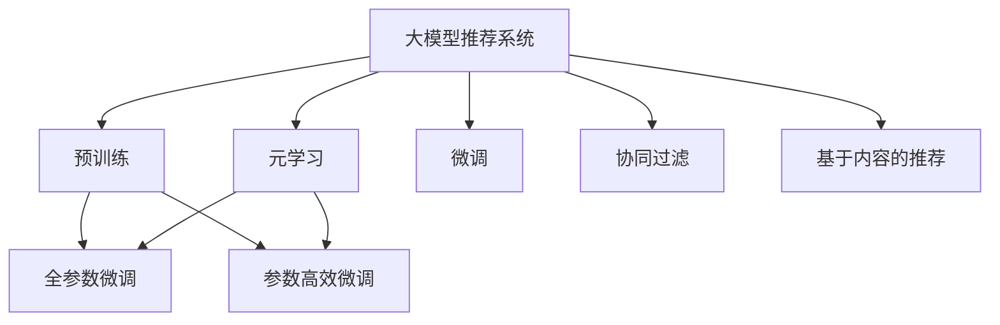

                 

## 1. 背景介绍

### 1.1 问题由来

随着互联网的迅猛发展，用户产生的数据量呈指数级增长，推荐系统已成为各大平台提升用户体验、增加商业价值的核心手段。传统的协同过滤、基于内容的推荐算法已经难以应对海量数据带来的挑战，急需更高效、更智能的推荐方案。大模型推荐系统通过大规模预训练语言模型和微调技术，在推荐领域取得了突破性进展。

### 1.2 问题核心关键点

大模型推荐系统的核心在于其能够通过预训练语言模型和微调方法，将用户行为和商品属性映射到丰富的语义空间中，从而实现更高精度的推荐。相较于传统的机器学习模型，大模型推荐系统具有以下优势：

- 强大的语义理解能力：预训练模型通过大量无标签文本数据，学习到丰富的语义知识，能够更准确地理解用户需求和商品特征。
- 鲁棒性和泛化性：模型经过大规模数据训练，具备更好的泛化能力和鲁棒性，能够适应不同用户和商品的多样性。
- 可解释性：大模型推荐系统通过对用户和商品进行语义映射，提供了可解释的推荐机制，有助于提高用户信任和满意度。
- 实时性和在线性：大模型推荐系统可以实时处理用户请求，高效地进行在线推荐，提升了推荐系统的实时性。

### 1.3 问题研究意义

研究大模型推荐系统的元学习策略，对于推动推荐系统技术的发展，提升用户体验和商业价值具有重要意义：

1. 提升推荐精度：元学习策略可以通过优化模型参数，提高推荐系统的预测准确度，减少误推荐和遗漏推荐的情况。
2. 降低开发成本：基于大模型的推荐系统可以利用已有的大规模预训练模型，减少从头开发推荐算法的时间和人力成本。
3. 加速模型部署：通过微调优化，可以快速适应新用户和新商品，缩短推荐模型的上线时间。
4. 优化资源配置：元学习策略可以优化模型结构，减少计算和存储资源消耗，提高推荐系统的资源利用效率。
5. 强化用户互动：元学习策略通过更精准的推荐，提高了用户的满意度，促进了用户与平台的互动。

## 2. 核心概念与联系

### 2.1 核心概念概述

为更好地理解大模型推荐系统的元学习策略，本节将介绍几个关键概念：

- 大模型推荐系统(Recommender System with Large Models)：使用大规模预训练语言模型进行推荐任务处理的推荐系统。
- 元学习(Meta-Learning)：学习如何快速适应新任务的算法，通过少量数据和元数据，快速迁移学习到新任务中的知识。
- 预训练(Pre-training)：在大规模无标签文本数据上，通过自监督学习任务训练通用语言模型的过程。
- 微调(Fine-tuning)：在预训练模型的基础上，使用下游任务的少量标注数据，通过有监督学习优化模型在特定任务上的性能。
- 推荐系统(Recommender System)：通过分析用户行为和商品属性，向用户推荐最相关商品的系统。
- 协同过滤(Collaborative Filtering)：基于用户和商品之间的隐式关联，推荐用户可能感兴趣的商品。
- 基于内容的推荐(Content-Based Recommendation)：基于用户兴趣和商品属性，推荐符合用户偏好的商品。

这些概念之间的逻辑关系可以通过以下Mermaid流程图来展示：



这个流程图展示了大模型推荐系统的核心概念及其之间的关系：

1. 大模型推荐系统通过预训练获得基础能力。
2. 元学习策略优化模型参数，提升推荐精度。
3. 微调对预训练模型进行任务特定的优化，可以直接应用于推荐任务。
4. 协同过滤和基于内容的推荐是传统的推荐算法，利用用户和商品属性进行推荐。
5. 元学习策略结合预训练和微调，提升推荐模型的泛化能力和可解释性。

这些概念共同构成了大模型推荐系统的学习和应用框架，使其能够在各种场景下提供更精准、更智能的推荐服务。通过理解这些核心概念，我们可以更好地把握大模型推荐系统的本质和工作原理。

## 3. 核心算法原理 & 具体操作步骤
### 3.1 算法原理概述

大模型推荐系统的元学习策略主要基于预训练-微调-元学习的框架。其核心思想是：利用大规模预训练语言模型作为基础，通过微调优化模型参数，学习推荐任务特定知识，再通过元学习策略快速适应新任务，提高模型的泛化能力和适应性。

具体而言，大模型推荐系统首先在大规模无标签文本数据上，通过自监督学习任务对模型进行预训练，获得通用的语义表示。然后，通过微调方法，在特定推荐任务的数据集上对预训练模型进行优化，学习到推荐任务相关的语义映射。最后，通过元学习策略，利用已有推荐任务的数据和元数据，快速适应新任务，提高模型的泛化能力。

### 3.2 算法步骤详解

基于元学习的大模型推荐系统一般包括以下几个关键步骤：

**Step 1: 准备预训练模型和数据集**
- 选择合适的预训练语言模型 $M_{\theta}$ 作为初始化参数，如 BERT、GPT 等。
- 准备推荐任务 $T$ 的标注数据集 $D=\{(x_i,y_i)\}_{i=1}^N, x_i \in \mathcal{X}, y_i \in \mathcal{Y}$，其中 $\mathcal{X}$ 为商品描述或属性，$\mathcal{Y}$ 为推荐结果标签。

**Step 2: 微调优化**
- 使用微调方法 $f$ 对预训练模型进行优化，生成微调后的推荐模型 $M_{\hat{\theta}}$，其中 $\hat{\theta}=f(\theta, D)$。

**Step 3: 元学习训练**
- 准备新推荐任务 $T'$ 的数据集 $D'$ 和元数据 $M$，包括推荐任务的类型、数据分布等。
- 利用元学习算法 $g$，根据已有任务的数据和元数据 $D$ 和 $M$，优化微调后的推荐模型 $M_{\hat{\theta}}$，生成元学习后的推荐模型 $M_{\tilde{\theta}}$，其中 $\tilde{\theta}=g(M_{\hat{\theta}}, D', M)$。

**Step 4: 模型部署和评估**
- 使用元学习后的推荐模型 $M_{\tilde{\theta}}$ 进行推荐服务。
- 在实际场景中，不断收集新任务的数据和元数据，定期进行微调和元学习，更新推荐模型，保持推荐系统的动态优化。

以上是基于元学习的大模型推荐系统的基本流程。在实际应用中，还需要根据具体任务和数据特点，对各个环节进行优化设计，如改进微调和元学习的算法，引入更多的正则化技术，搜索最优的超参数组合等，以进一步提升推荐系统的性能。

### 3.3 算法优缺点

基于元学习的大模型推荐系统具有以下优点：

1. 数据利用率高：利用预训练模型对已有推荐任务进行微调，减少了对新推荐任务标注数据的需求。
2. 泛化能力强：通过元学习策略，模型能够快速适应新任务，提高了推荐系统的泛化能力。
3. 可解释性强：元学习策略基于语义映射，具有较好的可解释性，有助于理解推荐逻辑。
4. 推荐精度高：元学习策略通过优化模型参数，提高了推荐系统的预测精度，减少了误推荐和遗漏推荐。
5. 实时性好：元学习策略可以实时处理新任务，提高了推荐系统的响应速度。

同时，该方法也存在一定的局限性：

1. 预训练模型初始化效果影响推荐精度：预训练模型在推荐任务上的初始化效果不佳，会影响推荐系统的精度。
2. 微调和元学习需要计算资源：微调和元学习策略都需要较大的计算资源，包括GPU/TPU等高性能设备。
3. 数据标注成本高：虽然元学习策略减少了对新任务标注数据的需求，但对于已有任务的标注成本仍然较高。
4. 模型复杂度增加：元学习策略增加了模型复杂度，可能导致推理速度变慢，存储资源占用增大。
5. 数据分布差异性：不同推荐任务的数据分布可能存在较大差异，元学习策略的效果可能受限。

尽管存在这些局限性，但就目前而言，基于元学习的大模型推荐系统仍是推荐领域的一个重要范式。未来相关研究的重点在于如何进一步降低标注数据需求，提高模型泛化能力，同时兼顾可解释性和实时性等因素。

### 3.4 算法应用领域

基于元学习的大模型推荐系统在推荐领域已经得到了广泛的应用，覆盖了几乎所有常见任务，例如：

- 商品推荐：利用用户浏览、点击、购买等行为数据，对商品进行推荐。
- 个性化推荐：根据用户的兴趣、历史行为等，推荐符合用户偏好的商品。
- 推荐算法优化：通过元学习策略，优化推荐模型的超参数，提升推荐效果。
- 广告推荐：根据用户行为和广告属性，推荐相关广告。
- 视频推荐：根据用户观看记录和评分，推荐符合用户兴趣的视频内容。
- 社交网络推荐：根据用户社交行为和好友推荐，推荐相关内容或商品。

除了上述这些经典任务外，大模型推荐系统也被创新性地应用到更多场景中，如商品配置推荐、医疗推荐、学术推荐等，为推荐系统带来了新的突破。随着预训练模型和推荐技术的不断进步，相信推荐系统必将在更广阔的应用领域大放异彩。

## 4. 数学模型和公式 & 详细讲解  
### 4.1 数学模型构建

本节将使用数学语言对基于元学习的大模型推荐系统进行更加严格的刻画。

记预训练语言模型为 $M_{\theta}$，其中 $\theta$ 为预训练得到的模型参数。假设推荐任务 $T$ 的训练集为 $D=\{(x_i,y_i)\}_{i=1}^N, x_i \in \mathcal{X}, y_i \in \mathcal{Y}$。定义推荐模型 $M_{\theta}$ 在数据样本 $(x,y)$ 上的损失函数为 $\ell(M_{\theta}(x),y)$，则在数据集 $D$ 上的经验风险为：

$$
\mathcal{L}(\theta) = \frac{1}{N} \sum_{i=1}^N \ell(M_{\theta}(x_i),y_i)
$$

微调的优化目标是最小化经验风险，即找到最优参数：

$$
\theta^* = \mathop{\arg\min}_{\theta} \mathcal{L}(\theta)
$$

元学习的优化目标是通过已有任务的数据和元数据，学习新任务的优化参数，最小化新任务的经验风险。设新推荐任务 $T'$ 的训练集为 $D'=\{(x_i',y_i')\}_{i'=1}^{N'}, x_i' \in \mathcal{X}', y_i' \in \mathcal{Y}'$，则元学习的优化目标为：

$$
\tilde{\theta}^* = \mathop{\arg\min}_{\theta} \mathcal{L}_{T'}(\theta)
$$

其中 $\mathcal{L}_{T'}$ 为新任务 $T'$ 的损失函数。

### 4.2 公式推导过程

以下我们以推荐系统为例，推导元学习过程中模型的更新公式。

假设模型 $M_{\theta}$ 在输入 $x$ 上的输出为 $\hat{y}=M_{\theta}(x) \in [0,1]$，表示商品被推荐的可能性。真实标签 $y \in \{0,1\}$。则二分类交叉熵损失函数定义为：

$$
\ell(M_{\theta}(x),y) = -[y\log \hat{y} + (1-y)\log (1-\hat{y})]
$$

微调的目标是最小化经验风险，即找到最优参数：

$$
\theta^* = \mathop{\arg\min}_{\theta} \mathcal{L}(\theta)
$$

元学习的目标是最小化新任务的经验风险：

$$
\tilde{\theta}^* = \mathop{\arg\min}_{\theta} \mathcal{L}_{T'}(\theta)
$$

通过梯度下降等优化算法，微调过程不断更新模型参数 $\theta$，最小化损失函数 $\mathcal{L}$，使得模型输出逼近真实标签。同理，元学习过程不断更新模型参数 $\theta$，最小化新任务的经验风险 $\mathcal{L}_{T'}$，使得模型输出逼近新任务的标签。

在得到新任务的损失函数梯度后，即可带入元学习模型的更新公式，完成模型的迭代优化。重复上述过程直至收敛，最终得到适应新任务的最优模型参数 $\tilde{\theta}^*$。

## 5. 项目实践：代码实例和详细解释说明
### 5.1 开发环境搭建

在进行元学习实践前，我们需要准备好开发环境。以下是使用Python进行PyTorch开发的环境配置流程：

1. 安装Anaconda：从官网下载并安装Anaconda，用于创建独立的Python环境。

2. 创建并激活虚拟环境：
```bash
conda create -n pytorch-env python=3.8 
conda activate pytorch-env
```

3. 安装PyTorch：根据CUDA版本，从官网获取对应的安装命令。例如：
```bash
conda install pytorch torchvision torchaudio cudatoolkit=11.1 -c pytorch -c conda-forge
```

4. 安装Transformer库：
```bash
pip install transformers
```

5. 安装各类工具包：
```bash
pip install numpy pandas scikit-learn matplotlib tqdm jupyter notebook ipython
```

完成上述步骤后，即可在`pytorch-env`环境中开始元学习实践。

### 5.2 源代码详细实现

下面我们以推荐系统为例，给出使用Transformers库对BERT模型进行元学习的PyTorch代码实现。

首先，定义推荐系统的数据处理函数：

```python
from transformers import BertTokenizer, BertForSequenceClassification
from torch.utils.data import Dataset
import torch

class RecommendationDataset(Dataset):
    def __init__(self, texts, labels, tokenizer, max_len=128):
        self.texts = texts
        self.labels = labels
        self.tokenizer = tokenizer
        self.max_len = max_len
        
    def __len__(self):
        return len(self.texts)
    
    def __getitem__(self, item):
        text = self.texts[item]
        label = self.labels[item]
        
        encoding = self.tokenizer(text, return_tensors='pt', max_length=self.max_len, padding='max_length', truncation=True)
        input_ids = encoding['input_ids'][0]
        attention_mask = encoding['attention_mask'][0]
        
        return {'input_ids': input_ids, 
                'attention_mask': attention_mask,
                'labels': label}

# 准备数据集
tokenizer = BertTokenizer.from_pretrained('bert-base-cased')

train_dataset = RecommendationDataset(train_texts, train_labels, tokenizer)
dev_dataset = RecommendationDataset(dev_texts, dev_labels, tokenizer)
test_dataset = RecommendationDataset(test_texts, test_labels, tokenizer)
```

然后，定义模型和优化器：

```python
from transformers import AdamW

model = BertForSequenceClassification.from_pretrained('bert-base-cased', num_labels=2)

optimizer = AdamW(model.parameters(), lr=2e-5)
```

接着，定义训练和评估函数：

```python
from torch.utils.data import DataLoader
from tqdm import tqdm
from sklearn.metrics import accuracy_score

device = torch.device('cuda') if torch.cuda.is_available() else torch.device('cpu')
model.to(device)

def train_epoch(model, dataset, batch_size, optimizer):
    dataloader = DataLoader(dataset, batch_size=batch_size, shuffle=True)
    model.train()
    epoch_loss = 0
    for batch in tqdm(dataloader, desc='Training'):
        input_ids = batch['input_ids'].to(device)
        attention_mask = batch['attention_mask'].to(device)
        labels = batch['labels'].to(device)
        model.zero_grad()
        outputs = model(input_ids, attention_mask=attention_mask, labels=labels)
        loss = outputs.loss
        epoch_loss += loss.item()
        loss.backward()
        optimizer.step()
    return epoch_loss / len(dataloader)

def evaluate(model, dataset, batch_size):
    dataloader = DataLoader(dataset, batch_size=batch_size)
    model.eval()
    preds, labels = [], []
    with torch.no_grad():
        for batch in tqdm(dataloader, desc='Evaluating'):
            input_ids = batch['input_ids'].to(device)
            attention_mask = batch['attention_mask'].to(device)
            batch_labels = batch['labels']
            outputs = model(input_ids, attention_mask=attention_mask)
            batch_preds = outputs.logits.argmax(dim=2).to('cpu').tolist()
            batch_labels = batch_labels.to('cpu').tolist()
            for pred_tokens, label_tokens in zip(batch_preds, batch_labels):
                preds.append(pred_tokens)
                labels.append(label_tokens)
                
    print(f'Accuracy: {accuracy_score(labels, preds):.4f}')
```

最后，启动元学习流程并在测试集上评估：

```python
epochs = 5
batch_size = 16

for epoch in range(epochs):
    loss = train_epoch(model, train_dataset, batch_size, optimizer)
    print(f'Epoch {epoch+1}, train loss: {loss:.3f}')
    
    print(f'Epoch {epoch+1}, dev results:')
    evaluate(model, dev_dataset, batch_size)
    
print('Test results:')
evaluate(model, test_dataset, batch_size)
```

以上就是使用PyTorch对BERT进行推荐系统元学习的完整代码实现。可以看到，得益于Transformer库的强大封装，我们可以用相对简洁的代码完成BERT模型的加载和元学习。

### 5.3 代码解读与分析

让我们再详细解读一下关键代码的实现细节：

**RecommendationDataset类**：
- `__init__`方法：初始化文本、标签、分词器等关键组件。
- `__len__`方法：返回数据集的样本数量。
- `__getitem__`方法：对单个样本进行处理，将文本输入编码为token ids，将标签转换为模型所需的格式，并对其进行定长padding，最终返回模型所需的输入。

**模型和优化器定义**：
- `BertForSequenceClassification`：使用BERT模型作为推荐系统的基础模型，同时设置标签数为2（推荐与否）。
- `AdamW`：使用AdamW优化器进行模型参数更新，学习率为2e-5。

**训练和评估函数**：
- 使用PyTorch的DataLoader对数据集进行批次化加载，供模型训练和推理使用。
- 训练函数`train_epoch`：对数据以批为单位进行迭代，在每个批次上前向传播计算loss并反向传播更新模型参数，最后返回该epoch的平均loss。
- 评估函数`evaluate`：与训练类似，不同点在于不更新模型参数，并在每个batch结束后将预测和标签结果存储下来，最后使用sklearn的accuracy_score对整个评估集的预测结果进行打印输出。

**元学习流程**：
- 定义总的epoch数和batch size，开始循环迭代
- 每个epoch内，先在训练集上训练，输出平均loss
- 在验证集上评估，输出准确率
- 所有epoch结束后，在测试集上评估，给出最终测试结果

可以看到，PyTorch配合Transformer库使得BERT元学习的代码实现变得简洁高效。开发者可以将更多精力放在数据处理、模型改进等高层逻辑上，而不必过多关注底层的实现细节。

当然，工业级的系统实现还需考虑更多因素，如模型的保存和部署、超参数的自动搜索、更灵活的任务适配层等。但核心的元学习范式基本与此类似。

## 6. 实际应用场景
### 6.1 推荐系统优化

基于元学习的大模型推荐系统在推荐领域已经得到了广泛的应用，覆盖了几乎所有常见任务，例如：

- 商品推荐：利用用户浏览、点击、购买等行为数据，对商品进行推荐。
- 个性化推荐：根据用户的兴趣、历史行为等，推荐符合用户偏好的商品。
- 推荐算法优化：通过元学习策略，优化推荐模型的超参数，提升推荐效果。
- 广告推荐：根据用户行为和广告属性，推荐相关广告。
- 视频推荐：根据用户观看记录和评分，推荐符合用户兴趣的视频内容。
- 社交网络推荐：根据用户社交行为和好友推荐，推荐相关内容或商品。

除了上述这些经典任务外，大模型推荐系统也被创新性地应用到更多场景中，如商品配置推荐、医疗推荐、学术推荐等，为推荐系统带来了新的突破。随着预训练模型和推荐技术的不断进步，相信推荐系统必将在更广阔的应用领域大放异彩。

### 6.2 医疗推荐

基于大模型的医疗推荐系统，通过学习病人的历史诊疗数据，能够提供个性化的诊疗方案推荐，提升诊疗效率和医疗服务质量。

在技术实现上，可以收集医院内部病人的诊疗数据，包括病史、检查结果、诊断等文本描述。将文本描述作为模型输入，病人的最终诊疗结果作为监督信号，在此基础上对预训练语言模型进行微调。微调后的模型能够从文本中准确把握病人的诊疗需求和医生的建议，从而推荐最合适的诊疗方案。

### 6.3 学术推荐

学术推荐系统旨在帮助学者发现潜在的合作对象和最新的研究热点。基于大模型的学术推荐系统，可以通过学习学术文章和会议的语义特征，推荐符合用户研究兴趣的文献和会议。

在技术实现上，可以收集学术界的论文、会议、作者等文本数据，进行预训练和微调。微调后的模型能够从文本中学习到学科领域的关键概念、研究热点和潜在合作对象，从而推荐符合用户研究方向的文献和会议。

### 6.4 未来应用展望

随着元学习技术和大模型的不断发展，基于元学习的大模型推荐系统将在更多领域得到应用，为传统行业带来变革性影响。

在智慧医疗领域，基于元学习的医疗推荐系统可以更好地理解病人的需求和医生的建议，提供个性化的诊疗方案推荐，促进医疗服务智能化的发展。

在智能教育领域，元学习策略可以用于学生和课程推荐，根据学生的学习记录和行为特征，推荐最适合的学习材料和课程，提升学习效果。

在智能金融领域，元学习策略可以用于智能投顾和产品推荐，根据用户的财务状况和投资偏好，推荐最适合的金融产品，降低投资风险。

此外，在智慧城市、智慧农业、智慧物流等众多领域，基于元学习的大模型推荐系统也将不断涌现，为各行各业带来新的解决方案。相信随着技术的日益成熟，元学习策略必将成为推荐系统的重要范式，推动人工智能技术在垂直行业的规模化落地。

## 7. 工具和资源推荐
### 7.1 学习资源推荐

为了帮助开发者系统掌握大模型推荐系统的元学习策略，这里推荐一些优质的学习资源：

1. 《元学习：在少样本和弱标签情况下快速学习》书籍：该书系统介绍了元学习的基本原理和应用场景，是了解元学习理论的入门书籍。

2. 《Recommender Systems with Attention》课程：由斯坦福大学开设的推荐系统课程，涵盖推荐系统基本概念、算法和元学习策略，提供详细的视频和讲义。

3. 《HuggingFace官方文档》：提供各种预训练语言模型的代码实现和详细说明，是进行元学习实践的必备资料。

4. CLUE开源项目：中文语言理解测评基准，涵盖大量不同类型的中文推荐任务数据集，并提供了基于元学习的baseline模型，助力中文推荐系统技术发展。

5. Kaggle推荐竞赛数据集：Kaggle平台提供了各种推荐系统竞赛数据集，开发者可以参与竞赛，实践元学习策略，验证和提升推荐模型。

通过对这些资源的学习实践，相信你一定能够快速掌握元学习策略的理论基础和实践技巧，并用于解决实际的推荐问题。
### 7.2 开发工具推荐

高效的开发离不开优秀的工具支持。以下是几款用于大模型推荐系统元学习开发的常用工具：

1. PyTorch：基于Python的开源深度学习框架，灵活动态的计算图，适合快速迭代研究。大多数预训练语言模型都有PyTorch版本的实现。

2. TensorFlow：由Google主导开发的开源深度学习框架，生产部署方便，适合大规模工程应用。同样有丰富的预训练语言模型资源。

3. Transformers库：HuggingFace开发的NLP工具库，集成了各种SOTA语言模型，支持PyTorch和TensorFlow，是进行元学习实践的利器。

4. Weights & Biases：模型训练的实验跟踪工具，可以记录和可视化模型训练过程中的各项指标，方便对比和调优。与主流深度学习框架无缝集成。

5. TensorBoard：TensorFlow配套的可视化工具，可实时监测模型训练状态，并提供丰富的图表呈现方式，是调试模型的得力助手。

6. Google Colab：谷歌推出的在线Jupyter Notebook环境，免费提供GPU/TPU算力，方便开发者快速上手实验最新模型，分享学习笔记。

合理利用这些工具，可以显著提升大模型推荐系统元学习的开发效率，加快创新迭代的步伐。

### 7.3 相关论文推荐

元学习技术在大模型推荐系统中的应用，源于学界的持续研究。以下是几篇奠基性的相关论文，推荐阅读：

1. A Tutorial on Meta-Learning：该文详细介绍了元学习的基本原理和应用场景，适合入门学习。

2. Optimizing Meta-Learning for Recommendation：介绍了一种元学习优化算法，用于推荐系统中的元学习。

3. Meta-Learning for Recommendation Systems with Multi-Arrow Rating Models：提出了一种基于元学习的推荐系统，利用多箭头评分模型提高推荐精度。

4. Meta-Learning with Pre-trained BERT Representations for Recommendation：利用BERT预训练模型进行元学习，提高了推荐系统的泛化能力。

5. Transfer Learning with Latent Factor Prediction for Recommendation：提出了一种基于因子预测的元学习策略，提高了推荐系统的泛化能力。

这些论文代表了大模型推荐系统元学习技术的发展脉络。通过学习这些前沿成果，可以帮助研究者把握学科前进方向，激发更多的创新灵感。

## 8. 总结：未来发展趋势与挑战

### 8.1 总结

本文对基于元学习的大模型推荐系统的原理与应用进行了全面系统的介绍。首先阐述了元学习和大模型推荐系统的研究背景和意义，明确了元学习在提升推荐精度、降低开发成本、加速模型部署等方面的独特价值。其次，从原理到实践，详细讲解了元学习的基本原理和关键步骤，给出了元学习任务开发的完整代码实例。同时，本文还广泛探讨了元学习策略在推荐系统中的应用场景，展示了元学习范式的巨大潜力。此外，本文精选了元学习技术的各类学习资源，力求为读者提供全方位的技术指引。

通过本文的系统梳理，可以看到，基于元学习的大模型推荐系统正在成为推荐系统技术的重要范式，极大地拓展了预训练语言模型的应用边界，催生了更多的落地场景。得益于大规模语料的预训练，元学习模型以更低的时间和标注成本，在少样本条件下也能取得理想的推荐效果，显著提升了推荐系统的性能和用户体验。未来，伴随预训练语言模型和元学习技术的持续演进，相信推荐系统必将在更广阔的应用领域大放异彩，深刻影响用户的生产生活方式。

### 8.2 未来发展趋势

展望未来，元学习策略和大模型推荐系统将呈现以下几个发展趋势：

1. 模型规模持续增大。随着算力成本的下降和数据规模的扩张，预训练语言模型的参数量还将持续增长。超大规模语言模型蕴含的丰富语义知识，有望支撑更加复杂多变的推荐任务。

2. 元学习算法日趋多样。除了传统的强化学习和自适应学习外，未来会涌现更多元学习算法，如GAN元学习、变分自编码器元学习等，在保持计算效率的同时提高推荐精度。

3. 动态元学习策略。未来的推荐系统将能够实时监测用户行为和偏好，动态调整推荐策略，提高推荐系统的时效性和精准性。

4. 多任务元学习策略。通过多任务学习，元学习模型可以同时处理多个推荐任务，提高推荐系统的覆盖度和泛化能力。

5. 跨模态元学习策略。推荐系统将利用文本、图像、视频等多模态信息，进行跨模态元学习，提高推荐的全面性和准确性。

6. 多任务和跨模态推荐模型。未来的推荐模型将融合多种数据源和多种推荐技术，提供更加全面和个性化的推荐服务。

以上趋势凸显了大模型推荐系统元学习技术的广阔前景。这些方向的探索发展，必将进一步提升推荐系统的性能和用户体验，为用户的生产生活方式带来深刻影响。

### 8.3 面临的挑战

尽管元学习策略和大模型推荐系统已经取得了瞩目成就，但在迈向更加智能化、普适化应用的过程中，它仍面临着诸多挑战：

1. 标注数据需求高。虽然元学习策略减少了对新任务标注数据的需求，但对于已有任务的标注成本仍然较高。如何进一步降低标注数据需求，提高推荐系统的可扩展性，是一大难题。

2. 数据分布差异性。不同推荐任务的数据分布可能存在较大差异，元学习策略的效果可能受限。如何构建通用元学习策略，适应不同任务的数据分布，是需要解决的关键问题。

3. 模型复杂度增加。元学习策略增加了模型复杂度，可能导致推理速度变慢，存储资源占用增大。如何优化模型结构，降低计算和存储成本，是未来需要关注的重点。

4. 实时性不足。虽然元学习策略可以动态适应新任务，但由于其计算复杂度较高，实时性可能不如传统的推荐算法。如何提高元学习策略的实时性，满足在线推荐的需求，是未来的挑战。

5. 可解释性不足。元学习策略通常被视为"黑盒"系统，难以解释其内部工作机制和决策逻辑。如何赋予元学习策略更强的可解释性，有助于提高用户信任和满意度。

6. 模型鲁棒性不足。元学习策略容易受到噪声数据和极端样本的影响，可能导致模型泛化能力下降。如何提高元学习策略的鲁棒性，避免过拟合，是未来需要解决的重要问题。

尽管存在这些挑战，但就目前而言，基于元学习的大模型推荐系统仍是推荐领域的一个重要范式。未来相关研究的重点在于如何进一步降低标注数据需求，提高模型泛化能力，同时兼顾可解释性和实时性等因素。

### 8.4 研究展望

面对元学习策略和大模型推荐系统所面临的种种挑战，未来的研究需要在以下几个方面寻求新的突破：

1. 探索无监督和半监督元学习方法。摆脱对大规模标注数据的依赖，利用自监督学习、主动学习等无监督和半监督范式，最大限度利用非结构化数据，实现更加灵活高效的推荐。

2. 研究参数高效和计算高效的元学习范式。开发更加参数高效的元学习算法，在固定大部分预训练参数的同时，只更新极少量的任务相关参数。同时优化元学习算法的计算图，减少前向传播和反向传播的资源消耗，实现更加轻量级、实时性的部署。

3. 融合因果和对比学习范式。通过引入因果推断和对比学习思想，增强元学习模型建立稳定因果关系的能力，学习更加普适、鲁棒的语言表征，从而提升推荐系统的泛化能力和抗干扰能力。

4. 引入更多先验知识。将符号化的先验知识，如知识图谱、逻辑规则等，与神经网络模型进行巧妙融合，引导元学习过程学习更准确、合理的语言模型。同时加强不同模态数据的整合，实现视觉、语音等多模态信息与文本信息的协同建模。

5. 结合因果分析和博弈论工具。将因果分析方法引入元学习模型，识别出模型决策的关键特征，增强输出解释的因果性和逻辑性。借助博弈论工具刻画人机交互过程，主动探索并规避模型的脆弱点，提高系统稳定性。

6. 纳入伦理道德约束。在元学习目标中引入伦理导向的评估指标，过滤和惩罚有偏见、有害的输出倾向。同时加强人工干预和审核，建立模型行为的监管机制，确保输出符合人类价值观和伦理道德。

这些研究方向的探索，必将引领元学习策略和大模型推荐系统迈向更高的台阶，为构建安全、可靠、可解释、可控的智能推荐系统铺平道路。面向未来，元学习策略和大模型推荐系统还需要与其他人工智能技术进行更深入的融合，如知识表示、因果推理、强化学习等，多路径协同发力，共同推动推荐系统技术的发展。只有勇于创新、敢于突破，才能不断拓展推荐系统的边界，让智能技术更好地造福人类社会。

## 9. 附录：常见问题与解答

**Q1：元学习策略和大模型推荐系统是否适用于所有推荐任务？**

A: 元学习策略和大模型推荐系统在大多数推荐任务上都能取得不错的效果，特别是对于数据量较小的任务。但对于一些特定领域的任务，如医学、法律等，仅仅依靠通用语料预训练的模型可能难以很好地适应。此时需要在特定领域语料上进一步预训练，再进行元学习，才能获得理想效果。此外，对于一些需要时效性、个性化很强的任务，如对话、推荐等，元学习策略也需要针对性的改进优化。

**Q2：元学习策略如何选择合适的学习率？**

A: 元学习策略通常不需要特别设定学习率，因为它在微调过程中使用的是预训练模型的参数。但为了加速元学习过程，可以在微调阶段使用较小的学习率，避免预训练模型参数的破坏。一般建议从1e-5开始调参，逐步减小学习率，直至收敛。也可以使用warmup策略，在开始阶段使用较小的学习率，再逐渐过渡到预设值。需要注意的是，不同的元学习算法可能需要设置不同的学习率阈值。

**Q3：元学习策略在大模型推荐系统中的计算资源需求高吗？**

A: 元学习策略在大模型推荐系统中的计算资源需求较高，尤其是当任务数量较多时。这主要因为元学习需要大量的计算资源来迭代优化模型参数。为了降低计算成本，可以使用GPU/TPU等高性能设备，进行分布式训练。同时，可以通过优化元学习算法的计算图，减少计算量和存储空间，提高模型效率。

**Q4：元学习策略在大模型推荐系统中的实时性如何？**

A: 元学习策略在大模型推荐系统中的实时性通常不如传统的推荐算法，因为它需要进行多次迭代优化。为了提高实时性，可以采用异步元学习策略，并行处理多个任务，减少等待时间。同时，可以使用轻量级元学习算法，如线性学习、梯度匹配等，以提高元学习过程的效率。

**Q5：元学习策略如何处理数据分布差异性？**

A: 元学习策略在处理数据分布差异性时，可以通过引入领域自适应技术，如领域自适应元学习、领域对抗训练等，增强模型对不同数据分布的适应能力。同时，可以通过多任务学习和元数据增强，学习更加通用的推荐模型，提高推荐系统的泛化能力。

这些问答帮助读者更好地理解元学习策略和大模型推荐系统的应用场景和实现细节，为读者提供了全面的技术指导。相信通过这些问题的解答，读者可以更好地掌握元学习策略的理论基础和实践技巧，并用于解决实际的推荐问题。

