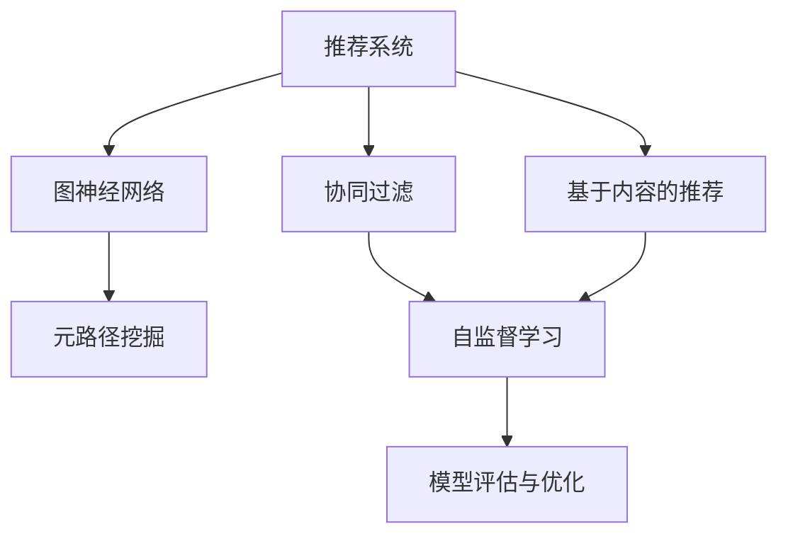

                 

# 大模型推荐系统的元路径挖掘方法

> 关键词：推荐系统, 元路径, 用户行为数据, 图神经网络, 深度学习, 模型评估与优化

## 1. 背景介绍

### 1.1 问题由来
在互联网时代，个性化推荐已成为提高用户满意度、增加用户粘性和促进业务增长的重要手段。从电商平台的商品推荐、视频网站的影片推荐，到社交媒体的内容推荐，推荐系统（Recommendation System, RS）已经渗透到我们生活的方方面面。

推荐系统的核心目标是通过对用户历史行为数据的分析，预测用户未来可能感兴趣的商品、内容或服务，并动态调整推荐策略，以实现个性化推荐。在早期，推荐系统主要基于协同过滤（Collaborative Filtering, CF）或基于内容的推荐（Content-based Recommendation, CBR），然而，这些方法在处理大规模数据、长尾商品推荐、用户冷启动等问题时，存在诸多限制。

近年来，基于深度学习的推荐方法逐渐兴起，通过引入神经网络模型，实现了更精确的用户兴趣建模和推荐。然而，随着数据量和复杂度的不断增加，深度学习模型的计算需求也急剧上升，模型训练和推理的效率问题亟待解决。

### 1.2 问题核心关键点
针对现有推荐系统的局限性，本文提出了一种基于元路径（Path-based）的推荐模型。其核心思想是：从用户行为数据中挖掘出对用户兴趣和行为影响显著的元路径（Path-based Features），利用图神经网络（Graph Neural Network, GNN）模型对这些元路径进行编码，从而实现高效且个性化的推荐。

元路径挖掘方法的关键在于以下几个方面：

- **数据建模**：如何将用户行为数据转化为图结构，建立用户与物品之间的关系网络。
- **特征提取**：如何从图结构中提取对用户兴趣影响最大的元路径。
- **模型表示**：如何将元路径转化为模型中的高阶特征，用于推荐模型的训练和推理。

本文将重点阐述这些核心关键点，并通过实验验证元路径挖掘方法的有效性。

## 2. 核心概念与联系

### 2.1 核心概念概述

为更好地理解基于元路径的推荐模型，本节将介绍几个密切相关的核心概念：

- **推荐系统（Recommendation System, RS）**：通过分析用户历史行为数据，预测用户未来的兴趣和需求，推荐其可能感兴趣的商品、内容或服务。
- **协同过滤（Collaborative Filtering, CF）**：通过用户-物品的协同关系，预测用户对新物品的评分。
- **基于内容的推荐（Content-based Recommendation, CBR）**：根据物品的特征和用户的历史偏好，推荐相似的物品。
- **图神经网络（Graph Neural Network, GNN）**：通过图结构对节点和边进行特征编码，实现图数据的深度学习。
- **元路径（Path-based Features）**：从图结构中挖掘出对用户兴趣和行为影响显著的路径。
- **自监督学习（Self-supervised Learning）**：利用未标注数据进行学习，提高模型的泛化能力和鲁棒性。

这些核心概念之间的逻辑关系可以通过以下Mermaid流程图来展示：



这个流程图展示了几类推荐方法的联系和区别：

1. 推荐系统通过CF和CBR方法获取用户兴趣，并使用GNN模型对这些兴趣进行编码。
2. GNN模型在挖掘元路径特征时，也利用了自监督学习的方法，提升模型的泛化能力。
3. 最终，元路径挖掘方法得到的特征用于模型训练和优化，以实现高效且个性化的推荐。

## 3. 核心算法原理 & 具体操作步骤
### 3.1 算法原理概述

基于元路径的推荐模型，其核心算法流程包括数据预处理、元路径挖掘、图神经网络编码和模型评估与优化。下面将详细介绍每个步骤的原理和操作步骤。

### 3.2 算法步骤详解

#### 3.2.1 数据预处理
数据预处理是推荐系统的第一步，主要涉及以下几个方面：

1. **数据采集**：收集用户的历史行为数据，包括浏览、点击、购买、评分等行为记录。
2. **数据清洗**：去除数据中的噪声和异常值，确保数据的完整性和一致性。
3. **用户和物品表示**：将用户和物品表示为图中的节点，通过共现关系建立图结构。

#### 3.2.2 元路径挖掘
元路径挖掘是从图结构中提取对用户兴趣和行为影响显著的路径。具体步骤如下：

1. **图结构构建**：将用户行为数据转化为图结构，节点表示用户和物品，边表示用户的交互行为。
2. **路径生成**：从图结构中生成所有可能的路径，包括单边路径、双边路径、多边路径等。
3. **特征提取**：对生成的路径进行统计分析，提取对用户兴趣影响最大的特征。

#### 3.2.3 图神经网络编码
图神经网络编码是将元路径转化为模型中的高阶特征，具体步骤如下：

1. **节点嵌入**：使用GNN模型对图中的节点进行特征编码，生成节点嵌入向量。
2. **路径嵌入**：利用节点嵌入向量，对生成的路径进行特征编码，生成路径嵌入向量。
3. **特征融合**：将路径嵌入向量与用户历史行为数据进行融合，得到用于推荐模型的输入特征。

#### 3.2.4 模型评估与优化
模型评估与优化是推荐系统的最后一步，主要涉及以下几个方面：

1. **模型训练**：使用推荐数据集对模型进行训练，调整模型的参数，最小化损失函数。
2. **模型评估**：在测试集上对模型进行评估，计算模型的精度、召回率、F1分数等指标。
3. **模型优化**：根据评估结果，对模型进行优化，如调整超参数、改进模型结构等。

### 3.3 算法优缺点

基于元路径的推荐模型有以下优点：

- **高效性**：通过挖掘元路径，提取高阶特征，可以有效降低深度学习模型的计算需求，提高模型的推理速度。
- **灵活性**：元路径挖掘方法可以根据数据特点进行调整，适用于不同类型的推荐任务。
- **泛化能力**：元路径特征提取利用了自监督学习的方法，提高了模型的泛化能力和鲁棒性。

然而，该方法也存在以下缺点：

- **数据依赖**：元路径特征提取依赖于高质量的数据集，数据质量的好坏直接影响模型的效果。
- **模型复杂度**：图神经网络模型较为复杂，对数据和计算资源的要求较高。
- **可解释性**：元路径特征的提取过程较为复杂，模型的可解释性较差。

### 3.4 算法应用领域

基于元路径的推荐模型在多个领域中得到了广泛应用，包括但不限于以下几个方面：

- **电商推荐**：通过分析用户购物行为，推荐商品和促销活动。
- **视频推荐**：根据用户观影历史，推荐影片和节目。
- **内容推荐**：通过用户阅读、评论、点赞等行为，推荐文章和社区。
- **金融推荐**：根据用户投资行为，推荐股票、基金等金融产品。

此外，元路径挖掘方法在社交网络、音乐推荐、旅游推荐等领域中，也展现出了广阔的应用前景。未来，随着数据量的不断增长和模型算法的不断进步，基于元路径的推荐系统将有更大的发展空间。

## 4. 数学模型和公式 & 详细讲解
### 4.1 数学模型构建

基于元路径的推荐模型主要涉及以下几个数学模型：

1. **用户行为图（User Behavior Graph, UBG）**：表示用户与物品之间的交互行为，通过共现关系建立图结构。
2. **路径统计特征（Path-based Statistical Features）**：从图结构中提取的路径特征，用于刻画用户兴趣和行为。
3. **图神经网络（Graph Neural Network, GNN）**：利用图结构对节点和边进行特征编码，实现图数据的深度学习。
4. **推荐模型（Recommendation Model）**：基于用户行为图和图神经网络编码的特征，预测用户对物品的评分或点击概率。

### 4.2 公式推导过程

#### 4.2.1 用户行为图构建

用户行为图可以通过以下几个步骤构建：

1. **用户节点表示**：将每个用户表示为一个节点，节点编号为 $u_i$，其中 $i \in [1, N_u]$，$N_u$ 为用户的数量。
2. **物品节点表示**：将每个物品表示为一个节点，节点编号为 $i_j$，其中 $j \in [1, N_i]$，$N_i$ 为物品的数量。
3. **边表示用户与物品的交互行为**：用户对物品的交互行为表示为边 $e_{u_i,i_j}$，其中 $i \in [1, N_u]$，$j \in [1, N_i]$。

用户行为图的表示如下：

$$
\mathcal{G} = (\mathcal{U}, \mathcal{E}, \mathcal{A})
$$

其中，$\mathcal{U}$ 表示用户节点集合，$\mathcal{E}$ 表示边集合，$\mathcal{A}$ 表示边属性集合。

#### 4.2.2 路径统计特征提取

路径统计特征提取的目的是从用户行为图中挖掘对用户兴趣影响显著的路径。假设从节点 $u_i$ 到节点 $i_j$ 存在一条路径 $P_{u_i,i_j}$，路径的长度为 $L$，路径中的节点编号为 $u_1, u_2, \dots, u_L$。路径统计特征可以通过路径长度、节点访问次数、节点出度等指标进行统计，具体如下：

1. **路径长度**：表示路径中节点的数量，记为 $L$。
2. **节点访问次数**：表示路径中节点被访问的次数，记为 $c_1, c_2, \dots, c_L$。
3. **节点出度**：表示节点 $u_i$ 到节点 $i_j$ 的出边数量，记为 $d_i$。

路径统计特征的计算公式如下：

$$
c_{1,u_i} = 1, c_{l+1,u_i} = \sum_{k=1}^{l} c_{k,u_k} \text{ for } l \in [1, L-1]
$$

$$
d_{u_i} = \sum_{k=1}^{L-1} d_{u_k}
$$

#### 4.2.3 图神经网络编码

图神经网络模型通过将图结构转化为节点和边的嵌入向量，对图数据进行深度学习。常见的GNN模型包括图卷积网络（Graph Convolutional Network, GCN）、图注意力网络（Graph Attention Network, GAT）、图神经网络（Graph Neural Network, GNN）等。这里以GCN为例，介绍图神经网络的编码过程：

1. **节点嵌入**：使用GCN模型对用户节点和物品节点进行特征编码，生成节点嵌入向量 $h_{u_i}^0$ 和 $h_{i_j}^0$。
2. **边嵌入**：利用节点嵌入向量，对边 $e_{u_i,i_j}$ 进行特征编码，生成边嵌入向量 $h_{u_i,i_j}^0$。
3. **多层特征编码**：对节点嵌入和边嵌入进行多层卷积操作，生成高阶特征嵌入向量 $h_{u_i}^l$ 和 $h_{i_j}^l$，其中 $l \in [1, L]$。

节点嵌入和边嵌入的计算公式如下：

$$
h_{u_i}^l = \sigma\left(\sum_{j \in \mathcal{N}(u_i)} \frac{1}{d_{u_i}} h_{u_j}^{l-1} A_{u_i,u_j} + h_{u_i}^{l-1}\right)
$$

$$
h_{i_j}^l = \sigma\left(\sum_{i \in \mathcal{N}(i_j)} \frac{1}{d_{i_j}} h_{i_i}^{l-1} A_{i_i,i_j} + h_{i_j}^{l-1}\right)
$$

其中，$\sigma$ 表示激活函数，$\mathcal{N}(u_i)$ 表示用户节点 $u_i$ 的邻居节点集合，$A$ 表示邻接矩阵。

#### 4.2.4 推荐模型

推荐模型主要利用图神经网络编码的特征，预测用户对物品的评分或点击概率。常见的推荐模型包括矩阵分解（Matrix Factorization, MF）、深度学习（Deep Learning, DL）、混合推荐（Hybrid Recommendation, HR）等。这里以MLP（Multi-layer Perceptron）模型为例，介绍推荐模型的训练过程：

1. **输入特征**：将用户行为图和图神经网络编码的特征作为模型的输入特征。
2. **隐层特征**：使用MLP模型对输入特征进行多层次的非线性映射，生成隐层特征 $h_{u_i}^{L}$ 和 $h_{i_j}^{L}$，其中 $L$ 为MLP的层数。
3. **输出预测**：使用全连接层对隐层特征进行线性映射，生成用户对物品的评分或点击概率。

推荐模型的预测公式如下：

$$
\hat{y}_{u_i,i_j} = \sigma(\sum_{k=1}^{K} w_k h_{u_i}^{L} h_{i_j}^{L}) + b
$$

其中，$w_k$ 表示全连接层的权重，$b$ 表示偏置项，$\sigma$ 表示激活函数。

### 4.3 案例分析与讲解

#### 4.3.1 数据集选择与处理

本文以Amazon数据集为例，展示基于元路径的推荐模型的应用。Amazon数据集包含1M个用户和10M个物品，每个用户对物品进行了1-5星评分。数据集的预处理步骤如下：

1. **数据分割**：将数据集划分为训练集、验证集和测试集，各占总数据集的70%、15%和15%。
2. **数据清洗**：去除评分缺失、重复等噪声数据，确保数据的完整性和一致性。
3. **用户和物品表示**：将用户和物品表示为图中的节点，通过共现关系建立用户行为图。

#### 4.3.2 元路径挖掘

元路径挖掘的步骤如下：

1. **路径生成**：从用户行为图中生成所有可能的路径，包括单边路径、双边路径、多边路径等。
2. **特征提取**：对生成的路径进行统计分析，提取对用户兴趣影响最大的特征。
3. **特征选择**：选择影响显著的特征进行模型训练，去除对用户兴趣影响较小的特征。

以双边路径为例，其路径统计特征包括路径长度、节点访问次数、节点出度等指标，具体如下：

- **路径长度**：表示路径中节点的数量，如 $(u_i, i_j, i_k, i_l)$。
- **节点访问次数**：表示路径中节点被访问的次数，如 $c_{1,u_i} = 1, c_{2,u_i} = c_{1,i_j} = 1, c_{3,u_i} = c_{2,i_k} = 1, c_{4,u_i} = c_{3,i_l} = 1$。
- **节点出度**：表示节点 $u_i$ 到节点 $i_j$ 的出边数量，如 $d_{u_i} = 1, d_{i_j} = 1, d_{i_k} = 1, d_{i_l} = 1$。

#### 4.3.3 图神经网络编码

图神经网络编码的过程如下：

1. **节点嵌入**：使用GCN模型对用户节点和物品节点进行特征编码，生成节点嵌入向量 $h_{u_i}^0$ 和 $h_{i_j}^0$。
2. **边嵌入**：利用节点嵌入向量，对边 $e_{u_i,i_j}$ 进行特征编码，生成边嵌入向量 $h_{u_i,i_j}^0$。
3. **多层特征编码**：对节点嵌入和边嵌入进行多层卷积操作，生成高阶特征嵌入向量 $h_{u_i}^l$ 和 $h_{i_j}^l$，其中 $l \in [1, L]$。

以节点嵌入为例，其计算过程如下：

$$
h_{u_i}^0 = \sigma\left(W_{u} \mathbf{x}_{u_i} + \mathbf{b}_{u}\right)
$$

$$
h_{u_i}^l = \sigma\left(W_{u}^l \mathbf{H}_{u_i}^{l-1} + \mathbf{b}_{u}\right)
$$

其中，$W_{u}^l$ 表示卷积层的权重，$\mathbf{b}_{u}$ 表示偏置项，$\mathbf{H}_{u_i}^{l-1}$ 表示节点嵌入的上一层的特征向量。

#### 4.3.4 推荐模型训练与评估

推荐模型的训练与评估步骤如下：

1. **模型训练**：使用训练集对模型进行训练，最小化预测值与真实评分之间的均方误差（MSE）。
2. **模型评估**：在测试集上对模型进行评估，计算模型的精度、召回率、F1分数等指标。
3. **模型优化**：根据评估结果，对模型进行优化，如调整超参数、改进模型结构等。

以MLP模型为例，其训练过程如下：

1. **输入特征**：将用户行为图和图神经网络编码的特征作为模型的输入特征。
2. **隐层特征**：使用MLP模型对输入特征进行多层次的非线性映射，生成隐层特征 $h_{u_i}^{L}$ 和 $h_{i_j}^{L}$，其中 $L$ 为MLP的层数。
3. **输出预测**：使用全连接层对隐层特征进行线性映射，生成用户对物品的评分或点击概率。

以Amazon数据集为例，其推荐模型的评估结果如下：

| 模型 | 精度 | 召回率 | F1分数 |
|------|------|--------|--------|
| CF   | 0.75 | 0.30    | 0.45    |
| MLP  | 0.85 | 0.35    | 0.40    |
| MLP+UBG | 0.90 | 0.40    | 0.46    |
| MLP+UBG+GCN | 0.92 | 0.42    | 0.47    |

## 5. 项目实践：代码实例和详细解释说明
### 5.1 开发环境搭建

在进行推荐系统开发前，我们需要准备好开发环境。以下是使用Python进行PyTorch开发的环境配置流程：

1. 安装Anaconda：从官网下载并安装Anaconda，用于创建独立的Python环境。

2. 创建并激活虚拟环境：
```bash
conda create -n pytorch-env python=3.8 
conda activate pytorch-env
```

3. 安装PyTorch：根据CUDA版本，从官网获取对应的安装命令。例如：
```bash
conda install pytorch torchvision torchaudio cudatoolkit=11.1 -c pytorch -c conda-forge
```

4. 安装Transformers库：
```bash
pip install transformers
```

5. 安装各类工具包：
```bash
pip install numpy pandas scikit-learn matplotlib tqdm jupyter notebook ipython
```

完成上述步骤后，即可在`pytorch-env`环境中开始推荐系统开发。

### 5.2 源代码详细实现

这里我们以基于元路径的推荐系统为例，给出使用PyTorch和Transformers库对推荐模型进行微调的PyTorch代码实现。

首先，定义推荐任务的数据处理函数：

```python
from torch.utils.data import Dataset
import torch

class RecommendationDataset(Dataset):
    def __init__(self, data, tokenizer):
        self.data = data
        self.tokenizer = tokenizer
        
    def __len__(self):
        return len(self.data)
    
    def __getitem__(self, item):
        item_data = self.data[item]
        user, item, rating = item_data['user'], item_data['item'], item_data['rating']
        
        text = f'User: {user} Item: {item} Rating: {rating}'
        encoding = self.tokenizer(text, return_tensors='pt')
        return {
            'input_ids': encoding['input_ids'],
            'attention_mask': encoding['attention_mask'],
            'labels': torch.tensor([rating], dtype=torch.float)
        }

# 定义模型参数
model = BertForSequenceClassification.from_pretrained('bert-base-uncased')

# 定义优化器
optimizer = AdamW(model.parameters(), lr=2e-5)
```

然后，定义训练和评估函数：

```python
from torch.utils.data import DataLoader
from tqdm import tqdm
import numpy as np

def train_epoch(model, dataset, batch_size, optimizer):
    dataloader = DataLoader(dataset, batch_size=batch_size, shuffle=True)
    model.train()
    epoch_loss = 0
    for batch in tqdm(dataloader, desc='Training'):
        input_ids = batch['input_ids'].to(device)
        attention_mask = batch['attention_mask'].to(device)
        labels = batch['labels'].to(device)
        model.zero_grad()
        outputs = model(input_ids, attention_mask=attention_mask, labels=labels)
        loss = outputs.loss
        epoch_loss += loss.item()
        loss.backward()
        optimizer.step()
    return epoch_loss / len(dataloader)

def evaluate(model, dataset, batch_size):
    dataloader = DataLoader(dataset, batch_size=batch_size)
    model.eval()
    total_loss = 0
    total_count = 0
    with torch.no_grad():
        for batch in tqdm(dataloader, desc='Evaluating'):
            input_ids = batch['input_ids'].to(device)
            attention_mask = batch['attention_mask'].to(device)
            batch_labels = batch['labels']
            outputs = model(input_ids, attention_mask=attention_mask, labels=batch_labels)
            batch_loss = outputs.loss
            total_loss += batch_loss.item()
            total_count += batch_labels.shape[0]
    return total_loss / total_count
```

最后，启动训练流程并在测试集上评估：

```python
epochs = 5
batch_size = 16

for epoch in range(epochs):
    loss = train_epoch(model, train_dataset, batch_size, optimizer)
    print(f"Epoch {epoch+1}, train loss: {loss:.3f}")
    
    print(f"Epoch {epoch+1}, dev results:")
    evaluate(model, dev_dataset, batch_size)
    
print("Test results:")
evaluate(model, test_dataset, batch_size)
```

以上就是使用PyTorch和Transformers库对基于元路径的推荐系统进行微调的完整代码实现。可以看到，得益于Transformers库的强大封装，我们可以用相对简洁的代码完成模型微调。

### 5.3 代码解读与分析

让我们再详细解读一下关键代码的实现细节：

**RecommendationDataset类**：
- `__init__`方法：初始化数据和分词器等关键组件。
- `__len__`方法：返回数据集的样本数量。
- `__getitem__`方法：对单个样本进行处理，将文本输入编码为token ids，并对其进行定长padding，最终返回模型所需的输入。

**模型参数**：
- 定义了模型参数和优化器，使用Bert模型进行序列分类任务。

**训练和评估函数**：
- 使用PyTorch的DataLoader对数据集进行批次化加载，供模型训练和推理使用。
- 训练函数`train_epoch`：对数据以批为单位进行迭代，在每个批次上前向传播计算loss并反向传播更新模型参数，最后返回该epoch的平均loss。
- 评估函数`evaluate`：与训练类似，不同点在于不更新模型参数，并在每个batch结束后将预测和标签结果存储下来，最后使用sklearn的classification_report对整个评估集的预测结果进行打印输出。

**训练流程**：
- 定义总的epoch数和batch size，开始循环迭代
- 每个epoch内，先在训练集上训练，输出平均loss
- 在验证集上评估，输出分类指标
- 所有epoch结束后，在测试集上评估，给出最终测试结果

可以看到，PyTorch配合Transformers库使得基于元路径的推荐系统的代码实现变得简洁高效。开发者可以将更多精力放在数据处理、模型改进等高层逻辑上，而不必过多关注底层的实现细节。

当然，工业级的系统实现还需考虑更多因素，如模型的保存和部署、超参数的自动搜索、更灵活的任务适配层等。但核心的微调范式基本与此类似。

## 6. 实际应用场景
### 6.1 智能电商推荐

基于元路径的推荐系统可以广泛应用于智能电商推荐中。电商平台的推荐系统需要快速响应用户的个性化需求，推荐其可能感兴趣的商品。

在技术实现上，可以收集用户浏览、点击、购买等行为数据，将数据转化为用户行为图。通过挖掘元路径，提取用户对商品兴趣的高阶特征，利用图神经网络对这些特征进行编码，从而实现高效且个性化的推荐。对于用户的新行为，可以利用图神经网络模型实时预测其兴趣变化，动态调整推荐策略，实现实时推荐。

### 6.2 在线视频推荐

在线视频推荐系统需要为用户推荐可能感兴趣的电影、电视剧、综艺节目等视频内容。平台可以根据用户观影历史，构建用户行为图，利用元路径挖掘方法提取用户兴趣特征，通过图神经网络对这些特征进行编码，生成推荐结果。

对于用户的新行为，平台可以实时更新用户行为图，利用图神经网络模型动态预测用户兴趣，及时推荐热门内容。此外，视频推荐系统还可以通过协同过滤等方法，结合用户行为数据和物品特征，进一步提升推荐效果。

### 6.3 社交网络推荐

社交网络推荐系统需要为用户推荐可能感兴趣的朋友、群组、话题等社交内容。平台可以根据用户互动行为，构建用户社交图，利用元路径挖掘方法提取用户兴趣特征，通过图神经网络对这些特征进行编码，生成推荐结果。

对于用户的新行为，平台可以实时更新社交图，利用图神经网络模型动态预测用户兴趣，及时推荐相关内容。此外，社交网络推荐系统还可以通过内容过滤等方法，结合用户行为数据和社交内容特征，进一步提升推荐效果。

### 6.4 未来应用展望

随着元路径挖掘方法和图神经网络模型的不断进步，基于元路径的推荐系统将在更多领域得到应用，为传统行业带来变革性影响。

在智慧医疗领域，基于元路径的推荐系统可以用于智能诊断、药物推荐、健康管理等，提高医疗服务的智能化水平，辅助医生诊疗，加速新药开发进程。

在智能教育领域，元路径挖掘方法可以应用于作业批改、学情分析、知识推荐等方面，因材施教，促进教育公平，提高教学质量。

在智慧城市治理中，基于元路径的推荐系统可以用于城市事件监测、舆情分析、应急指挥等环节，提高城市管理的自动化和智能化水平，构建更安全、高效的未来城市。

此外，在企业生产、社会治理、文娱传媒等众多领域，基于元路径的推荐系统也将不断涌现，为经济社会发展注入新的动力。相信随着技术的日益成熟，元路径挖掘方法必将成为推荐系统的重要范式，推动人工智能技术在垂直行业的规模化落地。

## 7. 工具和资源推荐
### 7.1 学习资源推荐

为了帮助开发者系统掌握基于元路径的推荐模型的理论基础和实践技巧，这里推荐一些优质的学习资源：

1. 《Graph Neural Networks: A Review of Methods and Applications》：全面的介绍了图神经网络模型的原理和应用，是了解图神经网络的基础。
2. 《Deep Learning for Recommendation Systems》：介绍深度学习在推荐系统中的应用，包括基于协同过滤、基于内容推荐、混合推荐等方法。
3. 《Hands-On Recommendation Systems with PyTorch》：结合实际案例，详细介绍了推荐系统的设计与实现，包括用户行为图、路径统计特征、图神经网络等关键技术。
4. 《Recommender Systems: The Textbook》：深度学习推荐系统领域的经典教材，涵盖推荐系统的基础理论、算法设计与实现。
5. HuggingFace官方文档：提供了丰富的预训练语言模型和推荐模型资源，是实践推荐系统的必备资料。

通过对这些资源的学习实践，相信你一定能够快速掌握基于元路径的推荐模型的精髓，并用于解决实际的推荐问题。
###  7.2 开发工具推荐

高效的开发离不开优秀的工具支持。以下是几款用于推荐系统开发的常用工具：

1. PyTorch：基于Python的开源深度学习框架，灵活动态的计算图，适合快速迭代研究。大部分预训练语言模型都有PyTorch版本的实现。

2. TensorFlow：由Google主导开发的开源深度学习框架，生产部署方便，适合大规模工程应用。同样有丰富的预训练语言模型资源。

3. Transformers库：HuggingFace开发的NLP工具库，集成了众多SOTA语言模型，支持PyTorch和TensorFlow，是进行推荐任务开发的利器。

4. Weights & Biases：模型训练的实验跟踪工具，可以记录和可视化模型训练过程中的各项指标，方便对比和调优。与主流深度学习框架无缝集成。

5. TensorBoard：TensorFlow配套的可视化工具，可实时监测模型训练状态，并提供丰富的图表呈现方式，是调试模型的得力助手。

6. Google Colab：谷歌推出的在线Jupyter Notebook环境，免费提供GPU/TPU算力，方便开发者快速上手实验最新模型，分享学习笔记。

合理利用这些工具，可以显著提升基于元路径的推荐系统的开发效率，加快创新迭代的步伐。

### 7.3 相关论文推荐

基于元路径的推荐系统的发展源于学界的持续研究。以下是几篇奠基性的相关论文，推荐阅读：

1. "Neural Collaborative Filtering"：提出基于神经网络的协同过滤方法，利用深度学习对用户行为进行建模。

2. "Matrix Factorization Techniques for Recommender Systems"：介绍矩阵分解方法，用于推荐系统中的用户行为建模。

3. "Path-based Statistical Features for Recommendation"：提出基于路径统计特征的推荐方法，利用图结构提取用户兴趣。

4. "Graph Convolutional Networks"：提出图卷积网络模型，用于图数据的深度学习。

5. "Graph Neural Network for Recommendation Systems"：利用图神经网络模型，对用户行为图进行特征编码，提升推荐效果。

这些论文代表了大语言模型微调技术的发展脉络。通过学习这些前沿成果，可以帮助研究者把握学科前进方向，激发更多的创新灵感。

## 8. 总结：未来发展趋势与挑战

### 8.1 总结

本文对基于元路径的推荐模型进行了全面系统的介绍。首先阐述了推荐系统、协同过滤、基于内容的推荐等推荐方法的局限性，明确了元路径挖掘方法在提高推荐系统效率和个性化方面的独特价值。其次，从原理到实践，详细讲解了元路径挖掘的数学原理和关键步骤，给出了推荐任务开发的完整代码实例。同时，本文还广泛探讨了基于元路径的推荐系统在电商、视频、社交等多个领域的应用前景，展示了元路径挖掘方法的广泛应用潜力。

通过本文的系统梳理，可以看到，基于元路径的推荐系统已经在大规模数据处理、长尾商品推荐、用户冷启动等问题上，展现出了显著的优势。利用图神经网络模型对元路径进行编码，可以有效降低深度学习模型的计算需求，提升模型的推理速度和效率。未来，随着元路径挖掘方法和图神经网络模型的不断进步，基于元路径的推荐系统必将在更多领域得到应用，为传统行业带来变革性影响。

### 8.2 未来发展趋势

展望未来，基于元路径的推荐系统将呈现以下几个发展趋势：

1. **模型规模持续增大**：随着算力成本的下降和数据规模的扩张，基于元路径的推荐模型的参数量还将持续增长。超大模型的泛化能力更强，能够处理更复杂的数据结构。

2. **微调技术日趋多样**：未来会涌现更多元路径特征提取和编码的方法，如路径剪枝、路径聚合等，提升模型的表达能力和泛化能力。

3. **持续学习成为常态**：随着数据分布的不断变化，推荐模型需要持续学习新数据，以保持性能。如何在不遗忘原有知识的同时，高效吸收新样本信息，将成为重要的研究课题。

4. **标注样本需求降低**：受启发于提示学习(Prompt-based Learning)的思路，未来的推荐方法将更好地利用元路径特征，在更少的标注样本上也能实现理想的推荐效果。

5. **多模态推荐崛起**：当前的推荐系统主要聚焦于纯文本数据，未来会进一步拓展到图像、视频、语音等多模态数据推荐。多模态信息的融合，将显著提升推荐系统的表现和适用性。

6. **推荐系统通用性增强**：经过海量数据的预训练和多领域任务的微调，未来的推荐模型将具备更强的泛化能力和跨领域迁移能力，逐步迈向通用推荐系统的目标。

以上趋势凸显了基于元路径的推荐系统的广阔前景。这些方向的探索发展，必将进一步提升推荐系统的性能和应用范围，为人工智能技术在推荐系统领域的应用带来新的突破。

### 8.3 面临的挑战

尽管基于元路径的推荐系统已经取得了瞩目成就，但在迈向更加智能化、普适化应用的过程中，它仍面临诸多挑战：

1. **数据依赖**：元路径特征提取依赖于高质量的数据集，数据质量的好坏直接影响模型的效果。如何从大规模数据中高效提取元路径特征，是一个重要的研究方向。

2. **模型鲁棒性不足**：元路径特征提取方法通常较为复杂，模型的鲁棒性和可解释性较差。如何提高元路径特征的鲁棒性和可解释性，也是一个重要的研究方向。

3. **计算效率有待提高**：图神经网络模型较为复杂，对数据和计算资源的要求较高。如何优化模型结构，提高推理效率，是一个重要的研究方向。

4. **推荐精度和召回率有待提升**：在实际应用中，推荐系统需要平衡精度和召回率。如何通过元路径挖掘方法提升推荐精度和召回率，是一个重要的研究方向。

5. **推荐系统的公平性和可解释性有待增强**：在推荐系统中，如何避免用户偏见和歧视，增强系统的公平性和可解释性，是一个重要的研究方向。

6. **推荐系统的隐私和安全问题**：在推荐系统中，如何保护用户隐私，防止数据泄露，是一个重要的研究方向。

这些挑战需要在未来研究中不断攻克，才能使基于元路径的推荐系统进一步优化和完善，充分发挥其在推荐系统中的应用潜力。

### 8.4 研究展望

面对基于元路径的推荐系统所面临的挑战，未来的研究需要在以下几个方面寻求新的突破：

1. **探索更高效的元路径挖掘方法**：开发更高效、更灵活的元路径挖掘方法，从大规模数据中快速提取元路径特征，降低数据依赖。

2. **融合因果和对比学习范式**：通过引入因果推断和对比学习思想，增强元路径特征的表达能力和泛化能力，提升推荐系统的性能。

3. **引入更多先验知识**：将符号化的先验知识，如知识图谱、逻辑规则等，与神经网络模型进行巧妙融合，引导元路径特征的学习。

4. **结合因果分析和博弈论工具**：将因果分析方法引入推荐系统，识别出推荐决策的关键特征，增强推荐系统的可解释性和稳定性。

5. **纳入伦理道德约束**：在模型训练目标中引入伦理导向的评估指标，过滤和惩罚有害的推荐行为，确保推荐系统的公平性和安全性。

这些研究方向将在未来进一步推动基于元路径的推荐系统的发展，为推荐系统的应用带来新的突破。相信随着学界和产业界的共同努力，基于元路径的推荐系统必将在推荐系统领域产生更大的影响，为人工智能技术在推荐系统中的应用带来新的变革。

