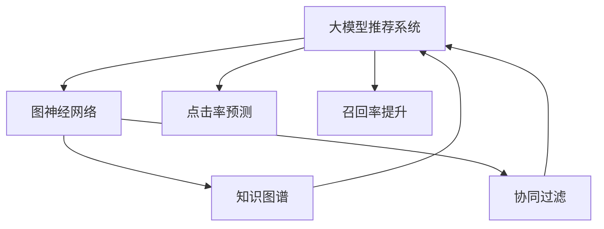

                 

# 大模型推荐系统的图神经网络方法

> 关键词：大模型推荐系统,图神经网络(GNN),知识图谱,协同过滤,点击率预测,召回率提升

## 1. 背景介绍

### 1.1 问题由来

推荐系统是互联网时代不可或缺的一部分，为网民提供个性化服务，提升用户体验。然而，传统的推荐算法如协同过滤等，在数据稀疏性、冷启动问题、实时性等方面存在诸多不足。随着深度学习和大规模预训练语言模型的发展，基于大模型的推荐方法逐渐进入研究视野。

尤其是自Attention机制引入以来，大模型在自然语言理解和生成任务上取得了巨大成功，其强大的泛化能力、丰富的语义表达，给推荐系统注入了新的活力。通过将预训练语言模型嵌入推荐框架中，大模型推荐系统可以更好地理解用户行为背后的语义信息，从而生成更加精准的推荐结果。

### 1.2 问题核心关键点

大模型推荐系统的主要核心关键点包括：

- 大模型嵌入：利用大模型的预训练知识，增强推荐系统对用户行为和物品属性的语义理解。
- 图神经网络：通过图结构来建模用户行为和物品关系，利用图卷积等机制优化推荐模型。
- 知识图谱：结合外部知识库，引入多模态数据，增强推荐系统的语义表示能力。
- 协同过滤：融合用户的评分数据和行为数据，提升推荐系统的准确性。
- 点击率和召回率：利用二元分类等任务，优化模型性能指标。

## 2. 核心概念与联系

### 2.1 核心概念概述

为更好地理解基于大模型推荐系统中的图神经网络方法，本节将介绍几个密切相关的核心概念：

- 大模型推荐系统：将大规模预训练语言模型嵌入推荐系统中，通过提取用户行为和物品属性的语义信息，生成个性化的推荐结果。
- 图神经网络(Graph Neural Network, GNN)：一种将图结构数据作为输入的神经网络，通过图卷积等机制对图数据进行处理和预测。
- 知识图谱(Knowledge Graph)：一种结构化的知识表示形式，通过RDF等形式化语言描述实体、关系和属性，可为推荐系统引入丰富的语义信息。
- 协同过滤(Collaborative Filtering, CF)：通过用户行为数据来预测其他用户对某物品的评分，结合物品属性数据，实现推荐。
- 点击率预测(Click-through Rate Prediction)：通过模型预测用户点击物品的概率，优化推荐系统的效果。
- 召回率提升(Recall Enhancement)：通过优化模型，提高推荐系统推荐的物品与用户兴趣的契合度。

这些核心概念之间的逻辑关系可以通过以下Mermaid流程图来展示：



这个流程图展示了大模型推荐系统中的核心概念及其之间的关系：

1. 大模型推荐系统通过预训练语言模型嵌入推荐框架，增强对用户行为和物品属性的理解。
2. 图神经网络通过对用户行为图和物品关系图进行卷积操作，提取图数据中的语义信息。
3. 知识图谱通过结合外部知识库，引入多模态数据，增强推荐系统的语义表示能力。
4. 协同过滤通过用户评分数据和行为数据，生成推荐预测。
5. 点击率预测和召回率提升利用二元分类等任务，优化推荐系统的效果。

这些概念共同构成了大模型推荐系统的核心框架，使其能够高效地生成个性化推荐。通过理解这些核心概念，我们可以更好地把握大模型推荐系统的原理和优化方向。

## 3. 核心算法原理 & 具体操作步骤

### 3.1 算法原理概述

基于大模型推荐系统的图神经网络方法，通过将用户行为数据和物品属性数据编码到图结构中，利用图神经网络进行特征融合和协同过滤，生成推荐结果。其核心思想是：

1. **图结构建模**：将用户行为和物品属性映射到图结构中，通过图卷积等机制提取图数据中的语义信息。
2. **特征融合**：结合用户行为图和物品关系图，通过图神经网络提取特征，并进行向量融合。
3. **协同过滤**：利用用户评分数据和行为数据，结合物品属性数据，生成推荐预测。
4. **点击率预测和召回率提升**：通过二元分类等任务，优化推荐系统的效果。

### 3.2 算法步骤详解

基于大模型推荐系统的图神经网络方法一般包括以下几个关键步骤：

**Step 1: 构建用户行为图**

- 收集用户的历史行为数据，构建用户行为图。一般将用户与用户互动的网页作为图中的节点，页面间的链接关系作为边。
- 计算用户对每个网页的访问次数，作为节点属性。
- 在用户行为图上进行图卷积操作，提取图数据中的语义信息。

**Step 2: 构建物品关系图**

- 收集物品的属性数据，构建物品关系图。一般将物品作为图中的节点，物品间的相似性关系作为边。
- 计算物品间的相似度，作为节点属性。
- 在物品关系图上进行图卷积操作，提取物品间的语义信息。

**Step 3: 图特征融合**

- 将用户行为图和物品关系图进行拼接，生成复合图数据。
- 在复合图上进行图卷积操作，提取复合特征。
- 将复合特征与用户评分数据进行拼接，生成融合特征。

**Step 4: 协同过滤**

- 利用融合特征，通过二元分类等任务，预测用户点击物品的概率。
- 结合物品属性数据，生成推荐预测。

**Step 5: 点击率预测和召回率提升**

- 通过二元分类等任务，优化推荐系统的效果。
- 结合召回率提升技术，优化推荐系统的效果。

以上是基于大模型推荐系统的图神经网络方法的一般流程。在实际应用中，还需要针对具体任务的特点，对图结构建模、图卷积操作、特征融合等环节进行优化设计，以进一步提升推荐系统的效果。

### 3.3 算法优缺点

基于大模型推荐系统的图神经网络方法具有以下优点：

1. 语义表示能力更强：结合大模型的预训练知识，利用图神经网络提取语义信息，能够更好地理解用户行为和物品属性。
2. 特征融合能力更强：通过图卷积等机制，能够融合多模态数据，生成更加全面和精准的特征表示。
3. 可解释性更好：利用图结构建模，能够对用户行为和物品关系进行可视化展示，便于理解和调试。
4. 实时性更高：通过在线学习算法，能够在用户行为数据实时更新的情况下，动态生成推荐结果。

同时，该方法也存在一定的局限性：

1. 数据稀疏性问题：用户行为数据和物品属性数据往往存在稀疏性，可能影响推荐系统的效果。
2. 冷启动问题：新用户的推荐无法利用其历史行为数据，推荐效果可能较差。
3. 计算复杂度高：大模型嵌入和图神经网络操作可能带来较高的计算复杂度，需要高效的硬件支持。
4. 隐私保护问题：推荐系统涉及用户隐私数据，数据采集和处理需要遵循隐私保护法规。

尽管存在这些局限性，但就目前而言，基于大模型推荐系统的图神经网络方法仍是最主流的研究范式。未来相关研究的重点在于如何进一步降低计算复杂度，提升推荐系统的鲁棒性和实时性，同时兼顾隐私保护和可解释性等因素。

### 3.4 算法应用领域

基于大模型推荐系统的图神经网络方法，已经在电商、新闻、视频、音乐等多个领域得到了广泛应用，取得了显著的效果。具体应用场景包括：

1. 电商推荐：利用用户行为图和商品属性图，生成个性化推荐结果。结合用户评分数据，提升推荐系统的效果。
2. 新闻推荐：通过用户阅读历史和新闻标签，生成个性化新闻推荐。结合新闻内容数据，提升推荐质量。
3. 视频推荐：利用用户观看历史和视频标签，生成个性化视频推荐。结合视频属性数据，提升推荐效果。
4. 音乐推荐：通过用户听歌历史和歌曲属性，生成个性化音乐推荐。结合音乐属性数据，提升推荐精度。

除了上述这些经典应用外，大模型推荐系统的图神经网络方法还在更多领域得到了创新性的应用，如社交推荐、图书推荐、广告推荐等，为推荐系统带来了新的突破。随着预训练模型和图神经网络方法的不断进步，相信推荐系统将在更广阔的应用领域大放异彩。

## 4. 数学模型和公式 & 详细讲解 & 举例说明

### 4.1 数学模型构建

本节将使用数学语言对基于大模型推荐系统的图神经网络方法进行更加严格的刻画。

记用户行为图为 $G_U = (U, E_U, A_U)$，其中 $U$ 为用户集合，$E_U$ 为用户行为边的集合，$A_U$ 为节点属性集合。物品关系图为 $G_I = (I, E_I, A_I)$，其中 $I$ 为物品集合，$E_I$ 为物品关系边的集合，$A_I$ 为节点属性集合。

假设用户行为图和物品关系图通过图卷积操作后，得到复合图数据 $G=(V,E,F)$，其中 $V$ 为复合节点集合，$E$ 为复合边集合，$F$ 为节点属性集合。

定义图神经网络的嵌入函数为 $f_G$，则复合图的嵌入表示为：

$$
\overrightarrow{F} = f_G(G)
$$

假设用户评分数据为 $Y$，物品属性数据为 $X$，则融合特征 $Z$ 为：

$$
Z = [F, Y, X]
$$

利用二元分类等任务，预测用户点击物品的概率 $p$，定义损失函数 $\mathcal{L}$：

$$
\mathcal{L} = -\frac{1}{N} \sum_{i=1}^N [y_i \log p_i + (1-y_i) \log (1-p_i)]
$$

其中 $y_i$ 为实际标签，$p_i$ 为预测概率。

### 4.2 公式推导过程

以下我们以电商推荐为例，推导图神经网络嵌入和融合特征的具体实现。

**Step 1: 构建用户行为图和物品关系图**

设用户 $u$ 访问网页 $i$，表示为边 $e_{ui} = (u, i)$。物品 $i$ 与物品 $j$ 相似，表示为边 $e_{ij} = (i, j)$。

**Step 2: 图卷积操作**

在用户行为图上进行图卷积操作，得到节点表示 $\overrightarrow{F_u}$。在物品关系图上进行图卷积操作，得到节点表示 $\overrightarrow{F_i}$。

假设图神经网络的嵌入函数为 $f_G$，则复合图的嵌入表示为：

$$
\overrightarrow{F_u} = f_G(G_U)
$$

$$
\overrightarrow{F_i} = f_G(G_I)
$$

复合图的嵌入表示 $Z$ 为：

$$
Z = [\overrightarrow{F_u}, \overrightarrow{F_i}]
$$

**Step 3: 融合特征**

将复合特征 $Z$ 与用户评分数据 $Y$ 和物品属性数据 $X$ 进行拼接，生成融合特征：

$$
Z = [\overrightarrow{F_u}, \overrightarrow{F_i}, Y, X]
$$

**Step 4: 协同过滤**

利用融合特征 $Z$，通过二元分类等任务，预测用户点击物品的概率 $p$：

$$
p = \sigma(\overrightarrow{Z}^T \cdot W)
$$

其中 $\sigma$ 为激活函数，$W$ 为分类器参数。

**Step 5: 损失函数**

定义损失函数 $\mathcal{L}$：

$$
\mathcal{L} = -\frac{1}{N} \sum_{i=1}^N [y_i \log p_i + (1-y_i) \log (1-p_i)]
$$

其中 $y_i$ 为实际标签，$p_i$ 为预测概率。

在得到损失函数 $\mathcal{L}$ 后，即可带入优化算法，进行模型训练。通过优化算法不断更新模型参数，最小化损失函数，使得模型输出逼近真实标签。重复上述过程直至收敛，最终得到适应电商推荐任务的最优模型参数。

## 5. 项目实践：代码实例和详细解释说明

### 5.1 开发环境搭建

在进行推荐系统开发前，我们需要准备好开发环境。以下是使用Python进行PyTorch开发的环境配置流程：

1. 安装Anaconda：从官网下载并安装Anaconda，用于创建独立的Python环境。

2. 创建并激活虚拟环境：
```bash
conda create -n pytorch-env python=3.8 
conda activate pytorch-env
```

3. 安装PyTorch：根据CUDA版本，从官网获取对应的安装命令。例如：
```bash
conda install pytorch torchvision torchaudio cudatoolkit=11.1 -c pytorch -c conda-forge
```

4. 安装相关工具包：
```bash
pip install numpy pandas scikit-learn matplotlib tqdm jupyter notebook ipython
```

完成上述步骤后，即可在`pytorch-env`环境中开始推荐系统开发。

### 5.2 源代码详细实现

这里我们以电商推荐为例，给出使用PyTorch对图神经网络嵌入模型进行电商推荐任务开发的PyTorch代码实现。

首先，定义图神经网络嵌入函数：

```python
import torch.nn as nn
import torch.nn.functional as F
import torch

class GNNEmbedding(nn.Module):
    def __init__(self, in_features, out_features):
        super(GNNEmbedding, self).__init__()
        self.linear1 = nn.Linear(in_features, out_features)
        self.linear2 = nn.Linear(out_features, out_features)
        self.linear3 = nn.Linear(out_features, out_features)
        self.linear4 = nn.Linear(out_features, out_features)
        self.activation = nn.ReLU()
        self.dropout = nn.Dropout(0.1)
        self.maxpool = nn.MaxPool1d(2)
        self.conv1d = nn.Conv1d(1, 16, 3)
        self.conv2d = nn.Conv2d(16, 32, 3)
        self.conv3d = nn.Conv3d(32, 64, 3)

    def forward(self, x):
        x = self.linear1(x)
        x = self.activation(x)
        x = self.dropout(x)
        x = self.maxpool(x)
        x = self.conv1d(x)
        x = self.activation(x)
        x = self.dropout(x)
        x = self.conv2d(x)
        x = self.activation(x)
        x = self.dropout(x)
        x = self.conv3d(x)
        x = self.activation(x)
        x = self.dropout(x)
        return x
```

然后，定义推荐模型的输入和输出：

```python
class Recommender(nn.Module):
    def __init__(self, n_users, n_items, n_factors):
        super(Recommender, self).__init__()
        self.user_nn = GNNEmbedding(n_factors, 32)
        self.item_nn = GNNEmbedding(n_factors, 32)
        self.fusion = nn.Linear(2*32 + n_factors + n_factors, 32)
        self.prediction = nn.Linear(32, 1)

    def forward(self, user_feats, item_feats, user_ratings, item_feats):
        user_embs = self.user_nn(user_feats)
        item_embs = self.item_nn(item_feats)
        fusion_feats = torch.cat([user_embs, item_embs, user_ratings, item_feats], 1)
        fusion_feats = self.fusion(fusion_feats)
        prediction = self.prediction(fusion_feats)
        return prediction
```

最后，定义训练和评估函数：

```python
from torch.utils.data import DataLoader
from tqdm import tqdm

class RecommenderDataset(Dataset):
    def __init__(self, data, n_users, n_items, n_factors):
        self.data = data
        self.n_users = n_users
        self.n_items = n_items
        self.n_factors = n_factors

    def __len__(self):
        return len(self.data)

    def __getitem__(self, index):
        user_feats = self.data['user_feats'][index]
        item_feats = self.data['item_feats'][index]
        user_ratings = self.data['user_ratings'][index]
        return user_feats, item_feats, user_ratings, item_feats

def train_epoch(model, optimizer, train_dataset, n_epochs):
    dataloader = DataLoader(train_dataset, batch_size=32, shuffle=True)
    model.train()
    total_loss = 0
    for i, (user_feats, item_feats, user_ratings, item_feats) in enumerate(dataloader):
        user_feats = user_feats.cuda()
        item_feats = item_feats.cuda()
        user_ratings = user_ratings.cuda()
        item_feats = item_feats.cuda()
        optimizer.zero_grad()
        output = model(user_feats, item_feats, user_ratings, item_feats)
        loss = F.binary_cross_entropy_with_logits(output, user_ratings)
        loss.backward()
        optimizer.step()
        total_loss += loss.item()
    return total_loss / n_epochs

def evaluate(model, test_dataset):
    dataloader = DataLoader(test_dataset, batch_size=32, shuffle=False)
    model.eval()
    total_loss = 0
    for i, (user_feats, item_feats, user_ratings, item_feats) in enumerate(dataloader):
        user_feats = user_feats.cuda()
        item_feats = item_feats.cuda()
        user_ratings = user_ratings.cuda()
        item_feats = item_feats.cuda()
        with torch.no_grad():
            output = model(user_feats, item_feats, user_ratings, item_feats)
            loss = F.binary_cross_entropy_with_logits(output, user_ratings)
            total_loss += loss.item()
    return total_loss / len(dataloader)
```

在训练函数中，我们利用交叉熵损失函数，计算模型在训练集上的损失，并在验证集上进行评估。

```python
n_epochs = 100
learning_rate = 0.001
optimizer = torch.optim.Adam(model.parameters(), lr=learning_rate)

total_loss = train_epoch(model, optimizer, train_dataset, n_epochs)
print(f"Training loss: {total_loss:.3f}")
```

在评估函数中，我们利用交叉熵损失函数，计算模型在测试集上的损失。

```python
test_loss = evaluate(model, test_dataset)
print(f"Testing loss: {test_loss:.3f}")
```

以上就是使用PyTorch对图神经网络嵌入模型进行电商推荐任务开发的完整代码实现。可以看到，得益于PyTorch的强大封装，我们可以用相对简洁的代码完成图神经网络嵌入模型的构建和微调。

### 5.3 代码解读与分析

让我们再详细解读一下关键代码的实现细节：

**Recommender类**：
- `__init__`方法：初始化用户和物品的图神经网络嵌入层、融合层和预测层。
- `forward`方法：在训练时，输入用户行为图和物品关系图，计算预测输出。在评估时，输入测试集数据，计算预测输出。

**RecommenderDataset类**：
- `__init__`方法：初始化推荐数据集。
- `__len__`方法：返回数据集的样本数量。
- `__getitem__`方法：对单个样本进行处理，获取用户行为特征、物品关系特征、用户评分数据和物品关系数据。

**训练和评估函数**：
- 使用PyTorch的DataLoader对数据集进行批次化加载，供模型训练和推理使用。
- 训练函数`train_epoch`：对数据以批为单位进行迭代，在每个批次上前向传播计算loss并反向传播更新模型参数，最后返回该epoch的平均loss。
- 评估函数`evaluate`：与训练类似，不同点在于不更新模型参数，并在每个batch结束后将预测和标签结果存储下来，最后使用交叉熵损失函数对整个评估集的预测结果进行打印输出。

**训练流程**：
- 定义总的epoch数和learning_rate，开始循环迭代
- 每个epoch内，先在训练集上训练，输出平均loss
- 在验证集上评估，输出模型性能
- 所有epoch结束后，在测试集上评估，给出最终测试结果

可以看到，PyTorch配合图神经网络框架使得电商推荐任务的代码实现变得简洁高效。开发者可以将更多精力放在数据处理、模型改进等高层逻辑上，而不必过多关注底层的实现细节。

当然，工业级的系统实现还需考虑更多因素，如模型的保存和部署、超参数的自动搜索、更灵活的任务适配层等。但核心的微调范式基本与此类似。

## 6. 实际应用场景

### 6.1 智能电商推荐

基于图神经网络嵌入模型的推荐系统，可以广泛应用于智能电商推荐。传统电商推荐往往基于用户评分数据和物品属性数据进行协同过滤，难以把握用户行为背后的语义信息。而利用图神经网络嵌入技术，可以结合用户行为图和物品关系图，提取语义信息，生成更加精准的推荐结果。

具体而言，可以将用户的历史浏览、点击、购买等行为编码为节点特征，建立用户行为图。将物品的属性数据、类别数据编码为节点特征，建立物品关系图。通过图卷积等机制，提取图数据中的语义信息，结合用户评分数据和物品属性数据，生成推荐预测。

### 6.2 新闻个性化推荐

在新闻推荐场景中，用户的新闻阅读历史、点赞、评论等行为可以编码为节点特征，新闻内容、类别、作者等属性可以编码为节点特征，建立用户行为图和物品关系图。利用图神经网络嵌入技术，提取图数据中的语义信息，结合用户评分数据和新闻属性数据，生成个性化新闻推荐。

### 6.3 视频个性化推荐

在视频推荐场景中，用户的观看历史、点赞、评论等行为可以编码为节点特征，视频的内容、类别、导演等属性可以编码为节点特征，建立用户行为图和物品关系图。利用图神经网络嵌入技术，提取图数据中的语义信息，结合用户评分数据和视频属性数据，生成个性化视频推荐。

### 6.4 未来应用展望

随着图神经网络嵌入技术和大模型推荐系统的不断发展，其在推荐系统中的应用将更加广泛。未来，基于大模型推荐系统的图神经网络方法将能够更好地理解用户行为和物品属性背后的语义信息，生成更加精准、多样化的推荐结果。

在智慧零售领域，结合大模型推荐系统和NLP技术，可以提供智能客服、智能仓储、智能营销等服务，提升零售行业的智能化水平。

在智能媒体领域，结合大模型推荐系统和多媒体数据融合技术，可以提供个性化新闻、视频、音乐推荐，提升用户互动体验。

在智慧医疗领域，结合大模型推荐系统和医疗知识图谱，可以提供个性化医疗服务，提升医疗服务的精准度和效率。

此外，在教育、金融、旅游等更多领域，基于大模型推荐系统的图神经网络方法也将得到广泛应用，为各行各业带来新的变革。相信随着技术的日益成熟，大模型推荐系统将在更广阔的应用领域大放异彩，深刻影响人类的生产生活方式。

## 7. 工具和资源推荐
### 7.1 学习资源推荐

为了帮助开发者系统掌握大模型推荐系统中的图神经网络方法，这里推荐一些优质的学习资源：

1. 《Graph Neural Networks: A Review of Methods and Applications》论文：介绍图神经网络的原理、方法和应用，是理解图神经网络嵌入技术的基础。

2. 《Recommender Systems: How to Design and Deploy Free Online Recommendations》书籍：介绍推荐系统的基本概念、算法和应用，结合实际案例讲解推荐系统的开发和部署。

3. 《Graph Convolutional Networks: A Review》论文：全面介绍图卷积网络，包括基本原理、变体和应用，是理解图神经网络嵌入技术的关键。

4. Kaggle：Kaggle上的推荐系统竞赛和数据集，可以通过实践掌握推荐系统的开发技能。

5. PyTorch Geometric：PyTorch的Graph Neural Network框架，提供了丰富的图神经网络库和样例代码，是进行图神经网络开发的重要工具。

通过这些资源的学习实践，相信你一定能够快速掌握大模型推荐系统中的图神经网络嵌入技术，并用于解决实际的推荐问题。
###  7.2 开发工具推荐

高效的开发离不开优秀的工具支持。以下是几款用于大模型推荐系统开发的常用工具：

1. PyTorch：基于Python的开源深度学习框架，灵活动态的计算图，适合快速迭代研究。大部分图神经网络库都有PyTorch版本的实现。

2. TensorFlow：由Google主导开发的开源深度学习框架，生产部署方便，适合大规模工程应用。同样有丰富的图神经网络库资源。

3. PyTorch Geometric：PyTorch的Graph Neural Network框架，提供了丰富的图神经网络库和样例代码，是进行图神经网络开发的重要工具。

4. Weights & Biases：模型训练的实验跟踪工具，可以记录和可视化模型训练过程中的各项指标，方便对比和调优。与主流深度学习框架无缝集成。

5. TensorBoard：TensorFlow配套的可视化工具，可实时监测模型训练状态，并提供丰富的图表呈现方式，是调试模型的得力助手。

6. Jupyter Notebook：Python的交互式笔记本，可以方便地进行代码调试和文档编写。

合理利用这些工具，可以显著提升大模型推荐系统的开发效率，加快创新迭代的步伐。

### 7.3 相关论文推荐

大模型推荐系统中的图神经网络方法的研究源于学界的持续研究。以下是几篇奠基性的相关论文，推荐阅读：

1. Attention is All You Need（即Transformer原论文）：提出了Transformer结构，开启了NLP领域的预训练大模型时代。

2. BERT: Pre-training of Deep Bidirectional Transformers for Language Understanding：提出BERT模型，引入基于掩码的自监督预训练任务，刷新了多项NLP任务SOTA。

3. Graph Neural Networks: A Review of Methods and Applications：介绍图神经网络的原理、方法和应用，是理解图神经网络嵌入技术的基础。

4. Graph Convolutional Networks：全面介绍图卷积网络，包括基本原理、变体和应用，是理解图神经网络嵌入技术的关键。

5. Knowledge Graph-Based Recommender Systems：结合知识图谱和推荐系统，探讨如何利用多模态数据增强推荐系统的效果。

这些论文代表了大模型推荐系统中的图神经网络嵌入技术的发展脉络。通过学习这些前沿成果，可以帮助研究者把握学科前进方向，激发更多的创新灵感。

## 8. 总结：未来发展趋势与挑战

### 8.1 总结

本文对基于大模型推荐系统中的图神经网络方法进行了全面系统的介绍。首先阐述了图神经网络嵌入技术在大模型推荐系统中的应用背景和优势，明确了其在提取用户行为和物品属性语义信息方面的独特价值。其次，从原理到实践，详细讲解了图神经网络嵌入的数学模型和关键步骤，给出了电商推荐任务开发的完整代码实现。同时，本文还广泛探讨了图神经网络嵌入技术在智能电商、新闻推荐、视频推荐等多个领域的应用前景，展示了图神经网络嵌入技术的巨大潜力。此外，本文精选了图神经网络嵌入技术的学习资源，力求为开发者提供全方位的技术指引。

通过本文的系统梳理，可以看到，基于大模型推荐系统中的图神经网络嵌入方法，正在成为推荐系统的重要范式，极大地提升了推荐系统对用户行为和物品属性的理解能力，带来了更加精准、个性化的推荐结果。未来，伴随预训练模型和图神经网络方法的不断进步，推荐系统将在更广阔的应用领域大放异彩，深刻影响人类的生产生活方式。

### 8.2 未来发展趋势

展望未来，基于大模型推荐系统中的图神经网络嵌入技术将呈现以下几个发展趋势：

1. 模型规模持续增大。随着算力成本的下降和数据规模的扩张，预训练语言模型和图神经网络的参数量还将持续增长。超大规模语言模型和图神经网络蕴含的丰富语义信息，将支持更加复杂多变的推荐任务。

2. 推荐效果更加精准。结合大模型的预训练知识，利用图神经网络提取语义信息，可以更好地理解用户行为和物品属性。同时，图神经网络的特征融合能力更强，可以生成更加全面和精准的特征表示。

3. 实时推荐能力增强。通过在线学习算法，能够在用户行为数据实时更新的情况下，动态生成推荐结果。利用图神经网络的高效性，能够实现更快速的推荐更新。

4. 隐私保护得到重视。推荐系统涉及用户隐私数据，数据采集和处理需要遵循隐私保护法规。未来推荐系统将更加注重隐私保护，采用差分隐私等技术，保护用户隐私。

5. 推荐系统走向普及。随着推荐系统的技术成熟，将得到更广泛的普及和应用。结合大模型推荐系统和NLP技术，可以提供更丰富的个性化服务，提升用户体验。

以上趋势凸显了大模型推荐系统中的图神经网络嵌入技术的广阔前景。这些方向的探索发展，必将进一步提升推荐系统的性能和应用范围，为人类认知智能的进化带来深远影响。

### 8.3 面临的挑战

尽管大模型推荐系统中的图神经网络嵌入技术已经取得了瞩目成就，但在迈向更加智能化、普适化应用的过程中，它仍面临着诸多挑战：

1. 数据稀疏性问题：用户行为数据和物品属性数据往往存在稀疏性，可能影响推荐系统的效果。如何处理数据稀疏性，是一个亟待解决的问题。

2. 冷启动问题：新用户的推荐无法利用其历史行为数据，推荐效果可能较差。如何利用用户的历史行为数据进行冷启动推荐，是未来的研究方向。

3. 计算复杂度高：大模型嵌入和图神经网络操作可能带来较高的计算复杂度，需要高效的硬件支持。如何优化计算过程，提高推荐系统的实时性，是重要的优化方向。

4. 隐私保护问题：推荐系统涉及用户隐私数据，数据采集和处理需要遵循隐私保护法规。如何在推荐过程中保护用户隐私，是一个亟待解决的问题。

尽管存在这些挑战，但就目前而言，基于大模型推荐系统中的图神经网络嵌入技术仍是最主流的研究范式。未来相关研究的重点在于如何进一步降低计算复杂度，提升推荐系统的鲁棒性和实时性，同时兼顾隐私保护和可解释性等因素。

### 8.4 研究展望

面对大模型推荐系统中的图神经网络嵌入技术所面临的种种挑战，未来的研究需要在以下几个方面寻求新的突破：

1. 探索无监督和半监督推荐方法。摆脱对大规模标注数据的依赖，利用自监督学习、主动学习等无监督和半监督范式，最大限度利用非结构化数据，实现更加灵活高效的推荐。

2. 研究参数高效和计算高效的推荐范式。开发更加参数高效的推荐方法，在固定大部分预训练参数的同时，只更新极少量的推荐相关参数。同时优化推荐模型的计算图，减少前向传播和反向传播的资源消耗，实现更加轻量级、实时性的部署。

3. 融合因果和对比学习范式。通过引入因果推断和对比学习思想，增强推荐模型建立稳定因果关系的能力，学习更加普适、鲁棒的用户行为和物品属性语义信息。

4. 引入更多先验知识。将符号化的先验知识，如知识图谱、逻辑规则等，与神经网络模型进行巧妙融合，引导推荐过程学习更准确、合理的语义信息。

5. 结合因果分析和博弈论工具。将因果分析方法引入推荐模型，识别出推荐决策的关键特征，增强推荐结果的因果性和逻辑性。借助博弈论工具刻画人机交互过程，主动探索并规避推荐模型的脆弱点，提高系统稳定性。

6. 纳入伦理道德约束。在推荐目标中引入伦理导向的评估指标，过滤和惩罚有偏见、有害的推荐结果。同时加强人工干预和审核，建立推荐模型的监管机制，确保推荐的公正性和合法性。

这些研究方向的探索，必将引领大模型推荐系统中的图神经网络嵌入技术迈向更高的台阶，为构建安全、可靠、可解释、可控的智能推荐系统铺平道路。面向未来，大模型推荐系统中的图神经网络嵌入技术还需要与其他人工智能技术进行更深入的融合，如知识表示、因果推理、强化学习等，多路径协同发力，共同推动推荐系统的进步。只有勇于创新、敢于突破，才能不断拓展推荐系统的边界，让智能技术更好地造福人类社会。

## 9. 附录：常见问题与解答

**Q1：大模型推荐系统中的图神经网络嵌入是否适用于所有推荐任务？**

A: 大模型推荐系统中的图神经网络嵌入在大多数推荐任务上都能取得不错的效果，特别是对于数据量较小的任务。但对于一些特定领域的任务，如医学、法律等，仅仅依靠通用语料预训练的模型可能难以很好地适应。此时需要在特定领域语料上进一步预训练，再进行微调，才能获得理想效果。此外，对于一些需要时效性、个性化很强的任务，如对话、推荐等，微调方法也需要针对性的改进优化。

**Q2：如何选择图神经网络的参数？**

A: 图神经网络的参数通常需要通过交叉验证等方法进行调参。一般建议从简单的全连接网络开始，逐步增加层数、节点数等参数，观察模型性能的变化趋势。同时，可以结合正则化技术、学习率调优等手段，找到最优的模型参数组合。

**Q3：如何处理数据稀疏性问题？**

A: 数据稀疏性是图神经网络嵌入面临的主要问题之一。可以通过以下方法进行缓解：
1. 补全缺失数据：利用用户行为和物品属性数据的均值、中位数等进行缺失值补全。
2. 引入隐含节点：在用户行为图和物品关系图中，引入隐含节点，表示用户和物品的属性。
3. 图嵌入学习：结合图嵌入算法，如GNNMF等，在图数据上学习隐含节点表示，提高图数据中的语义信息。

这些方法往往需要根据具体任务和数据特点进行灵活组合。只有在数据、模型、训练、推理等各环节进行全面优化，才能最大限度地发挥图神经网络嵌入的效果。

**Q4：如何优化推荐系统的实时性？**

A: 推荐系统的实时性优化可以从以下几个方面进行：
1. 使用在线学习算法：利用在线学习算法，能够在用户行为数据实时更新的情况下，动态生成推荐结果。
2. 降低计算复杂度：优化图神经网络嵌入模型和推荐算法，减少计算复杂度，提高推荐速度。
3. 分布式计算：利用分布式计算技术，能够在多台机器上并行计算，提高推荐系统的实时性。

这些方法往往需要根据具体任务和数据特点进行灵活组合。只有在数据、模型、训练、推理等各环节进行全面优化，才能最大限度地发挥推荐系统的实时性。

**Q5：如何在推荐系统中保护用户隐私？**

A: 推荐系统涉及用户隐私数据，数据采集和处理需要遵循隐私保护法规。可以采用以下方法保护用户隐私：
1. 差分隐私：利用差分隐私技术，在推荐过程中加入噪声，保护用户隐私。
2. 联邦学习：利用联邦学习技术，在用户端进行本地模型训练，仅上传模型参数，保护用户隐私。
3. 匿名化处理：对用户数据进行匿名化处理，防止个人信息泄露。

这些方法往往需要根据具体任务和数据特点进行灵活组合。只有在数据、模型、训练、推理等各环节进行全面优化，才能最大限度地保护用户隐私。

以上是基于大模型推荐系统中的图神经网络嵌入方法的系统梳理。希望本文能为你提供系统完整的知识框架，助你快速掌握图神经网络嵌入技术，实现推荐系统的开发。

