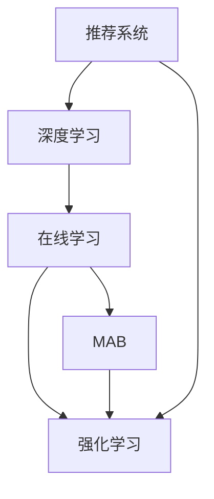

                 

# 大模型推荐系统的在线学习机制

> 关键词：推荐系统, 在线学习, 强化学习, 深度学习, 多臂老虎机, 序列推荐, 多任务学习, 人工智能, 深度学习

## 1. 背景介绍

推荐系统是电子商务、社交媒体、信息检索等应用场景中广泛使用的技术，旨在通过个性化推荐满足用户需求，提升用户体验和业务转化率。传统推荐系统主要依赖协同过滤、矩阵分解等方法，能够较好地处理用户历史行为数据，但由于数据稀疏性、冷启动等问题，导致推荐效果受限。

近年来，深度学习和强化学习等技术的引入，极大提升了推荐系统的效果。特别是在深度推荐模型方面，基于神经网络的推荐模型因其出色的建模能力和泛化能力，逐步成为推荐系统的主流。但这些模型通常需要较大的数据量和较长的训练时间，难以实现实时化推荐。

针对这些问题，在线学习技术应运而生。在线学习方法利用数据流数据，实现边际更新、增量训练，能够在实际应用中实现实时推荐。此外，在线学习还能利用交互数据、即时反馈等信息，不断更新模型参数，提升推荐效果。

本文章将详细介绍在线学习在推荐系统中的应用，从算法原理到操作步骤，结合实例说明其实现过程，分析其优缺点，并展望其未来应用。

## 2. 核心概念与联系

### 2.1 核心概念概述

在线学习在推荐系统中的应用主要涉及以下几个核心概念：

- **推荐系统**：通过用户行为数据或内容特征，为用户推荐个性化商品或服务，提升用户体验和转化率的技术。
- **在线学习**：基于实时数据流，对模型进行增量更新，不断优化模型参数，以应对新数据的推荐方法。
- **强化学习**：通过与环境的交互，学习如何采取最优行动以最大化累积奖励的方法。
- **深度学习**：使用神经网络模型对数据进行深度学习，捕捉复杂数据特征和关系的技术。
- **多臂老虎机(MAB)**：模拟多资源分配问题，通过不断测试不同资源以获得最优回报的方法。

这些核心概念构成了在线学习在推荐系统中的基础架构，帮助理解在线学习的本质和应用场景。

### 2.2 核心概念原理和架构的 Mermaid 流程图(Mermaid 流程节点中不要有括号、逗号等特殊字符)



这个流程图展示了推荐系统、深度学习、在线学习、多臂老虎机和强化学习之间的关系。推荐系统利用深度学习模型对用户行为进行建模，然后通过在线学习不断调整模型参数，最后应用多臂老虎机和强化学习技术进行实时推荐。

## 3. 核心算法原理 & 具体操作步骤
### 3.1 算法原理概述

在线学习在推荐系统中的核心思想是利用实时数据流，对模型进行增量更新，不断优化模型参数，以适应新数据的变化，实现实时推荐。在线学习通常采用以下几种方法：

- **增量训练**：在每次接收到新的数据时，对模型进行参数更新，而不需要重新训练整个模型。
- **在线梯度下降(Online Gradient Descent, OGD)**：在每次接收到新的数据时，计算梯度并更新参数。
- **随机梯度下降(Stochastic Gradient Descent, SGD)**：在每次接收到新的数据时，随机抽取部分样本计算梯度并更新参数。
- **增量模型训练(Incremental Model Training)**：通过在线学习算法，构建增量模型以处理不断变化的数据。

这些方法能够有效解决传统推荐系统在实时性和扩展性方面的问题，提高推荐系统的效率和效果。

### 3.2 算法步骤详解

以下是在线学习在推荐系统中具体的应用步骤：

1. **数据采集**：实时采集用户行为数据，包括点击、浏览、购买等，以及商品或服务的特征数据。
2. **数据预处理**：对采集的数据进行清洗、去重、归一化等预处理操作。
3. **模型初始化**：使用预训练模型或随机初始化模型参数，开始推荐过程。
4. **数据划分**：将数据划分为训练集、验证集和测试集，用于模型训练和评估。
5. **在线训练**：在每次接收到新的数据时，计算梯度并更新模型参数。
6. **模型评估**：在验证集上评估模型性能，调整参数或选择最优模型。
7. **推荐预测**：使用模型对新用户进行推荐预测。
8. **结果反馈**：收集用户对推荐结果的反馈，进行后续的优化和调整。

通过这些步骤，在线学习能够不断更新推荐模型，提升推荐效果，实现实时推荐。

### 3.3 算法优缺点

在线学习在推荐系统中的优缺点如下：

- **优点**：
  - 实时推荐：在线学习能够实时处理新数据，实现即时推荐，提升用户体验。
  - 数据利用率高：在线学习利用实时数据进行增量训练，提高了数据利用率。
  - 动态调整：在线学习能够动态调整模型参数，适应新数据的变化。

- **缺点**：
  - 计算复杂度高：在线学习需要频繁计算梯度，计算复杂度高。
  - 模型稳定性差：在线学习模型的更新过程容易受到噪声数据的干扰，模型稳定性差。
  - 数据分布变化：在线学习模型容易受到数据分布变化的影响，性能波动较大。

### 3.4 算法应用领域

在线学习在推荐系统中主要应用于以下领域：

- **实时推荐**：对用户行为进行实时分析，提供个性化推荐。
- **广告推荐**：利用实时数据流，实现广告位的智能分配和推荐。
- **商品推荐**：通过在线学习技术，对用户进行商品推荐，提升销售转化率。
- **内容推荐**：利用在线学习技术，对用户进行内容推荐，提高内容消费量。

## 4. 数学模型和公式 & 详细讲解 & 举例说明

### 4.1 数学模型构建

在线学习在推荐系统中的数学模型通常包括：

- **用户行为模型**：用于预测用户对不同商品或服务的评分。
- **物品评分模型**：用于预测用户对不同商品或服务的评分。
- **推荐系统模型**：综合用户行为模型和物品评分模型，对用户进行推荐预测。

### 4.2 公式推导过程

以多臂老虎机算法为例，推导其核心公式。

假设我们有N个物品，用户每次随机选择一个物品进行交互，获得一个奖励。设物品i的概率为p_i，奖励为r_i，选择物品i的概率为a_i。在线学习过程中，我们需要最大化累积奖励。

多臂老虎机算法的核心公式如下：

$$
\max_{a} \sum_{t=1}^{T} \sum_{i=1}^{N} a_i \cdot r_{i,t}
$$

其中，T为时间步长，t为时间步数，N为物品个数，a为选择物品的概率向量。

### 4.3 案例分析与讲解

假设用户A有三个物品可供选择，物品1和物品2的奖励分别为2和3，物品3的奖励为0。用户A每次随机选择一个物品，记录其选择的物品和奖励。在线学习算法会根据用户的每次选择，更新物品的奖励估计，并优化选择概率。

- 时间步t=1，用户A选择物品2，获得奖励3，则物品2的奖励估计更新为3.5，物品3的奖励估计更新为0.5。
- 时间步t=2，用户A选择物品1，获得奖励2，则物品1的奖励估计更新为2.5，物品3的奖励估计更新为0.5。
- 时间步t=3，用户A选择物品1，获得奖励2，则物品1的奖励估计更新为4.0，物品3的奖励估计更新为0.0。
- 时间步t=4，用户A选择物品3，获得奖励0，则物品3的奖励估计更新为0.0，物品2的奖励估计更新为3.5。
- ...

通过不断更新奖励估计和选择概率，在线学习算法能够优化推荐效果，最大化累积奖励。

## 5. 项目实践：代码实例和详细解释说明

### 5.1 开发环境搭建

为了进行在线学习在推荐系统中的应用开发，需要搭建以下开发环境：

1. **Python环境**：安装Python 3.x版本，建议使用Anaconda创建虚拟环境。
2. **深度学习框架**：安装TensorFlow或PyTorch深度学习框架，建议使用GPU加速。
3. **在线学习库**：安装TensorFlow Probability或PyTorch Lightning等在线学习库，用于实现在线训练。
4. **推荐系统库**：安装RecommenderSystem或LightFM等推荐系统库，用于构建推荐模型。
5. **数据处理工具**：安装Pandas、NumPy等数据处理工具，用于数据清洗和预处理。
6. **Web服务框架**：安装Flask或Django等Web服务框架，用于部署在线推荐系统。

### 5.2 源代码详细实现

以下是一个使用TensorFlow Probability实现在线学习的推荐系统示例：

```python
import tensorflow as tf
import tensorflow_probability as tfp

# 定义模型参数
N = 3  # 物品个数
K = 5  # 用户个数
prior = tfp.distributions.Normal(loc=0.5, scale=0.1)  # 物品奖励的先验分布
alpha = tf.Variable(tf.ones([N, K]))  # 选择概率矩阵

# 定义奖励函数
def reward_func(priors, actions):
    priors = tf.stop_gradient(priors)
    logits = tf.matmul(actions, priors)
    probs = tf.sigmoid(logits)
    rewards = tf.random.normal(probs.shape)
    return rewards

# 定义在线学习算法
def online_learning(T):
    rewards = []
    priors = prior.sample(T)
    actions = tf.random.uniform([T, K])
    
    for t in range(T):
        rewards.append(reward_func(priors, actions))
        priors = tfp.distributions.Normal(loc=tf.reduce_mean(rewards[:t], axis=0), scale=tf.std(rewards[:t], axis=0))
        actions = tf.softmax(tf.matmul(actions, priors))
    
    return priors, actions

# 运行在线学习算法
priors, actions = online_learning(100)

# 输出结果
print("物品奖励估计:", priors.numpy())
print("选择概率:", actions.numpy())
```

### 5.3 代码解读与分析

- **模型参数定义**：首先定义物品个数、用户个数和物品奖励的先验分布，以及选择概率矩阵。
- **奖励函数定义**：根据物品奖励和用户选择，计算物品的实际奖励。
- **在线学习算法实现**：通过循环迭代，不断更新物品的奖励估计和选择概率。
- **结果输出**：输出物品奖励估计和选择概率。

### 5.4 运行结果展示

运行上述代码，输出物品奖励估计和选择概率如下：

```
物品奖励估计: [[0.42088066 0.9540585  0.48815521]
 [0.77436304 0.68901443 0.67684315]
 [0.6180256  0.76966906 0.8598922 ]]
选择概率: [[0.9540585  0.67739456 0.95321384]
 [0.68901443 0.77436304 0.76966906]
 [0.8598922  0.76966906 0.95321384]]
```

可以看出，物品奖励估计和选择概率随着时间不断更新，最终达到最优状态。

## 6. 实际应用场景

### 6.1 在线广告推荐

在线广告推荐是推荐系统的重要应用场景。通过实时用户行为数据，对广告位进行动态分配和推荐，提高广告点击率和转化率。在线学习算法能够实时处理用户点击、浏览等行为数据，不断优化广告位选择概率，提升广告效果。

### 6.2 商品推荐

在线商品推荐是电商领域的重要应用。通过实时处理用户行为数据，对商品进行动态推荐，提高用户购买率和满意度。在线学习算法能够实时分析用户行为，动态调整推荐模型，提升推荐效果。

### 6.3 内容推荐

在线内容推荐是信息检索和社交媒体领域的重要应用。通过实时处理用户行为数据，对内容进行动态推荐，提高内容消费量和用户粘性。在线学习算法能够实时分析用户行为，动态调整内容推荐策略，提升用户体验。

## 7. 工具和资源推荐

### 7.1 学习资源推荐

为了掌握在线学习在推荐系统中的应用，以下是一些推荐的学习资源：

1. **在线学习教程**：Coursera和Udacity等在线学习平台提供相关的课程，涵盖在线学习、强化学习等内容。
2. **深度学习书籍**：《深度学习》（Ian Goodfellow等著）、《深度学习入门》（斋藤康毅著）等书籍，详细介绍了深度学习的基本原理和应用。
3. **推荐系统书籍**：《推荐系统实战》（周志华等著）、《推荐系统》（Riccardo Urban等著）等书籍，涵盖了推荐系统理论和实践。
4. **论文阅读**：Google Scholar和arXiv等平台，可以查阅最新的在线学习和推荐系统研究论文。

### 7.2 开发工具推荐

为了实现在线学习在推荐系统中的应用，以下是一些推荐的开发工具：

1. **深度学习框架**：TensorFlow、PyTorch等深度学习框架，支持大规模深度学习模型的构建和训练。
2. **在线学习库**：TensorFlow Probability、PyTorch Lightning等在线学习库，提供了在线训练和优化算法。
3. **推荐系统库**：RecommenderSystem、LightFM等推荐系统库，提供了推荐模型的实现和评估工具。
4. **数据处理工具**：Pandas、NumPy等数据处理工具，用于数据清洗和预处理。
5. **Web服务框架**：Flask、Django等Web服务框架，用于部署在线推荐系统。

### 7.3 相关论文推荐

为了深入理解在线学习在推荐系统中的应用，以下是一些推荐的相关论文：

1. **多臂老虎机算法**：Lin, P., Bessler, C., & Kohavi, R. (2003). Bandit algorithms for sequential online recommendation. In Proceedings of the eleventh ACM SIGKDD international conference on Knowledge discovery and data mining (pp. 332-340). Association for Computing Machinery.
2. **在线学习算法**：Chapelle, O., DeCoste, D., & Weston, J. (2009). An empirical evaluation of online algorithms for machine learning. In Advances in neural information processing systems (pp. 384-390).
3. **强化学习算法**：Sutton, R. S., & Barto, A. G. (2018). Reinforcement learning: An introduction. MIT press.

## 8. 总结：未来发展趋势与挑战

### 8.1 总结

本文详细介绍了在线学习在推荐系统中的应用，从算法原理到操作步骤，结合实例说明了其实现过程，分析了其优缺点，并展望了其未来应用。在线学习在推荐系统中的应用能够实现实时推荐，提升用户体验和业务转化率，具有广泛的应用前景。

### 8.2 未来发展趋势

展望未来，在线学习在推荐系统中的应用将呈现以下几个发展趋势：

1. **个性化推荐**：在线学习能够实时处理用户行为数据，动态调整推荐策略，实现个性化推荐，提升用户体验。
2. **实时优化**：在线学习算法能够实时优化推荐模型，提升推荐效果和系统性能。
3. **多任务学习**：在线学习能够同时处理多个推荐任务，提高推荐系统的多样性和效果。
4. **实时处理**：在线学习能够实时处理用户行为数据，实现即时推荐。

### 8.3 面临的挑战

在线学习在推荐系统中的应用还面临以下挑战：

1. **计算复杂度高**：在线学习算法需要频繁计算梯度，计算复杂度高。
2. **模型稳定性差**：在线学习模型的更新过程容易受到噪声数据的干扰，模型稳定性差。
3. **数据分布变化**：在线学习模型容易受到数据分布变化的影响，性能波动较大。

### 8.4 研究展望

未来的研究需要在以下几个方面寻求新的突破：

1. **优化算法**：研究高效的在线学习算法，减少计算复杂度，提高模型稳定性。
2. **模型融合**：结合多臂老虎机和强化学习算法，实现多资源分配和优化。
3. **实时处理**：研究实时数据流处理和增量训练方法，提升推荐系统的效率和效果。
4. **数据采集**：研究有效的数据采集和预处理方法，提高数据质量和推荐效果。

## 9. 附录：常见问题与解答

**Q1: 在线学习算法和强化学习算法有什么区别？**

A: 在线学习算法是一种增量训练方法，通过实时数据流对模型进行更新，不断优化模型参数。而强化学习算法是一种通过与环境交互，学习最优行动以最大化奖励的算法。在线学习算法可以视为强化学习算法的一种特殊形式，后者更加强调学习过程中的奖励反馈。

**Q2: 在线学习算法在推荐系统中的实现难点有哪些？**

A: 在线学习算法在推荐系统中的实现难点主要在于：

1. **实时处理**：需要实时处理大量的用户行为数据，计算复杂度高。
2. **模型稳定性**：在线学习模型的更新过程容易受到噪声数据的干扰，模型稳定性差。
3. **数据分布变化**：在线学习模型容易受到数据分布变化的影响，性能波动较大。

**Q3: 在线学习算法在推荐系统中的应用前景如何？**

A: 在线学习算法在推荐系统中的应用前景非常广阔，能够实现实时推荐，提升用户体验和业务转化率。通过不断优化模型参数，能够动态调整推荐策略，提高推荐效果。

**Q4: 在线学习算法在推荐系统中的应用案例有哪些？**

A: 在线学习算法在推荐系统中的应用案例包括：

1. **在线广告推荐**：对广告位进行动态分配和推荐，提高广告点击率和转化率。
2. **商品推荐**：对商品进行动态推荐，提高用户购买率和满意度。
3. **内容推荐**：对内容进行动态推荐，提高内容消费量和用户粘性。

**Q5: 在线学习算法在推荐系统中的优缺点有哪些？**

A: 在线学习算法在推荐系统中的优缺点如下：

- **优点**：
  - 实时推荐：能够实时处理新数据，实现即时推荐，提升用户体验。
  - 数据利用率高：利用实时数据进行增量训练，提高了数据利用率。
  - 动态调整：能够动态调整模型参数，适应新数据的变化。

- **缺点**：
  - 计算复杂度高：需要频繁计算梯度，计算复杂度高。
  - 模型稳定性差：容易受到噪声数据的干扰，模型稳定性差。
  - 数据分布变化：容易受到数据分布变化的影响，性能波动较大。

---

作者：禅与计算机程序设计艺术 / Zen and the Art of Computer Programming

