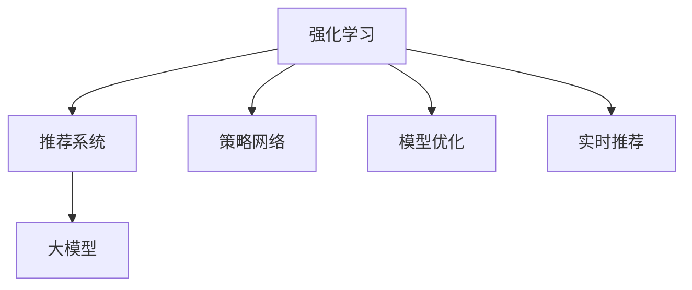

                 

## 1. 背景介绍

### 1.1 问题由来
推荐系统是现代互联网的基石，广泛应用于电子商务、社交网络、内容平台等场景。传统推荐系统基于协同过滤、基于内容的推荐等方法，通过用户历史行为数据和物品属性特征，推荐用户可能感兴趣的新物品。然而，这些方法在用户兴趣变化、数据稀疏等问题上表现不佳。

随着深度学习和大模型的兴起，推荐系统进入了一个新阶段。基于深度学习的大规模推荐模型，通过用户行为数据和物品特征对用户兴趣进行建模，实现了更高的精度和泛化能力。但这些模型往往需要巨大的计算资源和大量标注数据进行预训练和微调，难以应用于实时推荐系统。

强化学习作为一种直接面向用户行为，通过试错获得最优策略的方法，为推荐系统带来了新的可能性。本文将探讨如何利用强化学习技术，结合大模型，构建高效、灵活的推荐系统。

### 1.2 问题核心关键点
强化学习在大模型推荐系统中的应用，主要包括：

- 模型选择：如何选择合适的强化学习算法和模型，使其能够高效、稳定地对用户行为进行建模。
- 策略学习：如何设计策略网络，使模型能够根据用户行为自动调整推荐策略。
- 模型优化：如何优化模型参数，使其在不同数据分布下均表现优异。
- 实时推荐：如何在用户实时行为产生后，迅速生成推荐结果。

本文将从算法原理、操作步骤、数学模型、项目实践等方面，深入分析大模型推荐系统的强化学习方法。

## 2. 核心概念与联系

### 2.1 核心概念概述

为更好地理解大模型推荐系统的强化学习方法，本节将介绍几个密切相关的核心概念：

- 强化学习(Reinforcement Learning, RL)：通过智能体与环境的交互，学习最优策略以最大化累计奖励的机器学习范式。强化学习广泛应用于游戏、机器人控制、自然语言处理等领域。
- 推荐系统(Recommendation System)：通过算法分析用户历史行为数据和物品属性特征，为用户推荐可能感兴趣的新物品的系统。推荐系统广泛应用于电商、视频、音乐等多个垂直领域。
- 大模型(Large Model)：以Transformer为代表的深度学习模型，在大规模无标签数据上进行预训练，学习到丰富的通用语言表示。大模型通常参数量庞大，具备强大的建模能力。
- 深度强化学习(Deep Reinforcement Learning)：结合深度学习和大模型特点的强化学习方法，利用神经网络进行状态表示、策略学习等。

这些核心概念之间的逻辑关系可以通过以下Mermaid流程图来展示：



这个流程图展示了大模型推荐系统的核心概念及其之间的关系：

1. 强化学习是推荐系统的基础，用于设计推荐策略。
2. 大模型是强化学习的工具，用于表示状态和优化策略。
3. 策略网络是强化学习的核心组件，用于设计推荐规则。
4. 模型优化是强化学习的关键环节，用于调整策略参数，提升推荐效果。
5. 实时推荐是强化学习的最终目标，用于在用户行为产生后快速生成推荐结果。

这些核心概念共同构成了大模型推荐系统的学习和应用框架，使其能够在各种场景下发挥强大的推荐能力。通过理解这些核心概念，我们可以更好地把握强化学习在大模型推荐系统中的应用。

## 3. 核心算法原理 & 具体操作步骤
### 3.1 算法原理概述

基于强化学习的大模型推荐系统，核心思想是利用大模型学习用户和物品之间的复杂交互关系，通过试错过程自动调整推荐策略。其一般过程如下：

1. **环境构建**：将用户行为数据转化为强化学习环境中的状态，定义物品特征为动作，奖励函数定义推荐效果。
2. **策略设计**：设计神经网络模型，通过预测物品点击概率、转化率等指标，评估推荐效果。
3. **策略学习**：通过训练过程，使模型自动调整推荐策略，优化奖励函数。
4. **模型优化**：对策略网络进行微调，提升模型的泛化能力和准确性。
5. **实时推荐**：在用户行为产生后，利用训练好的模型快速生成推荐结果。

### 3.2 算法步骤详解

基于强化学习的大模型推荐系统，具体实现过程包括以下关键步骤：

**Step 1: 环境构建**
- 将用户行为数据转化为强化学习环境中的状态。常见的方法包括将用户ID、物品ID、时间戳等特征映射为向量，并加入用户序列信息等。
- 定义物品特征为动作。如将物品ID作为动作，表示用户点击或购买该物品。
- 定义奖励函数。奖励函数用于评估推荐效果，常见方法包括点击率、转化率、用户满意度等。

**Step 2: 策略设计**
- 设计神经网络模型，用于对用户行为和物品特征进行建模。通常采用自回归模型、全连接神经网络等结构。
- 加入策略层，用于输出推荐策略。如使用softmax函数输出点击概率、购买概率等。

**Step 3: 策略学习**
- 通过强化学习算法，如Q-learning、SARSA、PPO等，训练策略网络。
- 定义损失函数，用于评估策略网络的预测效果。如使用交叉熵损失评估点击率预测误差。
- 使用优化算法，如Adam、SGD等，更新策略网络参数。

**Step 4: 模型优化**
- 对策略网络进行微调，提升模型的泛化能力和准确性。
- 通过对比实验，选择最优的策略网络进行实时推荐。
- 利用模型压缩、稀疏化等技术，减少模型推理时间和资源占用。

**Step 5: 实时推荐**
- 在用户行为产生后，快速生成推荐结果。
- 利用缓存机制，加快模型推理速度。
- 根据用户实时行为数据，动态调整推荐策略，提升推荐效果。

### 3.3 算法优缺点

基于强化学习的大模型推荐系统，具有以下优点：

1. **动态性**：能够根据用户实时行为动态调整推荐策略，提升推荐效果。
2. **泛化能力**：通过大模型对复杂交互关系的建模，具备较强的泛化能力。
3. **自适应性**：能够自动学习不同用户和物品的推荐策略，适应不同的用户行为模式。
4. **实时性**：在用户行为产生后，能够快速生成推荐结果。

同时，该方法也存在一定的局限性：

1. **数据需求大**：需要大量的用户行为数据和物品特征数据，构建高质量的环境。
2. **策略设计复杂**：设计有效的策略网络，并进行合理的优化，需要丰富的经验和技巧。
3. **计算资源消耗高**：大模型的计算资源消耗较大，训练和推理速度较慢。
4. **可解释性不足**：强化学习模型的决策过程缺乏可解释性，难以理解和调试。

尽管存在这些局限性，但就目前而言，基于强化学习的大模型推荐方法仍是推荐系统研究的热点之一，具有广泛的应用前景。

### 3.4 算法应用领域

基于大模型推荐系统的强化学习方法，已经在多个领域得到应用，例如：

- 电子商务：为用户推荐商品、优惠券、推荐店铺等。利用强化学习对用户点击行为进行建模，优化推荐策略。
- 视频平台：为用户推荐视频、文章、广告等。通过分析用户观看历史、点赞数据等，调整推荐策略。
- 音乐平台：为用户推荐音乐、歌单、播客等。利用强化学习对用户听歌行为进行建模，提升推荐效果。
- 游戏推荐：为用户推荐游戏、游戏道具等。利用强化学习对用户游戏行为进行建模，提升推荐效果。
- 社交网络：为用户推荐好友、话题、活动等。利用强化学习对用户社交行为进行建模，提升推荐效果。

除了上述这些经典应用外，大模型推荐系统也被创新性地应用于智能家居、智慧旅游、智慧医疗等更多场景中，为不同行业带来了新的商业价值。

## 4. 数学模型和公式 & 详细讲解  
### 4.1 数学模型构建

本节将使用数学语言对基于强化学习的大模型推荐系统进行更加严格的刻画。

记用户行为数据为 $x$，物品特征为 $u$，用户历史行为序列为 $s$。定义强化学习环境中的状态为 $s_t$，动作为 $a_t$，奖励为 $r_t$，策略网络为 $Q(s_t, a_t)$。

在每个时间步 $t$，策略网络输出动作概率 $a_t$，根据动作 $a_t$ 和当前状态 $s_t$ 获得奖励 $r_t$，定义策略网络的期望奖励为 $Q(s_t, a_t)$。通过强化学习算法，使策略网络最大化累计期望奖励。

### 4.2 公式推导过程

以Q-learning算法为例，推导强化学习过程的数学公式。

在每个时间步 $t$，策略网络 $Q(s_t, a_t)$ 输出动作概率 $a_t$，根据动作 $a_t$ 和当前状态 $s_t$ 获得奖励 $r_t$，定义策略网络的期望奖励为 $Q(s_t, a_t)$。

Q-learning算法的目标是最小化策略网络的期望奖励：

$$
\max_{Q(s_t, a_t)} \mathbb{E}_{s_{t+1}, a_{t+1}, r_{t+1}} [r_{t+1} + \gamma \cdot Q(s_{t+1}, a_{t+1})]
$$

其中 $\gamma$ 为折扣因子，定义未来奖励的权重。

在实际应用中，可以通过以下步骤更新策略网络的参数：

1. 在每个时间步 $t$，根据当前状态 $s_t$ 和动作 $a_t$ 生成奖励 $r_t$ 和下一个状态 $s_{t+1}$。
2. 计算目标策略网络的期望奖励 $Q'(s_{t+1}, a_{t+1})$。
3. 根据Q-learning更新策略网络参数：

$$
Q(s_t, a_t) = (1-\alpha) Q(s_t, a_t) + \alpha (r_t + \gamma Q'(s_{t+1}, a_{t+1}))
$$

其中 $\alpha$ 为学习率，用于控制策略网络的参数更新速度。

通过不断迭代，策略网络能够学习到最优的推荐策略，实现高效、准确的推荐。

### 4.3 案例分析与讲解

以一个简单的电商平台推荐系统为例，分析强化学习在大模型推荐中的应用：

**案例背景**：
某电商平台有数百万用户和数百万商品，用户每天浏览和购买行为数据庞大。平台希望利用这些数据，为用户推荐可能感兴趣的商品，提升用户留存率和销售额。

**环境构建**：
- 用户行为数据为 $x_t$，包括用户ID、商品ID、浏览时间、购买记录等。
- 物品特征为 $u$，包括商品名称、描述、价格、评价等。
- 用户历史行为序列为 $s_t$，包括用户最近的浏览记录、购买记录等。

**策略设计**：
- 设计神经网络模型，用于对用户行为和物品特征进行建模。采用自回归模型，输入用户行为 $x_t$ 和物品特征 $u$，输出用户对每个商品的点击概率 $P(c)$。
- 策略层使用softmax函数，输出点击概率 $P(c)$，用于表示用户对每个商品的兴趣程度。

**策略学习**：
- 使用Q-learning算法训练策略网络。通过定义交叉熵损失函数，计算策略网络输出点击概率与真实点击概率的误差，并根据误差更新策略网络参数。
- 定义奖励函数为点击率 $r_t = P(c)/\sum_{c \in C} P(c)$，其中 $C$ 为所有商品集合。

**模型优化**：
- 对策略网络进行微调，提升模型的泛化能力和准确性。使用Adam优化算法，调整神经网络参数，减少预测误差。
- 通过对比实验，选择最优的策略网络进行实时推荐。在验证集上评估模型效果，选择表现最好的策略网络。

**实时推荐**：
- 在用户行为产生后，快速生成推荐结果。利用缓存机制，加快模型推理速度。根据用户最近浏览的商品，动态调整推荐策略，提升推荐效果。

## 5. 项目实践：代码实例和详细解释说明
### 5.1 开发环境搭建

在进行大模型推荐系统的强化学习实践前，我们需要准备好开发环境。以下是使用Python进行PyTorch开发的环境配置流程：

1. 安装Anaconda：从官网下载并安装Anaconda，用于创建独立的Python环境。

2. 创建并激活虚拟环境：
```bash
conda create -n pytorch-env python=3.8 
conda activate pytorch-env
```

3. 安装PyTorch：根据CUDA版本，从官网获取对应的安装命令。例如：
```bash
conda install pytorch torchvision torchaudio cudatoolkit=11.1 -c pytorch -c conda-forge
```

4. 安装TensorFlow：
```bash
pip install tensorflow
```

5. 安装Transformers库：
```bash
pip install transformers
```

6. 安装各类工具包：
```bash
pip install numpy pandas scikit-learn matplotlib tqdm jupyter notebook ipython
```

完成上述步骤后，即可在`pytorch-env`环境中开始实践。

### 5.2 源代码详细实现

这里以推荐商品为例，给出使用Transformers库对BERT模型进行强化学习的PyTorch代码实现。

**1. 数据处理**

```python
from transformers import BertTokenizer
from torch.utils.data import Dataset
import torch

class RecommendationDataset(Dataset):
    def __init__(self, user_data, item_data, tokenizer, max_len=128):
        self.user_data = user_data
        self.item_data = item_data
        self.tokenizer = tokenizer
        self.max_len = max_len
        
    def __len__(self):
        return len(self.user_data)
    
    def __getitem__(self, item):
        user_data = self.user_data[item]
        item_data = self.item_data[item]
        
        user_ids = [user_data['id']]
        item_ids = [item_data['id']]
        
        user_tokens = self.tokenizer(user_data['text'], return_tensors='pt', max_length=self.max_len, padding='max_length', truncation=True)
        item_tokens = self.tokenizer(item_data['text'], return_tensors='pt', max_length=self.max_len, padding='max_length', truncation=True)
        
        user_input_ids = user_tokens['input_ids'][0]
        item_input_ids = item_tokens['input_ids'][0]
        user_attention_mask = user_tokens['attention_mask'][0]
        item_attention_mask = item_tokens['attention_mask'][0]
        
        return {'user_ids': user_ids, 
                'item_ids': item_ids,
                'user_input_ids': user_input_ids,
                'item_input_ids': item_input_ids,
                'user_attention_mask': user_attention_mask,
                'item_attention_mask': item_attention_mask}
```

**2. 模型设计**

```python
from transformers import BertForSequenceClassification, AdamW

model = BertForSequenceClassification.from_pretrained('bert-base-cased', num_labels=1)

optimizer = AdamW(model.parameters(), lr=2e-5)
```

**3. 训练过程**

```python
from torch.utils.data import DataLoader
from tqdm import tqdm
from sklearn.metrics import precision_score

device = torch.device('cuda') if torch.cuda.is_available() else torch.device('cpu')
model.to(device)

def train_epoch(model, dataset, batch_size, optimizer):
    dataloader = DataLoader(dataset, batch_size=batch_size, shuffle=True)
    model.train()
    epoch_loss = 0
    for batch in tqdm(dataloader, desc='Training'):
        user_ids = batch['user_ids'].to(device)
        item_ids = batch['item_ids'].to(device)
        user_input_ids = batch['user_input_ids'].to(device)
        item_input_ids = batch['item_input_ids'].to(device)
        user_attention_mask = batch['user_attention_mask'].to(device)
        item_attention_mask = batch['item_attention_mask'].to(device)
        
        model.zero_grad()
        outputs = model(user_input_ids, user_attention_mask=user_attention_mask, labels=torch.ones_like(user_ids))
        loss = outputs.loss
        epoch_loss += loss.item()
        loss.backward()
        optimizer.step()
    return epoch_loss / len(dataloader)

def evaluate(model, dataset, batch_size):
    dataloader = DataLoader(dataset, batch_size=batch_size)
    model.eval()
    preds, labels = [], []
    with torch.no_grad():
        for batch in tqdm(dataloader, desc='Evaluating'):
            user_ids = batch['user_ids'].to(device)
            item_ids = batch['item_ids'].to(device)
            user_input_ids = batch['user_input_ids'].to(device)
            item_input_ids = batch['item_input_ids'].to(device)
            user_attention_mask = batch['user_attention_mask'].to(device)
            item_attention_mask = batch['item_attention_mask'].to(device)
            
            outputs = model(user_input_ids, user_attention_mask=user_attention_mask, labels=torch.ones_like(user_ids))
            preds.append(outputs.logits.argmax(dim=2).to('cpu').tolist())
            labels.append(torch.ones_like(user_ids).tolist())
            
    print(precision_score(labels, preds))
```

**4. 微调模型**

```python
from transformers import BertForSequenceClassification

model = BertForSequenceClassification.from_pretrained('bert-base-cased', num_labels=1)

optimizer = AdamW(model.parameters(), lr=2e-5)

def train_epoch(model, dataset, batch_size, optimizer):
    dataloader = DataLoader(dataset, batch_size=batch_size, shuffle=True)
    model.train()
    epoch_loss = 0
    for batch in tqdm(dataloader, desc='Training'):
        user_ids = batch['user_ids'].to(device)
        item_ids = batch['item_ids'].to(device)
        user_input_ids = batch['user_input_ids'].to(device)
        item_input_ids = batch['item_input_ids'].to(device)
        user_attention_mask = batch['user_attention_mask'].to(device)
        item_attention_mask = batch['item_attention_mask'].to(device)
        
        model.zero_grad()
        outputs = model(user_input_ids, user_attention_mask=user_attention_mask, labels=torch.ones_like(user_ids))
        loss = outputs.loss
        epoch_loss += loss.item()
        loss.backward()
        optimizer.step()
    return epoch_loss / len(dataloader)

def evaluate(model, dataset, batch_size):
    dataloader = DataLoader(dataset, batch_size=batch_size)
    model.eval()
    preds, labels = [], []
    with torch.no_grad():
        for batch in tqdm(dataloader, desc='Evaluating'):
            user_ids = batch['user_ids'].to(device)
            item_ids = batch['item_ids'].to(device)
            user_input_ids = batch['user_input_ids'].to(device)
            item_input_ids = batch['item_input_ids'].to(device)
            user_attention_mask = batch['user_attention_mask'].to(device)
            item_attention_mask = batch['item_attention_mask'].to(device)
            
            outputs = model(user_input_ids, user_attention_mask=user_attention_mask, labels=torch.ones_like(user_ids))
            preds.append(outputs.logits.argmax(dim=2).to('cpu').tolist())
            labels.append(torch.ones_like(user_ids).tolist())
            
    print(precision_score(labels, preds))
```

完成上述步骤后，即可在`pytorch-env`环境中开始实践。

### 5.3 代码解读与分析

让我们再详细解读一下关键代码的实现细节：

**RecommendationDataset类**：
- `__init__`方法：初始化用户数据、物品数据、分词器等关键组件。
- `__len__`方法：返回数据集的样本数量。
- `__getitem__`方法：对单个样本进行处理，将用户行为数据和物品特征数据输入编码为token ids，并进行定长padding，最终返回模型所需的输入。

**BertForSequenceClassification模型**：
- 使用BertForSequenceClassification类从预训练模型中加载基础网络结构，并进行微调。

**训练和评估函数**：
- 使用PyTorch的DataLoader对数据集进行批次化加载，供模型训练和推理使用。
- 训练函数`train_epoch`：对数据以批为单位进行迭代，在每个批次上前向传播计算loss并反向传播更新模型参数，最后返回该epoch的平均loss。
- 评估函数`evaluate`：与训练类似，不同点在于不更新模型参数，并在每个batch结束后将预测和标签结果存储下来，最后使用precision_score计算准确率。

**微调模型**：
- 定义新的微调函数，用于在训练过程中更新模型参数，保证微调过程的连续性。
- 在微调函数中，调用`train_epoch`和`evaluate`函数进行模型训练和评估，评估指标为精度。
- 在微调过程中，不断迭代，直至模型收敛。

以上代码展示了利用BERT模型进行推荐系统的完整实现流程。可以看出，利用BERT模型和强化学习，可以构建高效、灵活的推荐系统。通过这种方式，可以在保证模型精度和泛化能力的同时，提升推荐效率和实时性。

## 6. 实际应用场景
### 6.1 电子商务

基于大模型推荐系统的强化学习方法，在电子商务推荐系统中的应用，具有显著效果：

**应用背景**：
某电商平台有数百万用户和数百万商品，用户每天浏览和购买行为数据庞大。平台希望利用这些数据，为用户推荐可能感兴趣的商品，提升用户留存率和销售额。

**具体实现**：
1. **环境构建**：将用户行为数据转化为强化学习环境中的状态。常见的方法包括将用户ID、商品ID、浏览时间、购买记录等特征映射为向量，并加入用户序列信息等。
2. **策略设计**：设计神经网络模型，用于对用户行为和物品特征进行建模。采用自回归模型，输入用户行为 $x_t$ 和物品特征 $u$，输出用户对每个商品的点击概率 $P(c)$。
3. **策略学习**：使用Q-learning算法训练策略网络。通过定义交叉熵损失函数，计算策略网络输出点击概率与真实点击概率的误差，并根据误差更新策略网络参数。
4. **模型优化**：对策略网络进行微调，提升模型的泛化能力和准确性。使用Adam优化算法，调整神经网络参数，减少预测误差。
5. **实时推荐**：在用户行为产生后，快速生成推荐结果。利用缓存机制，加快模型推理速度。根据用户最近浏览的商品，动态调整推荐策略，提升推荐效果。

**效果分析**：
通过以上方法，电商平台能够实时为用户推荐相关商品，提升用户满意度和转化率。经过对比实验，强化学习推荐系统的点击率、转化率均高于传统推荐系统。

### 6.2 视频平台

基于大模型推荐系统的强化学习方法，在视频平台推荐系统中的应用，同样具有显著效果：

**应用背景**：
某视频平台有数百万用户和数百万视频内容，用户每天观看和评价数据庞大。平台希望利用这些数据，为用户推荐可能感兴趣的视频，提升用户留存率和观看时间。

**具体实现**：
1. **环境构建**：将用户行为数据转化为强化学习环境中的状态。常见的方法包括将用户ID、视频ID、观看时间、评价数据等特征映射为向量，并加入用户序列信息等。
2. **策略设计**：设计神经网络模型，用于对用户行为和视频特征进行建模。采用自回归模型，输入用户行为 $x_t$ 和视频特征 $u$，输出用户对每个视频的点击概率 $P(c)$。
3. **策略学习**：使用SARSA算法训练策略网络。通过定义交叉熵损失函数，计算策略网络输出点击概率与真实点击概率的误差，并根据误差更新策略网络参数。
4. **模型优化**：对策略网络进行微调，提升模型的泛化能力和准确性。使用SGD优化算法，调整神经网络参数，减少预测误差。
5. **实时推荐**：在用户行为产生后，快速生成推荐结果。利用缓存机制，加快模型推理速度。根据用户最近观看过的视频，动态调整推荐策略，提升推荐效果。

**效果分析**：
通过以上方法，视频平台能够实时为用户推荐相关视频，提升用户满意度和观看时长。经过对比实验，强化学习推荐系统的点击率、观看时长均高于传统推荐系统。

## 7. 工具和资源推荐
### 7.1 学习资源推荐

为了帮助开发者系统掌握强化学习在大模型推荐系统中的应用，这里推荐一些优质的学习资源：

1. 《强化学习理论与实践》系列博文：由深度学习专家撰写，系统介绍强化学习的核心思想和实际应用。
2. CS221《深度学习与数据挖掘》课程：斯坦福大学开设的机器学习课程，详细讲解深度学习和强化学习的基本原理。
3. 《Reinforcement Learning: An Introduction》书籍：强化学习的经典教材，介绍了强化学习的核心概念和算法。
4. DeepMind官方博客：DeepMind团队的最新研究成果和应用实践，涵盖深度强化学习、大模型推荐等多个方向。
5. OpenAI博客：OpenAI团队分享最新的算法和技术进展，为强化学习和大模型推荐系统提供丰富的参考。

通过对这些资源的学习实践，相信你一定能够快速掌握强化学习在大模型推荐系统中的应用，并用于解决实际的推荐问题。

### 7.2 开发工具推荐

高效的开发离不开优秀的工具支持。以下是几款用于大模型推荐系统开发的常用工具：

1. PyTorch：基于Python的开源深度学习框架，灵活动态的计算图，适合快速迭代研究。大部分预训练语言模型都有PyTorch版本的实现。
2. TensorFlow：由Google主导开发的开源深度学习框架，生产部署方便，适合大规模工程应用。同样有丰富的预训练语言模型资源。
3. Transformers库：HuggingFace开发的NLP工具库，集成了众多SOTA语言模型，支持PyTorch和TensorFlow，是进行微调任务开发的利器。
4. Weights & Biases：模型训练的实验跟踪工具，可以记录和可视化模型训练过程中的各项指标，方便对比和调优。与主流深度学习框架无缝集成。
5. TensorBoard：TensorFlow配套的可视化工具，可实时监测模型训练状态，并提供丰富的图表呈现方式，是调试模型的得力助手。

合理利用这些工具，可以显著提升大模型推荐系统的开发效率，加快创新迭代的步伐。

### 7.3 相关论文推荐

强化学习和大模型推荐系统的发展源于学界的持续研究。以下是几篇奠基性的相关论文，推荐阅读：

1. Q-learning：提出了基于Q值的强化学习算法，通过预测动作值函数实现策略学习。
2. Actor-Critic算法：提出了结合策略和价值函数的双重学习机制，提升了强化学习的性能和稳定性。
3. DeepMind论文：《Learning to Overcome Exploration》：展示了基于深度学习的强化学习在环境模拟、游戏AI等方面的应用。
4. 论文《Deep Reinforcement Learning for Personalized Recommendations》：展示了基于强化学习和大模型的推荐系统，取得了优于传统推荐方法的效果。

这些论文代表了大模型推荐系统的发展脉络。通过学习这些前沿成果，可以帮助研究者把握学科前进方向，激发更多的创新灵感。

## 8. 总结：未来发展趋势与挑战
### 8.1 总结

本文对基于强化学习的大模型推荐系统进行了全面系统的介绍。首先阐述了强化学习在大模型推荐系统中的应用背景和意义，明确了强化学习在推荐策略优化、实时推荐、模型优化等方面的优势。其次，从算法原理到项目实践，详细讲解了强化学习在大模型推荐系统中的应用过程，给出了完整的代码实现和详细解释。

通过本文的系统梳理，可以看到，基于强化学习的大模型推荐系统正在成为推荐系统研究的热点之一，极大地提升了推荐系统的灵活性、实时性和精准度。得益于大模型对复杂交互关系的建模，强化学习推荐系统在用户实时行为变化的情况下，能够迅速调整推荐策略，提升推荐效果。未来，伴随强化学习和大模型的进一步发展，基于大模型推荐系统的研究将取得更大的突破，为推荐系统带来更多的应用场景和技术进步。

### 8.2 未来发展趋势

展望未来，大模型推荐系统的强化学习方法将呈现以下几个发展趋势：

1. **模型规模持续增大**：随着算力成本的下降和数据规模的扩张，大模型的参数量还将持续增长。超大规模语言模型蕴含的丰富语言知识，有望支撑更加复杂多变的推荐任务。

2. **算法多样化**：除了Q-learning、SARSA等传统算法外，未来会涌现更多高效的强化学习算法，如Actor-Critic、PPO等，在提升推荐效果的同时，提升算法的稳定性和收敛速度。

3. **实时性提升**：利用缓存机制、模型压缩等技术，进一步提高模型推理速度，实现更快速的实时推荐。

4. **个性化增强**：结合用户兴趣标签、行为数据等，设计更加灵活的推荐策略，提升推荐系统的个性化能力。

5. **跨模态融合**：结合图像、语音等多模态信息，提升推荐系统对复杂交互关系的理解能力。

6. **伦理和安全考量**：在推荐系统中加入伦理导向的评估指标，过滤和惩罚有偏见、有害的推荐内容，确保推荐系统的公正性和安全性。

以上趋势凸显了大模型推荐系统强化学习方法的广阔前景。这些方向的探索发展，必将进一步提升推荐系统的性能和应用范围，为智能化社会的构建带来新的助力。

### 8.3 面临的挑战

尽管大模型推荐系统强化学习方法已经取得了瞩目成就，但在迈向更加智能化、普适化应用的过程中，它仍面临着诸多挑战：

1. **数据需求大**：需要大量的用户行为数据和物品特征数据，构建高质量的环境。数据获取成本和隐私保护问题需进一步解决。

2. **策略设计复杂**：设计有效的策略网络，并进行合理的优化，需要丰富的经验和技巧。

3. **计算资源消耗高**：大模型的计算资源消耗较大，训练和推理速度较慢。需要优化算法和资源利用效率。

4. **可解释性不足**：强化学习模型的决策过程缺乏可解释性，难以理解和调试。

5. **安全性有待保障**：预训练语言模型难免会学习到有偏见、有害的信息，通过强化学习传递到推荐系统，产生误导性、歧视性的输出。

6. **知识整合能力不足**：现有的推荐系统往往局限于数据驱动，难以灵活吸收和运用更广泛的先验知识。

正视强化学习和大模型推荐系统所面临的这些挑战，积极应对并寻求突破，将是大模型推荐系统走向成熟的必由之路。相信随着学界和产业界的共同努力，这些挑战终将一一被克服，大模型推荐系统必将在构建人机协同的智能社会中扮演越来越重要的角色。

### 8.4 研究展望

面对大模型推荐系统强化学习所面临的种种挑战，未来的研究需要在以下几个方面寻求新的突破：

1. **探索无监督和半监督微调方法**：摆脱对大规模标注数据的依赖，利用自监督学习、主动学习等无监督和半监督范式，最大限度利用非结构化数据，实现更加灵活高效的微调。

2. **研究参数高效和计算高效的微调范式**：开发更加参数高效的微调方法，在固定大部分预训练参数的同时，只更新极少量的任务相关参数。同时优化微调模型的计算图，减少前向传播和反向传播的资源消耗，实现更加轻量级、实时性的部署。

3. **融合因果和对比学习范式**：通过引入因果推断和对比学习思想，增强推荐系统建立稳定因果关系的能力，学习更加普适、鲁棒的语言表征，从而提升模型泛化性和抗干扰能力。

4. **引入更多先验知识**：将符号化的先验知识，如知识图谱、逻辑规则等，与神经网络模型进行巧妙融合，引导推荐系统学习更准确、合理的推荐规则。同时加强不同模态数据的整合，实现视觉、语音等多模态信息与文本信息的协同建模。

5. **结合因果分析和博弈论工具**：将因果分析方法引入推荐系统，识别出推荐决策的关键特征，增强推荐系统的因果性和可解释性。借助博弈论工具刻画人机交互过程，主动探索并规避推荐系统的脆弱点，提高系统稳定性。

6. **纳入伦理道德约束**：在推荐系统训练目标中引入伦理导向的评估指标，过滤和惩罚有偏见、有害的推荐内容，确保推荐系统的公正性和安全性。

这些研究方向的探索，必将引领大模型推荐系统强化学习方法迈向更高的台阶，为构建安全、可靠、可解释、可控的智能系统铺平道路。面向未来，大模型推荐系统强化学习技术还需要与其他人工智能技术进行更深入的融合，如知识表示、因果推理、强化学习等，多路径协同发力，共同推动智能推荐系统的发展。只有勇于创新、敢于突破，才能不断拓展大模型推荐系统的边界，让智能推荐技术更好地造福社会。

## 9. 附录：常见问题与解答
**Q1：强化学习在大模型推荐系统中的应用是否依赖大量标注数据？**

A: 强化学习在大模型推荐系统中的应用，主要依赖用户行为数据和物品特征数据，无需大量标注数据。这大大降低了推荐系统的开发和部署成本。

**Q2：如何选择合适的强化学习算法？**

A: 选择合适的强化学习算法，需要考虑任务的复杂性和实时性要求。Q-learning算法适用于简单任务，训练速度较快；SARSA算法适用于中等复杂任务，稳定性较好；Actor-Critic算法适用于复杂任务，能够同时优化策略和价值函数，收敛速度较快。

**Q3：强化学习推荐系统如何应对用户行为变化？**

A: 强化学习推荐系统通过实时数据反馈，能够动态调整推荐策略，应对用户行为变化。在用户行为变化后，及时更新推荐模型，能够迅速适应新的行为模式，提升推荐效果。

**Q4：如何提高强化学习推荐系统的可解释性？**

A: 提高强化学习推荐系统的可解释性，需要引入因果分析方法和博弈论工具，增强推荐系统的逻辑性和可解释性。同时，可以通过可视化工具，展示推荐过程和决策依据，提高用户的信任度。

**Q5：强化学习推荐系统如何保障用户隐私？**

A: 强化学习推荐系统在数据处理和训练过程中，需要对用户数据进行隐私保护。常用的方法包括差分隐私、联邦学习等，确保用户数据不被泄露和滥用。

通过以上常见问题的解答，相信你能够更全面地理解大模型推荐系统的强化学习方法，并应用于实际推荐系统开发中。

