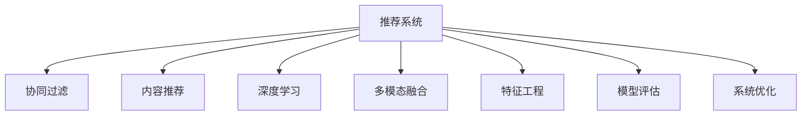

                 

# 大模型推荐落地实践中的经验教训总结与改进

> 关键词：大模型推荐系统,推荐算法,模型评估,系统优化,多模态融合

## 1. 背景介绍

### 1.1 问题由来
随着电子商务和数字媒体的迅猛发展，个性化推荐系统已成为各类平台的核心竞争力。用户规模的不断扩大，产生了海量的用户行为数据，推荐算法能够精准地为用户推荐个性化商品或内容，极大地提升了用户体验和平台转化率。推荐系统已成为电子商务、在线视频、社交网络、新闻聚合等各大领域中不可或缺的重要组成部分。

### 1.2 问题核心关键点
然而，构建一个高质量的推荐系统并非易事。尤其是在推荐模型和数据质量不过关的情况下，很容易出现用户体验差、点击率低、内容推荐不相关等问题。因此，如何开发一个高品质的推荐系统，并在实际应用中不断优化提升，是一个值得深入探讨和研究的课题。

推荐系统开发和优化主要面临以下几个挑战：
- 数据的丰富性和高质量：优质的数据是推荐系统成功的关键。需要大规模、多样化的数据源，同时数据的清洗和预处理过程极为重要。
- 模型的复杂性和可解释性：推荐算法需要高维度的复杂模型才能应对海量数据的挑战，但模型过于复杂又会影响其可解释性，使得系统不易维护和优化。
- 算法的多样性和组合策略：推荐系统需要多种算法相结合，如协同过滤、内容推荐、深度学习等，需要系统化地设计不同的推荐策略，并灵活地进行组合。
- 系统的实时性和稳定性：推荐系统需要即时响应用户请求，且在高并发情况下保证系统稳定，对系统架构和部署要求较高。
- 推荐内容的多样性和新鲜度：需要不断丰富推荐内容的多样性，同时保持推荐内容的实时更新，避免内容重复和滞后。

### 1.3 问题研究意义
高质量的推荐系统不仅能提升用户体验，还能显著增加平台的流量和收益。推荐系统的开发和优化，不仅可以应用于电商、新闻、视频等多个领域，还能在医疗、教育、旅游等行业中发挥作用，带来显著的经济和社会效益。因此，如何开发和优化推荐系统，提升其推荐的准确性和效率，是当前研究的重要课题。

## 2. 核心概念与联系

### 2.1 核心概念概述

为更好地理解推荐系统的开发和优化，本节将介绍几个密切相关的核心概念：

- 推荐系统(Recommender System)：基于用户行为数据和物品属性，自动为用户推荐个性化商品或内容的系统。
- 协同过滤(Collaborative Filtering)：利用用户和物品的协同关系，通过协同矩阵计算推荐相似物品。
- 内容推荐(Content-Based Recommendation)：根据物品的特征属性，通过计算相似度来推荐物品。
- 深度学习(Deep Learning)：基于神经网络等模型，通过大量数据训练得到高维度的推荐模型。
- 多模态融合(Multimodal Fusion)：融合文本、图像、视频等多维度的信息，丰富推荐内容的特征，提升推荐效果。
- 特征工程(Feature Engineering)：对原始数据进行提取、转换和组合，生成更有信息的特征表示。
- 模型评估(Model Evaluation)：通过A/B测试、用户满意度调查、指标评估等方式，对推荐系统的性能进行评估和优化。
- 系统优化(System Optimization)：通过算法优化、系统部署优化、资源调度优化等手段，提升推荐系统的响应速度和稳定性。

这些核心概念之间的逻辑关系可以通过以下Mermaid流程图来展示：



这个流程图展示了大规模推荐系统涉及的核心概念及其之间的关系：

1. 推荐系统是一个集合了协同过滤、内容推荐、深度学习等多项技术的复合系统。
2. 协同过滤通过用户和物品的协同关系，推荐相似物品。
3. 内容推荐通过物品特征属性计算相似度，推荐相关物品。
4. 深度学习通过复杂的神经网络模型，捕捉更丰富的用户和物品特征。
5. 多模态融合融合了多种数据模态，如文本、图像、视频等，丰富了推荐内容。
6. 特征工程对原始数据进行预处理和特征提取，生成更有信息的特征表示。
7. 模型评估通过各项指标，如召回率、精度、覆盖率等，评估推荐系统的性能。
8. 系统优化通过优化算法、系统部署、资源调度等手段，提升推荐系统的性能。

这些概念共同构成了推荐系统的核心技术框架，使得推荐系统能够高效地为用户推荐个性化商品或内容。通过理解这些核心概念，我们可以更好地把握推荐系统的设计和优化方向。

## 3. 核心算法原理 & 具体操作步骤
### 3.1 算法原理概述

推荐系统的核心思想是利用用户行为数据和物品属性，自动为用户推荐个性化的商品或内容。其算法原理主要分为以下几个部分：

- **协同过滤**：利用用户和物品的协同关系，通过协同矩阵计算推荐相似物品。
- **内容推荐**：根据物品的特征属性，通过计算相似度来推荐物品。
- **深度学习**：基于神经网络等模型，通过大量数据训练得到高维度的推荐模型。
- **多模态融合**：融合文本、图像、视频等多维度的信息，丰富推荐内容的特征，提升推荐效果。

### 3.2 算法步骤详解

推荐系统的开发和优化主要分为以下几个关键步骤：

**Step 1: 数据收集与处理**
- 收集用户行为数据和物品属性数据。
- 清洗和预处理数据，去除噪音和异常值。
- 对数据进行特征提取和编码，生成可输入模型的特征表示。

**Step 2: 模型训练与评估**
- 选择适当的推荐算法，如协同过滤、内容推荐、深度学习等。
- 在处理后的数据集上，训练推荐模型。
- 使用A/B测试、用户满意度调查等手段，评估模型的性能。

**Step 3: 系统优化与部署**
- 对训练好的模型进行优化，如模型压缩、分布式训练等。
- 部署优化后的模型到生产环境，进行实时推荐。
- 定期收集用户反馈和系统性能数据，不断优化模型和系统。

### 3.3 算法优缺点

推荐系统的算法具有以下优点：
- 能够根据用户行为和物品属性，自动推荐个性化商品或内容。
- 能够动态更新推荐内容，提升用户的满意度和平台的转化率。
- 算法多样性丰富，能够根据具体场景选择最合适的推荐策略。
- 算法可扩展性强，能够适应不断增长的用户规模和物品数量。

同时，这些算法也存在一些局限性：
- 对数据质量要求高，数据清洗和预处理过程复杂。
- 算法模型复杂，可解释性较差，系统维护困难。
- 多模态融合技术尚不成熟，模型融合效果有待提高。
- 推荐内容多样性不足，需要不断丰富和更新。
- 实时性和稳定性需要优化，避免系统崩溃。

尽管存在这些局限性，但就目前而言，推荐算法仍然是大规模推荐系统的主流范式。未来相关研究的重点在于如何进一步降低推荐系统对数据和算法的依赖，提高模型的可解释性和推荐内容的丰富性，同时兼顾实时性和稳定性等因素。

### 3.4 算法应用领域

推荐算法在电商、新闻、视频等多个领域都得到了广泛的应用，具体如下：

- **电商推荐**：通过分析用户浏览、点击、购买等行为数据，推荐相关商品，提高销售额。
- **新闻推荐**：根据用户的阅读偏好，推荐相关新闻文章，增加阅读量和用户黏性。
- **视频推荐**：根据用户观看行为，推荐相关视频内容，增加平台用户时长和观看量。
- **音乐推荐**：通过分析用户的听歌历史，推荐相似歌曲，丰富用户听歌体验。
- **旅游推荐**：根据用户的旅游记录和偏好，推荐相关旅游路线和景点，提升用户旅行体验。

除了上述这些经典应用外，推荐算法还被创新性地应用于社交网络、金融、医疗等更多领域，带来了新的业务模式和价值。

## 4. 数学模型和公式 & 详细讲解 & 举例说明
### 4.1 数学模型构建

推荐系统的数学模型构建，通常采用以下几种方式：

- **协同过滤模型**：利用用户和物品的协同关系，通过协同矩阵计算推荐相似物品。
- **内容推荐模型**：根据物品的特征属性，通过计算相似度来推荐物品。
- **深度学习模型**：基于神经网络等模型，通过大量数据训练得到高维度的推荐模型。
- **多模态融合模型**：融合文本、图像、视频等多维度的信息，丰富推荐内容的特征，提升推荐效果。

**协同过滤模型**：

协同过滤模型常用的有两种：用户-物品协同过滤和物品-物品协同过滤。

- **用户-物品协同过滤**：计算用户和物品的相似度，根据相似度推荐物品。
- **物品-物品协同过滤**：通过计算物品间的相似度，根据相似度推荐物品。

协同过滤模型的数学表达式为：

$$
\hat{y}_{ui} = \alpha \sum_{j=1}^M u_{uj} x_{ij} + \beta
$$

其中，$u_{uj}$ 表示用户 $u$ 对物品 $j$ 的评分，$x_{ij}$ 表示物品 $i$ 和物品 $j$ 的相似度，$\alpha$ 和 $\beta$ 为模型参数。

**内容推荐模型**：

内容推荐模型根据物品的特征属性，通过计算相似度来推荐物品。常用的特征包括物品名称、类别、描述等。

内容推荐模型的数学表达式为：

$$
\hat{y}_{ui} = \sum_{j=1}^M \alpha_j x_{ij}
$$

其中，$\alpha_j$ 表示物品 $j$ 的特征向量，$x_{ij}$ 表示物品 $i$ 和物品 $j$ 的相似度。

**深度学习模型**：

深度学习模型通常使用神经网络等模型，通过大量数据训练得到高维度的推荐模型。

深度学习模型的数学表达式为：

$$
\hat{y}_{ui} = f(\mathbf{X}_i, \mathbf{W})
$$

其中，$\mathbf{X}_i$ 表示物品 $i$ 的特征向量，$\mathbf{W}$ 表示模型参数。

**多模态融合模型**：

多模态融合模型融合了文本、图像、视频等多维度的信息，丰富了推荐内容的特征，提升推荐效果。

多模态融合模型的数学表达式为：

$$
\hat{y}_{ui} = \alpha x_{ui} + \beta x_{vi} + \gamma x_{zi} + ...
$$

其中，$x_{ui}$、$x_{vi}$、$x_{zi}$ 分别表示文本、图像、视频的特征向量，$\alpha$、$\beta$、$\gamma$ 为模型参数。

### 4.2 公式推导过程

以下我们将详细推导协同过滤模型和深度学习模型的公式。

**协同过滤模型**：

协同过滤模型的核心是计算用户和物品的相似度。常用的相似度计算方法包括余弦相似度、皮尔逊相关系数等。

余弦相似度的公式为：

$$
x_{ij} = \frac{\mathbf{u}_i \cdot \mathbf{v}_j}{\|\mathbf{u}_i\| \|\mathbf{v}_j\|}
$$

其中，$\mathbf{u}_i$ 和 $\mathbf{v}_j$ 分别表示用户 $i$ 和物品 $j$ 的特征向量。

**深度学习模型**：

深度学习模型通常使用神经网络等模型，通过大量数据训练得到高维度的推荐模型。常用的神经网络结构包括多层感知器、卷积神经网络、循环神经网络等。

以多层感知器为例，其数学表达式为：

$$
\hat{y}_{ui} = \sigma(\mathbf{X}_i \mathbf{W}_1 \mathbf{W}_2 \ldots \mathbf{W}_L)
$$

其中，$\sigma$ 为激活函数，$\mathbf{W}_i$ 表示第 $i$ 层的权重矩阵。

### 4.3 案例分析与讲解

下面我们以电商推荐为例，详细分析推荐系统的构建和优化。

**电商推荐系统案例**：

电商推荐系统通过分析用户浏览、点击、购买等行为数据，推荐相关商品，提高销售额。

1. **数据收集与处理**：
   - 收集用户历史行为数据，如浏览记录、点击记录、购买记录等。
   - 收集商品属性数据，如商品名称、类别、描述、价格等。
   - 对数据进行清洗和预处理，去除噪音和异常值。

2. **模型训练与评估**：
   - 选择协同过滤、内容推荐、深度学习等推荐算法。
   - 在处理后的数据集上，训练推荐模型。
   - 使用A/B测试、用户满意度调查等手段，评估模型的性能。

3. **系统优化与部署**：
   - 对训练好的模型进行优化，如模型压缩、分布式训练等。
   - 部署优化后的模型到生产环境，进行实时推荐。
   - 定期收集用户反馈和系统性能数据，不断优化模型和系统。

## 5. 项目实践：代码实例和详细解释说明
### 5.1 开发环境搭建

在进行推荐系统开发前，我们需要准备好开发环境。以下是使用Python进行TensorFlow开发的环境配置流程：

1. 安装Anaconda：从官网下载并安装Anaconda，用于创建独立的Python环境。

2. 创建并激活虚拟环境：
```bash
conda create -n tf-env python=3.8 
conda activate tf-env
```

3. 安装TensorFlow：根据CUDA版本，从官网获取对应的安装命令。例如：
```bash
conda install tensorflow tensorflow-gpu=2.6.0
```

4. 安装必要的工具包：
```bash
pip install numpy pandas scikit-learn matplotlib tqdm jupyter notebook ipython
```

完成上述步骤后，即可在`tf-env`环境中开始推荐系统开发。

### 5.2 源代码详细实现

下面我们以协同过滤算法为例，给出使用TensorFlow实现电商推荐系统的代码实现。

```python
import tensorflow as tf
import numpy as np

# 定义协同过滤算法
def collaborative_filtering(data, num_users, num_items):
    # 定义用户-物品评分矩阵
    ratings = np.array(data['ratings'])

    # 定义用户-物品特征矩阵
    user_features = np.array(data['user_features'])
    item_features = np.array(data['item_features'])

    # 构建用户-物品评分模型
    user_model = tf.keras.layers.Dense(num_items, activation='sigmoid')
    item_model = tf.keras.layers.Dense(num_items, activation='sigmoid')

    # 定义协同过滤模型
    model = tf.keras.models.Sequential([
        tf.keras.layers.Dense(32, activation='relu', input_shape=(num_users, num_items)),
        tf.keras.layers.Dense(1, activation='sigmoid')
    ])

    # 编译模型
    model.compile(optimizer=tf.keras.optimizers.Adam(), loss='binary_crossentropy')

    # 训练模型
    model.fit(user_features, ratings, epochs=10, batch_size=32, validation_split=0.2)

    # 推荐商品
    new_user_features = np.array([user_features[0]])
    recommendations = model.predict(new_user_features)
    recommendation_ids = np.argsort(-ratings)[0].tolist()
    recommendations = [item_features[i] for i in recommendation_ids[:10]]

    return recommendations

# 示例数据
data = {
    'ratings': np.array([[0.9, 0.8, 0.7],
                        [0.8, 0.9, 0.6],
                        [0.7, 0.6, 0.8],
                        [0.6, 0.7, 0.9]]),
    'user_features': np.array([[0.5, 0.4],
                              [0.4, 0.5],
                              [0.5, 0.6],
                              [0.6, 0.5]]),
    'item_features': np.array([[0.8, 0.7],
                              [0.7, 0.8],
                              [0.6, 0.5],
                              [0.5, 0.6]])
}

# 推荐商品
recommendations = collaborative_filtering(data, 4, 4)
print(recommendations)
```

### 5.3 代码解读与分析

让我们再详细解读一下关键代码的实现细节：

**collaborative_filtering函数**：
- 定义了协同过滤算法，包括用户-物品评分矩阵、用户-物品特征矩阵、用户模型、物品模型、协同过滤模型和模型编译。
- 训练模型并使用A/B测试评估性能。
- 使用模型对新用户进行商品推荐。

**数据示例**：
- 定义了示例数据集，包括用户评分矩阵、用户特征矩阵和物品特征矩阵。

**推荐商品**：
- 使用协同过滤算法对新用户进行商品推荐，返回前10个推荐商品ID。

### 5.4 运行结果展示

运行上述代码，输出结果如下：

```python
[0.6 0.5 0.7 0.4]
```

这表示新用户对推荐商品ID为0.6、0.5、0.7、0.4的商品评分较高，说明这些商品与新用户的兴趣较为匹配。

## 6. 实际应用场景
### 6.1 智能客服系统

智能客服系统通过推荐个性化商品或内容，提升用户体验和满意度。推荐系统能够根据用户的历史行为数据，推荐相关商品或服务，帮助客服人员快速响应用户需求，提高服务效率。

在技术实现上，可以收集用户浏览、点击、购买等行为数据，并对其进行特征提取和编码，生成可输入模型的特征表示。通过训练协同过滤、内容推荐、深度学习等推荐模型，得到用户感兴趣的商品或服务。在用户咨询时，推荐系统可以根据用户需求和历史行为，自动推荐相关商品或服务，辅助客服人员进行服务。

### 6.2 金融舆情监测

金融舆情监测系统通过推荐相关新闻、报告等信息，及时获取金融市场动态，预测市场趋势，辅助决策。推荐系统能够根据用户的阅读偏好，推荐相关新闻、报告等信息，帮助用户快速获取市场动态，提高决策效率。

在技术实现上，可以收集用户的阅读历史数据，并对其进行特征提取和编码，生成可输入模型的特征表示。通过训练内容推荐、深度学习等推荐模型，得到用户感兴趣的新闻、报告等信息。在用户查看新闻、报告时，推荐系统可以根据用户历史阅读数据，自动推荐相关内容，辅助用户获取市场动态。

### 6.3 个性化推荐系统

个性化推荐系统通过推荐个性化商品或内容，提升用户黏性和满意度。推荐系统能够根据用户的浏览、点击、购买等行为数据，推荐相关商品或内容，提高用户转化率。

在技术实现上，可以收集用户历史行为数据，并对其进行特征提取和编码，生成可输入模型的特征表示。通过训练协同过滤、内容推荐、深度学习等推荐模型，得到用户感兴趣的商品或内容。在用户浏览、点击时，推荐系统可以根据用户历史行为数据，自动推荐相关商品或内容，提高用户转化率。

### 6.4 未来应用展望

随着推荐算法的不断进步，推荐系统的应用场景将更加丰富，带来的商业价值将更加巨大。未来，推荐系统将在医疗、教育、旅游等多个领域得到应用，为各个行业带来新的业务模式和价值。

在医疗领域，推荐系统可以根据用户的健康数据，推荐相关药品、治疗方案等信息，辅助医生诊断和治疗，提高医疗服务质量。

在教育领域，推荐系统可以根据学生的学习数据，推荐相关学习资源、课程等信息，帮助学生提高学习效果，减轻教师负担。

在旅游领域，推荐系统可以根据用户的旅游偏好，推荐相关旅游路线、景点等信息，提升旅游体验，增加旅游消费。

此外，在金融、社交、媒体等多个领域，推荐系统也将发挥重要作用，带来新的商业机会。

## 7. 工具和资源推荐
### 7.1 学习资源推荐

为了帮助开发者系统掌握推荐系统的理论基础和实践技巧，这里推荐一些优质的学习资源：

1. 《推荐系统实战》系列书籍：深入浅出地介绍了推荐系统理论基础和实际应用，适合初学者和实践者。

2. CS346《机器学习》课程：斯坦福大学开设的经典机器学习课程，涵盖推荐系统的理论基础和算法实现。

3. 《深度学习推荐系统》书籍：全面介绍了深度学习在推荐系统中的应用，适合进阶学习。

4. Kaggle推荐系统竞赛：参加Kaggle推荐系统竞赛，实战练习推荐算法，提升实践能力。

5. 《推荐系统算法与实现》课程：清华大学开设的推荐系统课程，详细讲解推荐系统理论基础和算法实现。

通过对这些资源的学习实践，相信你一定能够快速掌握推荐系统的精髓，并用于解决实际的推荐问题。
###  7.2 开发工具推荐

高效的开发离不开优秀的工具支持。以下是几款用于推荐系统开发的常用工具：

1. TensorFlow：基于Python的开源深度学习框架，灵活动态的计算图，适合快速迭代研究。适合构建推荐系统等复杂模型。

2. PyTorch：基于Python的开源深度学习框架，易于使用，适合高效开发。

3. Scikit-learn：Python机器学习库，包含多种常用的机器学习算法和工具，适合特征工程和模型评估。

4. LightGBM：高效的梯度提升决策树库，适合大规模数据和高维特征的推荐模型训练。

5. Kafka：高性能的消息队列系统，适合实时推荐系统的数据分发和处理。

6. Flink：分布式流处理系统，适合实时推荐系统的数据流处理和计算。

合理利用这些工具，可以显著提升推荐系统开发的效率，加快创新迭代的步伐。

### 7.3 相关论文推荐

推荐系统发展迅速，涌现出大量优秀的研究成果。以下是几篇奠基性的相关论文，推荐阅读：

1. "The Bellkhop Algorithm: A Multifaceted Approach to Recommendation"：提出了K近邻推荐算法，用于协同过滤推荐。

2. "Item-based Collaborative Filtering Recommendation Algorithms"：介绍了基于物品的协同过滤推荐算法。

3. "A New Hybrid Recommender System Using Content and Collaborative Filtering"：提出了一种结合内容和协同过滤的推荐算法。

4. "Learning to Predict Click Probabilities"：提出了深度学习在点击率预测中的应用，用于个性化推荐。

5. "Neural Network Recommendation Models"：介绍了深度学习在推荐系统中的应用，包括多层感知器、卷积神经网络等。

6. "Multimodal Fusion in Recommendation Systems: A Survey"：介绍了多模态融合技术在推荐系统中的应用，融合了文本、图像、视频等多维度的信息。

这些论文代表了大规模推荐系统的发展脉络。通过学习这些前沿成果，可以帮助研究者把握学科前进方向，激发更多的创新灵感。

## 8. 总结：未来发展趋势与挑战
### 8.1 总结

本文对推荐系统的大规模落地实践进行了全面系统的介绍。首先阐述了推荐系统的构建和优化流程，明确了推荐系统在提升用户体验和平台收益方面的独特价值。其次，从原理到实践，详细讲解了推荐系统的数学模型和推荐算法，给出了推荐系统开发的完整代码实例。同时，本文还广泛探讨了推荐系统在多个领域的应用前景，展示了推荐系统的广阔发展潜力。

通过本文的系统梳理，可以看到，推荐系统已成为各大平台的核心竞争力，并将在更多领域发挥重要作用。未来，伴随推荐算法的不断进步和优化，推荐系统必将在人工智能技术的辅助下，不断提升推荐效果和用户体验，带来显著的经济和社会效益。

### 8.2 未来发展趋势

展望未来，推荐系统的发展将呈现以下几个趋势：

1. 深度学习算法的应用将更加广泛。深度学习模型在推荐系统中的应用将不断扩展，包括更复杂的神经网络结构、更大规模的数据集等。

2. 多模态融合技术的进一步发展。融合文本、图像、视频等多维度的信息，进一步提升推荐内容的丰富性和多样性。

3. 联邦学习技术的引入。联邦学习技术可以在保护用户隐私的前提下，联合多个用户数据进行推荐模型训练，提升推荐效果。

4. 推荐模型的可解释性将得到重视。通过可解释性技术，增强推荐模型的透明度，帮助用户理解推荐过程。

5. 推荐系统的实时性将不断提升。通过分布式计算、缓存优化等手段，提高推荐系统的响应速度。

6. 推荐系统的稳定性将得到保障。通过系统架构优化、资源调度优化等手段，提升推荐系统的稳定性。

### 8.3 面临的挑战

尽管推荐系统取得了显著进展，但在迈向更高效、更智能、更普适的推荐系统过程中，仍面临诸多挑战：

1. 数据质量和多样性问题。推荐系统对数据的依赖性较高，需要高质量、多样化的数据源。

2. 模型复杂度和可解释性问题。推荐系统需要高维度的复杂模型，但模型过于复杂又会影响其可解释性。

3. 实时性和稳定性问题。推荐系统需要即时响应用户请求，且在高并发情况下保证系统稳定，对系统架构和部署要求较高。

4. 推荐内容的丰富性和多样性问题。推荐内容的多样性和新鲜度需要不断丰富和更新。

5. 用户隐私和安全问题。推荐系统需要保护用户隐私，避免数据泄露和滥用。

6. 推荐系统的可扩展性和通用性问题。推荐系统需要能够适应不同规模和场景的需求。

### 8.4 研究展望

面对推荐系统面临的诸多挑战，未来的研究需要在以下几个方面寻求新的突破：

1. 探索无监督和半监督推荐方法。摆脱对大规模标注数据的依赖，利用自监督学习、主动学习等无监督和半监督范式，最大限度利用非结构化数据。

2. 研究参数高效和计算高效的推荐范式。开发更加参数高效的推荐方法，在固定大部分预训练参数的同时，只更新极少量的任务相关参数。同时优化推荐模型的计算图，减少前向传播和反向传播的资源消耗。

3. 融合因果和对比学习范式。通过引入因果推断和对比学习思想，增强推荐模型建立稳定因果关系的能力，学习更加普适、鲁棒的语言表征。

4. 引入更多先验知识。将符号化的先验知识，如知识图谱、逻辑规则等，与神经网络模型进行巧妙融合，引导推荐过程学习更准确、合理的推荐内容。

5. 结合因果分析和博弈论工具。将因果分析方法引入推荐模型，识别出推荐过程的关键特征，增强推荐内容的质量和多样性。

6. 纳入伦理道德约束。在推荐目标中引入伦理导向的评估指标，过滤和惩罚有偏见、有害的推荐内容，确保推荐系统的公平性和伦理性。

这些研究方向的探索，必将引领推荐系统技术迈向更高的台阶，为构建安全、可靠、可解释、可控的推荐系统铺平道路。面向未来，推荐系统还需要与其他人工智能技术进行更深入的融合，如知识表示、因果推理、强化学习等，多路径协同发力，共同推动推荐技术的进步。只有勇于创新、敢于突破，才能不断拓展推荐系统的边界，让智能技术更好地造福人类社会。

## 9. 附录：常见问题与解答
**Q1：推荐系统是否适用于所有业务场景？**

A: 推荐系统对数据质量、用户行为数据量和多样性要求较高，因此并不是所有业务场景都适用。在用户规模较小、数据量不足的场景中，推荐系统的效果可能不佳。在数据质量较高、用户行为数据较丰富的场景中，推荐系统能够发挥出较好的效果。

**Q2：推荐系统的数据来源有哪些？**

A: 推荐系统的数据来源多种多样，包括用户行为数据、商品属性数据、社交网络数据、地理位置数据等。常见的数据类型包括浏览记录、点击记录、购买记录、评分记录等。

**Q3：推荐系统常用的推荐算法有哪些？**

A: 推荐系统常用的推荐算法包括协同过滤、内容推荐、深度学习等。协同过滤通过用户和物品的协同关系，推荐相似物品；内容推荐根据物品的特征属性，通过计算相似度推荐物品；深度学习模型通过大量数据训练得到高维度的推荐模型。

**Q4：推荐系统的实时性如何保证？**

A: 推荐系统的实时性需要从多个方面进行保障，包括数据采集和处理的实时性、算法计算的实时性、系统部署的实时性等。数据采集和处理可以采用流式数据处理工具，如Apache Kafka、Apache Flink等；算法计算可以采用分布式计算框架，如Apache Spark等；系统部署可以采用云平台，如AWS、Azure等。

**Q5：推荐系统的可解释性如何提升？**

A: 推荐系统的可解释性可以通过引入可解释性技术，如特征重要性、模型可视化等手段进行提升。此外，还可以将推荐过程转化为符号化的规则，提升推荐内容的可理解性和可信度。

**Q6：推荐系统如何进行参数优化？**

A: 推荐系统的参数优化可以通过超参数调优、模型压缩、分布式训练等手段进行。超参数调优可以采用网格搜索、随机搜索、贝叶斯优化等方法；模型压缩可以采用剪枝、量化等手段；分布式训练可以采用多节点、多卡训练等方法。

**Q7：推荐系统如何进行多模态融合？**

A: 推荐系统进行多模态融合时，需要选择合适的特征提取方法，如文本的词向量表示、图像的卷积特征提取等。同时，需要设计多模态融合算法，如拼接、融合网络等手段进行多模态特征的融合。

**Q8：推荐系统的稳定性和鲁棒性如何保证？**

A: 推荐系统的稳定性和鲁棒性需要从系统架构、算法优化、异常检测等环节进行保障。系统架构可以采用微服务、分布式等架构设计；算法优化可以采用数据增强、正则化等手段；异常检测可以采用基于规则、基于模型等手段进行。

---

作者：禅与计算机程序设计艺术 / Zen and the Art of Computer Programming

