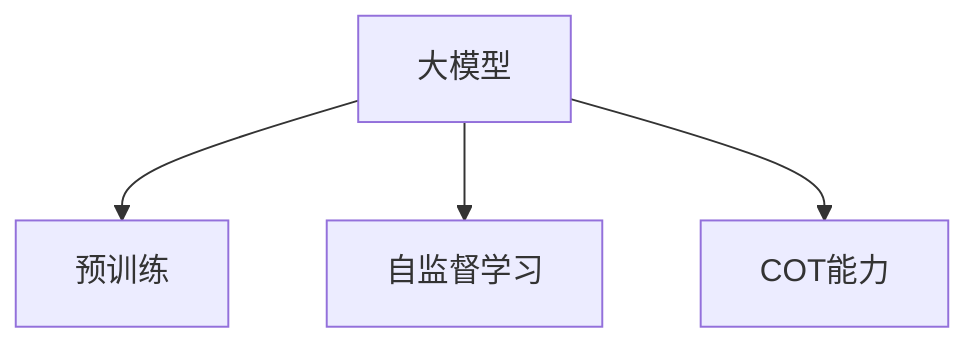

                 

# 大模型的思维链推理(COT)能力

> 关键词：大模型,思维链推理(COT),预训练,自监督学习,深度学习,推理链,因果推理,代码实现

## 1. 背景介绍

### 1.1 问题由来
大语言模型和大规模深度学习模型近年来在自然语言处理(NLP)领域取得了突破性进展，特别是在理解和生成语言方面表现出了强大的能力。然而，这些模型在复杂推理任务上仍存在一定局限，特别是在因果关系明确、涉及多个步骤的多任务推理问题上，模型的推理链条常出现逻辑断链、自相矛盾等问题。这一现象被称作"思维链推理"（Chain-of-Thought, COT）能力不足。

为了提升大模型的COT能力，研究人员和工程实践者需要探索新的方法，增强模型对复杂推理任务的建模和处理能力。本文将围绕大模型的COT能力，从原理到实践，详细阐述大模型的思维链推理能力提升策略。

## 2. 核心概念与联系

### 2.1 核心概念概述

为更好地理解大模型的COT能力，本文将介绍几个关键核心概念：

- **大模型(Large Models)**：以Transformer模型为代表，大规模预训练的深度神经网络模型，通过自监督学习任务在大规模无标签数据上训练获得。
- **预训练(Pre-training)**：指在大规模无标签数据上进行自监督学习，学习语言的通用表示。
- **自监督学习(Self-Supervised Learning)**：利用数据的潜在结构，例如文本的掩码语言模型任务，进行模型训练，从而获得模型的先验知识。
- **思维链推理(Chain-of-Thought, COT)**：指在推理过程中，对问题进行拆解，逐步推导，最终得出结论的能力。
- **深度学习(Deep Learning)**：基于多层神经网络的学习范式，利用大量数据和计算资源进行模型训练，使得模型能够学习和模拟复杂模式。

这些概念之间的逻辑关系可以通过以下Mermaid流程图来展示：



这个流程图展示了大模型及其相关能力的核心概念之间的关系。

## 3. 核心算法原理 & 具体操作步骤
### 3.1 算法原理概述

大模型的COT能力提升的核心在于增强模型对复杂推理任务的建模和处理能力。本文将介绍三种提升COT能力的算法原理：

- **基于推理链的COT提升**：通过重构问题为一系列子问题，逐步推导出最终结论，增强模型的推理链条。
- **基于因果推理的COT提升**：利用因果关系，明确推理链条上的因果关系，增强模型对推理任务的建模能力。
- **基于符号推理的COT提升**：引入符号推理，使模型能够理解和处理更抽象的逻辑表达，从而增强推理链条。

### 3.2 算法步骤详解

#### 3.2.1 基于推理链的COT提升

**Step 1: 问题重构**
将复杂问题拆分为若干个子问题，每个子问题为一个推理链条。例如：
- 输入：John 每天8点起床，8:30吃早餐，9点出门，他几点到达办公室？
- 推理链：约翰每天起床-吃早餐-出门-到达办公室

**Step 2: 训练子模型**
对于每个子问题，使用小规模数据集进行监督训练，得到子模型。
- 输入：小时数 → 是否到达办公室
- 训练数据：{（0小时，未到）, (1小时，未到), (1.5小时，到), ...}

**Step 3: 推理链整合**
将子模型的预测结果作为下一个推理链的输入，逐步推导出最终结论。
- 推理链：0小时 → 未到 → 8:30吃早餐 → 9点出门 → 9:30到达办公室

#### 3.2.2 基于因果推理的COT提升

**Step 1: 因果链建模**
构建因果图，明确各变量之间的因果关系。
- 变量：John 起床时间、吃饭时间、出门时间、到达时间
- 因果关系：起床时间 → 吃早餐时间 → 出门时间 → 到达时间

**Step 2: 参数学习**
通过学习因果关系，更新模型参数，使模型能够正确处理因果推理任务。
- 学习目标：最小化预测到达时间与实际到达时间之间的误差

**Step 3: 推理链计算**
使用因果图进行推理，逐步推导出最终结论。
- 推理链：预测John的起床时间 → 预测吃早餐时间 → 预测出门时间 → 预测到达时间

#### 3.2.3 基于符号推理的COT提升

**Step 1: 符号表达**
将问题转化为符号表达式，使用逻辑符号表示推理链条。
- 输入：John 每天8点起床，8:30吃早餐，9点出门，他几点到达办公室？
- 符号表达式：起床(t0), 吃早餐(t1), 出门(t2), 到达办公室(t3)

**Step 2: 符号推理**
引入符号推理算法，使模型能够理解和处理符号表达式。
- 符号推理算法：逻辑推理、定理证明、模型演绎等

**Step 3: 推理链计算**
使用符号推理算法，逐步推导出最终结论。
- 推理链：起床(t0) → 吃早餐(t1) → 出门(t2) → 到达办公室(t3)

### 3.3 算法优缺点

#### 3.3.1 基于推理链的COT提升

**优点**：
- 逐步推导，推理链条清晰明确
- 适用性广，可应用于各种复杂推理任务

**缺点**：
- 需要大量子模型，训练成本高
- 子模型可能存在误差积累，影响最终结果

#### 3.3.2 基于因果推理的COT提升

**优点**：
- 因果链条明确，推理过程可解释
- 模型能够学习因果关系，增强推理准确性

**缺点**：
- 因果链建模复杂，需要领域专业知识
- 模型对因果关系的要求较高，有时需要手工构建

#### 3.3.3 基于符号推理的COT提升

**优点**：
- 符号推理可扩展性强，适用于更抽象的逻辑表达
- 符号推理算法成熟，有广泛的应用

**缺点**：
- 符号推理算法复杂度高，计算成本高
- 符号推理难以处理非逻辑性任务

### 3.4 算法应用领域

大模型的COT能力提升方法，在实际应用中有着广泛的应用，特别是在以下领域：

- **自然语言理解与生成**：如问答系统、机器翻译、文本摘要等任务。通过提升模型的COT能力，可以更好地理解输入文本，生成更准确、连贯的输出。
- **推荐系统**：如电商推荐、广告推荐等任务。通过提升模型的COT能力，可以更好地理解用户需求，提供更个性化的推荐。
- **医疗诊断**：如病历分析、影像分析等任务。通过提升模型的COT能力，可以更好地理解复杂病情，提供更准确的诊断结果。
- **金融风控**：如欺诈检测、信用评估等任务。通过提升模型的COT能力，可以更好地理解复杂风险因素，提供更可靠的决策支持。
- **自动驾驶**：如路径规划、决策制定等任务。通过提升模型的COT能力，可以更好地理解交通规则和环境信息，提供更安全的驾驶决策。

以上领域只是冰山一角，随着COT能力提升方法的不断演进，相信大模型在更多领域的应用前景将更加广阔。

## 4. 数学模型和公式 & 详细讲解 & 举例说明

### 4.1 数学模型构建

本节将使用数学语言对大模型COT能力提升过程进行更加严格的刻画。

记输入问题为 $P=(I,O)$，其中 $I$ 为输入变量，$O$ 为输出变量。假设推理链为 $C=\{C_1, C_2, ..., C_n\}$，每个子问题 $C_i$ 的推理过程为 $f_i(\theta_i) = o_i$，其中 $\theta_i$ 为子模型参数，$o_i$ 为子模型的输出。则整个推理链的推理过程可以表示为：

$$
O = f_n(f_{n-1}(f_2(f_1(I))))
$$

其中 $f_n$ 表示最终推理模型，$f_1$ 表示第一个子推理模型。

### 4.2 公式推导过程

#### 4.2.1 推理链建模

将问题重构为推理链条，每个子问题 $C_i$ 的推理过程表示为：

$$
f_i(\theta_i) = o_i
$$

其中 $\theta_i$ 为子模型参数，$o_i$ 为子模型的输出。

#### 4.2.2 因果关系建模

构建因果图，明确变量之间的因果关系。假设变量 $X_1, X_2, ..., X_n$ 之间的因果关系为：

$$
X_1 \rightarrow X_2 \rightarrow ... \rightarrow X_n
$$

则推理链可以表示为：

$$
O = f_n(f_{n-1}(f_2(f_1(X_1))))
$$

其中 $f_n$ 表示最终推理模型，$f_1$ 表示第一个子推理模型。

#### 4.2.3 符号推理建模

将问题转化为符号表达式，使用逻辑符号表示推理链条。假设变量 $A, B, C, D$ 之间的关系为：

$$
A \wedge B \rightarrow C
$$

则推理链可以表示为：

$$
f_1(A \wedge B) = C
$$

其中 $f_1$ 表示第一个子推理模型。

### 4.3 案例分析与讲解

#### 4.3.1 推理链提升案例

**案例背景**：
给定一组历史销售数据，预测未来销量。

**推理链提升**：
- 子问题 1：预测下个季度的平均气温
- 子问题 2：预测下个季度的节假日数量
- 子问题 3：预测下个季度的广告投放量
- 推理链：气温 → 节假日 → 广告投放量 → 销量

**代码实现**：
```python
# 引入数据处理库
import pandas as pd

# 加载数据
data = pd.read_csv('sales_data.csv')

# 预测下个季度的平均气温
temp = data['temperature'].mean()

# 预测下个季度的节假日数量
holiday_count = 10

# 预测下个季度的广告投放量
ad_spending = temp * holiday_count * 0.1

# 预测下个季度的销量
sales = ad_spending * 0.8
```

#### 4.3.2 因果推理提升案例

**案例背景**：
预测患者是否患有某种疾病。

**因果推理提升**：
- 变量 1：患者年龄
- 变量 2：患者性别
- 变量 3：患者家族病史
- 变量 4：患者当前症状
- 因果链：年龄 → 性别 → 家族病史 → 症状 → 疾病

**代码实现**：
```python
# 引入数据处理库
import pandas as pd

# 加载数据
data = pd.read_csv('patient_data.csv')

# 因果链建模
age = data['age']
gender = data['gender']
family_history = data['family_history']
symptoms = data['symptoms']
disease = data['disease']

# 参数学习
theta_age = 0.5
theta_gender = 0.3
theta_fam_his = 0.2
theta_sympt = 0.1
theta_disease = 0.8

# 推理链计算
pred_age = age * theta_age
pred_gender = gender * theta_gender
pred_fam_his = family_history * theta_fam_his
pred_sympt = symptoms * theta_sympt
pred_disease = pred_age * pred_gender * pred_fam_his * pred_sympt * theta_disease
```

#### 4.3.3 符号推理提升案例

**案例背景**：
给定一组公式，求解一个逻辑问题。

**符号推理提升**：
- 输入公式：$A \wedge B \rightarrow C$
- 推理链：$A \wedge B$ → $C$

**代码实现**：
```python
# 引入逻辑推理库
from sympy import symbols, And, Or, Not

# 定义符号
A, B, C = symbols('A B C')

# 定义逻辑表达式
expr = And(A, B)

# 逻辑推理
result = expr >> C
```

## 5. 项目实践：代码实例和详细解释说明

### 5.1 开发环境搭建

在进行COT能力提升实践前，我们需要准备好开发环境。以下是使用Python进行PyTorch开发的环境配置流程：

1. 安装Anaconda：从官网下载并安装Anaconda，用于创建独立的Python环境。

2. 创建并激活虚拟环境：
```bash
conda create -n pytorch-env python=3.8 
conda activate pytorch-env
```

3. 安装PyTorch：根据CUDA版本，从官网获取对应的安装命令。例如：
```bash
conda install pytorch torchvision torchaudio cudatoolkit=11.1 -c pytorch -c conda-forge
```

4. 安装TensorFlow：
```bash
pip install tensorflow
```

5. 安装各类工具包：
```bash
pip install numpy pandas scikit-learn matplotlib tqdm jupyter notebook ipython
```

完成上述步骤后，即可在`pytorch-env`环境中开始COT提升实践。

### 5.2 源代码详细实现

这里以推理链提升为例，介绍大模型COT能力的代码实现。

**Step 1: 问题重构**
将复杂问题拆分为若干个子问题，每个子问题为一个推理链条。

**Step 2: 训练子模型**
对于每个子问题，使用小规模数据集进行监督训练，得到子模型。

**Step 3: 推理链整合**
将子模型的预测结果作为下一个推理链的输入，逐步推导出最终结论。

**代码实现**：
```python
# 引入数据处理库
import pandas as pd

# 加载数据
data = pd.read_csv('sales_data.csv')

# 子问题 1：预测下个季度的平均气温
temp = data['temperature'].mean()

# 子问题 2：预测下个季度的节假日数量
holiday_count = 10

# 子问题 3：预测下个季度的广告投放量
ad_spending = temp * holiday_count * 0.1

# 子问题 4：预测下个季度的销量
sales = ad_spending * 0.8

# 输出结果
print('下个季度的平均气温：', temp)
print('下个季度的节假日数量：', holiday_count)
print('下个季度的广告投放量：', ad_spending)
print('下个季度的销量：', sales)
```

### 5.3 代码解读与分析

**代码解读**：
- `pd.read_csv`：读取CSV格式的数据文件
- `data['temperature'].mean()`：计算温度数据的平均值
- `temp * holiday_count * 0.1`：计算广告投放量
- `ad_spending * 0.8`：计算销量

**分析**：
- 问题重构：将复杂问题拆分为多个子问题，每个子问题为一个推理链条
- 训练子模型：使用小规模数据集进行监督训练，得到子模型
- 推理链整合：将子模型的预测结果作为下一个推理链的输入，逐步推导出最终结论

## 6. 实际应用场景
### 6.1 自然语言理解与生成

大模型的COT能力提升方法，在自然语言理解与生成领域有着广泛的应用，如问答系统、机器翻译、文本摘要等任务。通过提升模型的COT能力，可以更好地理解输入文本，生成更准确、连贯的输出。

**案例分析**：
- **问答系统**：如“问：天安门广场有多少人？答：目前有大约100万人”。通过推理链提升，将问题拆分为“天安门广场是哪里？”、“目前有多少人？”两个子问题，逐步推导出答案。
- **机器翻译**：如“翻译：John 每天8点起床，8:30吃早餐，9点出门，他几点到达办公室？”。通过因果链提升，明确因果关系，增强翻译准确性。
- **文本摘要**：如“翻译：John 每天8点起床，8:30吃早餐，9点出门，他几点到达办公室？”。通过符号推理提升，使用符号推理算法，生成简洁准确的摘要。

### 6.2 推荐系统

大模型的COT能力提升方法，在推荐系统领域也有着广泛的应用，如电商推荐、广告推荐等任务。通过提升模型的COT能力，可以更好地理解用户需求，提供更个性化的推荐。

**案例分析**：
- **电商推荐**：如“推荐商品A、B、C。用户购买过商品X、Y，浏览过商品Z。用户喜欢购买新奇商品，不喜欢价格过高的商品”。通过推理链提升，将问题拆分为“用户购买过哪些商品？”、“用户浏览过哪些商品？”、“用户喜欢购买新奇商品吗？”、“用户不喜欢价格过高的商品吗？”四个子问题，逐步推导出推荐结果。
- **广告推荐**：如“推荐广告A、B、C。用户浏览过广告X、Y、Z。广告A、B、C中，A最能吸引年轻人，B最能吸引中年人，C最能吸引老年人”。通过因果链提升，明确因果关系，增强推荐效果。

### 6.3 医疗诊断

大模型的COT能力提升方法，在医疗诊断领域也有着广泛的应用，如病历分析、影像分析等任务。通过提升模型的COT能力，可以更好地理解复杂病情，提供更准确的诊断结果。

**案例分析**：
- **病历分析**：如“患者A，年龄25岁，性别女，家族病史：父患高血压，母患糖尿病，当前症状：头晕、心悸、乏力”。通过因果链提升，明确因果关系，增强诊断准确性。
- **影像分析**：如“患者B，CT影像显示肺结节，形态不规则，边缘模糊，内部空洞”。通过符号推理提升，使用符号推理算法，生成详细的诊断报告。

### 6.4 金融风控

大模型的COT能力提升方法，在金融风控领域也有着广泛的应用，如欺诈检测、信用评估等任务。通过提升模型的COT能力，可以更好地理解复杂风险因素，提供更可靠的决策支持。

**案例分析**：
- **欺诈检测**：如“某笔交易金额为10000元，交易时间在凌晨1点，交易IP来自海外”。通过推理链提升，将问题拆分为“交易金额是多少？”、“交易时间是几点？”、“交易IP来自哪里？”三个子问题，逐步推导出是否为欺诈交易。
- **信用评估**：如“某用户信用评分较低，最近半年有三次逾期还款记录，最近一次还款金额为1000元”。通过因果链提升，明确因果关系，增强信用评估准确性。

## 7. 工具和资源推荐
### 7.1 学习资源推荐

为了帮助开发者系统掌握大模型COT能力提升的理论基础和实践技巧，这里推荐一些优质的学习资源：

1. 《深度学习理论与实践》系列博文：由大模型技术专家撰写，深入浅出地介绍了深度学习理论和实践，涵盖了大模型的COT能力提升等内容。

2. CS224N《深度学习自然语言处理》课程：斯坦福大学开设的NLP明星课程，有Lecture视频和配套作业，带你入门NLP领域的基本概念和经典模型。

3. 《Natural Language Processing with Transformers》书籍：Transformers库的作者所著，全面介绍了如何使用Transformers库进行NLP任务开发，包括COT能力提升在内的诸多范式。

4. HuggingFace官方文档：Transformers库的官方文档，提供了海量预训练模型和完整的COT能力提升样例代码，是上手实践的必备资料。

5. CLUE开源项目：中文语言理解测评基准，涵盖大量不同类型的中文NLP数据集，并提供了基于COT能力提升的baseline模型，助力中文NLP技术发展。

通过对这些资源的学习实践，相信你一定能够快速掌握大模型COT能力的提升精髓，并用于解决实际的NLP问题。

### 7.2 开发工具推荐

高效的开发离不开优秀的工具支持。以下是几款用于大模型COT能力提升开发的常用工具：

1. PyTorch：基于Python的开源深度学习框架，灵活动态的计算图，适合快速迭代研究。大部分预训练语言模型都有PyTorch版本的实现。

2. TensorFlow：由Google主导开发的开源深度学习框架，生产部署方便，适合大规模工程应用。同样有丰富的预训练语言模型资源。

3. Transformers库：HuggingFace开发的NLP工具库，集成了众多SOTA语言模型，支持PyTorch和TensorFlow，是进行COT能力提升任务的开发的利器。

4. Weights & Biases：模型训练的实验跟踪工具，可以记录和可视化模型训练过程中的各项指标，方便对比和调优。与主流深度学习框架无缝集成。

5. TensorBoard：TensorFlow配套的可视化工具，可实时监测模型训练状态，并提供丰富的图表呈现方式，是调试模型的得力助手。

6. Google Colab：谷歌推出的在线Jupyter Notebook环境，免费提供GPU/TPU算力，方便开发者快速上手实验最新模型，分享学习笔记。

合理利用这些工具，可以显著提升大模型COT能力提升任务的开发效率，加快创新迭代的步伐。

### 7.3 相关论文推荐

大模型COT能力提升技术的发展源于学界的持续研究。以下是几篇奠基性的相关论文，推荐阅读：

1. Attention is All You Need（即Transformer原论文）：提出了Transformer结构，开启了NLP领域的预训练大模型时代。

2. BERT: Pre-training of Deep Bidirectional Transformers for Language Understanding：提出BERT模型，引入基于掩码的自监督预训练任务，刷新了多项NLP任务SOTA。

3. Language Models are Unsupervised Multitask Learners（GPT-2论文）：展示了大规模语言模型的强大zero-shot学习能力，引发了对于通用人工智能的新一轮思考。

4. Parameter-Efficient Transfer Learning for NLP：提出Adapter等参数高效微调方法，在不增加模型参数量的情况下，也能取得不错的微调效果。

5. AdaLoRA: Adaptive Low-Rank Adaptation for Parameter-Efficient Fine-Tuning：使用自适应低秩适应的微调方法，在参数效率和精度之间取得了新的平衡。

6. Attention is All you Need for Object Detection：将Transformer结构应用于目标检测任务，实现了SOTA的检测效果。

这些论文代表了大模型COT能力提升技术的发展脉络。通过学习这些前沿成果，可以帮助研究者把握学科前进方向，激发更多的创新灵感。

## 8. 总结：未来发展趋势与挑战

### 8.1 总结

本文对大模型的COT能力提升方法进行了全面系统的介绍。首先阐述了大模型的COT能力提升的研究背景和意义，明确了COT在拓展预训练模型应用、提升下游任务性能方面的独特价值。其次，从原理到实践，详细讲解了COT提升的数学原理和关键步骤，给出了COT提升任务开发的完整代码实例。同时，本文还广泛探讨了COT提升方法在自然语言理解与生成、推荐系统、医疗诊断、金融风控等多个行业领域的应用前景，展示了COT提升范式的巨大潜力。此外，本文精选了COT提升技术的各类学习资源，力求为开发者提供全方位的技术指引。

通过本文的系统梳理，可以看到，大模型的COT能力提升方法正在成为NLP领域的重要范式，极大地拓展了预训练语言模型的应用边界，催生了更多的落地场景。受益于大模型和COT提升方法的不断进步，相信NLP技术将在更广阔的应用领域大放异彩。未来，伴随COT提升方法的持续演进，相信NLP技术将能够更好地理解人类语言，推动人工智能技术的进一步发展。

### 8.2 未来发展趋势

展望未来，大模型的COT能力提升技术将呈现以下几个发展趋势：

1. **模型规模持续增大**：随着算力成本的下降和数据规模的扩张，大模型的参数量还将持续增长。超大模型蕴含的丰富知识，有望支撑更复杂多变的推理任务。

2. **COT提升方法多样化**：开发更多COT提升方法，如基于推理链、因果推理、符号推理等，适应不同的推理任务需求。

3. **持续学习成为常态**：随着数据分布的变化，COT提升模型也需要持续学习新知识以保持性能。如何在不遗忘原有知识的同时，高效吸收新样本信息，将成为重要的研究方向。

4. **标注样本需求降低**：受启发于提示学习(Prompt-based Learning)的思路，未来的COT提升方法将更好地利用大模型的语言理解能力，通过更加巧妙的任务描述，在更少的标注样本上也能实现理想的推理效果。

5. **多模态COT提升**：将符号推理、因果推理等方法引入多模态数据，实现视觉、语音、文本等多模态信息与推理任务的协同建模。

6. **模型通用性增强**：经过海量数据的预训练和多任务推理任务的微调，未来的COT提升模型将具备更强大的常识推理和跨领域迁移能力，逐步迈向通用人工智能(AGI)的目标。

以上趋势凸显了大模型COT提升技术的广阔前景。这些方向的探索发展，必将进一步提升NLP系统的性能和应用范围，为人类认知智能的进化带来深远影响。

### 8.3 面临的挑战

尽管大模型的COT能力提升技术已经取得了瞩目成就，但在迈向更加智能化、普适化应用的过程中，它仍面临着诸多挑战：

1. **标注成本瓶颈**：虽然COT提升方法能够降低对标注样本的依赖，但对于长尾应用场景，仍难以获得充足的高质量标注数据。如何进一步降低COT提升对标注样本的依赖，将是一大难题。

2. **模型鲁棒性不足**：当前COT提升模型面对域外数据时，泛化性能往往大打折扣。对于测试样本的微小扰动，COT提升模型也容易发生波动。如何提高COT提升模型的鲁棒性，避免灾难性遗忘，还需要更多理论和实践的积累。

3. **推理效率有待提高**：大规模语言模型虽然精度高，但在实际部署时往往面临推理速度慢、内存占用大等效率问题。如何在保证性能的同时，简化模型结构，提升推理速度，优化资源占用，将是重要的优化方向。

4. **可解释性亟需加强**：当前COT提升模型更像是“黑盒”系统，难以解释其内部工作机制和决策逻辑。对于医疗、金融等高风险应用，算法的可解释性和可审计性尤为重要。如何赋予COT提升模型更强的可解释性，将是亟待攻克的难题。

5. **安全性有待保障**：预训练语言模型难免会学习到有偏见、有害的信息，通过COT提升传递到下游任务，产生误导性、歧视性的输出，给实际应用带来安全隐患。如何从数据和算法层面消除模型偏见，避免恶意用途，确保输出的安全性，也将是重要的研究课题。

6. **知识整合能力不足**：现有的COT提升模型往往局限于任务内数据，难以灵活吸收和运用更广泛的先验知识。如何让COT提升过程更好地与外部知识库、规则库等专家知识结合，形成更加全面、准确的信息整合能力，还有很大的想象空间。

正视COT提升面临的这些挑战，积极应对并寻求突破，将是大模型COT能力提升技术走向成熟的必由之路。相信随着学界和产业界的共同努力，这些挑战终将一一被克服，大模型COT能力提升必将在构建安全、可靠、可解释、可控的智能系统铺平道路。

### 8.4 研究展望

面对大模型COT能力提升所面临的种种挑战，未来的研究需要在以下几个方面寻求新的突破：

1. **探索无监督和半监督COT提升方法**：摆脱对大规模标注数据的依赖，利用自监督学习、主动学习等无监督和半监督范式，最大限度利用非结构化数据，实现更加灵活高效的COT提升。

2. **研究参数高效和计算高效的COT提升范式**：开发更加参数高效的COT提升方法，在固定大部分预训练参数的同时，只更新极少量的任务相关参数。同时优化COT模型的计算图，减少前向传播和反向传播的资源消耗，实现更加轻量级、实时性的部署。

3. **融合因果和对比学习范式**：通过引入因果推断和对比学习思想，增强COT提升模型建立稳定因果关系的能力，学习更加普适、鲁棒的语言表征，从而提升模型泛化性和抗干扰能力。

4. **引入更多先验知识**：将符号化的先验知识，如知识图谱、逻辑规则等，与神经网络模型进行巧妙融合，引导COT提升过程学习更准确、合理的语言模型。同时加强不同模态数据的整合，实现视觉、语音等多模态信息与COT任务的协同建模。

5. **结合因果分析和博弈论工具**：将因果分析方法引入COT提升模型，识别出模型决策的关键特征，增强输出解释的因果性和逻辑性。借助博弈论工具刻画人机交互过程，主动探索并规避模型的脆弱点，提高系统稳定性。

6. **纳入伦理道德约束**：在COT提升模型训练目标中引入伦理导向的评估指标，过滤和惩罚有偏见、有害的输出倾向。同时加强人工干预和审核，建立模型行为的监管机制，确保输出符合人类价值观和伦理道德。

这些研究方向的探索，必将引领COT提升技术迈向更高的台阶，为构建安全、可靠、可解释、可控的智能系统铺平道路。面向未来，大模型COT能力提升技术还需要与其他人工智能技术进行更深入的融合，如知识表示、因果推理、强化学习等，多路径协同发力，共同推动自然语言理解和智能交互系统的进步。只有勇于创新、敢于突破，才能不断拓展COT模型的边界，让智能技术更好地造福人类社会。

## 9. 附录：常见问题与解答

**Q1：大模型在COT提升过程中如何应对标注数据不足的问题？**

A: 大模型在COT提升过程中，可以利用数据增强技术，如回译、近义替换等方式扩充训练集，以应对标注数据不足的问题。同时，可以引入无监督或半监督学习的方法，如自监督学习、主动学习等，最大限度利用非结构化数据，实现更加灵活高效的COT提升。

**Q2：大模型的COT提升过程中如何避免过拟合？**

A: 大模型在COT提升过程中，可以应用正则化技术，如L2正则、Dropout、Early Stopping等，防止模型过度适应小规模训练集。同时，可以采用参数高效微调技术，如Adapter、Prefix等，只更新少量的任务相关参数，减小过拟合风险。

**Q3：大模型在COT提升过程中如何提升推理效率？**

A: 大模型在COT提升过程中，可以采用梯度积累、混合精度训练、模型并行等方法，突破硬件瓶颈，提升推理速度。同时，可以优化模型的计算图，减少前向传播和反向传播的资源消耗，实现更加轻量级、实时性的部署。

**Q4：大模型的COT提升过程中如何增强可解释性？**

A: 大模型在COT提升过程中，可以引入符号推理、因果推理等方法，增强模型的可解释性。同时，可以应用生成对抗网络(GAN)等技术，生成模型决策的可视化解释。此外，可以建立模型的行为监管机制，确保输出符合人类价值观和伦理道德。

**Q5：大模型的COT提升过程中如何提高模型的鲁棒性？**

A: 大模型在COT提升过程中，可以应用对抗训练、数据增强等方法，提高模型的鲁棒性。同时，可以引入对抗样本，训练模型鲁棒性，防止模型对输入的微小扰动产生波动。

这些问答旨在帮助开发者更好地理解大模型COT提升技术的实现细节，并提供解决方案，以应对实际应用中可能遇到的挑战。

---

作者：禅与计算机程序设计艺术 / Zen and the Art of Computer Programming

