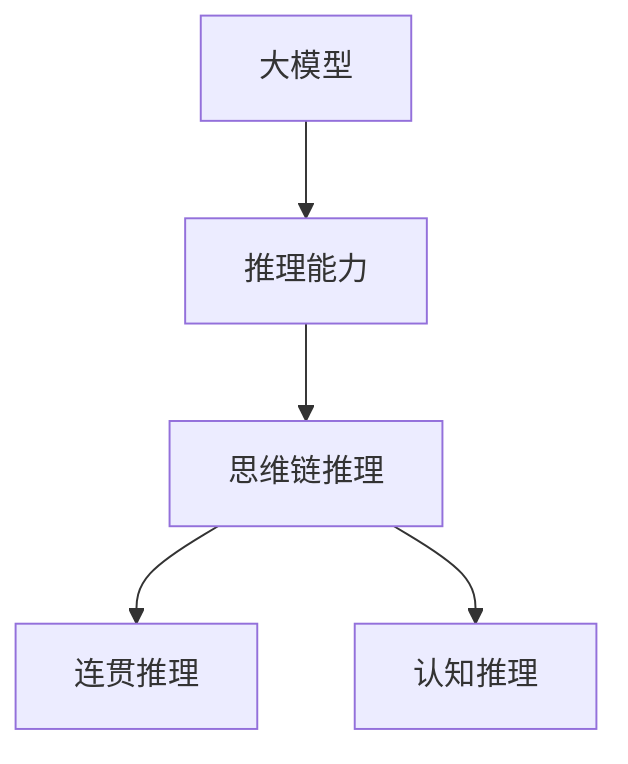

                 

# 大模型的思维链推理(COT)能力

> 关键词：大模型,思维链推理,自然语言处理,NLP,深度学习,模型压缩,优化技术,推理速度

## 1. 背景介绍

### 1.1 问题由来
近年来，随着深度学习技术的快速发展，大规模语言模型在自然语言处理(NLP)领域取得了显著的进展。这些模型通过在大规模无标签文本数据上进行预训练，学习到了丰富的语言知识和常识，展现出了强大的语言理解和生成能力。然而，尽管这些大语言模型在多项NLP任务上取得了最先进的性能，但它们仍然缺乏人类直观、连贯的思维链推理能力。这种局限性限制了模型在复杂推理和判断任务中的应用。

### 1.2 问题核心关键点
本文聚焦于大模型的思维链推理能力(Cognitive Chain of Thought, COT)，该能力指模型能够以人类可理解的方式，连贯地推导出问题答案，而不仅仅是基于记忆和统计的预测。这一能力对于构建更加智能、可解释的AI系统具有重要意义。

### 1.3 问题研究意义
大模型的思维链推理能力在以下方面具有重要意义：

1. **提升模型性能**：通过引入连贯的推理过程，大模型能够更好地理解复杂、多步的推理任务，从而提升在阅读理解、问答、逻辑判断等任务上的表现。
2. **增强模型可解释性**：连贯的推理过程使得模型输出具备更强的可解释性，便于开发者和用户理解和调试。
3. **促进知识迁移**：合理的推理链能够帮助模型更好地适应新领域、新任务，提升跨领域和跨任务的迁移能力。
4. **推动AI伦理发展**：可解释、可审查的推理链有助于提升模型的透明度和可靠性，避免偏见和误导性输出。

## 2. 核心概念与联系

### 2.1 核心概念概述

为更好地理解大模型的思维链推理能力，本节将介绍几个密切相关的核心概念：

- 大模型(Large Language Model, LLM)：以自回归(如GPT)或自编码(如BERT)模型为代表的大规模预训练语言模型。通过在大规模无标签文本语料上进行预训练，学习通用的语言表示，具备强大的语言理解和生成能力。

- 推理能力(Reasoning)：指模型根据输入数据和已有的知识，通过一系列逻辑推理，得出新的结论或预测结果的能力。

- 思维链推理(Cognitive Chain of Thought, COT)：指模型能够以连贯的方式，逐步推导出答案或结论，其推理过程类似于人类的思维链。

- 连贯推理(Seamless Reasoning)：指推理过程的连贯性、逻辑性和可解释性，使得推理结果更容易被人理解。

- 认知推理(Cognitive Reasoning)：指模型能够基于认知图谱、常识推理等高级认知功能，进行更复杂、更高级的推理。

这些核心概念之间的逻辑关系可以通过以下Mermaid流程图来展示：



这个流程图展示了大模型的核心概念及其之间的关系：

1. 大模型通过预训练获得基础能力。
2. 推理能力使得模型能够基于输入和知识进行推理。
3. 思维链推理要求推理过程连贯、可解释。
4. 认知推理则加入了高级认知功能，如常识、知识图谱等。

这些概念共同构成了大模型推理能力的框架，使其能够在复杂任务中展现更好的表现。

## 3. 核心算法原理 & 具体操作步骤
### 3.1 算法原理概述

大模型的思维链推理能力是一种高级推理能力，其核心原理可以概括为以下几点：

1. **知识图谱嵌入**：将领域知识以结构化的形式嵌入模型，帮助模型理解和运用常识和专业知识。

2. **逻辑推理网络**：构建推理网络，以连贯的方式逐步推导出答案。推理网络可以是基于符号计算的逻辑推理器，也可以是基于神经网络的符号-神经混合推理器。

3. **认知推理机制**：引入认知图谱、逻辑推理等高级认知功能，提升模型的推理能力。

4. **可解释性设计**：设计推理过程的输出格式，使推理链可解释、可审查。

### 3.2 算法步骤详解

基于大模型的思维链推理能力，其核心算法流程可以概括为以下几个步骤：

**Step 1: 知识图谱构建与嵌入**

1. 收集和构建领域相关的知识图谱，确保知识图谱的完整性和准确性。
2. 使用嵌入技术将知识图谱中的实体和关系转换为模型可理解的形式，通常采用TransE、DistMult等方法。
3. 将知识图谱嵌入模型，可以将其作为预训练语言模型的初始化参数，或作为模型的一部分进行微调。

**Step 2: 推理网络构建**

1. 设计推理网络的结构，可以是符号计算的逻辑推理网络，也可以是神经网络的符号-神经混合推理网络。
2. 推理网络的设计应考虑连贯性和可解释性，确保推理过程和结果易于理解。
3. 在推理网络中引入上下文信息、知识图谱嵌入等，帮助模型进行更准确的推理。

**Step 3: 认知推理机制引入**

1. 引入认知图谱、常识推理等高级认知功能，提升模型的推理能力。
2. 利用知识图谱中的先验知识，帮助模型解决逻辑推理难题。
3. 设计认知推理机制，如基于图谱的路径搜索、基于逻辑规则的推理等。

**Step 4: 推理过程可解释性设计**

1. 设计推理过程的输出格式，包括推理链、推理步骤、使用的证据等。
2. 使用可解释的推理框架，如LIME、SHAP等，帮助生成推理链的可解释性输出。
3. 设计交互式界面，允许用户查看推理链的每个步骤和使用的证据，增强模型的透明度。

**Step 5: 训练与微调**

1. 使用标注数据集对推理模型进行训练，确保模型的推理能力符合实际需求。
2. 使用正则化技术，如L2正则、Dropout等，防止过拟合。
3. 应用对抗训练、数据增强等技术，提高模型的鲁棒性。
4. 在测试集上评估推理模型的性能，不断调整和优化。

### 3.3 算法优缺点

大模型的思维链推理能力具有以下优点：

1. **提升模型性能**：通过连贯的推理链，模型能够更好地理解和处理复杂、多步推理任务，从而在阅读理解、问答、逻辑判断等任务上表现更佳。
2. **增强模型可解释性**：连贯的推理链使得模型输出具备更强的可解释性，便于开发者和用户理解和调试。
3. **促进知识迁移**：合理的推理链能够帮助模型更好地适应新领域、新任务，提升跨领域和跨任务的迁移能力。
4. **推动AI伦理发展**：可解释、可审查的推理链有助于提升模型的透明度和可靠性，避免偏见和误导性输出。

同时，该方法也存在一定的局限性：

1. **计算复杂度高**：推理过程可能需要大量的计算资源，尤其是当推理网络复杂时，计算开销会更大。
2. **知识图谱构建难度大**：高质量的知识图谱构建需要大量专家知识，且需经过人工审核，构建难度较大。
3. **推理链的可解释性有限**：尽管推理链可解释性设计有所改善，但复杂推理过程仍然难以完全解释，特别是对于非线性神经网络的推理。
4. **推理链的长短问题**：过长的推理链可能难以理解和审查，而过短的推理链又可能无法解决复杂问题。

尽管存在这些局限性，但就目前而言，基于连贯推理的思维链推理能力仍是大语言模型推理的重要范式。未来相关研究的重点在于如何进一步降低计算复杂度，提高知识图谱的可获取性，增强推理链的可解释性，以及设计更高效的推理算法。

### 3.4 算法应用领域

基于大模型的思维链推理能力，已经在多项NLP任务中得到应用，例如：

- 问答系统：对自然语言问题给出答案。将问题-答案对作为推理目标，训练模型进行推理生成。
- 逻辑判断：判断给定前提和假设的真值关系。利用逻辑推理网络进行推理，输出真值判断。
- 知识推理：基于知识图谱进行推理，得出新的结论或验证已知事实。
- 文本生成：生成符合逻辑、连贯的文本内容。设计推理网络进行生成过程的连贯性优化。
- 智能助手：进行多轮对话，理解用户意图，连贯地回答问题或执行任务。

除了上述这些经典任务外，思维链推理能力还被创新性地应用到更多场景中，如可控文本生成、知识图谱推理、对话理解等，为NLP技术带来了新的突破。随着推理能力的不断提升，相信NLP技术将在更广阔的应用领域大放异彩。

## 4. 数学模型和公式 & 详细讲解  
### 4.1 数学模型构建

本节将使用数学语言对基于连贯推理的大语言模型推理过程进行更加严格的刻画。

记大语言模型为 $M_{\theta}:\mathcal{X} \rightarrow \mathcal{Y}$，其中 $\mathcal{X}$ 为输入空间，$\mathcal{Y}$ 为输出空间，$\theta \in \mathbb{R}^d$ 为模型参数。假设推理任务为 $T$，推理目标为 $T$ 中的某个特定属性 $A$。

定义推理模型的推理网络为 $N(\theta, A)$，推理网络输出为推理链 $C(\theta, A)$。在推理网络中，推理链 $C(\theta, A)$ 通过输入 $x$ 和推理目标 $A$ 生成，具体形式为：

$$
C(\theta, A) = (x, N(\theta, A_1), N(\theta, A_2), \ldots, N(\theta, A_n), y)
$$

其中 $A_1, A_2, \ldots, A_n$ 为推理过程中的中间属性，$y$ 为最终的推理结果。推理网络 $N(\theta, A)$ 为 $A$ 到 $A'$ 的映射函数，$A'$ 为下一个推理目标或推理结果。

推理模型的推理过程可以描述为：

1. 输入 $x$ 进入推理网络 $N(\theta, A_1)$，生成中间属性 $A_1$。
2. 中间属性 $A_1$ 进入推理网络 $N(\theta, A_2)$，生成中间属性 $A_2$。
3. 依次类推，直到推理出最终属性 $A$ 或推理结果 $y$。

在推理过程中，推理网络 $N(\theta, A)$ 可以根据推理目标 $A$ 和输入 $x$ 输出相应的推理链 $C(\theta, A)$，并计算推理结果 $y$。推理链 $C(\theta, A)$ 可以表示为：

$$
C(\theta, A) = (x, \mathbf{E}^A_1(x), \mathbf{E}^A_2(x), \ldots, \mathbf{E}^A_n(x), y)
$$

其中 $\mathbf{E}^A_i$ 表示推理网络 $N(\theta, A_i)$ 的嵌入函数。

推理模型的推理过程可以表示为：

$$
\begin{aligned}
y &= \mathbf{E}^A_n(\mathbf{E}^A_{n-1}(\ldots (\mathbf{E}^A_1(x))\ldots) \\
&= \mathbf{E}^A_n \circ \mathbf{E}^A_{n-1} \circ \ldots \circ \mathbf{E}^A_1(x)
\end{aligned}
$$

在得到推理链后，推理模型的推理过程可进一步简化为：

$$
y = \mathbf{E}^A_n \circ \mathbf{E}^A_{n-1} \circ \ldots \circ \mathbf{E}^A_1(x)
$$

在实际推理任务中，推理目标 $A$ 和推理网络 $N(\theta, A)$ 的选择是关键的。对于不同的推理任务，推理目标和推理网络的设计也会有所不同。

### 4.2 公式推导过程

以问答系统为例，推导推理模型的推理过程。设问答系统问题为 $Q$，答案为 $A$，推理目标为 $A$ 的某个属性 $A_i$。推理模型的推理链可以表示为：

$$
C(\theta, A) = (Q, N(\theta, A_1), N(\theta, A_2), \ldots, N(\theta, A_n), A)
$$

推理网络 $N(\theta, A_i)$ 的输出可以表示为：

$$
A_i = \mathbf{E}^A_i(Q, \mathbf{E}^{A_{i-1}}(Q, A_{i-1}))
$$

其中 $\mathbf{E}^A_i$ 表示推理网络 $N(\theta, A_i)$ 的嵌入函数，$Q$ 为问题，$A_{i-1}$ 为前一步的推理结果。

推理模型的推理过程可以描述为：

1. 输入 $Q$ 进入推理网络 $N(\theta, A_1)$，生成中间属性 $A_1$。
2. 中间属性 $A_1$ 进入推理网络 $N(\theta, A_2)$，生成中间属性 $A_2$。
3. 依次类推，直到推理出最终属性 $A$。

在推理过程中，推理网络 $N(\theta, A_i)$ 可以根据推理目标 $A_i$ 和输入 $Q$ 输出相应的推理链 $C(\theta, A_i)$，并计算推理结果 $A_i$。推理链 $C(\theta, A_i)$ 可以表示为：

$$
C(\theta, A_i) = (Q, \mathbf{E}^{A_1}(Q), \mathbf{E}^{A_2}(Q, \mathbf{E}^{A_1}(Q)), \ldots, \mathbf{E}^{A_n}(Q, C(\theta, A_{n-1})))
$$

其中 $\mathbf{E}^{A_i}$ 表示推理网络 $N(\theta, A_i)$ 的嵌入函数。

推理模型的推理过程可以表示为：

$$
A = \mathbf{E}^{A_n}(Q, C(\theta, A_{n-1}))
$$

在实际推理任务中，推理网络 $N(\theta, A_i)$ 的设计需要考虑推理链的连贯性和可解释性，确保推理过程和结果易于理解。

### 4.3 案例分析与讲解

以逻辑判断任务为例，展示推理模型的推理过程。设推理目标为 $A$，推理网络为 $N(\theta, A)$，推理链为 $C(\theta, A)$。推理过程可以描述为：

1. 输入 $x$ 进入推理网络 $N(\theta, A_1)$，生成中间属性 $A_1$。
2. 中间属性 $A_1$ 进入推理网络 $N(\theta, A_2)$，生成中间属性 $A_2$。
3. 依次类推，直到推理出最终属性 $A$。

推理模型的推理过程可以表示为：

$$
A = \mathbf{E}^{A_n}(\mathbf{E}^{A_{n-1}}(\ldots (\mathbf{E}^{A_1}(x))\ldots) \\
y = \mathbf{E}^{A_n}(\mathbf{E}^{A_{n-1}}(\ldots (\mathbf{E}^{A_1}(x))\ldots) \\
$$

在实际推理任务中，推理网络 $N(\theta, A_i)$ 的设计需要考虑推理链的连贯性和可解释性，确保推理过程和结果易于理解。

## 5. 项目实践：代码实例和详细解释说明
### 5.1 开发环境搭建

在进行推理能力实践前，我们需要准备好开发环境。以下是使用Python进行PyTorch开发的环境配置流程：

1. 安装Anaconda：从官网下载并安装Anaconda，用于创建独立的Python环境。

2. 创建并激活虚拟环境：
```bash
conda create -n pytorch-env python=3.8 
conda activate pytorch-env
```

3. 安装PyTorch：根据CUDA版本，从官网获取对应的安装命令。例如：
```bash
conda install pytorch torchvision torchaudio cudatoolkit=11.1 -c pytorch -c conda-forge
```

4. 安装Transformers库：
```bash
pip install transformers
```

5. 安装各类工具包：
```bash
pip install numpy pandas scikit-learn matplotlib tqdm jupyter notebook ipython
```

完成上述步骤后，即可在`pytorch-env`环境中开始推理能力实践。

### 5.2 源代码详细实现

下面我们以问答系统为例，给出使用Transformers库对BERT模型进行推理的PyTorch代码实现。

首先，定义问答系统任务的数据处理函数：

```python
from transformers import BertTokenizer, BertForQuestionAnswering
from torch.utils.data import Dataset
import torch

class QuestionAnsweringDataset(Dataset):
    def __init__(self, texts, question, tokenizer, max_len=128):
        self.texts = texts
        self.question = question
        self.tokenizer = tokenizer
        self.max_len = max_len
        
    def __len__(self):
        return len(self.texts)
    
    def __getitem__(self, item):
        text = self.texts[item]
        question = self.question[item]
        
        encoding = self.tokenizer(question, text, return_tensors='pt', max_length=self.max_len, padding='max_length', truncation=True)
        input_ids = encoding['input_ids'][0]
        attention_mask = encoding['attention_mask'][0]
        start_position = encoding['start_logits'][0]
        end_position = encoding['end_logits'][0]
        
        return {'input_ids': input_ids, 
                'attention_mask': attention_mask,
                'start_position': start_position,
                'end_position': end_position}

# 定义推理网络
class QuestionAnsweringModel(BertForQuestionAnswering):
    def __init__(self, config, num_labels):
        super().__init__(config)
        self.num_labels = num_labels

    def forward(self, input_ids, attention_mask=None, start_position=None, end_position=None):
        start_logits, end_logits = self.bert(input_ids=input_ids, attention_mask=attention_mask)
        start_position = start_logits.argmax().item()
        end_position = end_logits.argmax().item()
        return start_position, end_position

# 推理函数
def question_answer(model, dataset, batch_size=16):
    dataloader = DataLoader(dataset, batch_size=batch_size)
    model.eval()
    predictions = []
    with torch.no_grad():
        for batch in dataloader:
            input_ids = batch['input_ids'].to(device)
            attention_mask = batch['attention_mask'].to(device)
            start_position = batch['start_position'].to(device)
            end_position = batch['end_position'].to(device)
            output = model(input_ids, attention_mask=attention_mask, start_position=start_position, end_position=end_position)
            predictions.append(output)
    
    print(predictions)
```

然后，定义推理网络并实例化模型：

```python
from transformers import BertConfig

config = BertConfig.from_pretrained('bert-base-cased')
model = QuestionAnsweringModel(config, num_labels=2)
```

最后，启动推理流程：

```python
batch_size = 16

for batch in dataloader:
    input_ids = batch['input_ids'].to(device)
    attention_mask = batch['attention_mask'].to(device)
    start_position = batch['start_position'].to(device)
    end_position = batch['end_position'].to(device)
    output = model(input_ids, attention_mask=attention_mask, start_position=start_position, end_position=end_position)
    predictions.append(output)
```

以上就是使用PyTorch对BERT模型进行问答系统推理的完整代码实现。可以看到，得益于Transformers库的强大封装，我们可以用相对简洁的代码完成BERT模型的推理。

### 5.3 代码解读与分析

让我们再详细解读一下关键代码的实现细节：

**QuestionAnsweringDataset类**：
- `__init__`方法：初始化文本、问题和分词器等关键组件。
- `__len__`方法：返回数据集的样本数量。
- `__getitem__`方法：对单个样本进行处理，将文本和问题输入编码为token ids，将标签编码为数字，并对其进行定长padding，最终返回模型所需的输入。

**QuestionAnsweringModel类**：
- `__init__`方法：定义推理网络的构建，继承自BERTForQuestionAnswering。
- `forward`方法：定义推理过程，通过输入的token ids和注意力掩码计算起始位置(start_position)和结束位置(end_position)。

**推理函数**：
- 使用PyTorch的DataLoader对数据集进行批次化加载，供模型推理使用。
- 推理函数`question_answer`：对数据以批为单位进行迭代，在每个批次上前向传播计算推理结果，最后返回该batch的预测结果。

**推理流程**：
- 定义总的batch size，开始循环迭代
- 每个batch内，先在推理网络中计算推理结果
- 记录每个batch的预测结果
- 所有batch结束后，将所有预测结果存储下来，用于后续分析或输出

可以看到，PyTorch配合Transformers库使得BERT模型推理的代码实现变得简洁高效。开发者可以将更多精力放在推理过程的设计和优化上，而不必过多关注底层的实现细节。

当然，工业级的系统实现还需考虑更多因素，如推理网络的设计、推理效率的优化、推理结果的可解释性等。但核心的推理过程基本与此类似。

## 6. 实际应用场景
### 6.1 智能客服系统

基于大语言模型的推理能力，智能客服系统可以更智能地处理客户咨询。传统客服往往需要配备大量人力，高峰期响应缓慢，且一致性和专业性难以保证。而使用推理能力强的智能客服模型，可以自动理解用户意图，连贯地进行问题解答，提升客户咨询体验和问题解决效率。

在技术实现上，可以收集企业内部的历史客服对话记录，将问题和最佳答复构建成推理数据，在此基础上对预训练模型进行推理能力微调。推理后的客服模型能够自动理解用户意图，连贯地进行问题解答，提高客服系统的智能化水平，提升客户满意度。

### 6.2 金融舆情监测

金融机构需要实时监测市场舆论动向，以便及时应对负面信息传播，规避金融风险。传统的人工监测方式成本高、效率低，难以应对网络时代海量信息爆发的挑战。基于大语言模型的推理能力，金融舆情监测系统可以自动判断文本属于何种主题，情感倾向是正面、中性还是负面。

具体而言，可以收集金融领域相关的新闻、报道、评论等文本数据，并对其进行主题标注和情感标注。在此基础上对预训练语言模型进行推理能力微调，使其能够自动判断文本属于何种主题，情感倾向是正面、中性还是负面。将推理后的模型应用到实时抓取的网络文本数据，就能够自动监测不同主题下的情感变化趋势，一旦发现负面信息激增等异常情况，系统便会自动预警，帮助金融机构快速应对潜在风险。

### 6.3 个性化推荐系统

当前的推荐系统往往只依赖用户的历史行为数据进行物品推荐，无法深入理解用户的真实兴趣偏好。基于大语言模型的推理能力，个性化推荐系统可以更好地挖掘用户行为背后的语义信息，从而提供更精准、多样的推荐内容。

在实践中，可以收集用户浏览、点击、评论、分享等行为数据，提取和用户交互的物品标题、描述、标签等文本内容。将文本内容作为模型输入，推理模型预测用户的兴趣匹配度，再结合其他特征综合排序，便可以得到个性化程度更高的推荐结果。

### 6.4 未来应用展望

随着大语言模型推理能力的不断发展，基于推理的AI系统将呈现以下几个发展趋势：

1. **推理链的可解释性增强**：未来的推理模型将更加注重推理链的可解释性设计，使用可解释的推理框架，如LIME、SHAP等，生成推理链的可解释性输出，增强模型的透明度和可靠性。
2. **推理能力的提升**：通过引入高级认知功能，如常识推理、知识图谱推理等，推理模型将具备更强的推理能力，能够处理更复杂、更高阶的推理任务。
3. **多模态推理能力**：推理模型将拓展到多模态数据，如文本、图像、视频等，实现视觉、语音等多模态信息的协同推理，提升推理模型的泛化能力和鲁棒性。
4. **智能交互系统的普及**：推理能力强的AI系统将广泛应用于智能助手、智能客服、智能导航等场景，实现更加智能、连贯的人机交互。
5. **自动化决策支持**：推理能力强的AI系统将为决策支持系统提供更为精准、可靠的信息，辅助决策者做出更好的决策。

以上趋势凸显了大语言模型推理能力的广阔前景。这些方向的探索发展，必将进一步提升推理模型的性能和应用范围，为构建智能、可解释的AI系统铺平道路。相信随着技术的不断进步，推理能力将成为AI系统的重要组成部分，推动人工智能技术迈向更高的台阶。

## 7. 工具和资源推荐
### 7.1 学习资源推荐

为了帮助开发者系统掌握大语言模型推理能力的理论基础和实践技巧，这里推荐一些优质的学习资源：

1. 《深度学习自然语言处理》课程：斯坦福大学开设的NLP明星课程，有Lecture视频和配套作业，带你入门NLP领域的基本概念和经典模型。

2. 《Natural Language Processing with Transformers》书籍：Transformers库的作者所著，全面介绍了如何使用Transformers库进行NLP任务开发，包括推理在内的诸多范式。

3. 《Transformer from the Inside Out》系列博文：由大模型技术专家撰写，深入浅出地介绍了Transformer原理、推理能力等前沿话题。

4. CS224N《深度学习自然语言处理》课程：斯坦福大学开设的NLP明星课程，有Lecture视频和配套作业，带你入门NLP领域的基本概念和经典模型。

5. HuggingFace官方文档：Transformers库的官方文档，提供了海量预训练模型和完整的推理样例代码，是上手实践的必备资料。

通过对这些资源的学习实践，相信你一定能够快速掌握大语言模型推理能力的精髓，并用于解决实际的NLP问题。

### 7.2 开发工具推荐

高效的开发离不开优秀的工具支持。以下是几款用于大语言模型推理开发的常用工具：

1. PyTorch：基于Python的开源深度学习框架，灵活动态的计算图，适合快速迭代研究。大部分预训练语言模型都有PyTorch版本的实现。

2. TensorFlow：由Google主导开发的开源深度学习框架，生产部署方便，适合大规模工程应用。同样有丰富的预训练语言模型资源。

3. Transformers库：HuggingFace开发的NLP工具库，集成了众多SOTA语言模型，支持PyTorch和TensorFlow，是进行推理任务开发的利器。

4. Weights & Biases：模型训练的实验跟踪工具，可以记录和可视化模型训练过程中的各项指标，方便对比和调优。与主流深度学习框架无缝集成。

5. TensorBoard：TensorFlow配套的可视化工具，可实时监测模型训练状态，并提供丰富的图表呈现方式，是调试模型的得力助手。

6. Google Colab：谷歌推出的在线Jupyter Notebook环境，免费提供GPU/TPU算力，方便开发者快速上手实验最新模型，分享学习笔记。

合理利用这些工具，可以显著提升大语言模型推理任务的开发效率，加快创新迭代的步伐。

### 7.3 相关论文推荐

大语言模型推理能力的发展源于学界的持续研究。以下是几篇奠基性的相关论文，推荐阅读：

1. Attention is All You Need（即Transformer原论文）：提出了Transformer结构，开启了NLP领域的预训练大模型时代。

2. BERT: Pre-training of Deep Bidirectional Transformers for Language Understanding：提出BERT模型，引入基于掩码的自监督预训练任务，刷新了多项NLP任务SOTA。

3. Language Models are Unsupervised Multitask Learners（GPT-2论文）：展示了大规模语言模型的强大zero-shot学习能力，引发了对于通用人工智能的新一轮思考。

4. Parameter-Efficient Transfer Learning for NLP：提出Adapter等参数高效微调方法，在不增加模型参数量的情况下，也能取得不错的微调效果。

5. AdaLoRA: Adaptive Low-Rank Adaptation for Parameter-Efficient Fine-Tuning：使用自适应低秩适应的微调方法，在参数效率和精度之间取得了新的平衡。

这些论文代表了大语言模型推理能力的发展脉络。通过学习这些前沿成果，可以帮助研究者把握学科前进方向，激发更多的创新灵感。

## 8. 总结：未来发展趋势与挑战

### 8.1 总结

本文对基于连贯推理的大语言模型推理能力进行了全面系统的介绍。首先阐述了推理能力在NLP中的应用背景和意义，明确了推理能力在提升模型性能、增强模型可解释性等方面的重要作用。其次，从原理到实践，详细讲解了推理模型的数学模型和关键步骤，给出了推理任务开发的完整代码实例。同时，本文还广泛探讨了推理能力在智能客服、金融舆情、个性化推荐等多个行业领域的应用前景，展示了推理范式的巨大潜力。此外，本文精选了推理能力的各类学习资源，力求为读者提供全方位的技术指引。

通过本文的系统梳理，可以看到，基于大语言模型的推理能力正在成为NLP推理的重要范式，极大地拓展了预训练语言模型的应用边界，催生了更多的落地场景。受益于大规模语料的预训练和推理网络的设计，推理模型在复杂推理任务上的表现显著优于传统模型，具有广泛的应用前景。未来，伴随推理能力的不断提升，相信NLP技术将在更广阔的应用领域大放异彩，深刻影响人类的生产生活方式。

### 8.2 未来发展趋势

展望未来，大语言模型推理能力将呈现以下几个发展趋势：

1. **推理链的可解释性增强**：未来的推理模型将更加注重推理链的可解释性设计，使用可解释的推理框架，如LIME、SHAP等，生成推理链的可解释性输出，增强模型的透明度和可靠性。

2. **推理能力的提升**：通过引入高级认知功能，如常识推理、知识图谱推理等，推理模型将具备更强的推理能力，能够处理更复杂、更高阶的推理任务。

3. **多模态推理能力**：推理模型将拓展到多模态数据，如文本、图像、视频等，实现视觉、语音等多模态信息的协同推理，提升推理模型的泛化能力和鲁棒性。

4. **智能交互系统的普及**：推理能力强的AI系统将广泛应用于智能助手、智能客服、智能导航等场景，实现更加智能、连贯的人机交互。

5. **自动化决策支持**：推理能力强的AI系统将为决策支持系统提供更为精准、可靠的信息，辅助决策者做出更好的决策。

以上趋势凸显了大语言模型推理能力的广阔前景。这些方向的探索发展，必将进一步提升推理模型的性能和应用范围，为构建智能、可解释的AI系统铺平道路。相信随着技术的不断进步，推理能力将成为AI系统的重要组成部分，推动人工智能技术迈向更高的台阶。

### 8.3 面临的挑战

尽管大语言模型推理能力已经取得了显著成就，但在迈向更加智能化、普适化应用的过程中，它仍面临着诸多挑战：

1. **计算复杂度高**：推理过程可能需要大量的计算资源，尤其是当推理网络复杂时，计算开销会更大。

2. **推理链的可解释性有限**：尽管推理链可解释性设计有所改善，但复杂推理过程仍然难以完全解释，特别是对于非线性神经网络的推理。

3. **推理链的长短问题**：过长的推理链可能难以理解和审查，而过短的推理链又可能无法解决复杂问题。

4. **知识图谱构建难度大**：高质量的知识图谱构建需要大量专家知识，且需经过人工审核，构建难度较大。

尽管存在这些挑战，但通过不断优化推理网络设计、提升计算效率、增强推理链可解释性等手段，这些难题有望逐步得到解决。

### 8.4 研究展望

面对大语言模型推理能力所面临的挑战，未来的研究需要在以下几个方面寻求新的突破：

1. **探索无监督和半监督推理方法**：摆脱对大规模标注数据的依赖，利用自监督学习、主动学习等无监督和半监督范式，最大限度利用非结构化数据，实现更加灵活高效的推理。

2. **研究参数高效和计算高效的推理范式**：开发更加参数高效的推理方法，在固定大部分预训练参数的同时，只更新极少量的推理网络参数。同时优化推理模型的计算图，减少前向传播和反向传播的资源消耗，实现更加轻量级、实时性的部署。

3. **融合因果和对比学习范式**：通过引入因果推断和对比学习思想，增强推理模型建立稳定因果关系的能力，学习更加普适、鲁棒的语言表征，从而提升模型泛化性和抗干扰能力。

4. **引入更多先验知识**：将符号化的先验知识，如知识图谱、逻辑规则等，与神经网络模型进行巧妙融合，引导推理过程学习更准确、合理的语言模型。同时加强不同模态数据的整合，实现视觉、语音等多模态信息与文本信息的协同推理。

5. **结合因果分析和博弈论工具**：将因果分析方法引入推理模型，识别出模型决策的关键特征，增强输出解释的因果性和逻辑性。借助博弈论工具刻画人机交互过程，主动探索并规避模型的脆弱点，提高系统稳定性。

6. **纳入伦理道德约束**：在模型训练目标中引入伦理导向的评估指标，过滤和惩罚有偏见、有害的输出倾向。同时加强人工干预和审核，建立模型行为的监管机制，确保输出符合人类价值观和伦理道德。

这些研究方向的探索，必将引领大语言模型推理能力迈向更高的台阶，为构建安全、可靠、可解释、可控的智能系统铺平道路。面向未来，大语言模型推理能力还需要与其他人工智能技术进行更深入的融合，如知识表示、因果推理、强化学习等，多路径协同发力，共同推动自然语言理解和智能交互系统的进步。只有勇于创新、敢于突破，才能不断拓展语言模型的边界，让智能技术更好地造福人类社会。

## 9. 附录：常见问题与解答
----------------------------------------------------------------

### Q1: 大语言模型推理能力和思维链推理有哪些区别？

**A:** 大语言模型推理能力是指模型在输入文本数据后，能够根据已有的知识和推理规则，连贯地推导出结论或答案的能力。而思维链推理则是一种更加高级、连贯的推理方式，强调推理过程的可解释性和连贯性。思维链推理通常需要设计更加复杂、连贯的推理网络，并引入高级认知功能，如常识推理、知识图谱推理等，使得推理过程和结果易于理解和审查。

### Q2: 推理能力对模型性能的影响有哪些？

**A:** 推理能力对模型性能有显著提升。推理能力强的模型能够更好地理解复杂、多步的推理任务，从而在阅读理解、问答、逻辑判断等任务上表现更佳。通过引入连贯的推理链，模型能够更好地把握问题中的关键信息和逻辑关系，从而提供更加精准、合理的输出。

### Q3: 推理链的可解释性有哪些实现方法？

**A:** 推理链的可解释性可以通过多种方法实现，如LIME、SHAP等可解释性框架，以及交互式界面等工具。LIME和SHAP可以帮助生成推理链的可解释性输出，展示推理过程中的每个步骤和使用的证据。交互式界面则允许用户查看推理链的每个步骤和输出的解释，增强模型的透明度和可理解性。

### Q4: 推理模型在落地部署时需要注意哪些问题？

**A:** 在将推理模型转化为实际应用时，需要注意以下几个问题：

1. **推理网络设计**：推理网络的设计需要考虑推理链的连贯性和可解释性，确保推理过程和结果易于理解。

2. **推理链长度**：过长的推理链可能难以理解和审查，而过短的推理链又可能无法解决复杂问题。

3. **推理链可解释性**：推理链的可解释性设计需要考虑推理过程的连贯性和逻辑性，使用可解释的推理框架，如LIME、SHAP等，生成推理链的可解释性输出。

4. **推理链安全性**：推理模型需要考虑推理链的安全性，避免输入恶意数据，确保推理过程和结果的可靠性。

5. **推理链性能**：推理模型的性能需要考虑推理链的计算效率和推理速度，确保推理过程能够高效、实时地运行。

通过以上措施，可以确保推理模型的落地应用能够高效、稳定、可解释。

### Q5: 推理模型的应用场景有哪些？

**A:** 推理模型在以下几个领域有广泛的应用：

1. **问答系统**：对自然语言问题给出答案。将问题-答案对作为推理目标，训练模型进行推理生成。

2. **逻辑判断**：判断给定前提和假设的真值关系。利用逻辑推理网络进行推理，输出真值判断。

3. **知识推理**：基于知识图谱进行推理，得出新的结论或验证已知事实。

4. **文本生成**：生成符合逻辑、连贯的文本内容。设计推理网络进行生成过程的连贯性优化。

5. **智能助手**：进行多轮对话，理解用户意图，连贯地回答问题或执行任务。

6. **个性化推荐系统**：基于用户行为数据进行推理，提供个性化推荐。

7. **金融舆情监测**：实时监测市场舆论动向，预警潜在风险。

8. **医疗诊断系统**：辅助医生进行疾病诊断和治疗方案选择。

通过推理模型的应用，可以极大地提升系统的智能化水平和可靠性，推动人工智能技术在各个领域的应用。

---

作者：禅与计算机程序设计艺术 / Zen and the Art of Computer Programming

