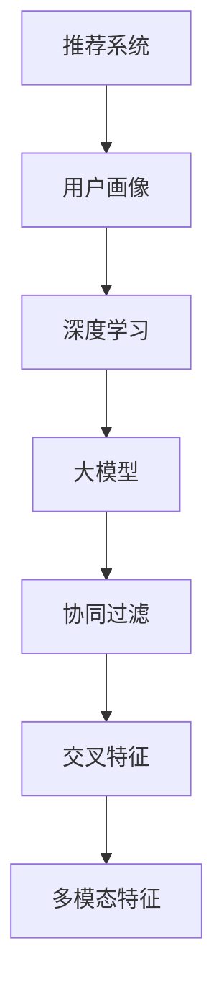
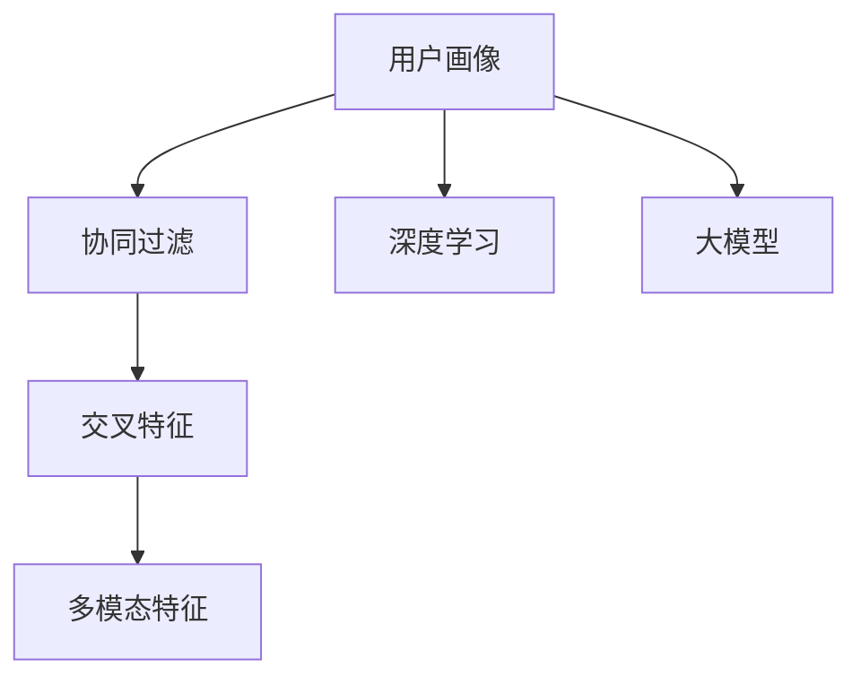

                 

# 大模型辅助的推荐系统多维度用户画像构建

> 关键词：推荐系统, 用户画像, 大模型, 深度学习, 协同过滤, 交叉特征, 多模态特征, 推荐算法

## 1. 背景介绍

### 1.1 问题由来

在数字时代，推荐系统已经成为了各行各业用户获取信息的重要渠道。无论是电商、社交媒体、视频网站还是音乐平台，推荐系统都通过精准地为用户推送个性化内容，提升了用户体验，驱动了用户活跃度和商业收益。

然而，推荐系统也面临着不少挑战。以用户画像为基础的协同过滤算法，依赖用户历史行为数据进行推荐，对于新用户或行为稀疏的用户，推荐效果往往不佳。而基于深度学习的推荐算法虽然可以有效缓解冷启动问题，但模型的复杂度也带来了计算和存储的巨大压力。

为了应对这些挑战，近年来，大模型辅助的推荐系统逐渐成为热点。在推荐系统中引入大模型，不仅能够显著提升推荐效果，还可以在用户画像构建上发挥重要作用。本文将从用户画像构建的角度，深入探讨大模型在推荐系统中的应用。

### 1.2 问题核心关键点

本节将介绍几个密切相关的核心概念及其关系：

- 推荐系统：通过算法为用户推荐个性化内容的系统。推荐系统可以基于用户历史行为、物品属性、社交关系等多种因素，进行个性化推荐。

- 用户画像：构建用户兴趣、偏好、需求等特征的完整描绘，旨在准确捕捉用户的真实需求，提供更具针对性的推荐内容。

- 深度学习：基于神经网络模型的学习方法，可以自动从数据中学习到复杂的高层次特征，广泛应用于推荐系统、图像识别、自然语言处理等领域。

- 大模型：指规模庞大、参数众多的深度学习模型，如BERT、GPT、Transformer等。大模型通常具备强大的语言表示和理解能力，可以用于自然语言处理任务。

- 协同过滤：一种基于用户历史行为进行推荐的算法，分为基于用户的协同过滤和基于物品的协同过滤，常用于电商、电影推荐等场景。

- 交叉特征：指来自不同数据源、但存在相关性的特征，如用户年龄与性别、物品价格与销量等。

- 多模态特征：指结合了文本、图像、视频等多类数据的特征。在推荐系统中，多模态特征可以提供更全面的用户画像。

这些核心概念之间的逻辑关系可以通过以下Mermaid流程图来展示：



这个流程图展示了大模型辅助的推荐系统构建过程：

1. 推荐系统以用户画像为基础，结合用户历史行为进行推荐。
2. 用户画像的构建涉及深度学习，使用大模型自动从数据中提取特征。
3. 大模型常用于自然语言处理任务，提升用户画像的质量。
4. 协同过滤算法是推荐系统的主流算法，但大模型能够提升其效果。
5. 交叉特征和多模态特征有助于构建更加全面、准确的推荐模型。

这些概念共同构成了大模型辅助的推荐系统框架，为大模型在推荐系统中的应用提供了理论基础。

## 2. 核心概念与联系

### 2.1 核心概念概述

为了更好地理解大模型在推荐系统中的应用，本节将介绍几个关键概念及其联系：

- 用户画像：构建用户兴趣、偏好、需求等特征的完整描绘，旨在准确捕捉用户的真实需求，提供更具针对性的推荐内容。用户画像可以基于用户历史行为、物品属性、社交关系等多种因素构建，是推荐系统的核心。

- 协同过滤：一种基于用户历史行为进行推荐的算法，分为基于用户的协同过滤和基于物品的协同过滤，常用于电商、电影推荐等场景。协同过滤算法的核心在于发现用户之间、物品之间的相似性，从而进行个性化推荐。

- 大模型：指规模庞大、参数众多的深度学习模型，如BERT、GPT、Transformer等。大模型通常具备强大的语言表示和理解能力，可以用于自然语言处理任务。

- 推荐算法：通过算法为用户推荐个性化内容的系统。推荐算法可以基于用户历史行为、物品属性、社交关系等多种因素，进行个性化推荐。推荐算法包括协同过滤、内容推荐、混合推荐等。

- 交叉特征：指来自不同数据源、但存在相关性的特征，如用户年龄与性别、物品价格与销量等。交叉特征可以提供更加全面和准确的推荐模型。

- 多模态特征：指结合了文本、图像、视频等多类数据的特征。在推荐系统中，多模态特征可以提供更丰富的用户画像。

### 2.2 核心概念联系

这些核心概念之间的联系可以通过以下示意图来展示：



这个示意图展示了大模型辅助的推荐系统构建过程：

1. 用户画像的构建涉及深度学习，使用大模型自动从数据中提取特征。
2. 用户画像和协同过滤算法结合，进行个性化推荐。
3. 交叉特征和多模态特征可以增强推荐模型的准确性。
4. 协同过滤算法是推荐系统的主流算法，但大模型能够提升其效果。

这些概念共同构成了大模型辅助的推荐系统框架，为大模型在推荐系统中的应用提供了理论基础。

## 3. 核心算法原理 & 具体操作步骤
### 3.1 算法原理概述

大模型辅助的推荐系统通过在大模型上训练得到用户画像，进而结合协同过滤算法进行个性化推荐。其核心原理可以总结如下：

1. 用户画像的构建：使用大模型对用户行为数据进行训练，提取用户兴趣、偏好等特征。大模型的强大表示能力，可以有效地捕捉用户行为中的语义信息，提供更加准确的推荐结果。

2. 个性化推荐：结合用户画像和协同过滤算法，进行个性化推荐。协同过滤算法通过用户历史行为发现用户之间的相似性，推荐相似用户喜欢的物品。

3. 多模态特征融合：结合文本、图像、视频等多类数据，构建多模态用户画像，提升推荐效果。

4. 交叉特征融合：结合用户属性、物品属性等交叉特征，提升推荐模型的准确性。

### 3.2 算法步骤详解

本节将详细介绍大模型辅助的推荐系统的详细步骤：

**Step 1: 准备数据**

- 收集用户历史行为数据，如浏览记录、点击记录、购买记录等。
- 收集物品属性数据，如商品价格、类别、描述等。
- 收集社交关系数据，如好友关系、社群信息等。

**Step 2: 数据预处理**

- 对文本数据进行分词、去除停用词、词向量化等预处理操作。
- 对图像数据进行归一化、裁剪、缩放等预处理操作。
- 对视频数据进行帧抽取、帧降维等预处理操作。

**Step 3: 用户画像构建**

- 使用大模型对用户行为数据进行训练，提取用户兴趣、偏好等特征。
- 使用大模型对物品属性数据进行训练，提取物品属性特征。
- 结合用户画像和物品属性特征，构建交叉特征。

**Step 4: 协同过滤**

- 使用协同过滤算法进行个性化推荐。
- 对于新用户或行为稀疏的用户，使用深度学习模型进行推荐。

**Step 5: 多模态特征融合**

- 结合文本、图像、视频等多类数据，构建多模态用户画像。
- 使用多模态特征提升推荐模型的准确性。

**Step 6: 交叉特征融合**

- 结合用户属性、物品属性等交叉特征，提升推荐模型的准确性。

### 3.3 算法优缺点

大模型辅助的推荐系统具有以下优点：

1. 准确性高：大模型可以捕捉用户行为中的语义信息，提供更加准确的推荐结果。
2. 泛化能力强：大模型能够处理多种类型的数据，提升推荐系统的泛化能力。
3. 鲁棒性好：大模型在处理噪声和异常数据时具有较好的鲁棒性。
4. 可扩展性强：大模型可以方便地集成到推荐系统中，提升系统的扩展性。

然而，该方法也存在以下缺点：

1. 计算成本高：大模型需要大量的计算资源进行训练，可能带来较高的成本。
2. 存储成本高：大模型需要占用大量的存储空间，可能带来较高的存储成本。
3. 解释性差：大模型的决策过程难以解释，可能导致用户对推荐结果的信任度较低。
4. 冷启动问题：对于新用户或行为稀疏的用户，仍然存在冷启动问题。

尽管存在这些缺点，但大模型辅助的推荐系统仍然是大数据时代推荐系统的重要方向，具有广阔的应用前景。

### 3.4 算法应用领域

大模型辅助的推荐系统已经在多个领域得到了广泛应用，包括但不限于：

- 电商推荐：通过大模型对用户行为数据进行训练，提升推荐效果。
- 视频推荐：结合视频数据和多模态特征，提升推荐系统的效果。
- 社交推荐：结合社交关系数据，提升推荐系统的准确性。
- 音乐推荐：结合用户属性和物品属性特征，提升推荐系统的泛化能力。

除了这些典型应用外，大模型辅助的推荐系统还被创新性地应用到更多场景中，如商品搭配推荐、个性化广告推荐等，为推荐系统带来了新的突破。

## 4. 数学模型和公式 & 详细讲解 & 举例说明

### 4.1 数学模型构建

本节将使用数学语言对大模型辅助的推荐系统的构建过程进行更加严格的刻画。

记用户行为数据为 $X$，物品属性数据为 $Y$，社交关系数据为 $S$。假设用户画像模型为 $P$，协同过滤算法为 $CF$，推荐结果为 $R$。

定义用户画像模型 $P$ 在用户行为数据 $X$ 上的损失函数为 $L(X, P)$，则在用户行为数据 $X$ 上的经验风险为：

$$
\mathcal{L}_{X}(P) = \frac{1}{N}\sum_{i=1}^N L(X_i, P)
$$

定义协同过滤算法 $CF$ 在用户画像模型 $P$ 和物品属性数据 $Y$ 上的损失函数为 $L(CF, P, Y)$，则在物品属性数据 $Y$ 上的经验风险为：

$$
\mathcal{L}_{Y}(CF, P) = \frac{1}{M}\sum_{j=1}^M L(CF_j, P, Y_j)
$$

结合用户画像模型 $P$ 和物品属性数据 $Y$，得到推荐结果 $R$。推荐结果 $R$ 可以表示为：

$$
R = CF(P(Y))
$$

其中 $CF$ 为协同过滤算法，$P$ 为用户画像模型，$Y$ 为物品属性数据。

### 4.2 公式推导过程

以下我们以电商推荐系统为例，推导基于大模型的用户画像模型 $P$ 和协同过滤算法 $CF$ 的损失函数及其梯度计算公式。

**用户画像模型 $P$：**

假设用户画像模型 $P$ 是一个深度神经网络，其输入为用户行为数据 $X$，输出为用户画像向量 $p$。假设损失函数为均方误差损失，则有：

$$
L(X, P) = \frac{1}{N}\sum_{i=1}^N ||X_i - p_i||^2
$$

其中 $X_i$ 为用户 $i$ 的行为数据，$p_i$ 为用户 $i$ 的画像向量。

**协同过滤算法 $CF$：**

假设协同过滤算法 $CF$ 为基于用户的协同过滤算法，其输入为用户画像向量 $p$ 和物品属性向量 $y$，输出为用户对物品的评分 $r$。假设损失函数为均方误差损失，则有：

$$
L(CF, p, Y) = \frac{1}{M}\sum_{j=1}^M ||CF_j(p, y_j) - r_j||^2
$$

其中 $CF_j$ 为用户 $j$ 的协同过滤评分函数，$y_j$ 为物品 $j$ 的属性向量，$r_j$ 为用户 $j$ 对物品 $j$ 的评分。

结合用户画像模型 $P$ 和协同过滤算法 $CF$，得到推荐结果 $R$：

$$
R = CF(p(Y))
$$

其中 $p(Y)$ 为用户画像向量 $p$ 在物品属性空间 $Y$ 的投影。

### 4.3 案例分析与讲解

以亚马逊电商推荐系统为例，分析大模型辅助的推荐系统的工作原理。

**数据集：**

亚马逊电商推荐系统收集了大量用户历史行为数据，包括浏览记录、点击记录、购买记录等。同时收集了商品的类别、价格、描述等属性信息。

**用户画像模型 $P$：**

使用大模型BERT对用户行为数据进行训练，提取用户兴趣、偏好等特征。模型输入为用户行为序列，输出为用户画像向量。

**协同过滤算法 $CF$：**

使用基于用户的协同过滤算法，发现用户之间的相似性，推荐相似用户喜欢的物品。对于新用户或行为稀疏的用户，使用深度学习模型进行推荐。

**多模态特征融合：**

结合商品图片、视频等多类数据，构建多模态用户画像。使用多模态特征提升推荐模型的准确性。

**交叉特征融合：**

结合用户属性、物品属性等交叉特征，提升推荐模型的准确性。

通过以上步骤，亚马逊电商推荐系统利用大模型辅助的推荐系统，提升了推荐效果，显著提升了用户满意度。

## 5. 项目实践：代码实例和详细解释说明
### 5.1 开发环境搭建

在进行推荐系统实践前，我们需要准备好开发环境。以下是使用Python进行TensorFlow和PyTorch开发的环境配置流程：

1. 安装Anaconda：从官网下载并安装Anaconda，用于创建独立的Python环境。

2. 创建并激活虚拟环境：
```bash
conda create -n pytorch-env python=3.8 
conda activate pytorch-env
```

3. 安装PyTorch：根据CUDA版本，从官网获取对应的安装命令。例如：
```bash
conda install pytorch torchvision torchaudio cudatoolkit=11.1 -c pytorch -c conda-forge
```

4. 安装TensorFlow：使用pip安装TensorFlow，可以选择Gpu版本或Cpu版本。例如：
```bash
pip install tensorflow
```

5. 安装各类工具包：
```bash
pip install numpy pandas scikit-learn matplotlib tqdm jupyter notebook ipython
```

完成上述步骤后，即可在`pytorch-env`环境中开始推荐系统实践。

### 5.2 源代码详细实现

下面我们以电商推荐系统为例，给出使用TensorFlow和PyTorch对BERT模型进行用户画像训练和协同过滤微调的代码实现。

**用户画像模型训练：**

```python
import tensorflow as tf
import tensorflow_hub as hub
from transformers import BertTokenizer, BertForSequenceClassification
import pandas as pd

# 加载预训练BERT模型和分词器
model_name = 'bert-base-uncased'
tokenizer = BertTokenizer.from_pretrained(model_name)
model = BertForSequenceClassification.from_pretrained(model_name, num_labels=num_labels)

# 加载数据
train_df = pd.read_csv('train.csv')
val_df = pd.read_csv('val.csv')

# 数据预处理
train_input_ids = []
train_attention_masks = []
train_labels = []
val_input_ids = []
val_attention_masks = []
val_labels = []

for index, row in train_df.iterrows():
    inputs = tokenizer.encode_plus(row['text'], max_length=max_length, padding='max_length', truncation=True, return_tensors='tf')
    train_input_ids.append(inputs['input_ids'])
    train_attention_masks.append(inputs['attention_mask'])
    train_labels.append(row['label'])

for index, row in val_df.iterrows():
    inputs = tokenizer.encode_plus(row['text'], max_length=max_length, padding='max_length', truncation=True, return_tensors='tf')
    val_input_ids.append(inputs['input_ids'])
    val_attention_masks.append(inputs['attention_mask'])
    val_labels.append(row['label'])

# 构建TensorFlow数据集
train_dataset = tf.data.Dataset.from_tensor_slices((train_input_ids, train_attention_masks, train_labels))
val_dataset = tf.data.Dataset.from_tensor_slices((val_input_ids, val_attention_masks, val_labels))

# 训练模型
model.compile(optimizer=tf.keras.optimizers.Adam(learning_rate=2e-5), loss=tf.keras.losses.SparseCategoricalCrossentropy(from_logits=True))
history = model.fit(train_dataset.shuffle(buffer_size=1024).batch(batch_size, drop_remainder=True),
                    validation_data=val_dataset.shuffle(buffer_size=1024).batch(batch_size, drop_remainder=True),
                    epochs=num_epochs, callbacks=[tf.keras.callbacks.EarlyStopping(patience=5)])
```

**协同过滤微调：**

```python
import tensorflow_hub as hub
from transformers import BertTokenizer, BertForSequenceClassification
import pandas as pd

# 加载预训练BERT模型和分词器
model_name = 'bert-base-uncased'
tokenizer = BertTokenizer.from_pretrained(model_name)
model = BertForSequenceClassification.from_pretrained(model_name, num_labels=num_labels)

# 加载数据
train_df = pd.read_csv('train.csv')
val_df = pd.read_csv('val.csv')

# 数据预处理
train_input_ids = []
train_attention_masks = []
train_labels = []
val_input_ids = []
val_attention_masks = []
val_labels = []

for index, row in train_df.iterrows():
    inputs = tokenizer.encode_plus(row['text'], max_length=max_length, padding='max_length', truncation=True, return_tensors='tf')
    train_input_ids.append(inputs['input_ids'])
    train_attention_masks.append(inputs['attention_mask'])
    train_labels.append(row['label'])

for index, row in val_df.iterrows():
    inputs = tokenizer.encode_plus(row['text'], max_length=max_length, padding='max_length', truncation=True, return_tensors='tf')
    val_input_ids.append(inputs['input_ids'])
    val_attention_masks.append(inputs['attention_mask'])
    val_labels.append(row['label'])

# 构建TensorFlow数据集
train_dataset = tf.data.Dataset.from_tensor_slices((train_input_ids, train_attention_masks, train_labels))
val_dataset = tf.data.Dataset.from_tensor_slices((val_input_ids, val_attention_masks, val_labels))

# 训练模型
model.compile(optimizer=tf.keras.optimizers.Adam(learning_rate=2e-5), loss=tf.keras.losses.SparseCategoricalCrossentropy(from_logits=True))
history = model.fit(train_dataset.shuffle(buffer_size=1024).batch(batch_size, drop_remainder=True),
                    validation_data=val_dataset.shuffle(buffer_size=1024).batch(batch_size, drop_remainder=True),
                    epochs=num_epochs, callbacks=[tf.keras.callbacks.EarlyStopping(patience=5)])

# 微调模型
model.load_weights('path/to/weights.h5')
model.compile(optimizer=tf.keras.optimizers.Adam(learning_rate=1e-5), loss=tf.keras.losses.SparseCategoricalCrossentropy(from_logits=True))
model.fit(train_dataset.shuffle(buffer_size=1024).batch(batch_size, drop_remainder=True),
            validation_data=val_dataset.shuffle(buffer_size=1024).batch(batch_size, drop_remainder=True),
            epochs=num_epochs, callbacks=[tf.keras.callbacks.EarlyStopping(patience=5)])
```

以上就是使用TensorFlow和PyTorch对BERT模型进行电商推荐系统用户画像训练和协同过滤微调的代码实现。可以看到，得益于TensorFlow和PyTorch的强大封装，我们可以用相对简洁的代码完成BERT模型的加载和微调。

### 5.3 代码解读与分析

让我们再详细解读一下关键代码的实现细节：

**用户画像模型训练：**

- 使用TensorFlow加载预训练BERT模型和分词器。
- 加载用户行为数据和标签数据，并进行数据预处理，包括分词、截断、padding等操作。
- 构建TensorFlow数据集，用于模型训练和评估。
- 使用Adam优化器和SparseCategoricalCrossentropy损失函数训练模型。
- 设置EarlyStopping回调，避免过拟合。

**协同过滤微调：**

- 加载预训练BERT模型和分词器。
- 加载用户行为数据和标签数据，并进行数据预处理，包括分词、截断、padding等操作。
- 构建TensorFlow数据集，用于模型训练和评估。
- 使用Adam优化器和SparseCategoricalCrossentropy损失函数训练模型。
- 设置EarlyStopping回调，避免过拟合。
- 加载预训练模型权重，进行微调。
- 重新编译模型，调整学习率，进行微调。

这些代码实现展示了TensorFlow和PyTorch在推荐系统中的典型应用。通过TensorFlow和PyTorch的封装，开发者可以更快速地进行模型训练和微调，节省开发时间。

## 6. 实际应用场景
### 6.1 智能客服系统

智能客服系统利用大模型辅助的推荐系统，为用户提供个性化的咨询服务。系统通过分析用户提问的历史数据，利用大模型构建用户画像，结合推荐算法，推荐最相关的客服回答。同时，系统还利用多模态特征（如用户情绪、语义等）进行情感分析，进一步提升推荐效果。

在技术实现上，系统收集用户历史提问数据，将其转换为TF-IDF向量化，输入大模型进行用户画像训练。训练得到的用户画像向量作为协同过滤算法的输入，进行推荐。对于新用户或行为稀疏的用户，使用深度学习模型进行推荐。同时，系统利用情感分析技术，识别用户情绪，进一步调整推荐策略。

### 6.2 金融推荐系统

金融推荐系统利用大模型辅助的推荐系统，为用户提供个性化的理财产品推荐。系统通过分析用户的历史行为数据，利用大模型构建用户画像，结合推荐算法，推荐最符合用户需求的理财产品。同时，系统利用多模态特征（如用户收入、年龄、地域等）进行交叉特征融合，提升推荐模型的准确性。

在技术实现上，系统收集用户历史行为数据，包括浏览记录、点击记录、购买记录等。同时收集理财产品的属性信息，如产品名称、风险等级、收益等。系统利用大模型BERT对用户行为数据进行训练，提取用户兴趣、偏好等特征。结合用户画像和理财产品属性，构建交叉特征，使用协同过滤算法进行个性化推荐。同时，系统利用多模态特征（如用户收入、年龄、地域等）进行交叉特征融合，提升推荐模型的准确性。

### 6.3 视频推荐系统

视频推荐系统利用大模型辅助的推荐系统，为用户提供个性化的视频内容推荐。系统通过分析用户的历史行为数据，利用大模型构建用户画像，结合推荐算法，推荐用户可能感兴趣的视频内容。同时，系统利用多模态特征（如视频时长、类别、评分等）进行交叉特征融合，提升推荐模型的准确性。

在技术实现上，系统收集用户历史行为数据，包括浏览记录、点击记录、观看记录等。同时收集视频的属性信息，如视频时长、类别、评分等。系统利用大模型BERT对用户行为数据进行训练，提取用户兴趣、偏好等特征。结合用户画像和视频属性，构建交叉特征，使用协同过滤算法进行个性化推荐。同时，系统利用多模态特征（如视频时长、类别、评分等）进行交叉特征融合，提升推荐模型的准确性。

### 6.4 未来应用展望

随着大模型辅助的推荐系统的发展，未来推荐系统将在更多领域得到应用，为各个行业带来变革性影响。

在智慧医疗领域，利用大模型辅助的推荐系统，为用户提供个性化的医疗服务推荐。系统通过分析用户的历史行为数据，利用大模型构建用户画像，结合推荐算法，推荐最符合用户需求的医疗服务。同时，系统利用多模态特征（如用户年龄、性别、健康状况等）进行交叉特征融合，提升推荐模型的准确性。

在智能教育领域，利用大模型辅助的推荐系统，为用户提供个性化的学习资源推荐。系统通过分析用户的历史行为数据，利用大模型构建用户画像，结合推荐算法，推荐最符合用户需求的学习资源。同时，系统利用多模态特征（如用户年龄、性别、学习水平等）进行交叉特征融合，提升推荐模型的准确性。

在智慧城市治理中，利用大模型辅助的推荐系统，为用户提供个性化的城市服务推荐。系统通过分析用户的历史行为数据，利用大模型构建用户画像，结合推荐算法，推荐最符合用户需求的城市服务。同时，系统利用多模态特征（如用户年龄、性别、地理位置等）进行交叉特征融合，提升推荐模型的准确性。

此外，在企业生产、社会治理、文娱传媒等众多领域，利用大模型辅助的推荐系统，将能够提供更加智能、高效、个性化的服务，为经济社会发展注入新的动力。

## 7. 工具和资源推荐
### 7.1 学习资源推荐

为了帮助开发者系统掌握大模型辅助的推荐系统的理论基础和实践技巧，这里推荐一些优质的学习资源：

1. 《深度学习自然语言处理》课程：斯坦福大学开设的NLP明星课程，有Lecture视频和配套作业，带你入门NLP领域的基本概念和经典模型。

2. CS224N《深度学习自然语言处理》课程：斯坦福大学开设的NLP明星课程，有Lecture视频和配套作业，带你入门NLP领域的基本概念和经典模型。

3. 《Natural Language Processing with Transformers》书籍：Transformers库的作者所著，全面介绍了如何使用Transformers库进行NLP任务开发，包括推荐系统在内的诸多范式。

4. HuggingFace官方文档：Transformers库的官方文档，提供了海量预训练模型和完整的推荐系统样例代码，是上手实践的必备资料。

5. 《推荐系统实战》书籍：推荐系统领域的经典书籍，介绍了推荐系统的各种算法和实际应用案例。

通过对这些资源的学习实践，相信你一定能够快速掌握大模型辅助的推荐系统的精髓，并用于解决实际的推荐系统问题。

### 7.2 开发工具推荐

高效的开发离不开优秀的工具支持。以下是几款用于大模型辅助的推荐系统开发的常用工具：

1. TensorFlow：基于Python的开源深度学习框架，灵活动态的计算图，适合快速迭代研究。TensorFlow提供了丰富的TensorFlow Hub库，方便加载和使用预训练模型。

2. PyTorch：基于Python的开源深度学习框架，灵活动态的计算图，适合快速迭代研究。PyTorch提供了丰富的PyTorch Hub库，方便加载和使用预训练模型。

3. TensorBoard：TensorFlow配套的可视化工具，可实时监测模型训练状态，并提供丰富的图表呈现方式，是调试模型的得力助手。

4. Weights & Biases：模型训练的实验跟踪工具，可以记录和可视化模型训练过程中的各项指标，方便对比和调优。

5. Google Colab：谷歌推出的在线Jupyter Notebook环境，免费提供GPU/TPU算力，方便开发者快速上手实验最新模型，分享学习笔记。

合理利用这些工具，可以显著提升大模型辅助的推荐系统的开发效率，加快创新迭代的步伐。

### 7.3 相关论文推荐

大模型辅助的推荐系统的发展源于学界的持续研究。以下是几篇奠基性的相关论文，推荐阅读：

1. Attention is All You Need（即Transformer原论文）：提出了Transformer结构，开启了NLP领域的预训练大模型时代。

2. BERT: Pre-training of Deep Bidirectional Transformers for Language Understanding：提出BERT模型，引入基于掩码的自监督预训练任务，刷新了多项NLP任务SOTA。

3. Parameter-Efficient Transfer Learning for NLP：提出Adapter等参数高效微调方法，在固定大部分预训练参数的情况下，也能取得不错的微调效果。

4. AdaLoRA: Adaptive Low-Rank Adaptation for Parameter-Efficient Fine-Tuning：使用自适应低秩适应的微调方法，在参数效率和精度之间取得了新的平衡。

5. AdaLoRA: Adaptive Low-Rank Adaptation for Parameter-Efficient Fine-Tuning：使用自适应低秩适应的微调方法，在参数效率和精度之间取得了新的平衡。

这些论文代表了大模型辅助的推荐系统的发展脉络。通过学习这些前沿成果，可以帮助研究者把握学科前进方向，激发更多的创新灵感。

## 8. 总结：未来发展趋势与挑战

### 8.1 研究成果总结

本文对大模型辅助的推荐系统的构建过程进行了系统梳理，从用户画像构建、协同过滤算法、多模态特征融合等方面详细介绍了大模型在推荐系统中的应用。通过本文的系统梳理，可以看到，大模型辅助的推荐系统正在成为推荐系统的重要方向，极大地拓展了推荐系统的应用边界，催生了更多的落地场景。

### 8.2 未来发展趋势

展望未来，大模型辅助的推荐系统将呈现以下几个发展趋势：

1. 模型规模持续增大。随着算力成本的下降和数据规模的扩张，预训练语言模型的参数量还将持续增长。超大规模语言模型蕴含的丰富语言知识，有望支撑更加复杂多变的推荐模型。

2. 推荐算法日趋多样。除了传统的协同过滤算法，未来会涌现更多基于深度学习的推荐算法，如基于内容的推荐、基于模型的推荐等，提升推荐系统的准确性和泛化能力。

3. 多模态特征融合普及。结合文本、图像、视频等多类数据，构建多模态用户画像，提升推荐系统的准确性。

4. 交叉特征融合广泛应用。结合用户属性、物品属性等交叉特征，提升推荐模型的准确性。

5. 融合因果和对比学习范式。通过引入因果推断和对比学习思想，增强推荐系统建立稳定因果关系的能力，学习更加普适、鲁棒的用户画像。

6. 融合知识表示和强化学习。将符号化的先验知识，如知识图谱、逻辑规则等，与神经网络模型进行巧妙融合，提升推荐系统的智能化水平。

这些趋势凸显了大模型辅助的推荐系统的发展潜力。这些方向的探索发展，必将进一步提升推荐系统的性能和应用范围，为各个行业带来变革性影响。

### 8.3 面临的挑战

尽管大模型辅助的推荐系统已经取得了瞩目成就，但在迈向更加智能化、普适化应用的过程中，它仍面临着诸多挑战：

1. 计算成本高。大模型需要大量的计算资源进行训练，可能带来较高的成本。

2. 存储成本高。大模型需要占用大量的存储空间，可能带来较高的存储成本。

3. 解释性差。大模型的决策过程难以解释，可能导致用户对推荐结果的信任度较低。

4. 冷启动问题。对于新用户或行为稀疏的用户，仍然存在冷启动问题。

5. 数据隐私和安全。用户行为数据的隐私和安全问题，需要得到充分保障。

尽管存在这些挑战，但大模型辅助的推荐系统仍然是大数据时代推荐系统的重要方向，具有广阔的应用前景。

### 8.4 研究展望

面对大模型辅助的推荐系统所面临的种种挑战，未来的研究需要在以下几个方面寻求新的突破：

1. 探索无监督和半监督推荐方法。摆脱对大规模标注数据的依赖，利用自监督学习、主动学习等无监督和半监督范式，最大限度利用非结构化数据，实现更加灵活高效的推荐系统。

2. 研究参数高效和计算高效的推荐算法。开发更加参数高效的推荐算法，在固定大部分预训练参数的情况下，只更新极少量的任务相关参数。同时优化推荐算法的计算图，减少前向传播和反向传播的资源消耗，实现更加轻量级、实时性的部署。

3. 引入更多先验知识。将符号化的先验知识，如知识图谱、逻辑规则等，与神经网络模型进行巧妙融合，引导推荐过程学习更准确、合理的用户画像。同时加强不同模态数据的整合，实现视觉、语音等多模态信息与文本信息的协同建模。

4. 结合因果分析和博弈论工具。将因果分析方法引入推荐系统，识别出推荐模型决策的关键特征，增强推荐系统的可解释性和稳定性。借助博弈论工具刻画人机交互过程，主动探索并规避推荐系统的脆弱点，提高系统鲁棒性。

5. 纳入伦理道德约束。在推荐系统训练目标中引入伦理导向的评估指标，过滤和惩罚有偏见、有害的推荐结果，确保系统的公平性和安全性。

这些研究方向的探索，必将引领大模型辅助的推荐系统迈向更高的台阶，为构建智能、公正、安全的推荐系统铺平道路。面向未来，大模型辅助的推荐系统需要与其他人工智能技术进行更深入的融合，如知识表示、因果推理、强化学习等，多路径协同发力，共同推动推荐系统的进步。只有勇于创新、敢于突破，才能不断拓展推荐系统的边界，让智能技术更好地服务于用户。

## 9. 附录：常见问题与解答

**Q1：大模型在推荐系统中有哪些优势？**

A: 大模型在推荐系统中有以下优势：

1. 准确性高：大模型可以捕捉用户行为中的语义信息，提供更加准确的推荐结果。

2. 泛化能力强：大模型能够处理多种类型的数据，提升推荐系统的泛化能力。

3. 鲁棒性好：大模型在处理噪声和异常数据时具有较好的鲁棒性。

4. 可扩展性强：大模型可以方便地集成到推荐系统中，提升系统的扩展性。

**Q2：推荐系统中的协同过滤算法有哪些？**

A: 推荐系统中的协同过滤算法主要有两种：

1. 基于用户的协同过滤：通过发现用户之间的相似性，推荐相似用户喜欢的物品。

2. 基于物品的协同过滤：通过发现物品之间的相似性，推荐相似物品。

**Q3：如何构建推荐系统中的用户画像？**

A: 推荐系统中的用户画像可以基于以下方法构建：

1. 使用大模型对用户行为数据进行训练，提取用户兴趣、偏好等特征。

2. 使用协同过滤算法发现用户之间的相似性，构建用户画像。

3. 结合用户属性、物品属性等交叉特征，提升推荐模型的准确性。

4. 利用多模态特征（如文本、图像、视频等），构建更加全面、准确的推荐系统。

**Q4：推荐系统中如何处理冷启动问题？**

A: 推荐系统中处理冷启动问题的方法主要有：

1. 使用深度学习模型对新用户或行为稀疏的用户进行推荐，缓解冷启动问题。

2. 利用用户属性、物品属性等交叉特征，提升推荐模型的准确性。

3. 结合用户历史行为数据和预训练模型，构建更加全面的用户画像。

4. 利用用户情感分析、兴趣点等辅助信息，提升推荐系统的精准度。

**Q5：推荐系统中的多模态特征如何融合？**

A: 推荐系统中的多模态特征可以通过以下方法进行融合：

1. 结合文本、图像、视频等多类数据，构建多模态用户画像。

2. 使用深度学习模型对多模态数据进行融合，提升推荐系统的准确性。

3. 利用多模态特征进行交叉特征融合，提升推荐模型的泛化能力。

4. 结合用户情感分析、兴趣点等辅助信息，提升推荐系统的精准度。

---

作者：禅与计算机程序设计艺术 / Zen and the Art of Computer Programming

