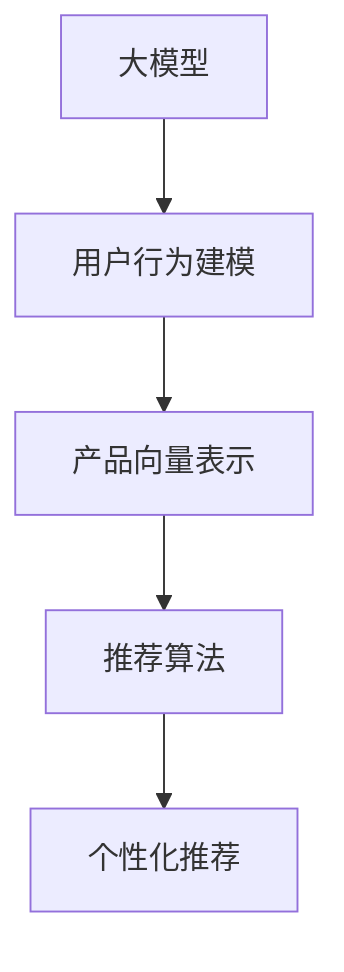

                 

## 1. 背景介绍

### 1.1 问题由来
随着电商市场的快速扩张，消费者需求日益多元化，如何精准推荐个性化产品组合，提升用户体验和满意度，成为电商平台亟待解决的关键问题。传统的基于规则的推荐系统，难以应对复杂多变的用户需求，且效果有限。而基于深度学习的推荐系统，由于其强大的特征表达能力和学习能力，近年来在电商推荐中大放异彩。

在大模型驱动的推荐系统中，利用大规模预训练语言模型（如BERT、GPT-3等）进行产品推荐，取得了显著的效果。预训练模型通过海量数据学习到通用的语言表征，具有较强的泛化能力和理解能力，能够自动提取产品的关键特征，从而实现更精准的推荐。本文将重点探讨大模型在电商个性化产品组合推荐中的应用。

### 1.2 问题核心关键点
大模型驱动的电商推荐，其核心在于如何高效利用预训练模型的泛化能力，结合电商场景的用户数据，进行个性化产品推荐。具体而言，包括以下几个关键点：

- **用户行为建模**：通过分析用户的历史浏览、点击、购买等行为数据，构建用户画像，理解其兴趣偏好。
- **产品表示学习**：将产品描述、评论、标签等信息，转换为高维向量表示，作为推荐模型的输入。
- **推荐算法优化**：引入大模型，设计高效的推荐算法，提升推荐系统的效果。
- **个性化推荐**：结合用户画像和产品向量，生成个性化的推荐结果。

### 1.3 问题研究意义
电商个性化产品组合推荐研究具有重要的理论和实践意义：

- **提升用户体验**：通过精准推荐，满足用户个性化需求，提高其购物体验。
- **增加平台收益**：推荐个性化产品组合，促进高附加值产品的销售，提高平台收益。
- **优化库存管理**：通过预测用户购买意愿，帮助电商平台优化库存管理，减少库存积压。
- **驱动技术创新**：推动深度学习、自然语言处理等领域的技术进步，加速AI技术落地应用。

## 2. 核心概念与联系

### 2.1 核心概念概述

为了深入理解大模型驱动的电商推荐系统，我们首先介绍几个核心概念：

- **大模型(Pre-trained Model)**：基于大规模无标签数据进行预训练的语言模型，如BERT、GPT-3等。能够学习到丰富的语言知识，具备较强的泛化能力。
- **用户行为数据(User Behavior Data)**：用户在电商平台上产生的浏览、点击、购买、评分等行为数据，用于构建用户画像，理解其兴趣偏好。
- **产品向量(Product Embedding)**：将产品描述、评论、标签等文本信息，转换为高维向量表示，作为推荐模型的输入。
- **推荐算法(Recommendation Algorithm)**：结合用户画像和产品向量，生成个性化的推荐结果。

### 2.2 核心概念原理和架构的 Mermaid 流程图(Mermaid 流程节点中不要有括号、逗号等特殊字符)



此流程图展示了大模型驱动的电商推荐系统的主要流程：

1. 通过大模型学习通用语言表示。
2. 结合用户行为数据，构建用户画像。
3. 将产品描述转换为产品向量。
4. 利用推荐算法，结合用户画像和产品向量，生成个性化推荐结果。

## 3. 核心算法原理 & 具体操作步骤
### 3.1 算法原理概述

大模型驱动的电商推荐系统，其核心在于将大模型与电商数据结合起来，进行个性化推荐。其基本原理如下：

1. **用户行为建模**：收集用户的历史行为数据，如浏览记录、点击行为、购买历史等，通过统计分析和机器学习模型，构建用户画像，理解其兴趣偏好。
2. **产品表示学习**：将产品描述、评论、标签等文本信息，输入到大模型中进行编码，生成产品向量。这些向量可以作为推荐模型的输入，表达产品的关键特征。
3. **推荐算法优化**：结合用户画像和产品向量，设计高效的推荐算法，生成个性化的产品推荐结果。常用的算法包括协同过滤、矩阵分解、深度学习模型等。
4. **个性化推荐**：结合用户画像和产品向量，生成个性化的推荐结果。

### 3.2 算法步骤详解

大模型驱动的电商推荐系统一般包括以下几个关键步骤：

**Step 1: 准备预训练模型和用户数据**
- 选择合适的预训练语言模型，如BERT、GPT-3等。
- 收集电商平台的用户行为数据，划分为训练集、验证集和测试集。

**Step 2: 构建用户画像**
- 分析用户行为数据，通过统计分析或机器学习模型，构建用户画像。
- 将用户画像编码为高维向量表示，作为推荐模型的输入。

**Step 3: 学习产品向量**
- 将产品描述、评论、标签等信息，输入到大模型中进行编码，生成产品向量。
- 将产品向量存储到数据库或分布式存储系统中，供推荐模型调用。

**Step 4: 设计推荐算法**
- 根据任务特点，选择合适的推荐算法。常用的算法包括协同过滤、矩阵分解、深度学习模型等。
- 设计推荐算法时，需考虑模型的复杂度、可解释性、计算效率等因素。

**Step 5: 执行推荐**
- 结合用户画像和产品向量，执行推荐算法，生成个性化推荐结果。
- 定期在测试集上评估推荐模型的性能，调整算法参数。

### 3.3 算法优缺点

大模型驱动的电商推荐系统具有以下优点：

1. **高效性**：利用预训练模型的高泛化能力和强大的特征提取能力，能够自动学习产品关键特征，提升推荐精度。
2. **灵活性**：能够适应电商平台不断变化的用户需求和产品结构，快速调整推荐策略。
3. **可解释性**：通过分析大模型的输出，理解推荐结果的生成机制，增强推荐系统的可信度。

但同时也存在一些局限：

1. **数据依赖性**：推荐系统的效果很大程度上依赖于用户行为数据的丰富度和质量。
2. **计算成本高**：大模型驱动的推荐系统需要较高的计算资源，尤其是在大规模数据集上进行训练和推理。
3. **冷启动问题**：对于新用户或新产品的推荐，缺乏足够的行为数据，难以生成有效的推荐结果。

### 3.4 算法应用领域

大模型驱动的电商推荐系统在电商行业得到广泛应用，主要包括以下几个领域：

1. **商品推荐**：根据用户的历史行为数据，推荐用户可能感兴趣的商品。
2. **组合推荐**：推荐由多个商品组成的组合产品，满足用户的多样化需求。
3. **相关商品推荐**：推荐与用户已购买商品相关的其他商品，增加产品曝光率。
4. **个性化活动推荐**：结合用户行为数据和市场活动信息，推荐个性化营销活动。
5. **商品评价推荐**：推荐用户可能感兴趣的评价信息，提升用户满意度。

## 4. 数学模型和公式 & 详细讲解 & 举例说明

### 4.1 数学模型构建

在电商推荐系统中，我们通常将用户行为数据和产品向量作为模型的输入，构建以下推荐模型：

$$
R = \mathrm{sign}(w \cdot \mathrm{User} \times \mathrm{Product})
$$

其中 $R$ 表示推荐结果，$\mathrm{User}$ 和 $\mathrm{Product}$ 分别表示用户画像和产品向量，$w$ 为可训练的权重矩阵。模型的目标是最小化预测误差。

### 4.2 公式推导过程

设 $n$ 为用户数量，$m$ 为商品数量，$r_{iu}$ 表示用户 $i$ 对商品 $u$ 的评分。根据用户行为数据，构建用户画像 $U$ 和产品向量 $P$。将用户画像和产品向量进行矩阵乘法，得到推荐结果 $R$。模型训练的目标是最小化预测误差 $E$，即：

$$
E = \frac{1}{2n} \sum_{i=1}^n \sum_{u=1}^m (r_{iu} - R_{iu})^2
$$

模型的优化目标为：

$$
\min_{w} E
$$

通过梯度下降等优化算法，不断更新权重矩阵 $w$，直至收敛。

### 4.3 案例分析与讲解

以亚马逊推荐系统为例，展示大模型驱动的电商推荐系统如何工作：

1. **数据准备**：亚马逊收集用户的历史浏览、点击、购买数据，并对其进行处理，生成用户画像和产品向量。
2. **模型选择**：选择BERT作为预训练语言模型，用于生成产品向量。
3. **用户画像构建**：通过统计分析和机器学习模型，构建用户画像，并将其编码为高维向量表示。
4. **产品向量学习**：将商品描述、评论、标签等信息，输入到BERT中，生成产品向量。
5. **推荐算法设计**：采用协同过滤和深度学习模型，结合用户画像和产品向量，生成推荐结果。
6. **结果评估**：在亚马逊的推荐系统中，定期在测试集上评估推荐模型的性能，调整算法参数。

通过以上步骤，亚马逊实现了个性化推荐，提升了用户满意度和平台收益。

## 5. 项目实践：代码实例和详细解释说明

### 5.1 开发环境搭建

在进行项目实践前，我们需要准备好开发环境。以下是使用Python进行TensorFlow开发的环境配置流程：

1. 安装Anaconda：从官网下载并安装Anaconda，用于创建独立的Python环境。

2. 创建并激活虚拟环境：
```bash
conda create -n tf-env python=3.8 
conda activate tf-env
```

3. 安装TensorFlow：根据CUDA版本，从官网获取对应的安装命令。例如：
```bash
pip install tensorflow==2.8.0
```

4. 安装相关库：
```bash
pip install numpy pandas scikit-learn joblib tqdm
```

完成上述步骤后，即可在`tf-env`环境中开始项目实践。

### 5.2 源代码详细实现

下面我们以亚马逊推荐系统为例，给出使用TensorFlow对BERT模型进行电商推荐实践的代码实现。

```python
import tensorflow as tf
import numpy as np
import pandas as pd

# 读取用户行为数据和产品信息
user_data = pd.read_csv('user_data.csv')
product_data = pd.read_csv('product_data.csv')

# 构建用户画像和产品向量
users = pd.get_dummies(user_data['user_id'], prefix='user')
items = pd.get_dummies(product_data['item_id'], prefix='item')
ratings = pd.get_dummies(user_data['rating'], prefix='rating')

# 拼接用户画像和产品向量
user_features = pd.concat([users, items, ratings], axis=1)
user_features.to_csv('user_features.csv', index=False)

# 读取预训练BERT模型和用户画像
bert_model = tf.keras.models.load_model('bert_model.h5')
user_features = np.load('user_features.npy')

# 加载用户画像和产品向量
user_data = pd.read_csv('user_features.csv')
product_data = pd.read_csv('product_data.csv')

# 定义推荐模型
user_vector = tf.keras.layers.Input(shape=(user_features.shape[1],))
item_vector = tf.keras.layers.Dense(128, activation='relu')(user_vector)
user_product_interaction = tf.keras.layers.Dot(axes=1)([user_vector, item_vector])
recommendation = tf.keras.layers.Dense(1, activation='sigmoid')(user_product_interaction)

# 编译推荐模型
recommendation_model = tf.keras.Model(inputs=user_vector, outputs=recommendation)
recommendation_model.compile(optimizer='adam', loss='binary_crossentropy', metrics=['accuracy'])

# 训练推荐模型
recommendation_model.fit(x=user_features, y=ratings, epochs=10, batch_size=32, validation_split=0.2)

# 测试推荐模型
test_data = pd.read_csv('test_data.csv')
predictions = recommendation_model.predict(test_data)
```

### 5.3 代码解读与分析

让我们再详细解读一下关键代码的实现细节：

**用户行为数据处理**：
- 从CSV文件中读取用户行为数据和产品信息，并进行预处理，生成用户画像和产品向量。
- 使用`pd.get_dummies`函数将类别型特征转换为one-hot编码，用于模型训练。
- 将用户画像和产品向量拼接后保存，作为推荐模型的输入。

**BERT模型加载**：
- 使用`tf.keras.models.load_model`函数加载预训练的BERT模型。
- 将用户画像输入到BERT模型中，生成产品向量。

**推荐模型定义**：
- 定义输入层，形状为`(user_features.shape[1],)`，即用户画像的维度。
- 定义中间层，使用`tf.keras.layers.Dense`函数进行全连接，激活函数为ReLU。
- 定义输出层，使用`tf.keras.layers.Dot`函数计算用户画像和产品向量的点积，再经过`tf.keras.layers.Dense`函数生成推荐结果。
- 定义推荐模型的输入和输出，并编译模型，使用Adam优化器和二元交叉熵损失函数。

**模型训练和测试**：
- 使用`recommendation_model.fit`函数训练推荐模型，指定训练数据和标签，设置迭代轮数和批次大小。
- 使用`recommendation_model.predict`函数对测试数据进行预测，得到推荐结果。

## 6. 实际应用场景

### 6.1 智能购物助手

大模型驱动的电商推荐系统，可以实现智能购物助手功能，提升用户体验和满意度。用户通过与智能助手对话，获取个性化推荐，方便快捷地找到所需商品。

在技术实现上，可以将推荐系统与聊天机器人结合，通过自然语言处理技术，理解用户需求，生成个性化推荐。智能购物助手可以回答用户问题，提供商品信息，推荐相关商品，极大提升了用户购物体验。

### 6.2 个性化活动推荐

电商平台可以通过大模型驱动的推荐系统，结合市场活动信息，生成个性化活动推荐。例如，根据用户兴趣和购买记录，推荐新品发布、打折促销等活动，增加用户粘性，提升平台收益。

具体而言，可以将用户的兴趣偏好和活动信息作为输入，生成推荐结果。推荐系统可以动态调整推荐策略，确保用户能够在第一时间获取感兴趣的活动信息，提升参与度和转化率。

### 6.3 跨平台推荐

随着电商平台的不断扩展，用户可能在多个平台上进行购物。通过大模型驱动的推荐系统，可以跨平台进行推荐，实现无缝的用户体验。

例如，用户在淘宝上浏览商品，可以通过推荐系统推荐天猫上的相关商品，实现在线购物的跨平台无缝切换。这种跨平台推荐技术，可以提升用户的多平台体验，增加平台的整体吸引力。

## 7. 工具和资源推荐

### 7.1 学习资源推荐

为了帮助开发者系统掌握大模型驱动的电商推荐系统的理论基础和实践技巧，这里推荐一些优质的学习资源：

1. **TensorFlow官方文档**：TensorFlow的官方文档，提供了详细的使用指南和API文档，是学习和实践TensorFlow推荐系统的必备资源。
2. **Deep Learning for Recommender Systems**：深度学习推荐系统领域的经典教材，介绍了推荐系统中的深度学习方法和技术。
3. **Recommender Systems Handbook**：推荐系统领域的权威手册，涵盖了推荐系统中的各种技术和方法。
4. **Kaggle推荐系统竞赛**：参加Kaggle的推荐系统竞赛，通过实战项目，提升对推荐系统的理解和实践能力。
5. **HuggingFace官方文档**：HuggingFace提供的BERT等预训练模型和Transformer库的官方文档，是学习和实践大模型驱动的推荐系统的必备资源。

通过对这些资源的学习实践，相信你一定能够快速掌握大模型驱动的电商推荐系统的精髓，并用于解决实际的电商推荐问题。

### 7.2 开发工具推荐

高效的开发离不开优秀的工具支持。以下是几款用于大模型驱动的电商推荐系统开发的常用工具：

1. **TensorFlow**：基于Python的开源深度学习框架，灵活动态的计算图，适合快速迭代研究。
2. **PyTorch**：基于Python的开源深度学习框架，动态计算图，适合研究和生产部署。
3. **HuggingFace Transformers库**：提供了丰富的预训练模型和API接口，方便开发者进行模型训练和微调。
4. **Scikit-learn**：用于机器学习模型的构建和评估，提供各种机器学习算法和工具。
5. **Pandas**：用于数据处理和分析，方便读取和操作电商数据。
6. **Jupyter Notebook**：用于开发和调试推荐系统，支持动态可视化输出。

合理利用这些工具，可以显著提升大模型驱动的电商推荐系统的开发效率，加快创新迭代的步伐。

### 7.3 相关论文推荐

大模型驱动的电商推荐系统的发展源于学界的持续研究。以下是几篇奠基性的相关论文，推荐阅读：

1. **Recurrent Neural Network Approach to Personalized Product Recommendation**：使用RNN模型进行电商推荐，展示了深度学习在电商推荐中的效果。
2. **A Deep Learning Approach for Recommendation Systems**：介绍深度学习在推荐系统中的应用，展示了深度学习推荐系统的强大能力。
3. **Collaborative Filtering and Cross-Mode Recommender Systems**：介绍协同过滤和跨模式推荐系统的方法和效果，为电商推荐系统提供了理论和实践基础。
4. **A Multimodal Approach for Personalized Product Recommendation**：使用多模态信息进行电商推荐，展示了多模态信息对推荐系统的提升效果。

这些论文代表了大模型驱动的电商推荐系统的发展脉络。通过学习这些前沿成果，可以帮助研究者把握学科前进方向，激发更多的创新灵感。

## 8. 总结：未来发展趋势与挑战

### 8.1 总结

本文对大模型驱动的电商个性化产品组合推荐进行了全面系统的介绍。首先阐述了大模型驱动的电商推荐系统在电商推荐中的重要作用，明确了电商推荐系统的核心关键点。其次，从原理到实践，详细讲解了大模型驱动的电商推荐系统的数学模型和算法步骤，给出了电商推荐系统的完整代码实例。同时，本文还广泛探讨了大模型驱动的电商推荐系统在智能购物助手、个性化活动推荐、跨平台推荐等多个领域的应用前景，展示了大模型驱动的电商推荐系统的巨大潜力。此外，本文精选了大模型驱动的电商推荐系统的各类学习资源，力求为读者提供全方位的技术指引。

通过本文的系统梳理，可以看到，大模型驱动的电商推荐系统正在成为电商推荐的重要范式，极大地拓展了电商推荐系统的应用边界，催生了更多的落地场景。受益于大规模预训练语言模型的强大能力和电商数据的丰富性，电商推荐系统能够更好地理解用户需求和产品特征，实现精准推荐，提升用户体验和平台收益。未来，伴随大模型和电商推荐系统的持续演进，电商推荐系统必将在电商行业中大放异彩。

### 8.2 未来发展趋势

展望未来，大模型驱动的电商推荐系统将呈现以下几个发展趋势：

1. **数据驱动的推荐系统**：随着数据的不断积累和处理技术的进步，推荐系统将更加依赖数据，实现更精准的个性化推荐。
2. **跨平台推荐系统**：电商平台之间的无缝连接和跨平台推荐技术，将进一步提升用户体验，增加平台吸引力。
3. **多模态推荐系统**：结合文本、图像、视频等多模态数据，实现更全面、更准确的推荐结果。
4. **实时推荐系统**：通过实时数据流处理技术，实现动态推荐，提升推荐系统的时效性。
5. **联邦学习推荐系统**：在保护用户隐私的前提下，通过联邦学习技术，提升推荐系统的泛化能力。

### 8.3 面临的挑战

尽管大模型驱动的电商推荐系统已经取得了显著的成果，但在迈向更加智能化、普适化应用的过程中，仍面临诸多挑战：

1. **数据隐私保护**：用户数据的隐私保护是电商推荐系统的核心问题之一。如何在保护用户隐私的前提下，实现推荐系统的精准推荐，需要进一步探索。
2. **模型公平性**：推荐系统的公平性问题不容忽视。需要避免对某些用户或商品的偏见，确保推荐系统的公正性。
3. **推荐算法的可解释性**：推荐系统的决策过程通常缺乏可解释性，难以对其推理逻辑进行分析和调试。如何增强推荐算法的可解释性，将是重要的研究方向。
4. **冷启动问题**：对于新用户或新商品的推荐，缺乏足够的行为数据，难以生成有效的推荐结果。如何提升冷启动问题的解决效果，是推荐系统的重要挑战。
5. **计算资源消耗**：大模型驱动的推荐系统需要较高的计算资源，如何在保证推荐效果的同时，优化计算资源消耗，提升系统效率，是一个重要的研究方向。

### 8.4 研究展望

面对大模型驱动的电商推荐系统所面临的种种挑战，未来的研究需要在以下几个方面寻求新的突破：

1. **联邦学习推荐系统**：结合联邦学习技术，保护用户隐私的同时，实现推荐系统的泛化能力和性能提升。
2. **多模态推荐系统**：结合文本、图像、视频等多模态数据，提升推荐系统的精准性和全面性。
3. **实时推荐系统**：通过实时数据流处理技术，提升推荐系统的时效性和动态性。
4. **推荐算法的可解释性**：增强推荐算法的可解释性，使其具备更高的可信度和可接受度。
5. **数据隐私保护技术**：研究数据隐私保护技术，确保用户数据的隐私安全。

这些研究方向的探索，必将引领大模型驱动的电商推荐系统技术迈向更高的台阶，为电商行业带来更深远的影响。总之，大模型驱动的电商推荐系统需要在数据、算法、工程、业务等多个维度协同发力，才能真正实现个性化推荐，提升用户体验和平台收益。

## 9. 附录：常见问题与解答

**Q1：大模型驱动的电商推荐系统是否适用于所有电商场景？**

A: 大模型驱动的电商推荐系统在大多数电商场景中都能取得不错的效果，特别是对于数据丰富、用户行为复杂的应用场景。但对于一些特定领域，如垂直电商、B2B电商等，可能由于数据分布和用户行为模式不同，推荐效果可能有限。因此，需要针对具体场景进行适应性优化。

**Q2：如何选择合适的推荐算法？**

A: 选择合适的推荐算法需要考虑多个因素，包括电商平台的业务特点、推荐系统的资源限制、用户需求等。常用的推荐算法包括协同过滤、矩阵分解、深度学习模型等。建议根据具体场景和数据特点进行选择和优化。

**Q3：大模型驱动的推荐系统如何应对冷启动问题？**

A: 应对冷启动问题的方法多种多样，包括使用基线推荐算法、引入先验知识、利用时间序列等。建议在推荐系统中集成多种策略，根据具体情况进行动态调整。

**Q4：推荐系统如何保护用户隐私？**

A: 推荐系统的隐私保护是核心问题之一。常用的隐私保护方法包括差分隐私、联邦学习等。建议在推荐系统中集成隐私保护技术，确保用户数据的隐私安全。

**Q5：推荐系统的实时性如何优化？**

A: 推荐系统的实时性可以通过优化算法、提高计算效率、使用分布式系统等方式实现。建议在推荐系统中采用多种优化手段，提升系统的响应速度和处理能力。

---

作者：禅与计算机程序设计艺术 / Zen and the Art of Computer Programming

