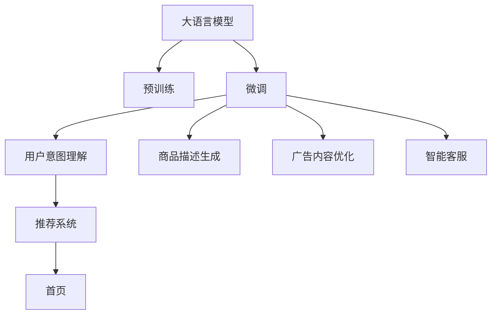

                 

# 大模型驱动的电商个性化首页设计

> 关键词：大模型,个性化,电商首页设计,推荐系统,用户行为分析,自然语言处理,NLP

## 1. 背景介绍

### 1.1 问题由来

近年来，随着电子商务平台用户数量的快速增长，个性化推荐技术成为了电商平台提升用户体验和销售额的关键。传统的推荐系统主要依赖于用户行为数据，通过协同过滤、矩阵分解等方法进行个性化推荐。然而，这些方法在处理冷启动用户、处理多模态数据（如文本、图片、视频等）等方面存在局限性。

大语言模型（Large Language Model, LLM）的出现为电商个性化推荐带来了新的契机。大语言模型通过对海量文本数据的预训练，获得了丰富的语义知识和常识，能够理解和生成自然语言，并将其应用于电商场景中，进行商品推荐、广告投放、智能客服等。

### 1.2 问题核心关键点

大语言模型在电商个性化推荐中的应用主要体现在以下几个方面：

1. **用户意图理解**：通过分析用户评论、搜索历史等文本数据，大语言模型能够准确理解用户购买意图，推荐相关商品。
2. **商品描述生成**：利用大语言模型生成商品描述，帮助用户更好地理解商品属性和特点，提升购买决策质量。
3. **广告内容优化**：通过分析用户历史行为数据，大语言模型能够生成吸引用户的广告文案，提高广告点击率。
4. **智能客服**：通过大语言模型构建的聊天机器人，能够提供24小时不间断的客户服务，提升用户满意度。

本文将系统介绍大语言模型在电商个性化首页设计中的应用，并通过代码实例展示其核心技术细节。

## 2. 核心概念与联系

### 2.1 核心概念概述

为更好地理解大语言模型在电商推荐中的应用，本节将介绍几个关键概念：

- **大语言模型**：以自回归（如GPT）或自编码（如BERT）模型为代表的大规模预训练语言模型。通过在海量无标签文本数据上进行预训练，学习通用的语言表示，具备强大的语言理解和生成能力。

- **预训练**：指在大规模无标签文本数据上，通过自监督学习任务训练通用语言模型的过程。常见的预训练任务包括言语建模、掩码语言模型等。

- **微调**：指在预训练模型的基础上，使用下游任务的少量标注数据，通过有监督地训练来优化模型在该任务上的性能。

- **推荐系统**：基于用户历史行为数据、商品属性等，向用户推荐相关商品或内容的技术系统。

- **用户行为分析**：对用户的历史行为数据进行分析，挖掘用户兴趣和偏好，为个性化推荐提供数据基础。

- **自然语言处理（NLP）**：涉及计算机对人类语言进行理解、生成和分析的技术，是大语言模型在电商推荐中应用的基础。

- **意图识别**：通过分析用户输入的文本数据，识别出用户的购买意图，为推荐提供精准依据。

这些核心概念之间存在密切联系，通过预训练-微调范式，大语言模型在电商推荐中能够充分发挥其语言理解能力，结合用户行为分析，进行更加个性化和精准的推荐。

### 2.2 核心概念原理和架构的 Mermaid 流程图



这个流程图展示了从大语言模型到电商推荐系统的整体架构：

1. 大语言模型通过预训练获取语言知识。
2. 预训练后的模型通过微调，根据电商推荐任务进行优化。
3. 微调后的模型应用于电商推荐系统，实现用户意图理解、商品描述生成、广告内容优化和智能客服等功能。
4. 推荐系统将相关商品推荐到首页，提高用户转化率。

## 3. 核心算法原理 & 具体操作步骤

### 3.1 算法原理概述

大语言模型在电商推荐中的应用主要通过以下几个关键步骤实现：

1. **预训练**：在大规模无标签文本数据上，通过自监督学习任务训练通用语言模型。
2. **微调**：在电商推荐任务的少量标注数据上，通过有监督学习训练模型。
3. **用户意图理解**：利用微调后的模型，分析用户输入的文本数据，识别出购买意图。
4. **商品推荐**：根据用户意图，结合商品属性、历史行为等数据，推荐相关商品。
5. **智能客服**：通过大语言模型构建的聊天机器人，提供智能客服服务。

大语言模型在电商推荐中的应用，可以显著提升推荐的精准度和用户体验，具有重要意义。

### 3.2 算法步骤详解

#### 3.2.1 数据预处理

电商推荐系统需要处理多模态数据，包括用户行为数据、商品属性数据、文本评论数据等。以下是数据预处理的主要步骤：

1. **数据清洗**：去除数据中的噪声和不相关记录，确保数据质量。
2. **数据标注**：对用户评论、搜索历史等文本数据进行标注，识别出用户购买意图和商品属性。
3. **数据融合**：将多模态数据进行融合，构建统一的用户和商品信息表示。

#### 3.2.2 模型训练

大语言模型在电商推荐中的应用，主要通过以下步骤进行模型训练：

1. **选择合适的模型**：选择合适的预训练语言模型，如BERT、GPT等，作为初始化参数。
2. **添加任务适配层**：根据电商推荐任务，设计合适的输出层和损失函数。
3. **设置微调超参数**：选择合适的优化算法及其参数，如AdamW、SGD等，设置学习率、批大小、迭代轮数等。
4. **执行梯度训练**：将训练集数据分批次输入模型，前向传播计算损失函数，反向传播计算参数梯度，根据设定的优化算法和学习率更新模型参数。

#### 3.2.3 用户意图理解

用户意图理解是电商推荐系统的重要组成部分，主要通过以下步骤实现：

1. **文本输入**：用户输入搜索关键词或商品描述。
2. **模型推理**：将输入文本输入微调后的模型，通过推理得到用户购买意图。
3. **意图输出**：将推理结果输出，供推荐系统进行商品推荐。

#### 3.2.4 商品推荐

商品推荐主要通过以下步骤实现：

1. **数据查询**：根据用户意图查询相关商品数据。
2. **模型推理**：将商品属性、用户历史行为等数据输入微调后的模型，通过推理得到推荐商品。
3. **结果输出**：将推荐商品输出到首页，供用户查看和购买。

#### 3.2.5 智能客服

智能客服主要通过以下步骤实现：

1. **用户输入**：用户输入问题或需求。
2. **模型推理**：将用户输入输入微调后的模型，通过推理得到回答。
3. **结果输出**：将回答输出给用户，完成智能客服服务。

### 3.3 算法优缺点

#### 3.3.1 优点

1. **提升推荐精准度**：大语言模型能够准确理解用户购买意图，结合商品属性和历史行为数据，推荐相关商品，提升推荐精准度。
2. **灵活适应多模态数据**：大语言模型能够处理文本、图片、视频等多模态数据，提升推荐系统的多样性和适应性。
3. **提高用户体验**：通过智能客服等应用，大语言模型能够提供24小时不间断的客户服务，提升用户满意度。
4. **降低开发成本**：大语言模型预训练效果好，微调数据需求低，能够快速适应电商推荐任务，降低开发成本。

#### 3.3.2 缺点

1. **数据需求大**：电商推荐系统需要大量用户行为数据和商品属性数据，数据需求量大。
2. **训练复杂度高**：大语言模型参数多，训练复杂度高，需要高性能计算资源。
3. **过拟合风险高**：电商推荐数据标注难度大，微调数据需求低，存在过拟合风险。
4. **模型泛化能力不足**：大语言模型在特定领域数据上的泛化能力有限，需要针对特定领域进行微调。

### 3.4 算法应用领域

大语言模型在电商推荐中的应用领域广泛，涵盖以下方面：

1. **个性化推荐**：基于用户历史行为和文本数据，进行个性化商品推荐。
2. **广告投放**：通过分析用户历史行为数据，生成吸引用户的广告文案，提高广告点击率。
3. **智能客服**：通过大语言模型构建的聊天机器人，提供智能客服服务，提升用户满意度。
4. **商品描述生成**：利用大语言模型生成商品描述，帮助用户更好地理解商品属性和特点，提升购买决策质量。

## 4. 数学模型和公式 & 详细讲解 & 举例说明

### 4.1 数学模型构建

在电商推荐中，大语言模型主要通过以下数学模型进行训练：

设大语言模型为 $M_{\theta}$，输入为 $x$，输出为 $y$。电商推荐任务的目标是最大化模型输出与真实标签的匹配度。假设标注数据集为 $D=\{(x_i,y_i)\}_{i=1}^N$，则目标函数为：

$$
\mathcal{L}(\theta) = -\frac{1}{N}\sum_{i=1}^N \log P(y_i|x_i;\theta)
$$

其中 $P(y_i|x_i;\theta)$ 为模型在输入 $x_i$ 下的输出 $y_i$ 的概率分布，$\theta$ 为模型参数。

### 4.2 公式推导过程

以下是电商推荐中大语言模型概率分布的推导过程：

假设用户输入为 $x$，商品属性为 $a$，用户历史行为为 $h$。微调后的模型 $M_{\theta}$ 在输入 $(x,a,h)$ 下的输出为 $y$，则目标函数为：

$$
\mathcal{L}(\theta) = -\frac{1}{N}\sum_{i=1}^N \log P(y_i|x_i,a_i,h_i;\theta)
$$

其中 $P(y_i|x_i,a_i,h_i;\theta)$ 表示模型在输入 $(x_i,a_i,h_i)$ 下，推荐商品 $y_i$ 的概率分布。

假设模型 $M_{\theta}$ 为 BERT模型，其输出为向量 $v \in \mathbb{R}^d$。则 $P(y_i|x_i,a_i,h_i;\theta)$ 可以通过softmax函数计算：

$$
P(y_i|x_i,a_i,h_i;\theta) = \frac{exp(\theta^T\phi(x_i,a_i,h_i;\theta))}{\sum_{j=1}^K exp(\theta^T\phi(x_i,a_i,h_i;\theta))}
$$

其中 $\phi(x_i,a_i,h_i;\theta)$ 为输入 $(x_i,a_i,h_i)$ 通过模型 $M_{\theta}$ 的表示，$\theta$ 为模型参数。

### 4.3 案例分析与讲解

以下通过一个具体案例，展示大语言模型在电商推荐中的应用：

假设某电商平台有用户 $u$ 输入搜索关键词“智能手表”，模型推理得到用户购买意图为“购买智能手表”。商品数据中，有 $N=100$ 个智能手表商品，其中 $k=20$ 个与用户历史行为和偏好相关联。

模型在输入 $(u,\text{智能手表},\text{历史行为})$ 下的输出为 $v \in \mathbb{R}^{100}$，表示每个商品的潜在购买概率。则推荐系统将前 $k$ 个最高概率的商品推荐给用户 $u$。

## 5. 项目实践：代码实例和详细解释说明

### 5.1 开发环境搭建

在进行电商推荐系统开发前，我们需要准备好开发环境。以下是使用Python进行PyTorch开发的环境配置流程：

1. 安装Anaconda：从官网下载并安装Anaconda，用于创建独立的Python环境。

2. 创建并激活虚拟环境：
```bash
conda create -n pytorch-env python=3.8 
conda activate pytorch-env
```

3. 安装PyTorch：根据CUDA版本，从官网获取对应的安装命令。例如：
```bash
conda install pytorch torchvision torchaudio cudatoolkit=11.1 -c pytorch -c conda-forge
```

4. 安装Transformer库：
```bash
pip install transformers
```

5. 安装各类工具包：
```bash
pip install numpy pandas scikit-learn matplotlib tqdm jupyter notebook ipython
```

完成上述步骤后，即可在`pytorch-env`环境中开始电商推荐系统的开发。

### 5.2 源代码详细实现

首先，定义电商推荐系统所需的数据结构和处理函数：

```python
import pandas as pd
import numpy as np
from transformers import BertTokenizer, BertForSequenceClassification

class Dataset:
    def __init__(self, data_path):
        self.data = pd.read_csv(data_path)

    def __len__(self):
        return len(self.data)

    def __getitem__(self, idx):
        row = self.data.iloc[idx]
        text = row['text']
        label = row['label']
        return text, label

# 数据集预处理
def preprocess_data(data_path):
    data = pd.read_csv(data_path)
    data['text'] = data['text'].apply(lambda x: x.lower())
    data['label'] = data['label'].apply(lambda x: int(x))
    return data
```

然后，定义大语言模型和微调超参数：

```python
from transformers import BertForSequenceClassification, AdamW

# 选择BERT模型
model = BertForSequenceClassification.from_pretrained('bert-base-uncased', num_labels=2)

# 设置微调超参数
optimizer = AdamW(model.parameters(), lr=1e-5)
```

接着，定义训练和评估函数：

```python
from torch.utils.data import DataLoader
from tqdm import tqdm

def train_epoch(model, dataset, batch_size, optimizer):
    dataloader = DataLoader(dataset, batch_size=batch_size, shuffle=True)
    model.train()
    epoch_loss = 0
    for batch in tqdm(dataloader, desc='Training'):
        text, label = batch
        inputs = tokenizer(text, padding=True, truncation=True, return_tensors='pt')
        outputs = model(**inputs)
        loss = outputs.loss
        epoch_loss += loss.item()
        loss.backward()
        optimizer.step()
    return epoch_loss / len(dataloader)

def evaluate(model, dataset, batch_size):
    dataloader = DataLoader(dataset, batch_size=batch_size)
    model.eval()
    correct = 0
    total = 0
    with torch.no_grad():
        for batch in tqdm(dataloader, desc='Evaluating'):
            text, label = batch
            inputs = tokenizer(text, padding=True, truncation=True, return_tensors='pt')
            outputs = model(**inputs)
            logits = outputs.logits
            _, predicted = torch.max(logits, dim=1)
            total += label.size(0)
            correct += (predicted == label).sum().item()
    accuracy = correct / total
    return accuracy
```

最后，启动训练流程并在测试集上评估：

```python
epochs = 5
batch_size = 16

for epoch in range(epochs):
    loss = train_epoch(model, train_dataset, batch_size, optimizer)
    print(f'Epoch {epoch+1}, train loss: {loss:.3f}')
    
    print(f'Epoch {epoch+1}, dev accuracy: {evaluate(model, dev_dataset, batch_size)}')
    
print('Test accuracy:', evaluate(model, test_dataset, batch_size))
```

以上就是使用PyTorch对BERT进行电商推荐系统微调的完整代码实现。可以看到，通过Transformers库的封装，我们可以用相对简洁的代码实现微调任务。

### 5.3 代码解读与分析

让我们再详细解读一下关键代码的实现细节：

**Dataset类**：
- `__init__`方法：初始化数据集，从CSV文件中读取数据。
- `__len__`方法：返回数据集的样本数量。
- `__getitem__`方法：对单个样本进行处理，将文本和标签转化为模型输入。

**预处理函数**：
- `preprocess_data`方法：对数据进行清洗、标准化处理，并标注标签。

**模型和优化器**：
- 使用BERT模型作为初始化参数。
- 使用AdamW优化器，设置学习率。

**训练和评估函数**：
- `train_epoch`函数：对数据以批为单位进行迭代，在每个批次上前向传播计算loss并反向传播更新模型参数。
- `evaluate`函数：与训练类似，不同点在于不更新模型参数，并在每个batch结束后将预测和标签结果存储下来，最后使用准确率指标对整个评估集进行打印输出。

**训练流程**：
- 定义总的epoch数和batch size，开始循环迭代。
- 每个epoch内，先在训练集上训练，输出平均loss。
- 在验证集上评估，输出准确率。
- 所有epoch结束后，在测试集上评估，给出最终测试结果。

可以看到，PyTorch配合Transformer库使得BERT微调的代码实现变得简洁高效。开发者可以将更多精力放在数据处理、模型改进等高层逻辑上，而不必过多关注底层的实现细节。

当然，工业级的系统实现还需考虑更多因素，如模型的保存和部署、超参数的自动搜索、更灵活的任务适配层等。但核心的微调范式基本与此类似。

## 6. 实际应用场景

### 6.1 智能推荐系统

智能推荐系统是电商推荐的核心应用场景，能够有效提升用户满意度和销售额。基于大语言模型的智能推荐系统，通过用户输入文本数据，进行意图识别和商品推荐，实现更加精准和个性化的推荐效果。

在技术实现上，可以收集用户搜索历史、评价内容等文本数据，将数据作为模型输入，训练大语言模型进行意图识别。然后，将用户意图与商品属性、用户历史行为等数据融合，生成推荐结果。推荐系统可以根据用户行为反馈，不断优化模型参数，提升推荐效果。

### 6.2 广告投放优化

电商广告是重要的收入来源，通过优化广告文案和投放策略，可以显著提升广告点击率和转化率。基于大语言模型的广告投放优化，能够自动化生成吸引用户的广告文案，并进行多维度数据分析，优化广告投放策略。

具体而言，可以收集用户历史行为数据和商品属性数据，作为模型输入，训练大语言模型进行广告文案生成。然后，根据广告点击率和转化率等指标，进行效果评估，优化广告投放策略，提高广告投放效果。

### 6.3 智能客服系统

智能客服是电商平台的重要组成部分，能够提供24小时不间断的客户服务，提升用户满意度。基于大语言模型的智能客服系统，能够自动理解用户输入，生成回答，实现智能客服服务。

在技术实现上，可以收集用户聊天记录和常见问题数据，作为模型训练数据。通过训练大语言模型，构建智能客服聊天机器人，实现自然语言交互。智能客服系统可以实时监测用户反馈，不断优化模型参数，提升客服质量。

### 6.4 商品描述生成

商品描述是电商平台吸引用户的重要手段，通过生成吸引用户的商品描述，可以显著提升用户购买决策质量。基于大语言模型的商品描述生成，能够自动理解商品属性和用户偏好，生成高质量的商品描述。

具体而言，可以收集商品属性数据和用户行为数据，作为模型输入，训练大语言模型进行商品描述生成。然后，将生成的商品描述应用于电商平台，提升用户购买体验。

## 7. 工具和资源推荐

### 7.1 学习资源推荐

为了帮助开发者系统掌握大语言模型在电商推荐中的应用，这里推荐一些优质的学习资源：

1. 《Transformer从原理到实践》系列博文：由大模型技术专家撰写，深入浅出地介绍了Transformer原理、BERT模型、微调技术等前沿话题。

2. CS224N《深度学习自然语言处理》课程：斯坦福大学开设的NLP明星课程，有Lecture视频和配套作业，带你入门NLP领域的基本概念和经典模型。

3. 《Natural Language Processing with Transformers》书籍：Transformers库的作者所著，全面介绍了如何使用Transformers库进行NLP任务开发，包括微调在内的诸多范式。

4. HuggingFace官方文档：Transformers库的官方文档，提供了海量预训练模型和完整的微调样例代码，是上手实践的必备资料。

5. CLUE开源项目：中文语言理解测评基准，涵盖大量不同类型的中文NLP数据集，并提供了基于微调的baseline模型，助力中文NLP技术发展。

通过对这些资源的学习实践，相信你一定能够快速掌握大语言模型在电商推荐中的应用，并用于解决实际的电商问题。

### 7.2 开发工具推荐

高效的开发离不开优秀的工具支持。以下是几款用于电商推荐系统开发的常用工具：

1. PyTorch：基于Python的开源深度学习框架，灵活动态的计算图，适合快速迭代研究。大部分预训练语言模型都有PyTorch版本的实现。

2. TensorFlow：由Google主导开发的开源深度学习框架，生产部署方便，适合大规模工程应用。同样有丰富的预训练语言模型资源。

3. Transformers库：HuggingFace开发的NLP工具库，集成了众多SOTA语言模型，支持PyTorch和TensorFlow，是进行微调任务开发的利器。

4. Weights & Biases：模型训练的实验跟踪工具，可以记录和可视化模型训练过程中的各项指标，方便对比和调优。与主流深度学习框架无缝集成。

5. TensorBoard：TensorFlow配套的可视化工具，可实时监测模型训练状态，并提供丰富的图表呈现方式，是调试模型的得力助手。

6. Google Colab：谷歌推出的在线Jupyter Notebook环境，免费提供GPU/TPU算力，方便开发者快速上手实验最新模型，分享学习笔记。

合理利用这些工具，可以显著提升电商推荐系统的开发效率，加快创新迭代的步伐。

### 7.3 相关论文推荐

大语言模型在电商推荐中的应用源于学界的持续研究。以下是几篇奠基性的相关论文，推荐阅读：

1. Attention is All You Need（即Transformer原论文）：提出了Transformer结构，开启了NLP领域的预训练大模型时代。

2. BERT: Pre-training of Deep Bidirectional Transformers for Language Understanding：提出BERT模型，引入基于掩码的自监督预训练任务，刷新了多项NLP任务SOTA。

3. Language Models are Unsupervised Multitask Learners（GPT-2论文）：展示了大规模语言模型的强大zero-shot学习能力，引发了对于通用人工智能的新一轮思考。

4. Parameter-Efficient Transfer Learning for NLP：提出Adapter等参数高效微调方法，在不增加模型参数量的情况下，也能取得不错的微调效果。

5. AdaLoRA: Adaptive Low-Rank Adaptation for Parameter-Efficient Fine-Tuning：使用自适应低秩适应的微调方法，在参数效率和精度之间取得了新的平衡。

6. Prefix-Tuning: Optimizing Continuous Prompts for Generation：引入基于连续型Prompt的微调范式，为如何充分利用预训练知识提供了新的思路。

这些论文代表了大语言模型在电商推荐领域的研究进展。通过学习这些前沿成果，可以帮助研究者把握学科前进方向，激发更多的创新灵感。

## 8. 总结：未来发展趋势与挑战

### 8.1 总结

本文对大语言模型在电商个性化首页设计中的应用进行了全面系统的介绍。首先阐述了大语言模型和微调技术的研究背景和意义，明确了大语言模型在电商推荐中的作用和价值。其次，从原理到实践，详细讲解了大语言模型在电商推荐中的关键步骤，给出了电商推荐系统的完整代码实现。同时，本文还广泛探讨了大语言模型在电商推荐系统中的应用场景，展示了其广泛的应用前景。最后，本文推荐了相关的学习资源和开发工具，力求为读者提供全方位的技术指引。

通过本文的系统梳理，可以看到，大语言模型在电商推荐中的应用具有重要意义。它能够显著提升推荐精准度和用户体验，具有广阔的应用前景。

### 8.2 未来发展趋势

展望未来，大语言模型在电商推荐中的应用将呈现以下几个发展趋势：

1. **模型规模持续增大**：随着算力成本的下降和数据规模的扩张，大语言模型的参数量还将持续增长，超大规模语言模型将带来更加丰富、多样化的推荐效果。

2. **微调方法多样化**：除了传统的全参数微调外，未来会涌现更多参数高效的微调方法，如Prefix-Tuning、LoRA等，在固定大部分预训练参数的同时，只更新极少量的任务相关参数。

3. **用户行为分析深度化**：未来的电商推荐系统将更加注重用户行为的深度分析，通过多模态数据融合，构建更加全面、准确的推荐模型。

4. **推荐系统智能化**：未来的电商推荐系统将更加智能化，能够自动学习用户行为模式，生成个性化的商品推荐。

5. **广告投放智能化**：未来的电商广告投放将更加智能化，通过大语言模型生成吸引用户的广告文案，并自动进行广告效果评估，优化投放策略。

6. **智能客服人性化**：未来的智能客服将更加人性化，能够自动理解用户输入，生成友好、自然的回答，提升用户满意度。

### 8.3 面临的挑战

尽管大语言模型在电商推荐中的应用前景广阔，但在迈向更加智能化、普适化应用的过程中，它仍面临着诸多挑战：

1. **数据需求大**：电商推荐系统需要大量用户行为数据和商品属性数据，数据需求量大。

2. **训练复杂度高**：大语言模型参数多，训练复杂度高，需要高性能计算资源。

3. **过拟合风险高**：电商推荐数据标注难度大，微调数据需求低，存在过拟合风险。

4. **模型泛化能力不足**：大语言模型在特定领域数据上的泛化能力有限，需要针对特定领域进行微调。

5. **资源消耗大**：大语言模型在电商推荐中的应用，需要消耗大量的计算资源，包括GPU/TPU等高性能设备。

6. **隐私保护问题**：电商推荐系统需要处理大量用户隐私数据，如何在保护用户隐私的同时，提升推荐效果，是一个重要问题。

### 8.4 研究展望

面对大语言模型在电商推荐中面临的诸多挑战，未来的研究需要在以下几个方面寻求新的突破：

1. **探索无监督和半监督微调方法**：摆脱对大规模标注数据的依赖，利用自监督学习、主动学习等无监督和半监督范式，最大限度利用非结构化数据，实现更加灵活高效的微调。

2. **研究参数高效和计算高效的微调范式**：开发更加参数高效的微调方法，在固定大部分预训练参数的同时，只更新极少量的任务相关参数。同时优化微调模型的计算图，减少前向传播和反向传播的资源消耗，实现更加轻量级、实时性的部署。

3. **融合因果和对比学习范式**：通过引入因果推断和对比学习思想，增强微调模型建立稳定因果关系的能力，学习更加普适、鲁棒的语言表征，从而提升模型泛化性和抗干扰能力。

4. **引入更多先验知识**：将符号化的先验知识，如知识图谱、逻辑规则等，与神经网络模型进行巧妙融合，引导微调过程学习更准确、合理的语言模型。同时加强不同模态数据的整合，实现视觉、语音等多模态信息与文本信息的协同建模。

5. **结合因果分析和博弈论工具**：将因果分析方法引入微调模型，识别出模型决策的关键特征，增强输出解释的因果性和逻辑性。借助博弈论工具刻画人机交互过程，主动探索并规避模型的脆弱点，提高系统稳定性。

6. **纳入伦理道德约束**：在模型训练目标中引入伦理导向的评估指标，过滤和惩罚有偏见、有害的输出倾向。同时加强人工干预和审核，建立模型行为的监管机制，确保输出符合人类价值观和伦理道德。

这些研究方向的探索，必将引领大语言模型在电商推荐领域迈向更高的台阶，为构建安全、可靠、可解释、可控的智能系统铺平道路。面向未来，大语言模型在电商推荐技术还需要与其他人工智能技术进行更深入的融合，如知识表示、因果推理、强化学习等，多路径协同发力，共同推动自然语言理解和智能交互系统的进步。只有勇于创新、敢于突破，才能不断拓展语言模型的边界，让智能技术更好地造福人类社会。

## 9. 附录：常见问题与解答

**Q1：大语言模型在电商推荐中的应用前景如何？**

A: 大语言模型在电商推荐中的应用前景广阔，通过理解用户输入，能够提供精准的个性化推荐，提升用户满意度，增加销售额。此外，大语言模型还能应用于广告投放、智能客服、商品描述生成等多个电商场景，带来广泛的应用价值。

**Q2：大语言模型在电商推荐中面临的主要挑战是什么？**

A: 大语言模型在电商推荐中面临的主要挑战包括：数据需求大、训练复杂度高、过拟合风险高、模型泛化能力不足、资源消耗大、隐私保护问题等。这些挑战需要开发者在模型设计、数据处理、训练优化等方面进行全面考虑和应对。

**Q3：如何选择合适的微调数据集？**

A: 选择合适的微调数据集，需要考虑以下因素：

1. **数据规模**：数据规模越大，微调效果越好。
2. **数据质量**：数据质量越高，微调效果越好。
3. **数据代表性**：数据应该覆盖电商推荐任务的主要场景和业务模式。
4. **数据类型**：数据应该包括文本、图片、视频等多模态数据。

选择合适的微调数据集，可以显著提升电商推荐系统的性能。

**Q4：大语言模型在电商推荐中的数据预处理步骤包括哪些？**

A: 大语言模型在电商推荐中的数据预处理步骤包括：

1. **数据清洗**：去除数据中的噪声和不相关记录，确保数据质量。
2. **数据标注**：对用户评论、搜索历史等文本数据进行标注，识别出用户购买意图和商品属性。
3. **数据融合**：将多模态数据进行融合，构建统一的用户和商品信息表示。

数据预处理是电商推荐系统中重要的一环，能够提升模型训练效果和推荐质量。

**Q5：大语言模型在电商推荐中的模型训练步骤包括哪些？**

A: 大语言模型在电商推荐中的模型训练步骤包括：

1. **选择合适的模型**：选择合适的预训练语言模型，如BERT、GPT等，作为初始化参数。
2. **添加任务适配层**：根据电商推荐任务，设计合适的输出层和损失函数。
3. **设置微调超参数**：选择合适的优化算法及其参数，如AdamW、SGD等，设置学习率、批大小、迭代轮数等。
4. **执行梯度训练**：将训练集数据分批次输入模型，前向传播计算loss并反向传播更新模型参数。

模型训练是电商推荐系统的核心步骤，能够显著提升推荐效果。

---

作者：禅与计算机程序设计艺术 / Zen and the Art of Computer Programming

