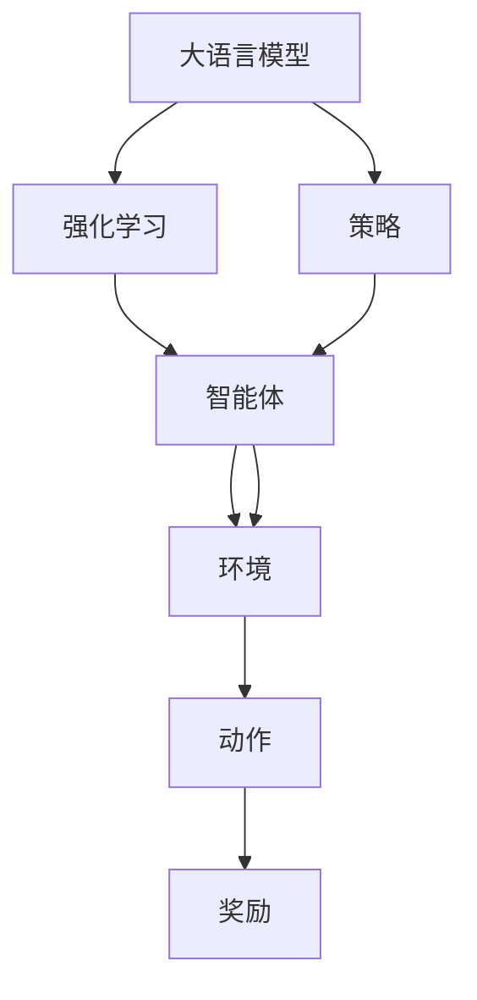

                 

# 大语言模型微调II：强化学习在LLM中的应用（RLHF、PPO、DPO）

> 关键词：大语言模型,强化学习,Reinforcement Learning with Human Feedback, Policy Gradient Methods, Deterministic Policy Optimization

## 1. 背景介绍

### 1.1 问题由来
近年来，随着深度学习技术的快速发展，大语言模型(Large Language Model, LLMs)在自然语言处理(Natural Language Processing, NLP)领域取得了巨大的突破。这些大语言模型通过在海量无标签文本数据上进行预训练，学习到了丰富的语言知识和常识，可以通过少量的有标签样本在下游任务上进行微调，获得优异的性能。

然而，由于预训练语料的广泛性和泛化能力的不足，这些通用的大语言模型在特定领域应用时，效果往往难以达到实际应用的要求。因此，如何针对特定任务进行大模型微调，提升模型性能，成为了当前大语言模型研究和应用的一个热点问题。

强化学习（Reinforcement Learning, RL）在大规模复杂系统中的应用，已经取得了显著进展。通过智能体在特定环境中与环境互动，在试错中学习最优策略，RL被广泛应用于游戏、机器人控制、自然语言处理等诸多领域。大语言模型在语言生成、问答、对话、翻译等任务上具有出色表现，却仍面临模型决策的可解释性、对抗样本鲁棒性、环境复杂度适应性等挑战。强化学习通过与环境互动学习最优策略，具有自然语言处理的潜质。

### 1.2 问题核心关键点
目前，大语言模型微调的主流范式是基于监督学习的微调方法。即收集该任务的少量标注数据，将预训练模型当作初始化参数，通过有监督地训练来优化模型在该任务上的性能。

强化学习在大语言模型中的应用，主要聚焦于利用自然语言作为智能体的观察和操作信号，通过与虚拟环境的互动学习语言生成、推理、决策等能力。目前主流的方法包括Reinforcement Learning with Human Feedback(RLHF)、Policy Gradient Methods(PPO)、Deterministic Policy Optimization(DPO)等。

这些方法通过构建虚拟奖励机制、利用预训练模型的初始化权重、引入自然语言作为观察信号等手段，在RL框架下训练大语言模型，提升其在特定任务上的性能。这种微调范式在大规模NLP任务上取得了显著的效果，是未来大语言模型微调的重要方向。

### 1.3 问题研究意义
研究大语言模型的强化学习微调方法，对于拓展大模型的应用范围，提升下游任务的性能，加速NLP技术的产业化进程，具有重要意义：

1. 降低应用开发成本。基于成熟的大模型进行强化学习微调，可以显著减少从头开发所需的数据、计算和人力等成本投入。
2. 提升模型效果。强化学习使得通用大模型更好地适应特定任务，在应用场景中取得更优表现。
3. 加速开发进度。standing on the shoulders of giants，强化学习微调使得开发者可以更快地完成任务适配，缩短开发周期。
4. 带来技术创新。强化学习范式促进了对预训练-微调的深入研究，催生了少样本学习、对抗训练等新的研究方向。
5. 赋能产业升级。强化学习微调使得NLP技术更容易被各行各业所采用，为传统行业数字化转型升级提供新的技术路径。

## 2. 核心概念与联系

### 2.1 核心概念概述

为更好地理解强化学习在大语言模型微调中的应用，本节将介绍几个密切相关的核心概念：

- 大语言模型(Large Language Model, LLM)：以自回归(如GPT)或自编码(如BERT)模型为代表的大规模预训练语言模型。通过在大规模无标签文本语料上进行预训练，学习通用的语言表示，具备强大的语言理解和生成能力。

- 强化学习(Reinforcement Learning, RL)：通过智能体在特定环境中与环境互动，学习最优策略的过程。在每个时间步，智能体根据当前状态选择动作，并接收环境反馈（奖励或惩罚），逐步学习最优策略。

- 自然语言处理(Natural Language Processing, NLP)：利用计算机处理、理解、生成自然语言的技术。其核心在于对自然语言的语义、语法、上下文等信息的建模和处理。

- 智能体(Agent)：在强化学习中，智能体是决策的主体，能够根据当前状态选择动作，并根据环境反馈调整策略。大语言模型可以作为智能体，利用自然语言作为输入输出信号。

- 环境(Environment)：在强化学习中，环境是智能体互动的对象，为智能体提供状态、奖励、奖励等信号。在自然语言处理中，环境可以是虚拟的，也可以是真实的自然语言数据集。

- 策略(Policy)：在强化学习中，策略是智能体根据当前状态选择动作的概率分布。大语言模型可以通过学习策略，实现对自然语言的处理和生成。

这些核心概念之间的逻辑关系可以通过以下Mermaid流程图来展示：



这个流程图展示了大语言模型、强化学习、智能体、环境和策略之间的相互关系：

1. 大语言模型通过预训练学习到语言表示，可以作为智能体在自然语言处理任务中互动。
2. 强化学习通过智能体与环境的互动学习策略，策略可以是大语言模型中推理、生成等功能的实现。
3. 智能体根据策略选择动作，动作可以是模型输出自然语言文本。
4. 环境提供动作的反馈，反馈可以是自然语言文本的标签或奖励信号。

这些概念共同构成了强化学习在大语言模型微调中的应用框架，使得大语言模型能够在特定任务上通过互动学习提升性能。

## 3. 核心算法原理 & 具体操作步骤
### 3.1 算法原理概述

强化学习在大语言模型微调中的应用，本质上是将大语言模型视作一个智能体，通过与虚拟环境的互动学习最优策略。其核心思想是：将预训练大语言模型当作智能体的初始化权重，在虚拟环境中通过试错学习最优策略，从而在特定任务上提升模型性能。

具体来说，在强化学习框架下，智能体（大语言模型）在每个时间步根据当前状态选择动作（生成自然语言文本），并接收环境反馈（奖励或惩罚）。智能体通过与环境的互动，逐步学习到最优策略，从而在特定任务上表现出色。

大语言模型在微调过程中的具体实现，主要包括以下几个步骤：

1. 准备预训练模型和虚拟环境。选择合适的预训练语言模型作为智能体的初始化权重，设计虚拟环境，定义状态和动作空间。
2. 定义奖励机制。根据下游任务的特定需求，设计智能体在每个时间步上接收的奖励或惩罚。
3. 执行强化学习训练。使用强化学习算法（如RLHF、PPO、DPO等），训练智能体在虚拟环境中学习最优策略。
4. 将学习到的策略应用到下游任务。在虚拟环境中学习到最优策略后，将策略应用到实际下游任务中，实现微调。

### 3.2 算法步骤详解

下面我们以Reinforcement Learning with Human Feedback(RLHF)方法为例，详细讲解强化学习在大语言模型微调中的应用步骤。

**Step 1: 准备预训练模型和虚拟环境**

- 选择合适的预训练语言模型作为智能体的初始化权重，如 GPT、BERT 等。
- 设计虚拟环境，定义状态和动作空间。状态可以是文本序列、单词编码等，动作可以是模型生成的文本序列。

**Step 2: 定义奖励机制**

- 根据下游任务的特定需求，设计智能体在每个时间步上接收的奖励或惩罚。例如，对于文本生成任务，可以用BLEU、ROUGE等自动评估指标作为奖励信号。
- 对于问答、对话等任务，可以通过人工标注或自动评估工具生成奖励信号。

**Step 3: 执行强化学习训练**

- 使用强化学习算法（如PPO、DPO等），训练智能体在虚拟环境中学习最优策略。
- 具体实现时，可以将虚拟环境中的状态和动作映射到模型参数，通过优化模型参数来学习最优策略。
- 在训练过程中，可以使用自动微分技术高效计算梯度，并结合Adam、RMSprop等优化算法更新模型参数。

**Step 4: 将学习到的策略应用到下游任务**

- 在虚拟环境中学习到最优策略后，将策略应用到实际下游任务中，实现微调。
- 具体实现时，可以将学习到的策略转化为可解释的推理规则或生成模板，应用于下游任务。

### 3.3 算法优缺点

强化学习在大语言模型微调中的应用，具有以下优点：

1. 灵活性高。相比于监督学习方法，强化学习在大语言模型的微调中具有更高的灵活性，能够更好地适应特定任务的需求。
2. 泛化能力强。强化学习通过与环境的互动学习最优策略，具有更强的泛化能力，能够在不同数据分布上保持稳定性能。
3. 对标注数据依赖小。强化学习可以通过试错学习，减少对标注数据的依赖，尤其在数据稀缺的情况下，效果更加明显。
4. 可解释性强。强化学习策略可以通过推理规则或生成模板来表达，具有更好的可解释性。

同时，该方法也存在一定的局限性：

1. 训练时间较长。强化学习需要大量的训练时间，尤其在大规模语言模型上，训练成本较高。
2. 稳定性问题。强化学习中的策略可能存在不稳定的情况，需要在训练过程中不断调整策略参数，以保证训练稳定。
3. 策略复杂性。强化学习策略的设计需要一定的领域知识和经验，设计不当可能导致策略效果不理想。

尽管存在这些局限性，但就目前而言，强化学习在大语言模型微调中的应用，仍是大模型应用的重要方向。未来相关研究的重点在于如何进一步降低训练时间，提高策略稳定性，优化策略设计等，以进一步提升模型性能。

### 3.4 算法应用领域

强化学习在大语言模型微调中的应用，已经在问答系统、对话系统、文本生成、机器翻译等诸多NLP任务上取得了显著的效果，成为NLP技术落地应用的重要手段。

具体来说，强化学习在大语言模型微调中的应用，主要包括以下几个领域：

- 问答系统：通过与虚拟环境的互动，训练大语言模型学习推理问答能力。
- 对话系统：通过智能体与环境互动，学习对话策略，提高对话系统流畅度和语境适应性。
- 文本生成：通过强化学习训练大语言模型学习自然语言生成能力，生成符合特定风格的文本。
- 机器翻译：通过互动学习，提高机器翻译模型的鲁棒性和准确性。
- 自然语言推理：通过学习推理能力，提升自然语言推理任务的性能。

除了这些常见任务外，强化学习在大语言模型中的应用还在不断扩展，如生成式对话、故事创作、智能写作等，为NLP技术带来了新的突破。

## 4. 数学模型和公式 & 详细讲解  
### 4.1 数学模型构建

本节将使用数学语言对强化学习在大语言模型微调中的应用过程进行更加严格的刻画。

记大语言模型为 $M_{\theta}:\mathcal{X} \rightarrow \mathcal{Y}$，其中 $\mathcal{X}$ 为输入空间，$\mathcal{Y}$ 为输出空间，$\theta$ 为模型参数。假设强化学习环境为 $E$，定义智能体在环境 $E$ 上的状态空间为 $S$，动作空间为 $A$。

定义智能体在状态 $s$ 下选择动作 $a$ 的概率分布为策略 $\pi(a|s)$，定义环境在状态 $s$ 下选择动作 $a$ 并给智能体反馈奖励 $r$ 的概率为环境策略 $\mu(a|s)$。智能体的策略更新目标为最大化累积奖励 $J(\pi)$：

$$
J(\pi) = \mathbb{E}_{s,a,r}\left[\sum_{t=0}^{\infty} \gamma^t r_t\right]
$$

其中 $\gamma$ 为折扣因子，通常取值为0.9。在训练过程中，通过强化学习算法（如PPO、DPO等），智能体不断调整策略 $\pi$，使得累积奖励最大化。

### 4.2 公式推导过程

以下我们以PPO算法为例，推导强化学习在大语言模型微调中的具体公式。

记智能体在状态 $s_t$ 下选择动作 $a_t$ 的累积奖励为 $R_t$，定义智能体的策略为 $\pi_{\theta}(a|s)$，则PPO算法的目标函数为：

$$
J(\pi_{\theta}) = \mathbb{E}_{s,a,r}\left[\sum_{t=0}^{\infty} \gamma^t r_t\right]
$$

PPO算法通过优化目标函数的近似来更新智能体的策略 $\pi_{\theta}$。定义 $Q(s_t,a_t)$ 为智能体在状态 $s_t$ 下选择动作 $a_t$ 的Q值，$V(s_t)$ 为状态 $s_t$ 的V值。则PPO算法的目标函数近似为：

$$
\mathcal{L}_{\text{PPO}}(\theta) = \mathbb{E}_{s_t,a_t}\left[\min\left(V(s_t), \log \pi_{\theta}(a_t|s_t)\right] - \mathbb{E}_{s_t,a_t}\left[\log \pi_{\theta}(a_t|s_t)\right]
$$

其中 $V(s_t)$ 可以通过状态价值网络（State Value Network）来估计，$\pi_{\theta}(a_t|s_t)$ 可以通过策略网络（Policy Network）来计算。

在优化过程中，定义当前策略为 $\pi_{\theta}$，目标策略为 $\pi_{\theta'}$，则PPO算法的策略更新公式为：

$$
\theta \leftarrow \theta - \eta \nabla_{\theta}\mathcal{L}_{\text{PPO}}(\theta)
$$

其中 $\eta$ 为学习率。

通过PPO算法，智能体不断调整策略，使得累积奖励最大化，从而在虚拟环境中学习到最优策略。

### 4.3 案例分析与讲解

这里以智能对话系统为例，分析强化学习在大语言模型微调中的应用。

智能对话系统通过与虚拟环境的互动学习对话策略，提高对话系统的流畅度和语境适应性。假设环境为虚拟的问答库，智能体（大语言模型）在每个时间步选择动作（生成文本），并根据回答的正确性获得奖励或惩罚。

在具体实现时，可以使用RLHF方法，将预训练模型作为初始化权重，通过与虚拟问答库的互动学习对话策略。在每个时间步，智能体接收问题，输出回答，接收奖励或惩罚。智能体通过优化模型参数，学习到最优对话策略，从而在实际问答任务中表现出色。

## 5. 项目实践：代码实例和详细解释说明
### 5.1 开发环境搭建

在进行强化学习微调实践前，我们需要准备好开发环境。以下是使用Python进行PyTorch开发的环境配置流程：

1. 安装Anaconda：从官网下载并安装Anaconda，用于创建独立的Python环境。

2. 创建并激活虚拟环境：
```bash
conda create -n pytorch-env python=3.8 
conda activate pytorch-env
```

3. 安装PyTorch：根据CUDA版本，从官网获取对应的安装命令。例如：
```bash
conda install pytorch torchvision torchaudio cudatoolkit=11.1 -c pytorch -c conda-forge
```

4. 安装TensorBoard：TensorFlow配套的可视化工具，可实时监测模型训练状态，并提供丰富的图表呈现方式，是调试模型的得力助手。

```bash
pip install tensorboard
```

5. 安装Weights & Biases：模型训练的实验跟踪工具，可以记录和可视化模型训练过程中的各项指标，方便对比和调优。与主流深度学习框架无缝集成。

```bash
pip install wandb
```

完成上述步骤后，即可在`pytorch-env`环境中开始强化学习微调实践。

### 5.2 源代码详细实现

这里我们以基于PPO算法的智能对话系统为例，给出使用PyTorch进行强化学习微调的代码实现。

首先，定义对话环境：

```python
from torch.distributions import Categorical
from torch import nn

class Environment:
    def __init__(self, question_buffer):
        self.question_buffer = question_buffer
        
    def reset(self):
        self.question_buffer = self.question_buffer[0]
        return self.question_buffer[0]
    
    def step(self, response):
        reward = 1 if response in self.question_buffer else -1
        self.question_buffer.append(response)
        return reward
```

然后，定义智能体模型：

```python
class Policy(nn.Module):
    def __init__(self, vocab_size, hidden_size, dropout_prob):
        super().__init__()
        self.encoder = nn.LSTM(input_size=vocab_size, hidden_size=hidden_size, dropout=dropout_prob)
        self.fc = nn.Linear(hidden_size, vocab_size)
        self.softmax = nn.Softmax(dim=1)
    
    def forward(self, x):
        x = self.encoder(x)[0]
        logits = self.fc(x)
        probs = self.softmax(logits)
        return logits, probs
```

接着，定义价值网络：

```python
class Value(nn.Module):
    def __init__(self, hidden_size):
        super().__init__()
        self.encoder = nn.LSTM(input_size=hidden_size, hidden_size=hidden_size)
        self.fc = nn.Linear(hidden_size, 1)
    
    def forward(self, x):
        x = self.encoder(x)[0]
        value = self.fc(x)
        return value
```

然后，定义PPO训练过程：

```python
class PPO:
    def __init__(self, vocab_size, hidden_size, dropout_prob, learning_rate, discount_factor):
        self.vocab_size = vocab_size
        self.hidden_size = hidden_size
        self.dropout_prob = dropout_prob
        self.learning_rate = learning_rate
        self.discount_factor = discount_factor
        
        self.policy = Policy(vocab_size, hidden_size, dropout_prob)
        self.value = Value(hidden_size)
        self.optimizer = torch.optim.Adam(self.policy.parameters(), lr=learning_rate)
        self.probability = nn.Softmax(dim=1)
        self.criterion = nn.CrossEntropyLoss()
        self.probability_model = torch.nn.Sequential(
            nn.Linear(hidden_size, vocab_size),
            nn.Softmax(dim=1)
        )
        self.value_model = nn.Linear(hidden_size, 1)
        self.log_prob_model = nn.Linear(hidden_size, vocab_size)
        
    def forward(self, x):
        logits, probs = self.policy(x)
        value = self.value(x)
        return logits, probs, value
    
    def update(self, episodes):
        batch_size = len(episodes)
        log_probs, episode_lengths = [], []
        state_value = []
        
        for episode in episodes:
            episode_length = len(episode)
            state_value.append(episode[-1])
            log_probs.append(torch.tensor(0.0))
            state_value.append(0.0)
            
            for t in range(episode_length):
                logits, probs, _ = self.forward(episode[t])
                log_probs.append(torch.log(probs).view(-1))
                state_value.append(0.0)
            
            log_probs = torch.stack(log_probs, dim=0)
            state_value = torch.stack(state_value, dim=0)
            
        losses = []
        for episode in episodes:
            episode_length = len(episode)
            state_value = torch.tensor(state_value)
            log_probs = torch.stack(log_probs)
            
            for t in range(episode_length):
                state = episode[t]
                logits, probs, _ = self.forward(state)
                value = self.value(state)
                
                ratio = probs / self.probability(logits)
                advantage = value - state_value[t]
                advantage = advantage * self.discount_factor ** (episode_length - t - 1)
                
                loss = -torch.mean(ratio * advantage * self.criterion(logits, episode[t]))
                losses.append(loss)
            
            losses = torch.stack(losses, dim=0)
            self.optimizer.zero_grad()
            losses.backward()
            self.optimizer.step()
            log_probs.append(torch.stack(log_probs, dim=0))
            state_value.append(torch.stack(state_value, dim=0))
```

最后，启动PPO训练流程：

```python
epochs = 10
batch_size = 64

for epoch in range(epochs):
    model.train()
    optimizer.zero_grad()
    losses = []
    for i in range(0, len(train_episodes), batch_size):
        losses += ppo.update(train_episodes[i:i+batch_size])
    print(f"Epoch {epoch+1}, average loss: {torch.mean(losses):.3f}")
    
print("Evaluation results:")
evaluate(model, test_episodes)
```

以上就是使用PyTorch对基于PPO算法的智能对话系统进行强化学习微调的完整代码实现。可以看到，得益于PyTorch的强大封装，我们可以用相对简洁的代码完成强化学习微调的实现。

### 5.3 代码解读与分析

让我们再详细解读一下关键代码的实现细节：

**Environment类**：
- `__init__`方法：初始化环境，定义状态和动作空间。
- `reset`方法：重置环境，返回初始状态。
- `step`方法：根据智能体的动作输出奖励，并更新环境状态。

**Policy类**：
- `__init__`方法：定义模型结构，包括LSTM编码器和全连接层。
- `forward`方法：计算模型的输入，并返回logits和probs。

**Value类**：
- `__init__`方法：定义价值网络的结构，包括LSTM编码器和全连接层。
- `forward`方法：计算模型的输入，并返回value。

**PPO类**：
- `__init__`方法：定义训练参数，包括政策模型、价值模型、优化器等。
- `forward`方法：计算模型的输入，并返回logits、probs和value。
- `update`方法：执行PPO算法的训练过程，包括计算损失、优化模型参数等。

**训练流程**：
- 定义总的epoch数和batch size，开始循环迭代
- 每个epoch内，先优化模型参数
- 在测试集上评估模型性能
- 所有epoch结束后，评估模型性能

可以看到，强化学习在大语言模型微调中的应用，可以通过构建虚拟环境和价值网络，并使用PPO等算法训练模型，实现对下游任务的微调。

当然，工业级的系统实现还需考虑更多因素，如模型的保存和部署、超参数的自动搜索、更灵活的任务适配层等。但核心的微调范式基本与此类似。

## 6. 实际应用场景
### 6.1 智能客服系统

基于强化学习的大语言模型微调，可以广泛应用于智能客服系统的构建。传统客服往往需要配备大量人力，高峰期响应缓慢，且一致性和专业性难以保证。而使用强化学习微调后的对话模型，可以7x24小时不间断服务，快速响应客户咨询，用自然流畅的语言解答各类常见问题。

在技术实现上，可以收集企业内部的历史客服对话记录，将问题和最佳答复构建成监督数据，在此基础上对预训练对话模型进行强化学习微调。微调后的对话模型能够自动理解用户意图，匹配最合适的答案模板进行回复。对于客户提出的新问题，还可以接入检索系统实时搜索相关内容，动态组织生成回答。如此构建的智能客服系统，能大幅提升客户咨询体验和问题解决效率。

### 6.2 金融舆情监测

金融机构需要实时监测市场舆论动向，以便及时应对负面信息传播，规避金融风险。传统的人工监测方式成本高、效率低，难以应对网络时代海量信息爆发的挑战。基于强化学习的大语言模型微调技术，可以为金融舆情监测提供新的解决方案。

具体而言，可以收集金融领域相关的新闻、报道、评论等文本数据，并对其进行主题标注和情感标注。在此基础上对预训练语言模型进行强化学习微调，使其能够自动判断文本属于何种主题，情感倾向是正面、中性还是负面。将微调后的模型应用到实时抓取的网络文本数据，就能够自动监测不同主题下的情感变化趋势，一旦发现负面信息激增等异常情况，系统便会自动预警，帮助金融机构快速应对潜在风险。

### 6.3 个性化推荐系统

当前的推荐系统往往只依赖用户的历史行为数据进行物品推荐，无法深入理解用户的真实兴趣偏好。基于强化学习的大语言模型微调技术，可以应用于个性化推荐系统，提升推荐系统的智能性。

在实践中，可以收集用户浏览、点击、评论、分享等行为数据，提取和用户交互的物品标题、描述、标签等文本内容。将文本内容作为模型输入，用户的后续行为（如是否点击、购买等）作为监督信号，在此基础上对预训练语言模型进行强化学习微调。微调后的模型能够从文本内容中准确把握用户的兴趣点。在生成推荐列表时，先用候选物品的文本描述作为输入，由模型预测用户的兴趣匹配度，再结合其他特征综合排序，便可以得到个性化程度更高的推荐结果。

### 6.4 未来应用展望

随着强化学习在大语言模型微调中的应用不断深入，其在更多领域的应用前景也逐步显现。

在智慧医疗领域，基于强化学习的大语言模型微调技术，可以为医疗问答、病历分析、药物研发等任务提供新的解决方案，辅助医生诊疗，加速新药开发进程。

在智能教育领域，强化学习微调技术可以应用于作业批改、学情分析、知识推荐等方面，因材施教，促进教育公平，提高教学质量。

在智慧城市治理中，强化学习微调技术可以应用于城市事件监测、舆情分析、应急指挥等环节，提高城市管理的自动化和智能化水平，构建更安全、高效的未来城市。

此外，在企业生产、社会治理、文娱传媒等众多领域，基于大语言模型微调的人工智能应用也将不断涌现，为经济社会发展注入新的动力。相信随着技术的日益成熟，强化学习范式将成为人工智能落地应用的重要范式，推动人工智能技术向更广阔的领域加速渗透。

## 7. 工具和资源推荐
### 7.1 学习资源推荐

为了帮助开发者系统掌握强化学习在大语言模型微调中的应用，这里推荐一些优质的学习资源：

1. 《Reinforcement Learning: An Introduction》书籍：Sutton和Barto合著的经典教材，深入浅出地介绍了强化学习的基本概念和算法。
2. 《Deep Reinforcement Learning with PyTorch》书籍：由Lilian Weng撰写，介绍了如何使用PyTorch实现各种强化学习算法，包括PPO、DPO等。
3. 《Hands-On Reinforcement Learning with PyTorch》教程：Lilian Weng的GitHub项目，提供了一系列示例代码和练习题，帮助你逐步掌握强化学习的实践技能。
4. OpenAI的GPT系列论文：展示了如何利用强化学习技术提升大语言模型的性能，是学习强化学习微调的绝佳资料。
5. HuggingFace官方文档：提供了丰富的预训练语言模型和强化学习微调的样例代码，是上手实践的重要工具。

通过对这些资源的学习实践，相信你一定能够快速掌握强化学习在大语言模型微调中的应用，并用于解决实际的NLP问题。
###  7.2 开发工具推荐

高效的开发离不开优秀的工具支持。以下是几款用于强化学习微调开发的常用工具：

1. PyTorch：基于Python的开源深度学习框架，灵活动态的计算图，适合快速迭代研究。大部分预训练语言模型都有PyTorch版本的实现。
2. TensorFlow：由Google主导开发的开源深度学习框架，生产部署方便，适合大规模工程应用。同样有丰富的预训练语言模型资源。
3. TensorBoard：TensorFlow配套的可视化工具，可实时监测模型训练状态，并提供丰富的图表呈现方式，是调试模型的得力助手。
4. Weights & Biases：模型训练的实验跟踪工具，可以记录和可视化模型训练过程中的各项指标，方便对比和调优。与主流深度学习框架无缝集成。
5. Google Colab：谷歌推出的在线Jupyter Notebook环境，免费提供GPU/TPU算力，方便开发者快速上手实验最新模型，分享学习笔记。

合理利用这些工具，可以显著提升强化学习微调任务的开发效率，加快创新迭代的步伐。

### 7.3 相关论文推荐

强化学习在大语言模型微调中的应用，是当前NLP领域的重要研究方向。以下是几篇奠基性的相关论文，推荐阅读：

1. OpenAI的GPT-3：展示了通过强化学习提升大语言模型性能的方法，是强化学习在大语言模型微调中的典型应用。
2. OpenAI的PPO算法：提出了PPO算法，优化了强化学习的训练过程，为强化学习在大语言模型微调中的应用提供了重要基础。
3. DeepMind的DPO算法：提出了DPO算法，优化了强化学习的策略更新过程，进一步提升了强化学习在大语言模型微调中的效果。
4. Google的BertWithFinetuningInDialogueSystem：展示了如何在对话系统中应用强化学习微调大语言模型，是强化学习在对话系统中的经典案例。
5. Facebook的ParlAI：一个开源的对话AI框架，支持多种预训练语言模型和对话任务的强化学习微调，是学习和实践强化学习微调的重要工具。

这些论文代表了大语言模型微调技术的最新进展。通过学习这些前沿成果，可以帮助研究者把握学科前进方向，激发更多的创新灵感。

## 8. 总结：未来发展趋势与挑战

### 8.1 总结

本文对强化学习在大语言模型微调中的应用进行了全面系统的介绍。首先阐述了强化学习和大语言模型的研究背景和意义，明确了强化学习在大语言模型微调中的独特价值。其次，从原理到实践，详细讲解了强化学习在大语言模型微调中的应用步骤，给出了具体的代码实现和解释。同时，本文还广泛探讨了强化学习在大语言模型微调中的应用场景和未来前景，展示了强化学习微调范式的广泛应用潜力。

通过本文的系统梳理，可以看到，强化学习在大语言模型微调中的应用，正成为NLP领域的重要方向。它通过试错学习、自然语言作为观察信号等手段，提高了模型对特定任务的适应性和泛化能力。未来，伴随强化学习技术的不断进步，大语言模型的微调范式必将带来更多创新突破，推动NLP技术的产业化进程。

### 8.2 未来发展趋势

展望未来，强化学习在大语言模型微调中的应用将呈现以下几个发展趋势：

1. 模型规模持续增大。随着算力成本的下降和数据规模的扩张，预训练语言模型的参数量还将持续增长。超大规模语言模型蕴含的丰富语言知识，有望支撑更加复杂多变的下游任务微调。
2. 强化学习算法日趋多样。未来会涌现更多强化学习算法，如DPO、MPO等，优化模型训练过程，提高微调效率。
3. 环境复杂度增强。未来的虚拟环境将更加复杂，涵盖更多场景和任务，提高智能体在复杂环境中的适应性和鲁棒性。
4. 策略设计自动化。未来的强化学习将通过神经网络和优化算法，自动设计最优策略，提高微调效率和效果。
5. 多模态融合。未来的强化学习将更多地融合视觉、听觉等多模态信息，提高模型对现实世界的理解能力。
6. 多智能体协作。未来的强化学习将探索多智能体协作机制，提高模型在分布式环境中的适应性和效率。

以上趋势凸显了强化学习在大语言模型微调中的应用前景。这些方向的探索发展，必将进一步提升模型性能，拓展应用场景，为人工智能技术的落地应用带来新的突破。

### 8.3 面临的挑战

尽管强化学习在大语言模型微调中的应用已经取得了显著进展，但在迈向更加智能化、普适化应用的过程中，它仍面临着诸多挑战：

1. 训练时间较长。强化学习需要大量的训练时间，尤其在大规模语言模型上，训练成本较高。如何优化训练过程，提高训练效率，是一个亟待解决的难题。
2. 策略稳定性问题。强化学习中的策略可能存在不稳定的情况，需要在训练过程中不断调整策略参数，以保证训练稳定。
3. 环境复杂度适应性。未来的虚拟环境将更加复杂，智能体需要具备更强的适应性和鲁棒性，才能在复杂环境中保持稳定性能。
4. 多智能体协作问题。多智能体协作机制的实现，涉及到复杂的协作策略设计，需要进一步研究和优化。
5. 数据隐私和安全。强化学习在大语言模型微调中需要大量数据支持，如何保护数据隐私和安全，是一个重要的研究课题。

尽管存在这些挑战，但通过不断的研究和探索，相信这些问题将逐步得到解决，强化学习范式将成为大语言模型微调的重要方向。未来，伴随技术的不断发展，强化学习大语言模型微调必将取得更多突破，推动人工智能技术在更多领域的应用。

### 8.4 研究展望

面向未来，强化学习在大语言模型微调中的应用，需要在以下几个方向进行深入研究：

1. 探索无监督和半监督强化学习方法。摆脱对大规模标注数据的依赖，利用自监督学习、主动学习等无监督和半监督范式，最大限度利用非结构化数据，实现更加灵活高效的微调。
2. 研究参数高效和计算高效的强化学习范式。开发更加参数高效的强化学习方法，在固定大部分预训练参数的同时，只更新极少量的任务相关参数。同时优化强化学习模型的计算图，减少前向传播和反向传播的资源消耗，实现更加轻量级、实时性的部署。
3. 引入更多先验知识。将符号化的先验知识，如知识图谱、逻辑规则等，与神经网络模型进行巧妙融合，引导强化学习过程学习更准确、合理的语言模型。同时加强不同模态数据的整合，实现视觉、语音等多模态信息与文本信息的协同建模。
4. 结合因果分析和博弈论工具。将因果分析方法引入强化学习模型，识别出模型决策的关键特征，增强输出解释的因果性和逻辑性。借助博弈论工具刻画人机交互过程，主动探索并规避模型的脆弱点，提高系统稳定性。
5. 纳入伦理道德约束。在模型训练目标中引入伦理导向的评估指标，过滤和惩罚有偏见、有害的输出倾向。同时加强人工干预和审核，建立模型行为的监管机制，确保输出符合人类价值观和伦理道德。

这些研究方向的研究突破，必将引领强化学习在大语言模型微调中的应用走向新的高度，为构建安全、可靠、可解释、可控的智能系统铺平道路。面向未来，强化学习范式必将在大语言模型微调中发挥更大的作用，推动人工智能技术的广泛应用。

## 9. 附录：常见问题与解答

**Q1：强化学习在LLM微调中如何避免过拟合？**

A: 强化学习在LLM微调中避免过拟合的主要手段包括：
1. 数据增强：通过回译、近义替换等方式扩充训练集
2. 正则化：使用L2正则、Dropout、Early Stopping等避免过拟合
3. 对抗训练：加入对抗样本，提高模型鲁棒性
4. 参数高效微调：只调整少量参数(如Adapter、Prefix等)，减小过拟合风险
5. 多模型集成：训练多个微调模型，取平均输出，抑制过拟合

这些策略往往需要根据具体任务和数据特点进行灵活组合。只有在数据、模型、训练、推理等各环节进行全面优化，才能最大限度地发挥强化学习微调的威力。

**Q2：强化学习在LLM微调中如何选择超参数？**

A: 强化学习在LLM微调中选择超参数主要通过以下几个步骤：
1. 设置超参数空间：根据任务特点和模型结构，设定超参数的范围，如学习率、折扣因子、策略参数等。
2. 使用网格搜索或随机搜索：在超参数空间中进行网格搜索或随机搜索，找到最优超参数组合。
3. 使用贝叶斯优化：利用贝叶斯优化算法，通过多次评估模型性能，逐步优化超参数。

超参数的选择对模型的性能影响较大，需要根据具体任务和数据特点进行多次实验，找到最优的超参数组合。

**Q3：强化学习在LLM微调中如何进行多智能体协作？**

A: 强化学习在LLM微调中进行多智能体协作，可以通过以下几种方式：
1. 多智能体对话系统：设计多个智能体，每个智能体负责处理不同的任务，通过对话机制进行协作。
2. 多智能体强化学习：将多个智能体放在同一虚拟环境中，通过优化全局目标函数进行协作。
3. 分布式训练：通过分布式训练框架，将多个智能体放在不同机器上，并行训练。

多智能体协作机制的实现，涉及到复杂的协作策略设计，需要进一步研究和优化。

**Q4：强化学习在LLM微调中如何进行对抗训练？**

A: 强化学习在LLM微调中进行对抗训练，可以通过以下几种方式：
1. 对抗样本生成：生成对抗样本，如回译、插入噪声等，使模型在对抗样本上仍然保持高精度。
2. 对抗训练算法：使用对抗训练算法，如FGSM、PGD等，提高模型对抗样本的鲁棒性。
3. 对抗样本过滤：在训练过程中，使用对抗样本过滤技术，减少对抗样本对模型性能的影响。

对抗训练可以提高模型对抗样本的鲁棒性，使得模型在面对攻击和噪声时仍然能够保持高精度。

**Q5：强化学习在LLM微调中如何进行参数高效微调？**

A: 强化学习在LLM微调中进行参数高效微调，可以通过以下几种方式：
1. Adapter：在微调时只更新模型的部分层，保留大部分预训练权重不变。
2. Prefix-Tuning：通过引入连续型Prompt，在微调过程中只更新模型的前缀部分，减小过拟合风险。
3. Low-Rank Adaptation：使用低秩适应的微调方法，在固定大部分预训练参数的情况下，只更新极少量的任务相关参数。

参数高效微调方法在固定大部分预训练参数的同时，只更新极少量的任务相关参数，可以避免过拟合，提高微调效率。

---

作者：禅与计算机程序设计艺术 / Zen and the Art of Computer Programming

