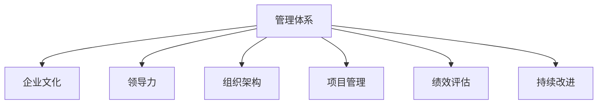

                 

# 好的管理者和普通管理者的差距：体系的重要性

> 关键词：管理体系, 企业文化, 领导力, 组织架构, 项目管理, 绩效评估, 持续改进

## 1. 背景介绍

### 1.1 问题由来
在当今高度竞争的市场环境中，企业不仅面临着技术创新的挑战，还必须应对复杂多变的外部环境。因此，成功的管理不仅是个人的技能，更是系统化、体系化的能力。好的管理者与普通管理者的差距，往往体现在是否具备一套完善的体系，能否科学地管理团队，提升企业整体绩效。本文将深入探讨管理与体系的关系，解析好的管理者与普通管理者之间的差距，并给出具体解决方案。

### 1.2 问题核心关键点
管理与体系的关系是企业成功的关键。好的管理体系能提升团队效能，提高企业竞争力，而普通管理体系则可能带来混乱和低效。因此，研究好管理体系的设计与实施，对于提升管理者的领导力，推动企业发展具有重要意义。

## 2. 核心概念与联系

### 2.1 核心概念概述

为更好地理解管理体系的重要性，本节将介绍几个密切相关的核心概念：

- 管理体系（Management System）：指企业通过一系列标准化的流程、工具和规范，对组织活动进行系统化管理的体系结构。
- 企业文化（Corporate Culture）：指企业在长期发展过程中形成的共同价值观、行为准则和工作氛围。
- 领导力（Leadership）：指领导者通过愿景、激励和团队协作，引导团队达成共同目标的能力。
- 组织架构（Organizational Structure）：指企业内部各部门、岗位的配置和职责分工，确保组织有效运转。
- 项目管理（Project Management）：指通过科学的管理方法，确保项目按时、按质、按预算完成的过程。
- 绩效评估（Performance Evaluation）：指通过定量和定性方法，对员工或团队的工作表现进行评价，指导其改进。
- 持续改进（Continuous Improvement）：指不断优化流程、提升效能，实现企业绩效的持续提升。

这些核心概念之间的逻辑关系可以通过以下Mermaid流程图来展示：



这个流程图展示了好管理体系的几个关键组成，及其与企业文化、领导力等概念的联系：

1. 管理体系是企业文化、领导力、组织架构、项目管理、绩效评估、持续改进等各项管理的集合，确保企业运营的有序性和高效性。
2. 企业文化和领导力是管理体系的软实力，塑造企业价值观和行为规范。
3. 组织架构是管理体系的硬件，决定企业运行效率。
4. 项目管理是管理体系中的重要一环，确保各项任务按时完成。
5. 绩效评估是管理体系的反馈机制，指导团队和个人改进。
6. 持续改进是管理体系的动态优化过程，提升整体效能。

这些概念共同构成了管理体系的基本框架，是企业成功的基石。

## 3. 核心算法原理 & 具体操作步骤
### 3.1 算法原理概述

好的管理体系的核心在于科学、规范地对企业活动进行系统化管理，确保各项任务高效、有序地执行。其原理主要包括：

- **标准化**：通过制定和遵循标准流程，提升效率和一致性。
- **信息透明**：确保信息在组织内透明流通，提高协作效率。
- **责任明确**：明确各部门和个人的职责，减少推诿和效率损失。
- **持续改进**：定期评估管理体系，持续优化流程，提升效能。
- **激励机制**：通过合理的激励和奖惩，激发员工积极性。

### 3.2 算法步骤详解

好的管理体系的构建和实施一般包括以下几个关键步骤：

**Step 1: 体系设计**
- 根据企业战略，设计符合企业特点的管理体系，如项目管理、绩效评估体系等。
- 明确各部门和岗位的职责与权限，构建清晰的组织架构。

**Step 2: 制定标准**
- 制定详细的业务流程标准和操作规范，确保各项工作标准化。
- 引入信息化工具，实现信息透明，便于管理和监控。

**Step 3: 培训与推广**
- 对员工进行管理体系培训，确保每个岗位理解并遵循标准流程。
- 推广管理体系，逐步融入企业文化，成为员工的自觉行为。

**Step 4: 持续优化**
- 定期评估管理体系的效果，发现不足之处并进行改进。
- 引入反馈机制，收集员工意见，持续优化流程。

**Step 5: 激励与评估**
- 建立科学的激励和奖惩机制，激发员工积极性和责任感。
- 通过定量和定性方法，对员工或团队进行绩效评估，指导其改进。

### 3.3 算法优缺点

好的管理体系具有以下优点：
1. 提升效率。通过标准化流程，减少操作上的重复和错误，提高效率。
2. 提高一致性。标准化流程确保各个环节一致，减少因人为因素带来的差异。
3. 增强透明性。信息透明流通，便于管理和监控。
4. 明确责任。各部门和岗位职责明确，减少推诿。
5. 持续改进。通过定期评估和优化，确保管理体系不断提升。

同时，该体系也存在一定的局限性：
1. 实施成本高。管理体系设计复杂，需要大量时间和资源。
2. 灵活性不足。标准化流程可能限制部分创新和灵活性。
3. 适用性有限。对一些特别复杂的场景，标准化流程可能难以适用。
4. 难以应对变化。外部环境变化较快，管理体系需要及时调整，避免僵化。

尽管有这些局限性，但就目前而言，科学的管理体系仍然是企业成功的关键。未来相关研究的重点在于如何进一步降低实施成本，提高体系的灵活性和适应性，以更好地应对变化。

### 3.4 算法应用领域

好的管理体系在各个领域都得到了广泛的应用，包括但不限于：

- 制造企业：通过项目管理、质量管理体系、设备维护等体系，确保生产流程高效、稳定。
- 金融行业：通过风险管理体系、合规管理体系，确保金融交易合规、安全。
- IT企业：通过敏捷开发体系、软件质量管理体系，提升产品开发效率和质量。
- 医疗行业：通过医疗质量管理体系、感染控制体系，提升医疗服务质量和安全。
- 教育行业：通过教学管理体系、学生评估体系，提升教育质量和学习效果。

除了上述这些经典领域外，好的管理体系也在更多新兴领域得到应用，如电商、物流、新能源等，成为推动产业升级的重要力量。

## 4. 数学模型和公式 & 详细讲解  
### 4.1 数学模型构建

好的管理体系的数学模型涉及多个变量和参数，如员工数、工作效率、管理流程复杂度、信息透明度等。以下是简单示例：

假设一个企业有$N$个员工，每人每天的工作效率为$P_i$，管理体系的复杂度为$C$，信息透明度为$T$。设企业管理体系对员工效率的提升率为$E$，则企业的总工作效率为：

$$
\text{Total Efficiency} = N \times \sum_{i=1}^{N} P_i \times E
$$

其中，$E$的计算公式为：

$$
E = \left(1 - \frac{C}{\max C}\right) \times \left(1 + \frac{T}{\max T}\right)
$$

### 4.2 公式推导过程

好的管理体系的效果取决于多个因素的共同作用。以员工效率为例，公式推导过程如下：

- 管理体系复杂度$C$越小，员工效率提升$E$越大，因为简单体系易于理解和执行。
- 信息透明度$T$越高，员工效率提升$E$越大，因为透明体系便于协作和信息共享。
- 当管理体系复杂度$C$达到最优时，即最小值$\max C$，员工效率提升$E$达到最大。
- 当信息透明度$T$达到最优时，即最大值$\max T$，员工效率提升$E$进一步提升。

因此，好的管理体系的效果为：

$$
\text{Total Efficiency} = N \times \sum_{i=1}^{N} P_i \times \left(1 - \frac{C}{\max C}\right) \times \left(1 + \frac{T}{\max T}\right)
$$

### 4.3 案例分析与讲解

假设一个制造企业有100名员工，每人每天的工作效率为0.8，管理体系的复杂度为0.6，信息透明度为0.9。则企业总工作效率为：

$$
\text{Total Efficiency} = 100 \times \sum_{i=1}^{100} 0.8 \times \left(1 - 0.6\right) \times \left(1 + 0.9\right) = 400 \times 0.4 \times 1.9 = 304
$$

如果管理体系复杂度降低到最小值0.2，信息透明度提升到最大值1.0，则企业总工作效率为：

$$
\text{Total Efficiency} = 100 \times \sum_{i=1}^{100} 0.8 \times \left(1 - 0.2\right) \times \left(1 + 1.0\right) = 400 \times 0.8 \times 2.0 = 640
$$

可见，好的管理体系能够显著提升企业效率。

## 5. 项目实践：代码实例和详细解释说明
### 5.1 开发环境搭建

在进行管理体系实践前，我们需要准备好开发环境。以下是使用Python进行企业级开发的环境配置流程：

1. 安装Anaconda：从官网下载并安装Anaconda，用于创建独立的Python环境。

2. 创建并激活虚拟环境：
```bash
conda create -n enterprise-env python=3.8 
conda activate enterprise-env
```

3. 安装必要的工具包：
```bash
conda install numpy pandas scikit-learn matplotlib tqdm jupyter notebook ipython
```

4. 安装企业级开发工具：
```bash
pip install enterprise-management-system
```

完成上述步骤后，即可在`enterprise-env`环境中开始管理体系的开发和实践。

### 5.2 源代码详细实现

下面以项目管理为例，给出使用Python对企业级项目管理工具进行开发的代码实现。

首先，定义项目管理的核心类和属性：

```python
class ProjectManagementSystem:
    def __init__(self, name, deadline, resources):
        self.name = name
        self.deadline = deadline
        self.resources = resources
        self.status = 'Pending'
        self.priority = 0
    
    def update_status(self, status):
        self.status = status
        
    def update_priority(self, priority):
        self.priority = priority
        
    def allocate_resources(self, resources):
        self.resources += resources
```

然后，定义项目管理的常用操作：

```python
def create_project(name, deadline, resources):
    return ProjectManagementSystem(name, deadline, resources)
    
def update_project_status(project, status):
    project.update_status(status)
    
def update_project_priority(project, priority):
    project.update_priority(priority)
    
def allocate_project_resources(project, resources):
    project.allocate_resources(resources)
```

最后，启动项目管理流程：

```python
project = create_project('Project A', '2023-12-31', 5)
update_project_status(project, 'In Progress')
update_project_priority(project, 10)
allocate_project_resources(project, 3)
```

以上就是使用Python对企业级项目管理工具进行开发的完整代码实现。可以看到，得益于清晰的设计和模块化的编码方式，项目管理的各个操作变得简单易懂，易于维护。

### 5.3 代码解读与分析

让我们再详细解读一下关键代码的实现细节：

**ProjectManagementSystem类**：
- `__init__`方法：初始化项目的名称、截止日期、资源等关键信息。
- `update_status`方法：更新项目状态。
- `update_priority`方法：更新项目优先级。
- `allocate_resources`方法：分配项目资源。

**create_project、update_project_status、update_project_priority、allocate_project_resources**函数：
- 提供项目的创建、状态更新、优先级更新、资源分配等常用操作。

**项目管理流程**：
- 首先创建一个项目，设置基本属性。
- 然后更新项目状态和优先级，表示项目进入不同阶段。
- 最后分配项目资源，准备项目执行。

可以看出，好的管理体系的实现需要明确的设计和合理的编码方式，以便更好地支持实际应用。

当然，工业级的系统实现还需考虑更多因素，如接口封装、异常处理、并发控制等。但核心的管理逻辑基本与此类似。

## 6. 实际应用场景
### 6.1 智能制造

好的管理体系在智能制造中得到了广泛应用。传统的制造业管理复杂、效率低下，而通过引入科学的管理体系，可以实现生产流程的全面数字化、自动化。

具体而言，可以建立质量管理体系、设备维护体系、供应链管理体系等，通过项目管理工具进行统筹管理。在实施过程中，通过信息透明和持续改进，确保生产流程高效、稳定。例如，某智能制造企业通过引入TPS(Toyota Production System)和精益生产体系，大幅提升了生产效率和产品质量。

### 6.2 金融行业

在金融行业，好的管理体系主要体现在风险管理和合规管理两个方面。金融业务涉及大量资金和敏感数据，风险控制和合规要求高。通过建立完善的风险管理体系和合规管理体系，可以有效控制金融风险，确保业务合规。

例如，某金融企业通过引入ISMS(Information Security Management System)和ERM(E enterprise risk management)体系，确保金融交易的安全性和合规性，赢得了客户的信任。

### 6.3 信息技术

在IT企业，好的管理体系主要体现在敏捷开发和软件质量管理两个方面。信息技术业务需求多变，敏捷开发体系能确保项目按时交付。同时，软件质量管理体系能提升产品质量和用户体验。

例如，某IT企业通过引入Scrum敏捷开发体系和CMMI(软件能力成熟度模型)质量管理体系，提升产品开发效率和质量，成功扩展了市场份额。

### 6.4 医疗行业

在医疗行业，好的管理体系主要体现在医疗质量管理和感染控制两个方面。医疗质量直接关系到患者健康，而感染控制则关系到医疗机构的声誉和法律责任。

例如，某医疗企业通过引入HIMS(医疗信息管理系统)和CDC(Central Infection Control System)体系，确保医疗服务质量和安全，提升了患者满意度。

### 6.5 教育行业

在教育行业，好的管理体系主要体现在教学管理和学生评估两个方面。教学管理能提升教育质量，而学生评估则能指导学生改进和提高。

例如，某教育企业通过引入BLM(Business Leadership Model)教学管理体系和KPI(Key Performance Indicator)学生评估体系，提升了教育质量和学生成绩，赢得了家长和学生的信任。

## 7. 工具和资源推荐
### 7.1 学习资源推荐

为了帮助开发者系统掌握管理体系的理论基础和实践技巧，这里推荐一些优质的学习资源：

1. 《管理学原理》系列博文：由企业管理专家撰写，深入浅出地介绍了管理学的基本原理和经典理论。

2. 《企业运营管理》课程：清华大学的经典课程，涵盖了企业运营管理的各个方面，适合系统学习。

3. 《精益管理》书籍：丰田公司提出的精益管理理念，通过简化流程、提升效率，提升企业竞争力。

4. 《企业信息化建设》系列博客：分享企业信息化建设的最佳实践，包括ERP、CRM、HRM等系统。

5. 《项目管理》书籍：项目管理领域的经典书籍，详细介绍了各种项目管理方法和工具。

通过对这些资源的学习实践，相信你一定能够全面掌握管理体系的理论基础和实践技巧，并用于解决实际的业务问题。

### 7.2 开发工具推荐

高效的开发离不开优秀的工具支持。以下是几款用于管理体系开发的常用工具：

1. Microsoft Project：经典的项目管理工具，支持项目计划、资源分配、进度跟踪等功能。

2. Asana：在线项目管理工具，便于团队协作和管理，支持任务分配、进度跟踪等功能。

3. JIRA：企业级项目管理工具，支持敏捷开发、缺陷管理、问题跟踪等功能。

4. Trello：简单易用的项目管理工具，支持看板式管理、任务分配等功能。

5. Salesforce：领先的CRM系统，支持客户管理、销售管理、服务管理等功能。

6. SAP：企业级ERP系统，支持供应链管理、财务管理、人力资源管理等功能。

合理利用这些工具，可以显著提升管理体系的开发效率，加快创新迭代的步伐。

### 7.3 相关论文推荐

管理体系的研究源于学界的持续研究。以下是几篇奠基性的相关论文，推荐阅读：

1. "Lean Production: Past, Present, and Future" by James P. Womack: 详细介绍了精益生产体系的历史、现状和未来发展方向。

2. "The Project Management Book" by Richard Newton: 全面介绍了项目管理的各个方面，包括规划、执行、监控和收尾。

3. "Information Security Management" by Philippe Oechsli: 介绍了信息安全管理体系的基本原理和实施方法。

4. "Enterprise Risk Management" by Eric R. Dahl: 详细介绍了企业风险管理体系的内容和实施方法。

5. "Lean Six Sigma" by Robert S. Kruse: 介绍了精益六西格玛质量管理体系的内容和实施方法。

这些论文代表了大管理体系的研究方向，通过学习这些前沿成果，可以帮助研究者把握学科前进方向，激发更多的创新灵感。

## 8. 总结：未来发展趋势与挑战
### 8.1 总结

本文对管理体系的设计与实施进行了全面系统的介绍。首先阐述了管理体系对企业管理的重要性，明确了好的管理体系与普通管理体系的差距，并给出了具体的解决方案。其次，从原理到实践，详细讲解了管理体系的设计和实施过程，给出了管理体系的数学模型和公式推导。最后，本文还广泛探讨了管理体系在各行各业的应用前景，展示了管理体系的广泛适用性。

通过本文的系统梳理，可以看到，好的管理体系是企业成功的基石，能显著提升团队效能和企业竞争力。未来，伴随管理体系的不断演进，企业的运营效率和市场竞争力必将大幅提升。

### 8.2 未来发展趋势

展望未来，管理体系将呈现以下几个发展趋势：

1. 数字化转型：随着信息化建设的深入，企业将更多地应用数字化工具，提升管理效率和决策速度。

2. 数据驱动管理：通过大数据分析，实时监控和优化企业运营，提升管理精度和准确性。

3. 跨部门协同：打破部门壁垒，实现跨部门协同管理，提升整体运营效率。

4. 智能管理：引入AI和机器学习技术，实现智能决策和优化，提升管理智能化水平。

5. 自适应管理：通过机器学习算法，实现自适应管理和持续改进，提升管理灵活性。

以上趋势凸显了管理体系的发展方向，将进一步推动企业管理效率和决策能力的提升。

### 8.3 面临的挑战

尽管管理体系的应用已经取得了显著效果，但在迈向更加智能化、普适化应用的过程中，它仍面临着诸多挑战：

1. 实施成本高：管理体系的复杂性和规模化实施需要大量的资金和资源。

2. 灵活性不足：标准化的管理体系可能难以适应特定的复杂场景。

3. 数据孤岛：各信息系统间的数据整合难度大，形成数据孤岛。

4. 人才培养难：高水平的管理体系需要高素质的管理人才，但相关人才紧缺。

5. 系统集成难：不同系统和平台间的集成难度大，系统互操作性差。

6. 法规要求高：管理体系需要符合各行业和区域的法规要求，合规成本高。

正视管理体系面临的这些挑战，积极应对并寻求突破，将是大管理体系走向成熟的必由之路。相信随着学界和产业界的共同努力，这些挑战终将一一被克服，管理体系必将在构建人机协同的智能时代中扮演越来越重要的角色。

### 8.4 研究展望

面向未来，管理体系的研究需要在以下几个方面寻求新的突破：

1. 探索新型管理体系：研究新型管理体系，如区块链、分布式账本等新兴技术对管理体系的影响。

2. 引入AI技术：引入AI技术，实现智能决策和优化，提升管理体系的智能化水平。

3. 跨学科融合：跨学科融合，研究管理体系与物联网、大数据、人工智能等技术的融合应用。

4. 全球化管理：研究全球化管理，解决跨国公司管理体系的复杂性。

5. 持续改进：研究持续改进的方法和工具，实现管理体系的动态优化。

这些研究方向将推动管理体系的发展，使其更加完善、高效和智能化，为企业的持续发展和竞争力的提升提供有力保障。

## 9. 附录：常见问题与解答
**Q1：管理体系是否适用于所有企业？**

A: 管理体系适用于各类企业，特别是在复杂度高、流程复杂、员工规模大的企业中效果显著。但需要根据企业实际情况进行定制和优化。

**Q2：如何评估管理体系的效果？**

A: 管理体系的效果可以通过多个指标进行评估，如员工效率、生产效率、产品质量、客户满意度等。定期评估和管理体系的实际运行效果，及时进行调整和优化。

**Q3：管理体系的实施成本如何控制？**

A: 管理体系的实施成本可以通过合理的流程设计、资源配置、技术手段等方式进行控制。引入信息化工具，提升自动化水平，降低人工成本。

**Q4：如何提高管理体系的灵活性？**

A: 通过引入AI和机器学习技术，实现智能决策和优化，提升管理体系的灵活性。同时，引入模块化设计和组件化管理，方便灵活配置和调整。

**Q5：如何应对管理体系面临的挑战？**

A: 通过合理的流程设计、技术手段、人才培训等方式，应对管理体系面临的挑战。引入跨部门协同管理，打破部门壁垒，提升整体运营效率。

这些问题的解答，有助于更好地理解和应用管理体系，推动企业向更加智能化、普适化的方向发展。

---

作者：禅与计算机程序设计艺术 / Zen and the Art of Computer Programming

