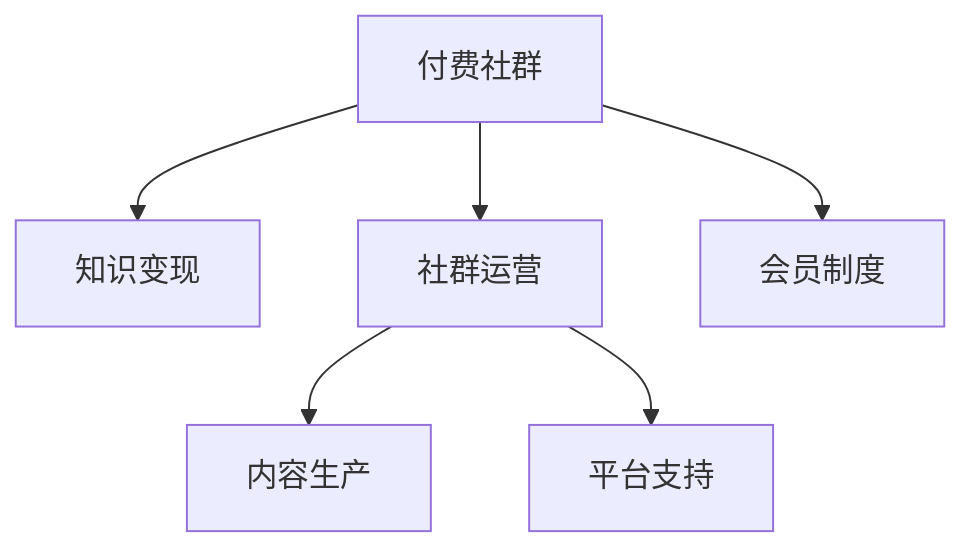

                 

## 1. 背景介绍

### 1.1 问题由来

在互联网时代，知识共享与传播变得前所未有的便捷，大量知识创作者和爱好者在社交媒体、博客、论坛、视频平台等平台上分享知识，不仅传播了信息，也形成了一个庞大的知识经济体系。然而，随着互联网红利的逐渐消退，内容创造者面临流量获取难度加大、商业变现渠道狭窄等困境。

与此同时，付费订阅模式在各类知识服务中崭露头角。从书籍订阅、教育培训到咨询顾问、技术分享，付费社群模式被广泛应用，成为知识变现的重要途径。付费社群通过收取订阅费用，保障了内容创作者的持续收入，同时提高了内容质量和用户互动频率，成为知识经济的重要形式之一。

### 1.2 问题核心关键点

- 付费社群模式：通过构建专属付费社区，吸引订阅用户，提供高质量的内容和服务，实现知识变现。
- 知识创作者：包括技术专家、教育从业者、学者等各类领域的专业人士，他们具备丰富的专业知识，有能力产出有价值的内容。
- 订阅用户：愿意为获取高质量、高价值内容支付费用的用户群体。
- 社群运营：包括内容策划、社区管理、用户互动、收入分配等环节，涉及技术、市场、运营等多个方面。
- 商业化变现：通过广告、会员订阅、付费课程、咨询服务等多种方式，实现社群的商业化运营和可持续收入。

### 1.3 问题研究意义

- 提升知识创作者收入：付费社群模式通过直接变现，保障了知识创作者的基本收入，提高了其创作热情和动力。
- 优化内容质量：订阅费用通常与内容质量相关联，用户对付费内容的期望值较高，推动创作者提供更有价值的内容。
- 增强用户互动：社群成员间的互动交流更加频繁，可以形成强有力的社区氛围，提升用户满意度。
- 促进知识传播：付费社群的专属性、封闭性促使成员分享更多高质量内容，加速知识的传播和共享。
- 推动产业升级：付费社群的兴起推动了知识经济和内容产业的发展，成为行业升级的新引擎。

## 2. 核心概念与联系

### 2.1 核心概念概述

为了深入理解付费社群模式，本文将介绍一些核心概念及其相互关系：

- **付费社群(Paid Community)**：通过收取订阅费用，只允许特定用户访问专属内容的社交群体，目的是通过高质量内容吸引并保留用户。
- **知识变现(Knowledge Monetization)**：将知识转化为经济收益的过程，包括通过付费社群、书籍、咨询、培训等多种方式实现。
- **社群运营(Community Management)**：涵盖内容策划、社区管理、用户互动、收入分配等多个方面，确保社群高效运转。
- **会员制度(Membership Model)**：基于会员等级、付费方式、内容访问权限等的划分，提供不同层次的服务。
- **内容生产(Content Production)**：知识创作者基于社群需求，产出有价值的内容。
- **平台支持(Platform Support)**：技术平台为社群运营提供支持，如用户管理系统、付费集成、数据统计等。

这些核心概念之间的联系可以通过以下Mermaid流程图来展示：



这个流程图展示出付费社群模式的核心概念及其之间的关系：

1. 付费社群作为知识变现的载体，通过优质内容吸引用户。
2. 社群运营保障社区的高效运转，推动内容生产与平台支持。
3. 会员制度提供不同层次的会员服务，增强用户黏性。
4. 内容生产确保高质量内容的持续输出，提升社群价值。
5. 平台支持为社群运营提供必要的技术支撑，优化用户体验。

这些概念共同构成了付费社群模式的知识经济生态，确保了模式的成功运营和知识变现的可持续性。

## 3. 核心算法原理 & 具体操作步骤

### 3.1 算法原理概述

付费社群模式基于订阅经济的原理，通过高质量内容吸引用户订阅，以实现知识变现。其核心算法原理包括：

- **内容推荐算法**：利用推荐系统技术，根据用户兴趣和行为数据，推荐相关内容，提升用户体验。
- **价格定价算法**：通过市场调研和用户反馈，动态调整订阅价格，确保合理性。
- **用户行为分析**：通过数据分析技术，监测用户行为，优化内容和服务。
- **收入分配算法**：根据内容创作者的服务质量和粉丝规模，进行收入分配，激励优质内容产出。

这些算法原理共同支撑了付费社群模式的持续运营和知识变现。

### 3.2 算法步骤详解

基于付费社群模式的知识变现，一般包括以下几个关键步骤：

**Step 1: 确定社区定位**
- 确定社群的主题和目标用户群体，明确社群的定位和价值主张。

**Step 2: 设计社群规则**
- 制定社群规则，包括内容审核标准、会员等级划分、互动规范等，保障社群的健康发展。

**Step 3: 实施内容生产**
- 招募或培养知识创作者，产出高质量内容，满足社群用户需求。

**Step 4: 构建社区平台**
- 选择合适的技术平台，如Discord、Slack、知识星球等，搭建社群运营的基础设施。

**Step 5: 营销推广**
- 通过多种渠道宣传社群，吸引潜在用户订阅，形成初始流量。

**Step 6: 用户运营**
- 定期更新内容，活跃社群氛围，加强用户互动，提升用户满意度和忠诚度。

**Step 7: 商业化变现**
- 探索多元化的收入来源，如会员订阅费、广告收入、课程收费、咨询服务等。

### 3.3 算法优缺点

付费社群模式具有以下优点：

- 保障创作者收入：通过直接收费，创作者能够获得持续稳定的收入。
- 激励优质内容：用户对付费内容质量要求高，创作者有动力产出优质内容。
- 提高用户黏性：专属社区增强了用户归属感，促进了高频互动。
- 加速知识传播：高质量内容的封闭性传播，提高了知识的精准性和效率。

同时，该模式也存在一定的局限性：

- 市场竞争激烈：新入局者容易抢占市场份额，原有社群面临流量流失风险。
- 内容创作者压力大：需要持续产出高质量内容，创作者压力大。
- 依赖用户订阅：如果订阅用户流失，社群运营可能会受到影响。
- 运营成本高：社群平台的搭建和维护需要投入大量资源。

尽管存在这些局限性，但付费社群模式在知识变现方面仍具有显著优势，得到了广泛的应用和认可。

### 3.4 算法应用领域

付费社群模式在多个领域得到了应用，主要包括：

- 技术社群：如编程、算法、人工智能等领域的专家社区，提供前沿技术分享、项目合作等。
- 教育培训：如在线教育、职业培训等，通过高质量课程和辅导，提高用户技能。
- 个人品牌：如作家、画家、音乐家等各类艺术家，通过社群传播艺术作品和思想。
- 商业咨询：如管理咨询、法律咨询等，提供专业的知识服务。
- 健康生活：如健身、健康饮食等社群，分享生活方式和健康知识。

除了上述这些领域外，付费社群模式还被创新性地应用到更多场景中，如知识分享、文化交流、社交娱乐等，为知识经济注入了新的活力。

## 4. 数学模型和公式 & 详细讲解 & 举例说明

### 4.1 数学模型构建

为了更好地理解付费社群模式的运作机制，本文将使用数学语言对相关算法进行严格刻画。

假设社群中有 $N$ 个用户，每个用户有 $M$ 个订阅选项，每个订阅选项的价格为 $p_i$，订阅收益率为 $r_i$。设用户订阅了 $k$ 个选项，用户流失率为 $\lambda$，每个用户的年收益为 $R$。则社群的年度收入模型可以表示为：

$$
\text{总收入} = \sum_{i=1}^N \left( R \cdot e^{-\lambda t} \cdot (1 - \lambda t) \right) \cdot p_i
$$

其中 $t$ 为用户在社群中的停留时间。

### 4.2 公式推导过程

我们进一步简化模型，假设用户订阅选项的收益率为固定值 $r$，用户流失率为常数 $\lambda$，用户年收益为 $R$，则社群的年度收入模型可以进一步简化为：

$$
\text{总收入} = N \cdot R \cdot (1 - \lambda t) \cdot p
$$

其中 $p$ 为平均订阅价格。

通过上述模型，可以计算出社群的年度收入和用户流失率之间的关系。增加用户数量和订阅价格，提高用户活跃度，可以有效提升社群的收入。

### 4.3 案例分析与讲解

以下我们以一个技术社群为例，展示如何通过付费社群模式实现知识变现。

假设一个技术社群有1000名用户，每个用户每年订阅价格为100元，社群订阅收益率为0.8，用户流失率为0.1。设社群每年新增100名用户，则社群的年度总收入和用户流失率之间的关系如下：

$$
\text{总收入} = 1000 \cdot 100 \cdot (1 - 0.1 t) \cdot 100
$$

其中 $t$ 为社群运营时间。

若社群运营1年，用户流失率为10%，则总收入为：

$$
\text{总收入} = 1000 \cdot 100 \cdot (1 - 0.1 \cdot 1) \cdot 100 = 90 \cdot 100 \cdot 100 = 90,000
$$

若社群运营2年，用户流失率为20%，则总收入为：

$$
\text{总收入} = 1100 \cdot 100 \cdot (1 - 0.1 \cdot 2) \cdot 100 = 110 \cdot 100 \cdot 80 = 88,000
$$

可以看到，社群的运营时间越长，用户流失率越高，总收入越低。因此，社群运营者需要平衡用户数量和用户流失率，以最大化社群的收入。

## 5. 项目实践：代码实例和详细解释说明

### 5.1 开发环境搭建

在进行付费社群模式的知识变现实践前，我们需要准备好开发环境。以下是使用Python进行Flask框架开发的环境配置流程：

1. 安装Anaconda：从官网下载并安装Anaconda，用于创建独立的Python环境。

2. 创建并激活虚拟环境：
```bash
conda create -n flask-env python=3.8 
conda activate flask-env
```

3. 安装Flask：
```bash
pip install flask
```

4. 安装其他必要库：
```bash
pip install pymongo flask_sqlalchemy marshmallow flask_login
```

5. 安装Flask-RESTful：
```bash
pip install flask-restful
```

6. 安装Flask-Chat-Server：
```bash
pip install flask-chat-server
```

完成上述步骤后，即可在`flask-env`环境中开始开发实践。

### 5.2 源代码详细实现

以下是使用Flask框架实现一个基本付费社群平台的代码示例。

```python
from flask import Flask, request, jsonify
from flask_sqlalchemy import SQLAlchemy
from flask_login import LoginManager, UserMixin, login_user, logout_user, login_required
from flask_chat_server import ChatServer
from marshmallow import Schema, fields

app = Flask(__name__)
app.config['SQLALCHEMY_DATABASE_URI'] = 'sqlite:///users.db'
app.config['SECRET_KEY'] = 'secret'

db = SQLAlchemy(app)
login_manager = LoginManager()
login_manager.init_app(app)
chat_server = ChatServer(app)

# 用户模型
class User(db.Model, UserMixin):
    id = db.Column(db.Integer, primary_key=True)
    username = db.Column(db.String(20), unique=True, nullable=False)
    email = db.Column(db.String(120), unique=True, nullable=False)
    password = db.Column(db.String(60), nullable=False)

    def __init__(self, username, email, password):
        self.username = username
        self.email = email
        self.password = password

# 用户序列化类
class UserSchema(Schema):
    id = fields.Integer()
    username = fields.String()
    email = fields.String()

    def __init__(self, *args, **kwargs):
        super().__init__(*args, **kwargs)

    def get(self):
        return {
            'id': self.id,
            'username': self.username,
            'email': self.email
        }

# 用户认证
@login_manager.user_loader
def load_user(user_id):
    return User.query.get(int(user_id))

# 注册用户
@app.route('/register', methods=['POST'])
def register():
    username = request.json.get('username')
    email = request.json.get('email')
    password = request.json.get('password')

    user = User(username, email, password)
    db.session.add(user)
    db.session.commit()

    return jsonify(UserSchema().dump(user))

# 登录用户
@app.route('/login', methods=['POST'])
def login():
    email = request.json.get('email')
    password = request.json.get('password')

    user = User.query.filter_by(email=email).first()
    if user and user.password == password:
        login_user(user)
        return jsonify({'message': '登录成功'})
    else:
        return jsonify({'message': '登录失败'})

# 注销用户
@app.route('/logout')
@login_required
def logout():
    logout_user()
    return jsonify({'message': '注销成功'})

# 订阅服务
@app.route('/subscribe', methods=['POST'])
@login_required
def subscribe():
    service_id = request.json.get('service_id')
    price = request.json.get('price')

    user = User.query.get(current_user.id)
    user.services.append(Service(service_id, price))
    db.session.commit()

    return jsonify({'message': '订阅成功'})

# 服务模型
class Service(db.Model):
    id = db.Column(db.Integer, primary_key=True)
    user_id = db.Column(db.Integer, db.ForeignKey('user.id'), nullable=False)
    service_id = db.Column(db.String(20), nullable=False)
    price = db.Column(db.Float, nullable=False)

    def __init__(self, service_id, price):
        self.service_id = service_id
        self.price = price

# 服务序列化类
class ServiceSchema(Schema):
    id = fields.Integer()
    service_id = fields.String()
    price = fields.Float()

    def __init__(self, *args, **kwargs):
        super().__init__(*args, **kwargs)

    def get(self):
        return {
            'id': self.id,
            'service_id': self.service_id,
            'price': self.price
        }

# 运行应用
if __name__ == '__main__':
    app.run(debug=True)
```

### 5.3 代码解读与分析

在上述代码示例中，我们使用了Flask框架构建了一个基本的付费社群平台。主要功能包括用户注册、登录、订阅服务和退出等。以下是代码的详细解读：

1. 导入所需的库：Flask、SQLAlchemy、Flask-Login、Flask-Chat-Server和Marshmallow。

2. 初始化Flask应用，设置数据库连接和密钥。

3. 定义用户模型和序列化类，用于存储和管理用户信息。

4. 实现用户认证功能，使用Flask-Login扩展，实现用户登录和退出。

5. 实现订阅服务功能，记录用户的订阅信息。

6. 实现服务模型和序列化类，用于存储和管理订阅服务信息。

7. 在应用主程序中启动应用。

这个代码示例展示了如何使用Flask框架构建一个基本的付费社群平台，能够实现用户管理、订阅服务等功能，为进一步扩展和优化打下基础。

## 6. 实际应用场景

### 6.1 智能客服系统

付费社群模式在智能客服系统中得到了广泛应用。传统的客服系统需要配备大量人力，高峰期响应缓慢，且一致性和专业性难以保证。付费社群模式通过构建专属客服社区，提供高质量的客服服务，吸引了大量客户订阅。社群成员可以随时随地咨询问题，获取快速、准确的解答，大大提升了客户体验和满意度。

### 6.2 在线教育平台

在线教育平台利用付费社群模式，聚集了大量的专业教师和学生。教师通过社群分享知识，学生通过付费订阅获取高质量课程和辅导。平台根据用户反馈不断优化课程内容，提升教学效果，同时通过广告、课程收费等方式实现商业变现。

### 6.3 知识分享社区

知识分享社区如知乎、Medium等，通过构建付费社群模式，为知识创作者提供变现渠道。创作者发布有价值的内容，通过订阅费用和广告收入实现收入。订阅用户可以获得专属内容、一对一咨询等服务，享受高质量的知识分享体验。

### 6.4 未来应用展望

随着技术的发展和应用的推广，付费社群模式将在更多领域得到应用。以下是一些可能的未来应用场景：

- **医疗健康**：医生和患者通过付费社群交流，获取专业健康咨询和医疗知识。
- **艺术文化**：艺术家和爱好者通过社群分享作品和艺术理念，提供高质量的艺术体验。
- **环境保护**：环保组织和志愿者通过社群传播环保知识，组织环保活动。
- **社会公益**：公益组织通过社群募集资金，提供社会服务。
- **娱乐休闲**：游戏玩家通过社群分享游戏技巧和心得，获取娱乐体验。

付费社群模式的未来发展将更加多元化，涵盖更多领域，为各行各业提供高质量的知识服务和商业变现渠道。

## 7. 工具和资源推荐

### 7.1 学习资源推荐

为了帮助开发者系统掌握付费社群模式的知识变现技术，这里推荐一些优质的学习资源：

1. **《Python Web开发实战》系列书籍**：详细介绍了如何使用Flask等框架构建Web应用，适合初学者和进阶开发者。
2. **《数据科学入门》课程**：由Coursera等平台提供的在线课程，涵盖数据科学基础和应用，适合非技术背景的学习者。
3. **《微服务架构设计》课程**：由Udacity等平台提供的在线课程，讲解微服务架构设计原理和实践，适合Web开发者。
4. **《用户增长指南》书籍**：详细讲解了用户增长策略和社群运营技巧，适合社群运营者。
5. **《订阅经济》书籍**：分析了订阅经济的原理和应用案例，适合创业者和管理者。

通过对这些资源的学习实践，相信你一定能够快速掌握付费社群模式的精髓，并用于解决实际的业务问题。

### 7.2 开发工具推荐

高效的开发离不开优秀的工具支持。以下是几款用于付费社群模式开发的常用工具：

1. **Flask框架**：轻量级Web框架，支持RESTful API和实时聊天功能，适合构建付费社群平台。
2. **SQLAlchemy**：Python ORM框架，支持数据库操作，方便数据管理。
3. **Flask-Login**：Flask扩展，实现用户认证和会话管理。
4. **Flask-Chat-Server**：Flask扩展，支持实时聊天功能，方便社群互动。
5. **Marshmallow**：Python序列化库，方便数据序列化和反序列化。

合理利用这些工具，可以显著提升付费社群模式的知识变现系统的开发效率，加快创新迭代的步伐。

### 7.3 相关论文推荐

付费社群模式的研究源于学界的持续研究。以下是几篇奠基性的相关论文，推荐阅读：

1. **《订阅经济：研究现状与未来趋势》**：分析了订阅经济的原理和应用，提供了丰富的案例和数据。
2. **《在线教育平台的可持续发展》**：研究了在线教育平台的商业化变现模式，提出了一些创新的商业化策略。
3. **《社区运营的策略与实践》**：详细介绍了社群运营的技巧和方法，提供了实际案例和经验总结。
4. **《知识变现的创新路径》**：探讨了知识变现的多种方式，包括付费社群、知识付费、众筹等。

这些论文代表了大社群模式的研究方向，帮助研究者把握学科前进方向，激发更多的创新灵感。

## 8. 总结：未来发展趋势与挑战

### 8.1 总结

本文对付费社群模式进行知识变现的原理和实践进行了全面系统的介绍。首先阐述了付费社群模式的背景、核心概念和关键点，明确了知识变现的重要性。其次，从原理到实践，详细讲解了知识变现的数学模型和操作步骤，给出了知识变现任务的代码示例。同时，本文还广泛探讨了知识变现模式在智能客服、在线教育、知识分享等多个行业领域的应用前景，展示了知识变现模式的巨大潜力。此外，本文精选了知识变现技术的各类学习资源，力求为读者提供全方位的技术指引。

通过本文的系统梳理，可以看到，付费社群模式作为知识变现的重要手段，正在成为知识经济的重要形式，极大地拓展了知识变现的边界，推动了知识经济的发展。未来，伴随技术的不断进步和应用的广泛推广，付费社群模式必将在更多领域得到应用，为知识经济带来新的活力。

### 8.2 未来发展趋势

展望未来，付费社群模式的知识变现将呈现以下几个发展趋势：

1. **个性化推荐**：利用推荐系统技术，根据用户兴趣和行为数据，推荐高质量内容，提升用户体验。
2. **多渠道变现**：除了订阅费用，还可以探索广告、课程收费、咨询收入等多种变现方式。
3. **社区互动**：加强社区成员的互动交流，通过话题讨论、课程辅导等方式，提升社群黏性和活跃度。
4. **知识服务**：提供专家咨询、项目合作等知识服务，增强社群的附加值。
5. **技术升级**：引入人工智能、区块链等前沿技术，提升社群平台的智能化水平和安全性。
6. **国际化**：拓展国际市场，吸引全球用户，提升社群的国际影响力。

以上趋势凸显了付费社群模式的知识变现的广阔前景。这些方向的探索发展，必将进一步提升知识变现的效果，为知识经济和内容产业带来新的发展机遇。

### 8.3 面临的挑战

尽管付费社群模式的知识变现已经取得了瞩目成就，但在迈向更加智能化、普适化应用的过程中，它仍面临诸多挑战：

1. **市场竞争激烈**：新入局者容易抢占市场份额，原有社群面临流量流失风险。
2. **内容创作者压力大**：需要持续产出高质量内容，创作者压力大。
3. **用户流失率高**：用户流失率高，社群运营需要不断优化，留住用户。
4. **运营成本高**：社群平台的搭建和维护需要投入大量资源。
5. **技术门槛高**：技术复杂度高，需要具备一定的技术背景和开发经验。

尽管存在这些挑战，付费社群模式的知识变现仍具有显著优势，得到了广泛的应用和认可。未来，需要从市场、内容、技术等多个方面协同发力，才能克服这些挑战，实现付费社群模式的可持续发展。

### 8.4 研究展望

面对付费社群模式的知识变现所面临的挑战，未来的研究需要在以下几个方面寻求新的突破：

1. **市场细分**：细分市场，找到具有高附加值和低竞争的市场领域，提升社群竞争力。
2. **内容多样化**：提供多样化的内容形式，如视频、音频、直播等，满足用户的多样化需求。
3. **用户互动**：加强社群成员的互动交流，通过话题讨论、课程辅导等方式，提升社群黏性和活跃度。
4. **知识服务**：提供专家咨询、项目合作等知识服务，增强社群的附加值。
5. **技术融合**：引入人工智能、区块链等前沿技术，提升社群平台的智能化水平和安全性。
6. **国际化**：拓展国际市场，吸引全球用户，提升社群的国际影响力。

这些研究方向的探索，必将引领付费社群模式的知识变现走向更高的台阶，为知识经济和内容产业带来新的发展机遇。面向未来，付费社群模式的知识变现技术还需要与其他人工智能技术进行更深入的融合，如知识表示、因果推理、强化学习等，多路径协同发力，共同推动自然语言理解和智能交互系统的进步。只有勇于创新、敢于突破，才能不断拓展知识变现的边界，让知识变现技术更好地造福人类社会。

## 9. 附录：常见问题与解答

**Q1: 什么是付费社群模式？**

A: 付费社群模式是通过收取订阅费用，只允许特定用户访问专属内容的社交群体，目的是通过高质量内容吸引并保留用户，实现知识变现。

**Q2: 如何选择合适的订阅价格？**

A: 订阅价格需要根据社群的用户数量、成本、竞争对手定价等因素综合考虑。一般来说，价格过高会限制用户数量，价格过低则难以覆盖成本。可以通过市场调研和用户反馈，动态调整订阅价格，确保合理性。

**Q3: 如何提高社群的留存率？**

A: 提高社群的留存率需要从多个方面入手，如提供高质量内容、加强用户互动、优化用户体验等。可以通过数据分析技术，监测用户行为，优化社群运营策略，提升用户满意度和忠诚度。

**Q4: 如何提高社群的活跃度？**

A: 提高社群的活跃度需要加强社群成员的互动交流，如话题讨论、课程辅导等。可以通过组织社群活动、引入专家讲座等方式，增强社群的互动性，提升社群的黏性和活跃度。

**Q5: 如何提高社群的商业变现能力？**

A: 提高社群的商业变现能力需要探索多元化的变现方式，如广告收入、课程收费、咨询收入等。可以通过数据分析技术，监测用户行为，优化内容和服务，提升社群的价值和吸引力，吸引更多的用户订阅。

这些问题的解答，可以帮助开发者更好地理解付费社群模式的知识变现技术，并提供一些实际的解决方案。希望这些指导能为你提供帮助。

