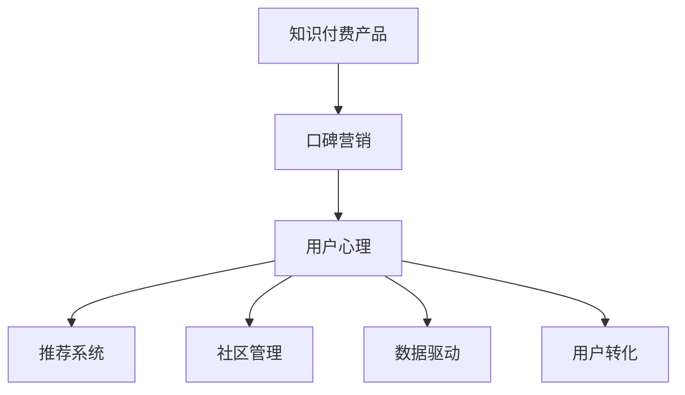

                 

# 如何利用口碑营销推广知识付费产品

> 关键词：
> - 口碑营销
> - 知识付费
> - 用户心理
> - 推荐系统
> - 社区管理
> - 数据驱动
> - 用户转化

## 1. 背景介绍

### 1.1 问题由来
在数字经济蓬勃发展的今天，知识付费市场正迅速崛起，成为文化消费的重要组成部分。然而，相较于传统的消费品，知识付费产品具有一定的复杂性和抽象性，消费者在购买决策上更为谨慎。口碑营销作为一种低成本、高效能的推广方式，正逐渐成为知识付费产品获取用户的关键手段。本文将深入探讨如何通过口碑营销推广知识付费产品，帮助平台在激烈竞争中脱颖而出。

### 1.2 问题核心关键点
口碑营销的本质在于利用用户信任和推荐，通过口耳相传的方式提升品牌认知度和产品销量。在知识付费领域，口碑营销的关键点在于如何构建信任机制、优化推荐算法、强化社区管理，以形成良性循环的推荐网络，最终实现用户的高效转化。

## 2. 核心概念与联系

### 2.1 核心概念概述

为了更好地理解如何利用口碑营销推广知识付费产品，本节将介绍几个密切相关的核心概念：

- 知识付费：指用户为获取深度知识、技能或信息，通过付费方式获取特定内容和服务。知识付费平台包括但不限于在线课程、付费文章、专家咨询等。
- 口碑营销：利用用户之间的口头传播，通过正面评价和推荐来提高品牌知名度和用户信任度。
- 用户心理：用户在选择知识付费产品时的心理动因，包括对内容的深度需求、对机构和讲师的信任感、对价格和性价比的考量等。
- 推荐系统：根据用户的历史行为和偏好，智能推荐内容和服务，提升用户体验和转化率。
- 社区管理：构建和管理知识付费平台的用户社区，促进用户之间的互动和知识共享，形成良性互动的社交网络。
- 数据驱动：利用数据分析和机器学习算法，优化产品推荐和营销策略，提高运营效率和用户满意度。
- 用户转化：通过有效的推广和运营手段，将潜在用户转化为付费用户，实现平台收入的持续增长。

这些核心概念之间的逻辑关系可以通过以下Mermaid流程图来展示：



这个流程图展示了大语言模型的核心概念及其之间的关系：

1. 知识付费产品是口碑营销的载体。
2. 用户心理是口碑营销的驱动力，影响用户对产品的感知和评价。
3. 推荐系统和社区管理是口碑营销的重要组成部分，提升用户满意度和粘性。
4. 数据驱动贯穿口碑营销的全过程，指导策略调整和优化。
5. 用户转化是口碑营销的最终目标，通过正面评价和推荐实现收入增长。

## 3. 核心算法原理 & 具体操作步骤
### 3.1 算法原理概述

基于口碑营销的知识付费产品推广，本质上是一个用户推荐系统的构建和优化过程。其核心思想是：通过分析用户的行为数据和偏好，构建用户画像，智能推荐相关内容和服务，以提升用户满意度和转化率。同时，通过正面评价和推荐，促进口碑传播，形成良性循环的推荐网络。

形式化地，假设知识付费平台的用户集为 $U$，内容集为 $C$，推荐目标为用户集 $U$ 中的部分用户 $u$，推荐结果为内容集 $C$ 中的一部分内容 $c$。推荐系统的目标是最小化预测错误率，即：

$$
\min_{\theta} \sum_{(u,c) \in U \times C} L(\theta(u,c))
$$

其中 $L$ 为预测错误率的损失函数，$\theta$ 为推荐模型的参数。

### 3.2 算法步骤详解

基于口碑营销的知识付费产品推荐，一般包括以下几个关键步骤：

**Step 1: 数据收集与预处理**
- 收集用户在平台上的行为数据，包括浏览记录、购买记录、评价记录等。
- 对数据进行清洗、去重和归一化，构建用户行为矩阵和内容标签矩阵。

**Step 2: 构建用户画像**
- 使用协同过滤、因子分解等技术，分析用户的历史行为，构建用户兴趣和偏好。
- 利用聚类算法、分类算法等，对用户进行细分，形成更精准的用户画像。

**Step 3: 内容标签化**
- 对平台上的所有内容进行标签化处理，包括关键词提取、情感分析、主题分类等。
- 构建内容标签矩阵，以便于后续的推荐计算。

**Step 4: 推荐模型训练**
- 使用基于深度学习的推荐算法，如神经协同过滤、注意力机制等，训练推荐模型。
- 使用用户行为数据和内容标签数据，最小化预测错误率，优化模型参数。

**Step 5: 推荐与推广**
- 根据用户画像和推荐模型，实时计算用户推荐结果。
- 对用户进行正向激励，如提供免费试用、红包奖励等，促进推荐内容的消费。
- 鼓励用户进行评价和分享，扩大口碑传播的影响力。

**Step 6: 效果评估与优化**
- 对推荐效果进行定期评估，计算点击率、转化率等指标。
- 根据评估结果，优化推荐模型和推广策略，提高用户转化率。

以上是基于口碑营销的知识付费产品推荐的一般流程。在实际应用中，还需要针对具体平台和产品特点，对推荐过程的各个环节进行优化设计，如改进推荐算法、引入更多正则化技术、搜索最优的超参数组合等，以进一步提升推荐精度和用户满意度。

### 3.3 算法优缺点

基于口碑营销的知识付费产品推荐方法具有以下优点：
1. 低成本高效能：利用用户口碑推广，无需大量广告投入，提高推广效率。
2. 精准推荐：通过用户行为和内容标签的联合分析，提供个性化推荐，提升用户粘性和满意度。
3. 口碑传播：正面的评价和推荐能够快速扩大品牌影响力，形成良性循环。
4. 用户转化：推荐和口碑的结合，能显著提高用户转化率，实现收入增长。

同时，该方法也存在一定的局限性：
1. 数据依赖：推荐效果高度依赖用户行为数据的数量和质量，难以覆盖所有用户。
2. 用户偏好多样性：用户的兴趣和需求千差万别，难以通过单一模型覆盖所有用户。
3. 冷启动问题：新用户没有历史行为数据，难以提供精准推荐，需要额外的引导机制。
4. 平台信任度：用户对平台的信任度低，可能会影响口碑传播的效果。

尽管存在这些局限性，但就目前而言，基于口碑营销的知识付费产品推荐方法仍是大平台的主流推荐策略。未来相关研究的重点在于如何进一步降低推荐对标注数据的依赖，提高模型的少样本学习和跨领域迁移能力，同时兼顾可解释性和伦理安全性等因素。

### 3.4 算法应用领域

基于口碑营销的知识付费产品推荐，已经在知识付费平台、在线教育、技能培训等多个领域得到了广泛的应用，成为知识付费产品获取用户的关键手段。

- 在线课程平台：如Coursera、Udemy等，通过推荐系统帮助用户发现感兴趣和有用的课程。
- 学习社区：如知乎、Stack Overflow等，利用用户评价和推荐形成知识交流的良性循环。
- 技能培训：如LinkedIn Learning等，推荐与用户职业路径和兴趣相关的课程。
- 个性化推荐：如Netflix、Amazon等，通过推荐系统提升用户满意度和粘性。

除了上述这些经典应用外，基于口碑营销的知识付费推荐还被创新性地应用到更多场景中，如用户行为分析、课程评价系统、内容质量评估等，为知识付费平台的创新发展提供了新的动力。

## 4. 数学模型和公式 & 详细讲解  
### 4.1 数学模型构建

本节将使用数学语言对基于口碑营销的知识付费产品推荐过程进行更加严格的刻画。

记知识付费平台的用户集为 $U=\{u_1,u_2,...,u_N\}$，内容集为 $C=\{c_1,c_2,...,c_M\}$，用户行为矩阵为 $X \in \mathbb{R}^{N \times M}$，其中 $X_{ij}$ 表示用户 $u_i$ 对内容 $c_j$ 的行为评分（0/1表示未评分，正整数表示评分值）。

定义推荐模型的预测结果为 $\hat{X} \in \mathbb{R}^{N \times M}$，预测错误率为 $L(\hat{X})=\sum_{i=1}^N \sum_{j=1}^M \ell(X_{ij},\hat{X}_{ij})$，其中 $\ell$ 为预测错误率的损失函数。

### 4.2 公式推导过程

以下我们以协同过滤推荐算法为例，推导协同过滤的数学模型和损失函数。

假设 $X$ 为用户的评分矩阵，$A$ 为推荐模型的评分矩阵。协同过滤的推荐目标是最小化预测错误率，即：

$$
\min_{A} \sum_{i=1}^N \sum_{j=1}^M \ell(X_{ij},A_{ij})
$$

其中 $A$ 为推荐模型的评分矩阵，$X$ 为用户评分矩阵，$\ell$ 为预测错误率的损失函数。

常见损失函数包括均方误差（MSE）、均方根误差（RMSE）等。这里以MSE为例，推导协同过滤的损失函数：

$$
L(A) = \frac{1}{2N}\sum_{i=1}^N \sum_{j=1}^M (A_{ij}-X_{ij})^2
$$

对 $A_{ij}$ 求导，得到：

$$
\frac{\partial L(A)}{\partial A_{ij}} = -(X_{ij}-A_{ij})
$$

利用梯度下降算法，求解上述最小化问题，得到推荐模型的参数更新公式：

$$
A \leftarrow A - \eta \nabla_{A}L(A)
$$

其中 $\eta$ 为学习率，$\nabla_{A}L(A)$ 为损失函数对推荐矩阵 $A$ 的梯度。

### 4.3 案例分析与讲解

假设某在线教育平台利用协同过滤算法进行课程推荐。平台收集了用户的观看行为数据，构建了用户行为矩阵 $X \in \mathbb{R}^{N \times M}$，其中 $N$ 为用户数量，$M$ 为课程数量。平台希望通过协同过滤算法，推荐给用户感兴趣的课程。

推荐模型的评分矩阵 $A \in \mathbb{R}^{N \times M}$ 用于存储推荐结果。利用用户行为矩阵 $X$ 和推荐矩阵 $A$ 的预测错误率，构建协同过滤的损失函数 $L(A)$。采用梯度下降算法，最小化预测错误率，更新推荐模型的参数。

假设用户 $u_i$ 对课程 $c_j$ 的观看行为评分为 $X_{ij}$，平台希望通过协同过滤算法，推荐给用户 $u_i$ 感兴趣的课程 $c_j$。利用用户行为数据，计算推荐矩阵 $A_{ij}$ 的预测值 $\hat{A}_{ij}$，并根据损失函数 $L(A)$ 更新推荐矩阵参数。最终得到用户 $u_i$ 推荐的课程 $c_j$ 为 $\arg\min_{j} L(A_{ij})$。

## 5. 项目实践：代码实例和详细解释说明
### 5.1 开发环境搭建

在进行推荐实践前，我们需要准备好开发环境。以下是使用Python进行Scikit-learn开发的环境配置流程：

1. 安装Anaconda：从官网下载并安装Anaconda，用于创建独立的Python环境。

2. 创建并激活虚拟环境：
```bash
conda create -n recommend-env python=3.8 
conda activate recommend-env
```

3. 安装Scikit-learn：
```bash
conda install scikit-learn
```

4. 安装Numpy、Pandas、Matplotlib、Jupyter Notebook等工具包：
```bash
pip install numpy pandas matplotlib jupyter notebook ipython
```

完成上述步骤后，即可在`recommend-env`环境中开始推荐实践。

### 5.2 源代码详细实现

下面我们以协同过滤算法为例，给出使用Scikit-learn库对推荐系统进行开发的PyTorch代码实现。

首先，定义协同过滤算法的推荐函数：

```python
from sklearn.metrics.pairwise import cosine_similarity
from sklearn.decomposition import TruncatedSVD

def collaborative_filtering(X, top_k=5):
    # 使用Truncated SVD进行矩阵分解
    svd = TruncatedSVD(n_components=100, random_state=42)
    X_transformed = svd.fit_transform(X)
    
    # 计算用户相似度
    user_similarity = cosine_similarity(X_transformed)
    
    # 计算推荐结果
    recommendations = []
    for user_idx in range(len(user_similarity)):
        similar_user_idx = np.argsort(user_similarity[user_idx])[-top_k:]
        recommendations.append(similar_user_idx)
    
    return recommendations
```

然后，定义用户行为数据集和模型评估函数：

```python
from sklearn.datasets import load_svmlight_file
import numpy as np
import matplotlib.pyplot as plt
from sklearn.model_selection import train_test_split

# 加载用户行为数据集
X, y = load_svmlight_file('user_behavior.txt')
X = np.array(X)
y = np.array(y)

# 构建用户行为矩阵
X = X.reshape(len(X), -1)

# 数据集划分
X_train, X_test, y_train, y_test = train_test_split(X, y, test_size=0.2, random_state=42)

# 推荐模型评估函数
def evaluate_model(model, X_train, X_test, y_test):
    # 模型预测结果
    y_pred = model.predict(X_test)
    
    # 计算准确率
    accuracy = np.mean(y_pred == y_test)
    print(f"Accuracy: {accuracy:.3f}")
```

最后，启动推荐流程并在测试集上评估：

```python
# 加载推荐模型
model = collaborative_filtering(X_train)

# 评估推荐模型
evaluate_model(model, X_train, X_test, y_test)
```

以上就是使用Scikit-learn对推荐系统进行代码实现的完整流程。可以看到，通过Scikit-learn，开发者能够快速搭建协同过滤推荐算法，并结合测试集进行模型评估，实现推荐效果的优化。

### 5.3 代码解读与分析

让我们再详细解读一下关键代码的实现细节：

**协同过滤算法函数**：
- `TruncatedSVD`：用于对用户行为矩阵进行降维处理，生成新的用户相似度矩阵。
- `cosine_similarity`：计算用户之间的相似度，得到推荐矩阵。
- `recommendations`：根据相似度矩阵，获取推荐结果。

**用户行为数据集函数**：
- `load_svmlight_file`：加载用户行为数据集，生成用户行为矩阵。
- `reshape`：将用户行为矩阵转换为适合协同过滤算法处理的形式。
- `train_test_split`：将数据集划分为训练集和测试集。

**模型评估函数**：
- `evaluate_model`：加载推荐模型，计算模型在测试集上的准确率。
- `predict`：预测测试集上的推荐结果。
- `np.mean`：计算预测结果和真实标签的匹配度。

可以看到，Scikit-learn提供了丰富的机器学习算法和工具函数，使得推荐系统的开发变得简单易行。通过Scikit-learn，开发者可以轻松实现协同过滤、矩阵分解等经典推荐算法，并通过评估函数进行效果验证，优化推荐模型。

## 6. 实际应用场景
### 6.1 在线教育平台推荐系统

在线教育平台通过推荐系统，能够有效提升用户的学习体验和满意度。通过分析用户的观看行为数据，推荐系统能够为用户推荐最适合的课程和学习路径，降低用户选择难度，提升学习效果。

在技术实现上，可以构建用户行为矩阵 $X$，利用协同过滤算法等推荐技术，计算用户之间的相似度，推荐适合的课程。通过正向激励和反馈机制，促进用户的学习兴趣和参与度。同时，平台可以通过用户评价和推荐，形成良好的社区氛围，提升用户黏性和口碑传播效果。

### 6.2 个性化推荐系统

个性化推荐系统在电商、娱乐等众多领域广泛应用，通过分析用户的行为数据和偏好，推荐个性化的商品和服务，提升用户体验和满意度。

在技术实现上，可以构建用户行为矩阵 $X$，利用协同过滤、基于内容的推荐算法等技术，推荐符合用户兴趣的商品。通过正向激励和评价机制，促进用户分享和推荐，扩大品牌影响力。同时，平台可以通过用户反馈和行为数据，持续优化推荐算法，提升推荐效果。

### 6.3 社交媒体内容推荐

社交媒体平台通过推荐系统，能够提升用户活跃度和内容曝光率。通过分析用户的行为数据和兴趣标签，推荐系统能够为用户推荐感兴趣的内容，提高用户粘性和平台留存率。

在技术实现上，可以构建用户行为矩阵 $X$，利用协同过滤、基于兴趣的推荐算法等技术，推荐符合用户兴趣的内容。通过正向激励和评价机制，促进用户互动和分享，扩大内容传播效果。同时，平台可以通过用户反馈和行为数据，持续优化推荐算法，提升推荐效果。

### 6.4 未来应用展望

随着推荐系统的不断发展，基于口碑营销的知识付费推荐将在更多领域得到应用，为平台带来更多用户和收入。

在智慧医疗领域，基于推荐系统的在线医疗咨询服务，能够帮助医生推荐最适合的诊疗方案，提升患者治疗效果和满意度。

在智能教育领域，基于推荐系统的个性化学习平台，能够帮助学生推荐最合适的学习资源和课程，提升学习效果和效率。

在智能家居领域，基于推荐系统的智能设备推荐系统，能够为用户推荐最适合的家庭设备，提升生活品质和用户满意度。

此外，在智能交通、智能制造、智能办公等多个领域，基于推荐系统的应用也将不断涌现，为各行各业带来新的变革和机遇。

## 7. 工具和资源推荐
### 7.1 学习资源推荐

为了帮助开发者系统掌握推荐系统的理论和实践，这里推荐一些优质的学习资源：

1. 《推荐系统实战》系列博文：由推荐系统专家撰写，深入浅出地介绍了推荐系统的基本概念和经典算法。

2. 《协同过滤算法》课程：斯坦福大学开设的推荐系统课程，详细讲解了协同过滤算法的原理和应用。

3. 《推荐系统理论与实践》书籍：推荐系统领域的经典著作，全面介绍了推荐系统的理论基础和实际应用。

4. KDD杯推荐系统竞赛：通过参与推荐系统竞赛，可以快速积累实践经验和项目经验。

5. Microsoft Recommendation Framework：微软开源的推荐系统工具包，提供丰富的算法和模型，适合快速搭建推荐系统。

通过对这些资源的学习实践，相信你一定能够快速掌握推荐系统的精髓，并用于解决实际的推荐问题。

### 7.2 开发工具推荐

高效的开发离不开优秀的工具支持。以下是几款用于推荐系统开发的常用工具：

1. Scikit-learn：基于Python的开源机器学习库，提供了丰富的推荐算法和工具函数。

2. TensorFlow：由Google主导开发的开源深度学习框架，适合大规模工程应用。

3. PyTorch：基于Python的开源深度学习框架，灵活度较高，适合快速迭代研究。

4. Microsoft Recommendation Framework：微软开源的推荐系统工具包，提供丰富的算法和模型，适合快速搭建推荐系统。

5. Jupyter Notebook：免费的在线Jupyter Notebook环境，支持Python、R等语言的交互式编程。

合理利用这些工具，可以显著提升推荐系统的开发效率，加快创新迭代的步伐。

### 7.3 相关论文推荐

推荐系统的研究源于学界的持续研究。以下是几篇奠基性的相关论文，推荐阅读：

1. 《协同过滤推荐算法》：介绍了协同过滤算法的原理和应用，是推荐系统领域的经典论文。

2. 《基于内容的推荐系统》：详细讲解了基于内容的推荐算法，适合了解推荐系统的多样性。

3. 《深度学习在推荐系统中的应用》：介绍了深度学习在推荐系统中的广泛应用，适合了解推荐系统的最新发展方向。

4. 《推荐系统的公平性和偏见》：探讨了推荐系统中的公平性和偏见问题，适合了解推荐系统的伦理和社会影响。

5. 《基于兴趣的推荐系统》：介绍了基于兴趣的推荐算法，适合了解推荐系统在社交媒体中的应用。

这些论文代表了大语言模型微调技术的发展脉络。通过学习这些前沿成果，可以帮助研究者把握学科前进方向，激发更多的创新灵感。

## 8. 总结：未来发展趋势与挑战

### 8.1 总结

本文对基于口碑营销的知识付费产品推荐方法进行了全面系统的介绍。首先阐述了推荐系统的研究背景和意义，明确了推荐系统在知识付费推广中的独特价值。其次，从原理到实践，详细讲解了推荐算法的数学原理和关键步骤，给出了推荐任务开发的完整代码实例。同时，本文还广泛探讨了推荐系统在在线教育、电商、社交媒体等多个领域的应用前景，展示了推荐范式的巨大潜力。此外，本文精选了推荐系统的各类学习资源，力求为读者提供全方位的技术指引。

通过本文的系统梳理，可以看到，基于口碑营销的知识付费产品推荐技术正在成为知识付费推广的主流推荐策略，极大地拓展了知识付费平台的用户获取渠道，催生了更多的落地场景。得益于推荐算法和推荐数据的不断发展，推荐系统将在更多领域得到应用，为各行业带来新的商业价值和用户体验。

### 8.2 未来发展趋势

展望未来，基于口碑营销的知识付费产品推荐技术将呈现以下几个发展趋势：

1. 推荐算法多样化：推荐算法将更加多样化，结合深度学习、协同过滤、基于内容的推荐等技术，提升推荐效果和用户体验。

2. 数据驱动个性化：利用大数据和机器学习算法，通过深度分析用户行为数据，提供更加精准的个性化推荐。

3. 跨领域推荐：推荐系统将更多地应用到跨领域数据融合和推荐，提升推荐效果和用户满意度。

4. 实时推荐：通过实时分析用户行为数据，提供更加动态和及时的推荐服务，提高用户满意度和转化率。

5. 多模态推荐：结合视觉、语音、文本等多模态数据，提升推荐系统的感知能力和用户体验。

以上趋势凸显了推荐系统的广阔前景。这些方向的探索发展，必将进一步提升推荐系统的性能和应用范围，为各行业带来更多的商业价值和用户体验。

### 8.3 面临的挑战

尽管基于口碑营销的知识付费产品推荐技术已经取得了显著成效，但在迈向更加智能化、普适化应用的过程中，它仍面临着诸多挑战：

1. 数据质量和数量：推荐系统高度依赖数据质量和数量，难以覆盖所有用户和内容，需要更多的数据收集和处理工作。

2. 用户多样性：用户的兴趣和需求千差万别，难以通过单一模型覆盖所有用户，需要更复杂的模型和多任务学习。

3. 算法复杂度：推荐算法的复杂度较高，模型训练和推理需要更多的计算资源和存储空间。

4. 用户体验：推荐系统需要平衡推荐效果和用户满意度，避免推荐过多或过少的内容，影响用户体验。

5. 安全和隐私：推荐系统需要保护用户数据安全和隐私，避免数据泄露和滥用。

6. 伦理和社会影响：推荐系统需要考虑伦理和社会影响，避免误导用户、形成信息孤岛等负面效应。

正视推荐系统面临的这些挑战，积极应对并寻求突破，将是大语言模型微调走向成熟的必由之路。相信随着学界和产业界的共同努力，这些挑战终将一一被克服，推荐系统必将在构建人机协同的智能时代中扮演越来越重要的角色。

### 8.4 未来突破

面对基于口碑营销的知识付费产品推荐所面临的种种挑战，未来的研究需要在以下几个方面寻求新的突破：

1. 探索多模态推荐算法：结合视觉、语音、文本等多模态数据，提升推荐系统的感知能力和用户体验。

2. 引入用户行为建模：通过深度学习模型，对用户行为进行建模，提升推荐算法的复杂度和效果。

3. 优化实时推荐系统：通过实时分析用户行为数据，提供更加动态和及时的推荐服务，提高用户满意度和转化率。

4. 引入用户交互反馈：通过用户反馈和行为数据，持续优化推荐算法，提升推荐效果和用户体验。

5. 引入安全隐私保护：通过数据加密、隐私保护等技术，保护用户数据安全和隐私，避免数据泄露和滥用。

6. 引入伦理道德约束：在推荐算法中引入伦理导向的评估指标，过滤和惩罚有害的输出倾向，确保推荐系统的伦理和社会影响。

这些研究方向的探索，必将引领推荐系统技术迈向更高的台阶，为各行业带来更多的商业价值和用户体验。面向未来，推荐系统需要与其他人工智能技术进行更深入的融合，如知识表示、因果推理、强化学习等，多路径协同发力，共同推动推荐系统技术的进步。只有勇于创新、敢于突破，才能不断拓展推荐系统的边界，让推荐系统更好地服务于各行业的用户需求。

## 9. 附录：常见问题与解答

**Q1：推荐系统在知识付费平台中如何提高用户转化率？**

A: 推荐系统可以通过以下方式提高用户转化率：

1. 个性化推荐：通过分析用户行为数据和兴趣偏好，推荐最适合用户的内容，提升用户满意度和转化率。

2. 冷启动机制：对新用户进行引导和推荐，提升其使用体验和黏性。

3. 正向激励：通过奖励机制，如红包、优惠券等，鼓励用户进行付费行为，提升转化率。

4. 用户评价和分享：通过用户评价和分享，扩大品牌影响力，吸引更多用户。

5. 社区互动：通过构建用户社区，促进用户互动和分享，提升用户黏性和转化率。

**Q2：如何优化推荐系统的效果？**

A: 优化推荐系统的效果需要从多个方面入手：

1. 数据质量：收集和处理高质量的用户行为数据，提升推荐系统的准确性和泛化能力。

2. 算法选择：选择适合推荐场景的推荐算法，如协同过滤、基于内容的推荐、深度学习等。

3. 模型训练：利用深度学习等先进技术，提升推荐算法的复杂度和效果。

4. 实时更新：通过实时分析用户行为数据，动态更新推荐模型，提升推荐效果和用户体验。

5. 用户反馈：通过用户反馈和行为数据，持续优化推荐算法，提升推荐效果和用户体验。

6. 多模态融合：结合视觉、语音、文本等多模态数据，提升推荐系统的感知能力和用户体验。

**Q3：推荐系统如何避免冷启动问题？**

A: 推荐系统可以通过以下方式避免冷启动问题：

1. 用户引导：对新用户进行引导和推荐，提升其使用体验和黏性。

2. 多模态融合：结合用户社交媒体数据、兴趣标签等，提升对新用户的了解和推荐效果。

3. 推荐多样化：提供多种推荐选项，降低新用户对平台的抵触感。

4. 初期反馈：通过用户初期反馈，调整推荐策略，提升推荐效果。

5. 社区互动：通过社区互动和分享，增加新用户的活跃度和参与度。

6. 冷启动算法：引入冷启动算法，如K近邻、基于物品的协同过滤等，提升对新用户的推荐效果。

**Q4：推荐系统如何保护用户隐私？**

A: 推荐系统可以通过以下方式保护用户隐私：

1. 数据匿名化：对用户行为数据进行匿名化处理，保护用户隐私。

2. 数据加密：对用户数据进行加密处理，防止数据泄露和滥用。

3. 隐私保护算法：利用隐私保护算法，如差分隐私、联邦学习等，保护用户隐私。

4. 用户授权：通过用户授权和隐私声明，明确用户数据的用途和保护措施。

5. 法律法规：遵守相关法律法规，如GDPR、CCPA等，保护用户隐私权益。

6. 透明公开：对推荐系统的算法和数据使用情况进行透明公开，增强用户信任和满意度。

**Q5：推荐系统如何平衡推荐效果和用户满意度？**

A: 推荐系统可以通过以下方式平衡推荐效果和用户满意度：

1. 个性化推荐：通过分析用户行为数据和兴趣偏好，推荐最适合用户的内容，提升用户满意度。

2. 多样化推荐：提供多种推荐选项，降低用户对单一推荐的抵触感。

3. 用户反馈机制：通过用户反馈和行为数据，持续优化推荐算法，提升推荐效果和用户体验。

4. 推荐多样性：结合多种推荐算法，提升推荐效果和用户满意度。

5. 正向激励：通过奖励机制，如红包、优惠券等，鼓励用户进行付费行为，提升用户满意度和转化率。

6. 实时更新：通过实时分析用户行为数据，动态更新推荐模型，提升推荐效果和用户体验。

通过以上这些策略，可以最大限度地提升推荐系统的效果和用户满意度，实现商业价值和用户体验的共赢。

---

作者：禅与计算机程序设计艺术 / Zen and the Art of Computer Programming

