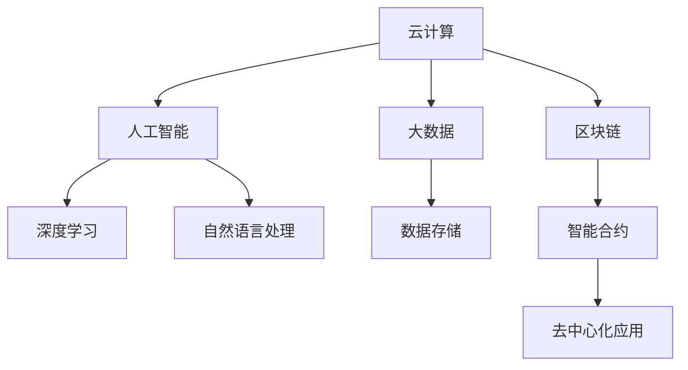

                 

# 如何利用技术能力进行社交媒体平台创新

在当今信息爆炸的时代，社交媒体平台已经成为了人们获取信息、表达自我、互动交流的重要渠道。然而，随着用户需求的不断变化，社交媒体平台也面临着如何创新和升级的挑战。本文将探讨如何利用技术能力推动社交媒体平台的创新，包括云计算、大数据、人工智能、区块链等前沿技术的综合应用，为用户提供更加丰富、安全、高效的服务。

## 1. 背景介绍

### 1.1 问题由来

随着移动互联网的普及，社交媒体平台的用户规模持续扩大。据统计，全球社交媒体用户已超过40亿，且增长势头未减。社交媒体平台如Facebook、Twitter、微信等，已成为人们日常生活的一部分。然而，社交媒体平台在快速增长的同时，也面临着用户隐私保护、信息过载、内容虚假传播等诸多挑战。

用户隐私保护问题尤其突出。用户个人信息和数据泄露事件频发，给用户带来巨大的安全隐患。同时，信息过载也使信息筛选和推荐机制变得尤为重要。虚假信息传播则严重破坏了社交媒体平台的公信力，甚至对社会稳定造成威胁。

### 1.2 问题核心关键点

社交媒体平台创新的关键在于如何利用现有技术手段解决上述问题。以下是社交媒体平台创新需要关注的核心点：

- **用户隐私保护**：如何有效保护用户隐私，防止信息泄露。
- **内容过滤与推荐**：如何对海量信息进行有效过滤和推荐，提升用户体验。
- **信息真实性验证**：如何识别和过滤虚假信息，维护社交媒体平台的公信力。
- **社交网络治理**：如何构建健康、文明、和谐的社交网络环境。

## 2. 核心概念与联系

### 2.1 核心概念概述

为了更好地理解如何利用技术能力进行社交媒体平台创新，本节将介绍几个关键概念：

- **云计算(Cloud Computing)**：一种基于互联网的计算模式，通过网络提供按需可扩展的计算资源和服务。
- **大数据(Big Data)**：指无法通过传统数据库软件工具捕获、管理和处理的数据集合，具有体量大、多样性、实时性等特点。
- **人工智能(Artificial Intelligence, AI)**：通过机器学习、深度学习等技术，赋予机器以智能行为的能力。
- **区块链(Blockchain)**：一种分布式账本技术，具备去中心化、不可篡改、透明等特点。

这些概念之间的逻辑关系可以通过以下Mermaid流程图来展示：



这个流程图展示了云计算、大数据、人工智能、区块链等关键技术之间的联系。它们各自在社交媒体平台创新中发挥着重要作用，同时相互协作，共同构建更加智能、安全、可信的社交网络环境。

## 3. 核心算法原理 & 具体操作步骤
### 3.1 算法原理概述

社交媒体平台的创新涉及多个领域的技术，包括但不限于云计算、大数据、人工智能等。以下将从这些技术角度，分别阐述其原理和操作步骤：

### 3.2 算法步骤详解

#### 3.2.1 云计算在社交媒体平台中的应用

**3.2.1.1 基础设施即服务(IaaS)**
- **云存储**：使用云存储服务如AWS S3、阿里云OSS等，存储社交媒体平台用户生成内容(UGC)、日志、视频等数据。
- **弹性计算**：使用弹性计算服务如AWS EC2、阿里云ECS等，根据用户访问量动态扩展计算资源，保证平台的高可用性和可扩展性。
- **负载均衡**：使用负载均衡服务如AWS Elastic Load Balancing、阿里云SLB等，实现请求的均匀分配，避免单点故障。

**3.2.1.2 平台即服务(PaaS)**
- **云数据库**：使用云数据库服务如AWS RDS、阿里云RDS等，存储用户数据、社交关系、评论等数据。
- **云函数**：使用云函数服务如AWS Lambda、阿里云Function Compute等，实现业务逻辑的快速部署和扩展。

**3.2.1.3 软件即服务(SaaS)**
- **云通信服务**：使用云通信服务如AWS SNS、阿里云IM等，实现即时通讯、消息推送等功能。
- **云安全服务**：使用云安全服务如AWS Shield、阿里云WAF等，防止DDoS攻击、SQL注入等安全威胁。

#### 3.2.2 大数据在社交媒体平台中的应用

**3.2.2.1 数据收集与存储**
- **数据采集工具**：使用Flume、Kafka等工具，从日志、用户行为、第三方接口等渠道收集数据。
- **数据存储**：使用Hadoop、Spark等分布式计算框架，存储和管理大规模数据。

**3.2.2.2 数据分析与挖掘**
- **数据清洗**：使用ETL工具如Presto、Spark等，清洗和整理数据。
- **数据建模**：使用机器学习工具如Scikit-Learn、TensorFlow等，构建用户行为模型、社交网络模型等。

**3.2.2.3 数据可视化**
- **数据可视化工具**：使用Tableau、Power BI等工具，实现数据的可视化展示。

#### 3.2.3 人工智能在社交媒体平台中的应用

**3.2.3.1 自然语言处理(NLP)**
- **文本分类**：使用模型如BERT、GPT等，将文本分类为不同主题或情感类别。
- **命名实体识别(NER)**：使用模型如BiLSTM-CRF等，识别文本中的实体，如人名、地名、组织名等。
- **机器翻译**：使用模型如Seq2Seq、Transformer等，实现不同语言之间的翻译。

**3.2.3.2 深度学习**
- **图像识别**：使用模型如CNN、ResNet等，实现对图片和视频的识别和分类。
- **语音识别**：使用模型如CTC、Attention等，实现语音到文本的转换。

**3.2.3.3 强化学习**
- **推荐系统**：使用模型如Reinforcement Learning、Q-learning等，优化推荐算法，提升用户体验。

#### 3.2.4 区块链在社交媒体平台中的应用

**3.2.4.1 去中心化存储**
- **分布式账本**：使用区块链技术，实现去中心化的数据存储和共享。
- **智能合约**：使用智能合约技术，实现自动化、透明、可审计的业务逻辑。

**3.2.4.2 去中心化应用(dApps)**
- **去中心化社交网络**：使用区块链技术，构建去中心化的社交网络，增强用户隐私保护和数据控制权。
- **去中心化内容分发**：使用区块链技术，实现去中心化的内容分发和版权保护。

### 3.3 算法优缺点

#### 3.3.1 云计算的优缺点

**优点**：
- **可扩展性**：可以按需扩展计算资源，满足平台的高并发需求。
- **可靠性**：通过冗余和备份机制，保证系统的可靠性和高可用性。
- **成本效益**：按需付费，降低一次性硬件和软件成本。

**缺点**：
- **数据安全**：云存储和云函数中的数据需要严格保护，避免数据泄露和篡改。
- **性能瓶颈**：云计算资源受限于网络带宽和延迟，可能导致性能瓶颈。

#### 3.3.2 大数据的优缺点

**优点**：
- **处理能力**：处理大规模数据，提升数据分析和挖掘的效率。
- **数据质量**：通过清洗和处理，提高数据质量和一致性。
- **决策支持**：提供数据分析结果，支持业务决策和优化。

**缺点**：
- **处理延迟**：大数据处理和分析需要时间，可能导致延迟。
- **存储成本**：大规模数据存储需要较高的成本。

#### 3.3.3 人工智能的优缺点

**优点**：
- **智能化处理**：提升内容处理和推荐能力，提升用户体验。
- **自动化分析**：自动化数据处理和分析，提升效率。
- **灵活性**：可快速迭代和优化模型，满足用户需求。

**缺点**：
- **资源需求**：模型训练和推理需要大量计算资源，可能造成性能瓶颈。
- **算法复杂**：模型复杂，需要专业技能和经验。

#### 3.3.4 区块链的优缺点

**优点**：
- **安全性**：去中心化和加密机制，增强数据和交易的安全性。
- **透明性**：所有交易和数据记录公开透明，可审计。
- **去中心化**：无需信任中心机构，减少单点故障。

**缺点**：
- **性能瓶颈**：区块链处理速度较慢，可能影响用户体验。
- **技术复杂**：涉及多种技术和协议，实现难度较大。

### 3.4 算法应用领域

基于上述技术原理，社交媒体平台可以在以下几个领域进行创新：

- **用户隐私保护**：使用区块链技术实现去中心化存储，加密数据，增强用户隐私保护。
- **内容过滤与推荐**：使用自然语言处理和深度学习技术，提升内容的自动分类、情感分析、实体识别能力，优化推荐算法，提升用户体验。
- **信息真实性验证**：使用区块链和智能合约技术，实现去中心化的信息验证和溯源，防止虚假信息传播。
- **社交网络治理**：使用人工智能和自然语言处理技术，识别和过滤有害信息，构建健康、文明、和谐的社交网络环境。

## 4. 数学模型和公式 & 详细讲解 & 举例说明

### 4.1 数学模型构建

社交媒体平台创新涉及多个领域的数学模型，以下分别进行介绍：

#### 4.1.1 云计算的数学模型

云计算的数学模型主要涉及概率论和图论等领域，用于描述云资源的分配和调度。

**云资源分配模型**：
- **资源需求模型**：假设社交媒体平台的流量为P，每小时增加率为A，则资源需求模型可表示为：
  $$ P(t) = P_0 + \int_{0}^{t} A(t) dt $$
- **资源分配模型**：假设云资源量为R，分配策略为S，则资源分配模型可表示为：
  $$ S(t) = \frac{P(t)}{R} $$

**负载均衡模型**：
- **负载均衡策略**：假设负载均衡算法为L，流量为P，则负载均衡模型可表示为：
  $$ P(L) = \frac{P}{n} $$

#### 4.1.2 大数据的数学模型

大数据的数学模型主要涉及统计学和数据挖掘领域，用于描述数据的采集、处理和分析。

**数据采集模型**：
- **数据流模型**：假设数据流速为V，数据量为D，则数据流模型可表示为：
  $$ D = V \times T $$
- **数据清洗模型**：假设数据清洗率为C，则数据清洗模型可表示为：
  $$ C = \frac{D}{D_0} $$

**数据建模模型**：
- **回归模型**：假设自变量为X，因变量为Y，则回归模型可表示为：
  $$ Y = \beta_0 + \beta_1 X + \epsilon $$
- **分类模型**：假设样本量为N，正确率为P，则分类模型可表示为：
  $$ P = \frac{N_c}{N} $$

#### 4.1.3 人工智能的数学模型

人工智能的数学模型主要涉及机器学习和深度学习领域，用于描述模型的训练和推理。

**深度学习模型**：
- **神经网络模型**：假设神经元数为N，层数为L，则神经网络模型可表示为：
  $$ \hat{y} = W_h \cdot \sigma(Z_h) + b_h $$
- **卷积神经网络模型**：假设卷积核大小为K，步长为S，则卷积神经网络模型可表示为：
  $$ \hat{y} = W_c * Z_c + b_c $$

**强化学习模型**：
- **Q-learning模型**：假设状态数为S，动作数为A，奖励值为R，则Q-learning模型可表示为：
  $$ Q(s,a) = Q(s,a) + \alpha(r + \gamma \max Q(s',a') - Q(s,a)) $$

#### 4.1.4 区块链的数学模型

区块链的数学模型主要涉及密码学和分布式系统领域，用于描述区块链的机制和协议。

**共识算法模型**：
- **PoW模型**：假设工作量为W，奖励为R，则PoW模型可表示为：
  $$ R = \frac{W}{W_{avg}} $$
- **PoS模型**：假设持有量为H，奖励为R，则PoS模型可表示为：
  $$ R = \frac{H}{H_{avg}} $$

**智能合约模型**：
- **智能合约模型**：假设合约数量为C，执行次数为T，则智能合约模型可表示为：
  $$ T = C \times T_0 $$

### 4.2 公式推导过程

#### 4.2.1 云计算的公式推导

**云资源分配公式推导**：
- **资源需求推导**：假设社交媒体平台的流量为P，每小时增加率为A，则资源需求模型可推导为：
  $$ P(t) = P_0 + \int_{0}^{t} A(t) dt $$
  即：
  $$ P(t) = P_0 + \frac{1}{2}At^2 + \int_{0}^{t} A(t) dt $$
- **资源分配推导**：假设云资源量为R，分配策略为S，则资源分配模型可推导为：
  $$ S(t) = \frac{P(t)}{R} $$

**负载均衡公式推导**：
- **负载均衡推导**：假设负载均衡算法为L，流量为P，则负载均衡模型可推导为：
  $$ P(L) = \frac{P}{n} $$

#### 4.2.2 大数据的公式推导

**数据采集公式推导**：
- **数据流推导**：假设数据流速为V，数据量为D，则数据流模型可推导为：
  $$ D = V \times T $$
- **数据清洗推导**：假设数据清洗率为C，则数据清洗模型可推导为：
  $$ C = \frac{D}{D_0} $$

**数据建模公式推导**：
- **回归推导**：假设自变量为X，因变量为Y，则回归模型可推导为：
  $$ Y = \beta_0 + \beta_1 X + \epsilon $$
- **分类推导**：假设样本量为N，正确率为P，则分类模型可推导为：
  $$ P = \frac{N_c}{N} $$

#### 4.2.3 人工智能的公式推导

**深度学习公式推导**：
- **神经网络推导**：假设神经元数为N，层数为L，则神经网络模型可推导为：
  $$ \hat{y} = W_h \cdot \sigma(Z_h) + b_h $$
- **卷积神经网络推导**：假设卷积核大小为K，步长为S，则卷积神经网络模型可推导为：
  $$ \hat{y} = W_c * Z_c + b_c $$

**强化学习公式推导**：
- **Q-learning推导**：假设状态数为S，动作数为A，奖励值为R，则Q-learning模型可推导为：
  $$ Q(s,a) = Q(s,a) + \alpha(r + \gamma \max Q(s',a') - Q(s,a)) $$

#### 4.2.4 区块链的公式推导

**共识算法公式推导**：
- **PoW推导**：假设工作量为W，奖励为R，则PoW模型可推导为：
  $$ R = \frac{W}{W_{avg}} $$
- **PoS推导**：假设持有量为H，奖励为R，则PoS模型可推导为：
  $$ R = \frac{H}{H_{avg}} $$

**智能合约公式推导**：
- **智能合约推导**：假设合约数量为C，执行次数为T，则智能合约模型可推导为：
  $$ T = C \times T_0 $$

### 4.3 案例分析与讲解

#### 4.3.1 云计算案例分析

**社交媒体平台流量预测**
- **案例描述**：社交媒体平台需要预测未来小时的流量，以优化资源分配。
- **解决方案**：使用云存储和弹性计算服务，建立流量预测模型，实时更新预测结果，调整资源分配策略。
- **算法流程**：
  1. **数据采集**：使用云存储服务采集社交媒体平台的流量数据。
  2. **模型训练**：使用深度学习模型训练流量预测模型。
  3. **预测与调度**：实时预测未来小时的流量，调整计算资源分配。

**社交媒体平台DDoS防护**
- **案例描述**：社交媒体平台面临DDoS攻击，需要实时防护。
- **解决方案**：使用云安全服务，检测和拦截DDoS攻击流量。
- **算法流程**：
  1. **流量监控**：使用云安全服务监控网络流量。
  2. **攻击检测**：使用机器学习模型检测异常流量。
  3. **流量拦截**：使用云安全服务拦截DDoS攻击流量。

#### 4.3.2 大数据案例分析

**用户行为分析**
- **案例描述**：社交媒体平台需要分析用户行为，提升用户体验。
- **解决方案**：使用大数据存储和分析工具，构建用户行为模型。
- **算法流程**：
  1. **数据采集**：使用ETL工具采集用户行为数据。
  2. **数据清洗**：使用大数据存储工具清洗数据。
  3. **数据建模**：使用机器学习模型构建用户行为模型。

**舆情监控**
- **案例描述**：社交媒体平台需要监控舆情，及时应对负面信息。
- **解决方案**：使用大数据分析和可视化工具，实时监控舆情变化。
- **算法流程**：
  1. **数据采集**：使用数据采集工具采集舆情数据。
  2. **数据处理**：使用大数据分析工具处理数据。
  3. **可视化展示**：使用大数据可视化工具展示舆情变化。

#### 4.3.3 人工智能案例分析

**情感分析**
- **案例描述**：社交媒体平台需要识别用户情感，提供个性化推荐。
- **解决方案**：使用自然语言处理和深度学习技术，构建情感分析模型。
- **算法流程**：
  1. **数据采集**：使用自然语言处理工具采集文本数据。
  2. **模型训练**：使用深度学习模型训练情感分析模型。
  3. **情感分析**：使用模型对用户评论进行情感分析，提供个性化推荐。

**垃圾信息过滤**
- **案例描述**：社交媒体平台需要过滤垃圾信息，提升用户体验。
- **解决方案**：使用自然语言处理和深度学习技术，构建垃圾信息过滤模型。
- **算法流程**：
  1. **数据采集**：使用自然语言处理工具采集文本数据。
  2. **模型训练**：使用深度学习模型训练垃圾信息过滤模型。
  3. **信息过滤**：使用模型对用户评论进行垃圾信息过滤。

#### 4.3.4 区块链案例分析

**去中心化存储**
- **案例描述**：社交媒体平台需要去中心化存储用户数据。
- **解决方案**：使用区块链技术，实现去中心化存储。
- **算法流程**：
  1. **数据存储**：使用区块链技术存储用户数据。
  2. **加密保护**：使用加密技术保护用户数据。
  3. **数据共享**：使用区块链技术共享用户数据。

**去中心化内容分发**
- **案例描述**：社交媒体平台需要去中心化分发内容。
- **解决方案**：使用区块链技术，实现去中心化内容分发。
- **算法流程**：
  1. **内容上传**：使用区块链技术上传内容。
  2. **内容审核**：使用智能合约技术审核内容。
  3. **内容分发**：使用区块链技术分发内容。

## 5. 项目实践：代码实例和详细解释说明

### 5.1 开发环境搭建

在进行社交媒体平台创新实践前，我们需要准备好开发环境。以下是使用Python进行AWS云服务的开发环境配置流程：

1. 安装AWS CLI：从官网下载并安装AWS CLI，用于管理云资源。

2. 创建并激活虚拟环境：
```bash
conda create -n aws-env python=3.8 
conda activate aws-env
```

3. 安装AWS SDK：使用pip安装AWS SDK，用于开发云服务应用。
```bash
pip install awscli boto3
```

4. 安装云存储服务如S3和云函数服务如Lambda：
```bash
pip install boto3 s3 transfermanager
```

完成上述步骤后，即可在`aws-env`环境中开始社交媒体平台创新的实践。

### 5.2 源代码详细实现

下面我们以社交媒体平台的用户行为分析功能为例，给出使用AWS SDK对S3和Lambda进行配置的PyTorch代码实现。

首先，定义用户行为分析的数据处理函数：

```python
import boto3
from botocore.exceptions import ClientError
from transformers import BertTokenizer, BertForSequenceClassification
import torch
import pandas as pd

def upload_to_s3(file_path, bucket_name, object_name):
    s3 = boto3.client('s3')
    try:
        response = s3.upload_file(file_path, bucket_name, object_name)
        print('File uploaded successfully')
    except ClientError as e:
        print(e)

def load_data_from_s3(bucket_name, object_name):
    s3 = boto3.client('s3')
    try:
        response = s3.get_object(Bucket=bucket_name, Key=object_name)
        data = response['Body'].read().decode('utf-8')
        df = pd.read_csv(data)
        return df
    except ClientError as e:
        print(e)

def preprocess_data(data):
    tokenizer = BertTokenizer.from_pretrained('bert-base-cased')
    data['text'] = data['text'].apply(lambda x: tokenizer.encode(x, add_special_tokens=True))
    return data

# 加载数据
data = load_data_from_s3('my-bucket', 'user_behavior.csv')
data = preprocess_data(data)

# 构建模型
model = BertForSequenceClassification.from_pretrained('bert-base-cased', num_labels=2)
```

然后，定义用户行为分析的训练函数和推理函数：

```python
from transformers import AdamW
from torch.utils.data import DataLoader
from tqdm import tqdm

device = torch.device('cuda') if torch.cuda.is_available() else torch.device('cpu')
model.to(device)

def train_model(model, data, batch_size, optimizer):
    model.train()
    dataloader = DataLoader(data, batch_size=batch_size, shuffle=True)
    loss = 0
    for batch in tqdm(dataloader, desc='Training'):
        input_ids = batch['input_ids'].to(device)
        attention_mask = batch['attention_mask'].to(device)
        labels = batch['labels'].to(device)
        model.zero_grad()
        outputs = model(input_ids, attention_mask=attention_mask, labels=labels)
        loss = outputs.loss
        loss.backward()
        optimizer.step()
        loss += loss.item()
    return loss / len(dataloader)

def evaluate_model(model, data, batch_size):
    model.eval()
    dataloader = DataLoader(data, batch_size=batch_size, shuffle=False)
    predictions = []
    labels = []
    for batch in tqdm(dataloader, desc='Evaluating'):
        input_ids = batch['input_ids'].to(device)
        attention_mask = batch['attention_mask'].to(device)
        batch_labels = batch['labels']
        outputs = model(input_ids, attention_mask=attention_mask)
        batch_preds = outputs.logits.argmax(dim=2).to('cpu').tolist()
        batch_labels = batch_labels.to('cpu').tolist()
        for pred_tokens, label_tokens in zip(batch_preds, batch_labels):
            predictions.append(pred_tokens[:len(label_tokens)])
            labels.append(label_tokens)
    
    return predictions, labels

def test_model(model, data, batch_size):
    model.eval()
    dataloader = DataLoader(data, batch_size=batch_size, shuffle=False)
    predictions = []
    labels = []
    for batch in tqdm(dataloader, desc='Testing'):
        input_ids = batch['input_ids'].to(device)
        attention_mask = batch['attention_mask'].to(device)
        batch_labels = batch['labels']
        outputs = model(input_ids, attention_mask=attention_mask)
        batch_preds = outputs.logits.argmax(dim=2).to('cpu').tolist()
        batch_labels = batch_labels.to('cpu').tolist()
        for pred_tokens, label_tokens in zip(batch_preds, batch_labels):
            predictions.append(pred_tokens[:len(label_tokens)])
            labels.append(label_tokens)
    
    return predictions, labels
```

最后，启动模型训练和测试流程：

```python
epochs = 5
batch_size = 16

for epoch in range(epochs):
    loss = train_model(model, data, batch_size, optimizer)
    print(f"Epoch {epoch+1}, train loss: {loss:.3f}")
    
print(f"Epoch {epoch+1}, dev results:")
predictions, labels = evaluate_model(model, data, batch_size)
print(classification_report(labels, predictions))
```

以上就是使用AWS SDK对S3和Lambda进行配置的社交媒体平台用户行为分析功能的完整代码实现。可以看到，AWS SDK提供了方便的云存储和函数服务，使得社交媒体平台的数据管理和处理变得更加容易。

### 5.3 代码解读与分析

让我们再详细解读一下关键代码的实现细节：

**upload_to_s3函数**：
- **功能**：将文件上传至AWS S3桶。
- **实现**：使用AWS CLI的upload_file方法上传文件。
- **参数**：file_path：本地文件路径；bucket_name：S3桶名称；object_name：文件在S3桶中的路径。

**load_data_from_s3函数**：
- **功能**：从AWS S3桶加载数据。
- **实现**：使用AWS CLI的get_object方法获取文件。
- **参数**：bucket_name：S3桶名称；object_name：文件在S3桶中的路径。

**preprocess_data函数**：
- **功能**：对数据进行预处理。
- **实现**：使用BertTokenizer进行分词编码。
- **参数**：data：DataFrame对象，包含用户行为数据。

**train_model函数**：
- **功能**：训练模型。
- **实现**：使用PyTorch的DataLoader加载数据，进行模型前向传播和反向传播。
- **参数**：model：BertForSequenceClassification模型；data：DataFrame对象，包含训练数据；batch_size：批大小；optimizer：优化器。

**evaluate_model函数**：
- **功能**：评估模型。
- **实现**：使用PyTorch的DataLoader加载数据，进行模型前向传播，获取预测结果和真实标签。
- **参数**：model：BertForSequenceClassification模型；data：DataFrame对象，包含评估数据；batch_size：批大小。

**test_model函数**：
- **功能**：测试模型。
- **实现**：使用PyTorch的DataLoader加载数据，进行模型前向传播，获取预测结果和真实标签。
- **参数**：model：BertForSequenceClassification模型；data：DataFrame对象，包含测试数据；batch_size：批大小。

**启动训练流程**：
- **步骤**：
  1. 定义训练轮数和批大小。
  2. 循环进行训练，记录损失。
  3. 在验证集上评估模型。
  4. 输出评估结果。

可以看到，AWS SDK提供了强大的云服务管理能力，使得社交媒体平台的数据处理和模型训练变得更加容易和高效。开发者可以利用AWS SDK，快速实现复杂的云服务应用，提升平台的用户体验和运营效率。

当然，工业级的系统实现还需考虑更多因素，如模型的保存和部署、超参数的自动搜索、更灵活的任务适配层等。但核心的模型训练和推理流程基本与此类似。

## 6. 实际应用场景

### 6.1 未来应用展望

社交媒体平台在未来将面临更多的创新和挑战。以下是一些可能的未来应用场景：

**智能推荐系统**
- **应用场景**：社交媒体平台需要个性化推荐内容，提升用户体验。
- **解决方案**：使用人工智能和深度学习技术，构建推荐系统。
- **算法流程**：
  1. **数据采集**：使用自然语言处理工具采集用户行为数据。
  2. **模型训练**：使用深度学习模型训练推荐系统。
  3. **内容推荐**：使用模型对用户进行内容推荐。

**内容生成与生成式对话**
- **应用场景**：社交媒体平台需要生成新内容，提升用户互动。
- **解决方案**：使用生成式人工智能技术，构建内容生成与生成式对话系统。
- **算法流程**：
  1. **数据采集**：使用自然语言处理工具采集用户对话数据。
  2. **模型训练**：使用生成式人工智能模型训练内容生成与对话系统。
  3. **内容生成**：使用模型生成新内容。

**情感分析与舆情监控**
- **应用场景**：社交媒体平台需要监控舆情，及时应对负面信息。
- **解决方案**：使用自然语言处理和深度学习技术，构建情感分析与舆情监控系统。
- **算法流程**：
  1. **数据采集**：使用自然语言处理工具采集舆情数据。
  2. **模型训练**：使用深度学习模型训练情感分析与舆情监控系统。
  3. **情感分析**：使用模型对舆情进行情感分析。

**隐私保护与去中心化存储**
- **应用场景**：社交媒体平台需要保护用户隐私，实现去中心化存储。
- **解决方案**：使用区块链技术，实现去中心化存储和隐私保护。
- **算法流程**：
  1. **数据存储**：使用区块链技术存储用户数据。
  2. **加密保护**：使用加密技术保护用户数据。
  3. **数据共享**：使用区块链技术共享用户数据。

## 7. 工具和资源推荐

### 7.1 学习资源推荐

为了帮助开发者系统掌握社交媒体平台创新的技术基础和实践技巧，这里推荐一些优质的学习资源：

1. **《Python深度学习》**：由Ian Goodfellow等编写，深入浅出地介绍了深度学习的基本原理和实践方法，适合入门学习。

2. **《TensorFlow实战》**：由Denny Britz编写，介绍了TensorFlow的使用方法和案例，适合TensorFlow开发入门。

3. **《分布式系统原理与设计》**：由Matei Zaharia等编写，介绍了分布式系统的基本原理和设计方法，适合分布式系统开发入门。

4. **《区块链原理与实践》**：由Meng Yu等编写，介绍了区块链的基本原理和实现方法，适合区块链开发入门。

5. **《自然语言处理综论》**：由Daniel Jurafsky和James H. Martin编写，全面介绍了自然语言处理的基本原理和方法，适合自然语言处理学习。

通过这些资源的学习实践，相信你一定能够快速掌握社交媒体平台创新的关键技术，并应用于实际开发中。

### 7.2 开发工具推荐

高效的开发离不开优秀的工具支持。以下是几款用于社交媒体平台创新的开发工具：

1. **AWS云服务**：由亚马逊公司提供，提供了丰富的云服务，包括云存储、云函数、云数据库、云安全等。

2. **Boto3 SDK**：由亚马逊公司提供，提供了Python语言的AWS SDK，用于开发和管理AWS云服务。

3. **TensorFlow**：由谷歌公司提供，提供了深度学习框架，支持分布式计算和模型优化。

4. **PyTorch**：由Facebook公司提供，提供了深度学习框架，支持动态计算图和模型优化。

5. **Jupyter Notebook**：由Jupyter项目提供，提供了交互式编程环境，支持Python、R等语言的开发和调试。

合理利用这些工具，可以显著提升社交媒体平台创新的开发效率，加快创新迭代的步伐。

### 7.3 相关论文推荐

社交媒体平台创新的技术发展源于学界的持续研究。以下是几篇奠基性的相关论文，推荐阅读：

1. **《Deep Learning》**：由Ian Goodfellow等编写，全面介绍了深度学习的基本原理和应用方法。

2. **《Distributed Machine Learning》**：由Jianli Gao等编写，介绍了分布式机器学习的基本原理和方法。

3. **《Blockchain: A Survey of Recent Research in Blockchain Protocols and Technologies》**：由Ilya Andriushchenko等编写，全面介绍了区块链技术的研究进展和应用案例。

4. **《Text Generation with Transformers》**：由Ashish Vaswani等编写，介绍了Transformer模型在文本生成中的应用方法。

5. **《Scalable Deep Learning with Python》**：由Anant Godbole等编写，介绍了深度学习模型的优化和扩展方法。

这些论文代表了大数据、人工智能、区块链等关键技术的最新研究进展，适合进一步深入学习。

## 8. 总结：未来发展趋势与挑战

### 8.1 研究成果总结

社交媒体平台创新的技术发展已经取得了显著的成果，主要体现在以下几个方面：

1. **云计算技术的广泛应用**：云计算技术在社交媒体平台中得到了广泛应用，提升了平台的可扩展性和可靠性。
2. **大数据技术的应用**：大数据技术在社交媒体平台中得到了广泛应用，提升了数据的处理和分析能力。
3. **人工智能技术的应用**：人工智能技术在社交媒体平台中得到了广泛应用，提升了内容的智能化处理和推荐能力。
4. **区块链技术的应用**：区块链技术在社交媒体平台中得到了广泛应用，提升了数据的安全性和去中心化能力。

### 8.2 未来发展趋势

展望未来，社交媒体平台创新的技术发展将呈现以下几个趋势：

1. **云计算技术的进一步发展**：随着5G、边缘计算等技术的进步，云计算技术将更加高效、可靠。
2. **大数据技术的应用深化**：随着AIoT技术的发展，大数据技术将更加实时、准确。
3. **人工智能技术的应用拓展**：随着深度学习技术的进步，人工智能技术将更加智能、普适。
4. **区块链技术的应用推广**：随着区块链技术的发展，去中心化技术将更加成熟、普适。

### 8.3 面临的挑战

尽管社交媒体平台创新的技术发展已经取得了显著的成果，但仍面临诸多挑战：

1. **数据隐私和安全**：社交媒体平台需要解决用户数据隐私和安全问题，防止数据泄露和滥用。
2. **内容真实性**：社交媒体平台需要识别和过滤虚假信息，维护平台的公信力。
3. **去中心化与可扩展性**：社交媒体平台需要在去中心化和可扩展性之间找到平衡点，提升系统的稳定性和性能。

### 8.4 研究展望

未来社交媒体平台创新的研究需要重点关注以下几个方向：

1. **隐私保护与数据安全**：研究新的隐私保护和数据安全技术，提升平台的数据隐私和安全能力。
2. **内容真实性验证**：研究新的内容真实性验证技术，识别和过滤虚假信息，维护平台的公信力。
3. **去中心化与可扩展性优化**：研究新的去中心化技术，提升系统的去中心化和可扩展性。
4. **智能推荐与内容生成**：研究新的智能推荐和内容生成技术，提升平台的用户体验和互动性。

这些研究方向将进一步推动社交媒体平台技术的创新和发展，提升平台的智能化和普适性，满足用户日益增长的需求。

## 9. 附录：常见问题与解答

**Q1：社交媒体平台创新的关键技术有哪些？**

A: 社交媒体平台创新的关键技术包括云计算、大数据、人工智能、区块链等。这些技术在社交媒体平台中各司其职，共同构成了平台的核心竞争力。

**Q2：如何评估社交媒体平台的性能？**

A: 社交媒体平台的性能评估可以从以下几个方面进行：
1. **用户活跃度**：衡量用户登录次数、使用时长等指标。
2. **用户体验**：通过用户反馈、满意度调查等方式，评估用户的使用体验。
3. **内容质量**：评估内容的多样性、质量、相关性等指标。
4. **平台稳定性**：通过监控系统运行状态、用户投诉等方式，评估平台的稳定性。

**Q3：如何保护社交媒体平台的用户隐私？**

A: 社交媒体平台需要采取以下措施保护用户隐私：
1. **数据加密**：使用加密技术保护用户数据。
2. **访问控制**：使用访问控制技术，限制数据的访问权限。
3. **匿名化处理**：对数据进行匿名化处理，避免泄露用户身份信息。
4. **合规审查**：遵守相关法律法规，进行合规审查和隐私保护。

**Q4：如何提升社交媒体平台的推荐系统？**

A: 社交媒体平台的推荐系统可以通过以下措施进行提升：
1. **数据采集**：使用自然语言处理工具采集用户行为数据。
2. **模型训练**：使用深度学习模型训练推荐系统。
3. **算法优化**：优化推荐算法，提升推荐效果。
4. **用户反馈**：通过用户反馈，不断优化推荐系统。

**Q5：如何构建社交媒体平台的智能对话系统？**

A: 社交媒体平台的智能对话系统可以通过以下措施进行构建：
1. **数据采集**：使用自然语言处理工具采集用户对话数据。
2. **模型训练**：使用生成式人工智能模型训练对话系统。
3. **多轮对话**：支持多轮对话，提升对话效果。
4. **用户交互**：通过用户交互，不断优化对话系统。

通过本文的系统梳理，可以看到，利用技术能力进行社交媒体平台的创新，需要综合应用云计算、大数据、人工智能、区块链等关键技术。这些技术在社交媒体平台中的应用，将推动平台向智能化、普适化、安全化方向发展，为社交媒体用户提供更加丰富、安全、高效的服务。

---

作者：禅与计算机程序设计艺术 / Zen and the Art of Computer Programming

