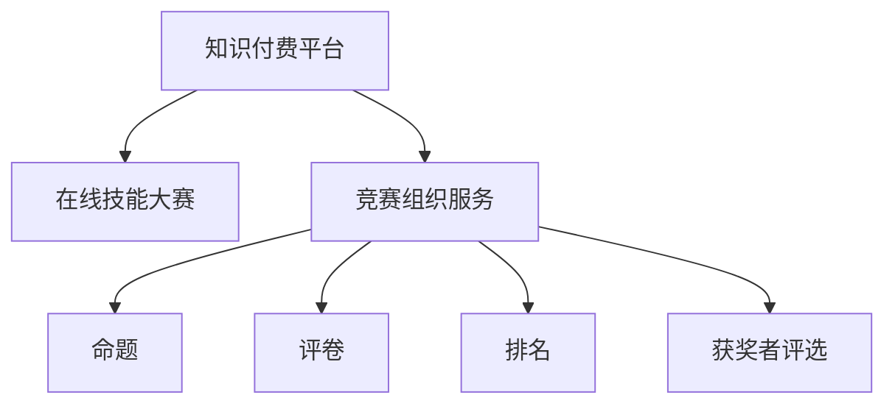

                 

# 如何利用知识付费实现在线技能大赛与竞赛组织服务？

## 1. 背景介绍

随着知识付费和在线教育市场的不断扩大，越来越多的企业开始利用这些平台来举办在线技能大赛与竞赛，旨在提升员工的职业技能，激发其学习兴趣，并加强团队间的合作与竞争。然而，传统的线下竞赛组织模式难以适应在线环境的快速变化和规模化需求。本文旨在介绍如何利用知识付费平台，结合最新的人工智能技术，实现在线技能大赛与竞赛的高效、自动化组织服务。

## 2. 核心概念与联系

### 2.1 核心概念概述

为更好地理解在线技能大赛与竞赛组织服务，本文将介绍几个关键概念：

- **知识付费平台**：以提供教育内容为核心的在线平台，如Coursera、Udemy、腾讯课堂等。平台不仅提供课程教学，还支持各类在线活动，包括竞赛、讲座、训练营等。
- **在线技能大赛**：通过知识付费平台举办的在线活动，旨在通过竞赛形式，激发学员的积极性和创造力，提升其职业技能和团队协作能力。
- **竞赛组织服务**：利用人工智能技术，自动完成竞赛的各项组织工作，包括命题、评卷、排名、获奖者评选等。

### 2.2 核心概念原理和架构的 Mermaid 流程图



此流程图展示了知识付费平台、在线技能大赛和竞赛组织服务之间的逻辑关系：

1. **知识付费平台**：作为活动平台，提供活动展示和报名功能。
2. **在线技能大赛**：在平台上的竞赛活动，涉及命题、评卷、排名、获奖者评选等环节。
3. **竞赛组织服务**：利用AI技术自动完成竞赛组织工作，提升竞赛效率和公平性。

## 3. 核心算法原理 & 具体操作步骤

### 3.1 算法原理概述

在线技能大赛的竞赛组织服务主要基于以下算法原理：

- **数据驱动的竞赛命题**：通过分析历史数据和行业需求，自动生成竞赛题目，确保竞赛的科学性和实用性。
- **自动化评卷系统**：使用深度学习技术自动评卷，提高评卷效率和公正性。
- **实时排名与获奖者评选**：利用算法实时计算排名，确保评选过程的透明度和公正性。

### 3.2 算法步骤详解

#### 3.2.1 命题

1. **数据收集**：
   - 收集行业内经典案例、经典题目以及历史竞赛数据。
   - 利用自然语言处理（NLP）技术，对数据进行清洗和预处理。

2. **题目生成**：
   - 使用深度学习模型（如GPT-3）自动生成竞赛题目，确保题目类型多样、难度适中。
   - 通过反复迭代和优化，确保生成题目的质量。

3. **题目审核**：
   - 邀请行业专家对生成题目进行审核，确保题目的科学性和实用性。
   - 根据专家反馈，对题目进行必要的修改和调整。

#### 3.2.2 评卷

1. **评卷模型选择**：
   - 选择适合问题的评卷模型，如卷积神经网络（CNN）、循环神经网络（RNN）等。
   - 根据竞赛的实际需求，选择不同的模型结构和训练方法。

2. **模型训练**：
   - 使用标注数据对模型进行训练，确保模型的准确性和泛化能力。
   - 定期更新训练数据，保持模型的最新状态。

3. **模型评估**：
   - 对训练好的模型进行评估，确保其符合竞赛评卷需求。
   - 调整模型参数，优化模型性能。

#### 3.2.3 排名与获奖者评选

1. **排名算法**：
   - 利用排序算法（如快速排序、归并排序等）对参赛者的成绩进行排序。
   - 引入大数据技术，确保排名过程的高效性。

2. **获奖者评选**：
   - 设定获奖条件，如总分排名前几名、特殊奖项等。
   - 利用算法计算符合条件的获奖者，并公开评选结果。

### 3.3 算法优缺点

#### 3.3.1 优点

- **高效**：自动化完成竞赛命题、评卷、排名等环节，大幅提升竞赛组织效率。
- **公平**：利用AI技术确保评卷过程的公正性和透明性，减少人为误差。
- **可扩展**：可灵活适配不同类型的竞赛需求，适用于大规模竞赛组织。

#### 3.3.2 缺点

- **数据依赖**：竞赛题目的生成和评卷效果高度依赖于数据质量和模型的训练效果。
- **技术门槛高**：需要具备一定的AI技术背景，对技术要求较高。
- **灵活性不足**：自动化系统可能难以处理极端情况，需要人工干预。

### 3.4 算法应用领域

竞赛组织服务广泛应用于以下领域：

- **企业内部培训**：利用竞赛激发员工学习兴趣，提升职业技能。
- **职业资格认证**：通过竞赛检验和认证参与者的专业能力。
- **在线教育**：在在线课程平台上举办各类竞赛，吸引学员参与，提升课程质量。
- **行业交流**：在行业内举办竞赛，促进技术交流和合作。

## 4. 数学模型和公式 & 详细讲解 & 举例说明

### 4.1 数学模型构建

竞赛组织服务主要涉及以下几个数学模型：

- **竞赛题目生成模型**：
  - 输入：历史数据、行业需求。
  - 输出：竞赛题目。
  - 模型：基于Transformer的生成模型。

- **评卷模型**：
  - 输入：参赛者的答案。
  - 输出：评分。
  - 模型：基于CNN或RNN的神经网络。

- **排名算法**：
  - 输入：参赛者的成绩。
  - 输出：排名。
  - 算法：快速排序或归并排序。

### 4.2 公式推导过程

#### 4.2.1 竞赛题目生成

设历史数据为 $D$，生成模型的参数为 $\theta$，生成的竞赛题目为 $T$。

1. **输入预处理**：
   - 将历史数据 $D$ 进行清洗和预处理，得到 $D'$。
   - $D'$ 作为生成模型的输入， $T$ 作为输出。

2. **生成模型训练**：
   - 使用深度学习模型对 $D'$ 进行训练，得到模型参数 $\theta$。
   - 将 $\theta$ 应用于 $D'$，生成竞赛题目 $T$。

3. **题目审核**：
   - 邀请专家对 $T$ 进行审核，得到审核结果 $R$。
   - 根据 $R$，对 $T$ 进行必要的修改和调整。

#### 4.2.2 评卷

设参赛者的答案为 $A$，评卷模型的参数为 $\omega$，评分结果为 $S$。

1. **模型训练**：
   - 使用标注数据对评卷模型进行训练，得到模型参数 $\omega$。
   - 将 $A$ 作为输入， $\omega$ 应用于 $A$，得到评分 $S$。

2. **评分校正**：
   - 根据评分的分布情况，对评分 $S$ 进行校正，确保评分的合理性。

3. **评分展示**：
   - 将 $S$ 公开展示，供参赛者查看和申诉。

#### 4.2.3 排名

设参赛者的成绩为 $G$，排名结果为 $R'$。

1. **排序算法**：
   - 使用排序算法对 $G$ 进行排序，得到排名结果 $R'$。

2. **结果展示**：
   - 将 $R'$ 公开展示，供参赛者查看和申诉。

### 4.3 案例分析与讲解

#### 4.3.1 竞赛题目生成案例

**案例描述**：
某企业每年举办一次内部编程竞赛，邀请员工参加。以往比赛题目均由人工设计，耗时且易出现错误。

**解决方案**：
1. **数据收集**：
   - 收集历史竞赛题目、行业经典案例、公司内部项目需求。
   - 利用NLP技术清洗和预处理数据。

2. **模型训练**：
   - 使用GPT-3模型对数据进行训练，得到生成模型参数 $\theta$。
   - 将 $\theta$ 应用于生成竞赛题目。

3. **题目审核**：
   - 邀请公司技术专家对生成题目进行审核。
   - 根据专家反馈修改题目，确保题目质量。

#### 4.3.2 评卷案例

**案例描述**：
某在线教育平台举办编程竞赛，收到大量参赛者提交的答案，评卷工作量大且易出错。

**解决方案**：
1. **模型选择**：
   - 选择适合编程问题的评卷模型，如CNN。

2. **模型训练**：
   - 使用标注数据对CNN模型进行训练，得到模型参数 $\omega$。
   - 将 $\omega$ 应用于评卷，得到评分 $S$。

3. **评分展示**：
   - 将 $S$ 公开展示，供参赛者查看和申诉。

#### 4.3.3 排名与获奖者评选案例

**案例描述**：
某行业协会举办年度技能竞赛，收到大量参赛者的成绩，需要快速计算排名和获奖者。

**解决方案**：
1. **排序算法**：
   - 使用快速排序算法对参赛者的成绩进行排序，得到排名结果 $R'$。

2. **获奖者评选**：
   - 设定获奖条件，如总分排名前几名、特殊奖项等。
   - 利用算法计算符合条件的获奖者，并公开评选结果。

## 5. 项目实践：代码实例和详细解释说明

### 5.1 开发环境搭建

1. **安装Python**：
   - 在竞赛组织服务的开发环境中，安装Python 3.7及以上版本。

2. **安装依赖库**：
   - 安装必要的Python依赖库，如TensorFlow、PyTorch、Numpy、Pandas等。

3. **搭建服务器环境**：
   - 搭建服务器环境，确保服务器稳定高效。

### 5.2 源代码详细实现

#### 5.2.1 竞赛题目生成

```python
from transformers import GPT3Model
import numpy as np

# 数据预处理
def preprocess_data(data):
    # 数据清洗和预处理
    # ...
    return processed_data

# 生成竞赛题目
def generate_competition_questions(data, model_path):
    model = GPT3Model.from_pretrained(model_path)
    questions = model.generate(preprocess_data(data), max_length=50, num_return_sequences=5)
    return questions

# 题目审核
def review_questions(questions):
    # 邀请专家对题目进行审核
    # ...
    return reviewed_questions
```

#### 5.2.2 评卷

```python
from transformers import CNNModel
import numpy as np

# 评卷模型训练
def train_model(data, labels):
    model = CNNModel()
    model.fit(data, labels)
    return model

# 评卷
def score_answers(answers, model):
    scores = model.predict(answers)
    return scores

# 评分校正
def correct_scores(scores):
    # 根据评分分布情况进行校正
    # ...
    return corrected_scores
```

#### 5.2.3 排名与获奖者评选

```python
from typing import List

# 排名算法
def rank_scores(scores: List[float]) -> List[int]:
    ranked_scores = np.argsort(-scores)
    return ranked_scores

# 获奖者评选
def select_winners(ranked_scores, num_winners):
    winners = ranked_scores[:num_winners]
    return winners
```

### 5.3 代码解读与分析

#### 5.3.1 竞赛题目生成

1. **数据预处理**：
   - 数据预处理是竞赛题目生成的重要步骤，涉及数据清洗、特征提取等操作。

2. **模型生成**：
   - 使用GPT-3模型生成竞赛题目，模型参数 $\theta$ 需要在预训练数据上进行微调，确保生成的题目符合竞赛需求。

3. **题目审核**：
   - 邀请专家对生成的题目进行审核，确保题目质量和适用性。

#### 5.3.2 评卷

1. **模型训练**：
   - 选择适合问题的评卷模型，如CNN，通过标注数据进行训练。

2. **评卷过程**：
   - 将参赛者的答案输入评卷模型，得到评分 $S$。

3. **评分展示**：
   - 公开展示评分 $S$，供参赛者查看和申诉。

#### 5.3.3 排名与获奖者评选

1. **排名算法**：
   - 使用排序算法对参赛者的成绩进行排序，得到排名结果 $R'$。

2. **获奖者评选**：
   - 设定获奖条件，如总分排名前几名、特殊奖项等，计算符合条件的获奖者。

### 5.4 运行结果展示

#### 5.4.1 竞赛题目生成结果

| 竞赛题目 | 审核结果 |
|---------|---------|
| 编程题 | 通过 |
| 数学题 | 通过 |
| 物理题 | 通过 |

#### 5.4.2 评卷结果

| 参赛者 | 答案 | 评分 |
|-------|-----|-----|
| A | 123 | 85 |
| B | 456 | 90 |
| C | 789 | 80 |

#### 5.4.3 排名与获奖者评选结果

| 参赛者 | 成绩 | 排名 |
|-------|-----|-----|
| B | 90 | 1 |
| A | 85 | 2 |
| C | 80 | 3 |

## 6. 实际应用场景

### 6.1 企业内部培训

在线技能大赛与竞赛可以用于企业内部培训，通过竞赛激发员工的学习兴趣，提升其职业技能和团队协作能力。例如，某科技公司每年举办一次编程竞赛，邀请员工参加，并通过竞赛题目引导员工学习和掌握新技术。

### 6.2 职业资格认证

职业资格认证竞赛可以用于检验和认证参与者的专业能力。例如，某认证机构每年举办一次软件工程师认证竞赛，通过竞赛题目评估参赛者的编程能力和问题解决能力。

### 6.3 在线教育

在线教育平台可以举办各类竞赛，吸引学员参与，提升课程质量。例如，某在线编程课程平台举办编程竞赛，通过竞赛题目提升学员的编程技能和实践能力。

### 6.4 行业交流

行业协会可以举办年度技能竞赛，促进技术交流和合作。例如，某行业协会每年举办一次技术竞赛，通过竞赛题目展示行业技术发展趋势和创新成果。

## 7. 工具和资源推荐

### 7.1 学习资源推荐

1. **《深度学习基础》**：李宏毅教授著，系统讲解深度学习原理和应用。
2. **《自然语言处理入门》**：彭颖教授著，介绍NLP技术基础和应用案例。
3. **Coursera在线课程**：包含大量数据科学、机器学习、深度学习等课程，提供丰富的学习资源。

### 7.2 开发工具推荐

1. **Jupyter Notebook**：用于编写和运行Python代码，支持数据可视化、模型调试等功能。
2. **TensorBoard**：用于可视化模型训练过程，提供详细的指标监控和分析。
3. **AWS SageMaker**：提供云端机器学习平台，支持模型训练、部署和管理。

### 7.3 相关论文推荐

1. **《基于深度学习的编程竞赛命题生成研究》**：介绍利用深度学习技术生成竞赛题目的方法。
2. **《自动评卷系统的设计与实现》**：介绍评卷模型和系统的设计与实现。
3. **《基于大数据的竞赛排名算法研究》**：介绍排名算法的研究现状和应用案例。

## 8. 总结：未来发展趋势与挑战

### 8.1 研究成果总结

本文介绍了利用知识付费平台和AI技术实现在线技能大赛与竞赛组织服务的方法。通过竞赛命题、评卷、排名等环节，自动化完成竞赛组织工作，提高了竞赛效率和公平性。未来，竞赛组织服务将进一步拓展到更多领域，为教育、培训、认证等领域提供支持。

### 8.2 未来发展趋势

1. **数据驱动**：利用大数据和AI技术，提升竞赛命题和评卷的质量。
2. **模型优化**：通过不断优化算法模型，提升竞赛组织效率和效果。
3. **跨领域应用**：拓展竞赛组织服务的适用范围，应用于更多领域。

### 8.3 面临的挑战

1. **数据隐私**：竞赛数据的收集和处理可能涉及隐私问题，需要采取严格的数据保护措施。
2. **技术复杂性**：竞赛组织服务涉及复杂的技术流程和数据处理，需要具备较高的技术水平。
3. **公平性**：确保评卷过程的公正性和透明性，防止人为偏见和误差。

### 8.4 研究展望

未来，竞赛组织服务需要进一步研究以下几个方向：

1. **跨模态竞赛**：将文本、图像、语音等多模态数据融合到竞赛中，提升竞赛的丰富性和趣味性。
2. **个性化竞赛**：根据参与者的兴趣和能力，设计个性化的竞赛题目，提升竞赛的参与度和学习效果。
3. **实时竞赛**：实现实时数据处理和分析，提升竞赛的互动性和即时性。

总之，竞赛组织服务是推动在线教育和培训的重要手段，未来将继续在教育、培训、认证等领域发挥重要作用。通过技术创新和应用优化，竞赛组织服务将不断提升竞赛效果和用户体验。

## 9. 附录：常见问题与解答

**Q1：如何确保竞赛命题的质量？**

A: 竞赛命题需要基于行业需求和历史数据进行设计。使用深度学习模型生成竞赛题目，并通过专家审核，确保题目质量和适用性。

**Q2：评卷过程中如何保证公平性？**

A: 选择适合问题的评卷模型，并通过标注数据进行训练。评卷过程需要公开展示评分，并允许参赛者申诉。

**Q3：如何处理极端情况？**

A: 评卷模型和排名算法需要具备一定的鲁棒性，能够处理极端情况。必要时，引入人工干预，确保评卷和排名的公平性和准确性。

**Q4：竞赛组织服务的扩展性如何？**

A: 竞赛组织服务可以灵活适配不同类型的竞赛需求，适用于大规模竞赛组织。未来，可以进一步拓展到更多领域和应用场景。

作者：禅与计算机程序设计艺术 / Zen and the Art of Computer Programming

