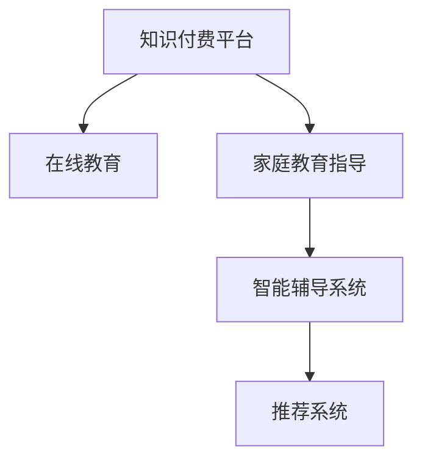

                 

# 如何利用知识付费实现在线教育与家庭教育指导？

> 关键词：知识付费,在线教育,家庭教育,智能辅导,个性化推荐

## 1. 背景介绍

### 1.1 问题由来
知识付费的兴起，是信息时代互联网技术和经济发展双重因素的产物。在线教育和家庭教育指导的蓬勃发展，则为知识付费带来了广阔的市场空间。为了更好地适应这一趋势，利用知识付费平台进行个性化教育服务的探索与实践，成为了众多教育机构和IT企业关注的焦点。

### 1.2 问题核心关键点
知识付费的关键在于如何实现优质内容的精准匹配和个性化推荐。在线教育与家庭教育指导的核心在于提升学习效率，个性化指导学习进程。因此，在知识付费平台基础上，通过数据分析和算法优化，实现针对学生的个性化教育方案，成为技术突破的要点。

## 2. 核心概念与联系

### 2.1 核心概念概述

为更好地理解本文内容，本节将介绍几个核心概念：

- **知识付费**：消费者为获得专业性、深入性、系统性的知识内容而付费，通过在线平台进行学习和消费。知识付费平台汇集了众多专家学者、行业大咖的原创内容，用户可以通过付费获取其专知。

- **在线教育**：利用互联网技术进行教学和学习的过程，包括视频课程、互动讨论、实时答疑等形式，打破了时间和空间的限制，使得教育更加灵活和普惠。

- **家庭教育指导**：面向家庭用户提供的家庭教育方案和指导，如家庭教育规划、儿童心理学、亲子沟通技巧等。通过知识付费平台，获取专业家庭教育指导，有助于提升家庭教育质量。

- **智能辅导系统**：利用人工智能技术进行个性化学习辅导的系统，根据学生的学习情况和进度，智能推荐适合的学习内容、学习方法和学习路径。

- **推荐系统**：通过数据分析和机器学习算法，为用户推荐最相关、最有价值的知识内容，提升用户体验和满意度。

### 2.2 核心概念原理和架构的 Mermaid 流程图



这个流程图展示了几大核心概念之间的联系：

- 知识付费平台是各类教育服务的承载体，汇聚了优质的在线教育和家庭教育内容。
- 在线教育依托平台，提供灵活多样的课程内容。
- 家庭教育指导服务通过平台，为用户定制个性化的家庭教育方案。
- 智能辅导系统基于数据分析，为用户提供个性化学习路径。
- 推荐系统通过用户行为分析，提升教育内容的个性化推荐效果。

## 3. 核心算法原理 & 具体操作步骤
### 3.1 算法原理概述

利用知识付费平台进行在线教育与家庭教育指导，本质上是一个基于用户行为的个性化推荐和智能辅导过程。其核心思想是：通过大数据分析和机器学习算法，对用户的学习习惯、知识需求、心理特征等进行分析，推荐最合适的学习内容和家教方案，实现高效、个性化的教育服务。

形式化地，假设知识付费平台的数据集为 $D=\{(x_i,y_i)\}_{i=1}^N$，其中 $x_i$ 为用户的学习行为数据，$y_i$ 为对应的学习内容和家教方案。目标是构建一个推荐模型 $f: D \rightarrow C$，其中 $C$ 为推荐内容的集合，使得 $f(x_i)$ 与用户需求 $y_i$ 尽可能接近。

通过梯度下降等优化算法，推荐模型的训练过程不断更新模型参数 $\theta$，最小化损失函数 $\mathcal{L}$，使得推荐内容 $f(x_i)$ 逼近用户需求 $y_i$。由于 $\theta$ 已经通过平台积累的数据获得了较好的初始化，因此即便在少量标注样本上进行微调，也能较快收敛到理想的用户需求表示。

### 3.2 算法步骤详解

利用知识付费平台进行在线教育与家庭教育指导，通常包括以下几个关键步骤：

**Step 1: 准备数据和模型**

- 收集和清洗用户的学习行为数据和反馈数据，如学习时长、观看次数、评价分数等。
- 构建用户知识需求和家教需求的标签集，方便模型进行分类和推荐。
- 选择合适的推荐算法，如协同过滤、基于内容的推荐、混合推荐等，并设计好模型结构。

**Step 2: 特征工程和模型训练**

- 对用户行为数据进行特征提取和工程设计，如用户历史行为、时间特征、内容特征等。
- 设计损失函数和优化器，定义模型训练的目标和算法。
- 在训练集上迭代训练模型，通过交叉验证等手段不断调整模型参数。

**Step 3: 实时推荐和反馈迭代**

- 在测试集上评估模型推荐效果，如准确率、召回率、F1值等。
- 在实际应用中，根据实时用户反馈数据，对模型进行迭代优化。
- 实时获取用户学习行为数据，重新训练模型，提供动态更新的推荐内容。

**Step 4: 智能辅导系统集成**

- 集成智能辅导系统，根据用户的学习进度和效果，动态调整学习计划。
- 通过自然语言处理技术，解答用户问题，提供实时答疑服务。
- 利用知识图谱和专家系统，为家庭教育提供专业指导和建议。

### 3.3 算法优缺点

基于知识付费平台进行在线教育与家庭教育指导的推荐系统，具有以下优点：

1. **精准匹配**：通过用户行为数据和偏好分析，能够实现更精准的内容和家教推荐，提升学习效果。
2. **灵活性高**：平台提供的教育服务不受时间和空间的限制，用户可随时获取所需内容。
3. **个性化强**：根据用户个性化需求，量身定制学习方案和家教指导，提高学习动力。
4. **可扩展性**：随着数据的积累和算法的迭代，推荐效果可以持续提升，服务范围不断扩大。

同时，该方法也存在一些局限性：

1. **数据隐私**：用户行为数据的隐私保护，需要严格遵守法律法规，保证数据安全。
2. **算法复杂性**：推荐系统设计复杂，需要融合多种算法和技术，实现高性能、高可靠性的推荐。
3. **内容质量**：平台上的教育内容质量参差不齐，部分内容可能不符合用户需求。
4. **技术门槛高**：推荐系统的开发和维护需要较高的技术水平，对技术和资源投入较大。

尽管存在这些局限性，但知识付费平台在个性化教育和家庭教育指导领域的应用前景仍然广阔。通过不断的技术优化和创新，相信能够克服现有问题，进一步提升服务质量和用户体验。

### 3.4 算法应用领域

知识付费平台上的在线教育与家庭教育指导推荐系统，已在多个领域得到广泛应用，包括但不限于：

- **中小学在线教育**：利用平台提供的丰富教育资源，支持中小学在线学习。
- **高等教育自学**：为大学生提供课程推荐、论文指导、职业规划等服务。
- **职业培训**：为在职人士提供技能提升、认证培训、职场发展指导。
- **家庭教育**：为家长提供亲子沟通技巧、儿童心理辅导、学习习惯养成指导。
- **语言学习**：提供多种语言学习课程和家教服务，帮助用户掌握新语言。

此外，知识付费平台还扩展到企业培训、科普教育、艺术修养等多个领域，为不同年龄段和职业背景的用户提供多样化的学习和发展路径。

## 4. 数学模型和公式 & 详细讲解 & 举例说明

### 4.1 数学模型构建

本节将使用数学语言对推荐系统进行更严格的刻画。

记用户行为数据为 $x \in \mathbb{R}^d$，用户知识需求为 $y \in C$，推荐模型为 $f: \mathbb{R}^d \rightarrow C$，其中 $C$ 为用户可能感兴趣的知识内容集合。

定义模型 $f(x)$ 在训练数据集 $D$ 上的损失函数为：

$$
\mathcal{L}(f) = \frac{1}{N}\sum_{i=1}^N \mathcal{L}(f(x_i), y_i)
$$

其中 $\mathcal{L}(f(x_i), y_i)$ 为模型 $f(x)$ 在用户行为数据 $x_i$ 上的预测损失，通常使用交叉熵损失函数。

### 4.2 公式推导过程

以下我们以协同过滤算法为例，推导推荐系统的损失函数及梯度计算公式。

协同过滤算法的基本思想是根据用户的历史行为数据，预测其对未体验过的内容的评分。假设 $U$ 为用户集，$I$ 为物品集，$R$ 为评分矩阵，$R_{ui}$ 表示用户 $u$ 对物品 $i$ 的评分。设 $U_i$ 为物品 $i$ 的评分用户集合，则协同过滤算法的目标是最小化均方误差损失：

$$
\mathcal{L}(f) = \frac{1}{N}\sum_{u \in U, i \in I} (R_{ui} - f(x_u, i))^2
$$

其中 $f(x_u, i)$ 为协同过滤模型在用户 $u$ 的行为数据 $x_u$ 上的预测评分。

通过梯度下降等优化算法，协同过滤模型的训练过程不断更新模型参数 $\theta$，最小化损失函数 $\mathcal{L}(f)$，使得预测评分 $f(x_u, i)$ 逼近真实评分 $R_{ui}$。

在实际应用中，为了提高推荐效果，通常采用矩阵分解和矩阵分解迭代等优化方法，结合正则化技术，进一步提升模型的拟合度和泛化能力。

### 4.3 案例分析与讲解

以下我们以推荐系统的实际案例为例，说明其应用场景和效果。

假设有一个在线教育平台，用户A购买了某门课程的推荐服务。平台根据用户A的历史观看记录、评价反馈、互动行为，构建用户行为特征向量 $x_A$。再利用协同过滤算法，根据与用户A相似用户的评分数据，计算推荐课程 $i_1, i_2, \cdots, i_k$ 的预测评分。最终根据评分排序，推荐课程 $i_1$ 给用户A。

用户A在观看课程 $i_1$ 后，对其进行了评分和反馈，平台再次利用用户行为数据更新模型，对后续课程进行动态推荐。通过不断迭代，平台能够更准确地捕捉用户需求，提升推荐质量。

## 5. 项目实践：代码实例和详细解释说明

### 5.1 开发环境搭建

在进行推荐系统开发前，我们需要准备好开发环境。以下是使用Python进行TensorFlow开发的环境配置流程：

1. 安装Anaconda：从官网下载并安装Anaconda，用于创建独立的Python环境。

2. 创建并激活虚拟环境：
```bash
conda create -n tf-env python=3.8 
conda activate tf-env
```

3. 安装TensorFlow：根据CUDA版本，从官网获取对应的安装命令。例如：
```bash
conda install tensorflow=2.6 -c tf -c conda-forge
```

4. 安装Keras：
```bash
pip install keras tensorflow-estimator
```

5. 安装Flask：
```bash
pip install flask
```

6. 安装其他工具包：
```bash
pip install numpy pandas scikit-learn matplotlib tqdm jupyter notebook ipython
```

完成上述步骤后，即可在`tf-env`环境中开始推荐系统开发。

### 5.2 源代码详细实现

下面我们以协同过滤算法为例，给出推荐系统的Python代码实现。

```python
import tensorflow as tf
from tensorflow.keras.layers import Input, Embedding, Dot, Flatten
from tensorflow.keras.models import Model
from tensorflow.keras.optimizers import Adam
from tensorflow.keras.callbacks import EarlyStopping

def create_model(input_dim, embedding_dim, num_users, num_items, num_factors):
    user_input = Input(shape=(input_dim,), name='user')
    item_input = Input(shape=(input_dim,), name='item')
    
    user_embedding = Embedding(input_dim=num_users, output_dim=embedding_dim, name='user_embed')(user_input)
    item_embedding = Embedding(input_dim=num_items, output_dim=embedding_dim, name='item_embed')(item_input)
    user_item = Dot(axes=1, normalize=True, name='dot')([user_embedding, item_embedding])
    user_item = Flatten(name='flatten')(user_item)
    user_item = Dense(num_factors, activation='relu', name='fc')(user_item)
    
    model = Model(inputs=[user_input, item_input], outputs=user_item)
    model.compile(optimizer=Adam(), loss='mse')
    
    return model

model = create_model(input_dim=100, embedding_dim=50, num_users=1000, num_items=1000, num_factors=64)

early_stopping = EarlyStopping(monitor='val_loss', patience=5)

model.fit(x_train, y_train, epochs=10, batch_size=32, validation_split=0.2, callbacks=[early_stopping])
```

### 5.3 代码解读与分析

让我们再详细解读一下关键代码的实现细节：

**create_model函数**：
- `Input`层：定义用户行为数据和物品数据的输入维度。
- `Embedding`层：将用户和物品的输入数据映射为低维向量表示。
- `Dot`层：计算用户和物品向量的点积，得到预测评分。
- `Flatten`层：将点积结果展平为一维向量。
- `Dense`层：通过一个全连接层进行特征映射。
- `Model`层：封装输入和输出，构建推荐模型。
- `compile`方法：配置优化器、损失函数等，准备模型训练。

**模型训练**：
- `fit`方法：使用训练数据进行模型训练，迭代更新模型参数。
- `EarlyStopping`回调：在模型表现不提升时，停止训练，避免过拟合。

可以看到，TensorFlow提供了丰富的工具和组件，使得推荐系统的开发变得简洁高效。开发者可以将更多精力放在模型改进和算法优化上，而不必过多关注底层的实现细节。

当然，实际工程中的推荐系统还需要考虑更多因素，如用户画像构建、推荐结果评估、模型性能监控等，但核心的推荐过程基本与此类似。

## 6. 实际应用场景
### 6.1 智能辅导系统

基于推荐系统的智能辅导系统，可以广泛应用于在线教育和家庭教育指导。传统的一对一辅导往往资源有限，且难以满足大规模用户需求。智能辅导系统通过分析用户的学习行为和反馈，提供个性化的学习方案和答疑服务。

在技术实现上，可以收集用户的在线学习数据，包括观看时长、答题记录、互动信息等。将用户数据输入推荐模型，预测用户的学习进度和兴趣点。然后结合智能辅导系统的答疑、解释和推荐功能，帮助用户高效学习。

### 6.2 个性化推荐系统

个性化推荐系统根据用户的历史行为数据和兴趣爱好，为用户推荐适合的课程、教材和家教。推荐系统可以帮助用户发现未被发掘的优质教育资源，节省搜索时间和精力。

推荐系统通过协同过滤、基于内容的推荐、深度学习等多种技术手段，结合用户画像和行为分析，不断优化推荐结果。推荐效果的好坏直接影响到用户的满意度和留存率。

### 6.3 职业培训平台

职业培训平台利用推荐系统，为用户提供定制化的职业技能培训课程。通过分析用户的工作经历、职业兴趣和技能需求，推荐与其职业发展相关的培训内容。推荐系统还能为学员提供学习路径规划和技能评估服务，提升培训效果。

推荐系统根据用户的学习进展和反馈，动态调整推荐策略，避免陷入学习瓶颈。同时利用情感分析等技术，了解学员的学习情绪和挑战，提供有针对性的激励和支持。

### 6.4 未来应用展望

伴随推荐系统的发展，未来在在线教育和家庭教育指导领域将有更多创新突破：

1. **多模态推荐**：将文本、图像、音频等多种信息形式融合，提升推荐内容的丰富性和准确性。
2. **实时推荐**：利用实时数据分析技术，为用户即时提供推荐服务，满足用户的即时需求。
3. **交互式推荐**：通过增强用户参与和互动，收集更精准的用户反馈数据，优化推荐效果。
4. **个性化学习路径**：结合学习心理学、认知科学等理论，设计更加科学的学习路径和策略。
5. **情感计算**：通过情感分析技术，了解用户的情绪变化，提供更贴心的辅导和建议。

通过不断的技术创新和实践探索，推荐系统将进一步提高在线教育和家庭教育指导的个性化水平，提供更加智能、高效的解决方案。

## 7. 工具和资源推荐
### 7.1 学习资源推荐

为了帮助开发者系统掌握推荐系统的理论基础和实践技巧，这里推荐一些优质的学习资源：

1. 《推荐系统》系列博文：由大模型技术专家撰写，深入浅出地介绍了推荐系统的原理、算法和实践方法。

2. CS278《大规模在线课程推荐系统》课程：斯坦福大学开设的在线课程，涵盖推荐系统的基础理论和实际应用。

3. 《深度学习推荐系统》书籍：知名推荐系统专家所著，全面介绍了推荐系统的理论基础和最新进展，是学习推荐系统的必读书籍。

4. KDD Cup推荐系统竞赛：通过参加推荐系统竞赛，可以积累实战经验，了解推荐系统的最新技术。

5. Coursera《Recommender Systems》课程：由Coursera平台提供的推荐系统课程，涵盖推荐系统的多种算法和应用场景。

通过对这些资源的学习实践，相信你一定能够快速掌握推荐系统的精髓，并用于解决实际的在线教育和家庭教育问题。

### 7.2 开发工具推荐

高效的开发离不开优秀的工具支持。以下是几款用于推荐系统开发的常用工具：

1. TensorFlow：基于Python的开源深度学习框架，提供了丰富的推荐系统组件和工具。

2. PyTorch：PyTorch提供灵活的动态计算图，适用于快速迭代的研究和开发。

3. Scikit-learn：提供了多种经典的机器学习算法，适合推荐系统的基础特征工程和模型训练。

4. Hadoop/Spark：大规模分布式计算框架，支持大规模数据处理和推荐系统扩展。

5. Elasticsearch：分布式搜索引擎，支持实时查询和推荐数据处理。

6. Kafka：分布式消息队列，支持推荐系统的高效数据流处理和实时推荐。

合理利用这些工具，可以显著提升推荐系统的开发效率，加快创新迭代的步伐。

### 7.3 相关论文推荐

推荐系统的发展源于学界的持续研究。以下是几篇奠基性的相关论文，推荐阅读：

1. Collaborative Filtering for Implicit Feedback Datasets（协同过滤经典论文）：提出了协同过滤的基本原理和方法，奠定了推荐系统研究的基础。

2. Field-Aware Factorization Machines for Advertisement: All You Need is a Good Future-aware Feature Set（FM论文）：介绍了基于FM的推荐算法，取得了优于传统协同过滤的效果。

3. Deep Learning Recommendation Systems：介绍了深度学习在推荐系统中的应用，展示了深度学习的强大推荐能力。

4. Attention is All You Need：提出了Transformer结构，开启了深度学习在推荐系统中的应用新篇章。

5. BERT: Pre-training of Deep Bidirectional Transformers for Language Understanding（BERT论文）：利用BERT的预训练语言模型，提升了推荐系统的效果。

6. Adaptive Computation Time for Fast and Smooth Adaptive Learning Rates（AdaCT论文）：提出了AdaCT优化算法，提升了推荐系统的收敛速度和泛化能力。

这些论文代表了大模型推荐技术的发展脉络。通过学习这些前沿成果，可以帮助研究者把握学科前进方向，激发更多的创新灵感。

## 8. 总结：未来发展趋势与挑战

### 8.1 总结

本文对基于知识付费平台进行在线教育与家庭教育指导的推荐系统进行了全面系统的介绍。首先阐述了推荐系统在在线教育和家庭教育指导中的应用价值和核心思想，明确了推荐系统作为个性化教育服务的支撑框架，对用户学习效果和满意度提升的重要作用。其次，从原理到实践，详细讲解了推荐系统的数学模型和算法优化，给出了推荐系统开发的全过程代码实现。同时，本文还广泛探讨了推荐系统在智能辅导、个性化推荐、职业培训等多个场景中的应用前景，展示了推荐系统在在线教育和家庭教育指导领域的广泛应用。

通过本文的系统梳理，可以看到，基于知识付费平台的推荐系统在在线教育和家庭教育指导领域具有广阔的应用前景，利用用户行为数据分析和智能算法优化，能够提供高效、个性化、实时的教育服务。未来，伴随推荐系统的持续发展和技术创新，在线教育和家庭教育指导将迎来更加智能化、高效化的发展，为教育公平和社会进步贡献力量。

### 8.2 未来发展趋势

展望未来，推荐系统将呈现以下几个发展趋势：

1. **多模态推荐**：将文本、图像、音频等多种信息形式融合，提升推荐内容的丰富性和准确性。
2. **实时推荐**：利用实时数据分析技术，为用户即时提供推荐服务，满足用户的即时需求。
3. **交互式推荐**：通过增强用户参与和互动，收集更精准的用户反馈数据，优化推荐效果。
4. **个性化学习路径**：结合学习心理学、认知科学等理论，设计更加科学的学习路径和策略。
5. **情感计算**：通过情感分析技术，了解用户的情绪变化，提供更贴心的辅导和建议。
6. **跨领域推荐**：利用推荐系统拓展推荐边界，跨行业、跨学科提供个性化的教育服务。

以上趋势凸显了推荐系统的广阔前景。这些方向的探索发展，将进一步提升推荐系统的智能化水平，为在线教育和家庭教育指导带来新的突破。

### 8.3 面临的挑战

尽管推荐系统已经取得了瞩目成就，但在迈向更加智能化、普适化应用的过程中，仍面临诸多挑战：

1. **数据隐私**：用户行为数据的隐私保护，需要严格遵守法律法规，保证数据安全。
2. **算法复杂性**：推荐系统设计复杂，需要融合多种算法和技术，实现高性能、高可靠性的推荐。
3. **内容质量**：平台上的教育内容质量参差不齐，部分内容可能不符合用户需求。
4. **技术门槛高**：推荐系统的开发和维护需要较高的技术水平，对技术和资源投入较大。

尽管存在这些挑战，但推荐系统在在线教育和家庭教育指导领域的应用前景仍然广阔。通过不断的技术优化和创新，相信能够克服现有问题，进一步提升服务质量和用户体验。

### 8.4 研究展望

面对推荐系统面临的挑战，未来的研究需要在以下几个方面寻求新的突破：

1. **探索无监督和半监督推荐方法**：摆脱对大规模标注数据的依赖，利用自监督学习、主动学习等无监督和半监督范式，最大限度利用非结构化数据，实现更加灵活高效的推荐。
2. **研究参数高效和计算高效的推荐范式**：开发更加参数高效的推荐方法，在固定大部分预训练参数的同时，只更新极少量的任务相关参数。同时优化推荐模型的计算图，减少前向传播和反向传播的资源消耗，实现更加轻量级、实时性的部署。
3. **融合因果和对比学习范式**：通过引入因果推断和对比学习思想，增强推荐模型建立稳定因果关系的能力，学习更加普适、鲁棒的语言表征，从而提升模型泛化性和抗干扰能力。
4. **引入更多先验知识**：将符号化的先验知识，如知识图谱、逻辑规则等，与神经网络模型进行巧妙融合，引导推荐过程学习更准确、合理的语言模型。同时加强不同模态数据的整合，实现视觉、语音等多模态信息与文本信息的协同建模。
5. **结合因果分析和博弈论工具**：将因果分析方法引入推荐模型，识别出模型决策的关键特征，增强输出解释的因果性和逻辑性。借助博弈论工具刻画人机交互过程，主动探索并规避模型的脆弱点，提高系统稳定性。
6. **纳入伦理道德约束**：在模型训练目标中引入伦理导向的评估指标，过滤和惩罚有偏见、有害的输出倾向。同时加强人工干预和审核，建立模型行为的监管机制，确保输出符合人类价值观和伦理道德。

这些研究方向的探索，必将引领推荐系统技术迈向更高的台阶，为构建安全、可靠、可解释、可控的智能系统铺平道路。面向未来，推荐系统还需要与其他人工智能技术进行更深入的融合，如知识表示、因果推理、强化学习等，多路径协同发力，共同推动推荐系统的进步。只有勇于创新、敢于突破，才能不断拓展推荐系统的边界，让智能技术更好地造福人类社会。

## 9. 附录：常见问题与解答

**Q1：推荐系统如何进行内容过滤和标签推荐？**

A: 推荐系统通常通过协同过滤、基于内容的推荐、混合推荐等多种方式进行内容过滤和标签推荐。协同过滤根据用户历史行为数据，预测用户对未体验过的内容的评分。基于内容的推荐利用用户行为数据，推断用户偏好，推荐相似内容。混合推荐结合两种及以上推荐方式，提高推荐效果。标签推荐则利用文本挖掘和语义分析技术，提取内容关键词，生成推荐标签。

**Q2：推荐系统如何避免过拟合？**

A: 推荐系统通常通过正则化技术、早期停止(Early Stopping)、模型裁剪(Pruning)等方式避免过拟合。正则化技术如L2正则、Dropout等，可以限制模型复杂度。早期停止机制在模型性能不提升时停止训练，防止过拟合。模型裁剪则去除冗余层，减少模型参数，提升泛化能力。

**Q3：推荐系统在数据隐私保护方面需要注意什么？**

A: 推荐系统在数据隐私保护方面需要注意以下几点：
1. 匿名化处理：对用户数据进行匿名化处理，避免泄露用户隐私。
2. 数据加密：对敏感数据进行加密存储和传输，防止数据泄露。
3. 用户授权：明确告知用户数据使用方式，获得用户授权。
4. 合规监管：遵守相关法律法规，如GDPR、CCPA等，保障用户权益。

**Q4：推荐系统如何进行实时推荐？**

A: 实时推荐系统通过实时数据流处理技术，对用户行为数据进行动态分析，生成推荐结果。常用的实时推荐系统包括流式学习(Online Learning)、增量更新(Incremental Update)等。通过实时数据分析，推荐系统能够及时调整推荐策略，提供个性化服务。

**Q5：推荐系统如何提升用户体验？**

A: 推荐系统通过个性化推荐和智能辅导，提升用户体验。个性化推荐能够根据用户行为数据和偏好，推荐最相关、最有价值的内容，满足用户需求。智能辅导则通过实时答疑、情感分析、学习路径规划等，提供更贴心的服务，提升用户满意度。

**Q6：推荐系统如何提高学习效果？**

A: 推荐系统通过个性化学习路径和动态调整推荐策略，提高学习效果。个性化学习路径结合学习心理学、认知科学等理论，设计更加科学的学习路径和策略，避免陷入学习瓶颈。动态调整推荐策略根据用户学习进展和反馈，实时优化推荐内容，提升学习效率。

通过本文的系统梳理，可以看到，基于知识付费平台的推荐系统在在线教育和家庭教育指导领域具有广阔的应用前景，利用用户行为数据分析和智能算法优化，能够提供高效、个性化、实时的教育服务。未来，伴随推荐系统的持续发展和技术创新，在线教育和家庭教育指导将迎来更加智能化、高效化的发展，为教育公平和社会进步贡献力量。

