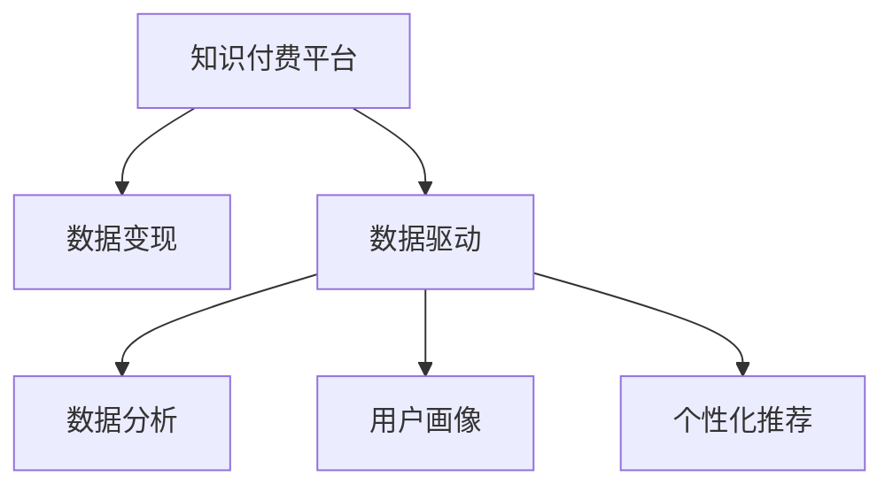

                 

# 如何利用知识付费实现数据变现？

> 关键词：知识付费, 数据变现, 数据驱动, 在线教育, 数据安全

## 1. 背景介绍

随着互联网技术的发展和智能设备的普及，知识付费作为一种新兴的商业模式，正在迅速崛起。根据中国互联网网络信息中心（CNNIC）发布的报告，2021年我国知识付费市场规模已经达到238.6亿元，用户规模达3.3亿。这一趋势表明，人们愿意为知识、技能、信息等内容付费，以提升自身素质、拓展视野、提升效率。在这种背景下，企业如何利用知识付费平台，将自身积累的数据资源变现，成为一个亟待探索的课题。

知识付费平台的兴起，使得数据变现变得更为直接和高效。企业可以通过平台将积累的各类数据转化为知识产品，如文章、课程、报告等，直接向用户收取费用，实现数据价值的最大化。本文将从核心概念、算法原理、操作步骤、数学模型、案例分析、项目实践、应用场景等多个角度，深入探讨如何利用知识付费平台，实现数据变现，并给出实际应用中的详细操作步骤和建议。

## 2. 核心概念与联系

### 2.1 核心概念概述

在进行详细探讨前，首先需要明确几个核心概念：

- **知识付费平台**：基于互联网的第三方平台，为用户提供各类知识产品，如文章、课程、视频等，用户通过订阅、购买等方式获取。典型的平台有得到、知乎live、喜马拉雅等。
- **数据变现**：将企业积累的数据资源（如文章、文档、图片、视频等）转化为商业价值的过程，通过知识付费平台将数据转化为知识产品，并收取费用。
- **数据驱动**：基于数据进行决策、分析和优化，提升企业的业务效率和竞争力。知识付费平台的数据驱动策略包括数据分析、用户画像、个性化推荐等。
- **在线教育**：通过网络平台提供各类教育服务，如课程、讲座、答疑等。知识付费平台也常常与在线教育结合，为用户提供优质的教育资源。

这些概念之间的联系可以简明地用以下Mermaid流程图表示：



通过以上流程图可以看出，知识付费平台是数据变现的载体，数据驱动是变现的手段，数据分析、用户画像、个性化推荐则是实现数据驱动的具体方式。企业可以通过这些方式，将自身的数据资源转化为知识产品，直接向用户收取费用，实现数据变现。

## 3. 核心算法原理 & 具体操作步骤

### 3.1 算法原理概述

基于知识付费的数据变现，本质上是将数据转化为知识产品，并利用数据驱动策略，提升知识产品的价值和用户体验。其核心算法原理包括以下几个方面：

1. **数据预处理**：将原始数据进行清洗、筛选、归一化等处理，提升数据质量和可用性。
2. **知识抽取**：从原始数据中抽取出有用的知识信息，如主题、关键词、情感等。
3. **内容生成**：基于抽取出的知识信息，生成相应的知识产品，如文章、课程、报告等。
4. **数据驱动优化**：利用数据分析、用户画像、个性化推荐等技术，对知识产品进行优化，提升用户体验和满意度。

### 3.2 算法步骤详解

基于上述算法原理，数据变现的具体操作步骤如下：

**Step 1: 数据收集与预处理**

1. **数据来源**：收集企业内部、外部积累的各种数据资源，如文章、文档、图片、视频等。
2. **数据清洗**：对数据进行去重、去噪、补全、归一化等预处理，提升数据质量和可用性。
3. **数据标注**：对部分数据进行标注，如分类、标注关键词、情感分析等，为后续知识抽取和生成提供依据。

**Step 2: 知识抽取与内容生成**

1. **知识抽取**：利用自然语言处理（NLP）技术，从预处理后的数据中抽取出有用的知识信息，如主题、关键词、情感等。
2. **内容生成**：基于抽取出的知识信息，生成相应的知识产品，如文章、课程、报告等。内容生成可以采用模板填充、自动生成、用户协作等方式。

**Step 3: 数据驱动优化**

1. **数据分析**：利用统计分析、机器学习等技术，对知识产品进行量化分析，如用户访问量、点击率、学习进度等，以优化产品设计和迭代。
2. **用户画像**：通过用户行为数据，构建用户画像，了解用户需求和偏好，提升个性化推荐效果。
3. **个性化推荐**：利用推荐算法，根据用户画像和历史行为，推荐符合用户兴趣的知识产品，提升用户粘性和转化率。

### 3.3 算法优缺点

基于知识付费的数据变现方法具有以下优点：

1. **高效直接**：直接将数据转化为知识产品，用户可以直接付费获取，无需等待开发周期。
2. **广泛适用**：适用于各类企业，如教育、出版、媒体、咨询等，数据资源丰富，变现潜力大。
3. **灵活调整**：可以根据市场需求和用户反馈，灵活调整产品内容和形式，提升用户体验。

同时，该方法也存在以下局限：

1. **数据质量要求高**：数据预处理和标注环节耗时耗力，需要高质量的数据资源。
2. **用户粘性依赖高**：知识产品的质量和服务直接影响用户粘性，需持续优化。
3. **成本投入大**：需要投入大量的技术、人力、物力资源，进行数据清洗、标注、分析、推荐等。

尽管存在这些局限，但就目前而言，基于知识付费的数据变现方法仍是最主流的数据变现手段。未来相关研究将集中在如何降低数据预处理和标注成本，提升用户粘性，降低成本投入，同时兼顾数据安全等方面。

### 3.4 算法应用领域

基于知识付费的数据变现方法，在多个领域均有广泛应用，具体如下：

- **教育**：教育机构可以利用自身积累的教学资源，如课件、教材、讲义等，通过知识付费平台，向学生收取费用，实现数据变现。
- **出版**：出版公司可以将各类书籍、文章等版权资源，通过知识付费平台，向读者收取费用，提升收益。
- **媒体**：媒体平台可以利用自身积累的各类媒体资源，如文章、视频、音频等，通过知识付费平台，向用户收取费用，实现数据变现。
- **咨询**：咨询公司可以将各类咨询报告、专家解读等数据资源，通过知识付费平台，向客户收取费用，提升服务价值。

## 4. 数学模型和公式 & 详细讲解 & 举例说明

### 4.1 数学模型构建

本节将使用数学语言对基于知识付费的数据变现过程进行更加严格的刻画。

设企业拥有的数据资源为 $D=\{d_1,d_2,...,d_n\}$，其中 $d_i$ 为第 $i$ 个数据记录，包括文本、图片、视频等。假设有 $M$ 类知识产品，每类产品包含 $k$ 个属性，记为 $A_1,A_2,...,A_k$。

定义知识产品 $p$ 的用户访问量为 $V_p$，点击率为 $C_p$，学习进度为 $L_p$，用户满意度为 $S_p$。则知识产品的价值函数 $V_p$ 可以表示为：

$$
V_p = \alpha V_p + \beta C_p + \gamma L_p + \delta S_p
$$

其中 $\alpha, \beta, \gamma, \delta$ 为相应属性的权重系数，根据用户需求和产品特性进行调整。

### 4.2 公式推导过程

在知识抽取阶段，可以利用NLP技术，从数据中抽取出主题、关键词、情感等知识信息。设抽取出的主题为 $T$，关键词为 $K$，情感为 $E$。则知识产品 $p$ 的质量函数 $Q_p$ 可以表示为：

$$
Q_p = \lambda_T T + \lambda_K K + \lambda_E E
$$

其中 $\lambda_T, \lambda_K, \lambda_E$ 为相应知识类型的权重系数，根据产品特性进行调整。

在内容生成阶段，可以利用模板填充、自动生成等技术，生成相应的知识产品。设知识产品 $p$ 的生成过程为 $G(d_i)$，其中 $d_i$ 为第 $i$ 个数据记录，$G$ 为内容生成函数。则知识产品 $p$ 的生成成本函数 $C_p$ 可以表示为：

$$
C_p = \eta_G G(d_i)
$$

其中 $\eta_G$ 为生成成本系数，根据生成技术复杂度进行调整。

在数据驱动优化阶段，可以利用数据分析、用户画像、个性化推荐等技术，提升知识产品的价值和用户体验。设知识产品 $p$ 的优化过程为 $O(p)$，则知识产品 $p$ 的优化成本函数 $O_p$ 可以表示为：

$$
O_p = \zeta_O O(p)
$$

其中 $\zeta_O$ 为优化成本系数，根据优化技术复杂度进行调整。

### 4.3 案例分析与讲解

以某教育机构的课程数据为例，进行具体分析。该机构拥有的课程数据为 $D=\{d_1,d_2,...,d_n\}$，每门课程包含课程名称、主讲人、学习时长、用户评价等属性。利用知识付费平台，可以将这些课程数据转化为知识产品，向学生收取费用。

在数据预处理阶段，需要对课程数据进行清洗、筛选、归一化等处理。例如，将课程名称进行分词、去除停用词、提取关键词，生成课程摘要等。

在知识抽取阶段，可以抽取课程的主题、关键词、情感等知识信息。例如，对课程名称和摘要进行主题分析，得到课程主题 $T$；对课程用户评价进行情感分析，得到课程情感 $E$。

在内容生成阶段，可以采用模板填充方式，生成课程的详细介绍、教学大纲、习题集等知识产品。例如，根据课程主题和关键词，生成课程介绍；根据用户评价，生成课程习题集。

在数据驱动优化阶段，可以利用用户行为数据，构建用户画像，个性化推荐课程。例如，根据用户学习历史和评价，推荐适合用户的课程，提升用户满意度和转化率。

## 5. 项目实践：代码实例和详细解释说明

### 5.1 开发环境搭建

在进行知识付费的数据变现实践前，我们需要准备好开发环境。以下是使用Python进行Flask开发的环境配置流程：

1. 安装Anaconda：从官网下载并安装Anaconda，用于创建独立的Python环境。

2. 创建并激活虚拟环境：
```bash
conda create -n course-pyenv python=3.8 
conda activate course-pyenv
```

3. 安装Flask：
```bash
pip install flask
```

4. 安装Flask-RESTful、Flask-SQLAlchemy等扩展：
```bash
pip install flask-restful flask-sqlalchemy
```

5. 安装相关数据库驱动和模型：
```bash
pip install psycopg2-binary
```

完成上述步骤后，即可在`course-pyenv`环境中开始知识付费的数据变现实践。

### 5.2 源代码详细实现

下面我们以某教育机构的课程数据为例，给出使用Flask进行课程数据变现的Python代码实现。

首先，定义课程数据模型：

```python
from flask_sqlalchemy import SQLAlchemy

db = SQLAlchemy()

class Course(db.Model):
    id = db.Column(db.Integer, primary_key=True)
    name = db.Column(db.String(100), nullable=False)
    instructor = db.Column(db.String(100), nullable=False)
    duration = db.Column(db.Integer, nullable=False)
    rating = db.Column(db.Float, nullable=False)
    user_ids = db.relationship('User', backref='courses', lazy=True)
```

然后，定义用户数据模型：

```python
class User(db.Model):
    id = db.Column(db.Integer, primary_key=True)
    name = db.Column(db.String(100), nullable=False)
    courses = db.relationship('Course', backref='users', lazy=True)
```

接着，定义Flask应用程序：

```python
from flask import Flask, jsonify, request
from flask_restful import Resource, Api

app = Flask(__name__)
api = Api(app)

@app.route('/')
def index():
    return jsonify({'message': 'Hello, World!'})

class CourseResource(Resource):
    def get(self, course_id):
        course = Course.query.filter_by(id=course_id).first()
        if course is None:
            return jsonify({'error': 'Course not found'}), 404
        return jsonify({
            'id': course.id,
            'name': course.name,
            'instructor': course.instructor,
            'duration': course.duration,
            'rating': course.rating,
            'user_ids': [user.id for user in course.user_ids]
        })

    def post(self, course_id):
        course = Course.query.filter_by(id=course_id).first()
        if course is None:
            return jsonify({'error': 'Course not found'}), 404
        data = request.get_json()
        user_id = data.get('user_id')
        if user_id is None:
            return jsonify({'error': 'User ID missing'}), 400
        user = User.query.filter_by(id=user_id).first()
        if user is None:
            return jsonify({'error': 'User not found'}), 404
        course.user_ids.append(user)
        db.session.commit()
        return jsonify({'message': 'User added to course'})

api.add_resource(CourseResource, '/courses/<int:course_id>')

if __name__ == '__main__':
    app.run(debug=True)
```

最后，启动Flask服务：

```bash
flask run
```

以上代码实现了简单的课程数据管理，包括课程查询和用户加入课程的功能。企业可以根据自身需求，进一步扩展数据管理、知识抽取、内容生成、数据驱动优化等功能，构建完整的知识付费平台。

### 5.3 代码解读与分析

让我们再详细解读一下关键代码的实现细节：

**Course模型定义**：
- `id`：课程ID，主键，自动递增。
- `name`：课程名称，必填。
- `instructor`：主讲人，必填。
- `duration`：课程时长，必填。
- `rating`：用户评分，必填。
- `user_ids`：用户ID列表，与用户表建立关系，Lazy Load，即不主动查询关联表。

**User模型定义**：
- `id`：用户ID，主键，自动递增。
- `name`：用户姓名，必填。
- `courses`：课程ID列表，与课程表建立关系，Lazy Load。

**Flask应用程序定义**：
- `index`方法：简单的首页接口，返回Hello World。
- `CourseResource`类：课程资源管理接口。
  - `get`方法：根据课程ID查询课程信息，返回课程详细信息。
  - `post`方法：根据用户ID添加用户到课程中。
- `api.add_resource(CourseResource, '/courses/<int:course_id>')`：将课程资源管理接口映射到Flask URL路由。

**代码运行**：
- `flask run`：启动Flask服务，调试模式运行，默认监听5000端口。

可以看到，Flask框架提供了灵活的Web API开发方式，企业可以根据自身需求，自由组合和扩展各类功能模块，实现知识付费平台的数据变现。

## 6. 实际应用场景

### 6.1 教育机构

教育机构可以利用自身积累的教学资源，如课件、教材、讲义等，通过知识付费平台，向学生收取费用。例如，某教育机构可以将其视频课程、PPT、习题集等资源，转化为知识产品，通过知识付费平台销售，提升收益。

### 6.2 出版公司

出版公司可以将各类书籍、文章等版权资源，通过知识付费平台，向读者收取费用。例如，某出版公司可以将各类图书、论文等资源，转化为知识产品，通过知识付费平台销售，提升收益。

### 6.3 媒体平台

媒体平台可以利用自身积累的各类媒体资源，如文章、视频、音频等，通过知识付费平台，向用户收取费用。例如，某新闻媒体平台可以将其独家报道、深度访谈等资源，转化为知识产品，通过知识付费平台销售，提升收益。

### 6.4 未来应用展望

随着知识付费市场的不断发展，基于数据变现的方法将在更多领域得到应用，为传统行业带来变革性影响。

在智慧医疗领域，基于知识付费的数据变现方法，可以为医疗机构提供各类医学知识产品，如在线咨询、视频教程、病历分析等，提升医疗服务的智能化水平，辅助医生诊疗，加速新药开发进程。

在智能教育领域，知识付费平台的数据变现方法，可以为教育机构提供优质的教育资源，如在线课程、习题集、学习社区等，因材施教，促进教育公平，提高教学质量。

在智慧城市治理中，知识付费平台的数据变现方法，可以为城市管理机构提供各类智慧服务，如城市规划、公共安全、环保监测等，提高城市管理的自动化和智能化水平，构建更安全、高效的未来城市。

此外，在企业生产、社会治理、文娱传媒等众多领域，知识付费平台的数据变现方法也将不断涌现，为各行各业带来新的发展机遇。

## 7. 工具和资源推荐

### 7.1 学习资源推荐

为了帮助开发者系统掌握基于知识付费的数据变现的理论基础和实践技巧，这里推荐一些优质的学习资源：

1. **Flask官方文档**：Flask框架的官方文档，提供了丰富的教程和API接口文档，是Flask开发的必备资料。
2. **SQLAlchemy官方文档**：SQLAlchemy数据库工具的官方文档，提供了详细的API接口和示例代码，帮助开发者快速上手数据管理。
3. **《知识付费平台设计》课程**：某知名大学的在线课程，介绍了知识付费平台的开发设计、数据管理、用户体验等关键问题。
4. **《Python Web开发》书籍**：全面介绍了Python Web开发的基础知识和实际案例，适合初学者和进阶开发者。
5. **《深度学习与自然语言处理》课程**：某知名大学的在线课程，涵盖了深度学习、自然语言处理等前沿技术，适合进一步深入学习。

通过对这些资源的学习实践，相信你一定能够快速掌握基于知识付费的数据变现的精髓，并用于解决实际的业务问题。

### 7.2 开发工具推荐

高效的开发离不开优秀的工具支持。以下是几款用于知识付费平台开发的工具：

1. **Flask**：轻量级的Web框架，简单易用，支持灵活的API开发。
2. **SQLAlchemy**：强大的数据库ORM工具，支持多种数据库，提供丰富的查询和操作接口。
3. **Jupyter Notebook**：基于Web的交互式编程环境，支持Python和R等语言，适合数据分析和实验。
4. **TensorBoard**：TensorFlow配套的可视化工具，可实时监测模型训练状态，提供丰富的图表呈现方式。
5. **Weights & Biases**：模型训练的实验跟踪工具，记录和可视化模型训练过程中的各项指标，方便对比和调优。

合理利用这些工具，可以显著提升知识付费平台的数据变现开发效率，加快创新迭代的步伐。

### 7.3 相关论文推荐

知识付费平台的数据变现方法，在学术界也有许多相关研究。以下是几篇奠基性的相关论文，推荐阅读：

1. **Knowledge Sharing in Online Courses**：介绍了在线课程的建设、运营和用户评价机制，为知识付费平台的数据管理提供参考。
2. **Educational Data Mining**：涵盖了教育数据挖掘的方法和技术，包括课程推荐、用户画像、情感分析等。
3. **Online Learning Analytics**：介绍了在线学习分析的理论和实践，涵盖数据驱动的个性化推荐、用户行为分析等。

这些论文代表了大数据在教育、媒体、出版等领域的应用，为知识付费平台的数据变现提供理论支持。

## 8. 总结：未来发展趋势与挑战

### 8.1 研究成果总结

本文对基于知识付费的数据变现方法进行了全面系统的介绍。首先，明确了知识付费平台、数据变现、数据驱动等核心概念，并指出其联系和作用。其次，从算法原理、操作步骤、数学模型、案例分析等多个角度，详细讲解了数据变现的实现方法。最后，通过项目实践和实际应用场景，展示了数据变现的广泛应用前景。

通过本文的系统梳理，可以看到，基于知识付费的数据变现方法，正在成为知识付费市场的重要商业模式，极大地拓展了企业数据资源的商业价值。未来，伴随知识付费市场的持续增长，基于数据变现的业务模式将得到更多企业的关注和应用。

### 8.2 未来发展趋势

展望未来，基于知识付费的数据变现方法将呈现以下几个发展趋势：

1. **平台多样化**：随着知识付费市场的发展，各种知识付费平台如雨后春笋般涌现，未来平台将更加多样化，满足不同用户和企业的个性化需求。
2. **内容个性化**：基于用户画像和行为数据，提供更加个性化和精准的知识产品推荐，提升用户体验和转化率。
3. **数据高效驱动**：利用先进的机器学习和数据分析技术，提升知识产品的价值和质量，实现数据驱动的优化和迭代。
4. **用户社区化**：构建用户社区，加强用户互动和反馈，提升知识产品的质量和用户粘性。
5. **技术创新化**：结合区块链、大数据、人工智能等前沿技术，提升知识付费平台的安全性、可扩展性和智能化水平。

这些趋势表明，知识付费平台的数据变现方法将在技术、业务、用户体验等多个维度不断创新和突破，为各行业的数字化转型和智能化升级提供新的动力。

### 8.3 面临的挑战

尽管基于知识付费的数据变现方法已经取得了显著成果，但在迈向更加智能化、普适化应用的过程中，它仍面临着诸多挑战：

1. **数据安全**：知识付费平台需要处理大量用户数据，数据安全问题不容忽视。如何保护用户隐私，防止数据泄露，是一个亟待解决的问题。
2. **成本投入**：知识付费平台的开发和运营需要大量资源投入，包括技术开发、内容制作、平台维护等。如何降低成本，提高运营效率，是一个重要课题。
3. **内容质量**：知识产品的质量直接影响到用户满意度和平台收入。如何提升内容质量，优化用户体验，是一个长期任务。
4. **市场竞争**：知识付费市场竞争激烈，如何打造优质平台，吸引和留住用户，是一个重要的竞争策略。
5. **法律合规**：知识付费平台涉及众多法律法规，如何合规运营，避免法律风险，是一个重要问题。

这些挑战需要在未来的实践中不断探索和解决，以确保知识付费平台的健康稳定发展。

### 8.4 研究展望

面对知识付费平台的数据变现所面临的种种挑战，未来的研究需要在以下几个方面寻求新的突破：

1. **数据隐私保护**：采用先进的数据加密和匿名化技术，保护用户隐私，防止数据泄露。
2. **成本控制**：优化平台架构和技术栈，降低开发和运营成本，提升平台可扩展性。
3. **内容创新**：结合大数据和人工智能技术，提升内容质量，实现个性化推荐和智能生成。
4. **市场竞争**：利用区块链和去中心化技术，构建更加公平、透明、可信的平台生态。
5. **法律合规**：加强法律合规研究，制定合规运营策略，规避法律风险。

这些研究方向将引领知识付费平台的数据变现向更加智能、高效、安全和可靠的方向发展，为各行业的数字化转型和智能化升级提供新的解决方案。

## 9. 附录：常见问题与解答

**Q1: 知识付费平台如何获取高质量数据？**

A: 高质量数据是知识付费平台的核心资源，获取高质量数据需要以下几个步骤：
1. 数据收集：通过企业内部、外部多种渠道，如网站、论坛、社交媒体等，收集各类知识资源，如文章、视频、音频等。
2. 数据清洗：对收集到的数据进行清洗、筛选、归一化等处理，提升数据质量和可用性。
3. 数据标注：对部分数据进行标注，如分类、标注关键词、情感分析等，为后续知识抽取和生成提供依据。

**Q2: 如何提升知识产品的用户满意度？**

A: 提升知识产品的用户满意度需要以下几个方面的努力：
1. 内容质量：提升内容的质量和实用性，确保知识产品能够真正帮助用户解决问题。
2. 用户画像：通过用户行为数据，构建用户画像，了解用户需求和偏好，提供更加个性化的推荐和服务。
3. 交互设计：提升知识产品的交互设计，使用户体验更加友好和便捷。
4. 反馈机制：建立用户反馈机制，及时收集和处理用户意见，优化产品和服务。

**Q3: 知识付费平台的数据变现如何规避法律风险？**

A: 规避法律风险需要以下几个方面的努力：
1. 合规运营：了解和遵守相关法律法规，确保平台运营符合法律要求。
2. 用户保护：保护用户隐私和权益，确保用户数据的安全和合法使用。
3. 透明公平：保证平台的透明度和公平性，避免不正当竞争和市场垄断。
4. 风险管理：建立风险管理体系，及时发现和处理可能的风险和问题。

**Q4: 知识付费平台的数据变现如何应对市场竞争？**

A: 应对市场竞争需要以下几个方面的努力：
1. 平台创新：结合区块链和去中心化技术，构建更加公平、透明、可信的平台生态。
2. 差异化服务：提供差异化的服务和产品，满足不同用户和企业的个性化需求。
3. 营销策略：制定有效的营销策略，提升品牌知名度和用户粘性。
4. 合作共赢：与各领域企业合作，共同开发和推广知识产品，实现共赢。

这些努力将有助于知识付费平台在市场竞争中占据优势，实现持续健康发展。

---

作者：禅与计算机程序设计艺术 / Zen and the Art of Computer Programming

