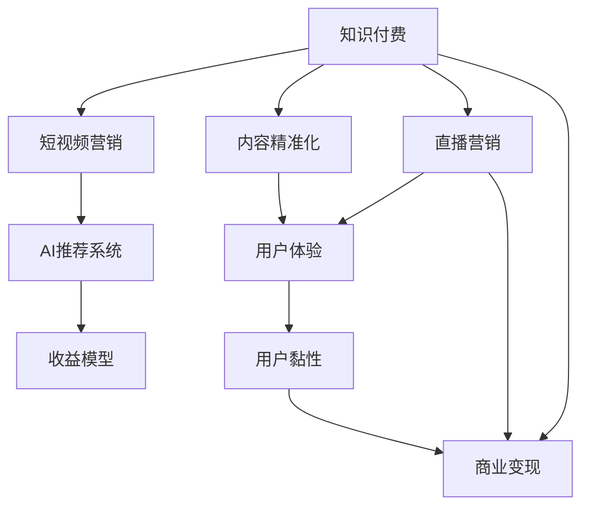

                 

# 如何利用知识付费实现直播与短视频营销？

> 关键词：知识付费、直播营销、短视频营销、AI技术、用户体验、内容精准化、收益模型、成本控制

## 1. 背景介绍

### 1.1 问题由来

在当今信息爆炸的时代，如何在海量内容中吸引用户注意力并转化为实际收益，成为各大内容创作者面临的共同挑战。知识付费作为一种新兴的内容变现方式，通过提供高价值、深度的内容，将知识和技能商品化，获取用户付费订阅或单次购买。

而直播与短视频作为最新的内容消费形式，通过实时互动、视觉冲击等特性，吸引了大量年轻用户的关注。如何高效整合知识付费和直播短视频资源，提升用户黏性，提高商业变现能力，成为当前亟待解决的问题。

### 1.2 问题核心关键点

本文聚焦于如何利用知识付费理念和技术手段，结合直播与短视频营销特性，实现高效的内容创作与用户转化。关键点包括：

- 如何结合直播与短视频的内容形式，满足不同用户的多样化需求？
- 如何利用AI技术优化内容推荐，提高用户留存和付费率？
- 如何构建合理的收益模型，实现内容创作者与平台的双赢？
- 如何在保证内容质量的同时，实现高效的内容生产与运营成本控制？

通过深入探索这些问题，本文将为直播与短视频营销提供系统的策略和实用的技术方案。

## 2. 核心概念与联系

### 2.1 核心概念概述

为更好地理解本文内容，我们需要了解以下几个核心概念及其联系：

- 知识付费（Knowledge Paywall）：通过提供优质、专业的内容，用户需要支付一定费用以获取完整信息，提升内容变现效率。
- 直播营销（Live Streaming Marketing）：通过实时视频流方式，与用户互动，展示产品或服务，提升品牌影响力，增加转化率。
- 短视频营销（Short Video Marketing）：以短视频为载体，通过视觉冲击、信息量集中等特点，快速吸引用户注意力，实现内容传播。
- AI推荐系统（AI Recommendation System）：利用机器学习、深度学习等技术，自动分析用户行为和偏好，推荐相关内容，提升用户体验。
- 收益模型（Revenue Model）：确定内容创作者与平台之间的收益分配机制，实现公平、可持续的商业模式。
- 内容精准化（Content Personalization）：根据用户偏好，推送最匹配的内容，提高用户满意度和付费意愿。

这些概念之间的联系可以通过以下Mermaid流程图来展示：



这个流程图展示出各个概念之间的相互依赖关系：知识付费作为核心，通过直播与短视频的形式和AI推荐系统实现内容精准化，提升用户体验，进而提高用户黏性，最终实现商业变现。

## 3. 核心算法原理 & 具体操作步骤

### 3.1 算法原理概述

本文将重点探讨如何结合知识付费理念和技术，结合直播与短视频的营销特性，构建高效的内容变现和用户转化策略。核心算法原理包括：

- **内容精准化推荐**：利用AI技术，分析用户行为和偏好，精准推送相关内容。
- **互动反馈机制**：通过直播和短视频的实时互动，收集用户反馈，优化内容生产。
- **多渠道收益模型**：整合直播、短视频和知识付费的多渠道收益，实现内容创作者与平台的共赢。
- **成本控制优化**：利用AI技术优化内容制作与运营流程，降低成本，提高效率。

### 3.2 算法步骤详解

基于上述核心算法原理，本文将详细介绍实现这些策略的具体操作步骤：

#### 3.2.1 内容精准化推荐

1. **数据采集与预处理**：
   - 采集用户行为数据，如观看时长、点赞数、评论内容等。
   - 对数据进行清洗和标准化处理，去除噪音数据，保证数据质量。

2. **用户画像构建**：
   - 利用聚类算法和关联规则挖掘技术，构建用户画像，分析用户的兴趣偏好。
   - 通过用户画像，生成用户标签，用于推荐系统的训练。

3. **推荐算法选择与优化**：
   - 选择适当的推荐算法，如协同过滤、基于内容的推荐、深度学习推荐等。
   - 利用交叉验证、A/B测试等方法，优化推荐模型，提升推荐效果。

4. **推荐系统实现**：
   - 构建推荐系统架构，包括数据源、模型、算法、展示层等模块。
   - 使用TensorFlow或PyTorch等深度学习框架，实现推荐算法。

#### 3.2.2 互动反馈机制

1. **实时互动功能实现**：
   - 在直播平台集成实时评论、点赞、互动问答等功能，提升用户参与度。
   - 在短视频平台集成弹幕、评论、分享等功能，增加用户互动机会。

2. **反馈数据采集与分析**：
   - 实时采集用户互动数据，如评论内容、点赞次数、分享次数等。
   - 利用NLP技术对评论内容进行情感分析，了解用户反馈情感倾向。

3. **内容优化策略制定**：
   - 根据用户反馈，调整内容制作策略，如改变视频时长、调整播放顺序、优化话题选择等。
   - 使用A/B测试，比较不同内容策略的效果，选择最优方案。

#### 3.2.3 多渠道收益模型

1. **收益模式设计**：
   - 根据内容特点，设计多样化的收益模式，如单次付费、订阅制、会员等级制度等。
   - 确定收益分配机制，如按点击量、观看时长、购买次数等进行分配。

2. **收益系统实现**：
   - 搭建收益系统架构，包括付费入口、用户管理、订单管理等模块。
   - 使用微服务架构，实现模块化开发和扩展。

3. **收益数据分析与优化**：
   - 定期分析收益数据，评估不同收益模式的效果。
   - 根据分析结果，调整收益策略，提升整体收益。

#### 3.2.4 成本控制优化

1. **内容制作流程优化**：
   - 利用自动化工具，如Adobe Premiere、DaVinci Resolve等，优化内容制作流程。
   - 引入模板化内容制作，提升制作效率，降低制作成本。

2. **运营流程自动化**：
   - 利用RPA（Robotic Process Automation）技术，自动化执行重复性工作，如视频上传、平台互动等。
   - 使用流程自动化工具，如Zapier、Integromat等，实现多平台数据同步和自动化处理。

3. **AI技术辅助决策**：
   - 使用AI技术进行内容预测和运营决策，如内容受欢迎度预测、流量高峰预测等。
   - 引入机器学习算法，优化内容排期和推广策略。

### 3.3 算法优缺点

#### 3.3.1 优点

- **提高内容精准度**：通过AI推荐算法，实现内容精准推送，提升用户满意度。
- **增强用户黏性**：通过实时互动和反馈机制，增强用户黏性，提升用户留存率。
- **多渠道收益**：整合直播、短视频和知识付费，实现多渠道收益，提升整体收益。
- **降低成本**：利用自动化工具和AI技术，降低内容制作和运营成本。

#### 3.3.2 缺点

- **技术门槛较高**：AI推荐算法和自动化工具的使用，需要较高的技术门槛。
- **数据质量依赖**：推荐算法的效果依赖于数据质量和用户行为的准确性。
- **用户反馈处理复杂**：实时互动和反馈数据的处理，需要高效的算法和技术支持。

### 3.4 算法应用领域

本文介绍的算法和策略，主要应用于知识付费与直播、短视频营销的结合场景。具体应用领域包括：

- 在线教育平台：通过直播和短视频课程，结合知识付费，提升课程吸引力，实现收益增长。
- 健康与健身平台：通过直播健身指导、短视频健康知识分享，结合付费咨询，提升用户活跃度和付费率。
- 旅游与旅游平台：通过直播旅游体验、短视频景点介绍，结合会员制度，提升用户粘性，增加会员订阅。

## 4. 数学模型和公式 & 详细讲解 & 举例说明

### 4.1 数学模型构建

本文将使用数学语言对核心算法进行进一步的严谨描述。

设用户集合为 $U$，内容集合为 $C$，每个用户在每个内容上的评分（兴趣度）为 $r_{ui}$，其中 $u \in U, c \in C$。

推荐系统的目标是最小化预测评分与实际评分之间的误差：

$$
\min_{\theta} \frac{1}{N} \sum_{u=1}^N \sum_{c=1}^M (\hat{r}_{ui} - r_{ui})^2
$$

其中 $\hat{r}_{ui}$ 为预测评分，$r_{ui}$ 为实际评分。

### 4.2 公式推导过程

利用矩阵分解法，可以将推荐问题转化为矩阵分解问题：

$$
\hat{r}_{ui} = \sum_{k=1}^K \theta_{ku} \cdot \phi_{kc}
$$

其中 $\theta$ 为用户兴趣向量，$\phi$ 为内容特征向量，$K$ 为特征维度。

最小化误差，得到优化问题：

$$
\min_{\theta, \phi} \frac{1}{N} \sum_{u=1}^N \sum_{c=1}^M (y_{ui} - \hat{r}_{ui})^2
$$

其中 $y_{ui} = \sum_{k=1}^K \theta_{ku} \cdot \phi_{kc}$ 为真实评分。

利用梯度下降法求解优化问题，得到更新公式：

$$
\theta \leftarrow \theta - \eta \nabla_{\theta}\mathcal{L}(\theta)
$$

其中 $\eta$ 为学习率，$\mathcal{L}$ 为损失函数。

### 4.3 案例分析与讲解

假设某知识付费平台收集了用户观看时长和点赞数，利用协同过滤算法进行推荐。平台上有两类内容：直播课程和短视频教程。用户A对直播课程的观看时长为10分钟，对短视频教程的点赞数为5个，推荐算法得到以下评分：

$$
\begin{aligned}
\hat{r}_{A1} &= 3 \\
\hat{r}_{A2} &= 4
\end{aligned}
$$

其中 $1$ 为直播课程，$2$ 为短视频教程。

根据推荐结果，平台推荐用户A观看短视频教程。在直播课程观看结束后，用户A对短视频教程的观看时长和点赞数进行反馈，推荐算法进一步优化，得到新的评分：

$$
\begin{aligned}
\hat{r}_{A1} &= 2.5 \\
\hat{r}_{A2} &= 3.5
\end{aligned}
$$

平台根据新的评分，推荐用户A观看直播课程。通过不断的反馈和优化，推荐系统逐步提升推荐效果，增强用户黏性。

## 5. 项目实践：代码实例和详细解释说明

### 5.1 开发环境搭建

在进行知识付费与直播、短视频营销的结合实践前，我们需要准备好开发环境。以下是使用Python进行推荐系统和收益系统开发的Python环境配置流程：

1. 安装Anaconda：从官网下载并安装Anaconda，用于创建独立的Python环境。

2. 创建并激活虚拟环境：
```bash
conda create -n recommender-env python=3.8 
conda activate recommender-env
```

3. 安装TensorFlow：从官网获取对应的安装命令。例如：
```bash
conda install tensorflow -c conda-forge
```

4. 安装相关工具包：
```bash
pip install pandas scikit-learn tensorflow
```

5. 安装推荐系统库：
```bash
pip install-lightning recommendation-ai
```

完成上述步骤后，即可在`recommender-env`环境中开始项目实践。

### 5.2 源代码详细实现

下面以知识付费平台为例，给出使用TensorFlow搭建推荐系统的PyTorch代码实现。

首先，定义数据处理函数：

```python
import pandas as pd
import numpy as np

def load_data(file_path):
    data = pd.read_csv(file_path)
    # 数据清洗和预处理
    data = data.dropna()
    data['watch_time'] = data['watch_time'].fillna(0)
    data['likes'] = data['likes'].fillna(0)
    data['watch_time'] = data['watch_time'].astype(int)
    data['likes'] = data['likes'].astype(int)
    
    # 数据标准化处理
    data['watch_time'] = (data['watch_time'] - data['watch_time'].mean()) / data['watch_time'].std()
    data['likes'] = (data['likes'] - data['likes'].mean()) / data['likes'].std()
    
    # 构建用户-内容评分矩阵
    user_ids = data['user_id'].unique()
    content_ids = data['content_id'].unique()
    user_content_matrix = pd.DataFrame(np.zeros((len(user_ids), len(content_ids))), columns=content_ids, index=user_ids)
    for user, content in zip(user_ids, content_ids):
        data_for_user = data[data['user_id'] == user]
        user_content_matrix.at[user, content] = data_for_user['watch_time'].mean()
    
    return user_content_matrix
```

然后，定义推荐模型：

```python
import tensorflow as tf
from tensorflow.keras.layers import Input, Embedding, Dot, Dense, Flatten
from tensorflow.keras.models import Model

class MatrixFactorization(tf.keras.Model):
    def __init__(self, num_users, num_contents, num_factors):
        super(MatrixFactorization, self).__init__()
        self.user_embedding = Embedding(num_users, num_factors)
        self.content_embedding = Embedding(num_contents, num_factors)
        self.dot_product = Dot(axes=(1, 1))
        self.flatten = Flatten()
        self.dense = Dense(1, activation='sigmoid')
    
    def call(self, inputs):
        user_embeddings = self.user_embedding(inputs[0])
        content_embeddings = self.content_embedding(inputs[1])
        concatenated = tf.concat([user_embeddings, content_embeddings], axis=1)
        dot_product = self.dot_product(concatenated, content_embeddings)
        predictions = self.flatten(self.dense(dot_product))
        return predictions
```

接着，定义训练和评估函数：

```python
def train_epoch(model, data, batch_size, optimizer):
    train_data = tf.data.Dataset.from_tensor_slices(data)
    train_data = train_data.shuffle(buffer_size=1024).batch(batch_size)
    model.compile(optimizer=optimizer, loss='binary_crossentropy', metrics=['accuracy'])
    model.fit(train_data, epochs=10, validation_split=0.2)
    
def evaluate(model, data, batch_size):
    test_data = tf.data.Dataset.from_tensor_slices(data)
    test_data = test_data.shuffle(buffer_size=1024).batch(batch_size)
    model.evaluate(test_data)
```

最后，启动推荐系统流程：

```python
# 加载数据
user_content_matrix = load_data('data.csv')

# 初始化模型
num_users = user_content_matrix.shape[0]
num_contents = user_content_matrix.shape[1]
num_factors = 10
model = MatrixFactorization(num_users, num_contents, num_factors)

# 初始化优化器和损失函数
optimizer = tf.keras.optimizers.Adam(learning_rate=0.01)
loss = 'binary_crossentropy'

# 训练模型
train_epoch(model, user_content_matrix, batch_size=32, optimizer=optimizer)

# 评估模型
evaluate(user_content_matrix, batch_size=32)
```

以上就是使用TensorFlow搭建推荐系统的完整代码实现。可以看到，TensorFlow提供了丰富的API和工具，使得推荐系统的开发和训练变得简洁高效。

### 5.3 代码解读与分析

让我们再详细解读一下关键代码的实现细节：

**load_data函数**：
- 从CSV文件中读取用户和内容评分数据。
- 对数据进行清洗和预处理，如填补缺失值、标准化处理等。
- 构建用户-内容评分矩阵，用于推荐模型训练。

**MatrixFactorization模型**：
- 定义了一个基于矩阵分解的推荐模型，包括用户嵌入层、内容嵌入层、点积层、扁平层和全连接层。
- 通过反向传播算法训练模型，最小化预测评分与实际评分之间的误差。

**train_epoch和evaluate函数**：
- 使用TensorFlow的Dataset API进行数据批处理和模型训练。
- 通过内置的优化器和损失函数，对模型进行训练和评估。

## 6. 实际应用场景

### 6.1 智能教育平台

智能教育平台通过直播和短视频课程结合知识付费，提升课程吸引力，实现高收益。平台通过AI推荐系统，分析学生学习行为，精准推送相关课程和资料，提升课程完成率和付费率。此外，通过互动反馈机制，收集学生反馈，优化课程内容，提升学生满意度。

### 6.2 健康与健身平台

健康与健身平台通过直播健身指导和短视频健康知识分享，结合知识付费，提升用户活跃度和付费率。平台通过AI推荐系统，分析用户健康数据，精准推送相关健身课程和健康资料。通过实时互动和反馈机制，收集用户健身效果和反馈，优化健身课程，提升用户粘性。

### 6.3 旅游与旅游平台

旅游与旅游平台通过直播旅游体验和短视频景点介绍，结合知识付费，提升用户粘性和付费率。平台通过AI推荐系统，分析用户旅游偏好，精准推送相关旅游课程和景点介绍。通过互动反馈机制，收集用户旅游体验和反馈，优化旅游课程，提升用户满意度和购买率。

## 7. 工具和资源推荐

### 7.1 学习资源推荐

为了帮助开发者系统掌握知识付费与直播、短视频营销的理论基础和实践技巧，这里推荐一些优质的学习资源：

1. 《推荐系统实践》书籍：详细介绍了推荐系统的工作原理、算法设计和实现技巧，适合入门和进阶学习。
2. 《深度学习与推荐系统》课程：斯坦福大学开设的深度学习推荐系统课程，涵盖推荐系统的基本概念和前沿算法。
3. 《知识付费市场分析报告》：分析知识付费市场的现状、趋势和机会，提供市场洞察和业务策略。
4. 《短视频营销指南》书籍：全面介绍短视频营销的策略、技巧和案例，帮助用户快速上手。
5. 《直播营销实战指南》书籍：介绍直播营销的策略、技巧和工具，提供实用的案例和实践经验。

通过对这些资源的学习实践，相信你一定能够快速掌握知识付费与直播、短视频营销的精髓，并用于解决实际的商业问题。

### 7.2 开发工具推荐

高效的开发离不开优秀的工具支持。以下是几款用于知识付费与直播、短视频营销开发的常用工具：

1. Jupyter Notebook：轻量级的交互式编程环境，适合快速迭代和实验。
2. TensorFlow：强大的深度学习框架，提供了丰富的API和工具支持。
3. PyTorch：灵活的深度学习框架，适合科研和高效开发。
4. Lightweight Modeling：轻量级的深度学习框架，适合移动端和嵌入式设备的开发。
5. Scikit-learn：简单易用的机器学习库，适合快速实现推荐算法和数据分析。

合理利用这些工具，可以显著提升知识付费与直播、短视频营销开发的效率，加速创新迭代的步伐。

### 7.3 相关论文推荐

知识付费与直播、短视频营销的研究源于学界的持续研究。以下是几篇奠基性的相关论文，推荐阅读：

1. 《基于协同过滤的推荐系统》：详细介绍了协同过滤推荐算法的工作原理和实现方法。
2. 《基于深度学习的推荐系统》：提出基于深度学习的方法，提升推荐系统的预测准确度和多样性。
3. 《知识付费市场的用户行为分析》：通过数据挖掘和机器学习，分析知识付费市场的用户行为和偏好。
4. 《直播营销的效果评估》：评估直播营销对品牌知名度和销售转化率的影响，提供实用的案例和结论。
5. 《短视频营销的流量优化策略》：通过A/B测试和优化算法，提升短视频营销的流量和转化率。

这些论文代表了大语言模型微调技术的发展脉络。通过学习这些前沿成果，可以帮助研究者把握学科前进方向，激发更多的创新灵感。

## 8. 总结：未来发展趋势与挑战

### 8.1 总结

本文对如何利用知识付费实现直播与短视频营销进行了全面系统的介绍。首先阐述了知识付费与直播、短视频营销的融合背景和意义，明确了融合的可行性和必要性。其次，从原理到实践，详细讲解了推荐系统、互动反馈机制、收益模型和成本控制等核心算法原理和操作步骤，给出了推荐系统开发的完整代码实例。同时，本文还探讨了知识付费与直播、短视频营销在教育、健康、旅游等实际应用场景中的具体实践，展示了融合策略的实际应用效果。此外，本文还精选了融合技术的学习资源、开发工具和相关论文，力求为读者提供全方位的技术指引。

通过本文的系统梳理，可以看到，知识付费与直播、短视频营销的结合，为内容创作和用户转化提供了新的思路和方法。这种融合方式不仅能够提升内容变现能力，还能增强用户黏性和满意度，具有广阔的应用前景。

### 8.2 未来发展趋势

展望未来，知识付费与直播、短视频营销将呈现以下几个发展趋势：

1. **技术融合加速**：未来知识付费与直播、短视频营销将进一步融合，形成更加综合的营销手段。内容创作、用户互动和收益分配将更紧密地结合，提升整体效果。
2. **个性化推荐优化**：AI推荐系统将不断优化，实现更精准、更智能的内容推荐。个性化推荐将成为提升用户留存和付费率的关键。
3. **多渠道收益增长**：知识付费与直播、短视频营销将探索更多收益渠道，如付费会员、增值服务等，实现多元化的收益模式。
4. **用户参与度提升**：通过互动反馈机制，收集用户反馈，优化内容制作，提升用户参与度。用户粘性和满意度将成为评估营销效果的重要指标。
5. **成本控制优化**：利用AI技术优化内容制作和运营流程，降低制作和运营成本，提升整体效益。

以上趋势凸显了知识付费与直播、短视频营销的广阔前景。这些方向的探索发展，必将进一步提升NLP系统的性能和应用范围，为人工智能技术落地应用提供新的思路。

### 8.3 面临的挑战

尽管知识付费与直播、短视频营销已经取得了瞩目成就，但在迈向更加智能化、普适化应用的过程中，它仍面临着诸多挑战：

1. **技术门槛高**：AI推荐算法和自动化工具的使用，需要较高的技术门槛。对于小型企业，技术积累可能不足，难以实现高效开发。
2. **数据质量依赖**：推荐算法的效果依赖于数据质量和用户行为的准确性。数据清洗和处理需要投入大量精力。
3. **用户反馈处理复杂**：实时互动和反馈数据的处理，需要高效的算法和技术支持。
4. **收益分配复杂**：多渠道收益的分配机制需要公平、透明，避免争议和纠纷。

### 8.4 研究展望

面对知识付费与直播、短视频营销所面临的挑战，未来的研究需要在以下几个方面寻求新的突破：

1. **数据质量提升**：开发更高效的数据清洗和处理工具，提高数据质量和准确性。
2. **算法优化**：探索更高效的推荐算法，提升推荐精度和多样化。
3. **实时处理优化**：提升实时互动和反馈处理的效率，降低技术门槛。
4. **多渠道收益优化**：设计公平、透明的多渠道收益分配机制，实现共赢。
5. **自动化工具开发**：开发更易用的自动化工具，降低技术门槛，提升开发效率。

这些研究方向将为知识付费与直播、短视频营销的发展提供新的动力，帮助内容创作者和平台实现更高的商业价值。

## 9. 附录：常见问题与解答

**Q1：知识付费与直播、短视频营销如何实现多渠道收益？**

A: 知识付费与直播、短视频营销的多渠道收益可以通过以下方式实现：

1. **付费订阅**：用户可以通过支付订阅费用，获取无限制的课程观看、直播互动等权益。
2. **单次付费**：用户可以选择单次购买课程或直播，获取特定内容的观看权。
3. **增值服务**：通过提供个性化咨询、高级会员、专属课程等增值服务，提升用户满意度和付费率。
4. **广告和赞助**：平台可以引入广告和赞助，提升品牌曝光率和商业价值。
5. **会员制度**：通过会员制度，实现分层收费，提升整体收益。

**Q2：如何优化推荐系统的准确性和多样性？**

A: 推荐系统的优化需要从多个方面入手：

1. **数据质量提升**：对用户行为数据进行清洗和标准化处理，提高数据质量和准确性。
2. **模型优化**：选择适当的推荐算法，如协同过滤、基于内容的推荐、深度学习推荐等，并进行交叉验证和A/B测试，优化模型效果。
3. **特征工程**：通过特征工程，提升模型的特征提取能力，如增加时间特征、用户特征等。
4. **多目标优化**：平衡推荐系统的准确性和多样性，避免过度拟合。

**Q3：如何在直播和短视频中实现用户互动和反馈收集？**

A: 直播和短视频中可以通过以下方式实现用户互动和反馈收集：

1. **实时互动**：集成实时评论、点赞、互动问答等功能，提升用户参与度。
2. **反馈数据采集**：通过采集用户的评论、点赞、分享等数据，了解用户反馈情感倾向。
3. **反馈数据分析**：利用NLP技术对评论内容进行情感分析，了解用户对内容、形式、互动等方面的反馈。
4. **内容优化策略**：根据用户反馈，调整内容制作策略，如改变视频时长、调整播放顺序、优化话题选择等。

**Q4：如何设计合理的收益分配机制？**

A: 合理的收益分配机制设计需要考虑以下因素：

1. **公平性**：确保内容创作者和平台之间的收益分配公平。
2. **透明性**：明确收益分配规则，避免争议和纠纷。
3. **多样性**：设计多样化的收益模式，如按点击量、观看时长、购买次数等进行分配。
4. **激励性**：通过收益分配机制，激励内容创作者和平台积极参与。

**Q5：如何在保证内容质量的同时，实现高效的内容生产与运营成本控制？**

A: 保证内容质量的同时，实现高效的内容生产与运营成本控制可以通过以下方式：

1. **自动化工具**：使用自动化工具，如Adobe Premiere、DaVinci Resolve等，优化内容制作流程，提高制作效率。
2. **模板化内容制作**：引入模板化内容制作，提升制作效率，降低制作成本。
3. **AI技术辅助决策**：使用AI技术进行内容预测和运营决策，如内容受欢迎度预测、流量高峰预测等。
4. **流程自动化**：利用RPA（Robotic Process Automation）技术，自动化执行重复性工作，如视频上传、平台互动等。
5. **成本控制策略**：通过成本控制策略，优化内容制作和运营流程，降低整体成本。

这些策略的实施将有助于提升内容创作和运营效率，实现更高的商业价值。

---

作者：禅与计算机程序设计艺术 / Zen and the Art of Computer Programming

