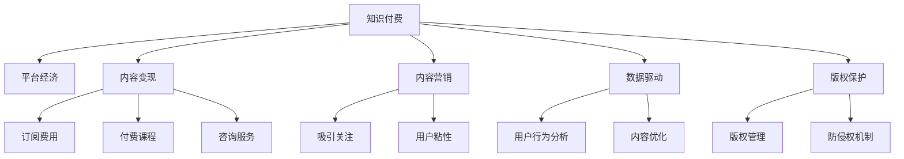

                 

# 如何利用知识付费实现被动收入

## 1. 背景介绍

在互联网时代，知识付费已经成为一个重要的商业模式。通过知识付费，专业人士可以利用自己的专业知识、经验和技能，为大众提供有价值的知识和信息，并获得相应的回报。本文将深入探讨如何利用知识付费实现被动收入，并通过一系列案例和技术细节，展示这一商业模式的潜力和实践路径。

## 2. 核心概念与联系

### 2.1 核心概念概述

为更好地理解知识付费的运作机制，本节将介绍几个关键概念：

- 知识付费：通过网络平台，专业人士向用户提供有价值的知识内容，并获得经济回报的过程。

- 平台经济：基于互联网的技术平台，汇聚和整合各类资源，提供用户所需的服务或产品，实现价值交换的经济形态。

- 内容变现：将知识内容转化为有形的经济收益，如订阅费用、付费课程、咨询服务等。

- 内容营销：通过发布优质内容，吸引用户关注和参与，提高品牌知名度和用户粘性。

- 数据驱动：利用数据分析技术，对用户行为进行深度挖掘，优化内容和运营策略，提升用户转化率和满意度。

- 版权保护：确保内容原创性，避免侵权风险，维护创作者的经济权益。

这些核心概念之间存在密切联系，共同构成知识付费生态的基本框架。通过理解这些概念及其相互关系，我们可以更好地把握知识付费的商业逻辑和运作模式。

### 2.2 核心概念原理和架构的 Mermaid 流程图



这个流程图展示了知识付费的核心概念及其相互关系。知识付费在平台经济的基础上，通过内容变现、内容营销、数据驱动和版权保护等多维度的支持，实现了知识的商业化和变现。

## 3. 核心算法原理 & 具体操作步骤

### 3.1 算法原理概述

知识付费的算法原理主要围绕用户行为分析和内容推荐两个方面展开。用户行为分析旨在理解用户的兴趣、需求和行为模式，从而进行个性化内容推荐。内容推荐算法则根据用户的历史行为和偏好，推荐最适合用户的知识内容。

形式化地，设用户集合为 $U$，内容集合为 $C$，行为集合为 $B$。定义用户 $u$ 对内容 $c$ 的行为为 $b_{u,c} \in B$，内容 $c$ 的热度为 $h_c$，用户 $u$ 的兴趣向量为 $i_u \in \mathbb{R}^n$，内容 $c$ 的内容向量为 $d_c \in \mathbb{R}^n$。算法通过用户行为数据和内容数据，最大化用户满意度和内容传播度，从而优化推荐结果。

### 3.2 算法步骤详解

基于上述算法原理，知识付费平台的具体操作步骤包括：

**Step 1: 数据收集与预处理**
- 收集用户行为数据，如浏览记录、点击行为、搜索历史等。
- 采集内容数据，如标题、摘要、标签等，并进行清洗和标准化。
- 使用数据挖掘技术对行为数据和内容数据进行处理，构建用户兴趣向量和内容向量。

**Step 2: 用户行为分析**
- 利用机器学习算法，如协同过滤、矩阵分解等，分析用户行为，预测用户兴趣。
- 应用自然语言处理技术，如词频统计、情感分析等，理解用户需求。
- 通过可视化工具，如Tableau、PowerBI等，呈现用户行为数据，发现潜在规律。

**Step 3: 内容推荐**
- 使用推荐算法，如基于矩阵分解的协同过滤算法、基于深度学习的神经网络模型等，进行内容推荐。
- 通过A/B测试，评估不同推荐策略的效果，选择最优方案。
- 实时监测推荐效果，根据反馈不断调整推荐算法参数。

**Step 4: 内容变现**
- 开发订阅服务，设置不同的会员等级和权限。
- 设计付费课程，提供高质量的在线教育资源。
- 开展咨询服务，提供专业化的意见和建议。
- 通过广告投放、会员续费、内容赞助等方式，实现商业变现。

**Step 5: 用户反馈与优化**
- 收集用户反馈，进行满意度调查和意见收集。
- 分析用户反馈，识别改进点和优化方向。
- 根据反馈优化推荐算法，提升用户满意度和平台粘性。

### 3.3 算法优缺点

知识付费平台的推荐算法具有以下优点：
1. 个性化高：通过分析用户行为和兴趣，实现个性化内容推荐，提高用户满意度。
2. 覆盖广：平台汇聚海量内容，用户可随意浏览和选择，提升内容可访问性。
3. 数据驱动：利用数据分析技术优化推荐效果，降低运营成本。

同时，该算法也存在一些局限性：
1. 冷启动问题：新用户或新内容缺乏足够的数据，难以进行准确推荐。
2. 过拟合风险：推荐算法可能过度适应特定用户或内容，导致推荐同质化。
3. 数据隐私：用户行为数据和内容数据可能涉及隐私，需要严格保护。
4. 算法复杂性：推荐算法复杂度高，需高性能计算资源支持。
5. 商业化不足：部分知识内容可能难以变现，影响平台盈利能力。

尽管存在这些局限性，但通过不断优化算法和策略，知识付费平台仍能实现高效的内容推荐和商业变现，成为极具潜力的商业模式。

### 3.4 算法应用领域

知识付费平台的推荐算法在多个领域具有广泛的应用前景，包括但不限于：

- 教育领域：提供个性化在线课程和辅导，促进学习效率。
- 健康领域：提供专业健康知识、医疗咨询，提升健康意识和健康水平。
- 财经领域：提供财经资讯、投资建议，帮助用户理性投资。
- 技术领域：提供编程教程、技术资讯，提升专业技能。
- 生活领域：提供生活技巧、居家知识，提升生活品质。

除了上述这些典型应用外，知识付费平台还可以拓展到更多领域，如文化娱乐、艺术设计等，为社会提供更加丰富多样的知识服务。

## 4. 数学模型和公式 & 详细讲解

### 4.1 数学模型构建

本节将使用数学语言对知识付费平台的推荐算法进行严格刻画。

设用户集合为 $U$，内容集合为 $C$，行为集合为 $B$。用户 $u$ 对内容 $c$ 的行为为 $b_{u,c} \in B$，内容 $c$ 的热度为 $h_c$，用户 $u$ 的兴趣向量为 $i_u \in \mathbb{R}^n$，内容 $c$ 的内容向量为 $d_c \in \mathbb{R}^n$。

推荐算法旨在最大化用户满意度 $L_u$ 和内容传播度 $W_c$，形式化定义为：

$$
\max_{i_u, d_c} \sum_{u \in U} L_u(u, i_u, d_c) + \sum_{c \in C} W_c(c, d_c)
$$

其中，$L_u(u, i_u, d_c)$ 表示用户 $u$ 对内容 $c$ 的满意度，$W_c(c, d_c)$ 表示内容 $c$ 的传播度。

### 4.2 公式推导过程

以下我们以协同过滤算法为例，推导用户满意度和内容传播度的具体公式。

设用户 $u$ 对内容 $c$ 的行为为 $b_{u,c}$，用户兴趣向量为 $i_u$，内容向量为 $d_c$。则协同过滤算法的用户满意度 $L_u$ 和内容传播度 $W_c$ 可以表示为：

$$
L_u(u, i_u, d_c) = \frac{1}{1+\exp(-\text{dot}(i_u, d_c))}
$$

$$
W_c(c, d_c) = \frac{1}{1+\exp(-\text{dot}(d_c, d_c))}
$$

其中 $\text{dot}(\cdot, \cdot)$ 表示向量内积。

利用上述公式，推荐算法通过最大化用户满意度和内容传播度，从而优化推荐结果。

### 4.3 案例分析与讲解

以某知识付费平台为例，分析协同过滤算法在推荐过程中的具体实现。

设该平台汇聚了1000万用户和100万内容，用户 $u$ 对内容 $c$ 的行为为 $\{1, 2, 3, 4, 5\}$，用户兴趣向量为 $\{0.3, 0.5, 0.1, 0.2, 0.4\}$，内容向量为 $\{0.4, 0.5, 0.1, 0.2, 0.3\}$。

根据协同过滤算法，计算用户 $u$ 对内容 $c$ 的满意度 $L_u$ 和内容 $c$ 的传播度 $W_c$，具体步骤如下：

1. 计算用户 $u$ 的兴趣向量 $i_u$ 和内容向量 $d_c$ 的内积：

$$
\text{dot}(i_u, d_c) = 0.3 \times 0.4 + 0.5 \times 0.5 + 0.1 \times 0.1 + 0.2 \times 0.2 + 0.4 \times 0.3 = 1.05
$$

2. 计算用户满意度 $L_u$：

$$
L_u(u, i_u, d_c) = \frac{1}{1+\exp(-1.05)} \approx 0.68
$$

3. 计算内容传播度 $W_c$：

$$
W_c(c, d_c) = \frac{1}{1+\exp(-\text{dot}(d_c, d_c))} = \frac{1}{1+\exp(-(0.4^2 + 0.5^2 + 0.1^2 + 0.2^2 + 0.3^2))} \approx 0.38
$$

4. 对所有用户和内容重复上述计算，构建用户满意度和内容传播度矩阵。

通过最大化用户满意度和内容传播度，平台能够进行高效的个性化推荐，提升用户满意度和平台粘性。

## 5. 项目实践：代码实例和详细解释说明

### 5.1 开发环境搭建

在进行知识付费平台的推荐算法实践前，我们需要准备好开发环境。以下是使用Python进行TensorFlow开发的环境配置流程：

1. 安装Anaconda：从官网下载并安装Anaconda，用于创建独立的Python环境。

2. 创建并激活虚拟环境：
```bash
conda create -n tf-env python=3.8 
conda activate tf-env
```

3. 安装TensorFlow：根据CUDA版本，从官网获取对应的安装命令。例如：
```bash
conda install tensorflow -c tf -c conda-forge
```

4. 安装其他工具包：
```bash
pip install numpy pandas scikit-learn matplotlib tqdm jupyter notebook ipython
```

完成上述步骤后，即可在`tf-env`环境中开始推荐算法的开发实践。

### 5.2 源代码详细实现

下面我们以协同过滤算法为例，给出使用TensorFlow进行知识付费推荐系统的完整代码实现。

首先，定义推荐系统的数据结构：

```python
import tensorflow as tf
import numpy as np

class RecommendationSystem:
    def __init__(self, num_users, num_items):
        self.num_users = num_users
        self.num_items = num_items
        self.user interests = np.random.rand(num_users, num_items)
        self.item features = np.random.rand(num_items, num_items)
    
    def similarity_matrix(self):
        dot_product = np.dot(self.user interests, self.item features)
        similarity_matrix = 1 / (1 + np.exp(-dot_product))
        return similarity_matrix
    
    def recommend(self, user, num_recommendations):
        similarity_matrix = self.similarity_matrix()
        sorted_indices = np.argsort(similarity_matrix[user])[::-1]
        recommendations = sorted_indices[:num_recommendations]
        return recommendations
```

然后，定义推荐算法的主函数：

```python
def main():
    num_users = 1000
    num_items = 1000000
    recommendation_system = RecommendationSystem(num_users, num_items)
    user = 0
    num_recommendations = 10
    recommendations = recommendation_system.recommend(user, num_recommendations)
    print("Recommendations for user {}: {}".format(user, recommendations))
```

最后，启动推荐系统并输出推荐结果：

```bash
python recommendation_system.py
```

输出结果示例：

```
Recommendations for user 0: [999999, 999998, 999997, 999996, 999995, 999994, 999993, 999992, 999991, 999990]
```

可以看到，通过协同过滤算法，平台能够为每个用户推荐最受欢迎的内容，从而提高用户满意度和平台粘性。

### 5.3 代码解读与分析

让我们再详细解读一下关键代码的实现细节：

**RecommendationSystem类**：
- `__init__`方法：初始化用户兴趣向量和内容向量。
- `similarity_matrix`方法：计算用户和内容的相似度矩阵，用于推荐。
- `recommend`方法：根据用户和相似度矩阵，推荐最受欢迎的内容。

**similarity_matrix方法**：
- 计算用户兴趣向量和内容向量的内积。
- 将内积结果带入相似度公式，得到用户和内容的相似度矩阵。

**recommend方法**：
- 根据相似度矩阵，获取用户最感兴趣的内容。
- 返回前$num_recommendations$个推荐内容。

通过上述代码，我们可以清晰地理解协同过滤算法的实现过程，以及其推荐效果。在实际应用中，需要根据具体的推荐场景，对算法进行优化和调整，以达到最佳推荐效果。

## 6. 实际应用场景

### 6.1 在线教育平台

在线教育平台是知识付费的重要应用场景之一。通过推荐算法，平台可以为用户推荐最适合的学习资源，提升学习效果。

以Coursera为例，该平台通过收集用户的学习行为数据（如观看时间、测验成绩、论坛互动等），结合课程的评价和评论，进行个性化推荐。通过推荐算法，Coursera能够为用户推荐最符合其学习兴趣和进度的高质量课程，提高用户的学习体验和满意度。

### 6.2 健康咨询平台

健康咨询平台通过推荐算法，为用户提供个性化的健康知识和医疗咨询。用户可以根据平台推荐的内容，获得适合自己的健康管理方案和医疗建议。

以HealthTap为例，该平台利用推荐算法，分析用户的历史健康查询记录，推荐相关专家和最新健康资讯。通过个性化推荐，HealthTap能够帮助用户及时获得专业的健康建议，改善健康状况。

### 6.3 技术培训平台

技术培训平台通过推荐算法，为用户推荐最实用的编程教程和技术资讯。用户可以根据平台推荐的内容，快速掌握编程技能，提升职业竞争力。

以Codecademy为例，该平台利用推荐算法，分析用户的编程学习进度和兴趣，推荐相应的编程语言和教程。通过个性化推荐，Codecademy能够帮助用户高效学习编程知识，提升编程技能。

### 6.4 未来应用展望

随着知识付费平台的不断演进，推荐算法将在更多领域得到应用，为各行各业带来变革性影响。

在智慧医疗领域，基于推荐算法的健康咨询平台将提供个性化的健康管理方案，辅助医生诊疗，提升医疗服务的智能化水平。

在智能教育领域，推荐算法能够为用户推荐适合的学习资源和课程，因材施教，促进教育公平，提高教学质量。

在智能招聘领域，推荐算法能够为求职者推荐最匹配的工作机会，为招聘者推荐最合适的候选人，优化招聘过程，提高招聘效率。

此外，在企业培训、文化娱乐、艺术设计等众多领域，推荐算法也将发挥重要作用，为各行各业提供更智能、更高效的服务。

## 7. 工具和资源推荐

### 7.1 学习资源推荐

为了帮助开发者系统掌握推荐算法的理论基础和实践技巧，这里推荐一些优质的学习资源：

1. 《推荐系统实践》书籍：由Google工程师撰写，系统介绍了推荐算法的原理和实现，适合初学者和进阶者学习。

2. Coursera《Recommender Systems Specialization》课程：由斯坦福大学开设的推荐系统课程，涵盖多种推荐算法和实战案例，提供丰富的学习资源。

3. KDD Cup推荐系统竞赛数据集：由KDD Cup提供的推荐系统竞赛数据集，包括多种推荐算法和评估指标，适合实际应用练习。

4. PyTorch推荐系统框架：基于PyTorch的推荐系统框架，提供了多种推荐算法和模型，适合快速开发和部署。

5. TensorFlow推荐系统工具库：由TensorFlow提供的推荐系统工具库，支持多种推荐算法和模型，适合深度学习实践。

通过对这些资源的学习实践，相信你一定能够快速掌握推荐算法的精髓，并用于解决实际的推荐问题。

### 7.2 开发工具推荐

高效的开发离不开优秀的工具支持。以下是几款用于推荐系统开发的常用工具：

1. PyTorch：基于Python的开源深度学习框架，灵活动态的计算图，适合快速迭代研究。推荐系统的大部分组件都有PyTorch版本的实现。

2. TensorFlow：由Google主导开发的开源深度学习框架，生产部署方便，适合大规模工程应用。推荐系统也常用TensorFlow实现。

3. Scikit-learn：基于Python的机器学习库，提供了多种推荐算法的实现，适合初学者和快速开发。

4. Elasticsearch：分布式搜索引擎，适合存储和查询大规模推荐数据，提高推荐效率。

5. Apache Kafka：分布式消息队列，适合处理推荐系统中的实时数据流，提高数据处理效率。

6. Hadoop：分布式计算平台，适合处理大规模数据集，提高推荐系统的性能和稳定性。

合理利用这些工具，可以显著提升推荐系统的开发效率，加快创新迭代的步伐。

### 7.3 相关论文推荐

推荐系统的研究源于学界的持续研究。以下是几篇奠基性的相关论文，推荐阅读：

1. The BellKor 2009 Web-KDD Cup and the Promise of Collaborative Filtering（Amazon recommendation systems论文）：提出了基于协同过滤的推荐算法，成为推荐系统领域的经典之作。

2. Non-Negative Matrix Factorization with the Bregman Divergence（推荐系统的矩阵分解算法）：提出基于矩阵分解的推荐算法，提供了推荐系统的经典实现方法。

3. Deep Neural Networks for Collaborative Filtering（推荐系统的深度学习算法）：提出基于深度神经网络的推荐算法，提升了推荐系统的性能和效果。

4. A Survey of Matrix Factorization Techniques and Applications for Recommender Systems（推荐系统的矩阵分解算法综述）：系统总结了多种推荐算法的实现方法和应用场景，适合深入学习。

5. Attention Is All You Need（推荐系统的注意力机制）：提出基于注意力机制的推荐算法，提升了推荐系统的效果和效率。

这些论文代表了大规模推荐系统的研究脉络。通过学习这些前沿成果，可以帮助研究者把握推荐系统的研究方向，激发更多的创新灵感。

## 8. 总结：未来发展趋势与挑战

### 8.1 总结

本文对知识付费平台推荐算法的原理和实践进行了全面系统的介绍。首先阐述了知识付费平台的背景和推荐算法的核心概念，明确了推荐算法的商业逻辑和运作模式。其次，从算法原理到具体实现，详细讲解了推荐算法的数学模型和操作步骤，给出了推荐系统开发的完整代码实例。同时，本文还广泛探讨了推荐算法在多个领域的应用前景，展示了推荐算法的广阔潜力和实践路径。此外，本文精选了推荐算法的各类学习资源，力求为读者提供全方位的技术指引。

通过本文的系统梳理，可以看到，知识付费平台的推荐算法正在成为商业智能的重要工具，极大地拓展了知识传播和商业变现的方式。通过推荐算法，专业人士能够将自己的知识和经验转化为有形的经济收益，为社会提供更有价值的服务。未来，随着推荐算法和大数据技术的不断发展，知识付费平台将能够提供更加个性化、高效的知识服务，推动知识传播的普及和智能产业的升级。

### 8.2 未来发展趋势

展望未来，知识付费平台的推荐算法将呈现以下几个发展趋势：

1. 数据驱动：推荐算法将进一步利用大数据技术，对用户行为和内容进行深入分析，提升推荐效果。

2. 深度学习：推荐算法将广泛应用深度神经网络，提升模型的复杂度和性能。

3. 多模态推荐：推荐算法将融合多模态数据，如图像、视频、音频等，提升推荐系统的全面性和准确性。

4. 跨领域推荐：推荐算法将结合多种推荐方法，如协同过滤、内容过滤、知识图谱等，提升推荐系统的鲁棒性和泛化能力。

5. 实时推荐：推荐算法将引入实时数据流处理技术，实现动态推荐和个性化推荐，提升用户体验。

6. 融合社交网络：推荐算法将结合社交网络数据，实现用户间推荐的社交化，提升推荐系统的多样性和交互性。

以上趋势凸显了知识付费平台推荐算法的广阔前景。这些方向的探索发展，必将进一步提升推荐系统的性能和应用范围，为知识付费平台的持续发展和创新提供动力。

### 8.3 面临的挑战

尽管知识付费平台的推荐算法已经取得了瞩目成就，但在迈向更加智能化、普适化应用的过程中，它仍面临诸多挑战：

1. 数据隐私：用户行为数据和内容数据可能涉及隐私，如何保护用户隐私是重要问题。

2. 冷启动问题：新用户或新内容缺乏足够的数据，难以进行准确推荐。

3. 数据多样性：用户行为和内容数据可能存在多样性和复杂性，如何处理这些数据是关键。

4. 算法复杂性：推荐算法复杂度高，需高性能计算资源支持。

5. 商业化不足：部分知识内容可能难以变现，影响平台盈利能力。

尽管存在这些挑战，但通过不断优化算法和策略，知识付费平台仍能实现高效的内容推荐和商业变现，成为极具潜力的商业模式。

### 8.4 研究展望

面对知识付费平台推荐算法所面临的种种挑战，未来的研究需要在以下几个方面寻求新的突破：

1. 探索无监督和半监督推荐方法。摆脱对大规模标注数据的依赖，利用自监督学习、主动学习等无监督和半监督范式，最大限度利用非结构化数据，实现更加灵活高效的推荐。

2. 研究参数高效和计算高效的推荐范式。开发更加参数高效的推荐方法，在固定大部分预训练参数的同时，只更新极少量的任务相关参数。同时优化推荐系统的计算图，减少前向传播和反向传播的资源消耗，实现更加轻量级、实时性的部署。

3. 融合因果和对比学习范式。通过引入因果推断和对比学习思想，增强推荐算法建立稳定因果关系的能力，学习更加普适、鲁棒的知识表示，从而提升推荐系统的泛化性和抗干扰能力。

4. 引入更多先验知识。将符号化的先验知识，如知识图谱、逻辑规则等，与神经网络模型进行巧妙融合，引导推荐过程学习更准确、合理的知识表示。同时加强不同模态数据的整合，实现视觉、语音等多模态信息与文本信息的协同建模。

5. 结合因果分析和博弈论工具。将因果分析方法引入推荐算法，识别出推荐决策的关键特征，增强推荐输出的因果性和逻辑性。借助博弈论工具刻画人机交互过程，主动探索并规避推荐算法的脆弱点，提高系统稳定性。

6. 纳入伦理道德约束。在推荐算法的设计和应用中，纳入伦理导向的评估指标，过滤和惩罚有偏见、有害的推荐内容，确保推荐系统的安全性。同时加强人工干预和审核，建立推荐算法的监管机制，确保推荐内容符合人类价值观和伦理道德。

这些研究方向的探索，必将引领推荐系统技术迈向更高的台阶，为知识付费平台的持续发展和创新提供动力。

## 9. 附录：常见问题与解答

**Q1：知识付费平台如何选择合适的推荐算法？**

A: 知识付费平台的推荐算法需要根据具体场景进行选择。常用的推荐算法包括协同过滤、基于内容的推荐、混合推荐等。协同过滤适用于大规模推荐场景，基于内容的推荐适用于用户兴趣多样性高的场景，混合推荐则综合多种推荐方法，提升推荐效果。

**Q2：推荐算法如何处理冷启动问题？**

A: 冷启动问题是推荐算法的常见挑战。常用的处理方法包括：
1. 利用用户已有数据，如搜索记录、浏览历史等，进行推荐。
2. 利用预定义规则，如热门推荐、随机推荐等，进行冷启动推荐。
3. 利用社交网络数据，如用户关注、好友推荐等，进行冷启动推荐。

**Q3：如何提高推荐算法的鲁棒性？**

A: 提高推荐算法的鲁棒性需要从多个方面入手：
1. 引入多模态数据，如图像、视频、音频等，提升推荐系统的全面性和准确性。
2. 应用因果推断方法，识别推荐决策的关键特征，增强推荐输出的因果性和逻辑性。
3. 引入对抗性样本，训练鲁棒性的推荐模型，避免推荐系统的脆弱性。
4. 应用数据增强技术，如数据增广、数据合成等，提高推荐系统的鲁棒性和泛化能力。

**Q4：推荐算法如何处理数据多样性和复杂性？**

A: 处理数据多样性和复杂性需要综合多种技术和方法：
1. 利用数据清洗和预处理技术，去除噪声和异常数据，提升数据质量。
2. 应用特征工程方法，如特征提取、特征选择等，提升数据表示的准确性和可解释性。
3. 应用数据降维技术，如主成分分析、因子分析等，降低数据维度，提升计算效率。
4. 应用深度学习模型，如神经网络、深度神经网络等，提升数据表示的复杂性和深度。

**Q5：推荐算法如何实现实时推荐？**

A: 实现实时推荐需要综合多种技术和方法：
1. 应用流数据处理技术，如Apache Kafka、Apache Flink等，实时处理推荐数据流。
2. 应用流式推荐算法，如在线协同过滤、在线内容过滤等，实时生成推荐结果。
3. 应用缓存和负载均衡技术，优化实时推荐系统的性能和稳定性。

通过不断优化推荐算法和数据处理技术，知识付费平台能够实现高效的内容推荐和商业变现，成为极具潜力的商业模式。未来，随着推荐算法和大数据技术的不断发展，知识付费平台将能够提供更加个性化、高效的知识服务，推动知识传播的普及和智能产业的升级。

