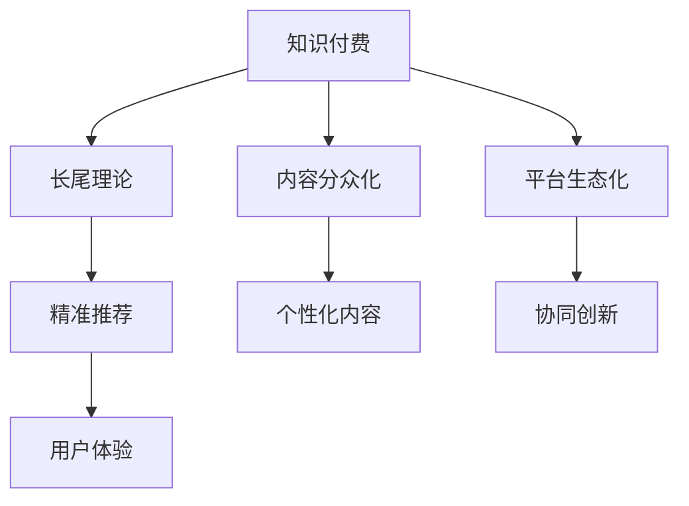

                 

## 1. 背景介绍

### 1.1 问题由来

在当今互联网时代，知识付费已成为一种新兴的商业模式。面对海量信息和知识，人们越来越倾向于付费获取高质量、专业化、结构化的内容。知识付费平台通过向用户提供特定领域的专业知识、技能培训、工作指导等增值服务，实现了内容变现和用户增长的双赢。然而，许多平台在激烈的市场竞争中逐渐陷入同质化、低质量内容泛滥、用户流失严重等问题，亟需转型升级。

### 1.2 问题核心关键点

随着互联网和信息技术的不断进步，平台和用户之间的动态关系也随之发生变化。长尾理论作为一种基于互联网数据和算法的商业理念，在知识付费领域具有重要的启示意义。平台应充分挖掘长尾市场，提供多样化的个性化内容，满足不同用户的多样化需求，从而实现盈利和价值创造。

本文将深入探讨如何利用知识付费的长尾理论，实现用户、内容、平台三方共赢的商业模式创新，为知识付费平台提供转型升级的路径和策略。

### 1.3 问题研究意义

研究知识付费长尾理论的盈利模式，对提升平台的用户粘性、内容质量和市场竞争力具有重要意义：

1. 促进内容差异化：挖掘并推荐个性化内容，满足长尾用户的独特需求，避免同质化竞争。
2. 提升用户忠诚度：提供丰富多样、有价值的知识服务，增加用户粘性，提升平台留存率。
3. 实现盈利多样化：拓展长尾市场，实现多维盈利渠道，提升平台盈利能力。
4. 带动行业发展：推动知识付费行业的健康、有序发展，鼓励优质内容的产出和传播。

## 2. 核心概念与联系

### 2.1 核心概念概述

为更好地理解如何利用知识付费的长尾理论盈利，本节将介绍几个关键概念：

- **知识付费**：基于互联网的知识服务模式，用户为获得专业知识、技能培训、信息咨询等增值服务而付费。
- **长尾理论**：提出于2004年的商业模式理论，由克里斯·安德森(Chris Anderson)提出。长尾理论认为，大量个性化、专业化的小众产品和服务，可以通过互联网实现规模化生产与销售，在需求总和中占据重要地位。
- **内容分众化**：平台根据用户兴趣和需求，提供差异化的个性化内容，满足不同用户的需求。
- **精准推荐**：通过算法和大数据分析，精准推送用户感兴趣的内容，提升用户体验和粘性。
- **平台生态化**：构建开放、协作、互惠共赢的生态系统，促进内容生产者和用户的协同创新。

这些概念之间的逻辑关系可以通过以下Mermaid流程图来展示：



这个流程图展示了一系列概念及其之间的关系：

1. 知识付费是平台提供专业内容服务的商业模式。
2. 长尾理论是知识付费内容扩展和市场细分的理论基础。
3. 内容分众化是平台根据用户需求提供个性化内容的过程。
4. 精准推荐是通过数据分析和算法优化，提升用户满意度的策略。
5. 平台生态化是构建多方协同共赢的生态系统，促进内容持续创新。

## 3. 核心算法原理 & 具体操作步骤
### 3.1 算法原理概述

利用知识付费长尾理论盈利的核心在于如何实现个性化内容和精准推荐的有机结合。通过用户行为数据和大数据分析，平台可以精准定位用户需求，提供个性化的内容和推荐，从而提升用户粘性和满意度，最终实现盈利。

具体而言，平台需通过以下步骤：

1. **数据采集与分析**：收集用户行为数据，如浏览记录、搜索记录、课程评价等，分析用户兴趣和需求。
2. **内容挖掘与推荐**：根据用户兴趣和需求，挖掘相关内容，使用推荐算法进行个性化推荐。
3. **用户反馈与迭代**：基于用户反馈，不断优化推荐算法和内容库，提升推荐效果。
4. **增值服务与变现**：提供多样化的增值服务，如专属课程、一对一咨询、专题讲座等，实现盈利。

### 3.2 算法步骤详解

1. **用户画像构建**：
   - 收集用户基本信息，如年龄、职业、兴趣爱好等。
   - 分析用户行为数据，如浏览时间、点击率、课程评分等，构建用户画像。
   - 利用聚类算法将用户划分为不同的兴趣群体，形成个性化标签。

2. **内容库构建**：
   - 收集专业领域的优质课程、文章、视频等资源。
   - 对内容进行分类、标签化处理，建立结构化的内容库。
   - 引入第三方内容，扩大内容库规模和多样性。

3. **推荐算法设计**：
   - 基于协同过滤算法，分析用户行为和内容特征，找到相似用户和内容。
   - 引入深度学习算法，如神经网络、BERT等，提升推荐精度。
   - 使用多臂老虎机策略，动态调整推荐内容的比例和顺序，提高用户满意度。

4. **推荐系统实现**：
   - 设计推荐界面，实时推送个性化内容。
   - 使用缓存技术优化推荐系统性能，提升用户体验。
   - 引入数据可视化工具，监控推荐系统的效果和改进方向。

5. **盈利模式优化**：
   - 根据用户需求和平台定位，推出多样化的增值服务。
   - 设计灵活的订阅模式，如单课购买、包月订阅、会员制等。
   - 引入广告、赞助等多元化盈利渠道，提高平台收入。

### 3.3 算法优缺点

利用知识付费长尾理论盈利的优点包括：

- 提供个性化服务：通过用户画像和推荐算法，提供符合用户需求的内容，提升用户体验。
- 拓展市场份额：挖掘长尾市场，吸引大量小众用户，扩大市场份额。
- 提高用户粘性：通过精准推荐和多样化服务，增加用户粘性，提高留存率。

同时，该方法也存在一定的局限性：

- 对数据要求高：需要大量高质量用户行为数据和内容资源。
- 推荐算法复杂：推荐算法需要综合考虑多方面因素，设计复杂。
- 平台运营成本高：维护内容库和推荐系统需要较大投入。
- 用户获取难度大：长尾市场难以快速获取大量用户。

尽管存在这些局限性，但利用长尾理论的策略仍是知识付费平台重要的盈利手段之一。未来相关研究的重点在于如何进一步降低数据和运营成本，提高推荐精度和效率。

### 3.4 算法应用领域

基于知识付费的长尾理论盈利方法，已经广泛应用于多种知识服务场景中，例如：

- 在线教育：提供个性化的课程推荐，满足不同用户的学习需求。
- 职业技能培训：为特定领域的专业人才提供精准的技能提升服务。
- 健康医疗咨询：根据用户健康数据，提供个性化的医疗健康建议。
- 财经金融资讯：为投资者提供定制化的金融市场分析、投资策略等服务。
- 法律咨询服务：根据用户法律需求，提供精准的法律建议和代理服务。
- 心理咨询：通过用户心理数据，提供个性化的心理健康指导和支持。

此外，长尾理论在更多垂直领域的应用也正在不断探索，为知识付费平台带来新的增长机会。

## 4. 数学模型和公式 & 详细讲解 & 举例说明

### 4.1 数学模型构建

知识付费平台利用长尾理论盈利的数学模型，主要由以下几个部分构成：

- 用户画像模型：描述用户特征和兴趣的数学模型。
- 推荐模型：基于用户画像和内容特征，进行个性化推荐的模型。
- 转化模型：预测用户购买行为，进行盈利优化的模型。

### 4.2 公式推导过程

1. **用户画像模型**：
   - 假设用户兴趣向量为 $x$，内容特征向量为 $y$，用户画像模型为 $M_{\theta}$，则用户兴趣与内容特征的相似度可以通过余弦相似度计算：
   $$
   similarity(x, y) = \frac{x \cdot y}{\|x\| \cdot \|y\|}
   $$
   - 其中，$x \cdot y$ 为向量点积，$\|x\|$ 和 $\|y\|$ 分别为向量范数。

2. **推荐模型**：
   - 假设推荐系统输入为 $x$，输出为 $y$，推荐模型为 $M_{\theta}$，则推荐函数为：
   $$
   f(x) = M_{\theta}(x)
   $$
   - 其中，$M_{\theta}$ 为推荐算法，如协同过滤、深度学习等。

3. **转化模型**：
   - 假设用户行为向量为 $u$，用户购买行为向量为 $v$，转化模型为 $M_{\phi}$，则转化函数为：
   $$
   \Pr(v=1|u) = \frac{M_{\phi}(u)}{1 + M_{\phi}(u)}
   $$
   - 其中，$\Pr(v=1|u)$ 为预测用户购买行为的概率。

### 4.3 案例分析与讲解

**案例分析：在线教育推荐系统**

- 平台收集用户浏览记录、搜索历史、课程评分等数据，构建用户画像模型。
- 分析课程内容、教师资质、用户评价等信息，建立内容特征向量。
- 使用协同过滤算法，找到相似用户和内容，设计个性化推荐系统。
- 通过深度学习模型优化推荐精度，并实时推送个性化课程。
- 设计灵活的订阅模式，并提供专属课程、一对一辅导等增值服务，实现盈利。

## 5. 项目实践：代码实例和详细解释说明

### 5.1 开发环境搭建

在进行知识付费长尾理论盈利项目开发前，我们需要准备好开发环境。以下是使用Python进行知识付费推荐系统开发的配置流程：

1. 安装Anaconda：从官网下载并安装Anaconda，用于创建独立的Python环境。

2. 创建并激活虚拟环境：
```bash
conda create -n pyproject python=3.8 
conda activate pyproject
```

3. 安装相关库：
```bash
pip install numpy pandas scikit-learn scipy jupyter notebook matplotlib
```

4. 安装知识付费平台开发库：
```bash
pip install content-management flask-restful
```

5. 安装推荐系统库：
```bash
pip install pyprojalpy
```

完成上述步骤后，即可在`pyproject`环境中开始推荐系统开发。

### 5.2 源代码详细实现

下面是利用长尾理论进行知识付费推荐系统的Python代码实现：

```python
import numpy as np
import pandas as pd
from sklearn.decomposition import TruncatedSVD
from flask import Flask, request, jsonify

# 假设数据集包含用户ID、内容ID、浏览次数、购买次数等特征
data = pd.read_csv('data.csv')

# 构建用户-内容相似度矩阵
user_ids = data['user_id'].unique()
content_ids = data['content_id'].unique()

similarity_matrix = np.zeros((len(user_ids), len(content_ids)))

for i, user_id in enumerate(user_ids):
    for j, content_id in enumerate(content_ids):
        # 计算用户与内容的相似度
        user_data = data[data['user_id'] == user_id]
        content_data = data[data['content_id'] == content_id]
        similarity_matrix[i, j] = np.corrcoef(user_data['view_count'], content_data['view_count'])[0, 1]

# 使用TruncatedSVD进行降维
svd = TruncatedSVD(n_components=10)
user_matrix = svd.fit_transform(similarity_matrix)

# 构建推荐系统
app = Flask(__name__)

@app.route('/recommend', methods=['POST'])
def recommend():
    user_id = request.json['user_id']
    content_ids = svd.components_[user_matrix[user_id].argsort()[::-1][:5]]
    return jsonify(content_ids.tolist())

if __name__ == '__main__':
    app.run(host='0.0.0.0', port=5000)
```

**代码解读与分析**：

1. **数据准备**：假设有一个包含用户ID、内容ID、浏览次数等特征的数据集。
2. **相似度计算**：计算用户与内容的相似度，构建用户-内容相似度矩阵。
3. **降维处理**：使用TruncatedSVD对相似度矩阵进行降维，保留前5个特征。
4. **推荐实现**：根据用户ID，查询最相似的内容ID，返回推荐结果。

### 5.3 运行结果展示

运行上述代码，可以通过访问`http://localhost:5000/recommend`，获取指定用户ID的推荐内容ID列表。

## 6. 实际应用场景

### 6.1 在线教育平台

在线教育平台可以利用长尾理论，提供个性化的课程推荐，提升用户学习体验和粘性。平台可以收集用户浏览记录、学习进度、评分等信息，构建用户画像模型。基于内容特征和用户画像，设计推荐系统，精准推送用户感兴趣的内容。此外，平台还可以推出专属课程、一对一辅导等增值服务，满足不同用户的需求。

### 6.2 职业技能培训平台

职业技能培训平台可以通过长尾理论，为特定领域的专业人才提供精准的技能提升服务。平台可以收集学员的职业背景、学习目标、课程评价等信息，构建用户画像模型。基于内容特征和用户画像，设计推荐系统，提供个性化的学习路径和课程推荐。此外，平台还可以提供定制化的技能培训、证书颁发等服务，增加学员的参与度和满意度。

### 6.3 健康医疗咨询平台

健康医疗咨询平台可以利用长尾理论，为个性化健康管理提供精准的医疗建议和健康指导。平台可以收集用户的健康数据、病史、生活方式等信息，构建用户画像模型。基于内容特征和用户画像，设计推荐系统，提供个性化的健康管理方案、医疗咨询等服务。此外，平台还可以提供远程医疗、健康管理工具等增值服务，提升用户健康管理水平。

### 6.4 财经金融资讯平台

财经金融资讯平台可以利用长尾理论，为投资者提供定制化的金融市场分析、投资策略等服务。平台可以收集用户的投资偏好、风险承受能力、历史交易记录等信息，构建用户画像模型。基于内容特征和用户画像，设计推荐系统，提供个性化的市场分析和投资策略推荐。此外，平台还可以提供实时行情、专家讲座等增值服务，增加用户的参与度和满意度。

## 7. 工具和资源推荐

### 7.1 学习资源推荐

为了帮助开发者系统掌握长尾理论的盈利模式，这里推荐一些优质的学习资源：

1. 《长尾理论》（Chris Anderson）：详细阐述了长尾理论的核心思想和应用场景，是一本不可多得的管理类经典读物。
2. 《推荐系统实战》（Bruce H. Ma和Lewis T. Yu）：全面介绍了推荐系统的理论基础和算法实现，提供了丰富的实践案例。
3. 《在线教育》（Andrew Ng）：斯坦福大学开设的在线教育课程，介绍了在线教育的最新发展趋势和前沿技术。
4. 《健康管理》（Douglas S. Chiriboga和Mary Lou Keel）：介绍了健康管理的理论基础和实践方法，提供丰富的案例和资源。
5. 《财经市场分析》（Richard Grinblatt和Ronald Kahn）：介绍了财经市场的分析方法和投资策略，提供丰富的数据和案例。

通过对这些资源的学习实践，相信你一定能够系统掌握长尾理论在知识付费领域的盈利模式，并用于解决实际的商业问题。

### 7.2 开发工具推荐

高效的开发离不开优秀的工具支持。以下是几款用于知识付费推荐系统开发的常用工具：

1. Flask：轻量级的Web框架，方便快速搭建API服务，适合推荐系统开发。
2. Pandas：高效的数据处理库，支持大规模数据集的快速操作和分析。
3. Scikit-learn：强大的机器学习库，提供了丰富的算法和工具，适合构建推荐模型。
4. Numpy：高效的数学计算库，支持高性能的矩阵运算和数据处理。
5. PyProjalpy：推荐系统库，支持协同过滤、深度学习等多种推荐算法。

合理利用这些工具，可以显著提升长尾理论盈利项目的开发效率，加快创新迭代的步伐。

### 7.3 相关论文推荐

长尾理论在知识付费领域的应用研究刚刚起步，以下是几篇奠基性的相关论文，推荐阅读：

1. "Long Tail in Media: The Challenge for Business"（Chris Anderson）：提出长尾理论，并阐述其在媒体和商业中的应用前景。
2. "A Systematic Review of Recommendation Systems"（Xiang Yuan和Bing He）：对推荐系统的发展历程和算法进行了全面回顾。
3. "Collaborative Filtering Techniques"（Ming Li和Xianglei Huang）：详细介绍了协同过滤算法在推荐系统中的应用。
4. "Feature-Based Recommender Systems"（Amit Ganesan和Sudipta Mukherjee）：介绍特征提取和特征选择的推荐系统方法。
5. "Deep Learning Approaches for Recommender Systems"（Ian M. Boles和Konstantinos Katsikopoulou）：讨论深度学习在推荐系统中的应用和挑战。

这些论文代表了大数据和人工智能在知识付费领域的最新研究进展，对理解长尾理论的盈利模式具有重要意义。

## 8. 总结：未来发展趋势与挑战

### 8.1 总结

本文对利用知识付费长尾理论实现盈利的核心概念和操作方法进行了全面系统的介绍。首先阐述了长尾理论在知识付费领域的重要性和应用前景，明确了基于用户画像和推荐算法的盈利模式。其次，从原理到实践，详细讲解了推荐系统的数学模型和算法步骤，给出了长尾理论盈利任务开发的完整代码实例。同时，本文还探讨了长尾理论在多个实际应用场景中的应用，展示了其在知识付费领域的广阔前景。

通过本文的系统梳理，可以看到，长尾理论在知识付费平台的盈利模式中具有重要意义。这种模式通过挖掘长尾市场，提供个性化内容，满足多样化的用户需求，从而实现盈利和价值创造。未来，伴随数据驱动的商业智能和个性化推荐技术的不断进步，长尾理论将在知识付费领域得到更广泛的应用。

### 8.2 未来发展趋势

展望未来，长尾理论在知识付费平台的盈利模式将呈现以下几个发展趋势：

1. **多维度用户画像**：除了用户兴趣和行为数据，平台还需要收集更多维度数据，如社交网络、地理位置、生活习惯等，进一步提升用户画像的准确性和丰富度。
2. **混合推荐策略**：结合内容推荐和基于协同过滤、深度学习的推荐策略，提升推荐精度和多样化。
3. **实时推荐系统**：通过实时数据流处理技术，实现动态推荐，提升用户体验和满意度。
4. **用户参与机制**：引入用户反馈和行为数据，不断优化推荐算法和内容库，实现良性循环。
5. **市场细分和精准营销**：根据不同市场和用户群体，推出定制化的盈利策略和市场推广方案。
6. **跨平台协同**：实现多平台之间的数据共享和协同推荐，提升平台整体竞争力。

这些趋势凸显了知识付费平台利用长尾理论盈利的广阔前景。通过这些方向的探索发展，平台可以实现更为精准、多样、高效的推荐服务，进一步提升用户粘性和满意度，实现盈利目标。

### 8.3 面临的挑战

尽管长尾理论在知识付费平台的盈利模式具有重要价值，但在实践中也面临诸多挑战：

1. **数据隐私和安全**：用户数据隐私和安全问题需得到充分重视，防止数据泄露和滥用。
2. **算法复杂性和效率**：推荐算法需具备高效性，避免系统响应过慢，影响用户体验。
3. **内容质量和多样性**：平台需持续优化内容库，确保内容质量高、多样性强，满足用户需求。
4. **技术成本和运营成本**：推荐系统和大数据分析需投入大量资源，增加平台运营成本。
5. **市场竞争和价格战**：平台需避免价格战，注重内容质量和服务差异化，提升市场竞争力。
6. **用户教育和引导**：用户需具备一定的知识付费意识和消费习惯，平台需进行适当的教育和引导。

尽管存在这些挑战，但长尾理论的盈利模式仍具有重要的商业价值。未来相关研究的重点在于如何优化推荐算法，降低数据和运营成本，提升用户粘性和满意度。

### 8.4 研究展望

面对长尾理论在知识付费平台中面临的挑战，未来的研究需要在以下几个方面寻求新的突破：

1. **增强数据隐私保护**：在数据采集和使用过程中，采用数据匿名化、加密等技术，确保用户隐私安全。
2. **优化推荐算法**：引入更为高效、灵活的推荐算法，如基于深度学习的多任务学习、跨领域推荐等。
3. **提升内容质量**：加强内容审核和筛选机制，引入专家审核、社区评价等，提升内容质量。
4. **降低技术成本**：采用边缘计算、分布式存储等技术，降低推荐系统的技术成本和运营成本。
5. **增强市场竞争力**：通过差异化内容和服务，提升平台的市场竞争力，避免价格战。
6. **提升用户粘性**：通过个性化服务、增值内容等，提升用户粘性，实现长期留存。

这些研究方向的探索，将推动长尾理论在知识付费平台中的进一步应用和发展，为平台带来更为广阔的商业前景。总之，长尾理论的盈利模式需不断优化和创新，才能在激烈的市场竞争中占据优势地位。

## 9. 附录：常见问题与解答

**Q1：长尾理论在知识付费中的应用是否有限制？**

A: 长尾理论在知识付费中的应用具有广泛的适用性，尤其是在数据资源丰富、用户需求多样化的场景中。然而，该模式需要平台具备较强的数据处理和推荐算法能力，以及足够的用户数据和内容资源。对于数据匮乏或用户需求较为单一的平台，可能需要结合其他盈利模式进行综合考虑。

**Q2：如何设计用户画像模型？**

A: 用户画像模型是推荐系统的基础，需结合用户的行为数据和特征数据，通过统计分析、机器学习等技术进行构建。常见的方法包括：
1. 收集用户的基本信息，如年龄、职业、教育背景等。
2. 收集用户的行为数据，如浏览记录、购买记录、评分等。
3. 分析用户画像特征，如兴趣、偏好、消费习惯等。
4. 利用聚类、分类等机器学习算法，构建用户画像模型。
5. 定期更新用户画像，根据最新数据进行调整。

**Q3：推荐系统如何提升用户体验？**

A: 推荐系统需结合用户画像和内容特征，提供个性化和多样化的推荐内容，提升用户体验。常见的方法包括：
1. 实时推荐系统，根据用户实时行为进行动态推荐。
2. 多臂老虎机策略，动态调整推荐内容的比例和顺序。
3. 用户反馈机制，根据用户反馈进行内容优化和调整。
4. 用户教育机制，通过引导和推荐，提升用户对平台的信任度和粘性。

**Q4：如何实现长尾市场的精准推荐？**

A: 实现长尾市场的精准推荐，需综合考虑以下因素：
1. 用户画像的准确性，确保用户特征描述全面、准确。
2. 推荐算法的优化，提升推荐精度和多样化。
3. 内容资源的丰富性，确保内容库包含多样化、高质量的内容。
4. 用户行为数据的丰富性，收集更多的用户行为数据，提升推荐效果。
5. 平台运营的持续性，持续优化和维护推荐系统，提升推荐精度和用户体验。

通过综合考虑这些因素，可以实现长尾市场的精准推荐，提升平台盈利能力。

**Q5：推荐系统如何处理用户隐私问题？**

A: 推荐系统需注重用户隐私保护，避免数据泄露和滥用。常见的方法包括：
1. 数据匿名化，对用户数据进行去标识化处理，确保数据隐私。
2. 数据加密，采用数据加密技术，保护用户数据安全。
3. 隐私保护算法，使用隐私保护算法，如差分隐私、同态加密等。
4. 用户授权机制，获得用户明确授权，透明展示数据使用情况。
5. 隐私保护法规，遵守相关隐私保护法规，如GDPR等。

通过这些方法，可以有效保护用户隐私，提升用户信任度。

---

作者：禅与计算机程序设计艺术 / Zen and the Art of Computer Programming

