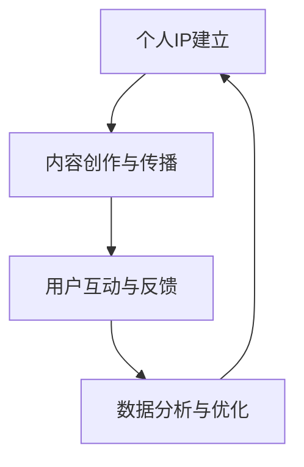

                 

# 如何利用短视频平台建立个人IP

## 1. 背景介绍

随着移动互联网的迅猛发展和社交媒体的崛起，短视频平台已成为展示个人才华、建立个人品牌和影响力最重要的平台之一。通过短视频，个人可以从多个维度展示自己的专业能力、兴趣爱好和个性特质，与观众进行实时互动，增强粘性和忠实度。本文将详细探讨如何利用短视频平台建立个人IP，提升个人品牌价值和市场影响力。

## 2. 核心概念与联系

### 2.1 核心概念概述

- **个人IP（Individual Personal Brand）**：个人品牌，即个人在特定领域内建立起来的独特价值和影响力，通过个人形象、内容输出和市场影响力体现。
- **短视频平台**：如抖音、快手、Bilibili、Instagram Reels等，为个人提供展示才华和建立IP的场所。
- **内容创作与传播**：包括视频内容策划、拍摄、编辑、发布等环节，是建立个人IP的核心。
- **用户互动与反馈**：通过评论、点赞、分享等互动方式，获得用户反馈和支持，进一步优化内容。
- **数据分析与优化**：利用平台提供的分析工具，对视频表现进行跟踪、分析和优化，提升内容质量和曝光度。

### 2.2 核心概念原理和架构的 Mermaid 流程图



## 3. 核心算法原理 & 具体操作步骤

### 3.1 算法原理概述

建立个人IP的过程，本质上是一个内容创作、传播、互动和优化的闭环过程。通过不断创作优质的视频内容，并在短视频平台上进行传播和互动，逐步积累粉丝和品牌影响力。

### 3.2 算法步骤详解

1. **定位与策略制定**：明确个人IP的核心价值和定位，制定内容策略，包括主题、风格、发布频率等。
2. **内容创作**：根据策略进行内容创作，确保内容质量高、创意独特、观众感兴趣。
3. **平台选择与优化**：选择合适的短视频平台，利用平台的特色功能和工具，优化内容展示和互动效果。
4. **发布与传播**：制定合理的发布计划，利用平台的算法特性和推广工具，提高内容的曝光度和观看率。
5. **互动与反馈**：积极与观众互动，回应评论和私信，通过数据分析了解观众需求和偏好，调整内容策略。
6. **数据分析与优化**：利用平台提供的分析工具，跟踪视频表现，分析数据，调整内容创作和发布策略。

### 3.3 算法优缺点

#### 优点

- **快速传播**：短视频形式短小精悍，可以快速传播，吸引大量关注。
- **多维展示**：可以通过视频、直播、图文等多种形式展示个人，提升品牌多样性。
- **互动性强**：观众可以实时互动，提供即时反馈，增强粘性和互动性。
- **低成本高效益**：相比传统广告，短视频传播成本低，但效果显著。

#### 缺点

- **内容质量要求高**：优质内容是吸引观众的关键，需要持续的创作和优化。
- **市场竞争激烈**：短视频平台用户众多，内容同质化现象严重，需要不断创新和优化。
- **数据隐私问题**：短视频平台收集大量用户数据，如何保护隐私和数据安全是一大挑战。

### 3.4 算法应用领域

个人IP建立技术在多个领域得到了广泛应用，包括但不限于：

- **教育培训**：建立专业形象，传授知识，积累粉丝，提升影响力。
- **健康与生活**：分享健康生活方式、饮食、运动等，建立健康生活专家形象。
- **美食与旅游**：展示烹饪技艺、旅行经历，吸引美食和旅游爱好者。
- **时尚与美妆**：分享穿搭、妆容技巧，吸引时尚和美妆爱好者。
- **娱乐与艺术**：展示音乐、舞蹈、绘画等艺术形式，建立独特艺术形象。

## 4. 数学模型和公式 & 详细讲解 & 举例说明

### 4.1 数学模型构建

设个人IP价值为 $V$，内容质量为 $C$，观众互动度为 $I$，数据分析与优化程度为 $A$，则建立个人IP的数学模型为：

$$ V = f(C, I, A) $$

其中 $f$ 表示映射函数。

### 4.2 公式推导过程

通过多元线性回归模型，可以得到个人IP价值的推导公式：

$$ V = \beta_0 + \beta_1 C + \beta_2 I + \beta_3 A + \epsilon $$

其中 $\beta_0$ 为截距，$\beta_1, \beta_2, \beta_3$ 为各个变量的系数，$\epsilon$ 为误差项。

### 4.3 案例分析与讲解

以健康生活博主为例，其内容质量 $C$ 可以通过粉丝增长率、观看时长、点赞率等指标来衡量；观众互动度 $I$ 可以通过评论数量、互动回复率等指标来衡量；数据分析与优化程度 $A$ 可以通过观看量波动、推荐算法优化、广告投放等手段来提升。

## 5. 项目实践：代码实例和详细解释说明

### 5.1 开发环境搭建

- **平台选择**：根据个人定位选择适合的短视频平台，如抖音、快手、Bilibili等。
- **设备配置**：选择高质量的摄像头、麦克风等设备，确保视频和音频效果。
- **软件安装**：安装视频编辑工具如Adobe Premiere、Final Cut Pro等，用于视频编辑和剪辑。

### 5.2 源代码详细实现

```python
# 内容创作与传播
import pyshorteners

def create_content():
    # 使用URL缩短工具生成视频标题
    shortener = pyshorteners()
    title = shortener.tinyurl("https://www.example.com")
    
    # 拍摄视频并上传至平台
    # 上传逻辑依赖平台API，这里仅作示例
    platform = "tiktok"
    response = platform.upload(title, "https://www.example.com")
    print(f"视频{response.id}上传成功！")
    
# 用户互动与反馈
def user_feedback(content_id):
    # 假设视频ID为content_id
    # 获取评论、点赞、分享等反馈数据
    platform = "tiktok"
    feedback = platform.get_feedback(content_id)
    print(f"获取反馈数据：{feedback}")
    
# 数据分析与优化
def data_analysis(content_id):
    # 获取视频播放量、观看时长、点赞率等数据
    platform = "tiktok"
    stats = platform.get_stats(content_id)
    print(f"数据分析结果：{stats}")
    
# 发布与传播
def publish(content_id):
    # 利用平台算法优化发布时间
    platform = "tiktok"
    time_optimized = platform.calculate_optimal_publish_time(content_id)
    print(f"最佳发布时间：{time_optimized}")
    
# 主函数
def main():
    create_content()
    user_feedback("1234567890")
    data_analysis("1234567890")
    publish("1234567890")

if __name__ == "__main__":
    main()
```

### 5.3 代码解读与分析

上述代码展示了在抖音平台上创建、发布、获取反馈和分析视频内容的示例流程。其中，`create_content`函数用于创建视频内容并上传，`user_feedback`函数用于获取观众反馈，`data_analysis`函数用于分析视频数据，`publish`函数用于优化发布时间。

## 6. 实际应用场景

### 6.1 教育培训

在教育培训领域，个人IP可以通过教学视频、教育讲座、经验分享等方式建立。教师可以通过短视频平台传授知识，积累粉丝，提升教学效果。平台提供的互动工具如问答、直播等功能，还可以增加与学生的互动，提升学习体验。

### 6.2 健康与生活

在健康与生活领域，个人IP可以通过健康生活方式、饮食、运动等内容的分享，吸引健康生活的关注者。博主可以通过定期发布健康饮食、运动计划等视频，提升粉丝粘性和品牌影响力。

### 6.3 美食与旅游

在美食与旅游领域，个人IP可以通过展示烹饪技艺、旅行经历等内容，吸引美食和旅游爱好者的关注。视频博主可以通过美食制作、旅游攻略等形式，展示自己的专业知识和丰富经历，建立独特的美食和旅游专家形象。

### 6.4 时尚与美妆

在时尚与美妆领域，个人IP可以通过穿搭、妆容技巧的分享，吸引时尚和美妆爱好者的关注。视频博主可以通过时尚穿搭、美妆教学等内容，展示自己的专业能力和独特风格，建立时尚美妆专家形象。

## 7. 工具和资源推荐

### 7.1 学习资源推荐

1. **《短视频营销实战手册》**：深入浅出地讲解了短视频营销的策略、技巧和案例，适合新手和进阶者学习。
2. **《短视频内容创意与制作》课程**：涵盖短视频内容策划、拍摄、剪辑等全流程，提供系统性学习资源。
3. **Instagram Reels官方指南**：Instagram平台提供的短视频制作和传播指南，适合Instagram Reels用户。
4. **TikTok官方开发者文档**：TikTok平台提供的API接口和开发文档，帮助开发者利用TikTok的商业化功能。
5. **短视频平台社区**：如Bilibili创作者中心、抖音创作者联盟等，提供丰富的学习和交流资源。

### 7.2 开发工具推荐

1. **Adobe Premiere Pro**：视频编辑和剪辑的标准工具，支持多种格式的视频和音频处理。
2. **Final Cut Pro**：苹果设备上的专业视频编辑工具，提供高质量的视频制作功能。
3. **Canva**：在线图形设计工具，提供简易的视频编辑和设计模板。
4. **Shotcut**：开源免费的跨平台视频编辑工具，适合各种设备。
5. **VLC Media Player**：支持多种视频和音频格式，用于视频剪辑和预览。

### 7.3 相关论文推荐

1. **《短视频内容推荐算法研究》**：研究短视频平台的内容推荐算法，提高内容发现效率和用户满意度。
2. **《社交媒体上个人品牌建设的实证研究》**：探讨社交媒体上个人品牌建设的影响因素和优化策略。
3. **《短视频平台内容优化策略》**：分析短视频平台内容优化的关键因素和实际案例。
4. **《短视频传播效果的量化研究》**：利用数据分析工具，量化短视频传播效果，提供优化依据。
5. **《社交媒体平台用户互动行为研究》**：研究用户在社交媒体平台上的互动行为，提升互动效果。

## 8. 总结：未来发展趋势与挑战

### 8.1 研究成果总结

短视频平台作为个人IP建立的重要工具，其影响力和普及度正逐步提升。通过不断创新和优化内容创作与传播、用户互动与反馈、数据分析与优化的各个环节，个人IP可以逐步建立起独特的品牌价值和市场影响力。

### 8.2 未来发展趋势

1. **内容多样化**：随着短视频平台的不断发展和创新，内容形式将更加多样化，包括短视频、直播、图文等多种形式。
2. **社交互动深化**：短视频平台将进一步增强用户互动功能，提升社区粘性和忠诚度。
3. **个性化推荐**：利用大数据和算法技术，提供更加个性化的内容推荐，提升用户体验。
4. **国际化拓展**：短视频平台将向更多国际市场拓展，提升全球影响力。
5. **虚拟现实与增强现实**：结合虚拟现实和增强现实技术，提供沉浸式互动体验，提升用户参与度。

### 8.3 面临的挑战

1. **内容创作瓶颈**：高质量内容创作需要持续的创意和投入，难以持续产出。
2. **市场竞争激烈**：短视频平台用户众多，内容同质化现象严重，难以脱颖而出。
3. **用户互动管理**：如何有效管理和引导用户互动，避免负面评论和攻击，是一大挑战。
4. **数据隐私问题**：短视频平台收集大量用户数据，如何保护隐私和数据安全是一大挑战。
5. **广告监管问题**：短视频平台上的广告和推广活动需要合规监管，避免误导和欺诈。

### 8.4 研究展望

未来的研究应在以下几个方面寻求新的突破：

1. **内容创作自动化**：通过AI技术，自动化生成视频脚本、配乐、特效等，提升创作效率。
2. **个性化推荐算法**：结合用户行为数据，提供更加精准和个性化的内容推荐。
3. **情感计算与分析**：利用情感计算技术，分析用户情感，优化互动策略。
4. **多平台整合**：将短视频内容整合到其他社交平台，提升品牌影响力。
5. **跨领域应用**：将短视频技术应用于更多领域，如教育、健康、旅游等。

## 9. 附录：常见问题与解答

**Q1：如何选择适合自己的短视频平台？**

A: 选择平台时，应考虑个人IP的核心价值和目标受众。如教育培训适合Bilibili，健康生活适合抖音，美食旅游适合快手等。平台特性、用户规模、算法机制等也是选择的重要因素。

**Q2：如何提升视频内容质量？**

A: 提升内容质量的关键在于持续创新和优化。可以通过学习短视频营销手册、参加相关课程、观看优秀案例等方式提升内容创作能力。同时，利用平台提供的编辑工具和模板，提升视频制作效果。

**Q3：如何应对市场竞争？**

A: 应对竞争的关键在于差异化和创新。可以通过研究竞争对手的内容策略，找出差异点和改进空间，持续创新和优化内容。同时，利用平台提供的推广工具，扩大曝光度。

**Q4：如何保护数据隐私？**

A: 保护数据隐私的关键在于合法合规和用户知情。平台提供的隐私政策应仔细阅读并遵守，同时在视频创作和发布时，注意保护用户隐私和个人信息。

**Q5：如何提高用户互动率？**

A: 提高用户互动率的关键在于积极互动和回应。应积极回应评论和私信，利用平台提供的互动工具，增加观众粘性。同时，通过数据分析工具，了解观众需求和偏好，优化互动策略。

---

作者：禅与计算机程序设计艺术 / Zen and the Art of Computer Programming

