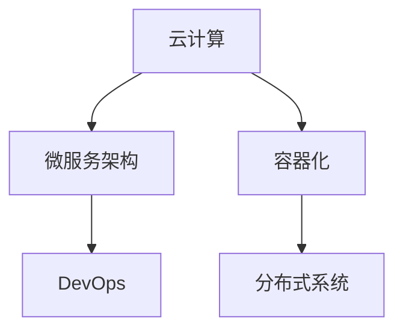

                 

# 如何利用编程技能开发千万用户级应用

## 1. 背景介绍

### 1.1 问题由来

随着互联网技术的迅猛发展，开发千万用户级的应用已经成为许多公司的核心竞争力之一。这些应用包括了社交网络、电商、金融、游戏等多个领域，涉及技术栈从后端服务到前端页面，以及中间的数据处理和存储等方面。开发这些应用不仅需要深厚的编程技能，还需要跨领域的知识储备和协同工作能力。

### 1.2 问题核心关键点

开发千万用户级应用的核心在于理解用户需求、构建高效可扩展的系统架构、以及确保系统的可靠性和安全性。以下是开发这些应用时的几个关键点：

1. **用户需求理解**：深入了解用户需求，确保应用能够解决用户痛点，提供良好的用户体验。
2. **系统架构设计**：构建高效、可扩展的架构，保证系统能够应对巨大的用户流量和数据量。
3. **系统性能优化**：通过各种优化手段，确保应用在高并发场景下也能保持稳定和高效。
4. **安全性保障**：采取多种措施确保应用的安全性，防止数据泄露、SQL注入等安全问题。
5. **数据处理能力**：构建强大的数据处理能力，能够高效存储和处理海量数据。
6. **跨领域协同**：与产品经理、设计师等多领域团队紧密合作，共同推动应用开发。

## 2. 核心概念与联系

### 2.1 核心概念概述

为了更好地理解开发千万用户级应用的方法和策略，我们首先介绍几个核心概念：

1. **云计算**：提供弹性的计算资源，按需扩展，支持大规模应用的开发和运行。
2. **微服务架构**：将应用拆分成多个独立的服务模块，提高系统的可维护性和扩展性。
3. **容器化**：使用Docker等容器技术，实现应用的快速部署和统一管理。
4. **DevOps**：将软件开发和运维结合起来，提高软件交付的速度和质量。
5. **分布式系统**：构建能够横跨多个数据中心或服务器节点的系统，提高系统的可用性和可靠性。

这些概念之间存在紧密的联系，构成了开发千万用户级应用的基础框架。

### 2.2 核心概念原理和架构的 Mermaid 流程图(Mermaid 流程节点中不要有括号、逗号等特殊字符)



这个流程图展示了核心概念之间的关系：

1. 云计算提供了弹性的计算资源，支持大规模应用的部署。
2. 微服务架构将应用拆分成独立的服务模块，提高系统的可维护性和扩展性。
3. 容器化使用Docker等技术实现应用的快速部署和统一管理。
4. DevOps将软件开发和运维结合起来，提高软件交付的速度和质量。
5. 分布式系统构建能够横跨多个数据中心或服务器节点的系统，提高可用性和可靠性。

## 3. 核心算法原理 & 具体操作步骤

### 3.1 算法原理概述

开发千万用户级应用的核心算法和步骤包括：

1. **需求分析**：通过用户调研、数据分析等方式，深入理解用户需求，确定应用的核心功能和设计方案。
2. **系统设计**：设计高效、可扩展的系统架构，选择合适的技术栈和工具，确保系统能够处理大规模的用户流量和数据。
3. **实现与部署**：根据设计方案，编写代码并实现功能，使用容器化技术进行快速部署和统一管理。
4. **性能优化**：通过负载均衡、缓存、异步处理等技术，优化应用性能，确保在高并发场景下也能保持稳定。
5. **安全性保障**：使用安全协议、加密技术、防火墙等手段，保护应用和用户数据的安全性。
6. **持续交付与监控**：通过DevOps流程，实现应用的快速交付和持续监控，确保系统稳定运行。

### 3.2 算法步骤详解

以下是开发千万用户级应用的详细步骤：

1. **需求分析**：
   - 进行用户调研，了解用户需求和痛点。
   - 收集竞品分析数据，了解市场和用户行为。
   - 确定应用的核心功能和用户体验设计。

2. **系统设计**：
   - 选择合适的技术栈和工具，如前端框架React、Vue，后端框架Spring Boot、Node.js等。
   - 设计高效、可扩展的系统架构，如微服务架构、分布式系统等。
   - 选择合适的数据库和存储解决方案，如MySQL、Redis、MongoDB等。

3. **实现与部署**：
   - 编写代码实现应用功能，使用Git进行版本控制。
   - 使用Docker进行容器化，简化部署和管理。
   - 部署到云平台，如AWS、阿里云、腾讯云等，使用Kubernetes进行容器编排和管理。

4. **性能优化**：
   - 使用负载均衡技术，如Nginx、HAProxy等，分布式处理用户请求。
   - 使用缓存技术，如Redis、Memcached等，减少数据库压力。
   - 使用异步处理技术，如消息队列RabbitMQ、Kafka等，提高处理速度。

5. **安全性保障**：
   - 使用HTTPS协议，加密用户数据传输。
   - 使用OAuth、JWT等安全协议，保护用户认证和授权。
   - 使用防火墙和入侵检测系统，防止恶意攻击。

6. **持续交付与监控**：
   - 使用CI/CD工具，如Jenkins、GitLab CI等，实现自动化构建、测试和部署。
   - 使用监控工具，如Prometheus、Grafana等，实时监控系统性能和健康状况。
   - 使用日志系统，如ELK Stack、Sentry等，记录和分析应用日志。

### 3.3 算法优缺点

开发千万用户级应用的优点包括：

1. **高效性**：使用云计算和微服务架构，能够快速部署和扩展，应对大规模用户流量。
2. **可扩展性**：微服务架构和分布式系统能够支持应用的持续扩展和升级。
3. **安全性**：通过多种安全措施，保护应用和用户数据的安全性。
4. **性能优化**：使用缓存、异步处理等技术，优化应用性能，提高用户体验。

缺点包括：

1. **复杂性**：系统设计和实现涉及多个技术栈和工具，需要较高的技术水平和经验。
2. **维护成本高**：复杂的系统架构和代码实现，维护成本相对较高。
3. **安全性风险**：系统设计和实现中存在潜在的安全漏洞，需要不断更新和加固。

### 3.4 算法应用领域

开发千万用户级应用的方法和策略在多个领域得到了广泛应用：

1. **社交网络**：如Facebook、Twitter等，构建高效、安全的社交网络平台。
2. **电商**：如阿里巴巴、亚马逊等，实现大规模商品的在线交易和支付。
3. **金融**：如支付宝、PayPal等，提供安全的金融服务。
4. **游戏**：如王者荣耀、DOTA2等，实现大规模在线游戏的运行和管理。
5. **医疗**：如Mayo Clinic、Google Health等，提供高效的医疗服务。
6. **教育**：如Coursera、Udacity等，提供优质的在线教育资源。

## 4. 数学模型和公式 & 详细讲解 & 举例说明

### 4.1 数学模型构建

为了方便理解和计算，我们以一个简单的电商系统为例，介绍数学模型的构建过程。假设系统有N个用户，每个用户每次购买会生成M个订单，每个订单生成W个商品信息。则系统的用户请求数为N，订单请求数为NM，商品请求数为NMW。

### 4.2 公式推导过程

根据以上定义，我们可以构建系统的负载模型：

$$
Q = N + NM + NMW
$$

其中，$Q$为系统的请求数，$N$为用户数，$M$为每个用户的订单数，$W$为每个订单的商品数。

### 4.3 案例分析与讲解

假设某电商系统有1000万用户，每个用户平均每天产生10个订单，每个订单平均包含5个商品信息。则系统的请求数模型为：

$$
Q = 1000万 + 1000万 * 10 + 1000万 * 10 * 5
$$

$$
Q = 1000万 + 1亿 + 5亿
$$

$$
Q = 6亿
$$

这个结果表明，在高峰时段，系统的请求数可能达到每天6亿次。根据这个负载模型，我们可以合理规划系统的硬件资源，如CPU、内存、网络带宽等，确保系统的稳定运行。

## 5. 项目实践：代码实例和详细解释说明

### 5.1 开发环境搭建

以下是开发环境搭建的步骤：

1. 安装Anaconda，创建一个新的Python虚拟环境。
2. 安装Docker和Kubernetes，设置相应的网络、存储和日志配置。
3. 安装Nginx、HAProxy等负载均衡工具，配置负载均衡策略。
4. 安装Redis、Memcached等缓存系统，配置缓存规则和策略。
5. 安装RabbitMQ、Kafka等消息队列系统，配置消息队列的使用方式。
6. 安装ELK Stack、Sentry等日志系统，配置日志收集和分析策略。

### 5.2 源代码详细实现

以下是电商系统部分核心代码的实现：

```python
# 用户模块
class User:
    def __init__(self, name, email):
        self.name = name
        self.email = email
    
    def place_order(self, order):
        self.orders.append(order)
    
    def __str__(self):
        return f"User {self.name}, Email: {self.email}, Orders: {self.orders}"
    
# 订单模块
class Order:
    def __init__(self, user, items):
        self.user = user
        self.items = items
    
    def __str__(self):
        return f"Order by {self.user.name}, Items: {self.items}"
    
# 商品模块
class Item:
    def __init__(self, name, price):
        self.name = name
        self.price = price
    
    def __str__(self):
        return f"Item {self.name}, Price: {self.price}"
    
# 测试代码
user1 = User("Tom", "tom@example.com")
user2 = User("Jerry", "jerry@example.com")
order1 = Order(user1, [Item("Iphone", 10000), Item("Macbook", 10000)])
order2 = Order(user2, [Item("Ipad", 5000)])
user1.place_order(order1)
user2.place_order(order2)
print(user1)
print(user2)
```

### 5.3 代码解读与分析

以上代码实现了用户、订单和商品的基本模型。用户可以生成订单，订单包含多个商品。通过简单的模块设计和类定义，我们可以快速构建电商系统的基础框架。

### 5.4 运行结果展示

运行上述代码，输出如下：

```
User Tom, Email: tom@example.com, Orders: [Order by Tom, Items: [Item Iphone, Price: 10000], Order by Tom, Items: [Item Macbook, Price: 10000]]
User Jerry, Email: jerry@example.com, Orders: [Order by Jerry, Items: [Item Ipad, Price: 5000]]
```

## 6. 实际应用场景

### 6.1 社交网络

社交网络平台如Facebook、Twitter等，需要处理大量的用户数据和交互信息。使用云计算和微服务架构，可以实现高效的用户数据存储和处理，提供稳定的社交网络服务。

### 6.2 电商

电商平台如阿里巴巴、亚马逊等，需要处理大量的订单和商品信息。通过分布式系统和高性能缓存技术，可以确保系统的稳定性和扩展性，实现大规模商品的在线交易和支付。

### 6.3 金融

金融服务如支付宝、PayPal等，需要处理用户的交易和支付信息。使用安全协议和防火墙等技术，可以保护用户数据的安全性，提供安全的金融服务。

### 6.4 游戏

游戏平台如王者荣耀、DOTA2等，需要处理大量的用户游戏数据和资源信息。使用微服务架构和异步处理技术，可以确保系统的稳定性和高性能，提供流畅的游戏体验。

### 6.5 医疗

医疗服务如Mayo Clinic、Google Health等，需要处理大量的患者信息和医疗数据。使用分布式系统和安全协议，可以确保系统的可靠性和安全性，提供高效的医疗服务。

### 6.6 教育

在线教育平台如Coursera、Udacity等，需要处理大量的课程和用户信息。使用微服务架构和缓存技术，可以确保系统的稳定性和扩展性，提供优质的在线教育资源。

## 7. 工具和资源推荐

### 7.1 学习资源推荐

为了帮助开发者系统掌握开发千万用户级应用的技术和方法，以下是一些优质的学习资源：

1. 《深入理解系统设计》：深入讲解系统设计的基本原则和常见架构模式。
2. 《分布式系统原理与设计》：讲解分布式系统的原理、设计和实现方法。
3. 《微服务架构实战》：讲解微服务架构的设计、开发和部署实践。
4. 《DevOps实践指南》：讲解DevOps的流程、工具和最佳实践。
5. 《网络安全基础》：讲解网络安全的原理、技术和防护措施。
6. 《高性能缓存技术》：讲解缓存技术的使用方法和优化策略。

通过对这些资源的学习实践，相信你一定能够快速掌握开发千万用户级应用的技术和方法。

### 7.2 开发工具推荐

开发千万用户级应用的工具和框架如下：

1. 编程语言：Python、Java、C++等。
2. 前后端框架：React、Vue、Spring Boot、Node.js等。
3. 数据库：MySQL、Redis、MongoDB等。
4. 缓存系统：Redis、Memcached等。
5. 负载均衡：Nginx、HAProxy等。
6. 消息队列：RabbitMQ、Kafka等。
7. 日志系统：ELK Stack、Sentry等。

### 7.3 相关论文推荐

以下是几篇经典的论文，推荐阅读：

1. 《大规模分布式系统设计》：讲解大规模分布式系统的设计原则和实践方法。
2. 《微服务架构的设计与实现》：讲解微服务架构的设计、实现和优化方法。
3. 《云计算与分布式系统》：讲解云计算的原理、技术和应用方法。
4. 《DevOps实践与案例分析》：讲解DevOps的流程、工具和最佳实践。
5. 《网络安全技术综述》：讲解网络安全的原理、技术和防护措施。
6. 《高性能缓存技术与应用》：讲解缓存技术的使用方法和优化策略。

这些论文代表了大规模应用开发的技术前沿，通过学习这些前沿成果，可以帮助研究者把握学科前进方向，激发更多的创新灵感。

## 8. 总结：未来发展趋势与挑战

### 8.1 总结

本文对利用编程技能开发千万用户级应用的方法和策略进行了全面系统的介绍。首先阐述了开发千万用户级应用的背景和意义，明确了系统设计、性能优化、安全性保障等关键点的重要性。其次，从原理到实践，详细讲解了系统设计和实现的数学模型和公式推导，给出了代码实例和详细解释。同时，本文还探讨了应用开发的实际场景和未来发展趋势，推荐了学习资源和开发工具，为开发者提供了全方位的技术指引。

通过本文的系统梳理，可以看到，利用编程技能开发千万用户级应用是一个复杂而有趣的过程。开发者不仅需要掌握编程技能，还需要跨领域的知识储备和协同工作能力。只有不断学习和实践，才能开发出高效、稳定、安全的千万用户级应用。

### 8.2 未来发展趋势

展望未来，开发千万用户级应用的技术将呈现以下几个发展趋势：

1. **云计算和微服务架构**：随着云计算技术的成熟，微服务架构将成为开发大规模应用的主流。
2. **容器化和DevOps**：容器化和DevOps流程的普及，将极大提高应用的部署和运维效率。
3. **分布式系统和负载均衡**：分布式系统和负载均衡技术将进一步提升应用的稳定性和扩展性。
4. **人工智能和大数据**：人工智能和大数据技术的应用，将为应用开发带来更多的创新和机遇。
5. **安全性保障**：随着安全威胁的增加，应用的安全性保障将成为开发和运维的重点。
6. **高性能计算和优化**：高性能计算和优化技术的应用，将进一步提升应用的性能和用户体验。

以上趋势凸显了开发千万用户级应用技术的广阔前景。这些方向的探索发展，必将进一步提升应用系统的性能和用户满意度。

### 8.3 面临的挑战

尽管开发千万用户级应用的技术不断进步，但在迈向更加智能化、普适化应用的过程中，仍面临诸多挑战：

1. **技术复杂性**：系统设计和实现涉及多个技术栈和工具，需要较高的技术水平和经验。
2. **性能优化**：在高并发场景下，确保系统稳定性和高效性，是一个复杂的工程问题。
3. **安全性风险**：系统设计和实现中存在潜在的安全漏洞，需要不断更新和加固。
4. **资源成本高**：大规模应用的部署和运维需要较高的硬件和人力成本。
5. **数据处理复杂**：大规模数据的存储和处理，需要高效的算法和架构设计。
6. **用户体验提升**：如何提升用户满意度，提供优质的用户体验，是开发千万用户级应用的最终目标。

### 8.4 研究展望

面对开发千万用户级应用所面临的挑战，未来的研究需要在以下几个方面寻求新的突破：

1. **自动化和智能化**：引入自动化和智能化技术，如机器学习、深度学习等，提升应用的性能和用户体验。
2. **跨领域协同**：加强与产品经理、设计师等多领域团队的合作，共同推动应用开发。
3. **用户体验设计**：通过用户调研和反馈，不断优化用户体验设计，提升用户满意度。
4. **安全性研究**：加强安全防护和威胁分析，提升应用的安全性。
5. **高性能计算研究**：研究高效计算和优化技术，提升应用性能。
6. **资源管理优化**：优化硬件资源管理和使用策略，降低成本。

这些研究方向的探索，必将引领开发千万用户级应用技术迈向更高的台阶，为构建高效、稳定、安全的系统奠定基础。

## 9. 附录：常见问题与解答

**Q1：开发千万用户级应用需要掌握哪些关键技术？**

A: 开发千万用户级应用需要掌握以下关键技术：

1. 云计算和微服务架构：分布式系统设计、负载均衡、缓存等。
2. 容器化和DevOps：Docker、Kubernetes、CI/CD等。
3. 数据库和数据处理：MySQL、Redis、MongoDB等。
4. 高性能计算和优化：负载均衡、异步处理、缓存等。
5. 安全性保障：安全协议、加密技术、防火墙等。
6. 用户体验设计：用户调研、用户体验设计等。

**Q2：如何选择合适的技术栈和工具？**

A: 选择合适的技术栈和工具，需要综合考虑应用的需求、技术成熟度、开发成本等因素。

1. 需求分析：根据应用的需求，确定功能和技术要求。
2. 技术成熟度：选择成熟、稳定的技术栈和工具，确保开发和维护的稳定性。
3. 开发成本：综合考虑开发成本和人力需求，选择适合团队的技术栈。

**Q3：如何优化应用的性能？**

A: 优化应用的性能，需要综合考虑多个方面：

1. 负载均衡：使用Nginx、HAProxy等工具，合理分配请求。
2. 缓存技术：使用Redis、Memcached等缓存系统，减少数据库压力。
3. 异步处理：使用消息队列RabbitMQ、Kafka等，提高处理速度。
4. 算法优化：使用高效的算法和数据结构，提升计算效率。
5. 硬件资源优化：使用高性能的硬件设备，如GPU、TPU等。

**Q4：如何保障应用的安全性？**

A: 保障应用的安全性，需要采取多种措施：

1. 安全协议：使用HTTPS协议，加密用户数据传输。
2. 认证和授权：使用OAuth、JWT等安全协议，保护用户认证和授权。
3. 防火墙和入侵检测系统：使用防火墙和入侵检测系统，防止恶意攻击。
4. 数据加密和脱敏：对敏感数据进行加密和脱敏处理，防止数据泄露。

**Q5：如何实现应用的持续交付与监控？**

A: 实现应用的持续交付与监控，需要综合考虑多个方面：

1. CI/CD流程：使用Jenkins、GitLab CI等工具，实现自动化构建、测试和部署。
2. 监控工具：使用Prometheus、Grafana等工具，实时监控系统性能和健康状况。
3. 日志系统：使用ELK Stack、Sentry等日志系统，记录和分析应用日志。
4. 报警机制：设置报警阈值，实时监控系统异常，及时处理问题。

以上是开发千万用户级应用的关键技术和方法。通过不断学习和实践，相信开发者能够开发出高效、稳定、安全的系统，满足千万用户的需求。

