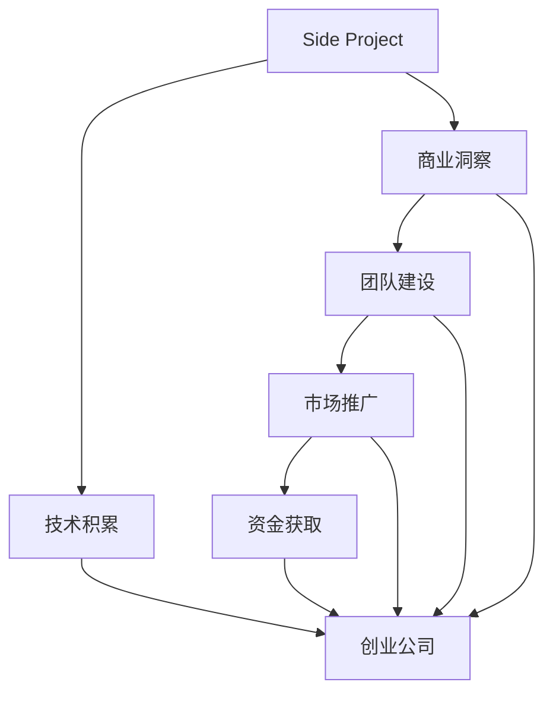

                 

# 如何将Side Project转化为估值上亿的创业公司

## 1. 背景介绍

### 1.1 问题由来
在快速发展的互联网时代，无数的开发者怀揣着梦想，将自己的技术激情倾注于一个个Side Project中。然而，大多数Side Project因缺乏商业化路径而逐渐沉寂。如何将这些有潜力的Side Project转化为估值上亿的创业公司，成为了摆在开发者面前的一大难题。

### 1.2 问题核心关键点
构建一个估值上亿的创业公司，不仅需要技术上的突破，还需要商业模式、市场策略等多方面的综合考量。而将Side Project转化为创业公司的关键在于以下几个核心点：

- **技术积累**：开发者需要在Side Project中积累足够的技术储备，以应对市场变化和需求拓展。
- **商业洞察**：识别市场需求和潜在用户，明确商业目标和价值主张。
- **团队建设**：组建一个高效的团队，具备产品、运营、市场等方面的综合能力。
- **市场推广**：制定有效的市场推广策略，提升品牌知名度和市场占有率。
- **资金获取**：通过合适的融资渠道，获取启动和运营资金，确保公司的可持续发展。

本文将系统探讨如何将Side Project转化为估值上亿的创业公司，从技术、商业、运营等多个维度提供实战指导。

## 2. 核心概念与联系

### 2.1 核心概念概述

为更好地理解Side Project转化的过程，本节将介绍几个密切相关的核心概念：

- **Side Project**：开发者在业余时间开发的小项目或兴趣项目，通常不具备商业化潜力和经济收益。
- **创业公司**：由一群有共同目标的团队成员创立的企业，旨在创造商业价值，并具备持续盈利能力。
- **技术积累**：在Side Project中通过实践积累的技术知识和经验。
- **商业洞察**：对市场、用户和竞争环境的深刻理解，能够识别出潜在商业机会。
- **团队建设**：组建一个多元化的团队，能够覆盖产品开发、市场推广、运营管理等多个方面。
- **市场推广**：通过各类渠道和策略提升品牌知名度和用户增长。
- **资金获取**：通过投资者、贷款、众筹等方式获取启动和运营资金。

这些核心概念之间的逻辑关系可以通过以下Mermaid流程图来展示：



这个流程图展示了一个Side Project转化为创业公司的全过程：

1. 通过Side Project积累技术基础。
2. 识别商业机会，形成商业洞察。
3. 组建多元化的团队，实现团队建设。
4. 制定市场推广策略，实现市场推广。
5. 通过多种渠道获取启动资金，实现资金获取。
6. 最终形成创业公司，推动业务发展。

## 3. 核心算法原理 & 具体操作步骤
### 3.1 算法原理概述

将Side Project转化为创业公司的过程，本质上是一个从技术到商业、从愿景到实行的综合优化过程。其核心思想是：通过系统的商业策划和精心的市场推广，将技术积累转化为可行的商业模式，从而实现公司的商业价值最大化。

### 3.2 算法步骤详解

#### 3.2.1 技术评估和整合

1. **评估技术优势**：
   - 评估当前Side Project的核心技术和功能，识别其技术优势和创新点。
   - 分析技术的市场需求和潜在用户，判断其商业化潜力和市场前景。

2. **整合技术资源**：
   - 梳理和整合Side Project中的代码、数据和文档，形成完整的技术文档库。
   - 评估现有技术的稳定性和扩展性，确保技术的可靠性和可维护性。

3. **技术团队组建**：
   - 招募具备相关技术背景的开发者和工程师，组成技术团队。
   - 明确技术团队的职责和分工，形成高效协作的技术开发机制。

#### 3.2.2 商业模型设计

1. **市场需求分析**：
   - 调研市场环境，了解目标用户群体和潜在需求。
   - 识别市场上的竞争者和替代产品，评估自身的竞争优势。

2. **价值主张制定**：
   - 明确产品的独特卖点和核心价值，形成清晰的产品价值主张。
   - 设计差异化策略，确保产品在市场中具有独特的竞争优势。

3. **盈利模式选择**：
   - 根据市场需求和用户行为，选择适当的盈利模式，如订阅制、按需付费等。
   - 制定详细的收益分配方案，确保公司的长期可持续性。

#### 3.2.3 团队建设和管理

1. **多元化团队组建**：
   - 根据市场需求和产品定位，组建多元化的团队，包括产品经理、市场经理、运营经理等。
   - 明确团队成员的职责和目标，形成高效的团队协作机制。

2. **企业文化建设**：
   - 建立积极向上的企业文化，鼓励创新和合作。
   - 制定明确的企业价值观和行为准则，形成良好的团队氛围。

3. **绩效考核机制**：
   - 设计合理的绩效考核机制，激励团队成员的工作积极性。
   - 定期进行团队绩效评估，确保团队成员的持续成长和进步。

#### 3.2.4 市场推广和营销

1. **品牌建设**：
   - 设计具有吸引力的品牌标识和口号，提升品牌知名度。
   - 利用社交媒体、博客等渠道，传播品牌价值和产品信息。

2. **用户获取**：
   - 制定用户获取策略，通过广告投放、SEO优化等方式吸引潜在用户。
   - 提供免费试用或体验版，吸引用户注册和使用。

3. **用户留存**：
   - 设计用户留存机制，通过定期推送内容和更新功能，保持用户粘性。
   - 建立用户反馈机制，及时响应用户需求和问题。

#### 3.2.5 资金获取和投资

1. **资金需求分析**：
   - 评估公司运营所需的启动资金和运营资金，制定详细的资金需求计划。
   - 识别潜在的投资渠道，如天使投资、风险投资、众筹等。

2. **投资者关系管理**：
   - 制作详细的商业计划书和投资提案，明确公司的商业模式和未来规划。
   - 积极与投资者沟通，建立良好的投资者关系。

3. **融资策略实施**：
   - 根据公司的发展阶段和市场状况，选择最适合的融资渠道。
   - 制定详细的融资计划，确保资金的合理使用和公司的发展方向一致。

### 3.3 算法优缺点

将Side Project转化为创业公司的算法具有以下优点：

1. **充分利用技术积累**：通过评估和整合技术资源，可以充分利用Side Project中的技术积累，减少研发时间和成本。
2. **快速进入市场**：通过系统的商业策划和市场推广，可以迅速进入市场，获取用户和市场反馈。
3. **多元化团队合作**：通过组建多元化的团队，可以综合利用各领域的专长，提升产品的竞争力和市场适应性。

同时，该算法也存在一定的局限性：

1. **高风险性**：创业公司面临市场、技术和竞争等多重风险，失败的可能性较大。
2. **资金需求高**：创业公司需要大量启动资金和运营资金，对投资者的依赖性较大。
3. **市场变化快**：市场需求和技术环境变化迅速，需要快速调整策略以适应变化。
4. **团队管理复杂**：多元化团队的协作和管理较为复杂，需要良好的沟通和协调机制。

尽管存在这些局限性，但就目前而言，将Side Project转化为创业公司的方法仍然是最为可行和高效的方式之一。未来相关研究的重点在于如何进一步降低创业公司的风险，提高市场适应性和团队协作效率。

### 3.4 算法应用领域

将Side Project转化为创业公司的方法已经在诸多领域得到了应用，例如：

- **互联网应用**：基于Side Project开发的社交媒体、电子商务、在线教育等应用。
- **软件工具**：开发各种开发工具、数据分析工具、自动化工具等。
- **移动应用**：开发各种移动端应用，如游戏、社交、教育等。
- **硬件设备**：基于Side Project开发的智能硬件设备，如智能家居、智能穿戴等。
- **AI技术**：基于Side Project开发的机器学习、自然语言处理、计算机视觉等AI技术。

除了上述这些领域外，随着技术的发展和市场的变化，将Side Project转化为创业公司的应用场景也将不断拓展，为创新创业带来更多的可能性。

## 4. 数学模型和公式 & 详细讲解 & 举例说明

### 4.1 数学模型构建

将Side Project转化为创业公司的过程，可以通过数学模型进行量化和优化。我们引入投资回报率(ROI)作为衡量指标，来量化创业公司的投资效益。

设公司初期投资为 $C$，预期年收益为 $R$，则投资回报率（ROI）定义为：

$$
ROI = \frac{R}{C}
$$

其中 $R$ 可以进一步分解为总收益 $T$ 和运营成本 $O$ 的差值：

$$
R = T - O
$$

### 4.2 公式推导过程

1. **初期投资估算**：
   - 根据公司所需的技术资源、办公场地、人员薪资等，估算初期的启动资金。
   - 计算各项成本的支出，包括设备采购、软件开发、市场推广等。

2. **预期收益计算**：
   - 根据市场需求和用户反馈，估算年度总收益。
   - 考虑公司运营成本，包括人员薪资、办公场地、设备维护等。

3. **ROI计算**：
   - 利用公式计算公司的投资回报率。
   - 根据ROI值，判断公司是否具备投资价值。

### 4.3 案例分析与讲解

假设一个Side Project开发了一个在线教育平台，预计初期投资为 $C = 100万美元，年运营成本为 $O = 50万美元。根据市场调研，平台预计年收益为 $T = 200万美元。

则：
$$
R = T - O = 200 - 50 = 150（万美元）
$$
$$
ROI = \frac{R}{C} = \frac{150}{100} = 1.5
$$

这个案例说明，如果平台能够实现预期的年收益，其投资回报率将达到150%，具有较高的投资价值。

## 5. 项目实践：代码实例和详细解释说明

### 5.1 开发环境搭建

在将Side Project转化为创业公司的过程中，开发环境搭建至关重要。以下是使用Python进行开发的环境配置流程：

1. 安装Anaconda：从官网下载并安装Anaconda，用于创建独立的Python环境。
2. 创建并激活虚拟环境：
```bash
conda create -n project-env python=3.8 
conda activate project-env
```

3. 安装必要的Python库和工具：
```bash
pip install numpy pandas matplotlib sklearn tensorflow pytorch transformers
```

4. 安装相关依赖：
```bash
pip install Flask gunicorn requests
```

5. 配置环境变量和数据库连接：
```bash
export FLASK_APP=app.py
export FLASK_ENV=development
```

完成上述步骤后，即可在`project-env`环境中开始项目开发。

### 5.2 源代码详细实现

下面以一个简单的在线教育平台为例，给出使用Flask进行开发的全过程。

首先，定义Flask应用：

```python
from flask import Flask

app = Flask(__name__)

@app.route('/')
def home():
    return 'Hello, World!'

if __name__ == '__main__':
    app.run(debug=True)
```

然后，定义数据模型：

```python
from flask_sqlalchemy import SQLAlchemy
from flask_marshmallow import Marshmallow

db = SQLAlchemy(app)
ma = Marshmallow(app)

class User(db.Model):
    id = db.Column(db.Integer, primary_key=True)
    name = db.Column(db.String(100), nullable=False)
    email = db.Column(db.String(120), unique=True, nullable=False)

class UserSchema(ma.SQLAlchemyAutoSchema):
    class Meta:
        model = User
        fields = ['id', 'name', 'email']

user_schema = UserSchema()
users_schema = UserSchema(many=True)

def get_user(user_id):
    user = User.query.get_or_404(user_id)
    return user_schema.jsonify(user)

def get_users():
    users = User.query.all()
    result = users_schema.dump(users)
    return result.jsonify()

if __name__ == '__main__':
    app.run(debug=True)
```

接着，定义路由：

```python
from flask import jsonify, request

@app.route('/users', methods=['GET'])
def get_all_users():
    all_users = User.query.all()
    result = users_schema.dump(all_users)
    return jsonify(result)

@app.route('/users', methods=['POST'])
def add_user():
    name = request.json['name']
    email = request.json['email']
    new_user = User(name=name, email=email)
    db.session.add(new_user)
    db.session.commit()
    return user_schema.jsonify(new_user)

if __name__ == '__main__':
    app.run(debug=True)
```

最后，启动Flask应用：

```bash
export FLASK_APP=app.py
flask run --host=0.0.0.0 --port=5000
```

在浏览器中访问 `http://localhost:5000`，即可看到 `Hello, World!` 的输出。

### 5.3 代码解读与分析

让我们再详细解读一下关键代码的实现细节：

**Flask应用定义**：
- 通过 `Flask` 类创建应用实例 `app`。
- 定义路由 `@app.route('/')`，指定根路径，返回 `Hello, World!`。
- 通过 `if __name__ == '__main__':` 条件判断，启动应用。

**数据模型定义**：
- 通过 `SQLAlchemy` 和 `Flask-Marshmallow` 定义数据模型 `User`，并使用 `SQLAlchemyAutoSchema` 自动生成序列化和反序列化函数。
- 定义 `UserSchema`，用于将数据库中的数据转换为JSON格式。

**路由定义**：
- 通过 `@app.route('/users', methods=['GET'])` 定义获取所有用户的路由，查询数据库中的所有用户数据，并使用 `users_schema` 将其转换为JSON格式。
- 通过 `@app.route('/users', methods=['POST'])` 定义添加用户的路由，从请求中获取 `name` 和 `email`，创建新的用户记录，并保存到数据库中。

可以看到，通过Flask框架，我们可以简洁高效地搭建一个在线教育平台，实现用户管理等功能。开发者可以根据实际需求，添加更多的路由和功能模块，快速构建自己的创业公司。

### 5.4 运行结果展示

在启动Flask应用后，在浏览器中访问 `http://localhost:5000/users`，即可看到所有用户的列表展示。

## 6. 实际应用场景

### 6.1 智能家居系统

基于Side Project的智能家居系统，能够通过物联网技术，实现对家庭设备的远程控制和管理。通过将现有家庭设备的智能化升级，智能家居系统可以提高家庭生活的便利性和安全性，为用户提供更加舒适的生活体验。

在技术实现上，可以开发一个基于Web的智能家居管理平台，用户可以通过网页或手机App，远程控制灯光、空调、安防等设备，实现一键控制、语音控制等智能功能。

### 6.2 在线医疗平台

基于Side Project的在线医疗平台，能够提供线上咨询、电子病历、远程诊疗等服务，有效缓解医疗资源不足的问题，提升医疗服务的可及性和效率。

在技术实现上，可以开发一个在线医疗平台，医生和患者可以通过平台进行在线咨询、诊断和治疗。平台能够集成电子病历系统，提供病历共享和数据记录功能。同时，平台可以通过AI技术，实现病情预测和智能推荐，提升医疗服务质量。

### 6.3 自动驾驶技术

基于Side Project的自动驾驶技术，能够实现车辆的智能驾驶功能，提升驾驶安全和效率。通过将现有车辆与自动驾驶系统集成，可以实现自动泊车、智能导航、自动避障等功能。

在技术实现上，可以开发一个自动驾驶系统，利用摄像头、雷达、激光雷达等传感器，实时采集周围环境信息，并通过AI算法进行分析和决策。系统可以集成导航和路径规划功能，实现自动驾驶功能。

### 6.4 未来应用展望

随着Side Project技术的不断发展和成熟，未来将有更多创新的应用场景涌现。

- **智慧农业**：通过物联网和AI技术，实现农业生产的自动化和智能化。平台可以集成传感器、摄像头、无人机等设备，实时监测农作物生长情况，提供精准施肥和灌溉建议。

- **智慧城市**：基于Side Project的智慧城市平台，可以实现交通管理、环境监测、公共安全等功能，提升城市治理效率和居民生活质量。平台可以集成智能交通管理系统、智能安防系统等，实现城市运行状态的全面监控和优化。

- **智能教育**：通过在线教育平台，实现个性化教学和学习，提升教育质量和效率。平台可以集成智能推荐系统，根据学生的学习行为和知识掌握情况，提供个性化的学习资源和指导。

- **智能客服**：基于Side Project的智能客服系统，可以实现24小时在线服务，提升客户服务质量。平台可以集成自然语言处理技术和知识库，实现智能客服机器人，自动解答客户咨询和问题。

## 7. 工具和资源推荐

### 7.1 学习资源推荐

为了帮助开发者系统掌握将Side Project转化为创业公司的技术基础和实践技巧，这里推荐一些优质的学习资源：

1. **Flask官方文档**：Flask官方文档提供了详细的教程和示例，帮助开发者快速上手Flask框架，实现Web应用开发。
2. **Python Web开发实战**：《Python Web开发实战》一书，详细介绍了Python Web开发的技术栈和实践经验，包括Flask、Django等框架的使用。
3. **创业公司成功案例**：《零到一》一书，记录了Y Combinator孵化的优秀创业公司的发展历程和成功经验，为创业公司提供借鉴。
4. **商业分析与投资**：《精益创业》一书，介绍了精益创业的理念和方法，帮助创业者在项目开发过程中进行有效的市场验证和优化。

通过对这些资源的学习实践，相信你一定能够快速掌握将Side Project转化为创业公司的精髓，并用于解决实际的创业问题。

### 7.2 开发工具推荐

高效的开发离不开优秀的工具支持。以下是几款用于将Side Project转化为创业公司的常用工具：

1. **Git**：版本控制系统，方便代码的管理和协作。
2. **Jupyter Notebook**：交互式编程环境，支持Python、R等语言，便于快速迭代和实验。
3. **Docker**：容器化技术，便于应用程序的打包和部署。
4. **Kubernetes**：容器编排工具，支持大规模应用的自动化部署和管理。
5. **Google Colab**：谷歌提供的免费Jupyter Notebook服务，支持GPU和TPU计算资源，便于高性能计算和实验。

合理利用这些工具，可以显著提升Side Project转化为创业公司的开发效率，加快创新迭代的步伐。

### 7.3 相关论文推荐

Side Project转化的研究源于学界的持续探索。以下是几篇奠基性的相关论文，推荐阅读：

1. **The Lean Startup**：埃里克·莱斯（Eric Ries）的《精益创业》，介绍了精益创业的理念和方法，为创业者提供了系统化的实践指导。
2. **The Innovation Press**：德鲁克（Peter Drucker）的《创新者的窘境》，分析了技术创新和管理创新的关系，为创业者提供了宝贵的战略思考。
3. **Zero to One**：彼得·蒂尔（Peter Thiel）的《零到一》，记录了Y Combinator孵化的优秀创业公司的发展历程和成功经验，为创业者提供了丰富的案例和借鉴。

这些论文代表了Side Project转化研究的前沿，为创业者提供了系统的理论基础和实践指导。

## 8. 总结：未来发展趋势与挑战

### 8.1 总结

本文对将Side Project转化为创业公司的方法进行了全面系统的介绍。首先阐述了Side Project转化的背景和意义，明确了从技术到商业、从愿景到实行的综合优化过程。其次，从技术评估、商业模型设计、团队建设、市场推广等多个维度，详细讲解了将Side Project转化为创业公司的具体操作步骤。同时，本文还广泛探讨了Side Project转化的实际应用场景，展示了其在多个领域的潜在价值。最后，本文精选了相关的学习资源和开发工具，力求为读者提供全方位的技术指引。

通过本文的系统梳理，可以看到，将Side Project转化为创业公司的方法已经在多个领域得到了应用，为创业公司的发展提供了新的方向和思路。未来，伴随技术的不断进步和市场的不断变化，Side Project转化方法还将迎来更多的创新和突破。

### 8.2 未来发展趋势

展望未来，Side Project转化为创业公司的方法将呈现以下几个发展趋势：

1. **技术融合加速**：随着AI、区块链、物联网等技术的不断发展，Side Project将越来越多地融合这些前沿技术，提升产品竞争力。
2. **市场导向明确**：Side Project转化过程中将更加注重市场调研和用户反馈，确保产品符合市场需求。
3. **团队协作优化**：通过敏捷开发、DevOps等方法，提升团队协作效率，缩短产品开发周期。
4. **商业模型创新**：探索新的盈利模式和市场策略，如共享经济、订阅制、免费增值等，提升商业模式的多样性和可持续性。
5. **数据驱动决策**：利用大数据和机器学习技术，进行精准的市场预测和用户分析，指导产品开发和市场推广。

这些趋势将推动Side Project转化方法迈向更高的层次，为创业者提供更加多样化的选择和更加高效的转化路径。

### 8.3 面临的挑战

尽管将Side Project转化为创业公司的方法已经取得了初步成果，但在迈向更加智能化、普适化应用的过程中，它仍面临着诸多挑战：

1. **技术难度高**：Side Project转化为创业公司涉及技术、市场、管理等多方面的综合优化，技术难度较高。
2. **市场竞争激烈**：随着互联网的发展，市场竞争日益激烈，如何突出自身优势，赢得用户信任，成为一大难题。
3. **资源限制**：创业初期面临资金、人才、时间等资源限制，如何快速获取和利用资源，成为关键问题。
4. **团队协作问题**：多元化团队的协作和管理较为复杂，需要良好的沟通和协调机制。
5. **用户获取困难**：如何有效地获取和留存用户，提升品牌知名度，成为创业公司面临的普遍挑战。

尽管存在这些挑战，但通过不断的探索和优化，相信Side Project转化方法必将克服这些难题，为创业者提供更加可靠和高效的工具。未来，伴随技术的进步和市场的变化，Side Project转化方法还将迎来更多的创新和突破，为创业者带来更多的机遇和挑战。

### 8.4 研究展望

面对Side Project转化面临的种种挑战，未来的研究需要在以下几个方面寻求新的突破：

1. **快速原型开发**：通过敏捷开发、快速迭代等方法，快速构建产品原型，进行市场验证，缩短产品开发周期。
2. **用户导向设计**：深入理解用户需求和痛点，进行用户导向的产品设计，提升用户体验和满意度。
3. **技术基础设施优化**：通过云计算、容器化等技术，优化技术基础设施，提升系统的稳定性和可扩展性。
4. **商业模型创新**：探索新的商业模型，如SaaS、B2B、B2C等，提升公司的收入和市场占有率。
5. **数据智能应用**：利用大数据和机器学习技术，进行精准的市场预测和用户分析，指导产品开发和市场推广。

这些研究方向的探索，将引领Side Project转化方法迈向更高的台阶，为创业者提供更加多样化的选择和更加高效的工具。只有勇于创新、敢于突破，才能不断拓展Side Project的边界，推动技术创新和产业升级。

## 9. 附录：常见问题与解答

**Q1：Side Project如何评估其商业化潜力？**

A: Side Project的商业化潜力可以通过以下几个方面进行评估：
1. **市场需求分析**：调研目标市场，了解潜在用户的需求和痛点。
2. **竞品分析**：分析市场上的竞争对手和替代产品，评估自身的竞争优势。
3. **用户反馈**：收集目标用户的反馈和意见，验证产品是否真正满足用户需求。

**Q2：如何将Side Project转化为创业公司的商业模型？**

A: 将Side Project转化为创业公司的商业模型，需要以下步骤：
1. **需求分析**：深入了解市场和用户需求，明确产品的价值主张。
2. **收益计算**：估算产品运营成本和收益，制定合理的定价策略。
3. **盈利模式选择**：根据市场需求和用户行为，选择适当的盈利模式，如订阅制、按需付费等。
4. **商业计划书**：制作详细的商业计划书，明确公司的商业模式和未来规划。

**Q3：创业公司如何获取用户和市场份额？**

A: 创业公司可以通过以下几种方式获取用户和市场份额：
1. **市场推广**：通过广告投放、SEO优化等方式提升品牌知名度和用户获取。
2. **用户获取策略**：设计免费试用、优惠券、用户推荐等策略，吸引潜在用户。
3. **用户留存机制**：设计用户留存机制，通过定期推送内容和更新功能，保持用户粘性。

**Q4：如何组建高效的多元化团队？**

A: 组建高效的多元化团队，需要以下步骤：
1. **明确职责分工**：根据市场需求和产品定位，明确团队成员的职责和目标。
2. **招聘和培训**：招募具备相关技术背景和市场经验的人才，并进行系统的培训和指导。
3. **激励机制**：设计合理的激励机制，激励团队成员的工作积极性和创新能力。

**Q5：如何确保创业公司可持续发展？**

A: 确保创业公司可持续发展，需要以下措施：
1. **资金管理**：合理规划和管理资金，确保公司的运营和发展。
2. **技术积累**：持续进行技术创新和优化，保持公司的竞争力。
3. **市场拓展**：积极拓展新市场和客户，提升市场占有率。

这些常见问题的解答，可以帮助创业者更好地理解Side Project转化的各个环节，快速构建具有商业价值的创业公司。

---

作者：禅与计算机程序设计艺术 / Zen and the Art of Computer Programming

