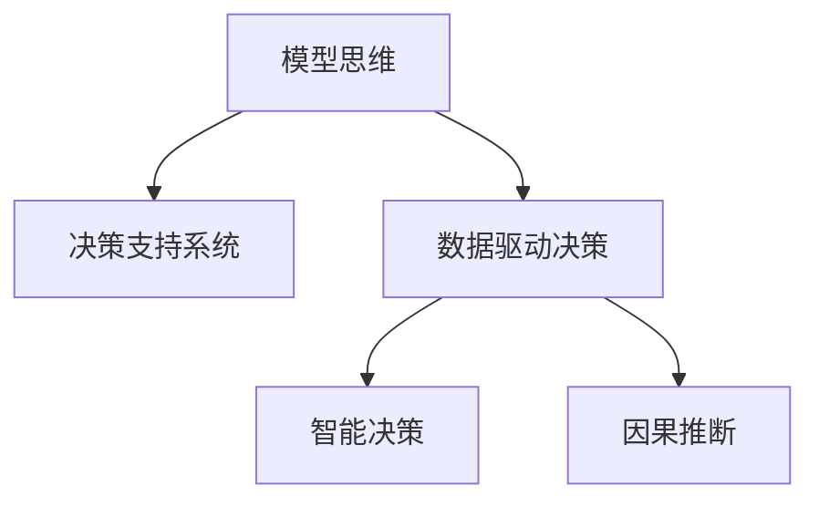
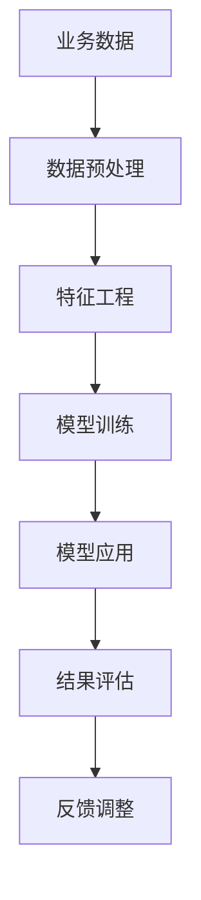

                 

## 1. 背景介绍

在现代企业中，数据驱动的决策变得越来越重要。随着大数据和人工智能技术的发展，许多企业在各个环节上部署了数据驱动的智能决策系统。但这些系统往往由数据科学家和工程师设计开发，业务人员对其中的技术原理和计算模型知之甚少，导致业务与技术的脱节。如何通过模型思维，将人工智能技术和实际管理需求结合起来，建立有效的智能决策支持系统，成为当下的一大挑战。

## 2. 核心概念与联系

### 2.1 核心概念概述

为更好地理解如何将模型思维应用于实际管理，本节将介绍几个关键概念：

- **模型思维**：将问题转化为数学或计算模型，通过算法和数据处理的方式解决实际问题的思维方式。模型思维广泛应用于机器学习、数据科学、系统工程等技术领域。

- **决策支持系统**：基于数据和模型分析，辅助决策者做出更优决策的技术系统。常见的决策支持系统包括业务智能(BI)系统、客户关系管理(CRM)系统、供应链管理系统等。

- **数据驱动决策**：通过数据分析和模型计算，辅助管理决策过程，提高决策的科学性和效率。数据驱动决策在企业运营、市场营销、客户管理等多个环节中得到广泛应用。

- **智能决策**：结合机器学习、自然语言处理、计算机视觉等人工智能技术，自动分析和预测业务场景中的复杂问题，辅助管理人员做出快速准确的决策。

- **因果推断**：研究因果关系和影响机制的统计学习方法，通过分析数据中的因果关系，建立模型来预测和解释不同因素之间的影响。

这些概念之间的逻辑关系可以通过以下Mermaid流程图来展示：



这个流程图展示了模型思维与实际管理的几个关键联系点：

1. 模型思维可以辅助构建决策支持系统。
2. 数据驱动决策和智能决策都是模型思维的应用实例。
3. 因果推断是建立模型关系的重要手段。

### 2.2 核心概念原理和架构的 Mermaid 流程图



这个流程图展示了从业务数据到模型应用的完整过程：

1. 收集和整理业务数据，进行预处理。
2. 提取和构建有意义的特征。
3. 选择合适的模型进行训练。
4. 将训练好的模型应用于实际业务场景。
5. 对模型输出进行评估和验证。
6. 根据反馈调整模型和应用策略。

## 3. 核心算法原理 & 具体操作步骤

### 3.1 算法原理概述

模型思维的核心是利用算法和数据处理的方式解决实际问题。在企业管理中，模型思维的应用一般包括以下几个步骤：

1. **数据收集与预处理**：收集相关业务数据，并对其进行清洗、整理和规范化，为后续分析打下基础。

2. **特征工程**：通过特征提取和特征选择，将原始数据转换为模型所需输入，提升模型性能。

3. **模型选择与训练**：选择合适的模型，并用业务数据进行训练，得到可解释的模型参数。

4. **模型评估与优化**：使用实际数据评估模型性能，根据评估结果对模型进行调优，提升预测准确率。

5. **模型应用与反馈**：将训练好的模型应用于实际管理决策，并根据反馈数据调整模型和策略。

### 3.2 算法步骤详解

下面以**销售预测**任务为例，详细介绍模型思维在实际管理中的应用步骤。

**Step 1: 数据收集与预处理**

- **数据来源**：从销售记录、市场调研、财务报告等渠道收集销售数据。
- **数据清洗**：删除重复数据，处理缺失值，确保数据的完整性和准确性。
- **数据标准化**：将时间、价格等变量转换为标准格式，方便后续处理。

**Step 2: 特征工程**

- **特征提取**：提取重要的业务特征，如销售时间、价格、促销活动、销售渠道等。
- **特征编码**：将文本特征转换为数字编码，便于模型处理。
- **特征选择**：使用统计方法或算法选择最相关的特征，减少过拟合风险。

**Step 3: 模型选择与训练**

- **模型选择**：根据业务需求选择合适的预测模型，如线性回归、决策树、随机森林、神经网络等。
- **模型训练**：使用历史数据进行模型训练，得到模型参数。

**Step 4: 模型评估与优化**

- **模型评估**：使用实际数据评估模型预测性能，计算评估指标如均方误差(MSE)、平均绝对误差(MAE)等。
- **模型优化**：根据评估结果，调整模型参数，如学习率、正则化强度等，提升模型性能。

**Step 5: 模型应用与反馈**

- **模型部署**：将训练好的模型部署到实际管理系统中，用于销售预测。
- **反馈调整**：根据系统反馈的数据，调整模型参数，优化预测结果。

### 3.3 算法优缺点

模型思维在企业管理中的应用具有以下优点：

1. **科学决策**：模型思维能够通过数据驱动的方式，提高决策的科学性和准确性。
2. **可量化分析**：模型能够将复杂问题量化，便于进行定量的分析和评估。
3. **自动化运营**：模型自动化处理数据和计算，提高管理效率。

同时，模型思维也存在一些局限性：

1. **依赖高质量数据**：模型性能很大程度上取决于数据质量，数据偏差可能导致模型预测不准确。
2. **模型复杂度高**：复杂模型可能需要大量数据进行训练，且难以解释。
3. **模型易受影响**：模型依赖于历史数据，当业务环境发生变化时，模型性能可能下降。
4. **过度依赖技术**：过度依赖技术可能导致业务人员忽略实际管理经验，影响决策质量。

### 3.4 算法应用领域

模型思维在企业管理中的应用领域非常广泛，包括但不限于以下几个方面：

- **销售预测**：通过历史销售数据和市场趋势，预测未来销售业绩，帮助企业制定销售策略。
- **库存管理**：预测产品需求，优化库存水平，减少库存成本。
- **客户细分**：使用聚类和分类模型，将客户分为不同细分市场，进行针对性营销。
- **信用评估**：利用机器学习模型，评估客户信用风险，制定信用政策。
- **供应链优化**：分析供应链数据，优化物流和库存管理，提升供应链效率。
- **人力资源管理**：预测员工绩效，制定人才发展策略，优化人力资源配置。

## 4. 数学模型和公式 & 详细讲解 & 举例说明

### 4.1 数学模型构建

模型思维在企业管理中的应用，离不开数学模型的构建和计算。以销售预测为例，常见的数学模型包括线性回归、时间序列模型、决策树等。

- **线性回归**：假设销售量 $Y$ 与时间 $X$ 线性相关，模型为 $Y = \beta_0 + \beta_1X + \epsilon$，其中 $\beta_0, \beta_1$ 为模型参数，$\epsilon$ 为误差项。
- **时间序列模型**：使用ARIMA、SARIMA等模型，捕捉时间序列数据中的季节性和趋势性，进行销售预测。
- **决策树**：使用决策树模型，根据历史数据建立销售预测规则，可解释性强。

### 4.2 公式推导过程

以线性回归模型为例，推导其训练和预测过程。

**训练过程**：

假设训练数据为 $(x_i, y_i)$，其中 $x_i$ 为自变量，$y_i$ 为因变量，目标是最小化损失函数 $L(\beta) = \frac{1}{n}\sum_{i=1}^n(y_i - \beta_0 - \beta_1x_i)^2$。

根据梯度下降算法，更新模型参数 $\beta$ 的公式为：

$$
\beta \leftarrow \beta - \eta \nabla_{\beta} L(\beta)
$$

其中 $\nabla_{\beta} L(\beta) = -\frac{2}{n}\sum_{i=1}^n(y_i - \beta_0 - \beta_1x_i)x_i$。

**预测过程**：

预测新数据 $x_0$ 的销售量 $y_0$，使用模型 $y_0 = \beta_0 + \beta_1x_0$。

### 4.3 案例分析与讲解

假设某公司有5年的销售数据，利用线性回归模型进行销售预测。数据整理如下：

| 年份 | 销售额 |
|------|--------|
| 2010 | 1000   |
| 2011 | 1100   |
| 2012 | 1200   |
| 2013 | 1300   |
| 2014 | 1400   |
| 2015 | 1500   |

模型训练步骤如下：

1. 数据标准化：

   | 年份 | 标准化销售额 |
   |------|--------------|
   | 2010 | 0.5          |
   | 2011 | 0.56         |
   | 2012 | 0.6          |
   | 2013 | 0.64         |
   | 2014 | 0.68         |
   | 2015 | 0.72         |

2. 计算模型参数 $\beta_0$ 和 $\beta_1$：

   $$
   \beta_0 = \frac{\sum_{i=1}^n(x_i - \bar{x})(y_i - \bar{y})}{\sum_{i=1}^n(x_i - \bar{x})^2}
   $$

   $$
   \beta_1 = \frac{\sum_{i=1}^n(x_i - \bar{x})(y_i - \bar{y})}{\sum_{i=1}^n(x_i - \bar{x})^2}
   $$

   其中 $\bar{x} = \frac{1}{n}\sum_{i=1}^n x_i$，$\bar{y} = \frac{1}{n}\sum_{i=1}^n y_i$。

3. 使用训练好的模型进行预测，假设 $x_0=2016$：

   $$
   y_0 = \beta_0 + \beta_1x_0
   $$

## 5. 项目实践：代码实例和详细解释说明

### 5.1 开发环境搭建

在进行模型思维应用开发前，需要先搭建好开发环境。以下是Python环境搭建的示例：

1. 安装Anaconda：从官网下载并安装Anaconda，用于创建独立的Python环境。

2. 创建并激活虚拟环境：
```bash
conda create -n my_env python=3.8 
conda activate my_env
```

3. 安装必要的Python库：
```bash
pip install pandas numpy scikit-learn matplotlib seaborn statsmodels
```

4. 配置Jupyter Notebook：
```bash
jupyter notebook --no-browser --port 8888 --allow-root
```

### 5.2 源代码详细实现

下面以线性回归模型为例，给出使用Python进行销售预测的完整代码实现：

```python
import pandas as pd
from sklearn.linear_model import LinearRegression
from sklearn.metrics import mean_squared_error
from statsmodels.tsa.stattools import adfuller

# 读取数据
data = pd.read_csv('sales_data.csv')

# 数据预处理
data['year'] = pd.to_datetime(data['date']).dt.year
data = data.groupby('year')['amount'].mean().reset_index()

# 标准化数据
data['normalized_sales'] = (data['amount'] - data['amount'].mean()) / data['amount'].std()

# 时间序列检验
print('ADF Statistic: %f' % adfuller(data['normalized_sales']))
print('p-value: %f' % adfuller(data['normalized_sales'], autolag='AIC')[1])

# 模型训练
X = data['year'].values.reshape(-1, 1)
y = data['normalized_sales'].values
model = LinearRegression()
model.fit(X, y)

# 预测未来销售
future_years = pd.date_range(start='2016', periods=5).dt.year
X_future = future_years.values.reshape(-1, 1)
y_pred = model.predict(X_future)

# 反标准化预测
sales_pred = y_pred * data['amount'].std() + data['amount'].mean()

# 可视化预测结果
import matplotlib.pyplot as plt
plt.plot(data['year'], data['amount'], 'o-', label='Actual')
plt.plot(future_years, sales_pred, 'r-', label='Prediction')
plt.legend()
plt.show()
```

### 5.3 代码解读与分析

**数据读取和预处理**：

1. 使用Pandas读取CSV文件，将日期转换为年份。
2. 使用groupby和mean方法计算每年的平均销售额。
3. 使用标准化方法将销售额转化为标准正态分布。

**时间序列检验**：

1. 使用ADF检验方法检验时间序列的平稳性，确保模型预测的准确性。

**模型训练**：

1. 使用Scikit-Learn的LinearRegression模型进行线性回归训练。
2. 使用标准化数据进行模型训练。

**预测未来销售**：

1. 使用训练好的模型对未来年份进行预测。
2. 将预测结果反标准化，得到实际的销售预测值。

**可视化结果**：

1. 使用Matplotlib绘制实际销售额和预测销售额的对比图。

## 6. 实际应用场景

### 6.1 智能营销

模型思维在智能营销中的应用，可以帮助企业更加精准地进行客户细分和个性化营销。通过分析客户历史购买行为、社交媒体互动等数据，建立客户画像，制定个性化的营销策略。例如，使用聚类算法对客户进行细分，利用推荐系统预测客户偏好，从而实现精准营销。

### 6.2 供应链管理

模型思维在供应链管理中的应用，可以优化库存水平和物流管理。通过预测需求和分析供应链数据，制定更合理的库存和配送策略。例如，使用时间序列模型预测产品需求，优化库存水平，减少库存成本。同时，通过优化运输路线，提升供应链效率。

### 6.3 风险管理

模型思维在风险管理中的应用，可以评估和管理各种风险。通过分析历史数据和构建风险模型，预测和评估不同风险事件的概率和影响。例如，使用信用评分模型评估客户信用风险，制定相应的信用政策。通过机器学习模型预测市场波动，帮助企业进行风险规避。

### 6.4 未来应用展望

随着模型思维的不断发展和应用，未来其在企业管理中的应用前景将更加广阔。以下是一些可能的未来应用方向：

1. **多模态数据融合**：将文本、图像、视频等多模态数据进行融合分析，提升决策支持系统的全面性和准确性。

2. **因果推断模型**：利用因果推断方法，分析不同因素之间的影响关系，提升模型预测的科学性和可靠性。

3. **实时预测**：结合实时数据流和模型计算，实现实时预测和决策支持，提升企业的响应速度和竞争力。

4. **人工智能与人类协作**：结合人工智能和人类专家的优势，构建智能决策辅助系统，提升决策的科学性和可解释性。

5. **自动化决策系统**：构建自动化决策系统，利用模型思维和智能算法，自动分析和管理复杂业务场景，提升管理效率。

## 7. 工具和资源推荐

### 7.1 学习资源推荐

为了帮助开发者系统掌握模型思维在企业管理中的应用，这里推荐一些优质的学习资源：

1. **《模型思维与数据分析》**：这是一本深入浅出介绍模型思维和数据分析方法的经典书籍，适合初学者入门。
2. **Coursera的《数据科学导论》课程**：由斯坦福大学主讲，介绍了数据科学的基本概念和应用方法。
3. **Kaggle竞赛**：参加Kaggle的机器学习竞赛，实战练习数据科学和模型思维。
4. **《Python机器学习》**：详细介绍了Python中常用的机器学习算法和工具库，适合进阶学习。
5. **Google AI的机器学习资源**：提供了丰富的教程和文档，涵盖从入门到高级的机器学习内容。

通过这些学习资源，相信你一定能够掌握模型思维在企业管理中的应用方法和技巧。

### 7.2 开发工具推荐

高效的开发离不开优秀的工具支持。以下是几款用于模型思维应用开发的常用工具：

1. **Python**：Python是目前最流行的数据科学编程语言，拥有丰富的数据处理和机器学习库。
2. **R语言**：R语言在统计分析和数据可视化方面有很强的优势，适合进行数据分析和建模。
3. **Jupyter Notebook**：Jupyter Notebook是一个交互式的编程环境，支持Python和R等多种编程语言。
4. **TensorFlow**：TensorFlow是一个开源的机器学习框架，支持深度学习和分布式计算，适合构建复杂模型。
5. **PyTorch**：PyTorch是一个灵活的深度学习框架，易于使用和调试，适合快速迭代研究。

合理利用这些工具，可以显著提升模型思维应用开发的效率，加快创新迭代的步伐。

### 7.3 相关论文推荐

模型思维在企业管理中的应用源于学界的持续研究。以下是几篇奠基性的相关论文，推荐阅读：

1. **《数据驱动的管理决策》**：介绍数据驱动决策的概念和应用方法，适合管理层和决策者参考。
2. **《机器学习在供应链管理中的应用》**：研究机器学习在供应链预测和优化中的应用，适合供应链管理领域的技术人员参考。
3. **《因果推断与商业决策》**：讨论因果推断方法在商业决策中的应用，适合研究者和应用者参考。
4. **《人工智能与人类协作》**：介绍人工智能在人类决策过程中的协作方式，适合技术和管理人员参考。
5. **《多模态数据分析与决策》**：研究多模态数据融合方法在决策支持中的应用，适合数据分析和建模人员参考。

这些论文代表了大模型思维在企业管理中的应用发展脉络。通过学习这些前沿成果，可以帮助研究者把握学科前进方向，激发更多的创新灵感。

## 8. 总结：未来发展趋势与挑战

### 8.1 总结

本文对将模型思维应用于企业管理的方法进行了全面系统的介绍。首先阐述了模型思维的基本概念和应用背景，明确了模型思维在企业管理决策中的重要作用。其次，从原理到实践，详细讲解了模型思维的应用步骤，给出了实际应用案例。同时，本文还探讨了模型思维在企业管理中的应用前景，展示了模型思维的广阔发展空间。

通过本文的系统梳理，可以看到，模型思维在企业管理中的应用具有巨大的潜力和广阔的前景。它能够帮助企业通过数据驱动的方式，提升决策的科学性和效率，助力企业数字化转型升级。未来，随着技术的不断进步和应用场景的不断拓展，模型思维在企业管理中的应用将会更加深入和广泛。

### 8.2 未来发展趋势

展望未来，模型思维在企业管理中的应用将呈现以下几个发展趋势：

1. **数据驱动决策的普及**：随着大数据和云计算技术的发展，数据驱动决策将成为企业决策的主流方式。模型思维的应用将更加普及，提升企业决策的科学性和可靠性。
2. **人工智能与人类协作**：结合人工智能和人类专家的优势，构建智能决策辅助系统，提升决策的科学性和可解释性。
3. **多模态数据分析**：融合文本、图像、视频等多模态数据，提升决策支持系统的全面性和准确性。
4. **实时预测与响应**：结合实时数据流和模型计算，实现实时预测和决策支持，提升企业的响应速度和竞争力。
5. **因果推断与决策**：利用因果推断方法，分析不同因素之间的影响关系，提升模型预测的科学性和可靠性。

### 8.3 面临的挑战

尽管模型思维在企业管理中的应用已经取得了一定的进展，但在迈向更加智能化、普适化应用的过程中，它仍面临着诸多挑战：

1. **数据质量与完整性**：数据质量问题一直困扰着模型的应用，数据的缺失、偏差和噪声可能导致模型预测不准确。如何提高数据质量和完整性，是未来模型思维应用的重要课题。
2. **模型复杂性与可解释性**：模型复杂度高可能导致解释难度增加，难以理解模型的内部机制和决策过程。如何简化模型并增强可解释性，是模型思维应用中的重要研究方向。
3. **模型应用与业务融合**：模型思维的应用需要与业务场景深度结合，否则难以发挥实际效果。如何构建业务与技术结合的决策支持系统，是模型思维应用中的重要问题。
4. **模型更新与维护**：模型需要定期更新和维护，以适应业务环境的变化。如何建立模型更新机制，保持模型的实时性和有效性，是模型思维应用中的重要挑战。
5. **模型伦理与安全**：模型可能存在偏见、歧视等问题，影响模型的公平性和可信度。如何建立模型伦理与安全机制，是模型思维应用中的重要课题。

### 8.4 研究展望

面对模型思维在企业管理应用中面临的挑战，未来的研究需要在以下几个方面寻求新的突破：

1. **数据质量提升**：利用数据清洗、数据增强等技术，提高数据的完整性和准确性，确保模型预测的可靠性。
2. **模型简化与可解释性**：通过模型压缩、模型蒸馏等方法，简化模型结构，增强模型的可解释性。
3. **业务与技术结合**：构建基于模型思维的决策支持系统，深度结合业务需求和实际应用场景，提升模型的实用性和可靠性。
4. **模型更新与迭代**：建立模型更新机制，定期重新训练和优化模型，确保模型的实时性和有效性。
5. **模型伦理与安全**：建立模型伦理与安全机制，确保模型的公平性、透明性和可信度，避免模型偏见和歧视。

这些研究方向的探索，必将引领模型思维在企业管理中的应用走向成熟，为企业的数字化转型和智能化管理提供强大的技术支持。总之，模型思维在企业管理中的应用具有广阔的前景和重大的研究价值，未来必将为企业管理带来深远的影响。

## 9. 附录：常见问题与解答

**Q1: 模型思维在企业管理中的应用是否仅限于数据驱动决策？**

A: 模型思维在企业管理中的应用远不止于数据驱动决策，还包括智能营销、供应链管理、风险管理等多个方面。数据驱动决策只是模型思维在企业管理中的一个重要应用实例。

**Q2: 如何平衡模型复杂性与可解释性？**

A: 在模型设计和应用中，需要根据实际需求平衡模型复杂性和可解释性。对于决策层，应该优先考虑模型的可解释性，以便更好地理解和解释模型的输出结果。而对于技术层，则可以在保证可解释性的前提下，尽可能选择复杂的模型以提升预测精度。

**Q3: 如何提高模型的实时性？**

A: 提高模型实时性可以通过以下几个方法实现：
1. 使用轻量级模型结构，如MobileNet、ShuffleNet等，减少模型计算量和内存占用。
2. 采用模型量化和剪枝技术，将浮点模型转化为定点模型，压缩存储空间和提升计算效率。
3. 使用模型并行和分布式计算，加速模型推理速度。
4. 结合实时数据流和模型计算，实现实时预测和决策支持。

**Q4: 如何构建业务与技术结合的决策支持系统？**

A: 构建业务与技术结合的决策支持系统，需要从以下几个方面入手：
1. 深入理解业务需求和流程，确保系统设计符合实际应用场景。
2. 与业务专家合作，定义系统功能和指标，确保系统具有可操作性。
3. 引入业务数据和模型计算，建立系统数据流和业务逻辑。
4. 建立系统监控和反馈机制，持续优化系统性能和用户体验。

**Q5: 如何确保模型的伦理与安全？**

A: 确保模型的伦理与安全需要从以下几个方面入手：
1. 制定模型训练和应用的标准和规范，确保模型的公平性和透明性。
2. 进行模型的偏见检测和诊断，及时发现和修正模型中的偏见和歧视问题。
3. 引入专家审查机制，对模型输出结果进行人工审核和验证。
4. 建立模型的安全防护机制，确保模型的数据安全性和隐私保护。

通过这些方法和措施，可以确保模型在企业管理中的应用符合伦理和安全要求，提升模型的可信度和可靠性。

