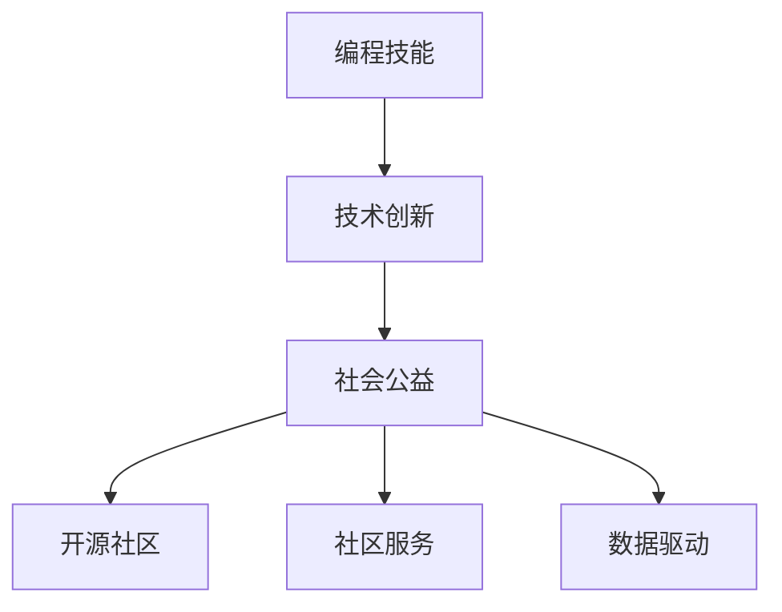

                 

# 如何将编程技能应用于社会公益

> 关键词：社会公益,编程技能,技术创新,社区服务,开源贡献

## 1. 背景介绍

### 1.1 问题由来
随着科技的发展和社会的进步，编程技能已经成为了一项非常重要的能力，不仅仅在商业和技术领域发挥着重要作用，同时也为社会公益事业提供了新的可能性。社会公益，是指通过组织和活动为社会成员提供服务，改善社会环境和提升社会福祉的事业。然而，很多公益项目缺乏足够的资源和人力资源，无法有效实现其目标。编程技能的应用，可以在解决社会问题、提升社会福祉、增强社区合作等方面发挥巨大作用。

### 1.2 问题核心关键点
本文旨在探讨如何将编程技能应用于社会公益领域，包括但不限于：

- 通过编程技术解决社会问题：例如利用大数据、机器学习、自然语言处理等技术，分析社会数据，找出问题根源。
- 为公益组织提供技术支持：如开发定制化的信息系统，提升管理效率和决策支持。
- 利用开源社区的力量：通过参与开源项目，为社会公益提供技术资源和解决方案。
- 增强社区的协作能力：利用编程平台促进社区成员之间的互动和协作。

本文将从以下几个方面展开：

1. 编程技能在社会公益中的应用。
2. 如何构建基于编程的社会公益项目。
3. 开源社区在社会公益中的角色和贡献。
4. 未来社会公益与编程技能融合的展望。

## 2. 核心概念与联系

### 2.1 核心概念概述

为更好地理解编程技能在社会公益中的应用，本节将介绍几个密切相关的核心概念：

- 编程技能：指掌握编程语言和开发工具的能力，能够设计和实现软件系统。
- 社会公益：指为社会成员提供服务，提升社会福祉的事业。
- 技术创新：指通过应用新技术和新方法，解决社会问题，提升社会福祉。
- 开源社区：指由志愿者和技术爱好者组成的、以分享和贡献技术资源为目标的社区。
- 社区服务：指通过组织和活动为社区成员提供服务，改善社区环境。
- 数据驱动：指利用数据和技术手段，分析社会问题，找出解决方案。

这些核心概念之间的逻辑关系可以通过以下Mermaid流程图来展示：



这个流程图展示了几者之间的相互关系：

1. 编程技能是实现技术创新的基础。
2. 技术创新是推动社会公益发展的动力。
3. 开源社区为技术创新和公益事业提供了丰富的资源和支持。
4. 社区服务是社会公益的具体表现形式。
5. 数据驱动是技术创新的重要手段。

这些概念共同构成了利用编程技能进行社会公益的基本框架，使编程技能能够更好地服务于社会福祉。

## 3. 核心算法原理 & 具体操作步骤
### 3.1 算法原理概述

将编程技能应用于社会公益，通常需要结合计算机科学、数据分析、人机交互等多个领域的知识。本文将介绍几种核心的算法和操作步骤，以指导如何实现基于编程技能的社会公益项目。

- 数据收集与清洗：通过编程技能从各种来源收集和清洗数据，为分析提供基础。
- 数据分析与建模：利用统计学、机器学习等技术，分析数据并构建模型，找出问题的根源。
- 系统设计与实现：设计并实现功能性的软件系统，以解决社会问题或提供服务。
- 用户反馈与优化：收集用户反馈，对系统进行持续优化，提升用户体验。

### 3.2 算法步骤详解

#### 步骤1：数据收集与清洗
- 确定数据源：根据项目需求，确定需要收集的数据源，如公共数据库、社交媒体、调查问卷等。
- 数据采集：使用编程技能编写数据采集脚本，自动化地从数据源中提取数据。
- 数据清洗：对采集到的数据进行去重、去噪、格式化等处理，确保数据的质量。

#### 步骤2：数据分析与建模
- 数据探索性分析：使用编程技能对数据进行探索性分析，找出数据中的规律和异常。
- 构建模型：根据数据分析结果，选择合适的统计模型或机器学习模型，构建预测模型。
- 模型验证与优化：使用编程技能对模型进行验证和优化，确保模型的准确性和鲁棒性。

#### 步骤3：系统设计与实现
- 系统架构设计：根据项目需求，设计系统的架构，包括功能模块、数据流、接口等。
- 编码实现：使用编程技能实现系统的各个模块，确保系统功能的正确性和高效性。
- 系统测试：对系统进行测试，确保系统的稳定性和可靠性。

#### 步骤4：用户反馈与优化
- 收集用户反馈：通过编程技能收集用户对系统的使用反馈，了解用户需求。
- 系统优化：根据用户反馈，对系统进行优化，提升用户体验。
- 持续迭代：根据需求变化，持续迭代优化系统，确保系统能够满足最新的需求。

### 3.3 算法优缺点

#### 优点
1. 技术手段多样：编程技能的应用可以结合多种技术手段，如数据分析、机器学习、自然语言处理等，解决多样化的社会问题。
2. 资源共享：开源社区提供了丰富的技术资源和工具，可以快速实现项目的开发和部署。
3. 效率提升：编程技能的应用可以提高项目开发和部署的效率，加速公益项目的实施。
4. 透明度高：编程技能的应用使得公益项目的实现过程透明，便于监督和评估。

#### 缺点
1. 技术门槛高：编程技能的应用需要具备一定的技术背景和专业知识，对于没有技术背景的公益组织来说，可能会有一定的难度。
2. 数据隐私问题：公益项目涉及大量个人信息，数据隐私保护是一个重要问题，需要严格遵守相关法律法规。
3. 成本高：编程技能的实现需要一定的资源投入，如硬件设备、开发工具等，对于资源有限的公益组织来说，可能会有一定的经济压力。
4. 维护成本：系统的维护和更新需要持续的技术投入，对于缺乏技术力量的公益组织来说，可能会成为负担。

### 3.4 算法应用领域

编程技能在社会公益领域的应用非常广泛，涵盖以下几个方面：

#### 教育领域
- 在线教育平台：利用编程技能开发在线教育平台，为偏远地区的学生提供学习资源和互动支持。
- 教育数据分析：通过编程技能分析学生的学习数据，发现学习问题，提供个性化学习建议。

#### 医疗领域
- 健康监测系统：利用编程技能开发健康监测系统，为老年人提供实时健康数据监测和提醒服务。
- 电子病历管理：通过编程技能开发电子病历管理系统，提升医疗机构的效率和准确性。

#### 环保领域
- 环境监测系统：利用编程技能开发环境监测系统，监测空气、水质等环境数据，提供预警信息。
- 垃圾分类智能系统：利用编程技能开发垃圾分类智能系统，提升垃圾分类的效率和准确性。

#### 社区服务
- 社区治理平台：利用编程技能开发社区治理平台，提升社区管理和服务效率。
- 社区互助系统：通过编程技能开发社区互助系统，促进社区成员之间的互助和协作。

#### 科技公益
- 开源社区项目：通过参与开源社区项目，为社会公益提供技术资源和解决方案。
- 社会问题研究：利用编程技能研究社会问题，提供科学依据和解决方案。

## 4. 数学模型和公式 & 详细讲解 & 举例说明
### 4.1 数学模型构建

本节将使用数学语言对基于编程技能的社会公益项目进行更加严格的刻画。

设公益项目 $P$ 包括 $n$ 个子项目，每个子项目的目标是 $T_i$，涉及的数据集为 $D_i$，使用的编程技能为 $C_i$，对应的人机交互界面为 $I_i$，涉及的算法为 $A_i$。公益项目的目标是最大化社会福祉 $S$，可建立以下数学模型：

$$
\max_{P} S = \sum_{i=1}^n S_i(T_i, D_i, C_i, I_i, A_i)
$$

其中 $S_i$ 为第 $i$ 个子项目对社会福祉的贡献度，可以通过编程技能和数据分析模型计算得到。

### 4.2 公式推导过程

以教育领域的在线教育平台为例，推导其数学模型和公式：

设在线教育平台的目标是提高学生的学习效果 $S$，涉及的数据集为 $D$，使用的编程技能为 $C$，对应的人机交互界面为 $I$，涉及的算法为 $A$。则其数学模型为：

$$
S = f(T, D, C, I, A)
$$

其中 $T$ 为学习内容，$D$ 为学生学习数据，$C$ 为编程技能，$I$ 为人机交互界面，$A$ 为推荐算法。

根据上述模型，可以推导出以下公式：

$$
S = \sum_{i=1}^n f_i(T_i, D_i, C_i, I_i, A_i)
$$

其中 $f_i$ 为第 $i$ 个学习模块的贡献度，可以根据学生的学习效果、编程技能应用情况、人机交互效果等计算得到。

### 4.3 案例分析与讲解

#### 案例1：教育数据分析平台
某教育公益组织希望通过数据分析提升偏远地区学生学习效果，利用编程技能开发了一个教育数据分析平台。该平台通过编程技能从多个数据源采集学生学习数据，使用机器学习算法分析数据，找出影响学生学习效果的关键因素，并提供个性化的学习建议。其数学模型和公式如下：

$$
S = f(T, D, C, I, A)
$$

其中 $T$ 为学习内容，$D$ 为学生学习数据，$C$ 为编程技能，$I$ 为人机交互界面，$A$ 为机器学习算法。

#### 案例2：环境监测系统
某环保公益组织希望通过编程技能开发环境监测系统，监测空气、水质等环境数据，提供预警信息。该系统通过编程技能从传感器采集环境数据，使用数据分析模型分析数据，找出环境问题的根源，并提供预警信息。其数学模型和公式如下：

$$
S = f(D, C, I, A)
$$

其中 $D$ 为环境数据，$C$ 为编程技能，$I$ 为人机交互界面，$A$ 为数据分析模型。

## 5. 项目实践：代码实例和详细解释说明
### 5.1 开发环境搭建

在进行编程技能的社会公益项目开发前，我们需要准备好开发环境。以下是使用Python进行Flask开发的环境配置流程：

1. 安装Anaconda：从官网下载并安装Anaconda，用于创建独立的Python环境。

2. 创建并激活虚拟环境：
```bash
conda create -n flask-env python=3.8 
conda activate flask-env
```

3. 安装Flask：
```bash
pip install flask
```

4. 安装其他工具包：
```bash
pip install pandas numpy requests beautifulsoup4 jupyter notebook
```

完成上述步骤后，即可在`flask-env`环境中开始开发。

### 5.2 源代码详细实现

这里我们以教育领域的在线教育平台为例，给出使用Flask框架实现的教育数据分析平台的代码实现。

首先，定义API接口：

```python
from flask import Flask, jsonify, request

app = Flask(__name__)

@app.route('/analyze', methods=['POST'])
def analyze():
    data = request.json
    result = analyze_data(data)
    return jsonify(result)

def analyze_data(data):
    # 数据清洗
    cleaned_data = preprocess_data(data)
    # 数据建模
    model = build_model(cleaned_data)
    # 分析结果
    result = analyze_model(model)
    return result
```

然后，定义数据预处理和模型构建函数：

```python
import pandas as pd
import numpy as np
from sklearn.ensemble import RandomForestRegressor
from sklearn.preprocessing import StandardScaler

def preprocess_data(data):
    # 数据清洗
    df = pd.DataFrame(data)
    df = df.dropna()
    # 数据标准化
    scaler = StandardScaler()
    df_scaled = scaler.fit_transform(df)
    # 特征选择
    X = df_scaled[:, :-1]
    y = df_scaled[:, -1]
    # 模型训练
    model = RandomForestRegressor(n_estimators=100, random_state=0)
    model.fit(X, y)
    # 数据预测
    predicted_values = model.predict(X)
    # 数据后处理
    result = postprocess_data(df_scaled, predicted_values)
    return result

def build_model(data):
    # 特征选择
    X = data[:, :-1]
    y = data[:, -1]
    # 模型训练
    model = RandomForestRegressor(n_estimators=100, random_state=0)
    model.fit(X, y)
    # 模型评估
    score = model.score(X, y)
    return model, score

def analyze_model(model):
    # 模型预测
    predicted_values = model.predict(X)
    # 结果展示
    result = {'predicted_values': predicted_values.tolist(), 'score': score}
    return result
```

最后，启动Flask应用：

```python
if __name__ == '__main__':
    app.run(debug=True)
```

以上就是使用Flask框架实现的教育数据分析平台的完整代码实现。可以看到，Flask框架使得Web开发变得简洁高效，开发者可以将更多精力放在数据处理、模型构建等高层逻辑上。

### 5.3 代码解读与分析

让我们再详细解读一下关键代码的实现细节：

**API接口**：
- 定义了一个名为`/analyze`的API接口，使用POST方法接收数据，并返回分析结果。
- `analyze_data`函数：数据清洗、数据建模、分析结果三部分。
- `preprocess_data`函数：数据清洗，包括去重、去噪、标准化等步骤。
- `build_model`函数：数据建模，包括特征选择、模型训练、模型评估等步骤。
- `analyze_model`函数：分析结果，包括模型预测、结果展示等步骤。

**数据预处理**：
- 使用Pandas库进行数据清洗，包括去重、去噪、标准化等步骤。
- 使用Scikit-learn库进行数据建模，包括特征选择、模型训练、模型评估等步骤。

**模型构建**：
- 使用Scikit-learn库进行模型构建，包括特征选择、模型训练、模型评估等步骤。

**结果展示**：
- 将分析结果以JSON格式返回，便于前端展示。

## 6. 实际应用场景
### 6.1 教育领域
教育领域的公益项目，如在线教育平台、教育数据分析等，可以通过编程技能实现，为偏远地区的学生提供更好的学习资源和支持。

例如，某公益组织开发了一个在线教育平台，通过编程技能采集学生的学习数据，使用数据分析模型分析学生的学习效果，提供个性化的学习建议。该平台在教育数据分析方面取得了显著成效，帮助偏远地区的学生提高了学习效果。

### 6.2 医疗领域
医疗领域的公益项目，如健康监测系统、电子病历管理等，也可以通过编程技能实现，提升医疗机构的效率和准确性。

例如，某公益组织开发了一个健康监测系统，通过编程技能从传感器采集老年人的健康数据，使用数据分析模型分析数据，提供预警信息。该系统在老年人健康监测方面取得了显著成效，帮助老年人及时获得医疗支持。

### 6.3 环保领域
环保领域的公益项目，如环境监测系统、垃圾分类智能系统等，也可以通过编程技能实现，提升环境保护的效果。

例如，某公益组织开发了一个环境监测系统，通过编程技能从传感器采集环境数据，使用数据分析模型分析数据，提供预警信息。该系统在环境监测方面取得了显著成效，帮助环保部门及时发现和解决环境问题。

### 6.4 社区服务
社区服务的公益项目，如社区治理平台、社区互助系统等，也可以通过编程技能实现，提升社区管理和服务效率。

例如，某公益组织开发了一个社区治理平台，通过编程技能开发社区治理APP，提升社区管理和服务效率。该平台在社区治理方面取得了显著成效，帮助社区居民更好地管理社区事务。

### 6.5 科技公益
科技公益领域的项目，如开源社区项目、社会问题研究等，也可以通过编程技能实现，为社会公益提供技术资源和解决方案。

例如，某公益组织参与了一个开源社区项目，通过编程技能为社区提供技术支持。该项目在开源社区建设方面取得了显著成效，帮助社区成员更好地分享和贡献技术资源。

## 7. 工具和资源推荐
### 7.1 学习资源推荐

为了帮助开发者系统掌握编程技能在社会公益中的应用，这里推荐一些优质的学习资源：

1. 《Python编程：从入门到实践》：一本适合初学者的Python编程入门书籍，帮助读者掌握Python编程技能。
2. 《Flask Web开发》：一本介绍Web开发的书籍，涵盖Flask框架的使用和最佳实践。
3. 《机器学习实战》：一本介绍机器学习应用实例的书籍，帮助读者掌握数据分析和机器学习技能。
4. 《开源社区指南》：一本介绍开源社区的书籍，帮助读者了解开源社区的运作方式和贡献方式。
5. 《社会公益与编程技能》：一本介绍编程技能在社会公益中的应用实例的书籍，帮助读者了解如何将编程技能应用于社会公益。

通过对这些资源的学习实践，相信你一定能够快速掌握编程技能在社会公益中的应用。

### 7.2 开发工具推荐

高效的开发离不开优秀的工具支持。以下是几款用于编程技能的社会公益项目开发的常用工具：

1. Python：一种高级编程语言，具有简单易学、功能强大、社区活跃等优点，适合各种编程技能的学习和实践。
2. Flask：一种轻量级Web框架，简单易用，适合开发小型Web应用和API接口。
3. Scikit-learn：一种开源机器学习库，支持各种机器学习算法的实现，适合数据分析和建模。
4. Pandas：一种开源数据处理库，支持各种数据操作和分析，适合数据预处理和清洗。
5. Jupyter Notebook：一种开源的交互式编程环境，支持Python、R等多种语言，适合数据科学和机器学习的应用。

合理利用这些工具，可以显著提升编程技能在社会公益项目中的开发效率，加快创新迭代的步伐。

### 7.3 相关论文推荐

编程技能在社会公益领域的研究源于学界的持续研究。以下是几篇奠基性的相关论文，推荐阅读：

1. "Open Source: A Peer-to-Peer Production Model for Open Source Software"（开源社区的peer-to-peer生产模型）：这篇文章介绍了开源社区的基本概念和运作方式，对理解开源社区的贡献和协作具有重要参考价值。
2. "Machine Learning and Data Science in Social Good"（机器学习和数据科学在社会公益中的应用）：这篇文章综述了机器学习和数据科学在社会公益领域的应用实例，提供了丰富的案例参考。
3. "Programming for Social Good"（编程技能在社会公益中的应用）：这篇文章讨论了编程技能在社会公益中的重要性和应用前景，提供了一些实际应用的案例和建议。
4. "Community Computing for the Common Good"（社区计算在社会公益中的应用）：这篇文章介绍了社区计算的基本概念和应用实例，探讨了如何利用社区计算提升社会公益的效果。
5. "Human-Centered Data Science for Social Good"（以人为本的数据科学在社会公益中的应用）：这篇文章讨论了数据科学在社会公益中的应用方法，强调了以人为本的数据科学在社会公益中的重要性。

这些论文代表了大语言模型微调技术的发展脉络。通过学习这些前沿成果，可以帮助研究者把握学科前进方向，激发更多的创新灵感。

## 8. 总结：未来发展趋势与挑战
### 8.1 总结

本文对将编程技能应用于社会公益的方法进行了全面系统的介绍。首先阐述了编程技能在社会公益中的应用，明确了编程技能在解决社会问题、提升社会福祉方面的独特价值。其次，从原理到实践，详细讲解了编程技能在社会公益项目中的数学模型和操作步骤，给出了社会公益项目开发的完整代码实例。同时，本文还广泛探讨了编程技能在教育、医疗、环保、社区服务、科技公益等多个领域的应用前景，展示了编程技能在社会公益中的巨大潜力。此外，本文精选了编程技能在社会公益中的学习资源，力求为读者提供全方位的技术指引。

通过本文的系统梳理，可以看到，编程技能在社会公益领域具有广泛的应用前景，能够利用编程技能解决多种社会问题，提升社会福祉。未来，编程技能的应用将更加广泛和深入，为社会公益事业带来更多的创新和发展。

### 8.2 未来发展趋势

展望未来，编程技能在社会公益领域的应用将呈现以下几个发展趋势：

1. 编程技能与社会公益的深度融合：随着编程技能的普及和应用，社会公益项目将更加依赖编程技能，利用编程技能解决更多的社会问题。
2. 开源社区的广泛应用：开源社区将成为社会公益的重要资源库，提供丰富的技术资源和解决方案。
3. 数据分析和机器学习的广泛应用：数据分析和机器学习将成为社会公益项目的重要手段，帮助公益组织更好地分析数据，提升决策支持。
4. 社区协作的增强：社区协作将成为社会公益项目的重要特征，通过编程技能促进社区成员之间的互动和协作。
5. 数据隐私和安全性的重视：数据隐私和安全性的问题将成为编程技能在社会公益中的重要关注点，需要严格遵守相关法律法规。

这些趋势将进一步推动编程技能在社会公益中的广泛应用，提升社会公益项目的效果和覆盖面。

### 8.3 面临的挑战

尽管编程技能在社会公益中的应用取得了一定的进展，但在实现过程中仍面临诸多挑战：

1. 技术门槛高：编程技能的应用需要具备一定的技术背景和专业知识，对于没有技术背景的公益组织来说，可能会有一定的难度。
2. 数据隐私问题：公益项目涉及大量个人信息，数据隐私保护是一个重要问题，需要严格遵守相关法律法规。
3. 成本高：编程技能的实现需要一定的资源投入，如硬件设备、开发工具等，对于资源有限的公益组织来说，可能会有一定的经济压力。
4. 维护成本：系统的维护和更新需要持续的技术投入，对于缺乏技术力量的公益组织来说，可能会成为负担。

### 8.4 研究展望

面对编程技能在社会公益中的挑战，未来的研究需要在以下几个方面寻求新的突破：

1. 降低技术门槛：开发更加易用、易学的编程工具和框架，降低技术门槛，帮助更多公益组织利用编程技能解决社会问题。
2. 注重数据隐私：制定数据隐私保护策略，确保公益项目中的数据安全和隐私保护，保障用户权益。
3. 降低成本：开发低成本的编程工具和框架，减少公益项目的经济压力。
4. 提升系统可维护性：设计易维护、易扩展的系统架构，降低系统的维护成本。

这些研究方向将有助于推动编程技能在社会公益中的普及和应用，提升社会公益项目的效果和覆盖面，最终实现社会福祉的提升。

## 9. 附录：常见问题与解答

**Q1：编程技能在社会公益中的应用有哪些？**

A: 编程技能在社会公益中的应用非常广泛，包括但不限于：
1. 在线教育平台：利用编程技能开发在线教育平台，为偏远地区的学生提供学习资源和支持。
2. 健康监测系统：通过编程技能从传感器采集老年人健康数据，提供预警信息。
3. 环境监测系统：通过编程技能从传感器采集环境数据，提供预警信息。
4. 社区治理平台：利用编程技能开发社区治理APP，提升社区管理和服务效率。
5. 开源社区项目：通过编程技能为社区提供技术支持。

**Q2：编程技能在社会公益中的技术门槛高吗？**

A: 编程技能在社会公益中的应用需要具备一定的技术背景和专业知识，对于一些没有技术力量的公益组织来说，可能会有一定的难度。但通过学习和实践，可以逐步掌握编程技能，并应用于社会公益项目中。

**Q3：数据隐私问题在社会公益中需要注意哪些方面？**

A: 数据隐私问题在社会公益中非常重要，需要注意以下几个方面：
1. 数据匿名化：对数据进行匿名化处理，确保用户隐私。
2. 数据加密：对数据进行加密存储和传输，保障数据安全。
3. 数据访问控制：对数据访问进行严格控制，确保只有授权人员可以访问数据。
4. 合规性：严格遵守相关法律法规，确保数据隐私保护合规。

**Q4：编程技能在社会公益中的成本高吗？**

A: 编程技能的实现需要一定的资源投入，如硬件设备、开发工具等，对于资源有限的公益组织来说，可能会有一定的经济压力。但通过开源社区的贡献和共享，可以降低公益项目的经济成本。

**Q5：如何提升编程技能在社会公益中的系统可维护性？**

A: 设计易维护、易扩展的系统架构，降低系统的维护成本，提升系统的可维护性。具体措施包括：
1. 模块化设计：将系统划分为多个模块，便于维护和扩展。
2. 自动化测试：通过自动化测试，确保系统的稳定性和可靠性。
3. 持续集成和持续部署：通过持续集成和持续部署，提高系统的部署效率和稳定性。

**Q6：如何降低编程技能在社会公益中的技术门槛？**

A: 开发更加易用、易学的编程工具和框架，降低技术门槛，帮助更多公益组织利用编程技能解决社会问题。具体措施包括：
1. 提供详细的文档和教程，帮助用户快速上手。
2. 开发易用的编程工具和框架，降低编程难度。
3. 提供技术支持和社区帮助，帮助用户解决技术问题。

---

作者：禅与计算机程序设计艺术 / Zen and the Art of Computer Programming

