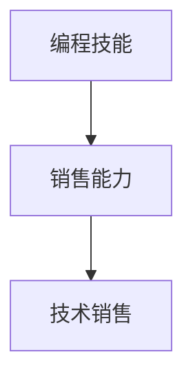

                 

## 1. 背景介绍

在快速发展的科技时代，技术团队常常面临巨大的压力，既要专注于产品开发和创新，又要满足客户需求，推动销售增长。编程技能和销售能力看似分属不同领域，但事实上，二者之间存在深刻的联系。技术团队将编程技能转化为销售能力，不仅能提升工作效率，还能增强市场竞争力。本文将深入探讨如何将编程技能有效转化为销售能力，帮助技术团队在技术驱动和市场导向之间找到平衡点。

## 2. 核心概念与联系

### 2.1 核心概念概述

要理解如何将编程技能转化为销售能力，首先需要明确几个核心概念：

- **编程技能（Programming Skills）**：指技术人员掌握的软件开发、算法设计、系统架构等方面的知识和技能，包括但不限于编程语言、数据结构、算法复杂度分析等。
- **销售能力（Sales Skills）**：指销售团队在客户沟通、市场分析、销售策略制定等方面的能力和技巧，包括但不限于客户需求分析、谈判技巧、市场趋势判断等。
- **技术销售（Technical Sales）**：指结合编程技能和销售能力的综合能力，技术人员能理解技术产品特性，同时了解市场和客户需求，从而更有效地推广技术解决方案。

### 2.2 核心概念原理和架构的 Mermaid 流程图



在这个图中，编程技能和销售能力通过技术销售这一概念相连接。技术销售不仅是将技术产品卖给客户，更是通过技术和销售的双重能力，解决客户问题，满足客户需求，从而实现销售。

## 3. 核心算法原理 & 具体操作步骤

### 3.1 算法原理概述

将编程技能转化为销售能力，本质上是一种跨领域知识融合的过程。这一过程可以分为以下几个步骤：

1. **技术理解**：深入理解产品技术特点和架构，掌握核心技术原理。
2. **市场调研**：通过市场调研和客户反馈，了解客户需求和市场趋势。
3. **问题解决**：结合技术知识和市场洞察，设计并实现解决方案，满足客户需求。
4. **销售沟通**：将解决方案有效地传达给客户，解决客户的痛点，推动销售。

### 3.2 算法步骤详解

#### 3.2.1 技术理解

**步骤1：深入学习技术原理**  
- **目标**：全面理解产品的技术架构和实现细节，掌握核心算法和架构设计。  
- **方法**：阅读产品文档、源代码，参加技术讲座，参与项目讨论。

**步骤2：模拟场景训练**  
- **目标**：在模拟环境中重现实际问题，熟悉解决流程。  
- **方法**：使用虚拟环境或仿真工具，模拟真实环境中的技术问题，练习解决策略。

#### 3.2.2 市场调研

**步骤3：收集客户需求**  
- **目标**：了解目标客户群体的需求和痛点。  
- **方法**：通过问卷调查、访谈、社交媒体分析等方式收集客户反馈。

**步骤4：分析市场趋势**  
- **目标**：理解市场趋势和竞争环境，寻找市场机会。  
- **方法**：分析行业报告、市场预测数据，跟踪竞争对手动态。

#### 3.2.3 问题解决

**步骤5：设计解决方案**  
- **目标**：根据客户需求和市场趋势，设计合理的技术解决方案。  
- **方法**：使用设计思维方法，结合技术能力和市场洞察，提出创新性解决方案。

**步骤6：实现与测试**  
- **目标**：将设计好的解决方案转化为实际产品，并进行测试验证。  
- **方法**：编写代码、集成系统、进行单元和集成测试，确保解决方案的可行性和稳定性。

#### 3.2.4 销售沟通

**步骤7：准备销售材料**  
- **目标**：制作销售演示文档、PPT，准备产品演示。  
- **方法**：将解决方案的关键点和技术优势提炼出来，制成易于理解的演示材料。

**步骤8：进行销售演示**  
- **目标**：向客户展示解决方案，解决其痛点，获得客户信任。  
- **方法**：使用故事讲述法，结合实际案例和数据，展示解决方案的效果和价值。

### 3.3 算法优缺点

#### 3.3.1 优点

- **跨领域能力**：结合编程技能和销售能力，提供更加全面和深入的解决方案。
- **客户满意度提升**：通过深入理解客户需求和技术，提供定制化解决方案，提升客户满意度。
- **市场竞争力增强**：技术销售团队能更准确地把握市场趋势和竞争环境，制定更有效的销售策略。

#### 3.3.2 缺点

- **知识广度要求高**：需要同时掌握技术和管理两方面的知识，对个人能力要求较高。
- **转化难度大**：编程技能和销售技能的融合需要时间和实践积累，转化过程较为复杂。
- **资源投入大**：需要投入大量的时间和精力在市场调研和客户沟通上，影响技术开发进度。

### 3.4 算法应用领域

技术销售能力广泛应用于多个领域，包括但不限于：

- **IT行业**：软件开发公司、网络安全公司等，通过技术销售团队推广复杂技术产品。
- **制造业**：工业自动化设备、智能制造系统等，提供定制化解决方案。
- **金融行业**：金融科技、风险管理等，结合技术解决方案提供金融服务。
- **医疗行业**：医疗设备、健康管理等，提供先进的医疗技术解决方案。

## 4. 数学模型和公式 & 详细讲解 & 举例说明

### 4.1 数学模型构建

我们将技术销售能力建模为函数 $f$，其中 $f: D \times P \rightarrow S$，其中 $D$ 表示市场调研数据，$P$ 表示产品技术数据，$S$ 表示销售结果。模型目标是最大化销售结果 $S$。

### 4.2 公式推导过程

假设 $D$ 和 $P$ 分别由 $d_1, d_2, ..., d_n$ 和 $p_1, p_2, ..., p_m$ 组成。技术销售模型的目标函数为：

$$
\max \sum_{i=1}^{n} \sum_{j=1}^{m} f(d_i, p_j) S(d_i, p_j)
$$

其中 $f(d_i, p_j)$ 表示在市场调研数据 $d_i$ 和技术数据 $p_j$ 的条件下，技术销售模型输出的销售结果 $S(d_i, p_j)$。

### 4.3 案例分析与讲解

**案例：智能制造解决方案的销售**

- **市场调研数据**：通过问卷调查和客户访谈，收集制造企业的痛点需求，如生产效率、产品质量、成本控制等。
- **产品技术数据**：介绍智能制造解决方案的技术架构，包括自动化生产线、智能质量检测、实时数据分析等。
- **销售结果**：根据客户反馈和技术匹配度，设计定制化的智能制造方案，签订合同，推动销售。

## 5. 项目实践：代码实例和详细解释说明

### 5.1 开发环境搭建

为进行技术销售实践，需要搭建一个开发环境，包括：

- **编程工具**：安装Python、Java、C++等开发环境。
- **数据分析工具**：安装R、Excel、Tableau等数据处理工具。
- **项目管理工具**：使用JIRA、Trello等项目管理工具，跟踪项目进展。

### 5.2 源代码详细实现

以下是一个简单的Python代码实例，用于分析客户需求和技术匹配度：

```python
import pandas as pd
import numpy as np

# 读取市场调研数据和产品技术数据
market_data = pd.read_csv('market_data.csv')
tech_data = pd.read_csv('tech_data.csv')

# 计算匹配度
match_score = (market_data['pain_points'] == tech_data['features']).sum()

# 输出匹配度结果
print(f"技术销售匹配度：{match_score}")
```

### 5.3 代码解读与分析

此代码实例中，我们首先使用Pandas库读取市场调研数据和产品技术数据，然后通过比较客户痛点和产品功能的匹配度，计算出匹配度分数。匹配度越高，说明技术销售的潜力越大。

### 5.4 运行结果展示

运行上述代码，输出匹配度分数，若匹配度分数较高，说明技术销售的潜力较大，可以进一步推进销售。

## 6. 实际应用场景

### 6.1 智能制造解决方案

在智能制造领域，技术销售团队可以通过分析客户需求，结合智能制造解决方案的技术特点，设计定制化的生产流程，提高生产效率和产品质量，降低生产成本，从而提升客户满意度。

### 6.2 金融科技服务

在金融科技领域，技术销售团队可以根据客户的金融需求，提供定制化的风险管理、投资分析等服务，通过先进的数据分析和模型算法，帮助客户优化投资组合，降低风险。

### 6.3 医疗设备销售

在医疗设备领域，技术销售团队可以结合客户的医疗需求，提供智能诊断、远程监控等解决方案，提高医疗服务水平，提升患者体验。

### 6.4 未来应用展望

未来，技术销售能力将进一步扩展到更多行业和领域，推动技术产品更广泛的应用。技术销售团队将通过跨领域的能力融合，提供更全面、高效的解决方案，提升市场竞争力。

## 7. 工具和资源推荐

### 7.1 学习资源推荐

- **技术书籍**：《代码大全》、《深入理解计算机系统》、《数据结构与算法分析》等。
- **在线课程**：Coursera、edX、Udacity等平台上的计算机科学和软件工程课程。
- **行业报告**：Gartner、Forrester等咨询公司发布的行业报告和分析。

### 7.2 开发工具推荐

- **编程工具**：Visual Studio Code、IntelliJ IDEA、PyCharm等。
- **数据分析工具**：Python的Pandas、NumPy、Matplotlib，R语言的ggplot2等。
- **项目管理工具**：JIRA、Trello、Asana等。

### 7.3 相关论文推荐

- **《跨领域技能融合的创新型人才培养》**：探讨了跨领域技能融合在人才培养中的重要性。
- **《技术销售在复杂产品销售中的应用》**：分析了技术销售在复杂产品销售中的实际应用效果。
- **《技术驱动的市场营销策略》**：探讨了技术驱动的市场营销策略和实践。

## 8. 总结：未来发展趋势与挑战

### 8.1 研究成果总结

本文深入探讨了将编程技能转化为销售能力的方法和步骤，提出了技术销售模型的构建方法，并通过实际案例进行分析讲解。技术销售能力将随着技术进步和市场需求的变化不断演进。

### 8.2 未来发展趋势

- **智能化趋势**：未来的技术销售将更多地依赖人工智能和大数据技术，进行市场预测和客户需求分析。
- **集成化趋势**：技术销售将与产品设计、市场推广等环节更紧密地集成，形成一体化的解决方案。
- **国际化趋势**：技术销售团队将面对更广阔的国际市场，进行跨文化沟通和销售。

### 8.3 面临的挑战

- **技术复杂性增加**：随着技术的快速发展，产品复杂度增加，技术销售难度增大。
- **市场竞争激烈**：全球化竞争加剧，如何保持技术优势和市场领先地位是一大挑战。
- **客户期望提高**：客户对技术解决方案的需求日益增长，如何满足高期望是一大挑战。

### 8.4 研究展望

未来的研究应关注以下几个方向：

- **技术驱动的销售分析**：利用大数据和机器学习技术，进行销售预测和客户需求分析。
- **跨领域人才培养**：培养具有技术和销售双能力的人才，推动技术销售的发展。
- **技术销售的最佳实践**：总结和推广技术销售的最佳实践，提升行业整体水平。

## 9. 附录：常见问题与解答

**Q1：技术销售对编程技能有哪些要求？**

A：技术销售对编程技能的要求包括：

- **编程语言**：掌握Python、Java、C++等主流编程语言。
- **数据处理**：熟练使用Pandas、NumPy等数据处理工具。
- **算法理解**：了解基本算法和数据结构，如排序、搜索、动态规划等。

**Q2：如何将技术销售与市场需求结合？**

A：技术销售与市场需求结合的关键在于：

- **市场调研**：深入了解市场需求和客户痛点。
- **技术匹配**：将产品技术特点与客户需求匹配，提供定制化解决方案。
- **反馈迭代**：根据客户反馈，不断改进和优化解决方案。

**Q3：技术销售团队如何提高市场竞争力？**

A：技术销售团队提高市场竞争力的关键在于：

- **持续学习**：不断学习新技术和市场趋势，保持技术领先。
- **客户关系**：建立良好的客户关系，提升客户满意度和忠诚度。
- **合作共赢**：与其他团队和合作伙伴紧密合作，形成竞争优势。

---

作者：禅与计算机程序设计艺术 / Zen and the Art of Computer Programming

