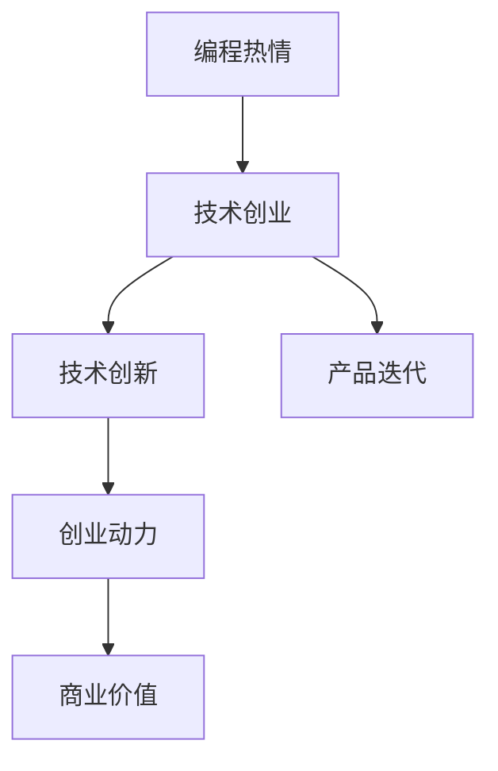

                 

# 如何将编程热情转化为创业动力

## 1. 背景介绍

在现代社会中，编程不仅仅是编程，它已经成为推动社会发展、改变世界的重要力量。无论是科技创新、人工智能还是金融科技等领域，编程正在驱动着行业的变革，而那些将编程热情转化为创业动力的开发者，则是这场变革的主角。然而，将编程热情转化为创业动力并非易事。本博客将深入探讨这一话题，为有志于将编程热情转化为创业动力的开发者提供一些建议和策略。

## 2. 核心概念与联系

### 2.1 核心概念概述

为了更好地理解如何将编程热情转化为创业动力，本节将介绍几个关键概念：

- **编程热情**：指开发者对编程的热爱和追求，包括对新技术的探索、解决问题的热情以及对编程艺术的追求。
- **创业动力**：指创业者将编程技能、项目经验、技术背景转化为商业价值的动力。
- **技术创业**：利用技术开发新产品、新服务，从而创造商业价值的过程。
- **技术创新**：在技术领域中进行创新，包括新技术的开发、应用和推广。
- **产品迭代**：持续改进和优化产品以满足市场需求的过程。

这些概念之间的联系可以通过以下Mermaid流程图来展示：



这个流程图展示了编程热情如何通过技术创业，带动技术创新和产品迭代，最终产生创业动力和商业价值。

## 3. 核心算法原理 & 具体操作步骤

### 3.1 算法原理概述

将编程热情转化为创业动力，本质上是将个人兴趣与商业市场需求相结合的过程。其核心算法原理可以概括为：

- **需求分析**：了解市场需求，识别潜在用户需求。
- **技术选型**：选择合适的技术栈和工具，以实现产品创意。
- **产品设计**：基于用户需求和技术选型，设计产品原型和功能模块。
- **验证迭代**：通过用户反馈和市场测试，不断优化产品，满足用户需求。
- **商业化策略**：制定商业化策略，将产品推向市场，实现商业价值。

### 3.2 算法步骤详解

下面详细介绍基于核心算法原理的详细步骤：

#### 步骤1：需求分析

- **市场调研**：通过市场调研，了解目标用户群体的需求和痛点。
- **竞品分析**：分析竞争对手的产品和市场表现，寻找差异化的创新点。
- **用户访谈**：与潜在用户进行深入交流，了解他们的具体需求和期望。

#### 步骤2：技术选型

- **技术评估**：评估现有技术的可行性、优缺点和适用性。
- **工具选择**：选择合适的编程语言、框架和库，以提高开发效率。
- **技术堆栈**：构建技术堆栈，确保前后端、数据、AI等领域的协同工作。

#### 步骤3：产品设计

- **功能规划**：定义产品的主要功能模块和交互方式。
- **原型设计**：创建产品原型，展示功能、交互和用户体验。
- **用户体验**：优化用户体验，确保产品易用性和功能性。

#### 步骤4：验证迭代

- **MVP开发**：开发最小可行产品(MVP)，验证核心功能和用户体验。
- **用户测试**：通过用户测试收集反馈，发现问题并改进。
- **数据分析**：分析用户行为数据，指导产品迭代和优化。

#### 步骤5：商业化策略

- **定价策略**：制定合理的价格策略，确保产品盈利。
- **市场推广**：通过各种渠道推广产品，吸引用户关注和使用。
- **客户服务**：提供优质的客户服务，维护用户关系和忠诚度。

### 3.3 算法优缺点

#### 优点

- **创新性强**：通过技术创业，可以将个人兴趣和创意转化为现实产品，实现技术创新。
- **市场需求大**：市场需求不断变化，技术创业有机会快速响应市场需求，满足用户需求。
- **高回报**：成功的技术创业可以获得高回报，实现个人和公司的商业价值。

#### 缺点

- **风险高**：技术创业存在市场和产品失败的风险，需要承受高风险。
- **资源需求大**：技术创业需要大量的资金、时间和人力资源。
- **市场竞争激烈**：市场竞争激烈，成功需要具备独特的竞争优势。

### 3.4 算法应用领域

技术创业和技术创新在多个领域都有广泛应用：

- **科技公司**：如Google、Amazon、Microsoft等，通过技术创新不断推出新产品，实现商业价值。
- **初创企业**：通过技术创业快速响应市场需求，推动公司发展。
- **软件开发公司**：利用技术创业，开发符合市场需求的软件产品。
- **创业孵化器**：为技术创业者提供资金、资源和市场支持，帮助其成功。

## 4. 数学模型和公式 & 详细讲解 & 举例说明

### 4.1 数学模型构建

为了更好地理解如何将编程热情转化为创业动力，我们将构建一个数学模型来描述这一过程。假设市场需求为 $D$，技术创新能力为 $T$，产品迭代速度为 $V$，商业化策略为 $C$，商业价值为 $P$。则模型可以表示为：

$$
P = f(D, T, V, C)
$$

其中 $f$ 表示一个非线性函数，表示市场需求、技术创新、产品迭代和商业化策略对商业价值的影响。

### 4.2 公式推导过程

假设市场需求为 $D$，技术创新能力为 $T$，产品迭代速度为 $V$，商业化策略为 $C$。则商业价值 $P$ 可以表示为：

$$
P = D \times T \times V \times C
$$

其中 $D$ 表示市场需求，$T$ 表示技术创新能力，$V$ 表示产品迭代速度，$C$ 表示商业化策略。

### 4.3 案例分析与讲解

假设一个创业者想开发一款智能家居控制系统，市场需求为 $D=10$，技术创新能力为 $T=5$，产品迭代速度为 $V=2$，商业化策略为 $C=1$。则商业价值 $P$ 可以计算为：

$$
P = 10 \times 5 \times 2 \times 1 = 100
$$

这意味着，如果市场需求足够，技术创新能力足够强，产品迭代速度足够快，且商业化策略得当，这款智能家居控制系统的商业价值可达100元。

## 5. 项目实践：代码实例和详细解释说明

### 5.1 开发环境搭建

在进行技术创业的实践前，我们需要准备好开发环境。以下是使用Python进行Django开发的环境配置流程：

1. 安装Anaconda：从官网下载并安装Anaconda，用于创建独立的Python环境。

2. 创建并激活虚拟环境：
```bash
conda create -n myenv python=3.8
conda activate myenv
```

3. 安装Django：
```bash
pip install Django
```

4. 安装各类工具包：
```bash
pip install pillow markdown django-debug-toolbar
```

完成上述步骤后，即可在`myenv`环境中开始技术创业的实践。

### 5.2 源代码详细实现

这里我们以开发一个智能家居控制系统为例，给出使用Django框架的代码实现。

首先，定义应用的URL配置：

```python
from django.urls import path
from . import views

urlpatterns = [
    path('', views.home, name='home'),
    path('api/', views.api, name='api'),
]
```

然后，定义视图函数：

```python
from django.http import JsonResponse

def home(request):
    return JsonResponse({'message': 'Welcome to Smart Home!'})

def api(request):
    if request.method == 'GET':
        return JsonResponse({'success': True, 'message': 'API request successful'})
    else:
        return JsonResponse({'success': False, 'message': 'Invalid request method'})
```

接着，定义应用的模型和视图：

```python
from django.db import models

class Device(models.Model):
    name = models.CharField(max_length=100)
    status = models.CharField(max_length=20)

    def __str__(self):
        return self.name

def device_list(request):
    devices = Device.objects.all()
    devices_data = [{'name': device.name, 'status': device.status} for device in devices]
    return JsonResponse(devices_data)
```

最后，启动应用并访问：

```bash
python manage.py runserver
```

打开浏览器，访问 `http://127.0.0.1:8000/` 即可查看智能家居控制系统的首页。访问 `http://127.0.0.1:8000/api/` 可以调用API接口，测试系统功能。

### 5.3 代码解读与分析

让我们再详细解读一下关键代码的实现细节：

**URL配置**：
- 定义应用的基本URL，包括首页和API接口。

**视图函数**：
- `home`函数：处理首页请求，返回欢迎信息。
- `api`函数：处理API请求，判断请求方法是否正确，并返回JSON响应。

**模型定义**：
- `Device`模型：定义设备的基本属性，如名称和状态。

**视图函数**：
- `device_list`函数：查询所有设备，并将其转换为JSON格式返回。

以上代码实现了智能家居控制系统的基本功能，包括首页展示和API接口调用。这些代码可以通过进一步优化和扩展，支持更多设备管理功能。

## 6. 实际应用场景

### 6.1 智能家居控制

智能家居控制系统的开发可以应用技术创业的过程，将编程热情转化为商业价值。通过不断优化产品功能和用户体验，可以吸引更多的家庭用户，提升市场占有率。

在技术实现上，可以引入物联网设备接口，实现对智能家居设备的远程控制和状态监测。同时，可以通过数据分析，优化设备管理策略，提升系统效率。

### 6.2 医疗健康平台

医疗健康平台的开发也是一个典型的技术创业案例。通过将编程热情转化为医疗技术创新，可以为医院和患者提供更高效、更便捷的医疗服务。

在技术实现上，可以开发电子病历管理系统、医生助手、患者服务平台等应用，通过数据共享和信息整合，提升医疗服务质量和效率。

### 6.3 金融科技应用

金融科技应用也是技术创业的重要方向。通过将编程热情转化为金融技术创新，可以为银行、保险公司等金融机构提供更智能、更安全的金融服务。

在技术实现上，可以开发智能投顾、风险管理、反欺诈系统等应用，通过数据分析和人工智能技术，提升金融服务的风险控制和用户体验。

### 6.4 未来应用展望

随着技术创业的不断发展和人工智能技术的进步，技术创业将带来更多创新和机遇。未来，技术创业者可以探索更多前沿技术，如区块链、AI、大数据等领域，创造更多商业价值。

## 7. 工具和资源推荐

### 7.1 学习资源推荐

为了帮助开发者系统掌握技术创业的理论基础和实践技巧，这里推荐一些优质的学习资源：

1. 《从零开始学创业》系列书籍：详细介绍了创业的各个阶段和关键点，适合入门学习。

2. 《精益创业》课程：斯坦福大学创业课程，介绍如何通过最小可行性产品(MVP)验证市场假设，快速迭代。

3. 《创业维艰》书籍：Y Combinator创始人Paul Graham撰写的创业心得，深入探讨创业的挑战和策略。

4. 《Python Web开发实战》课程：介绍如何使用Django等框架进行Web应用开发，适合技术创业者学习。

5. 《TensorFlow实战》书籍：介绍如何使用TensorFlow进行机器学习和深度学习应用开发，适合技术创业者探索AI技术。

通过对这些资源的学习实践，相信你一定能够快速掌握技术创业的理论基础和实践技巧，为未来的成功奠定坚实基础。

### 7.2 开发工具推荐

高效的开发离不开优秀的工具支持。以下是几款用于技术创业开发的常用工具：

1. GitHub：全球最大的代码托管平台，方便开发者管理和协作。

2. Docker：容器化部署工具，可以轻松实现应用在不同环境下的一致性。

3. Jenkins：持续集成和持续部署(CI/CD)工具，自动测试、部署和监控应用。

4. GitLab：集成了代码管理、项目管理、CI/CD等功能，适合团队协作开发。

5. VS Code：轻量级且功能强大的代码编辑器，支持多种语言和插件。

6. Kubernetes：容器编排工具，可以高效管理大规模分布式应用。

合理利用这些工具，可以显著提升技术创业的开发效率，加快创新迭代的步伐。

### 7.3 相关论文推荐

技术创业和技术创新在多个领域都有广泛应用。以下是几篇奠基性的相关论文，推荐阅读：

1. The Lean Startup: How Today's Entrepreneurs Use Continuous Innovation to Create Radically Successful Businesses。Eric Ries著。

2. The Innovator's Dilemma: When New Technologies Cause Great Firms to Fail。Clayton M. Christensen著。

3. Innovation and Entrepreneurship: Strategies, Implementations, and Administration。Howard M. Bushee, Mark L. Petersen著。

这些论文代表了大语言模型微调技术的发展脉络。通过学习这些前沿成果，可以帮助研究者把握学科前进方向，激发更多的创新灵感。

## 8. 总结：未来发展趋势与挑战

### 8.1 总结

本文对如何将编程热情转化为创业动力进行了全面系统的介绍。首先阐述了技术创业和技术创新的背景和意义，明确了技术创业在推动技术创新、实现商业价值方面的重要价值。其次，从原理到实践，详细讲解了技术创业的理论基础和操作步骤，给出了技术创业任务开发的完整代码实例。同时，本文还广泛探讨了技术创业在多个领域的应用前景，展示了技术创业范式的广阔前景。此外，本文精选了技术创业技术的各类学习资源，力求为读者提供全方位的技术指引。

通过本文的系统梳理，可以看到，技术创业在技术创业、产品迭代、市场推广等方面有着广泛的应用，具有广阔的前景。受益于技术创业的持续发展，技术创业者可以将个人兴趣和创意转化为商业价值，推动技术创新和社会进步。

### 8.2 未来发展趋势

展望未来，技术创业和技术创新将呈现以下几个发展趋势：

1. **技术融合加速**：技术创业将更多地融合人工智能、大数据、区块链等前沿技术，提升产品和服务的智能化水平。

2. **跨领域应用拓展**：技术创业者将更多地涉足跨领域应用，如医疗、金融、教育等领域，创造更多商业价值。

3. **新兴市场崛起**：技术创业者将更多地关注新兴市场，如亚洲、非洲等，开拓新的商业机会。

4. **全球化合作加强**：技术创业将更多地与全球合作伙伴进行合作，实现资源共享和协同创新。

5. **可持续发展**：技术创业将更多地关注可持续发展，推动环保和社会责任。

这些趋势凸显了技术创业和技术创新的广阔前景。这些方向的探索发展，必将进一步提升技术创业的影响力，为社会发展和经济增长注入新的动力。

### 8.3 面临的挑战

尽管技术创业和技术创新已经取得了瞩目成就，但在迈向更加智能化、普适化应用的过程中，它仍面临着诸多挑战：

1. **市场竞争激烈**：技术创业面临的市场竞争日益激烈，需要具备独特的竞争优势和创新能力。

2. **资源限制**：技术创业需要大量的资金、时间和人力资源，对创业者的综合素质提出了较高要求。

3. **技术风险**：技术创业面临技术风险，如技术创新失败、技术漏洞等，需要具备应对风险的能力。

4. **市场接受度**：技术创业的产品和服务需要具备良好的用户体验和市场接受度，才能实现商业价值。

5. **法规政策**：技术创业需要遵守相关法规政策，确保合法合规运营。

6. **市场变化**：市场变化迅速，技术创业者需要快速响应和调整，以保持竞争优势。

这些挑战需要技术创业者具备全面的素质和能力，才能克服困难，实现商业成功。

### 8.4 研究展望

面向未来，技术创业和技术创新还需要在以下几个方面寻求新的突破：

1. **技术创新加速**：加速技术创新，提升产品和技术竞争力。

2. **市场需求分析**：深入分析市场需求，制定精准的商业策略。

3. **用户体验优化**：不断优化用户体验，提升用户满意度和忠诚度。

4. **商业模式创新**：探索新的商业模式，实现商业价值最大化。

5. **可持续发展**：推动可持续发展，实现经济效益和环境效益的双赢。

这些研究方向的探索，必将引领技术创业和技术创新迈向更高的台阶，为构建更加智能、普适、可持续的社会贡献力量。

## 9. 附录：常见问题与解答

**Q1：技术创业如何平衡技术创新和商业价值？**

A: 技术创业需要平衡技术创新和商业价值，可以通过以下方法实现：

1. **市场调研**：深入了解市场需求和用户痛点，确保技术创新方向和商业价值相结合。

2. **用户反馈**：通过用户反馈和市场测试，不断优化产品和技术，满足用户需求。

3. **迭代开发**：通过快速迭代和原型验证，快速调整和优化产品，确保商业价值。

4. **商业化策略**：制定合理的商业化策略，如定价、营销和销售等，确保商业价值实现。

**Q2：技术创业如何规避市场和产品风险？**

A: 技术创业需要规避市场和产品风险，可以通过以下方法实现：

1. **最小可行性产品(MVP)**：通过MVP验证市场假设，快速调整和优化产品。

2. **用户测试**：通过用户测试收集反馈，发现问题并改进。

3. **数据分析**：通过数据分析指导产品迭代和优化，提升产品竞争力。

4. **风险管理**：制定风险管理策略，识别和应对潜在的市场和产品风险。

**Q3：技术创业如何获取资金和资源？**

A: 技术创业需要获取资金和资源，可以通过以下方法实现：

1. **天使投资和风险投资**：通过天使投资和风险投资获得资金支持。

2. **众筹平台**：通过众筹平台获取资金和资源，增强市场认知度。

3. **政府资助和补贴**：通过政府资助和补贴获取资金和资源支持。

4. **合作伙伴和供应商**：通过合作伙伴和供应商获取资源和支持，提升产品和服务质量。

**Q4：技术创业如何构建可持续的商业模式？**

A: 技术创业需要构建可持续的商业模式，可以通过以下方法实现：

1. **多元化收入来源**：通过多元化的收入来源，降低市场和产品风险。

2. **可持续发展策略**：制定可持续发展策略，实现经济效益和环境效益的双赢。

3. **社会责任**：承担社会责任，提升企业形象和市场认可度。

4. **创新和持续改进**：不断创新和持续改进，提升产品和技术竞争力。

**Q5：技术创业如何保持市场竞争优势？**

A: 技术创业需要保持市场竞争优势，可以通过以下方法实现：

1. **持续创新**：持续创新，提升产品和技术竞争力。

2. **市场调研**：深入了解市场需求和用户痛点，确保技术创新方向和商业价值相结合。

3. **用户反馈**：通过用户反馈和市场测试，不断优化产品和技术，满足用户需求。

4. **技术合作**：与其他企业和技术合作伙伴进行合作，共同开发和推广产品。

总之，技术创业需要综合考虑技术创新、市场需求、商业价值等多个因素，才能实现成功。只有不断创新、持续改进，才能在激烈的市场竞争中保持领先地位。

---

作者：禅与计算机程序设计艺术 / Zen and the Art of Computer Programming

