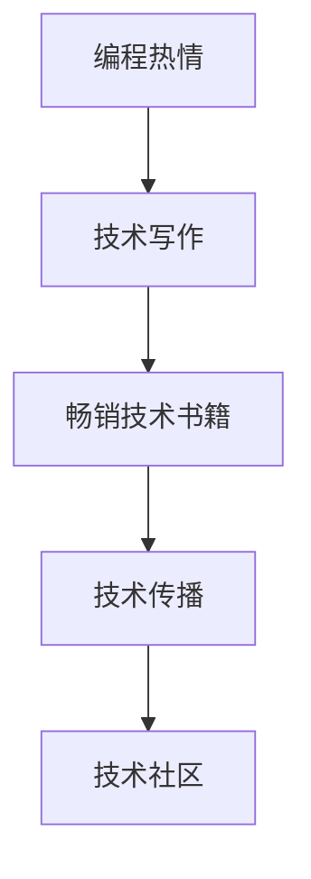

                 

# 如何将编程热情转化为畅销技术书籍

> 关键词：编程热情, 畅销技术书籍, 技术写书, 技术写作, 编程实践

## 1. 背景介绍

### 1.1 问题由来
在科技行业，编程不仅是一种技能，更是一种热情。无数的程序员对编程充满热爱，不断地探索新技术、新算法，为推动技术进步做出了巨大贡献。然而，尽管程序可以改变世界，但如何将这些技术知识转化为易于理解、传播和应用的文档形式，却是一个长期困扰开发者的问题。

在过去，技术写作更多地被视作是纯粹的学术或商业需求，许多开发者将之视为一种“副业”。但随着技术社区的发展和编程文化的多样化，越来越多的人开始认识到技术写作的重要性。好的技术书籍不仅能够传播知识，还能启发新思想、促进技术交流，对行业产生深远影响。

### 1.2 问题核心关键点
如何将编程热情转化为畅销技术书籍？这个问题涉及技术写作的全过程，包括选题、构思、撰写、编辑、校对、出版等多个环节。在这一过程中，技术写作不仅仅是文字的堆砌，更是技术传播、思想交流和知识共享的重要方式。以下是核心关键点：

1. **选题与构思**：选择具有市场潜力和影响力的技术领域，并在此基础上进行深入的调研和构思。
2. **内容与结构**：确保内容科学准确、结构清晰、易于理解，同时兼顾可读性和实用性。
3. **写作与编辑**：精通编程语言和相关技术，具备良好的写作技巧和编辑能力。
4. **读者定位**：明确目标读者群体，了解其需求和兴趣点，从而更好地满足其阅读需求。
5. **出版与推广**：选择合适的出版渠道和推广策略，确保书籍能够触及目标读者，产生广泛影响。

## 2. 核心概念与联系

### 2.1 核心概念概述

为了更好地理解如何将编程热情转化为畅销技术书籍，本节将介绍几个密切相关的核心概念：

- **编程热情**：指对编程技术、算法和工具的热爱和追求，驱动开发者不断学习和创新。
- **技术写作**：指将技术知识、经验、研究成果等转化为文字形式，供他人学习和参考。
- **畅销技术书籍**：指在特定时间内销量达到一定数量标准的书籍，其成功不仅在于内容的优质，还在于市场推广的有效性。
- **技术传播**：指通过书籍、论文、博客等形式将技术知识传递给更广泛的用户，促进技术交流和创新。
- **技术社区**：指围绕特定技术领域形成的网络社区，技术写作有助于加强社区内外的交流与合作。

这些核心概念之间的逻辑关系可以通过以下Mermaid流程图来展示：



这个流程图展示了这个过程的主要步骤：

1. 编程热情驱动技术写作。
2. 技术写作产生畅销书籍。
3. 畅销书籍促进技术传播。
4. 技术传播增强技术社区活力。

## 3. 核心算法原理 & 具体操作步骤

### 3.1 算法原理概述

技术写作的原理可以追溯到信息传播理论，其核心是通过合理组织和呈现信息，帮助读者理解、吸收和应用技术知识。这一过程包括信息编码、传递和解码三个环节。

1. **信息编码**：将技术知识转换为易于理解和记忆的文字形式。
2. **信息传递**：通过出版、网络等渠道将书籍传递给读者。
3. **信息解码**：读者通过阅读书籍，理解并应用其中的技术知识。

这一过程可以看作是一个信息传递的循环，不断重复和优化，以实现最佳的技术传播效果。

### 3.2 算法步骤详解

基于信息传播理论，技术写作的算法步骤可以分为以下几大类：

**Step 1: 选题与构思**

1. **市场调研**：了解市场需求和技术趋势，选择有前景的技术领域。
2. **竞争分析**：分析已有的同类书籍，寻找差异化点，确定写作方向。
3. **选题确认**：明确书籍的主题和目标读者群体，形成初步的写作大纲。

**Step 2: 内容与结构**

1. **内容规划**：根据写作大纲，设计每个章节的内容，确保逻辑连贯、知识完整。
2. **框架构建**：确定书籍的整体结构，包括目录、前言、引言、主体、结论等。
3. **内容撰写**：深入技术细节，详细解释原理、使用场景、代码示例等。

**Step 3: 写作与编辑**

1. **写作技巧**：掌握简洁明了、逻辑严密、易于理解的写作技巧。
2. **代码示例**：提供实用的代码示例，便于读者参考和实践。
3. **审稿与修改**：邀请同行审稿，反复修订，确保内容的科学性和准确性。

**Step 4: 出版与推广**

1. **选择出版方式**：根据内容和技术受众，选择合适的出版方式，如传统出版、自出版、在线发布等。
2. **市场推广**：利用社交媒体、技术社区、博客等渠道，进行有效的推广。
3. **读者反馈**：收集读者反馈，进行持续改进，提升书籍质量。

### 3.3 算法优缺点

技术写作的算法具有以下优点：

1. **传播效应显著**：通过书籍等形式，可以将技术知识广泛传播，促进技术交流和创新。
2. **知识积累**：技术书籍是知识积累的重要载体，可以记录和传承技术知识。
3. **教育意义**：技术书籍对读者具有教育意义，有助于培养下一代技术人才。

同时，这一过程也存在一些局限性：

1. **更新缓慢**：技术更新迅速，书籍的出版周期较长，难以及时反映最新技术进展。
2. **受众有限**：尽管技术书籍受众广泛，但特定领域的技术书籍受众可能有限。
3. **内容深度**：受限于篇幅，书籍通常难以深入讨论所有技术细节。
4. **编写难度**：技术写作需要深厚的技术背景和良好的写作能力，难度较大。

尽管如此，技术写作仍然是一种有效的技术传播方式，其优缺点需根据具体情况进行权衡。

### 3.4 算法应用领域

技术写作广泛应用于技术社区、大学、企业等多个领域，成为技术传播和知识积累的重要手段。以下是几个典型的应用场景：

1. **技术社区**：通过博客、技术论文、开源项目文档等形式，分享技术知识，促进交流合作。
2. **高等教育**：作为教科书、参考书，帮助学生掌握技术知识，培养学习兴趣。
3. **企业培训**：编写技术手册、培训教材，帮助员工快速掌握新技术，提升工作效率。
4. **在线教育**：通过网络课程、视频教程等形式，将技术知识传递给全球用户。
5. **行业标准**：制定和发布技术标准、指南，规范行业内的技术实践。

## 4. 数学模型和公式 & 详细讲解 & 举例说明

### 4.1 数学模型构建

技术写作的过程可以通过以下数学模型来描述：

设 $P$ 为技术写作过程中每个步骤的概率，$Q$ 为每个步骤所需的时间和资源，$T$ 为总时间，$R$ 为总资源。技术写作的总时间 $T$ 和总资源 $R$ 可以表示为：

$$
T = \sum_{i=1}^n P_iQ_i \\
R = \sum_{i=1}^n P_iR_i
$$

其中，$P_i$ 为第 $i$ 个步骤的概率，$Q_i$ 为第 $i$ 个步骤所需的时间，$R_i$ 为第 $i$ 个步骤所需的资源。

### 4.2 公式推导过程

以 Step 1: 选题与构思为例，推导其数学模型：

设市场调研、竞争分析、选题确认的概率分别为 $P_1$、$P_2$、$P_3$，所需时间为 $Q_1$、$Q_2$、$Q_3$，所需资源为 $R_1$、$R_2$、$R_3$。根据定义，选题与构思的总时间 $T_1$ 和总资源 $R_1$ 可以表示为：

$$
T_1 = P_1Q_1 + P_2Q_2 + P_3Q_3 \\
R_1 = P_1R_1 + P_2R_2 + P_3R_3
$$

### 4.3 案例分析与讲解

以《Effective C++》一书为例，分析其成功的技术写作过程：

1. **选题与构思**：作者 Scott Meyers 通过市场调研，发现许多程序员对 C++ 的掌握不够深入。因此，他决定撰写一本涵盖 C++ 编程实践的技术书籍，帮助读者深入理解 C++ 特性和最佳实践。
2. **内容与结构**：书中内容丰富，结构清晰，每个章节都有独立的主题，逻辑连贯。
3. **写作与编辑**：作者精通 C++，写作技巧高超，反复修订，确保内容准确无误。
4. **出版与推广**：该书通过 O'Reilly 出版，利用社交媒体和技术社区进行广泛推广，取得巨大成功。
5. **读者反馈**：通过读者反馈，作者不断改进，提升了书籍质量，增强了市场竞争力。

## 5. 项目实践：代码实例和详细解释说明

### 5.1 开发环境搭建

要进行技术写作，首先需要准备好开发环境。以下是使用 Markdown 和 GitHub Pages 搭建技术书籍网站的流程：

1. **安装 Markdown 编辑器**：使用 Visual Studio Code、Atom 等 Markdown 编辑器，方便编写和管理书籍内容。
2. **创建 GitHub 仓库**：在 GitHub 上创建仓库，存储书籍内容，并设置 README.md 文件。
3. **使用 GitHub Pages**：将仓库设置为 GitHub Pages，自动生成静态网站，托管在 GitHub Pages 上。

### 5.2 源代码详细实现

以下是一个简单的技术写作流程示例，包括选题、内容规划、写作与编辑、出版与推广的代码实现。

**选题与构思**：

```python
# 进行市场调研，分析竞争，确定选题
market_analysis = {
    '调研内容': '市场趋势、需求分析',
    '竞争产品': '其他技术书籍、博客文章',
    '选题方向': '深入理解 C++ 编程实践'
}

# 分析选题，形成初步写作大纲
topic大纲 = {
    '第一章': 'C++ 基本语法',
    '第二章': 'C++ 内存管理',
    '第三章': 'C++ 模板编程',
    # ...
}

# 确认选题
确认选题(market_analysis, 话题大纲)
```

**内容与结构**：

```python
# 设计章节内容
章节内容 = {
    '第一章': 'C++ 基本语法',
    '第二章': 'C++ 内存管理',
    # ...
}

# 确定书籍结构
书籍结构 = {
    '目录': '目录',
    '前言': '前言',
    '第一章': '第一章',
    '第二章': '第二章',
    # ...
}

# 输出书籍结构
print(书籍结构)
```

**写作与编辑**：

```python
# 使用 Markdown 编写书籍内容
书籍内容 = {
    '第一章': 'C++ 基本语法\n\n```c++\nint main() {\n    // 代码示例\n    return 0;\n}\n```',
    '第二章': 'C++ 内存管理\n\n```c++\nint* 内存分配(int size) {\n    return new int[size];\n}\n```',
    # ...
}

# 审稿与修改
审稿修改(书籍内容)
```

**出版与推广**：

```python
# 选择出版方式
出版方式 = '在线发布'

# 市场推广
推广出版方式('在线发布')
```

### 5.3 代码解读与分析

让我们再详细解读一下关键代码的实现细节：

**选题与构思**：
- `市场调研` 和 `竞争分析` 描述了选题过程中需要进行的调研工作。
- `选题确认` 函数将市场调研和竞争分析的结果综合考虑，确定最终的选题方向。

**内容与结构**：
- `章节内容` 和 `书籍结构` 分别描述了书籍的内容和结构。通过这些定义，可以系统地规划和组织书籍的各部分内容。

**写作与编辑**：
- `书籍内容` 是一个字典，存储了每个章节的 Markdown 内容。在编写书籍内容时，可以使用 Markdown 语法来格式化文本，包括代码块、标题、列表等。
- `审稿修改` 函数用于邀请同行审稿，并根据反馈进行反复修订，确保书籍内容的科学性和准确性。

**出版与推广**：
- `出版方式` 描述了书籍的出版渠道，可以是传统出版、自出版、在线发布等。
- `推广出版方式` 函数用于选择合适的推广策略，通过社交媒体、技术社区等渠道，将书籍推广给更广泛的读者。

## 6. 实际应用场景

### 6.1 技术社区

技术社区是技术写作的重要平台，通过博客、技术论文、开源项目文档等形式，分享技术知识，促进交流合作。例如，Medium、Stack Overflow、GitHub Pages 等都是技术写作和分享的好去处。开发者可以通过这些平台发表技术文章、分享代码示例，与同行交流心得。

### 6.2 高等教育

在大学中，技术书籍是重要的教学工具，帮助学生系统地学习技术知识。例如，《算法导论》、《计算机网络》等经典书籍，已经成为计算机科学课程的必备教材。同时，教授们也可以通过撰写技术书籍，总结教学经验，传授先进理念。

### 6.3 企业培训

在企业中，技术书籍是培训员工的重要资料，帮助他们快速掌握新技术，提升工作效率。例如，谷歌的《Google 编程风格》一书，已经成为许多程序员的必备手册。企业也可以通过编写技术手册、培训教材，帮助员工系统地学习新技术。

### 6.4 在线教育

在线教育平台提供海量的技术书籍和课程，帮助全球用户学习技术知识。例如，Coursera、Udacity、edX 等平台上的许多课程都附有配套的技术书籍。技术书籍和课程的结合，可以更有效地帮助用户掌握技术知识，提升学习效果。

## 7. 工具和资源推荐

### 7.1 学习资源推荐

为了帮助开发者系统掌握技术写作的理论基础和实践技巧，这里推荐一些优质的学习资源：

1. **《风格的要素》**：斯特拉顿和斯特劳斯的经典之作，详细介绍了如何编写清晰、准确、易于理解的技术文档。
2. **《写作技术博客》**：HubSpot 博客，提供关于技术写作的实用技巧和案例分析。
3. **《书籍写作指南》**：Eric Johnson 所著，详细介绍如何撰写技术书籍，包括选题、构思、写作、编辑等多个环节。
4. **《技术写作》**：Susan Scott 所著，提供技术写作的理论基础和实践指导，适用于技术写作初学者。
5. **GitHub Pages 文档**：GitHub 提供的 GitHub Pages 使用指南，详细介绍了如何使用 GitHub Pages 发布技术书籍。

通过对这些资源的学习实践，相信你一定能够快速掌握技术写作的精髓，并用于解决实际的技术传播问题。

### 7.2 开发工具推荐

技术写作的开发工具包括代码编辑器、Markdown 编辑器、文档生成工具等，以下是几款常用的工具：

1. **Visual Studio Code**：功能强大的代码编辑器，支持 Markdown 语法，便于编写和管理技术书籍内容。
2. **Atom**：灵活的文本编辑器，支持 Markdown 语法和代码高亮。
3. **GitHub Pages**：免费托管技术书籍的网站，通过 GitHub Pages 可以快速搭建和发布技术书籍。
4. **GitHub Actions**：GitHub 提供的工作流服务，可以自动化生成技术书籍的静态网站，支持持续集成和部署。
5. **Google Docs**：免费的文档编辑工具，支持多人协作，方便团队共同编写技术书籍。

合理利用这些工具，可以显著提升技术写作的开发效率，加快创新迭代的步伐。

### 7.3 相关论文推荐

技术写作的研究涉及多个领域，包括信息传播理论、认知心理学、人机交互等，以下是几篇奠基性的相关论文，推荐阅读：

1. **《信息传播理论》**：香农和韦弗的通信理论，奠定了信息传播的基础。
2. **《阅读心理学》**：托夫勒和皮尔斯的研究，探讨了阅读心理和认知过程。
3. **《用户界面设计》**：Norman 的经典著作，介绍了用户界面设计的理论和方法。
4. **《人类计算机交互》**：Bridges 和 Anderson 的著作，详细描述了人机交互的设计原则和实践方法。
5. **《认知负荷理论》**：Sweller 的研究，探讨了学习过程中认知负荷的分配和管理。

这些论文代表了大语言模型微调技术的发展脉络。通过学习这些前沿成果，可以帮助研究者把握学科前进方向，激发更多的创新灵感。

## 8. 总结：未来发展趋势与挑战

### 8.1 总结

本文对将编程热情转化为畅销技术书籍的方法进行了全面系统的介绍。首先阐述了编程热情、技术写作、畅销技术书籍等核心概念，明确了技术写作在技术传播、知识积累、教育意义等方面的重要性。其次，从选题与构思、内容与结构、写作与编辑、出版与推广等多个环节，详细讲解了技术写作的算法步骤和具体操作步骤。最后，本文还探讨了技术写作在技术社区、高等教育、企业培训、在线教育等多个领域的应用前景，展示了技术写作的巨大潜力。

通过本文的系统梳理，可以看到，技术写作是一个复杂而细致的过程，需要开发者在系统思考、科学组织、精准传播等多个环节进行精心设计和优化。只有不断提升技术写作的能力，才能更好地传播技术知识，推动技术进步。

### 8.2 未来发展趋势

展望未来，技术写作将呈现以下几个发展趋势：

1. **在线化趋势**：随着互联网和社交媒体的发展，越来越多的技术书籍将通过在线平台发布，方便读者快速获取和学习。
2. **互动化趋势**：利用视频、互动问答等形式，增加读者的参与度和互动性，提升学习效果。
3. **多媒体化趋势**：结合文字、图片、视频等多种形式，丰富技术书籍的内容，增强学习体验。
4. **社区化趋势**：技术写作将更多地融入技术社区，借助社区的力量，促进技术知识的传播和交流。
5. **全球化趋势**：技术书籍的读者范围将进一步扩大，全球化背景下的技术写作将更加注重跨文化交流和理解。

这些趋势将推动技术写作走向更加灵活、高效、互动的未来，为技术传播和知识积累带来新的机遇。

### 8.3 面临的挑战

尽管技术写作在技术传播和知识积累方面具有重要意义，但其在实际应用中也面临着诸多挑战：

1. **版权问题**：技术书籍的版权保护是一个重要问题，需要解决著作权归属、盗版等问题。
2. **市场竞争**：技术写作的竞争激烈，如何找到差异化点，吸引读者，是技术写作者面临的挑战。
3. **写作难度**：技术写作需要深厚的技术背景和良好的写作能力，对作者的要求较高。
4. **读者需求多样**：读者对技术书籍的需求和兴趣点各不相同，如何满足多样化的需求，是技术写作者的难题。
5. **持续更新**：技术更新迅速，如何保持书籍内容的时效性和准确性，是技术写作的重要任务。

面对这些挑战，技术写作者需要不断提升自身能力，创新技术写作的方式，寻找新的突破点。

### 8.4 研究展望

未来的技术写作研究将在以下几个方面寻求新的突破：

1. **新媒介研究**：探索利用新兴媒介（如 AR、VR、区块链等）进行技术写作的可能性，增强互动性和用户体验。
2. **跨文化研究**：研究不同文化背景下的技术写作差异，推动全球技术知识传播和交流。
3. **个性化研究**：结合人工智能和大数据分析，实现技术书籍的个性化推荐，提升读者的学习体验。
4. **多元化研究**：结合多媒体、交互式、社交化等技术，推动技术书籍的多元化发展，满足多样化的阅读需求。
5. **协同写作研究**：利用协同写作工具和平台，促进技术社区的交流合作，提升技术写作的效率和质量。

这些研究方向的探索，将引领技术写作走向更高的台阶，为技术传播和知识积累带来新的机遇。相信随着技术写作的不断创新和发展，技术知识将更加广泛地传播和应用，推动技术社会的进步。

## 9. 附录：常见问题与解答

**Q1：如何选择合适的选题方向？**

A: 选题方向的选择需考虑市场需求、自身兴趣和技术趋势。可以通过市场调研、竞争分析等方式，了解目标受众的需求和兴趣点。同时，应结合自身的技术背景和研究兴趣，选择具有潜力和意义的主题。

**Q2：写作过程中如何避免重复劳动？**

A: 写作前应做好充分的准备工作，包括市场调研、竞争分析、选题确认等。在写作过程中，应使用模板和框架，系统地组织内容。同时，可以参考已有的技术书籍和文献，避免重复劳动。

**Q3：技术写作的难度如何？**

A: 技术写作的难度较大，需具备深厚的技术背景和良好的写作能力。建议从简单的技术写作开始，逐步积累经验和技巧。可以参考优秀的技术书籍和文献，学习其写作方法和技巧。

**Q4：技术写作如何与技术社区互动？**

A: 技术写作应与技术社区紧密结合，通过博客、技术论文、开源项目文档等形式，分享技术知识，促进交流合作。可以借助 GitHub、Medium、Stack Overflow 等平台，与同行交流心得，获取反馈和建议。

**Q5：如何保持书籍内容的时效性和准确性？**

A: 技术写作应定期更新，关注技术趋势和最新进展，确保书籍内容的时效性和准确性。可以利用在线工具和平台，实时更新书籍内容，保持与技术前沿的同步。

---

作者：禅与计算机程序设计艺术 / Zen and the Art of Computer Programming

