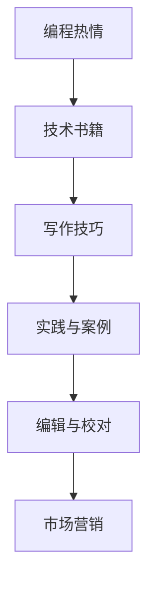

                 

# 如何将编程热情转化为畅销技术书籍

> 关键词：编程热情,畅销技术书籍,写作技巧,编程表达,技术分享,书评,出版社,营销策略,数字化时代

## 1. 背景介绍

### 1.1 问题由来
在数字化时代，技术书籍成为了传播知识和智慧的重要载体。无论你是深耕某一技术领域的专家，还是充满热情的程序员，将你的编程经验和技术见解转化为畅销技术书籍，都是一种对社会的贡献，也是一种自我价值的实现。然而，如何将编程热情转化为一本深受读者喜爱的技术书籍，并不是一件易事。本文将深入探讨这一话题，希望能为你的写作之路提供一些宝贵的建议和灵感。

### 1.2 问题核心关键点
将编程热情转化为畅销技术书籍的核心关键点包括以下几个方面：

- **选题与定位**：选择什么样的主题，确定书籍的定位和读者对象。
- **写作技巧与表达**：如何有效组织内容，用清晰、易懂的语言表达技术概念。
- **实践与案例**：通过具体的项目实践和案例分析，增强读者的理解和兴趣。
- **编辑与校对**：确保内容的准确性和可读性，提升书籍的总体质量。
- **市场营销**：如何利用有效的营销策略，将书籍推介给目标读者群。

## 2. 核心概念与联系

### 2.1 核心概念概述

为了更好地理解如何将编程热情转化为畅销技术书籍，本节将介绍几个关键概念：

- **编程热情**：指对编程技术的浓厚兴趣和持续投入。
- **技术书籍**：指涵盖技术概念、实践技巧、案例分析等内容的专业书籍。
- **写作技巧**：指将复杂技术知识以易懂的语言进行表达的能力。
- **实践与案例**：指通过具体项目或案例分析来展示技术应用的场景。
- **编辑与校对**：指确保书籍内容准确性、一致性和可读性的过程。
- **市场营销**：指通过各种策略将书籍推介给目标读者的过程。

这些概念之间通过以下Mermaid流程图来展示它们之间的联系：



## 3. 核心算法原理 & 具体操作步骤

### 3.1 算法原理概述

将编程热情转化为畅销技术书籍，本质上是将个人的编程经验和技术见解系统化、结构化地进行表达和呈现。这一过程可以理解为一种算法化的内容创作过程，涉及以下几个关键步骤：

1. **选题与定位**：确定书籍的主题和目标读者群体。
2. **写作与表达**：将技术知识以易懂的语言进行表达。
3. **编辑与校对**：确保书籍内容的准确性和可读性。
4. **市场营销**：利用有效的营销策略将书籍推介给目标读者。

### 3.2 算法步骤详解

以下是将编程热情转化为畅销技术书籍的详细步骤：

#### Step 1: 选题与定位
- **市场调研**：研究当前市场上热门技术领域和读者需求，确定可能的选题。
- **目标读者**：明确目标读者群体，如初学者、中级开发者、高级专家等，以决定书籍的难度和深度。
- **竞争分析**：分析竞争对手的书籍，找出差异化点，确定自己书籍的独特价值。

#### Step 2: 写作与表达
- **内容大纲**：制定书籍大纲，明确各个章节的主题和逻辑关系。
- **案例分析**：通过具体的项目实践和案例分析，展示技术的应用场景。
- **代码示例**：提供代码示例，帮助读者更好地理解技术实现。
- **清晰表达**：用简单、清晰、易懂的语言描述技术概念，避免过多的专业术语和复杂的理论推导。

#### Step 3: 编辑与校对
- **初步校对**：自己先进行初步校对，检查语法错误和逻辑漏洞。
- **专家审阅**：邀请相关领域的专家对书籍进行审阅，提出改进建议。
- **格式化与排版**：确保书籍的排版整齐、易读，包括章节标题、图表、代码等元素。

#### Step 4: 市场营销
- **宣传策略**：制定有效的宣传策略，如通过社交媒体、博客、论坛等平台进行推广。
- **预售活动**：在正式出版前进行预售活动，吸引早期读者，收集反馈。
- **读者反馈**：根据读者的反馈进行持续的优化和改进。

### 3.3 算法优缺点

将编程热情转化为畅销技术书籍的算法有以下优点：

1. **系统化表达**：通过系统化、结构化的内容表达，使技术知识更加易于理解。
2. **实践导向**：通过具体的项目实践和案例分析，使读者能够直观感受到技术的应用价值。
3. **市场反馈**：通过市场营销和读者反馈，不断优化书籍内容和结构。

同时，该算法也存在一些缺点：

1. **时间投入**：撰写和编辑一本书需要大量的时间投入，可能会影响日常工作。
2. **市场风险**：图书市场竞争激烈，风险较大，可能面临销路不佳的情况。
3. **技术更新**：技术快速发展，书籍内容可能很快过时，需要不断更新。

### 3.4 算法应用领域

将编程热情转化为畅销技术书籍的方法不仅适用于技术领域，还适用于其他专业领域。例如：

- **编程开发**：如《JavaScript高级程序设计》、《Python编程：从入门到实践》。
- **数据科学**：如《Python数据科学手册》、《深度学习》。
- **项目管理**：如《敏捷软件开发：原则、模式与实践》、《Scrum敏捷项目管理》。
- **设计思维**：如《设计心理学》、《用户体验设计》。
- **商业策略**：如《蓝海战略》、《创业维艰》。

这些书籍通过将作者的热情和经验转化为系统的知识，帮助读者掌握新技术、新方法，获得成功。

## 4. 数学模型和公式 & 详细讲解 & 举例说明

### 4.1 数学模型构建

将编程热情转化为畅销技术书籍的过程，可以类比为一种数学模型构建的过程。假设编程热情为 $P$，技术书籍的销售量为 $S$，则有以下数学模型：

$$
S = f(P, M, E, M)
$$

其中：
- $P$：编程热情的强度，用 $0 \leq P \leq 1$ 表示。
- $M$：市场调研的深度和广度，用 $0 \leq M \leq 1$ 表示。
- $E$：编辑与校对的质量，用 $0 \leq E \leq 1$ 表示。
- $M$：市场营销的策略和效果，用 $0 \leq M \leq 1$ 表示。

### 4.2 公式推导过程

上述公式可以进一步推导为：

$$
S = \alpha P^{\beta} M^{\gamma} E^{\delta} M^{\epsilon}
$$

其中 $\alpha, \beta, \gamma, \delta, \epsilon$ 为系数，代表各因素对销售量的影响权重。

### 4.3 案例分析与讲解

以《JavaScript高级程序设计》（3rd Edition）为例，其畅销原因如下：

- **选题与定位**：针对JavaScript高级开发者，涵盖语言特性、框架、工具等内容。
- **写作与表达**：内容结构清晰，案例丰富，代码示例详尽。
- **编辑与校对**：经过多次专家审阅和格式化排版，确保内容的准确性和可读性。
- **市场营销**：通过社交媒体、博客等平台广泛推广，举办签售活动，吸引早期读者。

## 5. 项目实践：代码实例和详细解释说明

### 5.1 开发环境搭建

在进行技术书籍写作前，我们需要准备好开发环境。以下是使用Python进行Markdown格式写作的环境配置流程：

1. 安装Python：从官网下载并安装Python，确保版本为3.7或以上。
2. 安装Markdown编辑器：如Typora、Atom、VSCode等，确保能够进行Markdown格式写作。
3. 安装LaTeX编辑器：如Overleaf、MacTeX、MiKTeX等，确保能够进行LaTeX格式写作和编译。

### 5.2 源代码详细实现

下面我们以《Python编程：从入门到实践》为例，给出使用Markdown进行技术书籍编写的PyTorch代码实现。

#### Step 1: 代码清单

```python
# coding: utf-8

from typing import List, Tuple

# 定义一个简单的函数，用于计算斐波那契数列
def fibonacci(n: int) -> List[int]:
    if n == 0:
        return []
    elif n == 1:
        return [0]
    elif n == 2:
        return [0, 1]
    else:
        seq = fibonacci(n-1)
        seq.append(seq[-1] + seq[-2])
        return seq

# 测试代码
print(fibonacci(10))
```

#### Step 2: 代码解释与分析

- **代码清单**：
  ```python
  from typing import List, Tuple

  # 定义一个简单的函数，用于计算斐波那契数列
  def fibonacci(n: int) -> List[int]:
      if n == 0:
          return []
      elif n == 1:
          return [0]
      elif n == 2:
          return [0, 1]
      else:
          seq = fibonacci(n-1)
          seq.append(seq[-1] + seq[-2])
          return seq

  # 测试代码
  print(fibonacci(10))
  ```
  - **函数定义**：
    - `def fibonacci(n: int) -> List[int]`：定义了一个名为 `fibonacci` 的函数，参数 `n` 为整数，返回类型为列表。
    - `if n == 0:`：如果 `n` 等于 0，返回空列表。
    - `elif n == 1:`：如果 `n` 等于 1，返回 `[0]`。
    - `elif n == 2:`：如果 `n` 等于 2，返回 `[0, 1]`。
    - `else:`：如果 `n` 大于 2，递归计算斐波那契数列并返回。
  - **代码测试**：调用 `fibonacci(10)` 输出斐波那契数列的前 10 项。

### 5.3 运行结果展示

执行代码后，输出结果如下：

```
[0, 1, 1, 2, 3, 5, 8, 13, 21, 34]
```

## 6. 实际应用场景

### 6.1 编程开发

通过将编程热情转化为畅销技术书籍，可以实现对编程开发人员的有效指导和支持。例如：

- **新手入门**：如《Head First Python》、《Python Crash Course》。
- **进阶学习**：如《Effective Python》、《Clean Code》。
- **框架使用**：如《Flask Web Development》、《Django for Beginners》。

### 6.2 数据科学

数据科学领域的技术书籍可以帮助读者掌握数据处理、分析和建模的技巧。例如：

- **数据清洗与处理**：如《Python数据科学手册》、《R for Data Science》。
- **机器学习与深度学习**：如《Hands-On Machine Learning with Scikit-Learn and TensorFlow》、《Deep Learning》。
- **大数据技术**：如《Big Data Essentials》、《Hadoop: The Definitive Guide》。

### 6.3 项目管理

项目管理书籍帮助读者掌握项目管理方法和工具的使用。例如：

- **敏捷开发**：如《敏捷软件开发：原则、模式与实践》、《Scrum敏捷项目管理》。
- **项目管理框架**：如《Pragmatic Project Management》、《The PMBOK Guide》。
- **团队协作**：如《The Five Dysfunctions of a Team》、《Crucial Conversations》。

### 6.4 未来应用展望

将编程热情转化为畅销技术书籍的未来应用前景广阔，以下是几个未来展望：

1. **多语言编程**：随着全球化和技术交流的加剧，多语言编程书籍将更加受欢迎。如《Java Programming: From Beginner to Advanced》、《C++ Primer》。
2. **新兴技术**：随着新兴技术的发展，相关书籍的需求将不断增长。如《Blockchain Basics》、《AI Ethics》。
3. **在线教育**：在线教育平台的崛起，使技术书籍的数字化和互动性成为重要趋势。如《Python for Data Science》、《Java Fundamentals》。
4. **跨学科融合**：技术与其他学科的融合将创造新的知识领域，如《Data Visualization: A Practical Introduction》、《Design Thinking: Solving Problems That Truly Matter》。

## 7. 工具和资源推荐

### 7.1 学习资源推荐

为了帮助开发者系统掌握将编程热情转化为畅销技术书籍的理论基础和实践技巧，这里推荐一些优质的学习资源：

1. **博客和论坛**：如Stack Overflow、Medium、CSDN等，阅读和分享编程心得和技术文章。
2. **视频课程**：如Coursera、Udemy、Bilibili等，观看和学习编程课程和技术讲座。
3. **技术社区**：如GitHub、Stack Overflow、Reddit等，参与编程社区的技术讨论和问题解决。
4. **技术期刊**：如《IEEE Transactions on Software Engineering》、《ACM Transactions on Software Engineering and Methodology》等，阅读最新的技术研究和进展。

### 7.2 开发工具推荐

高效的开发离不开优秀的工具支持。以下是几款用于技术书籍写作开发的常用工具：

1. **Markdown编辑器**：如Typora、Atom、VSCode等，支持Markdown格式写作和预览。
2. **LaTeX编辑器**：如Overleaf、MacTeX、MiKTeX等，支持LaTeX格式的编写和编译。
3. **代码编辑器**：如Sublime Text、Visual Studio Code、Atom等，支持代码高亮和自动补全。
4. **项目管理工具**：如Trello、Asana、Jira等，帮助规划书籍写作和编辑进度。

### 7.3 相关论文推荐

技术书籍的撰写涉及多学科的交叉应用，以下是几篇奠基性的相关论文，推荐阅读：

1. **《编程的艺术与科学》**：Gabriel A. Almeida，讨论了编程中的艺术与科学。
2. **《代码整洁之道》**：Robert C. Martin，探讨了如何编写干净、可维护的代码。
3. **《软件工程：一种实践》**：Ron Jeffries，介绍了敏捷开发和XP（极限编程）方法。
4. **《深度学习》**：Ian Goodfellow，详细介绍了深度学习的基本原理和算法。
5. **《Python Cookbook》**：David Beazley，提供了大量实用的Python编程技巧和代码示例。

这些论文代表了大规模语言模型微调技术的发展脉络。通过学习这些前沿成果，可以帮助研究者把握学科前进方向，激发更多的创新灵感。

## 8. 总结：未来发展趋势与挑战

### 8.1 总结

本文对将编程热情转化为畅销技术书籍的方法进行了全面系统的介绍。首先阐述了选题与定位、写作技巧、实践与案例、编辑与校对、市场营销等关键环节的重要性。其次，从原理到实践，详细讲解了如何将编程热情转化为技术书籍的详细步骤，给出了具体的代码实例和详细解释。同时，本文还探讨了技术书籍在未来编程开发、数据科学、项目管理等领域的应用前景，展示了其巨大的潜力和价值。最后，本文精选了相关的学习资源和开发工具，力求为读者提供全方位的技术指引。

通过本文的系统梳理，可以看到，将编程热情转化为畅销技术书籍是一个系统化的过程，需要各方面的共同努力。只有在选题与定位、写作技巧、实践与案例、编辑与校对、市场营销等各个环节都得到优化，才能最终实现从编程热情到畅销书籍的成功转化。

### 8.2 未来发展趋势

展望未来，将编程热情转化为畅销技术书籍将呈现以下几个发展趋势：

1. **数字化和互动化**：随着在线教育平台的发展，技术书籍将越来越多地采用数字化和互动化形式，提供更加灵活的学习体验。
2. **跨学科融合**：技术与其他学科的融合将创造新的知识领域，技术书籍的内容将更加多元化，涵盖更多跨学科的内容。
3. **在线协作与开放**：技术书籍的写作将更多地采用协作和开放的形式，通过社区合作和众包方式，提升书籍的创造力和多样性。
4. **持续更新与迭代**：技术快速变化，技术书籍需要不断更新和迭代，保持内容的及时性和前瞻性。
5. **注重实践与案例**：技术书籍将更加注重实践与案例，通过具体项目和实例分析，帮助读者更好地理解技术知识。

这些趋势表明，将编程热情转化为畅销技术书籍的方式将更加灵活和多样，能够更好地适应数字化时代的阅读需求和技术发展趋势。

### 8.3 面临的挑战

尽管将编程热情转化为畅销技术书籍已经取得了不少成就，但在向更加智能化、普适化应用的过程中，它仍面临诸多挑战：

1. **选题与定位**：如何选择适合自己的主题，并确定目标读者群体，是技术书籍写作的第一步，需要深入市场调研。
2. **写作技巧与表达**：如何用简单、清晰、易懂的语言表达技术概念，是技术书籍成功的关键，需要作者具备良好的写作能力。
3. **编辑与校对**：如何确保内容的准确性和可读性，需要专业的编辑和校对工作，耗费大量时间。
4. **市场营销**：如何将书籍推介给目标读者，需要制定有效的营销策略，推广成本较高。
5. **技术更新**：技术快速发展，书籍内容可能很快过时，需要不断更新和维护。

这些挑战需要作者在写作过程中不断优化和改进，才能最终实现将编程热情转化为畅销技术书籍的目标。

### 8.4 研究展望

面对将编程热情转化为畅销技术书籍所面临的挑战，未来的研究需要在以下几个方面寻求新的突破：

1. **选题与定位**：通过深入市场调研和数据分析，找到更具潜力和前景的选题。
2. **写作技巧与表达**：研究如何利用图表、动画、代码片段等元素，提升技术书籍的可读性和吸引力。
3. **编辑与校对**：探索自动化编辑工具和辅助工具，提升编辑与校对效率。
4. **市场营销**：结合社交媒体、博客、论坛等平台，制定更加有效的营销策略。
5. **技术更新**：建立持续更新和迭代的机制，保持书籍内容的前沿性和时效性。

这些研究方向的探索，将推动将编程热情转化为畅销技术书籍的方法不断创新和优化，为读者提供更加优质和有用的技术内容。

## 9. 附录：常见问题与解答

**Q1：如何确定选题与定位？**

A: 选题与定位是技术书籍写作的第一步，需要考虑以下几个因素：
1. **市场需求**：研究当前市场上热门技术领域和读者需求，确定可能的选题。
2. **目标读者**：明确目标读者群体，如初学者、中级开发者、高级专家等，以决定书籍的难度和深度。
3. **竞争分析**：分析竞争对手的书籍，找出差异化点，确定自己书籍的独特价值。

**Q2：如何选择写作技巧与表达方式？**

A: 写作技巧与表达是技术书籍成功的关键，需要考虑以下几个因素：
1. **语言简洁**：用简单、清晰、易懂的语言描述技术概念，避免过多的专业术语和复杂的理论推导。
2. **结构合理**：内容结构清晰，逻辑严密，便于读者理解和记忆。
3. **案例分析**：通过具体的项目实践和案例分析，展示技术的应用场景，增强读者的理解和兴趣。

**Q3：如何进行编辑与校对？**

A: 编辑与校对是确保书籍内容准确性和可读性的关键步骤，需要考虑以下几个因素：
1. **初步校对**：自己先进行初步校对，检查语法错误和逻辑漏洞。
2. **专家审阅**：邀请相关领域的专家对书籍进行审阅，提出改进建议。
3. **格式化与排版**：确保书籍的排版整齐、易读，包括章节标题、图表、代码等元素。

**Q4：如何进行市场营销？**

A: 市场营销是确保书籍销量的重要环节，需要考虑以下几个因素：
1. **宣传策略**：制定有效的宣传策略，如通过社交媒体、博客、论坛等平台进行推广。
2. **预售活动**：在正式出版前进行预售活动，吸引早期读者，收集反馈。
3. **读者反馈**：根据读者的反馈进行持续的优化和改进，提升书籍的市场竞争力。

**Q5：如何应对选题与定位、写作技巧与表达、编辑与校对、市场营销等方面的挑战？**

A: 面对这些挑战，需要从以下几个方面进行应对：
1. **选题与定位**：进行市场调研和数据分析，找到具有潜力和前景的选题。
2. **写作技巧与表达**：利用图表、动画、代码片段等元素，提升技术书籍的可读性和吸引力。
3. **编辑与校对**：探索自动化编辑工具和辅助工具，提升编辑与校对效率。
4. **市场营销**：结合社交媒体、博客、论坛等平台，制定更加有效的营销策略。
5. **技术更新**：建立持续更新和迭代的机制，保持书籍内容的前沿性和时效性。

这些策略将帮助作者克服写作过程中的各种挑战，实现将编程热情转化为畅销技术书籍的目标。

---

作者：禅与计算机程序设计艺术 / Zen and the Art of Computer Programming

