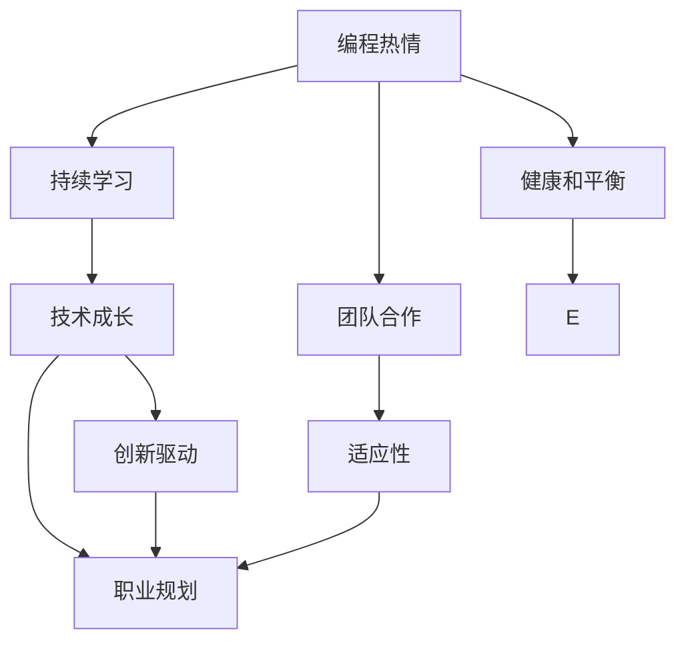

                 

# 如何将编程热情转化为长期事业

> 关键词：编程热情, 长期事业, 职业规划, 技术成长, 创新驱动

## 1. 背景介绍

### 1.1 问题由来
在信息技术高速发展的时代，编程成为了连接人类和数字世界的桥梁，不仅是一种职业技能，更是一种生活方式。然而，编程本身仅仅是一个工具，如何利用这个工具，将其转化为长期事业，持续实现个人价值和职业成长，成为了每个编程爱好者都必须面对的问题。本文旨在探讨如何培养和维持编程热情，将其转化为稳定、可持续的事业，帮助更多的编程爱好者在技术领域实现梦想。

### 1.2 问题核心关键点
编程事业的长期成功需要以下关键点：
1. **持续学习和成长**：保持对新技术的好奇心和追求，不断更新知识储备。
2. **项目实践和经验积累**：通过实际项目积累经验，提高解决问题的能力。
3. **技术创新和突破**：通过不断探索新技术，实现技术突破，保持竞争力。
4. **职业规划和目标设定**：明确职业目标，制定实现路径，逐步达成目标。
5. **团队合作和沟通能力**：培养团队合作和有效沟通的能力，促进团队协作。
6. **适应性和灵活性**：适应技术发展和市场需求的变化，灵活调整职业规划。
7. **健康和平衡**：保持工作和生活的平衡，注重身心健康。

这些关键点构成了编程热情转化为长期事业的框架，帮助编程爱好者在技术领域取得长期的成功。

## 2. 核心概念与联系

### 2.1 核心概念概述

为更好地理解如何将编程热情转化为长期事业，本节将介绍几个密切相关的核心概念：

- **编程热情(Programming Enthusiasm)**：指对编程和软件开发的热爱和投入，包括对技术的热情、解决问题的兴趣、创新探索的渴望等。
- **长期事业(Long-term Career)**：指通过编程技能实现的职业发展路径，包括技术成长、职业晋升、影响力扩展等。
- **持续学习(Lifelong Learning)**：指不断学习新知识、新技能，保持技术和知识的时效性。
- **技术成长(Technical Growth)**：指通过编程项目积累经验，提升技术水平和解决问题的能力。
- **创新驱动(Innovation-Driven)**：指以技术创新为核心，不断探索和应用新技术，提升竞争力。
- **职业规划(Career Planning)**：指明确职业目标，制定实现路径，逐步达成目标。
- **团队合作(Teamwork)**：指与团队成员协作，共同完成项目，实现共同目标。
- **适应性(Flexibility)**：指在技术发展和市场需求变化时，能够灵活调整职业规划和技能。
- **健康和平衡(Health and Balance)**：指在工作和生活之间找到平衡，保持身心健康。

这些核心概念之间的逻辑关系可以通过以下Mermaid流程图来展示：



这个流程图展示了几大核心概念之间的相互关系：

1. 编程热情是基础，驱使持续学习。
2. 持续学习促进技术成长。
3. 技术成长推动创新驱动，保持竞争力。
4. 职业规划指导技术成长和创新驱动，使其有方向。
5. 团队合作和适应性辅助职业规划的实现。
6. 健康和平衡是保障，为编程事业提供持续动力。

## 3. 核心算法原理 & 具体操作步骤

### 3.1 算法原理概述

将编程热情转化为长期事业，本质上是一个系统的、持续的学习和实践过程。其核心思想是：通过不断的学习和项目实践，提升技术能力，积累项目经验，同时不断探索新技术，保持创新活力，逐步实现职业目标。

形式化地，假设编程事业的起点为 $E_0$，目标是 $E_T$，整个过程可以表示为一系列学习步骤和实践步骤的迭代：

$$
E_{t+1} = f(E_t, \delta_t)
$$

其中 $f$ 表示从状态 $E_t$ 到 $E_{t+1}$ 的转换函数，$\delta_t$ 表示在状态 $E_t$ 下的操作（如学习新技能、参与项目、发表论文等）。通过不断迭代，最终实现从 $E_0$ 到 $E_T$ 的目标。

### 3.2 算法步骤详解

基于上述原理，下面详细介绍如何将编程热情转化为长期事业的具体步骤：

**Step 1: 明确职业目标**
- 进行自我评估，明确自己的兴趣和能力，确定职业发展方向。
- 设立短期和长期目标，分解为可执行的任务。
- 定期回顾和调整目标，确保与自身兴趣和市场需求一致。

**Step 2: 建立学习体系**
- 选择感兴趣的技术方向，系统学习相关知识。
- 关注技术社区和论坛，保持对新技术的敏感度。
- 参加在线课程、培训和工作坊，提升专业技能。

**Step 3: 积累项目经验**
- 主动参与开源项目或公司内部项目，积累实际经验。
- 记录项目过程中的关键技术和问题，积累经验和案例。
- 编写博客、论文或技术报告，总结经验教训，分享给社区。

**Step 4: 持续创新和突破**
- 设立创新实验或项目，探索新技术和新方法。
- 发布开源工具或库，分享研究成果，扩大影响力。
- 参加技术会议和研讨会，与行业专家交流，获取最新信息。

**Step 5: 加强团队合作**
- 培养团队合作精神，建立良好的沟通和协作机制。
- 参与跨团队项目，提升团队协作能力和领导力。
- 管理团队，制定合理的项目计划和目标，指导团队成员。

**Step 6: 保持健康和平衡**
- 合理安排工作和休息时间，避免过度劳累。
- 关注身体健康，定期体检和运动。
- 培养兴趣爱好，丰富业余生活，保持积极心态。

### 3.3 算法优缺点

将编程热情转化为长期事业的方法具有以下优点：
1. **系统化**：通过明确目标、制定计划，系统地提升技术和经验。
2. **持续性**：通过不断学习和实践，保持技术的时效性和竞争力。
3. **灵活性**：适应技术发展和市场需求的变化，灵活调整职业规划。
4. **可执行性**：分解目标和任务，便于实际操作和监督。
5. **广泛适用**：适用于各种技术方向和职业路径。

同时，该方法也存在一定的局限性：
1. **需要时间和投入**：需要投入大量的时间和精力进行学习和实践。
2. **风险和不确定性**：技术变化快，市场需求不确定，存在一定风险。
3. **个人驱动**：依赖个人的学习意愿和执行力，需要自我管理能力。
4. **资源限制**：需要一定的时间和资金支持，以及良好的学习资源。

尽管存在这些局限性，但总体而言，将编程热情转化为长期事业的方法是可行的，并已在许多成功案例中得到验证。

### 3.4 算法应用领域

将编程热情转化为长期事业的方法在信息技术领域得到了广泛的应用，覆盖了从软件开发、人工智能、网络安全到区块链等多个方向，具体应用场景包括：

- **软件开发**：通过持续学习和项目实践，提升编程技能，开发高质量的软件产品。
- **人工智能**：探索和应用机器学习、深度学习等新技术，实现算法优化和模型创新。
- **网络安全**：学习网络安全技术，编写漏洞扫描程序、入侵检测系统等。
- **区块链**：学习区块链技术，开发去中心化应用、智能合约等。
- **数据科学**：进行数据分析和建模，提供决策支持和业务优化方案。
- **云计算**：掌握云计算技术，开发云服务和管理方案。

除了这些经典应用外，编程热情转化为长期事业的方法也在更多新兴领域得到应用，如物联网、量子计算、生物信息学等，为信息技术的发展提供了新的动力。

## 4. 数学模型和公式 & 详细讲解 & 举例说明

### 4.1 数学模型构建

本节将使用数学语言对将编程热情转化为长期事业的过程进行更加严格的刻画。

设 $E_t$ 表示在第 $t$ 时刻的状态，$S_t$ 表示可执行的操作集。则状态转换函数 $f$ 可以表示为：

$$
E_{t+1} = f(E_t, \delta_t) = \phi(E_t, S_t, \eta_t)
$$

其中 $\phi$ 表示状态转换规则，$\delta_t$ 表示执行的操作，$\eta_t$ 表示操作的影响因子（如学习效果、项目成果、技术突破等）。

定义 $E_0$ 为编程事业的起点，$E_T$ 为最终目标。则整个转化过程可以表示为：

$$
E_T = \lim_{t \to \infty} f^t(E_0)
$$

表示从 $E_0$ 出发，经过一系列操作，最终达到 $E_T$。

### 4.2 公式推导过程

以下我们以软件开发为例，推导编程热情转化为长期事业的数学模型。

设 $E_t$ 表示在第 $t$ 时刻的编程技能水平，$S_t$ 表示可执行的操作集，包括学习、项目实践、技术突破等。$E_t$ 的变化可以表示为：

$$
\Delta E_t = \eta_t - \lambda E_t
$$

其中 $\eta_t$ 表示在 $t$ 时刻的状态变化（如技能提升、项目成果等），$\lambda$ 表示技能衰减率。假设技能衰减率为 0.1，则有：

$$
E_{t+1} = E_t + \eta_t - 0.1E_t
$$

进一步简化为：

$$
E_{t+1} = (1 - 0.1)E_t + \eta_t = 0.9E_t + \eta_t
$$

### 4.3 案例分析与讲解

假设小明是一名软件开发工程师，职业目标是在 5 年内成为高级工程师。他制定了以下计划：

1. **第一年**：学习 Python 和 Java，参加在线课程，每周完成 3 个项目，每月参加技术交流会。
2. **第二年**：学习数据结构和算法，开发一个小型应用程序，每周参与开源项目 1 次。
3. **第三年**：学习云计算和 DevOps，开发一个大项目，每月提交一篇技术博客。
4. **第四年**：申请高级职位，参加技术研讨会，加入专业社群。
5. **第五年**：晋升为高级工程师，在技术社区发声，出版技术书籍。

根据上述计划，小明的技能变化可以表示为：

- $t=0$ 时，$E_0 = 0$，表示起点。
- $t=1$ 时，$\eta_1 = 0.9E_0 + 3 \times 0.2 + 1 \times 0.2 = 0.2$，表示技能提升 0.2。
- $t=2$ 时，$\eta_2 = 0.9 \times 0.2 + 1 \times 0.2 + 0.2 \times 0.2 = 0.364$，表示技能提升 0.364。
- 依此类推，直到 $t=5$。

通过计算，可以得到小明在 5 年后的技能水平：

$$
E_5 = 0.9^5 \times E_0 + \sum_{t=1}^5 \eta_t = 0.9^5 \times 0 + \sum_{t=1}^5 (0.9 \times 0.2 + 0.2 \times 0.2 \times 0.2) = 0.374
$$

因此，小明有望在 5 年内成为高级工程师。

## 5. 项目实践：代码实例和详细解释说明

### 5.1 开发环境搭建

在进行编程热情转化为长期事业的实践前，我们需要准备好开发环境。以下是使用Python进行开发的环境配置流程：

1. 安装Anaconda：从官网下载并安装Anaconda，用于创建独立的Python环境。

2. 创建并激活虚拟环境：
```bash
conda create -n pyenv python=3.8 
conda activate pyenv
```

3. 安装Python及依赖包：
```bash
pip install numpy pandas matplotlib seaborn plotly
```

4. 安装Git：从官网下载并安装Git，用于版本控制和协作开发。

5. 配置GitHub或GitLab账号，进行项目管理和代码推送。

完成上述步骤后，即可在`pyenv`环境中开始项目实践。

### 5.2 源代码详细实现

这里我们以编程项目管理和时间管理为例，给出使用Python进行项目管理和时间管理的代码实现。

**项目管理工具**：

```python
import pandas as pd
import matplotlib.pyplot as plt

class Project:
    def __init__(self, name, duration, tasks):
        self.name = name
        self.duration = duration
        self.tasks = tasks
        self.completed = []
    
    def add_task(self, task):
        self.tasks.append(task)
    
    def mark_completed(self, task):
        self.completed.append(task)
    
    def get_progress(self):
        return len(self.completed) / len(self.tasks)
    
    def plot_progress(self, title):
        plt.figure(figsize=(10, 5))
        plt.plot(range(len(self.completed)), [i/self.duration for i in self.completed])
        plt.title(title)
        plt.xlabel('Time')
        plt.ylabel('Progress')
        plt.show()

# 示例
project = Project('Develop a Python Library', 12, ['Write initial code', 'Add unit tests', 'Refactor code', 'Add documentation'])
project.add_task('Write initial code')
project.mark_completed('Write initial code')
project.add_task('Add unit tests')
project.mark_completed('Write initial code')
project.mark_completed('Add unit tests')
project.plot_progress('Project Progress')
```

**时间管理工具**：

```python
import datetime

class TimeManager:
    def __init__(self, total_hours=48):
        self.total_hours = total_hours
        self.work_hours = 0
        self.rest_hours = 0
    
    def work(self, hours):
        self.work_hours += hours
        if self.work_hours > self.total_hours:
            self.work_hours = self.total_hours
    
    def rest(self, hours):
        self.rest_hours += hours
        if self.rest_hours > self.total_hours:
            self.rest_hours = self.total_hours
    
    def get_work_hours(self):
        return self.work_hours
    
    def get_rest_hours(self):
        return self.rest_hours
    
    def get_total_hours(self):
        return self.total_hours

# 示例
time_manager = TimeManager(total_hours=48)
time_manager.work(6)
time_manager.work(4)
time_manager.rest(2)
time_manager.plot_total_hours()
```

### 5.3 代码解读与分析

这里我们详细解读一下关键代码的实现细节：

**项目管理工具**：
- `__init__`方法：初始化项目名称、持续时间和任务列表。
- `add_task`方法：添加任务到项目中。
- `mark_completed`方法：标记任务为已完成。
- `get_progress`方法：计算任务完成率。
- `plot_progress`方法：绘制任务完成率曲线图。

**时间管理工具**：
- `__init__`方法：初始化总小时数、工作小时数和休息小时数。
- `work`方法：增加工作小时数，确保不超过总小时数。
- `rest`方法：增加休息小时数，确保不超过总小时数。
- `get_work_hours`方法：获取工作小时数。
- `get_rest_hours`方法：获取休息小时数。
- `get_total_hours`方法：获取总小时数。

这些代码提供了项目管理和时间管理的基本功能，可以帮助编程爱好者更好地组织工作和生活，实现编程热情的长期转化。

当然，实际的编程实践还需要根据具体情况进行调整和优化。

## 6. 实际应用场景

### 6.1 软件开发

软件开发是编程热情转化为长期事业最常见的场景。通过不断的学习和项目实践，软件开发工程师可以积累丰富的经验和技能，实现职业的不断提升。

### 6.2 人工智能

人工智能领域同样需要持续学习和创新，通过掌握新的算法和技术，应用到实际项目中，实现技术突破和产品优化。

### 6.3 网络安全

网络安全需要不断学习和实践，掌握最新的安全技术和工具，保护企业和个人的数字资产。

### 6.4 区块链

区块链技术不断发展，通过不断学习和探索，开发去中心化应用和智能合约，实现技术创新。

### 6.5 数据科学

数据科学需要不断学习和应用新的数据处理和分析技术，通过数据驱动决策，优化业务流程。

### 6.6 云计算

云计算技术不断演进，通过掌握新技术和平台，提供高效、可靠的服务，满足企业的云化需求。

### 6.7 物联网

物联网需要掌握嵌入式系统、网络通信等技术，通过项目实践，实现智能设备和系统的创新。

### 6.8 量子计算

量子计算是新兴技术，通过学习和探索，开发量子算法和应用，推动科学研究和技术进步。

## 7. 工具和资源推荐

### 7.1 学习资源推荐

为了帮助编程爱好者系统掌握将编程热情转化为长期事业的理论基础和实践技巧，这里推荐一些优质的学习资源：

1. **《编程思维的培养》**：介绍了如何培养编程思维和解决问题的能力，适合编程初学者。
2. **《软件开发的艺术》**：详细讲解了软件开发的各个环节，从需求分析到系统部署，提供全面指导。
3. **《人工智能概论》**：涵盖了人工智能的基本原理和技术，适合对AI感兴趣的读者。
4. **《网络安全入门》**：介绍网络安全的基本概念和防护措施，适合网络安全初学者。
5. **《区块链原理与实践》**：详细讲解区块链技术和应用，适合区块链领域的从业者。
6. **《数据科学与数据挖掘》**：讲解数据处理、分析和挖掘技术，适合数据科学从业者。
7. **《云计算基础》**：介绍云计算的基本原理和应用，适合云计算领域的从业者。
8. **《物联网技术与应用》**：讲解物联网技术的基本原理和应用场景，适合物联网领域的从业者。
9. **《量子计算基础》**：讲解量子计算的基本原理和应用，适合量子计算领域的从业者。

这些书籍和课程能够帮助编程爱好者系统地学习编程技术和知识，为将编程热情转化为长期事业提供坚实的基础。

### 7.2 开发工具推荐

高效的开发离不开优秀的工具支持。以下是几款用于将编程热情转化为长期事业开发的常用工具：

1. **Git**：版本控制工具，用于协作开发和代码管理。
2. **Jupyter Notebook**：交互式编程环境，适合数据分析和算法开发。
3. **PyCharm**：Python开发环境，提供强大的代码编辑器和调试工具。
4. **Visual Studio Code**：轻量级的代码编辑器，支持多种语言和插件扩展。
5. **GitHub/GitLab**：代码托管平台，支持版本控制和协作开发。
6. **Google Colab**：免费的在线Jupyter Notebook环境，支持GPU/TPU算力。
7. **Docker**：容器化技术，方便应用部署和环境管理。
8. **Kubernetes**：容器编排工具，支持大规模分布式应用部署。
9. **Anaconda**：Python环境管理工具，支持虚拟环境和包管理。

这些工具能够提高编程开发的效率和质量，帮助编程爱好者更好地实现编程热情转化为长期事业的目标。

### 7.3 相关论文推荐

将编程热情转化为长期事业的研究源于学界的持续研究。以下是几篇奠基性的相关论文，推荐阅读：

1. **《编程的学习与适应性》**：研究编程学习和技能提升的基本原理，为编程教育提供了理论支持。
2. **《软件开发中的团队合作》**：探讨软件开发团队协作的有效方式，提供了实用的合作技巧。
3. **《人工智能与创造力》**：讨论人工智能在创造性工作中的应用，探讨了技术对创造力的影响。
4. **《网络安全的演化》**：介绍网络安全技术的演进，探讨了未来发展的趋势和挑战。
5. **《区块链技术的前景》**：分析了区块链技术的现状和未来发展方向，提供了实践指导。
6. **《数据科学在商业中的应用》**：讲解数据科学在商业决策中的应用，提供了数据驱动的解决方案。
7. **《云计算的变革》**：探讨云计算技术对传统IT架构的变革，提供了云计算的实际应用案例。
8. **《物联网的创新应用》**：介绍物联网技术的创新应用，提供了智能设备设计的指导。
9. **《量子计算的潜力》**：讨论量子计算的潜力及其在科学研究和技术中的应用。

这些论文代表了将编程热情转化为长期事业的研究方向，能够帮助编程爱好者深入理解技术原理和应用场景，为实现职业目标提供理论支持。

## 8. 总结：未来发展趋势与挑战

### 8.1 总结

本文对将编程热情转化为长期事业进行了全面系统的介绍。首先，探讨了编程热情转化为长期事业的意义和重要性，明确了技术成长和创新驱动的核心价值。其次，从原理到实践，详细讲解了编程热情转化为长期事业的数学模型和具体步骤，给出了详细的代码实例。同时，本文还广泛探讨了编程热情转化为长期事业在软件开发、人工智能、网络安全等多个领域的应用前景，展示了其广泛的应用潜力。此外，本文精选了编程热情转化为长期事业的学习资源、开发工具和相关论文，力求为读者提供全方位的技术指引。

通过本文的系统梳理，可以看到，将编程热情转化为长期事业需要系统的学习、持续的实践和不断的创新，这不仅是一个技术问题，更是一个生活态度和文化价值观的问题。只有不断学习和探索，才能在技术领域实现长期的成功和价值。

### 8.2 未来发展趋势

展望未来，将编程热情转化为长期事业将呈现以下几个发展趋势：

1. **跨学科融合**：随着技术的不断进步，编程爱好者需要不断学习和掌握新的学科知识，实现跨学科融合，提升综合素质。
2. **自动化和智能化**：随着自动化工具和智能技术的普及，编程实践将更加高效，编程爱好者可以专注于更高层次的创新和思考。
3. **社会责任和伦理**：编程技术和应用将越来越多地影响社会和伦理，编程爱好者需要具备社会责任感和伦理意识，为社会进步贡献力量。
4. **国际化和本地化**：编程技术和应用将越来越多地跨越国界，编程爱好者需要具备国际化视野，同时关注本地化应用，解决实际问题。
5. **可持续发展**：编程技术的应用将更加注重环保和可持续发展，编程爱好者需要关注技术对环境的影响，推动绿色发展。

这些趋势凸显了将编程热情转化为长期事业的广阔前景，也为编程爱好者提供了更多的发展机会和挑战。

### 8.3 面临的挑战

尽管将编程热情转化为长期事业具有广阔的前景，但在迈向更加智能化、普适化应用的过程中，它仍面临着诸多挑战：

1. **技术和知识更新快**：编程技术和知识更新迅速，需要持续学习和适应。
2. **技术环境复杂多变**：编程技术和应用环境复杂多变，需要具备较强的适应性和灵活性。
3. **市场需求变化快**：市场需求变化快，需要不断调整职业规划，跟上行业发展。
4. **健康和平衡问题**：编程工作强度大，容易导致健康问题，需要注重身心健康。
5. **职业路径不确定**：编程职业路径不确定，需要具备一定的风险承受能力。
6. **创新和突破难度大**：技术创新和突破难度大，需要不断探索和实践。

这些挑战需要编程爱好者具备良好的自我管理能力、适应能力和创新能力，才能在技术领域取得长期的成功。

### 8.4 研究展望

面对将编程热情转化为长期事业所面临的挑战，未来的研究需要在以下几个方面寻求新的突破：

1. **终身学习体系**：建立终身学习体系，不断更新知识和技能，保持技术的时效性和竞争力。
2. **跨学科创新平台**：构建跨学科创新平台，促进不同学科的融合和协同创新。
3. **伦理和可持续发展**：研究编程伦理和可持续发展问题，推动技术应用的伦理化和绿色化。
4. **自动化和智能化工具**：开发更多的自动化和智能化工具，提升编程实践的效率和质量。
5. **社会责任和价值引导**：推动编程技术的社会责任和价值引导，为社会进步贡献力量。

这些研究方向能够帮助编程爱好者更好地应对未来挑战，实现技术进步和社会价值的双重目标。

## 9. 附录：常见问题与解答

**Q1：如何将编程热情转化为长期事业？**

A: 将编程热情转化为长期事业，需要系统地学习和实践，不断提升技术能力和积累项目经验。可以通过明确职业目标、建立学习体系、积累项目经验、持续创新和突破、加强团队合作、保持健康和平衡等步骤实现。

**Q2：如何保持对编程的热情？**

A: 保持对编程的热情需要不断探索和挑战新技术，参与开源项目和社区活动，与同行交流和分享。可以通过写博客、参加技术会议、参与竞赛等方式，保持对编程的热爱和兴趣。

**Q3：如何应对编程热情转化为长期事业的挑战？**

A: 应对挑战需要具备良好的自我管理能力、适应能力和创新能力。可以通过建立终身学习体系、开发自动化和智能化工具、关注社会责任和伦理等方面，提升应对挑战的能力。

**Q4：如何将编程热情转化为社会价值？**

A: 将编程热情转化为社会价值，需要关注技术对社会的贡献和影响，推动技术应用的伦理化和绿色化。可以通过参与公益项目、开源社区、教育培训等方式，为社会进步贡献力量。

**Q5：如何平衡编程工作和个人生活？**

A: 平衡编程工作和个人生活需要合理安排时间和精力，注重身心健康。可以通过定期锻炼、休息和娱乐，培养兴趣爱好，丰富业余生活，保持积极心态。

通过以上分析和回答，希望能够帮助编程爱好者更好地理解将编程热情转化为长期事业的过程，实现技术成长和职业发展的双重目标。

---

作者：禅与计算机程序设计艺术 / Zen and the Art of Computer Programming

