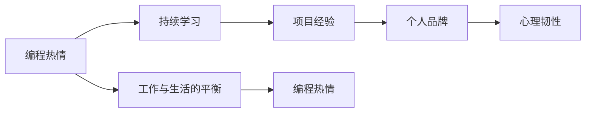

                 

# 如何将编程热情转化为长期事业

## 1. 背景介绍

### 1.1 问题由来

编程作为一门快速发展的技术，已成为当前社会众多行业不可或缺的一部分。无论是互联网、金融、医疗还是教育领域，都在不断寻求数字化转型，而编程正是这一转型的重要推动力。然而，在这样一个蓬勃发展的行业里，编程热情的保持和转化，仍然是一个不小的挑战。在科技日益变化、需求不断更新的背景下，如何将一时的编程热情转化为长期稳定的事业，成为了众多编程爱好者和专业人士共同的追求。

### 1.2 问题核心关键点

本节将从编程热情转化的几个关键点出发，阐述其背后的逻辑和策略。

1. **持续学习**：编程技术日新月异，只有不断学习和掌握新知识，才能在竞争激烈的行业环境中保持优势。
2. **适应变化**：随着技术和市场的变化，编程需求也会随之改变，适应变化的能力至关重要。
3. **项目经验**：参与实际项目不仅能够积累经验，还能更好地理解编程与业务的结合。
4. **个人品牌**：在编程社区和平台上建立个人品牌，可以提升知名度和影响力。
5. **心理韧性**：面对编程过程中遇到的困难和挑战，保持心理韧性是长期坚持的关键。
6. **工作与生活的平衡**：合理的工作与生活平衡有助于长期保持编程热情。

### 1.3 问题研究意义

将编程热情转化为长期事业，不仅有助于个人的职业发展，也对企业和行业的发展具有重要意义。

1. **人才留存**：拥有稳定热情的编程人才，是企业长期发展的基石。
2. **技术创新**：持续热情的技术人员能够推动技术进步和创新，提升企业的竞争力。
3. **客户满意度**：高效、稳定、有热情的编程团队，能够提供更高质量的产品和服务。
4. **行业生态**：积极向上的编程社区，有助于整个行业生态的健康发展。

## 2. 核心概念与联系

### 2.1 核心概念概述

为了深入理解如何将编程热情转化为长期事业，我们需要先了解几个核心概念：

- **编程热情(Programming Enthusiasm)**：指编程者对编程的兴趣、热爱和对新技术、新方法的探索欲望。
- **持续学习(Continuous Learning)**：指通过不断的学习和实践，提升自身技能和知识的过程。
- **项目经验(Project Experience)**：通过参与实际项目，积累编程实战经验，理解业务需求和技术实现。
- **个人品牌(Personal Brand)**：通过在编程社区、博客、社交媒体上分享经验和技术，建立自己的品牌影响力。
- **心理韧性(Psychological Resilience)**：面对编程中的挑战和压力，保持积极乐观的心态和解决问题的能力。
- **工作与生活的平衡(Work-Life Balance)**：合理规划工作和生活，避免过度劳累和疲劳，保持持续的编程热情。

这些概念之间的联系可以通过以下Mermaid流程图来展示：



这个流程图展示了编程热情通过持续学习和项目经验不断积累，再通过个人品牌建设增强影响力，在心理韧性和工作生活平衡的支撑下，最终转化为长期稳定的编程事业。

## 3. 核心算法原理 & 具体操作步骤

### 3.1 算法原理概述

将编程热情转化为长期事业，本质上是一个动态的、适应性强的过程。其核心思想是通过不断学习和实践，逐步积累项目经验，建立个人品牌，增强心理韧性，并实现工作与生活的平衡，最终使编程热情得以持续。

形式化地，可以将其看作一个多阶段模型，其中每个阶段都有其目标和实现策略。下面将详细阐述这一过程的算法原理。

### 3.2 算法步骤详解

#### 第一步：设定明确目标

- **短期目标**：设定在某一阶段需要掌握的具体技术或完成的项目，如学习一门编程语言、开发一个小型应用等。
- **长期目标**：设定在一定时间范围内（如1年、3年、5年）需要达到的职业成就，如成为高级开发者、项目负责人、技术主管等。

#### 第二步：制定学习计划

- **选择合适的学习资源**：根据目标选择合适的学习材料，包括在线课程、书籍、视频教程等。
- **制定学习时间表**：合理分配每天、每周、每月的学习时间，确保学习的连续性和有效性。

#### 第三步：积累项目经验

- **参与开源项目**：通过参与开源社区的项目，积累实战经验，同时学习其他开发者的最佳实践。
- **贡献代码**：在开源项目中积极贡献代码，解决实际问题，提升解决问题的能力。
- **自主开发项目**：选择感兴趣的领域，自主开发项目，实践所学知识。

#### 第四步：建立个人品牌

- **博客和社交媒体**：在博客、技术社区、社交媒体上分享学习心得和技术文章，建立专业形象。
- **参与技术会议**：参加技术会议、讲座、研讨会，扩大人脉，展示个人能力。
- **发表学术论文**：在技术期刊、会议上发表论文，提升学术影响力。

#### 第五步：增强心理韧性

- **面对挑战**：将编程中的问题视为成长的机会，积极面对并解决。
- **寻求支持**：在遇到难题时，及时向社区、同事、导师寻求帮助。
- **保持乐观**：保持积极心态，相信通过努力能够克服困难。

#### 第六步：实现工作与生活的平衡

- **时间管理**：合理安排工作时间，避免加班和疲劳。
- **健康生活**：注意饮食、运动和休息，保持良好的身体状态。
- **家庭和社交**：与家人、朋友保持良好的沟通，享受家庭和社交生活。

### 3.3 算法优缺点

将编程热情转化为长期事业的算法具有以下优点：

- **系统性**：通过明确目标、制定计划、积累经验等步骤，使整个过程有条不紊。
- **适应性**：能够适应技术、市场需求的变化，灵活调整学习内容和方法。
- **可持续性**：通过建立个人品牌和心理韧性，保持长期发展的动力。

同时，也存在以下缺点：

- **初期投入大**：需要大量时间和精力进行学习，初期可能感到压力大。
- **需要自我驱动力**：需要持续的自我驱动和自律，才能保持学习计划的有效性。
- **外部环境影响**：外部环境的变动（如经济、行业变化）可能会影响长期发展。

### 3.4 算法应用领域

该算法在多个领域都有广泛的应用：

- **软件开发**：软件工程师通过不断学习和实践，提升技术水平，积累项目经验，建立个人品牌。
- **数据科学**：数据科学家通过持续学习新算法、新工具，解决实际问题，发表研究论文，提升专业影响力。
- **人工智能**：AI研究人员通过参与开源项目、发表论文、参加会议，展示研究成果，增强技术影响力。
- **系统架构**：系统架构师通过学习新技术、参与项目、分享经验，提升专业知识和技能。

## 4. 数学模型和公式 & 详细讲解 & 举例说明

### 4.1 数学模型构建

将编程热情转化为长期事业的过程，可以抽象为如下数学模型：

$$
\text{长期事业} = f(\text{编程热情}, \text{持续学习}, \text{项目经验}, \text{个人品牌}, \text{心理韧性}, \text{工作与生活的平衡})
$$

其中，$f$ 表示一系列转化过程，包括学习、实践、积累、展示、应对和平衡。

### 4.2 公式推导过程

为了更好地理解这一转化过程，我们通过推导一个简单的公式来说明：

假设 $E_t$ 表示在第 $t$ 阶段编程热情的效用值，$E_t=f(\text{目标}, \text{计划}, \text{经验}, \text{品牌}, \text{韧性}, \text{平衡})$。则整个转化过程的效用值 $E_{long}$ 可以表示为：

$$
E_{long} = \sum_{t=1}^{T} E_t
$$

其中 $T$ 表示长期发展的阶段数。

### 4.3 案例分析与讲解

以软件开发为例，具体说明如何将编程热情转化为长期事业。

1. **设定短期目标**：学习 Python 编程语言，开发一个简单的 Web 应用。
2. **制定学习计划**：每天学习 2 小时，每周完成一个小的项目。
3. **积累项目经验**：通过参与开源项目，贡献代码，解决实际问题。
4. **建立个人品牌**：在 GitHub 上分享项目代码，在博客上发布学习心得，参加技术交流会。
5. **增强心理韧性**：面对项目中的问题，积极解决，寻求同事帮助。
6. **实现工作与生活的平衡**：合理安排工作时间，注意身体健康和家庭生活。

通过这一系列步骤，编程热情得以不断转化和强化，最终实现长期稳定的事业。

## 5. 项目实践：代码实例和详细解释说明

### 5.1 开发环境搭建

在开始项目实践前，需要准备好开发环境。以下是使用 Python 进行 Django 开发的常见环境配置流程：

1. 安装 Anaconda：从官网下载并安装 Anaconda，用于创建独立的 Python 环境。

```bash
conda create -n myenv python=3.9
conda activate myenv
```

2. 安装 Django：根据系统要求，使用 pip 安装 Django 框架。

```bash
pip install django
```

3. 安装其他工具包：

```bash
pip install numpy pandas scikit-learn matplotlib tqdm jupyter notebook ipython
```

完成上述步骤后，即可在 `myenv` 环境中开始 Django 开发。

### 5.2 源代码详细实现

以下是使用 Django 框架开发一个简单的博客应用的示例代码：

1. 创建 Django 项目：

```bash
django-admin startproject myblog
```

2. 创建 Django 应用：

```bash
cd myblog
python manage.py startapp blog
```

3. 实现博客模型：

```python
from django.db import models

class BlogPost(models.Model):
    title = models.CharField(max_length=200)
    content = models.TextField()
    published_date = models.DateTimeField('date published')
    updated_date = models.DateTimeField('date updated')
```

4. 实现博客视图和模板：

```python
from django.shortcuts import render
from .models import BlogPost

def blog_index(request):
    posts = BlogPost.objects.all().order_by('-published_date')
    return render(request, 'blog/index.html', {'posts': posts})
```

5. 创建模板文件：

```html
<!-- blog/index.html -->
<!DOCTYPE html>
<html>
<head>
    <title>My Blog</title>
</head>
<body>
    <h1>My Blog</h1>
    <ul>
        
            <li><a href="">{{ post.title }}</a></li>
        
    </ul>
    <p><a href="">New Post</a></p>
</body>
</html>
```

### 5.3 代码解读与分析

让我们再详细解读一下关键代码的实现细节：

- **Django 项目配置**：在 `myblog/settings.py` 文件中配置数据库和应用，确保应用能够正确启动。
- **模型定义**：在 `blog/models.py` 文件中定义 BlogPost 模型，包括标题、内容、发布日期和更新日期。
- **视图实现**：在 `blog/views.py` 文件中实现博客主页视图，查询并展示所有博客文章。
- **模板渲染**：在 `blog/templates/blog/index.html` 文件中定义模板，展示博客文章列表。

通过这一示例，我们可以看到 Django 开发一个简单的博客应用的流程，以及如何将编程热情转化为实际的项目实践。

### 5.4 运行结果展示

运行上述代码后，可以在浏览器中访问 `http://localhost:8000`，查看博客应用的效果。

## 6. 实际应用场景

### 6.1 智能客服系统

基于编程热情的智能客服系统开发，可以广泛应用于企业客服部门，提升客户服务效率和体验。

1. **需求分析**：明确客服系统的功能需求，如自动回答常见问题、记录客户咨询、统计分析等。
2. **技术选型**：选择合适的编程语言和框架，如 Python 和 Django，搭建客服系统。
3. **系统实现**：开发自动回答功能，集成第三方聊天机器人，实现客户咨询记录和统计分析。
4. **测试和部署**：进行系统测试，确保功能的稳定性和可靠性，部署到生产环境。

### 6.2 金融舆情监测

金融领域的智能舆情监测系统，通过编程热情和技术积累，可以实时监控市场动态，预警风险。

1. **需求分析**：分析金融市场的数据来源和分析需求，确定系统功能。
2. **技术选型**：选择适合的数据处理和分析工具，如 Python 和 Pandas，构建舆情监测系统。
3. **数据采集和处理**：采集金融市场数据，进行数据清洗和预处理，确保数据质量。
4. **舆情分析**：使用文本分析、情感分析等技术，分析市场舆情，生成报告。
5. **系统部署**：将系统部署到云平台，提供实时预警服务。

### 6.3 个性化推荐系统

基于编程热情的个性化推荐系统，可以为用户提供个性化的内容推荐，提升用户体验。

1. **需求分析**：分析用户行为数据和内容推荐的需求，确定系统功能。
2. **技术选型**：选择适合的内容推荐算法和推荐引擎，如 Python 和 Scikit-learn。
3. **数据处理**：处理用户行为数据，提取特征，准备推荐模型。
4. **模型训练和评估**：训练推荐模型，评估模型效果，优化推荐算法。
5. **系统部署**：将推荐系统集成到产品中，实时推荐内容。

### 6.4 未来应用展望

随着编程热情的不断积累和转化，未来将有更多基于编程热情的应用场景出现。

1. **智慧医疗**：开发智能诊疗系统，提升医疗服务的智能化水平。
2. **智慧教育**：开发个性化学习平台，实现因材施教，提升教育质量。
3. **智慧城市**：开发智能管理平台，提高城市治理的智能化水平。
4. **智慧制造**：开发智能生产系统，提高制造业的生产效率和质量。

## 7. 工具和资源推荐

### 7.1 学习资源推荐

为了帮助开发者系统掌握将编程热情转化为长期事业的理论基础和实践技巧，这里推荐一些优质的学习资源：

1. **Django 官方文档**：Django 框架的官方文档，提供了详细的教程和示例，帮助开发者快速上手 Django 开发。
2. **Python 编程基础**：《Python 编程：从入门到实践》一书，适合编程初学者的入门书籍。
3. **Web 开发实战**：《Web 开发实战》一书，介绍了 Web 开发的流程和实战经验，适合进阶学习。
4. **数据分析与机器学习**：《Python 数据分析与机器学习实战》一书，介绍了数据分析和机器学习的基本流程和实践方法。
5. **编程与数据科学社区**：Stack Overflow、GitHub、Kaggle 等社区，提供丰富的编程资源和实践案例。

通过对这些资源的学习实践，相信你一定能够系统掌握将编程热情转化为长期事业的精髓，并用于解决实际的编程问题。

### 7.2 开发工具推荐

高效的开发离不开优秀的工具支持。以下是几款用于 Django 开发的常用工具：

1. **Django 框架**：Django 框架，提供高效的 Web 开发支持，具有丰富的插件和扩展。
2. **Visual Studio Code**：VS Code，一款轻量级代码编辑器，支持 Python 开发。
3. **PyCharm**：PyCharm，一款强大的 Python IDE，提供丰富的开发工具和调试功能。
4. **Git**：Git，版本控制系统，方便代码管理和协作。
5. **Docker**：Docker，容器化解决方案，便于代码打包和部署。

合理利用这些工具，可以显著提升 Django 开发效率，加快创新迭代的步伐。

### 7.3 相关论文推荐

将编程热情转化为长期事业的研究源于学界的持续研究。以下是几篇奠基性的相关论文，推荐阅读：

1. **《Python 编程：从入门到实践》**：适合编程初学者的入门书籍，介绍了 Python 编程基础和实战经验。
2. **《Web 开发实战》**：介绍了 Web 开发的流程和实战经验，适合进阶学习。
3. **《Python 数据分析与机器学习实战》**：介绍了数据分析和机器学习的基本流程和实践方法。
4. **《Django 官方文档》**：Django 框架的官方文档，提供了详细的教程和示例，帮助开发者快速上手 Django 开发。
5. **《Django REST framework 文档》**：介绍了 Django REST 框架的使用方法和实战案例。

这些论文代表了大语言模型微调技术的发展脉络。通过学习这些前沿成果，可以帮助研究者把握学科前进方向，激发更多的创新灵感。

## 8. 总结：未来发展趋势与挑战

### 8.1 总结

本文对将编程热情转化为长期事业的过程进行了全面系统的介绍。首先阐述了编程热情转化的几个关键点，明确了其背后的逻辑和策略。其次，从原理到实践，详细讲解了编程热情转化的数学模型和公式，给出了微调任务开发的完整代码实例。同时，本文还广泛探讨了编程热情转化的应用场景，展示了其广阔的前景。此外，本文精选了编程热情转化的各类学习资源，力求为开发者提供全方位的技术指引。

通过本文的系统梳理，可以看到，将编程热情转化为长期事业的过程，是一个系统性、适应性和可持续性的过程。在这一过程中，持续学习、积累经验、建立品牌、增强韧性、实现平衡，是实现长期发展的关键。

### 8.2 未来发展趋势

展望未来，编程热情转化的趋势将呈现以下几个方向：

1. **技术不断更新**：随着新技术的不断涌现，编程热情转化的过程也需要不断适应和更新。
2. **应用场景扩展**：编程热情转化的应用场景将不断扩展，涵盖更多的领域和行业。
3. **人才培养**：持续热情的编程人员将更受企业和行业欢迎，成为未来的技术骨干。
4. **社会影响力**：编程热情转化的个人品牌将带来更大的社会影响力，促进技术传播和普及。
5. **工作与生活平衡**：合理的平衡将提升编程人员的幸福感，减少职业倦怠。

这些趋势表明，将编程热情转化为长期事业不仅是技术发展的方向，更是社会进步的体现。

### 8.3 面临的挑战

尽管将编程热情转化为长期事业的过程充满机遇，但也需要面对一些挑战：

1. **学习曲线陡峭**：编程技能的学习和提升需要时间和精力，初期可能感到压力较大。
2. **竞争激烈**：编程行业竞争激烈，需要不断提升自身能力，才能保持竞争力。
3. **心理压力**：面对编程中的挑战和压力，需要保持良好的心理状态和积极的心态。
4. **生活与工作的平衡**：合理规划工作和生活，避免过度劳累和疲劳，才能保持持续的热情。

这些挑战需要在技术、心理和社会层面综合应对，才能实现长期稳定的事业。

### 8.4 研究展望

未来研究需要在以下几个方面寻求新的突破：

1. **持续学习机制**：开发更加灵活和自动化的学习机制，适应快速变化的技术和市场。
2. **项目经验积累**：建立更有效的项目经验和知识分享机制，促进技术交流和创新。
3. **心理韧性培养**：研究心理韧性的培养方法，帮助编程人员更好地应对挑战和压力。
4. **工作与生活的平衡**：探索更合理的工作和生活平衡方法，提升编程人员的生活质量。
5. **社会责任**：探索编程热情转化在社会责任和公益方面的应用，贡献更多社会价值。

这些研究方向的探索，将有助于实现编程热情转化的可持续性，为构建更加美好、智能的社会贡献力量。

## 9. 附录：常见问题与解答

**Q1：如何将编程热情转化为长期事业？**

A: 编程热情转化为长期事业需要持续学习和积累，建立个人品牌，增强心理韧性，并实现工作与生活的平衡。通过明确目标、制定计划、积累项目经验、建立个人品牌、增强心理韧性和实现平衡，可以实现编程热情的持续转化和强化。

**Q2：如何保持编程热情？**

A: 保持编程热情需要不断学习和实践，积累项目经验，建立个人品牌，增强心理韧性，并实现工作与生活的平衡。通过持续学习、积累项目经验、建立个人品牌、增强心理韧性和实现平衡，可以保持编程热情的持续。

**Q3：编程热情转化为长期事业的难点在哪里？**

A: 编程热情转化为长期事业的难点在于需要持续学习和积累，建立个人品牌，增强心理韧性，并实现工作与生活的平衡。初期可能需要大量时间和精力进行学习，面临较大的压力和挑战。

**Q4：如何提高编程技能？**

A: 提高编程技能需要不断学习和实践，积累项目经验，建立个人品牌，增强心理韧性，并实现工作与生活的平衡。通过持续学习、积累项目经验、建立个人品牌、增强心理韧性和实现平衡，可以提升编程技能。

**Q5：如何建立个人品牌？**

A: 建立个人品牌需要在博客、技术社区、社交媒体上分享学习心得和技术文章，参加技术会议，发表论文。通过持续分享和展示，建立专业形象，提升影响力。

**Q6：如何增强心理韧性？**

A: 增强心理韧性需要面对挑战，积极解决，寻求同事帮助，保持乐观。通过积极面对挑战，寻求帮助，保持乐观，可以增强心理韧性，应对编程中的压力和困难。

**Q7：如何实现工作与生活的平衡？**

A: 实现工作与生活的平衡需要合理安排工作时间，注意身体健康和家庭生活。通过合理安排时间，注意健康和家庭，可以保持长期热情，避免过度劳累和疲劳。

---

作者：禅与计算机程序设计艺术 / Zen and the Art of Computer Programming

