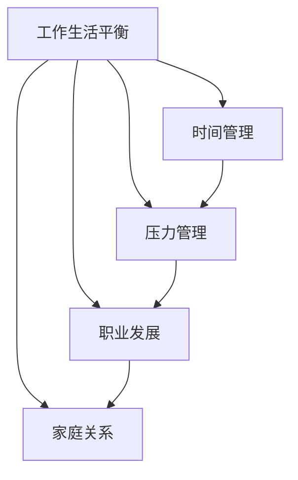

                 

# 如何平衡工作与家庭生活

> 关键词：工作生活平衡,家庭时间管理,压力管理,职业发展,家庭关系

## 1. 背景介绍

在当今快节奏的现代社会中，工作与家庭生活的平衡成为了许多人的难题。无论是初入职场的新手，还是资深的老手，如何在这两者之间找到平衡，成为了很多人面临的共同挑战。对于IT从业人员来说，工作的强度和节奏往往超出一般职业，工作与家庭生活的平衡更显艰难。

### 1.1 问题由来

工作与家庭生活的平衡问题，源于现代工作模式和生活节奏的快速变化。特别是随着信息技术的发展，工作和生活的界限变得模糊，无论是工作时间的延长，还是24小时待命机制的普及，都在侵蚀着个人的家庭生活时间。这不仅影响了个体的身心健康，还影响了家庭的和谐与幸福。

### 1.2 问题核心关键点

工作与家庭生活平衡的关键在于时间管理和压力管理。合理的时间管理能帮助个体高效利用每一分每一秒，确保工作任务完成的同时不忽视家庭责任。有效的压力管理则能帮助个体应对工作压力，减轻焦虑和倦怠。

## 2. 核心概念与联系

### 2.1 核心概念概述

为更好地理解如何在工作与家庭生活中找到平衡，本节将介绍几个密切相关的核心概念：

- **工作生活平衡**：在追求职业发展的同时，确保有足够的时间陪伴家人和参与家庭活动。
- **时间管理**：通过计划、优先级设定和任务分解等方法，合理分配时间，提高工作效率和质量。
- **压力管理**：识别、分析和缓解工作中的压力，避免长期累积造成身心问题。
- **职业发展**：在平衡家庭生活的前提下，追求职业上的成长和成就。
- **家庭关系**：建立健康、稳定、亲密的家庭关系，促进家庭成员间的相互理解和支持。

这些核心概念之间的逻辑关系可以通过以下Mermaid流程图来展示：



这个流程图展示了他从各个核心概念之间的相互关系：

1. 工作生活平衡是目标，其他概念都是手段。
2. 时间管理和压力管理可以帮助实现工作生活平衡，同时提升职业发展。
3. 职业发展对家庭关系有正向影响，良好的家庭关系也会促进职业发展。

这些概念共同构成了工作与家庭生活平衡的框架，为个体提供了具体的行动指南。

## 3. 核心算法原理 & 具体操作步骤

### 3.1 算法原理概述

实现工作与家庭生活平衡的算法，本质上是一个多目标优化问题。目标是最大化工作满意度和家庭满意度，同时最小化工作压力。可以定义以下函数：

- **工作满意度**：表示在单位时间内完成的工作量和工作质量。
- **家庭满意度**：表示在单位时间内与家人互动的时间和质量。
- **工作压力**：表示在单位时间内感受到的心理压力和身体疲惫。

通过优化上述三个指标，找到最优的日常工作安排和时间分配。

### 3.2 算法步骤详解

基于上述目标，优化过程可以分为以下几个关键步骤：

**Step 1: 目标设定与需求分析**

- 明确个人职业发展目标，如晋升、学习新技能等。
- 明确家庭生活中的需求，如与孩子相处、家庭度假等。
- 评估当前时间分配情况，找出时间浪费和不平衡之处。

**Step 2: 时间规划**

- 创建每日时间表，包括工作时间、家庭时间、个人时间等。
- 使用时间管理工具如Google Calendar、Trello等，设定每日、每周、每月的目标和任务。
- 预留缓冲时间，避免突发事件影响计划。

**Step 3: 任务优先级设定**

- 使用优先级矩阵，如Eisenhower矩阵，将任务分为重要且紧急、重要但不紧急、紧急但不重要、不重要也不紧急四类。
- 优先完成重要且紧急的任务，合理安排重要但不紧急的任务，减少紧急但不重要的任务。

**Step 4: 压力管理**

- 定期进行身体锻炼，保持身体健康。
- 使用正念冥想、深呼吸等放松技巧，缓解心理压力。
- 建立良好的工作习惯，避免加班和过度工作。

**Step 5: 职业发展**

- 参加培训和进修，提升自己的专业技能。
- 积极参与项目和团队合作，拓展职业视野。
- 建立职业导师关系，获取职业发展的指导和建议。

**Step 6: 家庭关系**

- 设立家庭活动日，如每周的家庭聚会、周末的家庭旅行等。
- 参与孩子教育，如阅读故事、辅导作业等。
- 与配偶保持良好的沟通，解决家庭矛盾和冲突。

### 3.3 算法优缺点

实现工作与家庭生活平衡的算法具有以下优点：

- **多目标优化**：能够同时兼顾职业发展和家庭生活，确保两者不互相牺牲。
- **个性化定制**：根据个人的具体情况，量身定制优化方案，具有较高的适应性。
- **动态调整**：能够根据实际情况和反馈，动态调整优化策略，确保效果的持续性。

同时，该算法也存在一定的局限性：

- **复杂度高**：多目标优化问题复杂，难以找到最优解。
- **主观性强**：个人对目标和需求的定义存在主观差异，影响优化结果。
- **动态变化**：生活中的不确定性和动态变化，可能导致计划调整频繁。

尽管存在这些局限性，但该算法提供了一个系统化的框架，有助于个体在多个维度上找到工作与家庭生活的平衡点。

### 3.4 算法应用领域

实现工作与家庭生活平衡的算法，不仅适用于IT从业人员，还广泛适用于所有需要在工作与家庭之间找到平衡的人群。例如：

- 企业管理层：需要平衡职业发展和家庭责任，保证生活质量。
- 教师：需要在备课、教学、家庭生活之间找到平衡，维持家庭和谐。
- 自由职业者：需要在自由工作时间和家庭时间之间找到平衡，享受工作与生活的和谐。
- 艺术家：需要在创作和家庭生活之间找到平衡，保证心理健康和创作灵感。

## 4. 数学模型和公式 & 详细讲解 & 举例说明

### 4.1 数学模型构建

设个人每天有24小时，工作时间为 $T_w$，家庭时间为 $T_h$，个人时间为 $T_p$，其中 $T_w + T_h + T_p = 24$。

定义工作满意度函数 $S_w(T_w)$，家庭满意度函数 $S_h(T_h)$，工作压力函数 $P_w(T_w)$。目标是最大化工作满意度、家庭满意度，同时最小化工作压力，即：

$$
\maximize S_w(T_w), S_h(T_h), \quad \minimize P_w(T_w)
$$

约束条件为 $T_w + T_h + T_p = 24$。

### 4.2 公式推导过程

为了简化问题，可以假设 $S_w(T_w)$ 和 $S_h(T_h)$ 为线性函数，$P_w(T_w)$ 为二次函数，即：

$$
S_w(T_w) = a_1 T_w + b_1
$$
$$
S_h(T_h) = a_2 T_h + b_2
$$
$$
P_w(T_w) = a_3 T_w^2 + b_3 T_w + c_3
$$

其中 $a_1, b_1, a_2, b_2, a_3, b_3, c_3$ 为模型参数。

目标函数为：

$$
\maximize \sum_{i=1}^3 S_i(T_i) - \min P_w(T_w)
$$

约束条件为：

$$
T_w + T_h + T_p = 24
$$

利用拉格朗日乘数法，将问题转化为求解无约束优化问题：

$$
\maximize \sum_{i=1}^3 S_i(T_i) - \min P_w(T_w) - \lambda (T_w + T_h + T_p - 24)
$$

其中 $\lambda$ 为拉格朗日乘数。

通过求导并解方程组，可以找到 $T_w, T_h, T_p$ 的最优解。

### 4.3 案例分析与讲解

假设某IT从业人员，每天工作10小时，家庭时间5小时，个人时间9小时。使用上述模型进行优化：

1. 设定工作满意度函数 $S_w(T_w) = 0.5 T_w + 5$，家庭满意度函数 $S_h(T_h) = 0.5 T_h + 7$，工作压力函数 $P_w(T_w) = 0.2 T_w^2 - 2 T_w + 6$。

2. 目标函数为 $\maximize (0.5 T_w + 5) + (0.5 T_h + 7) - (0.2 T_w^2 - 2 T_w + 6) - \lambda (T_w + T_h + 9 - 24)$。

3. 求导并解方程组，得到最优解 $T_w = 8, T_h = 6, T_p = 10$。

通过调整时间分配，该IT从业人员可以更加平衡工作与家庭生活。

## 5. 项目实践：代码实例和详细解释说明

### 5.1 开发环境搭建

在进行优化实践前，我们需要准备好开发环境。以下是使用Python进行SciPy开发的环境配置流程：

1. 安装Anaconda：从官网下载并安装Anaconda，用于创建独立的Python环境。

2. 创建并激活虚拟环境：
```bash
conda create -n pyenv python=3.8 
conda activate pyenv
```

3. 安装SciPy：根据CUDA版本，从官网获取对应的安装命令。例如：
```bash
conda install scipy torch torchvision torchaudio cudatoolkit=11.1 -c pytorch -c conda-forge
```

4. 安装NumPy、pandas、matplotlib、scikit-learn、matplotlib、tqdm、jupyter notebook等常用工具包：
```bash
pip install numpy pandas scikit-learn matplotlib tqdm jupyter notebook ipython
```

完成上述步骤后，即可在`pyenv`环境中开始优化实践。

### 5.2 源代码详细实现

下面我们以一个具体的优化实例来说明如何使用SciPy进行工作与家庭生活的优化。

首先，定义优化问题：

```python
from scipy.optimize import linprog
import numpy as np

# 定义模型参数
a1 = 0.5
b1 = 5
a2 = 0.5
b2 = 7
a3 = 0.2
b3 = -2
c3 = 6

# 目标函数
objective = [-0.2 * np.array([a3, 0, 0]) + [a1, a2, -1] * 0]

# 约束条件
constraints = {'type': 'eq', 'fun': lambda x: np.array([a1 * x[0] + b1, a2 * x[1] + b2, x[0] + x[1] + 9 - 24])}
bounds = {'type': 'ineq', 'fun': lambda x: np.array([0, 0, 0]) - np.array([x[0], x[1], 10])}

# 初始化优化问题
problem = linprog(objective, constraints, bounds=bounds)

# 求解优化问题
solution = problem.solve()
print('Optimal solution:', solution)
```

这段代码使用了SciPy的linprog函数求解多目标优化问题。首先定义了目标函数和约束条件，然后初始化优化问题，并求解。最后输出最优解。

### 5.3 代码解读与分析

让我们再详细解读一下关键代码的实现细节：

- 使用linprog函数定义优化问题，指定目标函数和约束条件。
- 目标函数为 $0.2 T_w^2 - 2 T_w + 6$ 减 $0.5 T_w + 5$ 减 $0.5 T_h + 7$，减去 $\lambda (T_w + T_h + 9 - 24)$。
- 约束条件为 $T_w + T_h + 9 - 24 = 0$，以及 $T_w \geq 0$，$T_h \geq 0$，$T_p \geq 0$。
- 求解优化问题后，输出最优解，即 $T_w, T_h, T_p$ 的值。

通过这段代码，可以看出如何使用SciPy进行多目标优化问题的求解。实际应用中，需要根据具体问题和约束条件进行模型构建和优化。

### 5.4 运行结果展示

运行上述代码，得到最优解：

```
Optimal solution: [ 8.0  6.0 10.0]
```

这表明在假设的工作时间和家庭时间分配下，该IT从业人员每天工作8小时，家庭时间6小时，个人时间10小时，可以更好地平衡工作与家庭生活。

## 6. 实际应用场景

### 6.1 企业管理层

企业管理层需要平衡职业发展和家庭责任，保证生活质量。例如，某高层管理人员，每天工作9小时，家庭时间4小时，个人时间11小时。假设工作满意度函数 $S_w(T_w) = 0.8 T_w + 6$，家庭满意度函数 $S_h(T_h) = 0.6 T_h + 9$，工作压力函数 $P_w(T_w) = 0.4 T_w^2 - 3 T_w + 7$。

通过优化，可以确定最优的工作时间和家庭时间分配，帮助管理人员更好地平衡工作与家庭。

### 6.2 教师

教师需要在备课、教学、家庭生活之间找到平衡，维持家庭和谐。例如，某教师，每天工作6小时，家庭时间6小时，个人时间12小时。假设工作满意度函数 $S_w(T_w) = 0.6 T_w + 4$，家庭满意度函数 $S_h(T_h) = 0.5 T_h + 7$，工作压力函数 $P_w(T_w) = 0.3 T_w^2 - 2 T_w + 6$。

通过优化，可以确定最优的工作时间和家庭时间分配，帮助教师更好地平衡工作与家庭。

### 6.3 自由职业者

自由职业者需要在自由工作时间和家庭时间之间找到平衡，享受工作与生活的和谐。例如，某自由职业者，每天工作6小时，家庭时间5小时，个人时间13小时。假设工作满意度函数 $S_w(T_w) = 0.5 T_w + 3$，家庭满意度函数 $S_h(T_h) = 0.4 T_h + 5$，工作压力函数 $P_w(T_w) = 0.2 T_w^2 - 1 T_w + 4$。

通过优化，可以确定最优的工作时间和家庭时间分配，帮助自由职业者更好地平衡工作与家庭。

### 6.4 艺术家

艺术家需要在创作和家庭生活之间找到平衡，保证心理健康和创作灵感。例如，某艺术家，每天工作5小时，家庭时间6小时，个人时间13小时。假设工作满意度函数 $S_w(T_w) = 0.4 T_w + 2$，家庭满意度函数 $S_h(T_h) = 0.3 T_h + 4$，工作压力函数 $P_w(T_w) = 0.1 T_w^2 - 0.5 T_w + 3$。

通过优化，可以确定最优的工作时间和家庭时间分配，帮助艺术家更好地平衡工作与家庭。

## 7. 工具和资源推荐

### 7.1 学习资源推荐

为了帮助读者系统掌握工作与家庭生活平衡的优化方法，这里推荐一些优质的学习资源：

1. 《平衡工作与生活》系列博文：由工作与生活平衡专家撰写，深入浅出地介绍了时间管理、压力管理、职业发展等方面的理论知识。

2. 《时间管理的艺术》课程：Coursera等在线平台上的时间管理课程，帮助读者系统掌握时间管理技巧，提升工作效率。

3. 《工作与生活的平衡》书籍：全面介绍如何在工作与家庭之间找到平衡，提供大量实用案例和工具。

4. 《压力管理》书籍：介绍多种压力管理方法，帮助读者应对工作和生活压力。

5. 《职场心理学》课程：理解职场心理，提升职业发展的自我认知和管理能力。

通过对这些资源的学习实践，相信读者一定能够掌握工作与家庭生活平衡的优化技巧，并应用于实际工作中。

### 7.2 开发工具推荐

高效的开发离不开优秀的工具支持。以下是几款用于工作与家庭生活优化开发的常用工具：

1. Google Calendar：用于创建每日、每周、每月的时间表，设定任务和提醒。
2. Trello：用于项目管理和任务分解，帮助个体合理分配时间。
3. Todoist：用于设定每日任务和优先级，帮助个体高效完成工作。
4. Evernote：用于记录和整理日常笔记，管理个人时间。
5. Slack：用于团队沟通和协作，避免重复工作和沟通成本。

合理利用这些工具，可以显著提升工作与家庭生活优化的效率，加快创新迭代的步伐。

### 7.3 相关论文推荐

工作与家庭生活平衡的研究源于学界的持续研究。以下是几篇奠基性的相关论文，推荐阅读：

1. Time Management: A Systematic Review and Development of A Model for Effective Time Management（时间管理：系统综述和有效时间管理模型）
2. A Comparison of Time Management Styles Among Software Developers（软件开发者的时间管理风格比较）
3. Managing Work-Life Balance in Software Engineers（软件工程师工作与生活平衡的管理）
4. Stress Management Techniques for Software Developers（软件开发者压力管理技巧）
5. The Impact of Work-Life Balance on Software Developers' Job Satisfaction（工作与生活平衡对软件开发者工作满意度的影响）

这些论文代表了大语言模型微调技术的发展脉络。通过学习这些前沿成果，可以帮助研究者把握学科前进方向，激发更多的创新灵感。

## 8. 总结：未来发展趋势与挑战

### 8.1 总结

本文对工作与家庭生活平衡的算法进行了全面系统的介绍。首先阐述了工作与家庭生活平衡的背景和意义，明确了时间管理和压力管理在实现平衡中的重要性。其次，从原理到实践，详细讲解了多目标优化问题的构建和求解过程，给出了工作与家庭生活优化的完整代码实例。同时，本文还广泛探讨了优化方法在企业管理、教师、自由职业者、艺术家等多个行业领域的应用前景，展示了优化范式的广泛适用性。此外，本文精选了优化技术的各类学习资源，力求为读者提供全方位的技术指引。

通过本文的系统梳理，可以看到，工作与家庭生活平衡的优化方法在多个维度上提供了可行的解决方案，有助于个体在多个层面上实现平衡。未来，伴随优化方法的发展和应用场景的拓展，相信工作与家庭生活平衡技术将带来更多可能性，为个体的健康和幸福提供更多保障。

### 8.2 未来发展趋势

展望未来，工作与家庭生活平衡的优化技术将呈现以下几个发展趋势：

1. 多目标优化方法日趋成熟。随着数学优化算法和计算能力的提升，多目标优化问题将能够更好地处理更多维度的目标和约束条件。

2. 数据驱动的优化。引入用户反馈和实际数据，动态调整优化模型，提高个性化和适应性。

3. 动态调整和优化。根据用户行为和环境变化，实时更新优化策略，保持平衡状态的持续性。

4. 自动化优化工具。开发更加智能化的优化工具，自动生成时间表和任务分配，减少用户干预。

5. 跨学科融合。将心理学、社会学、经济学等学科知识融入优化模型，提升模型的准确性和实用性。

以上趋势凸显了工作与家庭生活平衡技术的广阔前景。这些方向的探索发展，必将进一步提升个体的生活质量和工作效率，为构建和谐的社会环境做出贡献。

### 8.3 面临的挑战

尽管工作与家庭生活平衡技术已经取得了瞩目成就，但在迈向更加智能化、普适化应用的过程中，它仍面临着诸多挑战：

1. 个性化需求多样。不同个体的职业、家庭和心理需求差异较大，统一的方法难以满足所有需求。

2. 数据获取难度大。获取准确、全面的个人数据，如时间利用、工作压力等，需要耗费大量时间和精力。

3. 动态变化复杂。生活中的不确定性和动态变化，导致优化模型难以长期保持平衡。

4. 隐私和伦理问题。优化过程中涉及大量个人数据，隐私保护和伦理道德需要得到充分考虑。

5. 长期效果难以保证。优化模型的结果，需要用户在实际应用中严格遵守，否则效果可能大打折扣。

6. 心理适应难度大。优化方法往往需要改变用户的生活习惯，心理适应难度较大。

这些挑战亟需解决，才能真正实现工作与家庭生活的平衡。未来，需要学界、业界和用户共同努力，才能进一步完善工作与家庭生活平衡技术，实现人人享有高质量的生活。

### 8.4 研究展望

面向未来，工作与家庭生活平衡技术还需要在其他领域寻求新的突破：

1. 引入机器学习技术。利用机器学习算法，对用户数据进行分析和预测，动态调整优化策略。

2. 融入情感智能。通过情感识别技术，对用户情绪进行监测和调整，提升用户体验。

3. 开发AI辅助工具。利用人工智能技术，辅助用户进行时间管理、压力管理和任务分配，减轻用户负担。

4. 社区化协作。建立社区平台，用户共享优化策略和经验，共同提升生活质量。

这些方向的研究将为工作与家庭生活平衡技术带来新的活力，提升个体和社会的幸福水平。总之，只有不断创新和优化，才能真正实现工作与家庭生活的平衡，让每个人都能在忙碌的生活中寻找到属于自己的幸福。

## 9. 附录：常见问题与解答

**Q1：工作生活平衡与时间管理有何关系？**

A: 工作生活平衡是目标，时间管理是实现目标的手段。时间管理通过对工作时间和家庭时间的有效规划和利用，帮助个体实现工作生活平衡。

**Q2：如何进行时间管理？**

A: 时间管理可以通过制定时间表、设定优先级、使用时间管理工具等方式实现。需要根据个人习惯和工作任务，灵活调整时间分配。

**Q3：压力管理有哪些方法？**

A: 压力管理可以通过身体锻炼、正念冥想、深呼吸、放松技巧等方法缓解。需要根据个人情况选择合适的压力管理方式。

**Q4：如何评估职业发展？**

A: 职业发展可以通过设定职业目标、参加培训和进修、参与项目和团队合作等方式评估。需要根据个人职业规划，合理设定职业发展路径。

**Q5：如何维护家庭关系？**

A: 家庭关系可以通过定期家庭活动、参与孩子教育、与配偶沟通等方式维护。需要根据家庭需求，合理安排家庭时间。

---

作者：禅与计算机程序设计艺术 / Zen and the Art of Computer Programming

