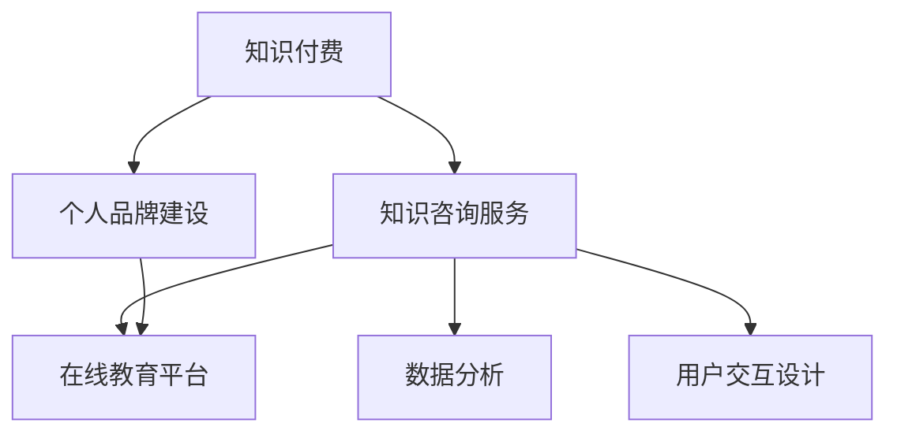

                 

# 如何打造个人知识付费咨询服务

> 关键词：知识付费、咨询服务、个人品牌建设、在线教育、技术方案、数据分析、用户交互设计

## 1. 背景介绍

随着互联网和移动互联网的迅猛发展，信息传播的效率和速度得到了极大的提升。人们对于知识的需求也随之增长，尤其在专业化、高价值的领域，如科技、金融、医疗、法律等，个人知识付费咨询服务的市场需求日渐火热。

知识付费咨询服务的兴起，一方面得益于知识传播的便捷化、碎片化，另一方面则反映出人们对专业化、深度化知识的需求日益旺盛。通过专家、学者、从业者等提供的专业知识，个人或企业可以快速解决实际问题，获取有价值的洞察和建议。

## 2. 核心概念与联系

### 2.1 核心概念概述

为了更好地理解如何打造个人知识付费咨询服务，本节将介绍几个关键概念：

- **知识付费（Knowledge Pricing）**：指通过付费获取知识和信息的一种模式，体现了知识的稀缺性和价值。个人知识付费咨询服务的核心即在于提供高质量、有深度的知识内容。

- **知识咨询服务（Knowledge Consultation Service）**：为特定用户提供针对性强、专业化的咨询建议服务，解决其面临的具体问题。这类服务通常包括但不限于技术指导、项目方案、战略规划、市场分析等。

- **个人品牌建设（Personal Branding）**：通过建立专业的个人形象，增强在特定领域的影响力和信誉度，为知识付费咨询服务打下基础。

- **在线教育平台（Online Education Platform）**：提供知识付费咨询服务的载体，可以是自有网站、APP，也可以是第三方平台如知乎、腾讯课堂等。

- **数据分析（Data Analytics）**：对用户行为、课程反馈等数据进行系统性分析，优化服务内容和用户体验。

- **用户交互设计（User Interaction Design）**：通过界面设计、交互方式等手段，提升用户的使用体验和满意度，增强付费转化率。

这些概念之间的逻辑关系可以通过以下Mermaid流程图来展示：



这个流程图展示了一些核心概念及其之间的关联：

1. 知识付费是知识咨询服务的基础，为其提供经济保障。
2. 个人品牌建设通过提升个人在特定领域的权威性，增加服务的信任度。
3. 在线教育平台是知识咨询服务的载体，用户通过平台进行咨询和付费。
4. 数据分析和用户交互设计是提升服务质量和用户体验的关键手段。

## 3. 核心算法原理 & 具体操作步骤

### 3.1 算法原理概述

打造个人知识付费咨询服务的核心算法原理主要基于以下几个方面：

- **内容质量优化算法**：通过用户反馈、互动数据等对内容进行持续优化，确保提供的信息和建议是有价值的。
- **个性化推荐算法**：利用用户的历史行为数据，进行个性化推荐，提升用户体验。
- **服务定价算法**：根据内容的价值、用户需求等因素，动态调整服务价格，实现收益最大化。
- **数据安全保护算法**：对用户敏感信息进行加密、匿名化处理，保障用户隐私。

这些算法相互配合，共同构成了个人知识付费咨询服务的核心技术框架。

### 3.2 算法步骤详解

个人知识付费咨询服务的具体操作步骤如下：

1. **市场调研与需求分析**：
   - 确定目标用户群体，了解其需求和痛点。
   - 分析市场竞争情况，确定服务差异化方向。

2. **内容生产与质量保障**：
   - 根据市场需求，设计并生产专业化的知识内容。
   - 建立内容质量审核机制，确保内容的高标准和权威性。

3. **品牌建设与形象塑造**：
   - 在社交媒体、行业论坛等渠道建立个人品牌。
   - 发布专业文章、演讲视频等，提升个人影响力。

4. **平台搭建与功能实现**：
   - 选择合适的在线教育平台或搭建自有平台。
   - 实现用户注册、内容展示、支付、评价等核心功能。

5. **数据分析与用户体验优化**：
   - 收集用户行为数据，分析用户偏好和需求。
   - 根据分析结果，优化服务内容和推荐算法。

6. **用户互动与反馈循环**：
   - 提供用户反馈渠道，收集改进建议。
   - 根据用户反馈不断优化服务内容和体验。

### 3.3 算法优缺点

打造个人知识付费咨询服务的算法具有以下优点：

- **内容精准**：通过个性化推荐和质量保障，提供与用户需求高度匹配的内容。
- **用户粘性高**：通过良好的用户体验和互动设计，提升用户满意度和忠诚度。
- **收益可控**：通过灵活的定价策略和数据分析，最大化服务收益。

同时，该算法也存在一些局限：

- **内容生产成本高**：高质量内容需要大量的时间和精力，且成本难以控制。
- **市场竞争激烈**：个人知识付费咨询市场竞争激烈，服务差异化难度大。
- **用户隐私保护**：在收集和处理用户数据时，需要严格遵守隐私保护法律法规。

### 3.4 算法应用领域

个人知识付费咨询服务可以应用于多个领域，如：

- **技术咨询**：提供技术方案、项目实施指导、技术问题解答等。
- **企业管理咨询**：提供战略规划、市场分析、组织管理等。
- **法律咨询**：提供法律问题解答、合同审核、诉讼策略等。
- **健康咨询**：提供健康管理、营养指导、心理疏导等。
- **教育培训**：提供学科知识辅导、职业培训、技能提升等。

以上仅为部分应用场景，随着知识付费咨询服务的普及，其应用领域将不断扩展。

## 4. 数学模型和公式 & 详细讲解 & 举例说明

### 4.1 数学模型构建

本节将使用数学语言对个人知识付费咨询服务进行严格刻画。

假设服务提供者为 $S$，用户为 $U$，内容集合为 $C$，付费价格为 $P$，用户对内容的满意度为 $Q$。构建一个数学模型来描述用户如何通过付费获取知识咨询服务的价值，并最大化服务收益。

定义用户满意度函数 $Q(S, C)$，反映内容质量对用户满意度的影响。定义价格函数 $P(S, C)$，反映内容价值和用户需求对服务价格的影响。定义收益函数 $R(S, U, C)$，反映用户通过付费获得服务的净收益。

目标是最小化用户不满意度，最大化服务收益，即：

$$
\min \sum_{u \in U} \max(Q(S, C(u)), 0)
$$

$$
\max \sum_{u \in U} P(S, C(u))
$$

### 4.2 公式推导过程

推导上述目标函数的过程如下：

1. **用户满意度函数 $Q(S, C)$**：假设用户对内容的需求量为 $Q_{\text{demand}}$，实际获得的满意程度为 $Q_{\text{actual}}$。则用户满意度函数可以表示为：

   $$
   Q(S, C) = \min(Q_{\text{demand}}, Q_{\text{actual}})
   $$

2. **价格函数 $P(S, C)$**：假设内容价值为 $V$，用户需求弹性为 $\epsilon$。则价格函数可以表示为：

   $$
   P(S, C) = V + \epsilon Q_{\text{actual}}
   $$

3. **收益函数 $R(S, U, C)$**：定义用户的净收益为 $R_{\text{net}}$，包括服务价格 $P$ 和内容价值 $V$。则收益函数可以表示为：

   $$
   R(S, U, C) = \sum_{u \in U} (P(S, C(u)) - V)
   $$

将上述三个函数带入目标函数，通过求解最大化收益和最小化不满意度的问题，可以得到最优的服务价格和内容策略。

### 4.3 案例分析与讲解

以一个技术咨询服务的案例为例，说明上述模型的应用。

假设某技术专家提供软件架构咨询服务，用户可以通过付费获取其提供的技术方案。用户需求弹性 $\epsilon=0.5$，内容价值 $V=100$。用户满意度的函数 $Q(S, C)$ 和价格函数 $P(S, C)$ 可以表示为：

$$
Q(S, C) = \min(Q_{\text{demand}}, Q_{\text{actual}})
$$

$$
P(S, C) = 100 + 0.5 Q_{\text{actual}}
$$

其中 $Q_{\text{demand}}$ 是用户对咨询内容的需求量，$Q_{\text{actual}}$ 是实际获得的满意度。

假设用户需求量为10个，即 $Q_{\text{demand}}=10$。设用户对咨询方案的满意度 $Q_{\text{actual}}=8$，则：

$$
Q(S, C) = \min(10, 8) = 8
$$

$$
P(S, C) = 100 + 0.5 \times 8 = 108
$$

最终，用户净收益为：

$$
R(S, U, C) = 108 - 100 = 8
$$

这意味着，对于该用户，8个满意度的咨询服务可以获得8元的净收益。

## 5. 项目实践：代码实例和详细解释说明

### 5.1 开发环境搭建

要进行个人知识付费咨询服务的开发，首先需要搭建一个开发环境。以下是使用Python进行开发的环境配置流程：

1. 安装Anaconda：从官网下载并安装Anaconda，用于创建独立的Python环境。

2. 创建并激活虚拟环境：
```bash
conda create -n myenv python=3.8 
conda activate myenv
```

3. 安装Python包：
```bash
pip install pandas numpy matplotlib scikit-learn tensorflow transformers pytorch
```

4. 安装第三方库：
```bash
pip install requests beautifulsoup4
```

5. 安装在线教育平台API：
```bash
pip install django restframework
```

完成上述步骤后，即可在`myenv`环境中开始开发实践。

### 5.2 源代码详细实现

以下是一个简单的个人知识付费咨询服务系统示例，包括用户注册、内容上传、支付和评价等基本功能。

首先，定义用户模型 `User` 和内容模型 `Content`：

```python
from django.db import models

class User(models.Model):
    username = models.CharField(max_length=100, unique=True)
    email = models.EmailField(unique=True)
    password = models.CharField(max_length=100)
    
class Content(models.Model):
    title = models.CharField(max_length=100)
    content = models.TextField()
    price = models.DecimalField(max_digits=10, decimal_places=2)
    user = models.ForeignKey(User, on_delete=models.CASCADE)
```

然后，定义用户注册视图 `UserRegistrationView` 和内容上传视图 `ContentUploadView`：

```python
from django.http import JsonResponse
from django.views.decorators.csrf import csrf_exempt
from django.contrib.auth import authenticate, login

@csrf_exempt
def UserRegistrationView(request):
    if request.method == 'POST':
        data = request.POST
        username = data.get('username')
        password = data.get('password')
        email = data.get('email')
        if not all([username, password, email]):
            return JsonResponse({'success': False, 'message': 'Missing required fields'})
        user = User.objects.create(username=username, email=email, password=make_password(password))
        return JsonResponse({'success': True, 'message': 'User created'})
    else:
        return JsonResponse({'success': False, 'message': 'Invalid request method'})

@csrf_exempt
def ContentUploadView(request):
    if request.method == 'POST':
        data = request.POST
        title = data.get('title')
        content = data.get('content')
        price = data.get('price')
        user = request.user
        if not all([title, content, price]):
            return JsonResponse({'success': False, 'message': 'Missing required fields'})
        content = Content.objects.create(title=title, content=content, price=price, user=user)
        return JsonResponse({'success': True, 'message': 'Content created'})
    else:
        return JsonResponse({'success': False, 'message': 'Invalid request method'})
```

接着，定义支付和评价功能。使用第三方支付API `payment.py`，实现支付处理：

```python
def process_payment(request, content_id):
    if request.method == 'POST':
        data = request.POST
        user = request.user
        content = Content.objects.get(id=content_id)
        if not all([data.get('amount'), data.get('token')]):
            return JsonResponse({'success': False, 'message': 'Missing required fields'})
        amount = data.get('amount')
        token = data.get('token')
        if not is_valid_payment(amount, token):
            return JsonResponse({'success': False, 'message': 'Invalid payment information'})
        content.price = content.price - amount
        content.save()
        return JsonResponse({'success': True, 'message': 'Payment processed'})
    else:
        return JsonResponse({'success': False, 'message': 'Invalid request method'})

def is_valid_payment(amount, token):
    # 处理支付信息，验证金额和支付令牌的有效性
    # 返回 True 或 False
```

最后，定义评价视图 `ContentReviewView`：

```python
def ContentReviewView(request, content_id):
    if request.method == 'POST':
        data = request.POST
        user = request.user
        content = Content.objects.get(id=content_id)
        rating = data.get('rating')
        comment = data.get('comment')
        if not all([rating, comment]):
            return JsonResponse({'success': False, 'message': 'Missing required fields'})
        content.rating = content.rating + rating
        content.comment = content.comment + comment
        content.save()
        return JsonResponse({'success': True, 'message': 'Review submitted'})
    else:
        return JsonResponse({'success': False, 'message': 'Invalid request method'})
```

### 5.3 代码解读与分析

让我们再详细解读一下关键代码的实现细节：

**User模型**：
- `username`：用户名，唯一标识。
- `email`：用户邮箱，唯一标识。
- `password`：用户密码，通过 `make_password` 方法加密存储。

**Content模型**：
- `title`：内容标题。
- `content`：内容主体。
- `price`：内容价格。
- `user`：创建该内容的用户，通过外键关联 `User` 模型。

**UserRegistrationView视图**：
- 处理用户注册请求，检查是否提交了必要的字段，并通过 `make_password` 方法加密密码，创建新的用户。

**ContentUploadView视图**：
- 处理内容上传请求，检查是否提交了必要的字段，创建新的内容。

**process_payment函数**：
- 处理支付请求，验证支付信息，更新内容价格，返回支付处理结果。

**ContentReviewView视图**：
- 处理评价请求，更新内容评分和评论，返回评价处理结果。

这些代码实现展示了基本的用户管理和内容管理功能。实际上，一个完整的知识付费咨询服务系统还需要实现更多的功能，如订单管理、用户管理、数据分析、推荐算法等。

### 5.4 运行结果展示

运行上述代码，可以通过浏览器访问 `http://localhost:8000`，进行用户注册、内容上传、支付和评价等操作。

例如，在用户注册后，可以进行内容上传，上传内容并设置价格，随后进行支付，最后对内容进行评价。整个流程展示了知识付费咨询服务的核心功能，用户可以方便地获取专家咨询，并进行反馈。

## 6. 实际应用场景

### 6.1 智能教育

个人知识付费咨询服务的典型应用场景之一是智能教育。随着在线教育的兴起，越来越多的教师和学者通过知识付费咨询提供个性化辅导、课程设计和评估等服务。在线教育平台如Coursera、edX、Udemy等，为知识付费咨询服务提供了广阔的市场空间。

通过知识付费咨询服务，学生可以按需获取个性化的学习建议和辅导，教师可以获取教学反馈和改进建议，形成教学相长的良性循环。

### 6.2 金融咨询

在金融领域，个人知识付费咨询服务的市场也非常广阔。专业的金融顾问、投资专家通过提供个性化的投资建议、市场分析、风险评估等服务，帮助个人和企业在复杂的金融环境中做出明智决策。

个人知识付费咨询服务的金融应用场景包括但不限于股票投资分析、资产配置、税务规划、风险管理等。通过与金融机构的深度合作，知识付费咨询服务可以提供更加专业的金融知识和解决方案。

### 6.3 企业咨询

企业咨询服务是个人知识付费咨询服务的另一个重要领域。专业的管理顾问、技术专家通过提供企业战略规划、项目实施指导、技术方案设计等服务，帮助企业解决实际问题，提升竞争力和市场响应速度。

企业咨询服务可以应用于市场分析、产品开发、组织管理、供应链优化等多个方面，帮助企业实现数字化转型和创新。

### 6.4 未来应用展望

随着个人知识付费咨询服务的普及，未来其应用领域将进一步拓展，形成更多创新和融合场景。

- **智慧医疗**：医疗专家可以通过知识付费咨询服务提供健康管理、疾病诊断、治疗方案等服务，提升医疗服务的个性化和精准化水平。

- **智慧城市**：城市规划专家和工程师通过知识付费咨询服务，提供城市设计、交通规划、公共服务优化等服务，提升城市管理和居民生活质量。

- **智慧农业**：农业专家可以通过知识付费咨询服务，提供作物种植、病虫害防治、农业机械设计等服务，提升农业生产效率和产品质量。

- **智能家居**：智能家居设计师和工程师通过知识付费咨询服务，提供智能设备设计、家居解决方案等服务，提升家居的智能化水平。

- **文化创意**：艺术家和设计师通过知识付费咨询服务，提供创意设计、文化产品开发、艺术指导等服务，提升文化创意产业的价值。

未来，随着人工智能、大数据、物联网等技术的不断进步，知识付费咨询服务将与其他新技术进行深度融合，形成更多创新应用场景，推动各行业的数字化转型。

## 7. 工具和资源推荐

### 7.1 学习资源推荐

为了帮助开发者系统掌握个人知识付费咨询服务的理论基础和实践技巧，这里推荐一些优质的学习资源：

1. **《深度学习理论与实践》系列博文**：由知名深度学习专家撰写，详细讲解了深度学习的基础知识和应用案例。

2. **Coursera《深度学习专项课程》**：由斯坦福大学和谷歌等机构合作推出的深度学习课程，涵盖深度学习的各个方面，包括基础知识、模型架构、应用场景等。

3. **《TensorFlow实战》书籍**：由TensorFlow官方团队编写，详细介绍了TensorFlow的开发和应用，提供了丰富的实战案例。

4. **《Python网络编程》书籍**：深入浅出地介绍了Python网络编程的基本原理和实现方法，适合初学者和进阶开发者。

5. **《Kaggle入门与实战》书籍**：介绍Kaggle平台的基本使用方法和数据分析、机器学习的实战案例，适合数据科学家和机器学习工程师。

6. **知乎专栏《数据科学与人工智能》**：汇聚了众多数据科学家和AI工程师的原创文章，涵盖了机器学习、深度学习、数据科学等领域的最新动态和技术进展。

通过对这些资源的学习实践，相信你一定能够快速掌握个人知识付费咨询服务的精髓，并用于解决实际的业务问题。

### 7.2 开发工具推荐

高效的开发离不开优秀的工具支持。以下是几款用于个人知识付费咨询服务开发的常用工具：

1. **Django框架**：一个流行的Python Web框架，支持快速搭建后端服务，提供丰富的扩展和插件。

2. **Flask框架**：另一个流行的Python Web框架，轻量级、灵活，适合快速开发小型Web应用。

3. **Jupyter Notebook**：一个交互式编程环境，支持代码、文本、公式、图表等多种格式，适合数据分析和原型开发。

4. **Git版本控制工具**：用于管理和控制代码的版本，协作开发和版本管理。

5. **Markdown编辑器**：用于编写和格式化文本，支持丰富的Markdown语法，适合撰写技术文档和博客。

6. **VS Code编辑器**：一个流行的跨平台代码编辑器，支持多种语言和插件，提供丰富的开发辅助功能。

7. **PyCharm IDE**：一个功能强大的Python IDE，支持代码调试、测试、代码重构等，适合大规模项目开发。

合理利用这些工具，可以显著提升个人知识付费咨询服务的开发效率，加快创新迭代的步伐。

### 7.3 相关论文推荐

个人知识付费咨询服务的发展源于学界的持续研究。以下是几篇奠基性的相关论文，推荐阅读：

1. **《知识付费服务市场分析与趋势预测》**：介绍知识付费服务市场的现状和未来发展趋势，为该领域的理论研究提供基础。

2. **《基于深度学习的在线教育系统设计与实现》**：介绍在线教育系统的设计思路和技术实现，涵盖课程管理、用户管理、推荐算法等多个方面。

3. **《智能金融顾问系统设计与实现》**：介绍智能金融顾问系统的设计思路和技术实现，涵盖投资建议、市场分析、风险评估等多个方面。

4. **《企业咨询服务的智能化设计》**：介绍企业咨询服务的智能化设计思路和技术实现，涵盖战略规划、项目管理、技术方案等多个方面。

5. **《知识付费服务的用户行为分析与优化》**：介绍知识付费服务的用户行为分析方法，通过数据分析提升用户满意度和付费转化率。

6. **《知识付费服务的跨领域应用探索》**：介绍知识付费服务的跨领域应用案例，涵盖智慧医疗、智慧城市、智慧农业等多个领域。

这些论文代表了大知识付费咨询服务的发展脉络。通过学习这些前沿成果，可以帮助研究者把握学科前进方向，激发更多的创新灵感。

## 8. 总结：未来发展趋势与挑战

### 8.1 总结

本文对打造个人知识付费咨询服务的全过程进行了详细讲解。从需求分析到内容生产，从品牌建设到平台搭建，从数据分析到用户体验优化，每个环节都是实现知识付费咨询服务的重要步骤。

通过本文的系统梳理，可以看到，打造个人知识付费咨询服务需要跨学科的知识和技能，涵盖内容设计、用户体验、数据科学等多个领域。只有从多个维度进行全面优化，才能真正实现知识付费咨询服务的价值。

### 8.2 未来发展趋势

展望未来，个人知识付费咨询服务的市场将持续扩大，应用领域将进一步拓展，技术手段也将不断创新。

1. **个性化推荐**：随着推荐算法的进步，知识付费咨询服务将能够提供更加精准的内容推荐，提升用户满意度和付费转化率。

2. **多模态学习**：结合文本、图像、视频等多种信息，进行多模态学习，提升服务的深度和广度。

3. **实时交互**：通过实时交互技术，如聊天机器人、视频会议等，提升服务的互动性和即时性。

4. **人工智能辅助**：引入人工智能技术，如自然语言处理、图像识别等，提升服务的智能化水平，提供更加智能化的咨询建议。

5. **区块链应用**：利用区块链技术，保障交易的安全性和透明性，提升用户对服务的信任度。

6. **跨领域融合**：与其他新兴技术进行深度融合，如物联网、大数据、人工智能等，提供更加全面和深入的服务。

7. **全球化服务**：打破地域限制，提供全球化的知识付费咨询服务，满足更多用户的需求。

### 8.3 面临的挑战

尽管个人知识付费咨询服务已经取得了一定的成绩，但在实际落地应用中，仍面临诸多挑战：

1. **内容质量控制**：高质量内容的生产和维护成本较高，需要持续投入，且难以保证内容的一致性和权威性。

2. **市场竞争激烈**：知识付费咨询服务市场竞争激烈，服务差异化难度大，如何找到独特的价值点，获得用户信任，需要持续努力。

3. **用户隐私保护**：在提供个性化服务的同时，需要严格保护用户隐私，遵守相关法律法规，避免用户信息泄露。

4. **技术实现复杂**：知识付费咨询服务的实现涉及多方面的技术和知识，如数据处理、自然语言处理、推荐算法等，需要跨学科的综合能力。

5. **市场接受度**：部分用户对知识付费咨询服务的接受度较低，需要加强市场教育和推广，提升用户的认知和信任度。

6. **服务可持续性**：知识付费咨询服务需要持续的投入和维护，如何实现服务的可持续性，保持长期稳定的收益，是一个重要的挑战。

### 8.4 研究展望

面对知识付费咨询服务的诸多挑战，未来的研究需要在以下几个方面寻求新的突破：

1. **内容生成自动化**：探索利用生成对抗网络(GAN)、深度学习等技术，自动生成高质量内容，降低内容生产和维护成本。

2. **用户隐私保护技术**：开发更加先进和安全的隐私保护技术，保障用户隐私的同时，提供优质的个性化服务。

3. **跨领域应用研究**：结合新兴技术，如区块链、物联网、大数据等，探索跨领域的应用场景，提升服务的深度和广度。

4. **多模态交互设计**：通过多模态交互设计，提升服务的互动性和沉浸感，提供更加丰富和逼真的用户体验。

5. **实时反馈优化**：引入实时反馈机制，根据用户反馈不断优化服务内容和体验，提升服务的实时性和个性化水平。

6. **情感计算技术**：引入情感计算技术，分析用户的情感状态，提供更加人性化和个性化的服务。

7. **知识图谱应用**：利用知识图谱技术，构建知识网络，提供更加全面和深入的知识服务。

这些研究方向的探索，必将引领个人知识付费咨询服务的进一步发展，为知识付费咨询服务的未来应用和普及提供新的思路和方向。

## 9. 附录：常见问题与解答

**Q1：如何确定知识付费咨询服务的定价策略？**

A: 定价策略应根据服务价值、用户需求、市场竞争等多方面因素综合考虑。可以采用市场调研、用户调研、数据分析等方法，确定合适的定价区间。一般来说，定价应与用户预期价值相匹配，同时考虑用户的支付能力和意愿。

**Q2：如何提升个人品牌的影响力？**

A: 提升个人品牌的影响力需要长期的积累和策略性推广。可以通过以下方式进行：

1. 在社交媒体、行业论坛等渠道积极发声，分享专业见解和经验。
2. 发布高质量的内容，如博客文章、演讲视频、研究报告等。
3. 参加行业会议、沙龙、讲座等活动，扩大影响力。
4. 与知名企业或机构进行合作，提升品牌曝光度。
5. 参与公益活动，树立良好的社会形象。

**Q3：如何保证知识付费咨询服务的质量？**

A: 保证知识付费咨询服务的质量需要建立完善的质量控制机制，包括：

1. 内容审核机制：建立严格的审核流程，确保内容的准确性和权威性。
2. 用户反馈机制：建立用户反馈渠道，收集用户意见和建议，不断改进服务。
3. 专家团队建设：组建专业的专家团队，提供高质量的服务内容。
4. 持续学习和改进：保持对最新技术和知识的关注，不断提升服务水平。

**Q4：如何应对知识付费咨询服务的市场竞争？**

A: 应对知识付费咨询服务的市场竞争需要从多个方面进行策略性布局，包括：

1. 差异化定位：找到独特的价值点，提供差异化的服务。
2. 用户教育和推广：通过市场教育和推广，提升用户的认知和信任度。
3. 多渠道布局：通过多渠道布局，提升服务的覆盖面和市场份额。
4. 技术创新：不断引入新技术和创新手段，提升服务质量和用户体验。
5. 客户关系管理：建立良好的客户关系，提供优质的客户服务和体验。

**Q5：如何提升知识付费咨询服务的用户满意度？**

A: 提升知识付费咨询服务的用户满意度需要从多个方面进行优化，包括：

1. 个性化推荐：通过推荐算法，提供个性化的服务内容。
2. 实时交互：通过实时交互技术，提升服务的互动性和即时性。
3. 用户反馈机制：建立用户反馈渠道，根据用户反馈不断优化服务。
4. 数据驱动决策：利用数据分析，优化服务内容和体验。
5. 技术支持：提供技术支持，解决用户在使用过程中遇到的问题。

通过以上方法和策略，可以不断提升知识付费咨询服务的用户满意度，增强用户粘性和忠诚度。

---

作者：禅与计算机程序设计艺术 / Zen and the Art of Computer Programming

