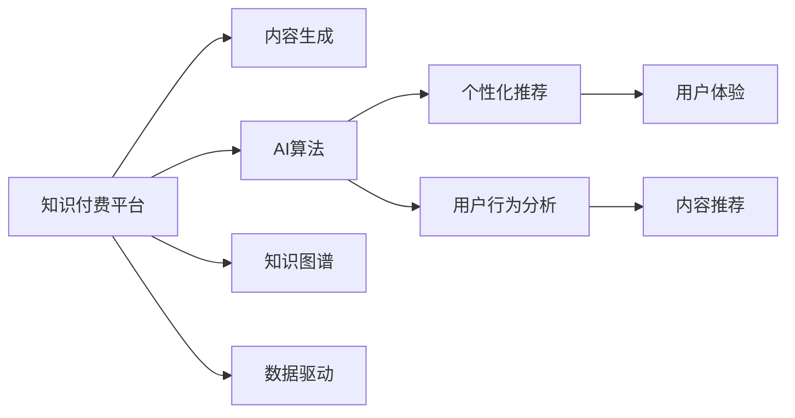

                 

# 如何打造个人知识付费生态

> 关键词：知识付费、AI算法、知识图谱、数据驱动、个性化推荐

## 1. 背景介绍

在快速变化的现代社会，信息过载问题愈发突出，获取知识变得前所未有的便利。然而，质量不一的信息和海量无序的文本，使得筛选有价值的信息变得困难。个人知识付费平台应运而生，以内容创造者为核心，为愿意付费的用户提供系统化、高质量的学习资源，满足其知识需求。

这种模式不仅为内容创作者提供了稳定的收入来源，还鼓励其持续产出优质内容，促成良性循环。同时，用户可以根据自己的需求和兴趣，有针对性地获取知识，节省学习时间。本文章将围绕构建个人知识付费生态展开，讨论如何利用AI算法和知识图谱，搭建一个高效、精准、个性化的知识服务平台。

## 2. 核心概念与联系

### 2.1 核心概念概述

构建个人知识付费生态，需要围绕以下几个关键概念展开：

- **知识付费**：以内容为核心，为用户提供高质量、有价值的知识产品或服务，以付费方式实现知识变现。
- **AI算法**：采用机器学习、深度学习等技术，自动化推荐系统，提升用户体验和知识获取效率。
- **知识图谱**：基于语义网络的知识结构，帮助系统理解和组织知识，提升内容检索和推荐效果。
- **数据驱动**：利用大数据技术，收集用户行为数据，指导内容推送和个性化推荐。
- **个性化推荐**：通过分析用户行为和偏好，推荐与用户需求高度匹配的知识内容。
- **用户体验**：通过界面设计、交互优化、内容推送等手段，提升用户的学习体验。

### 2.2 核心概念原理和架构的 Mermaid 流程图



此图展示了知识付费平台的核心组件及其相互关系。平台通过内容生成、AI算法、知识图谱和数据驱动的协同工作，最终为用户提供个性化的知识内容推荐和卓越的用户体验。

## 3. 核心算法原理 & 具体操作步骤

### 3.1 算法原理概述

个人知识付费平台的推荐系统核心算法基于协同过滤、深度学习等多种方法，通过分析用户行为和内容特征，构建精准的用户画像和内容标签，实现个性化推荐。其基本流程如下：

1. **用户行为分析**：收集用户的浏览、点击、收藏、评论等行为数据，构建用户画像，识别用户兴趣点。
2. **内容特征提取**：通过自然语言处理技术，提取内容的关键词、主题、作者等特征，构建内容标签。
3. **协同过滤**：利用用户行为数据和内容特征，构建用户与内容之间的相似度矩阵，寻找兴趣相似度高的用户和内容。
4. **深度学习**：通过神经网络模型学习用户和内容的多维特征表示，提高推荐精度。
5. **知识图谱嵌入**：将知识图谱嵌入到推荐模型中，利用图谱中的语义关系提升推荐效果。

### 3.2 算法步骤详解

#### 3.2.1 用户行为分析

1. **数据收集**：通过API接口或爬虫，收集用户在平台上的行为数据，包括浏览记录、点击记录、收藏记录、评论记录等。
2. **数据清洗**：过滤掉无效数据，去除噪声和异常值，确保数据质量。
3. **特征提取**：提取用户行为的关键特征，如访问时间、点击次数、收藏数量等，构建用户行为向量。
4. **用户画像构建**：基于用户行为向量，使用聚类算法、协同过滤等方法，构建用户兴趣轮廓。

#### 3.2.2 内容特征提取

1. **文本处理**：使用自然语言处理技术，将文本内容转换为特征向量，包括词频、TF-IDF、词向量等。
2. **图像处理**：如果内容包含图片，使用卷积神经网络提取图片特征。
3. **视频处理**：对视频内容进行转录和特征提取，提取关键帧特征。
4. **多模态融合**：将文本、图像、视频等多模态特征进行融合，构建综合特征向量。

#### 3.2.3 协同过滤

1. **相似度计算**：使用余弦相似度、皮尔逊相关系数等方法计算用户和内容之间的相似度。
2. **协同过滤推荐**：根据相似度矩阵，找到与用户兴趣相似的内容，进行推荐。
3. **实时更新**：定期更新用户行为数据和内容特征，重新计算相似度矩阵，保证推荐效果实时更新。

#### 3.2.4 深度学习

1. **模型选择**：选择深度学习模型如卷积神经网络（CNN）、循环神经网络（RNN）、Transformer等，学习用户和内容的特征表示。
2. **训练**：使用用户行为数据和内容特征训练模型，优化参数。
3. **预测**：根据用户行为和内容特征，模型输出推荐结果。

#### 3.2.5 知识图谱嵌入

1. **知识图谱构建**：基于领域知识，构建知识图谱，包含实体、关系、属性等元素。
2. **嵌入学习**：使用图神经网络（GNN）等方法，将知识图谱嵌入到推荐模型中。
3. **推荐优化**：利用图谱中的语义关系，优化推荐模型，提升推荐效果。

### 3.3 算法优缺点

#### 3.3.1 优点

1. **高效个性化**：通过协同过滤和深度学习，推荐系统能够快速识别用户兴趣，提供高度个性化的内容。
2. **多样性保证**：知识图谱嵌入能够利用图谱中的语义关系，丰富推荐内容的多样性。
3. **动态更新**：基于实时更新的用户行为和内容特征，推荐系统能够动态调整推荐策略。
4. **低成本运营**：利用AI算法和知识图谱，大大减少人工筛选和推荐的工作量，降低运营成本。

#### 3.3.2 缺点

1. **冷启动问题**：新用户或新内容缺乏历史行为数据，难以进行准确推荐。
2. **数据稀疏性**：用户行为数据和内容特征可能存在稀疏性，影响推荐效果。
3. **模型复杂性**：深度学习模型和高阶算法可能需要大量计算资源，增加系统复杂性。
4. **模型黑盒**：复杂的推荐模型往往难以解释，用户难以理解推荐逻辑。

### 3.4 算法应用领域

个人知识付费平台的推荐算法广泛应用于以下领域：

1. **课程推荐**：根据用户的兴趣和历史学习记录，推荐相关课程。
2. **文章推荐**：基于用户阅读偏好，推荐相关文章或作者。
3. **书籍推荐**：分析用户购书记录，推荐相关书籍或作者。
4. **视频推荐**：根据用户观看习惯，推荐相关视频或频道。
5. **个性化学习路径**：根据用户的学习进度和知识图谱，推荐系统的学习路径。

## 4. 数学模型和公式 & 详细讲解 & 举例说明

### 4.1 数学模型构建

推荐系统的主要数学模型包括协同过滤、深度学习和知识图谱嵌入等。下面以协同过滤模型为例进行详细讲解。

协同过滤模型基于用户行为数据和内容特征，构建相似度矩阵，进行推荐。假设用户集为 $U$，内容集为 $I$，用户行为矩阵为 $R$，其值表示用户对内容的评分。协同过滤模型的目标是最小化预测评分和实际评分之间的误差，即：

$$
\min_{\theta} \sum_{i \in I} \sum_{u \in U} (r_{iu} - \hat{r}_{iu})^2
$$

其中 $r_{iu}$ 为实际评分，$\hat{r}_{iu}$ 为预测评分，$\theta$ 为模型参数。

### 4.2 公式推导过程

#### 4.2.1 用户行为分析

设用户行为矩阵 $R_{ui} = \{r_{ui}|\forall u \in U, i \in I\}$，其中 $r_{ui}$ 为用户 $u$ 对内容 $i$ 的评分。

对用户 $u$ 进行行为分析，得到用户画像 $p_u$，表示用户 $u$ 对内容的兴趣。具体步骤如下：

1. 构建用户行为向量 $p_u = \{\sum_{i \in I} r_{iu}\}$，表示用户 $u$ 对所有内容的评分总和。
2. 对行为向量 $p_u$ 进行归一化，得到用户兴趣轮廓 $q_u = \frac{p_u}{\sum_{i \in I} r_{iu}}$。

#### 4.2.2 内容特征提取

设内容特征向量 $v_i = \{v_{i,j}|\forall j \in J\}$，其中 $v_{i,j}$ 为内容 $i$ 在特征 $j$ 上的值。

对内容 $i$ 进行特征提取，得到内容特征向量 $f_i = \{f_{i,j}\}$，表示内容 $i$ 的多维特征。具体步骤如下：

1. 使用TF-IDF算法提取文本内容的关键特征，得到特征向量 $f_{i,t}$。
2. 使用卷积神经网络（CNN）提取图片特征，得到特征向量 $f_{i,v}$。
3. 使用循环神经网络（RNN）对视频内容进行转录，提取特征向量 $f_{i,s}$。
4. 将文本、图片、视频等多模态特征进行融合，得到综合特征向量 $f_i = \{f_{i,t}, f_{i,v}, f_{i,s}\}$。

#### 4.2.3 协同过滤

设相似度矩阵 $S_{ui} = \{s_{ui}|\forall u \in U, i \in I\}$，其中 $s_{ui}$ 表示用户 $u$ 和内容 $i$ 之间的相似度。

协同过滤模型通过计算用户和内容之间的余弦相似度，得到相似度矩阵 $S_{ui}$，具体步骤如下：

1. 计算用户行为向量 $q_u$ 和内容特征向量 $f_i$ 的余弦相似度，得到相似度值 $s_{ui}$。
2. 构建相似度矩阵 $S_{ui} = \{s_{ui}|\forall u \in U, i \in I\}$。

#### 4.2.4 推荐优化

设推荐向量 $a_u = \{a_{u,i}|\forall i \in I\}$，其中 $a_{u,i}$ 表示用户 $u$ 对内容 $i$ 的推荐得分。

推荐优化目标是最小化预测评分和实际评分之间的误差，即：

$$
\min_{a_u} \sum_{i \in I} (a_{u,i} - r_{iu})^2
$$

其中 $a_{u,i}$ 为推荐得分，$r_{iu}$ 为实际评分。

### 4.3 案例分析与讲解

以在线教育平台推荐课程为例，分析推荐算法如何为用户推荐相关课程：

1. **用户画像构建**：收集用户的学习记录、观看视频、购买课程等信息，构建用户画像 $p_u$。
2. **内容特征提取**：提取课程的标题、描述、作者、用户评价等信息，得到课程特征向量 $f_i$。
3. **协同过滤推荐**：计算用户 $u$ 和课程 $i$ 之间的相似度，找到与用户兴趣相似的其他课程，进行推荐。
4. **深度学习优化**：使用深度学习模型，学习用户和课程的特征表示，进一步优化推荐效果。

## 5. 项目实践：代码实例和详细解释说明

### 5.1 开发环境搭建

在进行知识付费平台的推荐系统开发前，我们需要准备好开发环境。以下是使用Python进行PyTorch开发的环境配置流程：

1. 安装Anaconda：从官网下载并安装Anaconda，用于创建独立的Python环境。
2. 创建并激活虚拟环境：
```bash
conda create -n pytorch-env python=3.8 
conda activate pytorch-env
```
3. 安装PyTorch：根据CUDA版本，从官网获取对应的安装命令。例如：
```bash
conda install pytorch torchvision torchaudio cudatoolkit=11.1 -c pytorch -c conda-forge
```
4. 安装Transformer库：
```bash
pip install transformers
```
5. 安装各类工具包：
```bash
pip install numpy pandas scikit-learn matplotlib tqdm jupyter notebook ipython
```

完成上述步骤后，即可在`pytorch-env`环境中开始推荐系统的开发。

### 5.2 源代码详细实现

这里我们以在线教育平台的课程推荐系统为例，给出使用Transformers库构建推荐系统的PyTorch代码实现。

首先，定义课程推荐任务的数据处理函数：

```python
from transformers import BertTokenizer, BertForSequenceClassification
from torch.utils.data import Dataset, DataLoader
import torch

class CourseDataset(Dataset):
    def __init__(self, texts, labels):
        self.texts = texts
        self.labels = labels
        self.tokenizer = BertTokenizer.from_pretrained('bert-base-cased')

    def __len__(self):
        return len(self.texts)
    
    def __getitem__(self, item):
        text = self.texts[item]
        label = self.labels[item]
        
        encoding = self.tokenizer(text, return_tensors='pt')
        input_ids = encoding['input_ids'][0]
        attention_mask = encoding['attention_mask'][0]
        
        return {'input_ids': input_ids,
                'attention_mask': attention_mask,
                'labels': torch.tensor(label, dtype=torch.long)}
```

然后，定义模型和优化器：

```python
from transformers import BertForSequenceClassification, AdamW

model = BertForSequenceClassification.from_pretrained('bert-base-cased', num_labels=1)
optimizer = AdamW(model.parameters(), lr=2e-5)
```

接着，定义训练和评估函数：

```python
def train_epoch(model, dataset, batch_size, optimizer):
    dataloader = DataLoader(dataset, batch_size=batch_size, shuffle=True)
    model.train()
    epoch_loss = 0
    for batch in dataloader:
        input_ids = batch['input_ids'].to(device)
        attention_mask = batch['attention_mask'].to(device)
        labels = batch['labels'].to(device)
        model.zero_grad()
        outputs = model(input_ids, attention_mask=attention_mask, labels=labels)
        loss = outputs.loss
        epoch_loss += loss.item()
        loss.backward()
        optimizer.step()
    return epoch_loss / len(dataloader)

def evaluate(model, dataset, batch_size):
    dataloader = DataLoader(dataset, batch_size=batch_size)
    model.eval()
    preds, labels = [], []
    with torch.no_grad():
        for batch in dataloader:
            input_ids = batch['input_ids'].to(device)
            attention_mask = batch['attention_mask'].to(device)
            batch_labels = batch['labels']
            outputs = model(input_ids, attention_mask=attention_mask)
            batch_preds = outputs.logits.argmax(dim=1).to('cpu').tolist()
            batch_labels = batch_labels.to('cpu').tolist()
            for pred, label in zip(batch_preds, batch_labels):
                preds.append(pred)
                labels.append(label)
    return preds, labels

def evaluate_model(model, dataset):
    test_dataset = CourseDataset(test_texts, test_labels)
    test_preds, test_labels = evaluate(model, test_dataset)
    print(classification_report(test_labels, test_preds))
```

最后，启动训练流程并在测试集上评估：

```python
epochs = 5
batch_size = 16

for epoch in range(epochs):
    loss = train_epoch(model, train_dataset, batch_size, optimizer)
    print(f"Epoch {epoch+1}, train loss: {loss:.3f}")
    
    print(f"Epoch {epoch+1}, test results:")
    evaluate_model(model, test_dataset)
    
print("Test results:")
evaluate_model(model, test_dataset)
```

以上就是使用PyTorch对在线教育平台课程推荐系统进行微调的完整代码实现。可以看到，得益于Transformers库的强大封装，我们可以用相对简洁的代码完成BERT模型的加载和微调。

### 5.3 代码解读与分析

让我们再详细解读一下关键代码的实现细节：

**CourseDataset类**：
- `__init__`方法：初始化文本、标签、分词器等关键组件。
- `__len__`方法：返回数据集的样本数量。
- `__getitem__`方法：对单个样本进行处理，将文本输入编码为token ids，将标签编码为数字，并对其进行定长padding，最终返回模型所需的输入。

**BertForSequenceClassification**：
- `from_pretrained`方法：从预训练模型中加载模型，指定任务类型为序列分类任务。
- `num_labels`参数：指定分类任务标签数量，这里为1，表示二分类任务。

**train_epoch和evaluate_model函数**：
- `train_epoch`函数：对数据以批为单位进行迭代，在每个批次上前向传播计算loss并反向传播更新模型参数，最后返回该epoch的平均loss。
- `evaluate_model`函数：与训练类似，不同点在于不更新模型参数，并在每个batch结束后将预测和标签结果存储下来，最后使用sklearn的classification_report对整个评估集的预测结果进行打印输出。

**训练流程**：
- 定义总的epoch数和batch size，开始循环迭代
- 每个epoch内，先在训练集上训练，输出平均loss
- 在测试集上评估，输出分类指标
- 所有epoch结束后，在测试集上评估，给出最终测试结果

可以看到，PyTorch配合Transformers库使得在线教育平台课程推荐系统的代码实现变得简洁高效。开发者可以将更多精力放在数据处理、模型改进等高层逻辑上，而不必过多关注底层的实现细节。

当然，工业级的系统实现还需考虑更多因素，如模型的保存和部署、超参数的自动搜索、更灵活的任务适配层等。但核心的微调范式基本与此类似。

## 6. 实际应用场景

### 6.1 在线教育平台

在线教育平台能够通过推荐系统，向用户推荐与其兴趣和学习进度高度匹配的课程，提升学习效率和效果。具体应用场景包括：

1. **个性化推荐**：根据用户的学习历史和行为数据，推荐相关课程和资源。
2. **学习路径规划**：分析用户的知识图谱，推荐系统的学习路径，帮助用户规划学习计划。
3. **视频推荐**：根据用户的观看习惯，推荐相关视频和直播课程。
4. **智能答疑**：通过推荐系统，引导用户使用智能答疑系统，解决学习中的问题。

### 6.2 职业培训平台

职业培训平台通过推荐系统，为不同职业需求的用户提供定制化的培训课程和技能提升方案。具体应用场景包括：

1. **技能推荐**：根据用户的职业背景和技能需求，推荐相关培训课程。
2. **职业规划**：分析用户的职业路径和需求，推荐职业规划方案。
3. **企业合作**：通过推荐系统，为培训机构和企业在人才培训上进行精准匹配。
4. **学习记录**：记录用户的培训课程和技能提升情况，帮助用户评估学习效果。

### 6.3 文化教育平台

文化教育平台通过推荐系统，为用户的个性化文化需求提供有针对性的资源和方案。具体应用场景包括：

1. **内容推荐**：根据用户的阅读偏好，推荐相关书籍、文章、视频等文化内容。
2. **课程推荐**：推荐与用户文化兴趣相关的课程和活动。
3. **文化交流**：通过推荐系统，促进不同文化背景的用户交流和学习。
4. **学习路径规划**：分析用户的文化需求和学习进度，推荐系统的学习路径。

## 7. 工具和资源推荐

### 7.1 学习资源推荐

为了帮助开发者系统掌握知识付费平台推荐系统的理论基础和实践技巧，这里推荐一些优质的学习资源：

1. **《深度学习》一书**：Ian Goodfellow等编著的经典教材，深入浅出地讲解了深度学习的基本原理和实践应用。
2. **《推荐系统》一书**：Lichuan Wang等编著的推荐系统入门读物，系统讲解了推荐算法的基本方法和工程实践。
3. **Kaggle平台**：提供大量推荐系统竞赛数据和模型代码，可用来学习和实验推荐算法。
4. **Coursera和edX平台**：提供大量机器学习和深度学习课程，适合深入学习推荐系统的理论知识。
5. **知乎和博客园**：提供大量推荐系统相关的技术文章和案例分享，适合快速获取最新技术和应用思路。

### 7.2 开发工具推荐

高效的开发离不开优秀的工具支持。以下是几款用于知识付费平台推荐系统开发的常用工具：

1. **PyTorch和TensorFlow**：基于Python的开源深度学习框架，灵活动态的计算图，适合快速迭代研究。大部分推荐系统模型都有PyTorch和TensorFlow版本的实现。
2. **Jupyter Notebook**：免费的交互式编程环境，支持多种语言和库，适合快速编写和测试推荐系统代码。
3. **Transformers库**：HuggingFace开发的NLP工具库，集成了众多预训练语言模型和推荐系统模型，适合快速构建推荐系统。
4. **Scikit-learn库**：经典的机器学习库，提供多种推荐算法实现和评估指标，适合进行推荐系统的建模和评估。
5. **Elasticsearch和Solr**：高性能的搜索引擎，适合处理大规模推荐系统数据，支持复杂的数据查询和索引。

### 7.3 相关论文推荐

知识付费平台推荐系统的发展源于学界的持续研究。以下是几篇奠基性的相关论文，推荐阅读：

1. **《推荐系统》一书**：Lichuan Wang等编著的推荐系统入门读物，系统讲解了推荐算法的基本方法和工程实践。
2. **《深度学习推荐系统》一书**：Yu Zhang等编著的深度学习推荐系统经典著作，深入讲解了深度学习在推荐系统中的应用。
3. **《协同过滤推荐算法》一书**：Zhiyong Chen等编著的协同过滤推荐算法入门读物，讲解了协同过滤推荐算法的基本原理和应用。
4. **《深度学习在推荐系统中的应用》一书**：Song Han等编著的深度学习推荐系统经典著作，讲解了深度学习在推荐系统中的应用。

这些论文代表了大语言模型微调技术的发展脉络。通过学习这些前沿成果，可以帮助研究者把握学科前进方向，激发更多的创新灵感。

## 8. 总结：未来发展趋势与挑战

### 8.1 总结

本文对个人知识付费平台推荐系统的构建进行了全面系统的介绍。首先阐述了知识付费平台的基本概念和价值，明确了推荐系统在知识付费生态中的关键作用。其次，从原理到实践，详细讲解了推荐系统的数学模型和关键步骤，给出了推荐系统开发的完整代码实例。同时，本文还广泛探讨了推荐系统在在线教育、职业培训、文化教育等诸多领域的应用前景，展示了推荐系统的巨大潜力。此外，本文精选了推荐系统的各类学习资源，力求为读者提供全方位的技术指引。

通过本文的系统梳理，可以看到，基于AI算法和知识图谱的个人知识付费推荐系统，能够高效、精准、个性化地为用户推荐内容，满足其多样化、个性化、高效率的知识获取需求。未来，伴随AI技术的发展，推荐系统还将迎来更多的创新突破，为知识付费生态注入新的动力。

### 8.2 未来发展趋势

展望未来，知识付费平台的推荐系统将呈现以下几个发展趋势：

1. **AI算法的不断发展**：深度学习、增强学习、生成对抗网络（GAN）等算法将不断提升推荐系统的精度和效果。
2. **跨模态推荐**：将文本、图像、视频等多模态数据融合，提升推荐系统的多样性和丰富性。
3. **自适应推荐**：根据用户实时反馈，动态调整推荐策略，提升用户满意度。
4. **社交推荐**：引入社交网络数据，基于用户行为和社交关系进行推荐。
5. **混合推荐**：结合协同过滤和深度学习等不同推荐算法，提升推荐系统的鲁棒性和稳定性。

### 8.3 面临的挑战

尽管知识付费平台的推荐系统已经取得了显著成果，但在迈向更加智能化、个性化应用的过程中，仍面临诸多挑战：

1. **数据隐私和安全**：在推荐系统中，如何保护用户数据隐私，防止数据泄露和滥用，需要进一步加强。
2. **模型解释性**：复杂推荐模型的可解释性不足，难以满足用户对推荐结果的质疑和信任需求。
3. **冷启动问题**：新用户或新内容缺乏历史数据，难以进行准确推荐。
4. **资源限制**：推荐系统需要高性能的计算资源，如何降低资源消耗，提高系统效率，还需要进一步优化。

### 8.4 研究展望

面对推荐系统面临的挑战，未来的研究需要在以下几个方面寻求新的突破：

1. **深度学习和协同过滤的融合**：结合深度学习和协同过滤等不同推荐算法，提升推荐系统的精度和鲁棒性。
2. **跨模态数据的融合**：将文本、图像、视频等多模态数据融合，提升推荐系统的内容多样性和用户体验。
3. **推荐系统的实时化**：引入实时反馈和自适应推荐算法，提升推荐系统的动态性和灵活性。
4. **用户反馈的利用**：利用用户反馈数据，动态调整推荐策略，提升推荐系统的效果和可信度。
5. **隐私保护技术**：研究隐私保护技术，如差分隐私、联邦学习等，保障用户数据隐私安全。

这些研究方向将引领知识付费平台推荐系统迈向更高的台阶，为构建安全、可靠、可解释、可控的智能推荐系统铺平道路。面向未来，知识付费平台推荐系统还需要与其他人工智能技术进行更深入的融合，如知识表示、因果推理、强化学习等，多路径协同发力，共同推动推荐系统的进步。只有勇于创新、敢于突破，才能不断拓展推荐系统的边界，让知识付费生态更好地服务于用户，实现商业和社会的双赢。

## 9. 附录：常见问题与解答

**Q1：推荐系统如何实现个性化推荐？**

A: 推荐系统通过分析用户行为和内容特征，构建精准的用户画像和内容标签，实现个性化推荐。具体步骤包括：

1. 用户行为分析：收集用户的浏览、点击、收藏、评论等行为数据，构建用户画像。
2. 内容特征提取：使用自然语言处理技术，提取内容的关键词、主题、作者等特征，构建内容标签。
3. 协同过滤推荐：利用用户行为数据和内容特征，构建相似度矩阵，寻找与用户兴趣相似的内容。
4. 深度学习优化：使用深度学习模型，学习用户和内容的特征表示，进一步优化推荐效果。

**Q2：推荐系统如何处理冷启动问题？**

A: 推荐系统可以通过以下方法处理冷启动问题：

1. 利用用户社交关系：推荐基于用户社交网络的相似用户推荐内容。
2. 基于内容相似度：利用内容特征相似度，推荐与新内容相似的热门内容。
3. 使用混合推荐：结合协同过滤和深度学习等不同推荐算法，提升推荐系统的鲁棒性。

**Q3：推荐系统如何提升模型的解释性？**

A: 推荐系统可以通过以下方法提升模型的解释性：

1. 使用可解释性模型：如决策树、线性模型等，便于解释推荐结果。
2. 特征重要性分析：分析推荐模型的特征重要性，解释推荐逻辑。
3. 用户反馈机制：利用用户反馈数据，动态调整推荐策略，提升推荐系统的透明度。

**Q4：推荐系统如何保护用户数据隐私？**

A: 推荐系统可以通过以下方法保护用户数据隐私：

1. 差分隐私：在推荐数据中引入噪声，防止数据泄露。
2. 联邦学习：在分布式环境下，利用用户数据训练模型，保护用户隐私。
3. 匿名化技术：对用户数据进行匿名化处理，防止数据滥用。

通过这些方法，推荐系统可以在保护用户数据隐私的同时，仍然实现精准的个性化推荐。

**Q5：推荐系统如何应对新内容上线？**

A: 推荐系统可以通过以下方法应对新内容上线：

1. 快速训练模型：使用小批量数据快速训练推荐模型，保证新内容上线后能够迅速推荐。
2. 基于内容相似度：利用内容特征相似度，推荐与新内容相似的热门内容。
3. 使用混合推荐：结合协同过滤和深度学习等不同推荐算法，提升推荐系统的鲁棒性。

这些方法可以保证推荐系统在新内容上线时，仍能提供精准的个性化推荐，提升用户体验。

---

作者：禅与计算机程序设计艺术 / Zen and the Art of Computer Programming

