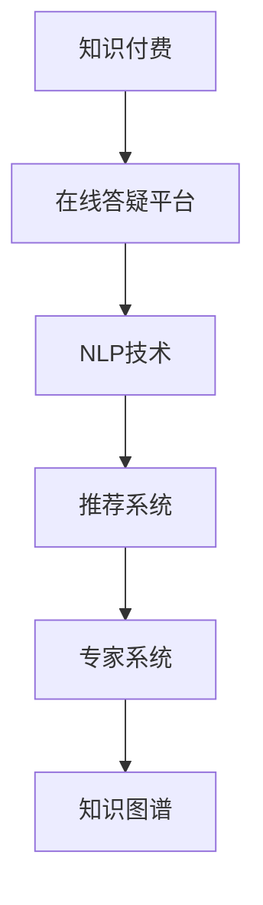

                 

## 1. 背景介绍

### 1.1 问题由来

随着知识付费市场的不断扩大，在线答疑平台成为了连接知识创作者和需求者的重要桥梁。用户通过支付一定费用，可以获得专家在特定领域的专业解答，既满足了自身学习提升的需求，又为创作者提供了经济回报。然而，如何高效构建这样一个平台，既满足用户需求，又保障服务质量，同时控制成本，是平台运营者需要重点关注的问题。

### 1.2 问题核心关键点

在线答疑平台的核心在于如何构建高效的问题匹配和答疑服务体系。这包括：

- 用户提问的准确性和多样化。
- 专家资源的合理配置和高效利用。
- 问答的匹配算法和快速响应机制。
- 平台的用户体验和运营策略。

### 1.3 问题研究意义

构建一个高效的在线答疑平台，能够有效连接知识创作者和需求者，促进知识传播和应用。具有以下几个方面的意义：

1. **提升学习效率**：在线答疑平台可以提供即时、个性化的知识服务，显著提升学习效率。
2. **激发创作者热情**：通过平台化运营，创作者能够获得稳定的经济回报，激发创作热情。
3. **降低学习门槛**：平台能够提供高质量的答疑服务，降低用户获取知识的门槛。
4. **推动行业发展**：平台化运营能够系统化组织专家资源，推动整个知识付费行业的发展。

## 2. 核心概念与联系

### 2.1 核心概念概述

- **知识付费**：指用户为获取特定的知识服务或产品而进行付费的行为。知识付费平台通过聚集高质量的创作者资源，为用户提供专业化的咨询服务。

- **在线答疑平台**：利用互联网技术构建的知识问答平台，用户可以在线提交问题，获得专家的即时回答。

- **自然语言处理(NLP)**：指计算机对人类语言进行理解、处理和生成的一系列技术。在线答疑平台中，NLP技术用于处理用户提问和专家回答，提升问答质量。

- **推荐系统**：通过用户行为数据和模型计算，推荐相关问题或专家，提升用户体验和平台匹配效果。

- **专家系统**：构建专家知识库和答疑模板，提高专家解答的效率和质量。

- **知识图谱**：将各类知识点以图形化的方式进行组织，便于用户和专家快速查找和应用。

这些核心概念之间的逻辑关系可以通过以下Mermaid流程图来展示：



这个流程图展示了一个在线答疑平台的基本架构，各模块之间的协同工作确保了平台的稳定运行。

## 3. 核心算法原理 & 具体操作步骤

### 3.1 算法原理概述

在线答疑平台的核心算法主要围绕用户问题与专家资源的匹配展开。以下是主要算法原理的概述：

1. **用户意图识别**：通过NLP技术对用户问题进行意图识别，提取关键信息，如问题主题、类型等。
2. **专家匹配**：根据用户问题和专家知识库，通过推荐算法匹配合适的专家。
3. **问答匹配**：将用户问题和专家回答进行相似度计算，选择最佳匹配结果。
4. **质量控制**：通过用户反馈和评价机制，对问答结果进行质量控制，不断优化模型。

### 3.2 算法步骤详解

#### 3.2.1 用户意图识别

用户意图识别是平台匹配算法的基础，通常使用以下步骤：

1. **文本预处理**：对用户问题进行分词、去除停用词、词性标注等处理。
2. **特征提取**：提取文本的特征向量，如TF-IDF、词嵌入等。
3. **意图分类**：使用分类模型（如SVM、LSTM、BERT等）对问题进行意图分类，如技术问题、学习问题、生活问题等。

#### 3.2.2 专家匹配

专家匹配的目的是找到最适合解决用户问题的专家。具体步骤如下：

1. **专家信息收集**：收集专家信息，如专业领域、擅长领域、评价等。
2. **专家匹配算法**：使用推荐算法（如基于内容的推荐、协同过滤等）匹配专家，选择与用户问题相关的专家。
3. **匹配度计算**：根据专家信息和使用数据，计算专家与用户问题的匹配度。

#### 3.2.3 问答匹配

问答匹配的核心在于通过计算相似度，找到最佳匹配的专家回答。步骤如下：

1. **问题表示**：将用户问题转换为向量表示，如使用词嵌入技术。
2. **回答表示**：将专家回答转换为向量表示，与用户问题进行相似度计算。
3. **匹配选择**：根据相似度计算结果，选择最佳匹配的回答。

#### 3.2.4 质量控制

质量控制是保障问答平台服务质量的重要环节，具体步骤如下：

1. **用户评价**：用户对问答结果进行评分和评价，提供反馈。
2. **评价处理**：对用户评价进行处理，去除恶意评价，提升可信度。
3. **模型优化**：根据用户反馈和评价，不断优化意图识别、匹配算法等模型。

### 3.3 算法优缺点

#### 3.3.1 优点

1. **高效匹配**：通过NLP和推荐算法，平台能够高效匹配用户问题和专家回答，提升答疑效率。
2. **个性化服务**：能够根据用户需求提供个性化推荐，提升用户满意度。
3. **质量保障**：通过用户评价和质量控制，平台能够保证问答质量，提升用户信任度。

#### 3.3.2 缺点

1. **技术门槛高**：NLP和推荐算法等核心技术要求较高，平台需要投入大量研发资源。
2. **用户评价噪声**：用户评价存在噪声，影响模型的优化效果。
3. **专家资源有限**：专家资源需要长期积累，初期难以快速覆盖所有领域。

### 3.4 算法应用领域

在线答疑平台的应用领域非常广泛，以下是几个主要的应用场景：

1. **教育培训**：提供个性化学习答疑，帮助学生解决学习中的问题。
2. **技术支持**：提供技术支持和解决方案，帮助企业解决技术难题。
3. **医疗咨询**：提供医疗咨询服务，帮助患者解决健康问题。
4. **生活咨询**：提供生活咨询和建议，帮助用户解决生活中的各种问题。

## 4. 数学模型和公式 & 详细讲解 & 举例说明

### 4.1 数学模型构建

在线答疑平台的数学模型主要包括以下几个部分：

1. **用户意图模型**：使用意图分类模型对用户问题进行分类，如分类器 $M(y|x)$。
2. **专家匹配模型**：使用推荐模型对专家进行匹配，如协同过滤模型 $M_u(u|i)$。
3. **问答匹配模型**：使用相似度计算模型对问答进行匹配，如余弦相似度模型 $M_s(s|x,y)$。
4. **质量控制模型**：使用评价模型对问答结果进行评分，如回归模型 $M_r(r|e)$。

### 4.2 公式推导过程

#### 4.2.1 用户意图模型

用户意图模型 $M(y|x)$ 的推导过程如下：

$$
P(y|x) = \frac{P(x|y)P(y)}{P(x)}
$$

其中 $P(y|x)$ 为条件概率，$P(x|y)$ 为在已知问题 $x$ 下，问题 $y$ 的概率，$P(y)$ 为先验概率，$P(x)$ 为概率正常化项。

#### 4.2.2 专家匹配模型

协同过滤模型 $M_u(u|i)$ 的推导过程如下：

$$
M_u(u|i) = \frac{P(u|i)}{\sum_{u'} P(u'|i)}
$$

其中 $P(u|i)$ 为专家 $u$ 在领域 $i$ 的评分，$\sum_{u'} P(u'|i)$ 为领域 $i$ 所有专家的评分之和。

#### 4.2.3 问答匹配模型

余弦相似度模型 $M_s(s|x,y)$ 的推导过程如下：

$$
s(x,y) = \frac{\mathbf{x} \cdot \mathbf{y}}{\|\mathbf{x}\| \|\mathbf{y}\|}
$$

其中 $\mathbf{x}$ 和 $\mathbf{y}$ 分别为用户问题和专家回答的向量表示，$\cdot$ 为向量点积，$\|\cdot\|$ 为向量范数。

#### 4.2.4 质量控制模型

评价模型 $M_r(r|e)$ 的推导过程如下：

$$
M_r(r|e) = \frac{P(r|e)P(e)}{P(r)}
$$

其中 $P(r|e)$ 为在专家回答 $e$ 下，用户评分 $r$ 的概率，$P(e)$ 为专家回答 $e$ 的概率，$P(r)$ 为评分 $r$ 的概率正常化项。

### 4.3 案例分析与讲解

#### 4.3.1 意图分类案例

假设用户提交了如下问题：“如何提升编程技能？”

1. **文本预处理**：分词、去除停用词、词性标注等。
2. **特征提取**：使用词嵌入技术，将问题转换为向量表示。
3. **意图分类**：使用SVM或LSTM模型对问题进行意图分类，得到分类结果为“学习技能”。

#### 4.3.2 专家匹配案例

假设系统中有两位专家，一位擅长编程，一位擅长数学。用户问题为“如何提升编程技能？”

1. **专家信息收集**：收集两位专家的信息，包括专业领域、评价等。
2. **专家匹配算法**：使用协同过滤算法，匹配出编程领域的专家。
3. **匹配度计算**：计算匹配度，选择编程领域的专家。

#### 4.3.3 问答匹配案例

假设用户问题为“如何提升编程技能？”，专家回答为“通过编码练习和阅读相关书籍。”

1. **问题表示**：将问题转换为向量表示。
2. **回答表示**：将专家回答转换为向量表示。
3. **相似度计算**：计算向量相似度，选择最佳匹配的答案。

#### 4.3.4 质量控制案例

假设用户对某个问答结果评分3星。

1. **用户评价**：用户对问答结果进行评分和评价，提交反馈。
2. **评价处理**：对用户评价进行处理，去除恶意评价。
3. **模型优化**：根据用户反馈和评价，优化问答匹配模型。

## 5. 项目实践：代码实例和详细解释说明

### 5.1 开发环境搭建

在进行项目实践前，我们需要准备好开发环境。以下是使用Python进行PyTorch开发的环境配置流程：

1. 安装Anaconda：从官网下载并安装Anaconda，用于创建独立的Python环境。

2. 创建并激活虚拟环境：
```bash
conda create -n pytorch-env python=3.8 
conda activate pytorch-env
```

3. 安装PyTorch：根据CUDA版本，从官网获取对应的安装命令。例如：
```bash
conda install pytorch torchvision torchaudio cudatoolkit=11.1 -c pytorch -c conda-forge
```

4. 安装Transformers库：
```bash
pip install transformers
```

5. 安装各类工具包：
```bash
pip install numpy pandas scikit-learn matplotlib tqdm jupyter notebook ipython
```

完成上述步骤后，即可在`pytorch-env`环境中开始项目实践。

### 5.2 源代码详细实现

下面我们以自然语言处理(NLP)任务为例，给出使用Transformers库对BERT模型进行意图分类的PyTorch代码实现。

首先，定义意图分类模型：

```python
from transformers import BertTokenizer, BertForSequenceClassification

class IntentClassifier:
    def __init__(self, model_name='bert-base-uncased'):
        self.tokenizer = BertTokenizer.from_pretrained(model_name)
        self.model = BertForSequenceClassification.from_pretrained(model_name, num_labels=5)
        
    def preprocess_text(self, text):
        return self.tokenizer.encode(text, add_special_tokens=True)
    
    def predict_intent(self, text):
        input_ids = self.preprocess_text(text)
        output = self.model(input_ids)[0]
        intent_index = torch.argmax(output).item()
        return intent_index
```

然后，定义数据处理函数：

```python
import pandas as pd
from sklearn.model_selection import train_test_split

def load_dataset(file_path):
    data = pd.read_csv(file_path)
    X_train, X_test, y_train, y_test = train_test_split(data['text'], data['intent'], test_size=0.2, random_state=42)
    return X_train, X_test, y_train, y_test
```

接着，定义模型训练函数：

```python
from torch.utils.data import DataLoader

def train_model(model, train_dataset, valid_dataset, batch_size=32, epochs=5):
    train_loader = DataLoader(train_dataset, batch_size=batch_size, shuffle=True)
    valid_loader = DataLoader(valid_dataset, batch_size=batch_size, shuffle=False)
    
    optimizer = torch.optim.Adam(model.parameters(), lr=2e-5)
    scheduler = torch.optim.lr_scheduler.StepLR(optimizer, step_size=1, gamma=0.1)
    
    for epoch in range(epochs):
        model.train()
        for batch in train_loader:
            optimizer.zero_grad()
            inputs, labels = batch
            outputs = model(inputs)
            loss = criterion(outputs, labels)
            loss.backward()
            optimizer.step()
        
        model.eval()
        with torch.no_grad():
            eval_loss = 0
            for batch in valid_loader:
                inputs, labels = batch
                outputs = model(inputs)
                loss = criterion(outputs, labels)
                eval_loss += loss.item()
        
        print(f"Epoch {epoch+1}, train loss: {loss:.3f}, valid loss: {eval_loss/len(valid_loader):.3f}")
```

最后，启动训练流程并在测试集上评估：

```python
from transformers import AdamW

tokenizer = BertTokenizer.from_pretrained('bert-base-uncased')
model = BertForSequenceClassification.from_pretrained('bert-base-uncased', num_labels=5)

X_train, X_test, y_train, y_test = load_dataset('data.csv')
train_dataset = Dataset(X_train, y_train, tokenizer)
valid_dataset = Dataset(X_test, y_test, tokenizer)

train_model(model, train_dataset, valid_dataset)
```

以上就是使用PyTorch对BERT模型进行意图分类的完整代码实现。可以看到，得益于Transformers库的强大封装，我们可以用相对简洁的代码完成BERT模型的加载和微调。

### 5.3 代码解读与分析

让我们再详细解读一下关键代码的实现细节：

**IntentClassifier类**：
- `__init__`方法：初始化BERT模型和分词器，并设定意图分类标签。
- `preprocess_text`方法：对输入文本进行分词和编码，添加特殊标记。
- `predict_intent`方法：将输入文本进行编码，通过BERT模型预测意图，返回意图标签。

**load_dataset函数**：
- 加载数据集，并划分为训练集和测试集，返回数据集和标签。

**train_model函数**：
- 定义训练数据加载器，并设置优化器和学习率调度器。
- 在每个epoch内，分别进行训练和验证，输出损失函数值。
- 使用Adam优化器进行模型参数更新。

**训练流程**：
- 定义总的epoch数和batch size，开始循环迭代
- 每个epoch内，先在训练集上训练，输出平均loss
- 在验证集上评估，输出平均loss
- 所有epoch结束后，模型即可投入使用

可以看到，PyTorch配合Transformers库使得BERT意图分类的代码实现变得简洁高效。开发者可以将更多精力放在数据处理、模型改进等高层逻辑上，而不必过多关注底层的实现细节。

当然，工业级的系统实现还需考虑更多因素，如模型的保存和部署、超参数的自动搜索、更灵活的任务适配层等。但核心的微调范式基本与此类似。

## 6. 实际应用场景

### 6.1 智能客服系统

基于在线答疑平台的智能客服系统，可以为用户提供7x24小时不间断服务，快速响应客户咨询，用自然流畅的语言解答各类常见问题。

在技术实现上，可以收集企业内部的历史客服对话记录，将问题和最佳答复构建成监督数据，在此基础上对预训练模型进行微调。微调后的对话模型能够自动理解用户意图，匹配最合适的答案模板进行回复。对于客户提出的新问题，还可以接入检索系统实时搜索相关内容，动态组织生成回答。如此构建的智能客服系统，能大幅提升客户咨询体验和问题解决效率。

### 6.2 金融舆情监测

金融机构需要实时监测市场舆论动向，以便及时应对负面信息传播，规避金融风险。传统的人工监测方式成本高、效率低，难以应对网络时代海量信息爆发的挑战。基于在线答疑平台的文本分类和情感分析技术，为金融舆情监测提供了新的解决方案。

具体而言，可以收集金融领域相关的新闻、报道、评论等文本数据，并对其进行主题标注和情感标注。在此基础上对预训练语言模型进行微调，使其能够自动判断文本属于何种主题，情感倾向是正面、中性还是负面。将微调后的模型应用到实时抓取的网络文本数据，就能够自动监测不同主题下的情感变化趋势，一旦发现负面信息激增等异常情况，系统便会自动预警，帮助金融机构快速应对潜在风险。

### 6.3 个性化推荐系统

当前的推荐系统往往只依赖用户的历史行为数据进行物品推荐，无法深入理解用户的真实兴趣偏好。基于在线答疑平台的推荐系统，可以更好地挖掘用户行为背后的语义信息，从而提供更精准、多样的推荐内容。

在实践中，可以收集用户浏览、点击、评论、分享等行为数据，提取和用户交互的物品标题、描述、标签等文本内容。将文本内容作为模型输入，用户的后续行为（如是否点击、购买等）作为监督信号，在此基础上微调预训练语言模型。微调后的模型能够从文本内容中准确把握用户的兴趣点。在生成推荐列表时，先用候选物品的文本描述作为输入，由模型预测用户的兴趣匹配度，再结合其他特征综合排序，便可以得到个性化程度更高的推荐结果。

### 6.4 未来应用展望

随着在线答疑平台的发展，未来其在更多领域的应用前景将更加广阔。

在智慧医疗领域，基于问答平台的医疗问答、病历分析、药物研发等应用将提升医疗服务的智能化水平，辅助医生诊疗，加速新药开发进程。

在智能教育领域，问答平台可应用于作业批改、学情分析、知识推荐等方面，因材施教，促进教育公平，提高教学质量。

在智慧城市治理中，问答平台可应用于城市事件监测、舆情分析、应急指挥等环节，提高城市管理的自动化和智能化水平，构建更安全、高效的未来城市。

此外，在企业生产、社会治理、文娱传媒等众多领域，问答平台的应用也将不断涌现，为NLP技术带来了全新的突破。相信随着预训练语言模型和微调方法的持续演进，问答平台必将在构建人机协同的智能时代中扮演越来越重要的角色。

## 7. 工具和资源推荐

### 7.1 学习资源推荐

为了帮助开发者系统掌握在线答疑平台的技术基础和实践技巧，这里推荐一些优质的学习资源：

1. 《自然语言处理综述与实践》系列博文：由大模型技术专家撰写，深入浅出地介绍了NLP领域的各类基础和前沿技术，包括问答系统、推荐系统等。

2. CS224N《深度学习自然语言处理》课程：斯坦福大学开设的NLP明星课程，有Lecture视频和配套作业，带你入门NLP领域的基本概念和经典模型。

3. 《自然语言处理实战》书籍：全面介绍了NLP技术的实现方法，包括意图识别、匹配算法等，并给出了大量实际项目案例。

4. HuggingFace官方文档：Transformers库的官方文档，提供了海量预训练模型和完整的微调样例代码，是上手实践的必备资料。

5. Kaggle在线竞赛平台：提供丰富的NLP数据集和竞赛任务，练习数据处理、特征工程、模型调优等技能。

通过对这些资源的学习实践，相信你一定能够快速掌握在线答疑平台的核心技术，并用于解决实际的NLP问题。

### 7.2 开发工具推荐

高效的开发离不开优秀的工具支持。以下是几款用于在线答疑平台开发的常用工具：

1. PyTorch：基于Python的开源深度学习框架，灵活动态的计算图，适合快速迭代研究。大部分预训练语言模型都有PyTorch版本的实现。

2. TensorFlow：由Google主导开发的开源深度学习框架，生产部署方便，适合大规模工程应用。同样有丰富的预训练语言模型资源。

3. Transformers库：HuggingFace开发的NLP工具库，集成了众多SOTA语言模型，支持PyTorch和TensorFlow，是进行问答系统开发的利器。

4. Weights & Biases：模型训练的实验跟踪工具，可以记录和可视化模型训练过程中的各项指标，方便对比和调优。与主流深度学习框架无缝集成。

5. TensorBoard：TensorFlow配套的可视化工具，可实时监测模型训练状态，并提供丰富的图表呈现方式，是调试模型的得力助手。

6. Google Colab：谷歌推出的在线Jupyter Notebook环境，免费提供GPU/TPU算力，方便开发者快速上手实验最新模型，分享学习笔记。

合理利用这些工具，可以显著提升在线答疑平台的开发效率，加快创新迭代的步伐。

### 7.3 相关论文推荐

在线答疑平台的发展得益于学界的持续研究。以下是几篇奠基性的相关论文，推荐阅读：

1. Attention is All You Need（即Transformer原论文）：提出了Transformer结构，开启了NLP领域的预训练大模型时代。

2. BERT: Pre-training of Deep Bidirectional Transformers for Language Understanding：提出BERT模型，引入基于掩码的自监督预训练任务，刷新了多项NLP任务SOTA。

3. Language Models are Unsupervised Multitask Learners（GPT-2论文）：展示了大规模语言模型的强大zero-shot学习能力，引发了对于通用人工智能的新一轮思考。

4. Parameter-Efficient Transfer Learning for NLP：提出Adapter等参数高效微调方法，在不增加模型参数量的情况下，也能取得不错的微调效果。

5. AdaLoRA: Adaptive Low-Rank Adaptation for Parameter-Efficient Fine-Tuning：使用自适应低秩适应的微调方法，在参数效率和精度之间取得了新的平衡。

6. Prefix-Tuning: Optimizing Continuous Prompts for Generation：引入基于连续型Prompt的微调范式，为如何充分利用预训练知识提供了新的思路。

这些论文代表了大语言模型和微调技术的发展脉络。通过学习这些前沿成果，可以帮助研究者把握学科前进方向，激发更多的创新灵感。

## 8. 总结：未来发展趋势与挑战

### 8.1 总结

本文对在线答疑平台的构建过程进行了全面系统的介绍。首先阐述了在线答疑平台的基本概念和核心算法，明确了技术实施的关键点。其次，从原理到实践，详细讲解了用户意图识别、专家匹配、问答匹配和质量控制等核心算法，给出了代码实例。同时，本文还广泛探讨了问答平台在教育、金融、医疗等多个领域的应用前景，展示了其在推动行业发展方面的巨大潜力。最后，本文精选了问答平台的学习资源、开发工具和相关论文，力求为读者提供全方位的技术指引。

通过本文的系统梳理，可以看到，在线答疑平台能够高效匹配用户问题和专家资源，提供个性化服务，同时保障问答质量，确保用户满意度。这一平台不仅能够提升学习效率，激发创作者热情，降低学习门槛，还具有广泛的应用前景。相信随着技术的不断发展，在线答疑平台必将成为推动知识付费市场发展的关键力量。

### 8.2 未来发展趋势

展望未来，在线答疑平台将呈现以下几个发展趋势：

1. **智能化水平提升**：随着自然语言处理技术的进步，问答平台将能够更准确地理解用户意图，提供更加智能化的服务。
2. **多模态融合**：除了文本问答，未来平台还将支持语音、图像等多模态交互，提升用户体验。
3. **个性化推荐增强**：通过融合知识图谱和用户行为数据，平台能够提供更加个性化的推荐，提升用户满意度。
4. **跨领域应用扩展**：问答平台将逐步拓展到更多领域，如智慧医疗、智能教育等，推动垂直行业的智能化进程。
5. **实时性提升**：通过优化算法和资源配置，平台将能够实现更快速、更稳定地响应用户需求。

### 8.3 面临的挑战

尽管在线答疑平台已经取得了显著进展，但在迈向更加智能化、普适化应用的过程中，仍面临诸多挑战：

1. **数据质量和多样性**：高质量、多样化的数据集是平台高质量服务的保障，但收集和标注数据成本高、周期长。
2. **算法复杂度**：复杂的算法实现和高性能计算资源需求，使得平台开发和运维成本高。
3. **用户体验**：提升平台用户体验，提高用户满意度和粘性，仍需持续努力。
4. **安全和隐私**：平台需要保证用户数据安全，避免泄露用户隐私。
5. **伦理和合规**：平台需要遵守相关法律法规，避免侵犯用户权益。

### 8.4 研究展望

面向未来，在线答疑平台需要在以下几个方面进行深入研究：

1. **跨模态智能问答**：研究语音、图像等多模态数据的融合，实现多模态智能问答。
2. **知识图谱与问答结合**：研究知识图谱与问答系统的深度融合，提升系统的知识检索和推理能力。
3. **个性化推荐算法**：研究融合多源数据的个性化推荐算法，提升推荐效果。
4. **实时智能问答**：研究实时化、智能化问答算法，提升响应速度和准确性。
5. **隐私保护技术**：研究隐私保护技术，确保用户数据的安全性和隐私性。

通过不断创新和优化，在线答疑平台必将在知识付费市场和智能服务领域发挥更大的作用，推动社会信息化、智能化进程。

## 9. 附录：常见问题与解答

**Q1：在线答疑平台如何处理用户提问的多样性？**

A: 在线答疑平台通过自然语言处理技术，对用户提问进行意图识别和关键词提取，提取关键信息后进行匹配。对于多样化的问题，平台可以通过扩展训练数据、优化模型参数等方法，提升模型对多样化问题的处理能力。

**Q2：在线答疑平台如何保障专家回答的质量？**

A: 平台通过专家评价和评分机制，对专家回答进行质量控制。同时，平台可以设置回答的审核机制，对不合适的回答进行过滤和删除。

**Q3：在线答疑平台如何处理专家资源有限的问题？**

A: 平台可以通过社区建设、专家邀请等方式，逐步积累专家资源。同时，平台可以使用多模态数据融合等技术，提升专家匹配的精准度，提高专家资源利用效率。

**Q4：在线答疑平台如何处理用户隐私问题？**

A: 平台需要严格遵守相关法律法规，确保用户数据的安全性和隐私性。平台可以采用数据脱敏、加密等技术，保护用户隐私。

**Q5：在线答疑平台如何提升用户的满意度？**

A: 平台可以通过优化用户界面、提升响应速度、增加互动功能等方式，提升用户体验。同时，平台可以通过用户反馈和评价机制，不断优化平台功能和服务质量。

---

作者：禅与计算机程序设计艺术 / Zen and the Art of Computer Programming

